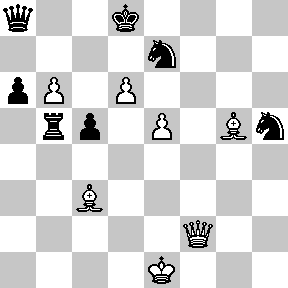
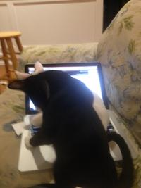
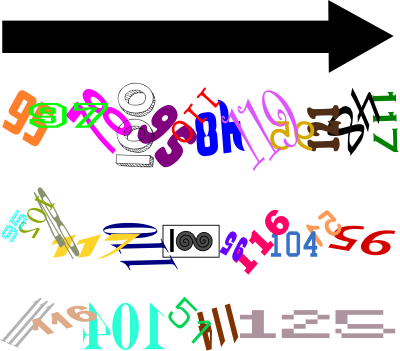

# CAMS CTF 2016

A Capture the Flag competition created by the California Academy of Mathematics and Science for middle and 
high school students.


## Overview

**URL:** http://play.camsctf.com/ (site will remain online)  
**Organisors:** CAMS CSC (http://www.camscsc.org/)  
**Duration:** 7 days  
**Team mates:** Liblor  

```
Title                         Category     Points  Flag
----------------------------- ------------ ------- -----------------------------
Askey I                       Crypto       50
Basic Decryption              Crypto       25      {b45ic_fl4g}
Black and White               Crypto       75
Dizziness                     Crypto       30
Gematria                      Crypto       50
Knock Knock                   Crypto       500
LeetZ                         Crypto       150
One-Zero-Zero                 Crypto       150
Stuck On Repeat I             Crypto       150
Stuck On Repeat II            Crypto       350
Eden 1                        Eden         25      {Mack Millan}
Eden 2                        Eden         25
Eden 3                        Eden         200
Eden 4                        Eden         200
Eden 5                        Eden         200
Eden 6                        Eden         200
Eden 7                        Eden         500
Eden 8                        Eden         100
Eden 9                        Eden         1500
Meow                          Exploitation 25      {scr4tch_c4t}
Overflow                      Exploitation 35
Web 1                         Exploitation 10
Web 2                         Exploitation 30
Web 3                         Exploitation 30      {variables_n_functionz}
Web 4                         Exploitation 50
Web 5                         Exploitation 50
Web 6                         Exploitation 50
Web 7                         Exploitation 50
Web 8                         Exploitation 100
Web 9                         Exploitation 100
Web A                         Exploitation 100
Web B                         Exploitation 100
Web C                         Exploitation 200
Web D                         Exploitation 200
Web E                         Exploitation 250
Web F                         Exploitation 250
Cropped                       Forensics    100
HI                            Forensics    25
Hideous                       Forensics    500
Huehuehue                     Forensics    25
Just a Bit                    Forensics    75
Numbers                       Forensics    25
Ocular Waves                  Forensics    200
Reversing 1                   Forensics    30       {not_encrypted_string_flag_whoooo}
Reversing 2                   Forensics    50
Reversing 3                   Forensics    75
Reversing 4                   Forensics    100
Reversing 5                   Forensics    150
Reversing 6                   Forensics    200
Reversing 7                   Forensics    250
Reversing 8                   Forensics    300
Reversing 9                   Forensics    400
Steggy                        Forensics    25
The Key                       Forensics    50
Troy Broke My TI              Forensics    100
Windows 1                     Forensics    0
Windows 2                     Forensics    50
Windows 3                     Forensics    50
Windows 4                     Forensics    50
Windows 5                     Forensics    50
Windows 6                     Forensics    50
Windows 7                     Forensics    50
Windows 8                     Forensics    200
Windows 9                     Forensics    50
Follow Directions             Misc         -5
Miscellaneous                 Misc         15
Trivia 1                      Misc         10
Trivia 2                      Misc         10
Trivia 3                      Misc         10
Trivia 4                      Misc         10
Trivia 5                      Misc         10
True CTF Player               Misc         100
Endianness                    Programming  25      {BIG_4nd_little_3nd14n}
La Strange                    Programming  100
Photo Synthesis 1             Programming  75
Photo Synthesis 2             Programming  125
Photo Synthesis 3             Programming  150
Pure Evil                     Programming  100     {19473563648}
To Understand Recursion       Programming  125
Easy Transportation           Recon        20      {alwayz_check_pasteb1n}
Metropolis                    Recon        50
```


## Crypto 50: Askey I  

**Challenge**  

Ask and ye shall receive. ASCII and ye shall d13.

[askey.txt](writeupfiles/askey.txt)

**Solution**  
**Flag**


## Crypto 25: Basic Decyption  

**Challenge**  

This should be easy.

```
JVWVK2DCK5MXQS3LIZBE2Q3TFNLVO5BQJVVVKN3CKR3XQUSWPBIVUU3TFNSFG53KJVVWY23BNVGXQWKTJJRU6Q3
TF5FW2ZCTJVCTSMKPNR2ECTL2GRTWKMTHGBGVOWRTLFMGYZTEI5TXUY3NKY4Q
```

**Solution**  

This involved several base conversions:

```
JVWVK2DCK5MXQS3LIZBE2Q3TFNLVO5BQJVVVKN3CKR3XQUSWPBIVUU3TFNSFG53KJVVWY23BNVGXQWKTJJRU6Q3TF5
FW2ZCTJVCTSMKPNR2ECTL2GRTWKMTHGBGVOWRTLFMGYZTEI5TXUY3NKY4Q

Base32 -> MmUhbWYxKkFBMCs+WWt0MkU7bTwxRVxQZSs+dSwjMklkamMxYSJcOCs/KmdSME91OltAMz4ge2g0MWZ3YXlfdGgzcmV9
Base64 -> 2e!mf1*AA0+>Ykt2E;m<1E\Pe+>u,#2Idjc1a"\8+?*gR0Ou:[@3> {h41fway_th3re}
Base85 -> 7b 62 34 35 69 63 5f 66 6c 34 67 7d 0d 0
Hex    -> {b45ic_fl4g}
```

Base32 decoder: http://emn178.github.io/online-tools/base32_decode.html  
Base85 decoder: https://www.tools4noobs.com/online_tools/ascii85_decode/  
Base64 and hex decoder: http://www.asciitohex.com/  

**Flag**

```
{b45ic_fl4g}
```


## Crypto 75: Black and White  

**Challenge**  

What if you could encode data into a chessboard? There are 8 rows and 8 columns. Rows are 0-7 and columns are 8-F. I'm smelling hex. 
Remember, white before black, and don't count queens or kings.



**Solution**  

**Flag**


## Crypto 30: Dizziness  

**Challenge**  

Are you getting dizzy?

```
CSECG.EESIH NLI NQMAIGINNA,UALSECEO AGL }_ WCIRIES.CA,IMENNA H RA.EGITA{ICG EDHLCMLITA. ILYAENH
```

**Solution**  
**Flag**


## Crypto 50: Gematria  

**Challenge**  

I heard that you can associate words with numbers. What about flags?

```
46327402297733105104468896449452312521697635735182434903808055110726686224509
```
( [gematria.txt](writeupfiles/gematria.txt) )

**Solution**  
**Flag**


## Crypto 500: Knock Knock  

**Challenge**  

The LG Knock Code™ (http://www.lg.com/us/mobile-phones/knockcode) is pretty convenient. 
It boasts an impressive 86,367 unique combinations. But just how easy is it get into a 
phone that is secured using this system? The flag is in the format {answer}.

[knock.7z](writeupfiles/knock.7z)

**Solution**  
**Flag**


## Crypto 150: LeetZ  

**Challenge**  

`Br0, d0 y0u 3v3n 5p34k l33t? C4n't g3t 4ny b3tt3r th4n th15. 0r 5m4113r.`

**Solution**  

```
81 19 86 B0 60 0E 20 DE 08 5E 10 CB 80 09 00 C6 2D 60 1C 80 E0 04 01 66 0C 
59 00 DF 01 8C 20 63 01 4F 80 7C
```
( [leet.txt](writeupfiles/leet.txt) )

**Flag**

## Crypto 150: One-Zero-Zero  

**Challenge**  

Rebel leader Brad Turk has sent a message of the first strike on the United States to Lora Sum, 
a sleeper agent. Before the message got to her, the NSA has intercepted the message as 16 chunks; 
however, it was encrypted via RSA. In unrelated news, the Navy SEALS have extracted a public key 
from a soldier in Turk's militia.

[one-zero-zero.zip](writeupfiles/one-zero-zero.zip)

**Solution**  
**Flag**


## Crypto 150: Stuck on Repeat I  

**Challenge**  

Have a bite. Repeat.

```
393a72301d3a2d301d1a0d101d1a0d103f
```

( [repeat1.txt](writeupfiles/repeat1.txt) )


**Solution**  
**Flag**


## Crypto 350: Stuck on Repeat II  

**Challenge**  

Get the key length first.

```
2e4b1a27302a5d44e131d223633415c84710242b795b404b56128292c475b1d56592437795d414b5259272a3e5d51a5f5924353c
46531f5a1625652d5c531f13163e312941461813d39303c145d55f06b3231515c4b5a173b302d4712f5a1f2d202b141a45d1c6b2
c2a144619461c67652d5c574b5cd23202b145b18131f2a292a511b4513303f65304712184a14292a355d48e5759293c79405ae13
939203f5d4a4b5c92e3738405d1913336b2437501294a593f2d3c145b5551033653644571952d24372a1449337c2b142036666de
6b49393877
```

([repeat2.txt](writeupfiles/repeat2.txt))

**Solution**  
**Flag**


## Eden Eden 1-9

**Challenge**  

You are about to embark on a series of non-linear challenges. This set of challenges simulates a real-world 
investigation. Although it is not something you may be used to, you will find that many aspects are 
relatively simple. There may be multiple ways to reach one solution. This challenge encompasses all 
categories. You may engage (view, access, download) any additional resources you find along the way. 
Good luck. (You're not expected to solve Eden 9. It's hard.)

An investigator approached CAMS CSC via social media regarding the supposed suicide of Eden Sterling. 
What is his name? For reference, all flags should be submitted in the format of {answer}.


- 2: Who sent the Anonymous note? Answer in the format of {name}.  
- 3: What are the credentials of Eden's social media account? Submit your answer as {Username|Password}.
- 4: What is the password to Alice's Laptop?  
- 5: What is Bruce's password (to like everything)?
- 6: What are the credentials to the NO. CO. site?
- 7: SHA-1 hash Eden's note about Alice.
- 8: What day was the oldest transaction logged? Answer in the format of {mm/dd/yyyy}.
- 9: The death of Eden Sterling remains a mystery. Find the confession letter. Obtain a SHA-1 hash of the body of the letter. Submit in the format of {hash}.


**Solution**  

We go to the CAMS CSC [Facebook group](https://www.facebook.com/groups/1418538045055499/) and find a post:

```
Hello CCTF Competitors.
My name is Mack Millan and I am the lead forensics investigator in the case of Eden Sterling. 
You must have heard the tragic suicide of Eden Sterling by now. He was found dead outside of his 
house. From what my team could recover, it appears that Eden climbed onto the roof of his three 
story house and jumped at night. I understand that the whole situation is very unsettling. 
If you didn't know, Eden was a really talented programmer at Hacker High School. He always had 
the top scores in his class. However, earlier today, my team received an anonymous tip-off email 
with a suspiciously large PDF attachment. We were explicitly told to not open the attachment and 
to pass the attachment onto your team. You probably know that my team is composed of biology and 
chemistry major graduates. We are clueless when it comes to digital forensics and it appears that 
this investigation will now need to go digital. I cannot provide you with much to start your investigation, 
considering that the censorious principal of Hacker High School does not want us to question the students 
too much and that Eden's parents would not permit further analysis of his personal items (laptops, 
cell phones, etc.). All we have is the suspicious attachment.
Good luck, and be careful.
```

attachment on Google Drive: [attachment.pdf](https://drive.google.com/file/d/0B-TVTxo5SGFqTUJSMjR1LWthMWM/view)

The pdf just appears to say: 

```
Eden Sterling did not commit suicide. I have proof.
```

but it is 74 MB so there must be more to it..

we use binwalk and find a disk image `Eden_Drive.dd`

```
$ binwalk -e attachement.pdf
```

(the image file was in an archive named 93)

We get some info on the image:

```
$ fdisk -l Eden_Drive.dd 

Disk Eden_Drive.dd: 211 MB, 211812352 bytes
255 heads, 63 sectors/track, 25 cylinders, total 413696 sectors
Units = sectors of 1 * 512 = 512 bytes
Sector size (logical/physical): 512 bytes / 512 bytes
I/O size (minimum/optimal): 512 bytes / 512 bytes
Disk identifier: 0x2c48cb12

        Device Boot      Start         End      Blocks   Id  System
Eden_Drive.dd1            2048      206847      102400   af  HFS / HFS+
Eden_Drive.dd2          208896      413695      102400    7  HPFS/NTFS/exFAT

```

We use the mmls tool from [sleuthkit](http://www.sleuthkit.org/) suite to get more information about the partitions:

```
$  mmls Eden_Drive.dd 
DOS Partition Table
Offset Sector: 0
Units are in 512-byte sectors

     Slot    Start        End          Length       Description
00:  Meta    0000000000   0000000000   0000000001   Primary Table (#0)
01:  -----   0000000000   0000002047   0000002048   Unallocated
02:  00:00   0000002048   0000206847   0000204800   ShagOS swap (0xaf)
03:  -----   0000206848   0000208895   0000002048   Unallocated
04:  00:01   0000208896   0000413695   0000204800   NTFS (0x07)

```

We want to mount the NTFS partition, so we calculate the offset: `512*208896 = 106954752` and mount the partition:

```
$ mkdir edendisk
$ sudo mount -t ntfs -o ro,loop,offset=106954752 Eden_Drive.dd edendisk/
```

The disk partition contains a great number of files:

```
$ tree edendisk
edendisk/
├── my_cad
│   ├── 1045864.STEP
│   ├── 1139645.STEP
│   ├── 1213658.STEP
│   ├── 1336030.STEP
│   ├── 1494035.STEP
│   ├── 1585134.STEP
│   ├── 1686521.STEP
│   ├── 1754431.STEP
│   ├── 1946386.STEP
│   ├── 2026130.STEP
│   ├── 2037562.STEP
│   ├── 2046277.STEP
│   ├── 2188500.STEP
│   ├── 2223224.STEP
│   ├── 2384444.STEP
│   ├── 2396491.STEP
│   ├── 2413717.STEP
│   ├── 2606878.STEP
│   ├── 2652057.STEP
│   ├── 2694442.STEP
│   ├── 2703861.STEP
│   ├── 2900241.STEP
│   ├── 2900510.STEP
│   ├── 2929189.STEP
│   ├── 3126812.STEP
│   ├── 3214154.STEP
│   ├── 3242066.STEP
│   ├── 3266025.STEP
│   ├── 3368181.STEP
│   ├── 3381193.STEP
│   ├── 3420797.STEP
│   ├── 3772576.STEP
│   ├── 3792521.STEP
│   ├── 4064326.STEP
│   ├── 4070493.STEP
│   ├── 4087196.STEP
│   ├── 4136594.STEP
│   ├── 4162252.STEP
│   ├── 4184339.STEP
│   ├── 4187988.STEP
│   ├── 4202563.STEP
│   ├── 4285629.STEP
│   ├── 4290978.STEP
│   ├── 4300336.STEP
│   ├── 4417583.STEP
│   ├── 4617387.STEP
│   ├── 4723292.STEP
│   ├── 4870904.STEP
│   └── 4965094.STEP
├── my_music
│   ├── 1017698.wav
│   ├── 1118713.wav
│   ├── 1168602.wav
│   ├── 1324428.wav
│   ├── 1413853.wav
│   ├── 1416565.wav
│   ├── 1439228.wav
│   ├── 1452938.wav
│   ├── 1567101.wav
│   ├── 1660833.wav
│   ├── 1800392.wav
│   ├── 1811845.wav
│   ├── 1819286.wav
│   ├── 1843443.wav
│   ├── 1935533.wav
│   ├── 1960170.wav
│   ├── 2097917.wav
│   ├── 2109467.wav
│   ├── 2227156.wav
│   ├── 2257164.wav
│   ├── 2261843.wav
│   ├── 2375502.wav
│   ├── 2409017.wav
│   ├── 2728326.wav
│   ├── 2822931.wav
│   ├── 2824766.wav
│   ├── 2863473.wav
│   ├── 2969162.wav
│   ├── 2985877.wav
│   ├── 3040878.wav
│   ├── 3054116.wav
│   ├── 3110760.wav
│   ├── 3126203.wav
│   ├── 3361685.wav
│   ├── 3906566.wav
│   ├── 3973622.wav
│   ├── 4104038.wav
│   ├── 4166642.wav
│   ├── 4331200.wav
│   ├── 4454300.wav
│   ├── 4577266.wav
│   ├── 4630746.wav
│   ├── 4831722.wav
│   ├── 5069216.wav
│   ├── 5072085.wav
│   ├── 5263327.wav
│   ├── 5458383.wav
│   ├── 5474132.wav
│   ├── 5924645.wav
│   ├── 5938700.wav
│   ├── 5988780.wav
│   ├── 6061164.wav
│   ├── 6136516.wav
│   ├── 6197965.wav
│   ├── 6322556.wav
│   ├── 6490368.wav
│   ├── 6551208.wav
│   ├── 6747635.wav
│   ├── 6967522.wav
│   ├── 7150279.wav
│   ├── 7232427.wav
│   ├── 7339152.wav
│   ├── 7447622.wav
│   ├── 7496017.wav
│   ├── 7629224.wav
│   ├── 7636861.wav
│   ├── 7700862.wav
│   ├── 7759550.wav
│   ├── 7820263.wav
│   ├── 8042680.wav
│   ├── 8072907.wav
│   ├── 8213191.wav
│   ├── 8292534.wav
│   ├── 8335321.wav
│   ├── 8349643.wav
│   ├── 8833076.wav
│   ├── 8849853.wav
│   ├── 8858512.wav
│   ├── 9059620.wav
│   ├── 9061068.wav
│   ├── 9083635.wav
│   ├── 9197374.wav
│   ├── 9242018.wav
│   ├── 9446783.wav
│   ├── 9533984.wav
│   ├── 9579665.wav
│   ├── 9685229.wav
│   ├── 9927001.wav
│   └── 9979034.wav
├── my_stuff
│   ├── 1073084.jpg
│   ├── 1088668.pdb
│   ├── 1222583.h
│   ├── 1389705.dmp
│   ├── 1489733.ico
│   ├── 1650548.xcscheme
│   ├── 1745721.db
│   ├── 1754152.fbxexportpreset
│   ├── 2071823.assets
│   ├── 2072910.sav
│   ├── 2109910.plist
│   ├── 2113038.zip
│   ├── 2126428.full
│   ├── 2502803.pdb
│   ├── 2511073.gif
│   ├── 2572513.a
│   ├── 2604029.cfg
│   ├── 2737578.user
│   ├── 2784752.browser
│   ├── 2815108.vmsd
│   ├── 2852739.udd
│   ├── 2880990.awk
│   ├── 2890848.dmp
│   ├── 2958610.wpk
│   ├── 3044649.fbx
│   ├── 3091635.cfg
│   ├── 3283920.so
│   ├── 3289574.db
│   ├── 3385731.html
│   ├── 3450899.cooked
│   ├── 3485916.cab
│   ├── 3525293.sln
│   ├── 3571095.ini
│   ├── 3599867.jpg
│   ├── 3605119.dds
│   ├── 3750565.so
│   ├── 3899228.py
│   ├── 4218225.cfg
│   ├── 4344195.lut
│   ├── 4374862.cooked
│   ├── 4411844.browser
│   ├── 4443268.userprefs
│   ├── 4462644.h
│   ├── 4635923.xcf
│   ├── 4717920.user
│   ├── 4721180.das
│   ├── 4723306.pdf
│   └── 5007842.cs
└── secret.docx

```

The file extensions in the `my_stuff` directory are almost all wrong:

```
$ file my_stuff/*
my_stuff/1073084.jpg:             Java Jar file data (zip)
my_stuff/1088668.pdb:             ASCII text, with CRLF line terminators
my_stuff/1222583.h:               dBase IV DBT of \336\007.DBF, blocks size 2972948057, next free block index 19717
my_stuff/1389705.dmp:             data
my_stuff/1489733.ico:             data
my_stuff/1650548.xcscheme:        ELF 64-bit LSB  shared object, x86-64, version 1 (SYSV), dynamically linked, BuildID[sha1]=d1aef3c08975f083f9140fafd8940fd6a219d125, not stripped
my_stuff/1745721.db:              MS Windows icon resource - 9 icons, 32-colors
my_stuff/1754152.fbxexportpreset: ASCII text, with CRLF line terminators
my_stuff/2071823.assets:          ASCII text
my_stuff/2072910.sav:             Blender3D, saved as 64-bits little endian with version 2.72
my_stuff/2109910.plist:           SysEx File - Teac
my_stuff/2113038.zip:             POSIX shell script, ASCII text executable
my_stuff/2126428.full:            Microsoft Cabinet archive data, 5084876 bytes, 299 files
my_stuff/2502803.pdb:             Microsoft Word 2007+
my_stuff/2511073.gif:             C source, ASCII text
my_stuff/2572513.a:               PC bitmap, Windows 3.x format, 32 x 32 x 24
my_stuff/2604029.cfg:             MS Windows icon resource - 9 icons, 32-colors
my_stuff/2737578.user:            data
my_stuff/2784752.browser:         ASCII text, with CRLF, LF line terminators
my_stuff/2815108.vmsd:            ASCII text
my_stuff/2852739.udd:             Python script, ASCII text executable
my_stuff/2880990.awk:             XML document text
my_stuff/2890848.dmp:             C++ source, ASCII text
my_stuff/2958610.wpk:             PE32 executable (DLL) (GUI) Intel 80386, for MS Windows
my_stuff/3044649.fbx:             PNG image data, 851 x 315, 8-bit/color RGB, interlaced
my_stuff/3091635.cfg:             XML document text
my_stuff/3283920.so:              data
my_stuff/3289574.db:              DOS batch file, ASCII text
my_stuff/3385731.html:            ELF 32-bit LSB  shared object, ARM, EABI5 version 1 (SYSV), dynamically linked, not stripped
my_stuff/3450899.cooked:          Microsoft DirectDraw Surface (DDS), 512 x 256, DXT1
my_stuff/3485916.cab:             data
my_stuff/3525293.sln:             MS Windows icon resource - 1 icon
my_stuff/3571095.ini:             Composite Document File V2 Document, Little Endian, Os: Windows, Version 5.1, Code page: 0, Last Printed: 7/1/1999 5:17, Create Time/Date: 7/1/1999 5:17, Last Saved Time/Date: Tue May  6 17:48:56 2003, Number of Pages: 200, Number of Words: 2, Number of Characters: 0, Name of Creating Application: Wise for Windows Installer 4.2 - Professional Edition, Security: -1, Title: Backburner, Subject: Backburner, Author: Autodesk, Keywords: Backburner, Comments: Backburner, Template: ;1033, Last Saved By: Autodesk, Revision Number: {D78553C2-FE7E-47B5-B569-C549A08BDCAA}
my_stuff/3599867.jpg:             XML document text
my_stuff/3605119.dds:             GIMP XCF image data, version 0, 851 x 315, RGB Color
my_stuff/3750565.so:              MS Windows icon resource - 13 icons, 48x48, 16-colors
my_stuff/3899228.py:              Composite Document File V2 Document, No summary info
my_stuff/4218225.cfg:             data
my_stuff/4344195.lut:             GIF image data, version 89a, 213 x 237
my_stuff/4374862.cooked:          PNG image data, 57 x 57, 8-bit/color RGB, non-interlaced
my_stuff/4411844.browser:         C++ source, ASCII text, with CRLF line terminators
my_stuff/4443268.userprefs:       Composite Document File V2 Document, Little Endian, Os: Windows, Version 5.1, Code page: 1252, Title: Spanish 3-4, Author: cpaus, Template: Normal, Last Saved By: CPaus, Revision Number: 3, Name of Creating Application: Microsoft Office Word, Total Editing Time: 18:00, Last Printed: Tue May 17 22:22:00 2011, Create Time/Date: Fri May 10 00:04:00 2013, Last Saved Time/Date: Fri May 10 00:29:00 2013, Number of Pages: 1, Number of Words: 1680, Number of Characters: 9579, Security: 0
my_stuff/4462644.h:               PE32 executable (DLL) (GUI) Intel 80386, for MS Windows
my_stuff/4635923.xcf:             Little-endian UTF-16 Unicode text, with CRLF, CR line terminators
my_stuff/4717920.user:            ASCII text, with CRLF line terminators
my_stuff/4721180.das:             HTML document, ASCII text
my_stuff/4723306.pdf:             data
my_stuff/5007842.cs:              MS Windows icon resource - 6 icons, 16x16, 256-colors
```


**Flag**

```
1: {Mack Millan}
2:
3:
4:
5:
6:
7:
8:
9:
```


## Exploitation: Meow  

**Challenge**  

My (friend) mom's foster kittens accidentally encrypted my Scratch project. :( 



```
http://scratch.mit.edu/projects/embed/BCGAIDBB/?autostart=false
```

**Solution**  

There is a link embedded but it returns a 404:

```
http://scratch.mit.edu/projects/embed/BCGAIDBB/?autostart=false
```

we fnd out that all projects have a numberical identifier, so we translate using `A=1,B=2 etc`

```
https://scratch.mit.edu/projects/embed/23719422/
```

which is a valid link. we play the project and see a bunch of kittens dancing on top of our flag, but when we pause it we
see the flag


**Flag**

```
{scr4tch_c4t}
```


## Exploitation 35: Overflow  

**Challenge**  

I won't let have the flag unless you can guess my password.

[1](writeupfiles/1)

**Solution**  

```
$ file 1
1: ELF 64-bit LSB  executable, x86-64, version 1 (SYSV), dynamically linked (uses shared libs), 
for GNU/Linux 2.6.32, BuildID[sha1]=810e5bed7882ada63f567b5bbf7d9ea16782ca94, not stripped


$ strings 1
[..]
AWAVA
AUATL
[]A\A]A^A_
15kjagkhakganwgknangwajkg3iu5y1825618y5h1fknanfjwkh1481
Sorry, that's not right.
{0veRf1000000000000000000000000000000000000000000000w
;*3$"
GCC: (Debian 5.3.1-8) 5.3.1 20160205
crtstuff.c
[..]
```

**Flag**

```
{0veRf1000000000000000000000000000000000000000000000w}
```

## Exploitation 10: Web 1  

**Challenge**  

C4pt4in Troll thinks he has a really secure website. Go hack his site. We will reward you points in 
exchange for his secret flags. Note that all web flags are submitted in the format {answer}.

http://web.camsctf.com/1

**Solution**  
**Flag**

## Exploitation 30: Web 2  

**Challenge**  

You're probably thinking too hard about this.

http://web.camsctf.com/2

**Solution**  
**Flag**

## Exploitation 30: Web 3  

**Challenge**  

You're probably thinking even harder about this one.

http://web.camsctf.com/3

**Solution**  
**Flag**

## Exploitation 50: Web 4  

**Challenge**  

Note: C4pt4in Troll is not particularly good at coding JavaScript. 
He did tell me that his password can be found using the function bar( 'barr' );, except his code doesn't actually work.

http://web.camsctf.com/4

**Solution**  

The script in the html is:

```javascript
var a = "b";
var b = "a";

function bar(barr) {
    return barr(barr) + a + b + c + barr(barr);
}

function barr() {
    return "k";
}
var c = "r";
```

we reduce this to make it more readable
```
function bar(barr) {
    return "k" +"b" + "a" + "r" + "k";
}
```

so we see that `kbark` is always returned if you run funtion `bar()`

We enter that into the password field to get our real flag

```
Flag: variables_n_functionz
```

**Flag**

```
{variables_n_functionz}
```

## Exploitation 50: Web 5  

**Challenge**  

He is nice. He even gave you the password.
http://web.camsctf.com/5

**Solution**  
**Flag**

## Exploitation 50: Web 6  

**Challenge**  

My sugar tooth is pinging.

http://web.camsctf.com/6

**Solution**  
**Flag**

## Exploitation 50: Web 7    

**Challenge**  

I remember the good old times when all passwords were the same.

http://web.camsctf.com/7

**Solution**  
**Flag**

## Exploitation 100: Web 8    

**Challenge**  

We didn't think C4pt4in Troll could get any better at coding. He did.

http://web.camsctf.com/8

**Solution**  
**Flag**

## Exploitation 100: Web 9    

**Challenge**  

Blindness is not a natural trait, rather a skill developed over time.

http://web.camsctf.com/9

**Solution**  
**Flag**

## Exploitation 100: Web A    

**Challenge**  

Quite a lengthy way to do one thing.

http://web.camsctf.com/10

**Solution**  
**Flag**

## Exploitation 100: Web B    

**Challenge**  

There is nothing sweet about a Jelly and Sandwich cookie.

http://web.camsctf.com/11

**Solution**  
**Flag**

## Exploitation 200: Web C    

**Challenge**  

Ah, the art of looking back on what you have accomplished.

http://web.camsctf.com/12

**Solution**  
**Flag**

## Exploitation 200: Web D    

**Challenge**  

Right this way.

http://web.camsctf.com/13

**Solution**  
**Flag**

## Exploitation 250: Web E    

**Challenge**  

Ha. Ha. Ha.

http://web.camsctf.com/14

**Solution**  
**Flag**

## Exploitation 250: Web F    

**Challenge**  

Ah, the dreaded login screen.

http://web.camsctf.com/15

**Solution**  
**Flag**


## Forensics 100: Cropped    

**Challenge**  

No one solved this challenge the way it was intended last year. Did I know that Photoshop sticks text layer names into the EXIF data? Nope. But I used paint this time. Problem solved.


**Solution**  
**Flag**

## Forensics 25: HI    

**Challenge**  

HI!

[HI](writeupfiles/HI)

**Solution**  
**Flag**

## Forensics 500: Hideous  

**Challenge**  

Did you know that touchscreens, fingerprint scanners, joysticks, pointing devices, and even the Wii Remote all fall into the same category? Did you know that the title contains a hint to this challenge?

[hideous.pcap](writeupfiles/hideous.pcap)

**Solution**  
**Flag**


## Forensics 25: HueHueHue 

**Challenge**  

What can you find before he finds a place in your heart?


**Solution**  
**Flag**


## Forensics 75: Just a Bit 

**Challenge**  

Something is a bit off about this...


**Solution**  
**Flag**

## Forensics 25: Numbers  

**Challenge**  

"A picture is worth a thousand words."



**Solution**  

```
$ strings numbers.png
[..]
\YD 
c}K**+
Y4)H
A*ft
kIf;
IEND
{y0u_f0uNd_th3_1st_p4rt
```

so we need to find more parts, hmm..

```
$ pngcheck numbers.png 
numbers.png:  invalid chunk name "" (00 00 49 45)
ERROR: numbers.png
```

**Flag**

```
{y0u_f0uNd_th3_1st_p4rt
```

## Forensics 200: Ocular Waves  

**Challenge**  

Here's a file. Look deep within. Very deep. Then... see it.

time

(file too big to include here)

**Solution**  

```
$ file time 
time: KGB Archiver file with compression level 7
```

**Flag**


## Forensics 30: Reversing 1  

**Challenge**  

Each exe contains a flag. Find it. Sound easy? We can assure you it isn't.
A reminder that all flags are submitted in the {flag} format.

[1.exe](writeupfiles/1.exe)

**Solution**  

```
strings 1.exe

[..]
SSSSS
=H.A
j@%@
=H.A
not_encrypted_string_flag_whoooo
Stop over thinking
The flag is somewhere in this program.
CorExitProcess
FlsAlloc
FlsFree
FlsGetValue
[..]
```
**Flag**

```
{not_encrypted_string_flag_whoooo}
```

## Forensics 50: Reversing 2  

**Challenge**  

Make 42424242 bigger.

[2.exe](writeupfiles/2.exe)


## Forensics 50: Reversing 3    

**Challenge**  

It's easy, but easy if often hard.

[3.exe](writeupfiles/3.exe)

**Solution**  
**Flag**

## Forensics 50: Reversing 4  

**Challenge**  

It responds well to debugging. Maybe it also wants something larger than 424242.

[4.exe](writeupfiles/4.exe)

**Solution**  
**Flag**

## Forensics 50: Reversing 5  

**Challenge**  

The suffering begins here.

[5.exe](writeupfiles/5.exe)

**Solution**  
**Flag**

## Forensics 50: Reversing 6  

**Challenge**  

`3. 2. 1. Crash.`

[6.exe](writeupfiles/6.exe)

**Solution**  
**Flag**

## Forensics 50: Reversing 7  

**Challenge**  

This is going to be fun.

[7.exe](writeupfiles/7.exe)

**Solution**  
**Flag**

## Forensics 50: Reversing 8  

**Challenge**  

Pain, times 100.

[8.exe](writeupfiles/8.exe)

**Solution**  
**Flag**

## Forensics 50: Reversing 9  

**Challenge**  

You will never, ever, ever, ever, ever, ever, ever, ever, ever solve this challenge.

[9.exe](writeupfiles/9.exe)

**Solution**  
**Flag**

## Forensics 25: Steggy  

**Challenge**  

Oh no! Something wrong happenned to the source text of the Stegosaurus article on Wikipedia!
Hint: wbStego4

[steggy.txt](writeupfiles/steggy.txt)

**Solution**  
**Flag**

## Forensics 50: The Key  

**Challenge**  

The flag is in this exe.

[flag.exe](writeupfiles/flag.exe)

**Solution**  
**Flag**

## Forensics 100: Troy Broke My TI  

**Challenge**  

I've written a program to print out the flag on my TI. However, someone under the alias of "hoyitstroy" 
stole the code and messed it up. Can you help me find the flag?

P.S.: "hoyitstroy" likes to troll. Be cautious when looking for the flag. It may or may not be obvious. 
The flag is in the format {answer}.

[ti.zip](writeupfiles/ti.zip)


**Solution**  
**Flag**

## Forensics 50:  Windows 1

**Challenge**  

Welcome to a series of fun Windows challenges that will bring back memories of your childhood. 
There are 9 parts to this challenge, all solvable on a single Virtual Machine. For reference, 
all flags should be submitted in {flag} format. However, they do not necessarily have braces 
when you find them.

Discover the name of the "annoying" file messing up your mouse in User's account.

[Google Drive](https://drive.google.com/file/d/0B-TVTxo5SGFqa0hPbWp0bXN3NnM/view?usp=sharing) | [DropBox](https://www.dropbox.com/s/umm3d9z43sr9qu0/XP_Machine.7z?dl=0) | Password: xp_challenge_123

**Solution**  
**Flag**

## Forensics 50:  Windows 2

**Challenge**  

Retrieve the password to Data_storage's account.

**Solution**  
**Flag**

## Forensics 50:  Windows 3

**Challenge**  

What is the file-name of Troy Daley's photo?

**Solution**  
**Flag**

## Forensics 50:  Windows 4

**Challenge**  

What does Merlin want?

**Solution**  
**Flag**

## Forensics 50:  Windows 5

**Challenge**  

Locate a flag, anywhere.

**Solution**  
**Flag**

## Forensics 50:  Windows 6

**Challenge**  

Stop that shutdown! And find the flag.

**Solution**  
**Flag**

## Forensics 50:  Windows 7 

**Challenge**  

Find Michael Johanis! He is 17047 bytes!

**Solution**  
**Flag**

## Forensics 200:  Windows 8  

**Challenge**  

"Find" administrator's password.

**Solution**  
**Flag**

## Forensics 50:  Windows 9

**Challenge**  

Find the flag on administrator's desktop!

**Solution**  
**Flag**


Follow Directions-5
Miscellaneous 15
Trivia 110
Trivia 210
Trivia 310
Trivia 410
Trivia 510
True CTF Player100


## Miscellaneous -5: Follow Directions   

**Challenge**  

This challenge is designed to test how well you follow directions. The flag is 'flag'. 
We ask that you do not solve this challenge. Remember, happy solving!

**Solution**  
**Flag**

## Miscellaneous 5: Miscellaneous 

**Challenge**  

It's back. It's also better. No file this time.

**Solution**  
**Flag**

## Miscellaneous 10: Trivia 1  

**Challenge**  

What is the instruction set that was first to be 32 bit?

**Solution**  
**Flag**

## Miscellaneous 10: Trivia 2    

**Challenge**  

What is the antivirus software that Adobe tries to install when downloading Flash?

**Solution**  
**Flag**

## Miscellaneous 10: Trivia 3  

**Challenge** 

What is the default Kali web browser?

**Solution**  
**Flag**

## Miscellaneous 10: Trivia 4    

**Challenge**  

What ecommerce site from China recently started trading on the NYSE?

**Solution**  
**Flag**

## Miscellaneous 10: Trivia 5    

**Challenge**  

Who develops the CryEngine?

**Solution**  
**Flag**


## Miscellaneous 100: True CTF Player     

**Challenge**  

Are you a true CTF player?
Hint: Computers can stay up all night.

**Solution**  
**Flag**


## Programming 25: Endianness  

**Challenge**  

I got this from my friend's cool antique big endian computer and it made sense there...

[endian.txt](writeupfiles/endian.txt)

**Solution**  

This one threw me for a loop a bit, because it wasn't the order of the bytes that was reversed, but the order of the bits within each byte..

```
$ python
>>> from bitarray import bitarray
>>> a=bitarray(endian='little')
>>> a.frombytes(open('endian.txt','r').read())
>>> print a
bitarray('0111101101000010010010010100011101011111001101000110111001100100010111110110110001101
001011101000111010001101100011001010101111100110011011011100110010000110001001101000110111001111101')
```

translating the bitstring to ascii gives us the flag

**Flag**

```
{BIG_4nd_little_3nd14n}
```


## Programming 100: La Strange  

**Challenge**  

You know what's strange? Random coordinates. Stranger? Eighteenth-century algebra.

[data.txt](writeupfiles/data.txt)

**Solution**  
**Flag**


## Programming 75: Photo Synthesis 1  

**Challenge**  

My 2D photo has lost one of its dimensions!

[photosynthesis1.png](writeupfiles/photosynthesis1.png)

**Solution**  

Our image is only a single pixel in height:

```
$ exiftool photosynthesis1.png 
ExifTool Version Number         : 9.46
File Name                       : photosynthesis1.png
Directory                       : .
File Size                       : 90 kB
File Modification Date/Time     : 2016:03:24 21:57:36+01:00
File Access Date/Time           : 2016:03:24 21:57:38+01:00
File Inode Change Date/Time     : 2016:03:24 21:57:36+01:00
File Permissions                : rwxrwxrwx
File Type                       : PNG
MIME Type                       : image/png
Image Width                     : 55440
Image Height                    : 1
Bit Depth                       : 8
Color Type                      : RGB
Compression                     : Deflate/Inflate
Filter                          : Adaptive
Interlace                       : Noninterlaced
Image Size                      : 55440x1
```

we see that the image dimensions are 55440x1 pixels. We write a program that tries every combination of width 
and height that also has a total of 55440 pixels, and reshape the image

```python
from PIL import Image

def divisors(number):
    divs = []
    n = 1
    while(n<number):
        if(number%n==0):
            divs.append(n)
        else:
            pass
        n += 1
    divs.append(number)
    return divs
    
d= divisors(55440)
print d
 
img = Image.open('photosynthesis1.png')
pixels_orig = img.load()
(w,h)=img.size
print(w,h)

#try all diffferent aspect ratios for image
count=-1
for divisor in range(1,len(d)):
    count += 1
    width = d[divisor]
    height = 55440/width

    outimg = Image.new( 'RGB', (width,height), "white") 
    pixels_out = outimg.load()     
    
    for j in range(0,w):
        row = j/width
        column = j%width
        (r,g,b) = pixels_orig[j,0]
        pixels_out[column,row] = (r,g,b)
          
    
    outimg.save("photosynthesis_out"+str(count)+".png","png") 
```

and our flag is in the image with dimensions `308x180`:


**Flag**

```
{C6H12O6}
```

## Programming 125: Photo Synthesis 2  

**Challenge**  
Can you synthesize this photo?

photosynthesis2.zip

(file too big to include here)

**Solution**  

The zip file contained some 170,000 odd png images..

**Flag**


## Programming 150: Photo Synthesis 3  

**Challenge**  

Hmmmm....its not even a photo anymore. I'm sure you can synthesize one.

[photosynthesis3.txt](writeupfiles/photosynthesis3.txt)

**Solution**  
**Flag**


## Programming 100: Pure Evil 

**Challenge**  

What is the sum of all ten-digit positive palindromic integers that have a factor of the first five-digit power of 2?
The flag is in the format {answer}.

**Solution**  

first five-digit power of 2 is `2^14 = 16384`

```python
factor=16384

done=False
count=0
total = 0
while not done:
    count += 1
    number = factor*count
    if len(str(number)) == 10:
        reverse = str(number)[::-1]
        if str(number) == reverse:
            print "ten-digit palindrome number found: "+str(number)
            total += number
    if len(str(number)) > 10:
        done = True

print "sum: "+str(total)
```

which outputs:

```
ten-digit palindrome number found: 2137997312
ten-digit palindrome number found: 4285005824
ten-digit palindrome number found: 6505005056
ten-digit palindrome number found: 6545555456
sum: 19473563648
```

**Flag**

```
{19473563648}
```

## Programming 125: To Understand Recursion  

**Challenge**  

You must first understand recursion. 

Hint: 54686520666C616720636F6E7369737473206F662031372063686172616374657273

`recursive.txt`

(file too  big to include here)

**Solution**  

The file was a 500 MB file with..

**Flag**


## Recon 20: Easy Transportation  

**Challenge**  

How does one easily transport data?

```
mYH99GB2
```

**Solution**  

This was a pastebin identifier, and `http://pastebin.com/mYH99GB2` contained the flag

**Flag**

```
{alwayz_check_pasteb1n}
```

## Recon 50: Metropolis  

**Challenge**  

Legendary hacker Lujing Cen goes by a pseudonym. He also likes video games. 
What's his favorite game?

Separate the pseudonym and the game (ID) by a vertical pipe ("|").For example, if the pseudonym 
is 'alice' and the game is '1', the flag would be `{alice|1}`

**Solution**  
**Flag**

