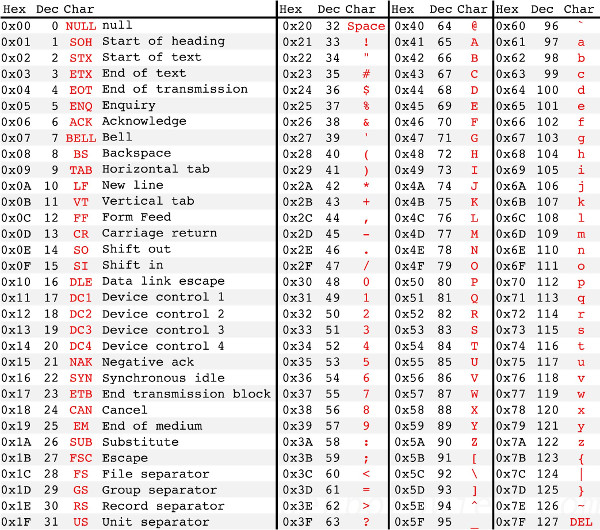
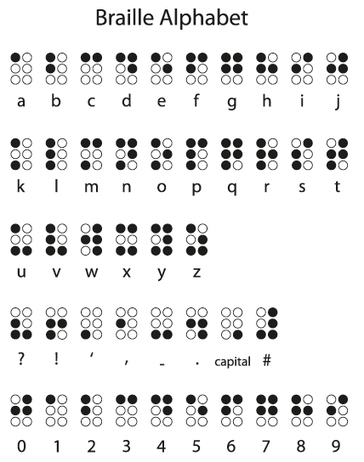
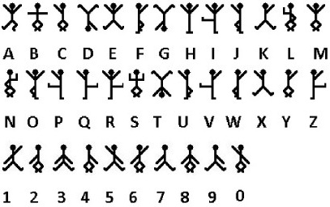

# CTF Resources (WIP)

List of useful tools and online resources for CTF challenges. WIP.

## CTFs

List of past and upcoming CTF events:

[https://ctftime.org/](https://ctftime.org/)

Collection of writeups of past events (for large number of events and teams):

[https://github.com/ctfs/](https://github.com/ctfs/)


## Overview

This document contains links to tools, documentation, and tips and tricks for each of the following categories:

- General
- Forensics
- Cryptography
- Steganography
- Binary Exploit/Reversing
- Programming
- Web
- Network
- Audio
- File Formats
- Misc


## General 

**Tools**  

Hex/ASCII/Binary/Base64/Decimal/ROT13 conversions: [http://www.asciitohex.com/](http://www.asciitohex.com/)  
Base64 decoder for non-ascii outputs: [http://www.motobit.com/util/base64-decoder-encoder.asp](http://www.motobit.com/util/base64-decoder-encoder.asp)  
Base32 decoder : [http://tomeko.net/online_tools/base32.php?lang=en](http://tomeko.net/online_tools/base32.php?lang=en)  
Base85 decoder : http://tools.web-max.ca/encode_decode.php  
Binary-to-text encodings: https://en.wikipedia.org/wiki/Binary-to-text_encoding  

QR-code & other barcodes decoder: [http://www.onlinebarcodereader.com/](http://www.onlinebarcodereader.com/)  

Ascii table:  



## Cryptography

**Tools**  

*Classical*  
Geocaching Toolbox (many classic crypto decoders): [http://www.geocachingtoolbox.com/index.php](http://www.geocachingtoolbox.com/index.php)  
Substitution Cipher Fiddle: http://ba.net/util/cipher2/cipher.html  
Substitution Cipher Autosolver: http://www.quipqiup.com/index.php  
ROT cipher (caesar) decoder (outputs all possible rotations): [http://planetcalc.com/1434/](http://planetcalc.com/1434/)  
Rail fence cipher decoder: [http://rumkin.com/tools/cipher/railfence.php](http://rumkin.com/tools/cipher/railfence.php)  
Bacon cipher decoder: [http://rumkin.com/tools/cipher/baconian.php](http://rumkin.com/tools/cipher/baconian.php)  
Vigenere cipher decoder: [http://www.guballa.de/vigenere-solver](http://www.guballa.de/vigenere-solver)  
Polybius cipher breaker: http://www.dcode.fr/polybius-cipher  

*Modern*  
Prime factorization (using database): [factordb.com](http://factordb.com)  
RSA calculator: [https://www.cs.drexel.edu/~introcs/Fa11/notes/10.1_Cryptography/RSA_Express_EncryptDecrypt.html](https://www.cs.drexel.edu/~introcs/Fa11/notes/10.1_Cryptography/RSA_Express_EncryptDecrypt.html)  
RSA worksheet: [https://www.cs.drexel.edu/~introcs/Fa11/notes/10.1_Cryptography/RSAWorksheetv4d.html](https://www.cs.drexel.edu/~introcs/Fa11/notes/10.1_Cryptography/RSAWorksheetv4d.html)  
RSA python lib: [https://pypi.python.org/pypi/rsa](https://pypi.python.org/pypi/rsa)  
Discrete logarithm calculator: [http://www.alpertron.com.ar/DILOG.HTM](http://www.alpertron.com.ar/DILOG.HTM)  

*Hashing*  
Online Hash database: [https://hashkiller.co.uk/](https://hashkiller.co.uk/)  
John the Ripper: ubuntu apt tool, use Jumbo version for extra functionality [http://www.openwall.com/john/](http://www.openwall.com/john/)  

```
MD5 - 32 characters
SHA1 - 40 characters
```

**Documentation**  

*Classical*  
Rail Fence Cipher: [wikipedia](https://en.wikipedia.org/wiki/Rail_fence_cipher)  
Scytale cipher: [scytale cipher](http://en.wikipedia.org/wiki/Scytale)  

*Modern*  

*Hashing*  
GOST hashing algorithm:  [http://en.wikipedia.org/wiki/GOST_%28hash_function%29](http://en.wikipedia.org/wiki/GOST_%28hash_function%29)  

**Tips and Tricks**  


## Forensics

**Tools**  

Binwalk (search for file signatures in datafiles): ubuntu apt tool  
Exiftool (exifdata viewer): ubuntu apt tool  
strings (view printable characters in files): ubuntu apt tool  
file (detect file type): ubuntu apt tool  

PDF file extracter: [extractpdf.com](extractpdf.com)  
NTFS alternate datastream extracter: [http://www.nirsoft.net/utils/alternate_data_streams.html](http://www.nirsoft.net/utils/alternate_data_streams.html)  


**Documentation**  

**Tips and Tricks**  


## Steganography

**Tools**  

outguess: ubuntu apt tool  
steghide: ubuntu apt tool  
stegdetect: ubuntu apt tool  
Stegsolve: [https://www.wechall.net/forum/show/thread/527/Stegsolve_1.3/page-1](https://www.wechall.net/forum/show/thread/527/Stegsolve_1.3/page-1)  
Stereogram Decoder: [http://magiceye.ecksdee.co.uk/](http://magiceye.ecksdee.co.uk/)  
Pytesser Captcha reader: [https://code.google.com/p/pytesser/](https://code.google.com/p/pytesser/)  
StegoPNG (Windows): [http://stego-png.soft112.com/](http://stego-png.soft112.com/)  

**Documentation**  

**Tips and Tricks**  


## Binary/Exploit/Reversing

**Tools**  

objdump: ubuntu apt tool  
gdb (GNU debugger): ubuntu apt tool  
IDA (demo): [https://www.hex-rays.com/products/ida/support/download_demo.shtml](https://www.hex-rays.com/products/ida/support/download_demo.shtml)   
Hopper: [http://www.hopperapp.com/download.html](http://www.hopperapp.com/download.html)  
 
ODA - Online disassembler: https://www.onlinedisassembler.com/odaweb/  
ILSpy - .NET decompiler: http://ilspy.net/   
 
 
**Documentation**  

ARM instruction set: [http://infocenter.arm.com/help/index.jsp](http://infocenter.arm.com/help/index.jsp)  
Buffer Overflows 101: [https://www.eecis.udel.edu/~bmiller/cis459/2007s/readings/buff-overflow.html](https://www.eecis.udel.edu/~bmiller/cis459/2007s/readings/buff-overflow.html)  
Shellcode database: [http://shell-storm.org/shellcode/](http://shell-storm.org/shellcode/)  


**Tips and Tricks**  


## Programming

**Tools**  

Scripting online (terminals and IDEs for many languages): [http://www.tutorialspoint.com/codingground.htm](http://www.tutorialspoint.com/codingground.htm)  
.NET Fiddle: https://dotnetfiddle.net/   
SQL Fiddle: [SQLFiddle](sqlfiddle.com)  
PHP Fiddle: [PHPFiddle](http://phpfiddle.org/)  

BrainFuck interpreter: [http://esoteric.sange.fi/brainfuck/impl/interp/i.html](http://esoteric.sange.fi/brainfuck/impl/interp/i.html)  
Ook interpreter: http://www.splitbrain.org/services/ook  
Deparse (Perl): [http://perldoc.perl.org/B/Deparse.html](http://perldoc.perl.org/B/Deparse.html)  


**Documentation**  

Esoteric programming languages wiki: [http://esolangs.org/wiki/Main_Page](http://esolangs.org/wiki/Main_Page)  


**Tips and Tricks**  

Something like

```
++++++++[>++++[>++>+++>+++>+<<<<-]>+>+>->>+[<]<-]>>.>---.+++++++..+++.>>.<-.<.+++.------.--------.>>+.>++.
```

is Brainfuck.


Something like

```
Ook. Ook! Ook? Ook! Ook! Ook. Ook? Ook. Ook. Ook. Ook. Ook. Ook. Ook. Ook.
```

or in shorthand

```
. ! ? ! ! . ? . . . 
```

is Ook! (http://www.dangermouse.net/esoteric/ook.html)

## Web

**Tools**  

Older versions of websites: [Wayback machine](http://archive.org/web/)  

SQL Fiddle: [SQLFiddle](sqlfiddle.com)  
PHP Fiddle: [PHPFiddle](http://phpfiddle.org/)  
Unwrap the pl/sql: [http://www.codecrete.net/UnwrapIt/](http://www.codecrete.net/UnwrapIt/)  
Deparse (Perl): [http://perldoc.perl.org/B/Deparse.html](http://perldoc.perl.org/B/Deparse.html)  
Javascript beautifier (pretty print): [http://jsbeautifier.org/](http://jsbeautifier.org/)  


**Documentation**  

SQL injection 101: [https://www.owasp.org/index.php/SQL_injection](https://www.owasp.org/index.php/SQL_injection)  
SQL injection 102: [https://en.wikipedia.org/wiki/SQL_injection](https://en.wikipedia.org/wiki/SQL_injection)  
Union based sql injection: [http://securityidiots.com/Web-Pentest/SQL-Injection/Basic-Union-Based-SQL-Injection.html](http://securityidiots.com/Web-Pentest/SQL-Injection/Basic-Union-Based-SQL-Injection.html)  

XSS 101: [https://en.wikipedia.org/wiki/Cross-site_scripting](https://en.wikipedia.org/wiki/Cross-site_scripting)  


**Tips and Tricks**  

Firefox: SHIFT+F4 gives scratchpad (javascript fiddle)  

## Network


**Tools**  

Wireshark (packet dissection): ubuntu apt tool [https://www.wireshark.org/](https://www.wireshark.org/)  


**Documentation**  

**Tips and Tricks**  

Wireshark -> export objects -> HTTP

## Audio

**Tools**  

Audacity: ubuntu apt tool  
DTMF tone decoder: [http://dialabc.com/sound/detect/index.html](http://dialabc.com/sound/detect/index.html)  

**Documentation**  

**Tips and Tricks**  

Check spectogram in Audacity  

## File Formats

**Tools**  

**Documentation**  

QR-code format description: [http://www.ucreative.com/articles/what-is-a-qr-code-and-how-does-it-work/](http://www.ucreative.com/articles/what-is-a-qr-code-and-how-does-it-work/)  
QR-code format description [wikipedia](https://en.wikipedia.org/wiki/QR_code)  
Decoding QR-codes by hand: https://www.youtube.com/watch?v=KA8hDldvfv0  


## Misc

**Tools**  

Morse decoder:  [http://morsecode.scphillips.com/translator.html](http://morsecode.scphillips.com/translator.html)  
Morse code explorer if you don't know where the spaces are: http://www.jbowman.com/remorse/  
Morse code explorer if you don't know where the spaces are: http://www.ericharshbarger.org/epp/2010/unmorser.html  
Z3 theorem prover. Great for solving logic challenges: http://research.microsoft.com/en-us/um/redmond/projects/z3/mbqi-tutorial/  


**Documentation**  

Morse code alphabet:  


Braille alphabet:  


Wingdings alphabet:  


Dancing men cipher (Sherlock Holmes):  


ROILA language (robot interaction language) (Asimov): [http://roila.org/language-guide/vocabulary/](http://roila.org/language-guide/vocabulary/)

**Tips and Tricks**  

Things like this:

```
(half of a megasecond) squared squared ( (bakers dozen donkeypower (number of horns on a unicorn 
once in a blue moon)/ answer to life the universe and everything ) / a beard second squared earth mass)
```
Google can solve for you.

Things like

```
Bama wopa tiwil
Pito loki jifi bati bama
```
are ROILA.


