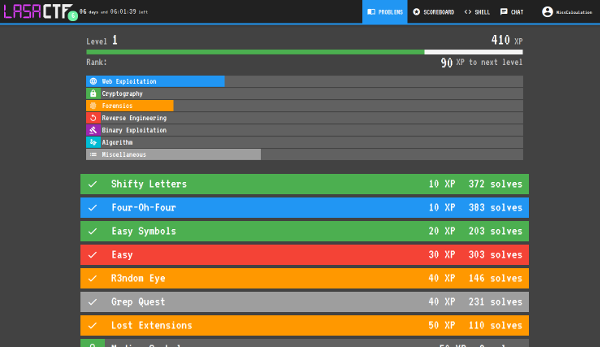
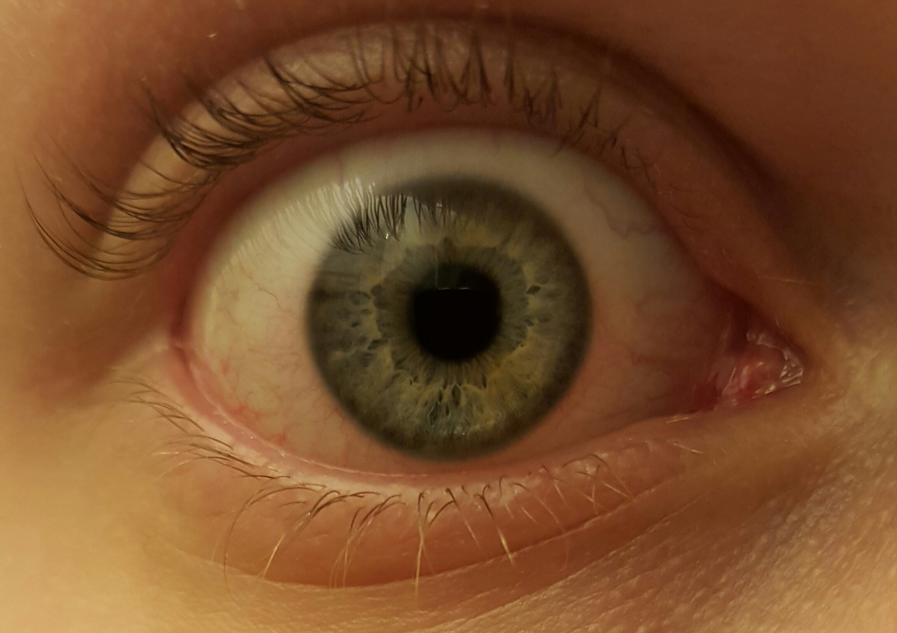
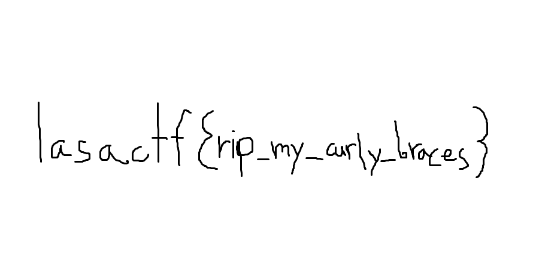
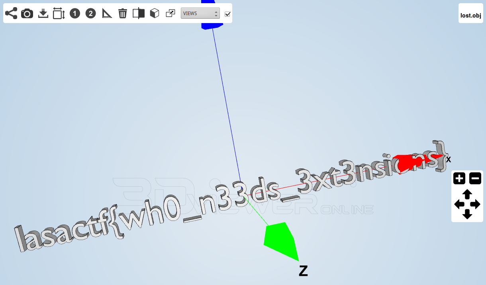
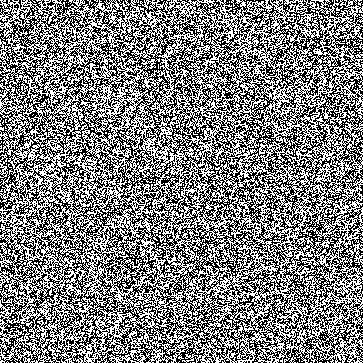
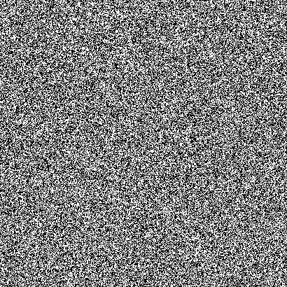

# LASA CTF 2016

LASACTF is an online computer science and security competition run by students from the Liberal Arts and Science Academy in Austin, TX. 
Competitors will exploit, decrypt, reverse engineer, and hack their way through a diverse set of challenges, gaining valuable experience 
along the way. 



*NOTE: Unfortunately this event was cancelled after a couple of days due to a security breach. That was a shame; it was a well-organized CTF and I was really enjoying it*


## Overview
 
**Duration:** 7 days  
**Team mates:** Liblor  

```
Title                         Category     Points  Flag
----------------------------- ------------ ------- -----------------------------
Shifty letters                Crypto       10      lasactf{be_shifted_no_more}
Four-Oh-Four                  Web          10      lasactf{welc0m3_to_web_dev}
Easy Symbols                  Crypto       20      morsewascool
Easy                          Reversing    30      lasactf{th1s_fl4g_i5_3asy}   
R3ndom Eye                    Forensics    40      lasactf{rip_my_curly_braces}
Grep Quest                    Misc         40      lasactf{1_am_a_h1dd3n_p0tat0}
Lost Extensions               Forensics    50      lasactf{wh0_n33ds_3xt3nsions}
Medium Symbols                Crypto       50
Postman                       Web          50      lasactf{h3aders_ar3_c00l}
Helpful
A OR B AND NOT(A AND B)
Client Side                   Web          70      lasactf{cl1ent_sid3_b3st_s1de} 
RSA Over Two
What's the Password           Algorithm    80      ,oJVcQ)u!4P5%&}@+F:;`|*3rBRvDAs?pfM2qE7_k{Gm/=i<^b
Colossal QRCode Adventure     Web          80
Pixels                        Crypto       90      lasactf{QR_c0d35_ar3_n3at} 
Xor
Sounds Strange
Too Many 
Birchnuts
BitMaps
Shiftier Letters              Crypto       120     lasactf{shif73d-3n0ugh-ar3-we}
Simple ROP
Hard Symbols
Chains
Frequencies
Weird Counting
Bad Buffer
Rise of the Machines
Colorful Pixels
Mathy Tongue
Scary Lions
Diagonal Spirals?
Ransomland
Coffee Maker
Unlucky Cheaters
ROP Phun
Messed Up
Nested
Vx1
```


## Crypto 10: Shifty Letters  

**Challenge**  

Kyle got his letters confused. Help him out: 

```
Dayq ymk rmxx, ngf yk oubtqd iuxx dqymuz. Fmwq ftue rxms uz dqyqyndmzoq: xmemofr{nq_eturfqp_za_yadq}
```

**Solution**  

We try all shift ciphers here http://planetcalc.com/1434/ and find that this is ROT-14

```
ROT14	Rome may fall, but my cipher will remain. Take this flag in 
remembrance: lasactf{be_shifted_no_more}
```

**Flag**  

```
lasactf{be_shifted_no_more}
```

## Web 10: Four-Oh-Four  

**Challenge**  

We were trying to make an introductory web problem, but messed up somewhere along the way. 

```
http://web.lasactf.com:2395
```

**Solution**  

We get a 404 page but find the flag in the source

```html
<!DOCTYPE HTML PUBLIC "-//W3C//DTD HTML 3.2 Final//EN">
<html>
<head><title>404 Not Found</title></head>
<body bgcolor="white">
<center><h1>404 Not Found</h1></center>
<hr><center>nginx/1.8.0</center>
<!-- Backup flag in case something breaks: lasactf{welc0m3_to_web_dev} -->
</body>
</html>
```

**Flag**  

```
lasactf{welc0m3_to_web_dev}
```

## Crypto 20: Easy Symbols  

**Challenge**  

Force, course, horse, norse, source, torse. What does this mean? 
Note: Flag not in LASACTF{} format

File:

```
&& &&& !&! !!! ! !&& !& !!! &!&! &&& &&& !&!!
```

**Solution**  

Convert the symbols to morse and translate:

```
-- --- .-. ... . .-- .- ... -.-. --- --- .-..
```

**Flag**  

```
morsewascool
```


## Reversing 30: Easy  

**Challenge**  

Find the flag in this file!

[easy.exe](writeupfiles/easy.exe)

**Solution**  

```
$ strings easy.exe
[..]
GetModuleHandleW
KERNEL32.dll
lasactf{th1s_fl4g_i5_3asy}
<?xml version='1.0' encoding='UTF-8' standalone='yes'?>
<assembly xmlns='urn:schemas-microsoft-com:asm.v1' manifestVersion='1.0'
[..]

```

**Flag**  

```
lasactf{th1s_fl4g_i5_3asy}
```

## Forensics 40: R3ndom Eye  

**Challenge**  

The flag is in the eye of the beholder.



**Solution**  

We use binwalk to find that there is a png file attached to the image:

```
binwalk -e eyeofthetiger.jpg 

DECIMAL       HEXADECIMAL     DESCRIPTION
--------------------------------------------------------------------------------
0             0x0             JPEG image data, JFIF standard 1.01
2074750       0x1FA87E        PNG image, 905 x 460, 8-bit/color RGB, non-interlaced
2074841       0x1FA8D9        Zlib compressed data, compressed

```

We extract the png with the following command:

```
binwalk -e --dd=png eyeofthetiger.jpg 
```



**Flag**  

```
lasactf{rip_my_curly_braces}
```


## Misc 40: Grep Quest 

**Challenge**  

Locate the flag in all the words at `/problems/grep-quest_0/grepy-words/`

**Solution**  

We use the shell to simply grep for `lasasctf` in all the files in the directory:

```bash
$ MissCalculation@ubuntu-512mb-nyc3-01: cd /problems/grep-quest_0/grepy-words/

$ MissCalculation@ubuntu-512mb-nyc3-01:/problems/grep-quest_0/grepy-words$ ls
absconder.txt         ectoplasmatic.txt        monospondylic.txt       semiseriously.txt
accordantly.txt       eimer.txt                Morgana.txt             septemfid.txt
acidyl.txt            electrotherapeutic.txt   mountainless.txt        serrated.txt
actinomeric.txt       emblemist.txt            multicylinder.txt       shadrach.txt
adiactinic.txt        encage.txt               Musci.txt               sheetwriting.txt
[..]

$ MissCalculation@ubuntu-512mb-nyc3-01:/problems/grep-quest_0/grepy-words$ grep lasactf *.txt
potato.txt:lasactf{1_am_a_h1dd3n_p0tat0}
```

**Flag**  

```
lasactf{1_am_a_h1dd3n_p0tat0}
```


## Forensics 50: Lost Extensions  

**Challenge**  

This file got sad and threw away its extension! Maybe you can figure out what it's supposed to be?

[](writeupfiles/Extensions)

**Solution**  

The file doesn't have an extension so we ask unix what it is:

```
$ file Extensions
Extensions: Zip archive data, at least v2.0 to extract
```

So this is a zip file, when we unpack it we get a txt file without extension

```
o asqwerd
v 7.517223 0.217741 0.144000
v 7.500482 0.214009 0.144000
v 7.486061 0.207875 0.144000
v 7.473806 0.199407 0.144000
v 7.463565 0.188676 0.144000
v 7.455185 0.175750 0.144000
v 7.448514 0.160699 0.144000

[..]

vn 0.047500 0.998900 0.000000
vn 0.094400 0.995500 0.000000
vn 0.140500 0.990100 0.000000
vn 0.185200 0.982700 0.000000
vn 0.228200 0.973600 0.000000
vn 0.269400 0.963000 0.000000
vn 0.308500 0.951200 0.000000
vn 0.345300 0.938500 0.000000
vn 0.379700 0.925100 0.000000
vn 0.411900 0.911200 0.000000
vn 0.441800 0.897100 0.000000
vn 0.853200 0.521500 0.000000
vn 0.482500 -0.875900 0.000000
vn 0.502700 -0.864400 0.000000
vn -0.842600 -0.538500 0.000000

[..]

f 518//1 524//1 523//1
f 538//1 496//1 539//1
f 518//1 525//1 524//1
f 537//1 496//1 538//1
f 537//1 497//1 496//1
f 518//1 526//1 525//1
f 536//1 497//1 537//1
f 535//1 497//1 536//1
f 518//1 527//1 526//1
f 534//1 497//1 535//1
f 518//1 528//1 527//1
f 533//1 497//1 534//1
f 518//1 529//1 528//1
f 532//1 497//1 533//1
f 518//1 530//1 529//1
f 531//1 497//1 532//1

[..]
```

This is an .obj file for a 3D model (http://www.cs.cmu.edu/~mbz/personal/graphics/obj.html)

We view the file online: https://www.3dvieweronline.com/ 




**Flag**  

```
lasactf{wh0_n33ds_3xt3nsions}
```

## Crypto 50: Medium Symbols  

**Challenge**  
**Solution**  
**Flag**  


## Web 50: Postman  

**Challenge**  
**Solution**  

When we go to the website we get the following message:

```
Error: Unauthorized browser Mozilla/5.0 (X11; Linux x86_64) AppleWebKit/537.36 (KHTML, like Gecko) 
Ubuntu Chromium/48.0.2564.82 Chrome/48.0.2564.82 Safari/537.36 detected. 
Only users of "Google Ultron" may access this page.
```

So we get the page from python and set our agent to `Google Ultron`

```python
import requests

url="http://web.lasactf.com:45025/"
headers = {'user-agent': 'Google Ultron'}

r=requests.get(url,headers=headers)
print r.text
```

which outputs:
 
```
<h1>Error: "SpecialAuth" header not set to my name </h1>
```

So we set SpecialAuth header to `Kyle` and get the following response:

```
<h1>Error: This site must be accessed from "kyleisacoolguy.org"</h1>
```

so we set the referer: 

```python
import requests

url="http://web.lasactf.com:45025/"
headers = {'user-agent': 'Google Ultron', 'SpecialAuth':'Kyle', 'referer':'kyleisacoolguy.org'}

r=requests.get(url,headers=headers)
print r.text
```

and get the flag:

```
<h1>Sucesfully Authenticated! Your flag is:lasactf{h3aders_ar3_c00l}</h1>
```

**Flag**  

```
lasactf{h3aders_ar3_c00l}
```


## Challenge 1: Helpful  

**Challenge**  
**Solution**  
**Flag**


## Challenge 1: A OR B AND NOT(A AND B)  

**Challenge**  
Our logic teacher communicates with us with these weird lists of numbers. What is this?

[file](writeupfiles/encryptedmessage.txt)

Hint: 3 byte

**Solution**  

The file contains the following (all 1 line):

```
69,14,93,71,28,91,9,30,18,16,18,75,71,14,90,14,9,18,20,18,87,2,10,21,20,90,69,8,21,94,71,13,83,
20,90,64,2,30,9,71,27,92,3,90,70,15,31,18,23,8,91,29,31,18,16,27,65,71,27,69,6,8,86,2,30,18,19,
21,18,6,90,94,2,27,64,9,31,86,71,23,83,9,90,93,1,90,70,15,31,18,41,21,64,19,18,30,71,13,90,8,90,
6,2,23,93,9,9,70,21,27,70,2,30,18,5,3,18,38,90,66,11,15,65,71,56,18,10,19,92,18,9,18,36,90,86,14,
12,91,3,31,86,71,24,75,71,32,30,71,14,90,6,14,18,19,18,87,71,9,90,2,31,66,71,23,71,20,14,18,5,31,
18,21,31,86,75,90,83,9,30,18,3,19,87,71,21,84,71,14,90,2,90,64,8,14,28,69,90,31,71,22,83,20,27,81,
19,28,73,46,37,94,14,17,87,56,25,83,9,30,91,3,31,109,20,18,87,2,10,79
```

**Flag**

```

```

## Web 70: Client Side 

**Challenge**  

Kyle didn't think his login form was secure enough, so he added Javascript! Smart Right? 

http://web.lasactf.com:63017

**Solution**  

We look at the source

```html
<!doctype html>
<html>
  <head>
      <title>Login</title>
      <link rel="stylesheet" type="text/css" href="https://maxcdn.bootstrapcdn.com/bootstrap/3.3.5/css/bootstrap.min.css">
  </head>
  <body>
    <div class="container">
        <div class="row">
          <div class="col-md-8 col-md-offset-2">

                <h3>Log In</h3>

                <form action="login.php" method="POST" onsubmit="return checkValid()">
                    <fieldset>
                        <div class="form-group">
                            <label for="username">Username:</label>
                            <input type="text" id="username" name="username" class="form-control">
                        </div>
                        <div class="form-group">
                            <label for="password">Password:</label>
                            <div class="controls">
                                <input type="password" id="password" name="password" class="form-control">
                            </div>
                        </div>
                        <div class="form-actions">
                            <input type="submit" value="Login" class="btn btn-primary">
                        </div>
                    </fieldset>
                    <span id="helpBlock" class="help-block" style="color:red;"></span>
                </form>
                <a href="login.phps">login.php source</a>
            </div>
        </div>
      </div>
      <script src="https://ajax.googleapis.com/ajax/libs/jquery/2.2.0/jquery.min.js"></script>
      <script type="text/javascript">
        function checkValid(){
          if( /[^a-zA-Z0-9]/.test($('#username').val()) || /[^a-zA-Z0-9]/.test($('#password').val())) {
           $('#helpBlock').text("Error, invalid characters detected");
           return false;
          }
          return true;
        }
      </script>
  </body>
</html>
```

and the source.phps file

```php
<?php
  include "config.php";
  $con = new SQLite3($database_file);

  $username = $_POST["username"];
  $password = $_POST["password"];
  $query = "SELECT * FROM users WHERE name='$username' AND password='$password'";
  $result = $con->query($query);
  $row = $result->fetchArray();

  if ($row) {
    echo "<h1>Logged in!</h1>";
    echo "<p>Your flag is: $FLAG</p>";
  } else {
    echo "<h1>Login failed.</h1>";
  }
?>
```

So the input sanitation is done in the javascript, so we can circumvent that, so we just need to get the SQL query to return something, so we enter the following in the password
field:

```
' or 1 --
```

and are given the flag

```
Logged in!

Your flag is: lasactf{cl1ent_sid3_b3st_s1de}
```

**Flag**

```
lasactf{cl1ent_sid3_b3st_s1de}
```

## Challenge 1: RSA Over Two 

**Challenge**  
**Solution**  
**Flag**


## Challenge 1: What's the Password 

**Challenge**  

A login system asks for 10 random characters from a password. For example, "What are the 2nd, 6th, 23rd, .... characters?" 
The characters are always asked in the order that they appear in the password. Here is a list of 250 successful logins 
for an account. Find the shortest possible password that could fulfill all these logins. 
Note: Flag not in LASACTF{} format

[file](writeupfiles/Logins.txt)

**Solution**  

The file contains a set of logins:

```
)!P`*Ap7k/
Ju!&+*3Bk{
Ju%@3Bsfm/
u}Bs?pf2qb
Q!5+F:|B2E
cu5:*3rAfi
!P:|Bsf_m/
VQ!`v?7_{m
,c4PFBv?f7
o4+rRf{Gm<

[..]
```

We can determine the password with the following python script:

```python
# read file with logins
logins = []
with open('Logins.txt') as infile:
    for line in infile.readlines():
        logins.append(line.rstrip()) 
    
# get set of unique characters in logins    
chars = set(''.join(logins))

# repeatedly find character that only ever appears as first
# then remove that character from all strings and repeat
password=''
for i in range(0,len(chars)):
    highestindex={c:-1 for c in chars}
    
    for l in logins:
        pos = -1
        for c in l:
            pos+=1
            if pos > highestindex[c]:
                highestindex[c]=pos
     
    for c in highestindex:
        if highestindex[c]==0:
            password += c
            logins =[l.replace(c,'') for l in logins]
   
    
print "password: "+ password
```

this outputs:

```
password: ,oJVcQ)u!4P5%&}@+F:;`|*3rBRvDAs?pfM2qE7_k{Gm/=i<^b
```

**Flag**

```
,oJVcQ)u!4P5%&}@+F:;`|*3rBRvDAs?pfM2qE7_k{Gm/=i<^b
```

## Crypto 90: Pixels 

**Challenge**  
We intercepted these images but we don't know how they go together! Figure out the hidden message!

Image 1:



Image 2:



**Solution**  

We compare the two images and output a black pixel whenever the pixelvalues differ

```python
from PIL import Image

img1 = Image.open("QR1.png")
img2 = Image.open("QR2.png")

pixels1 = img1.load()
pixels2 = img2.load()

(w,h)=img1.size

outimg = Image.new( 'RGB', (w,h), "white") 
pixels_out = outimg.load() 

for i in range(0,h):
    for j in range(0,w):
      if pixels1[j,i] != pixels2[j,i]: 
          pixels_out[j,i]=(0,0,0)

outimg.save("pixels_outimg.png","png") 
```

This results in a QR code:


which contains:

```
Two isn\'t always better than one. lasactf{QR_c0d35_ar3_n3at}
```

**Flag**

```
lasactf{QR_c0d35_ar3_n3at}
```

## Challenge 1: Xor  

**Challenge**  
**Solution**  
**Flag**


## Challenge 1: Sounds Strange  

**Challenge**  
**Solution**  
**Flag**


## Challenge 1: Too Many   

**Challenge**  
**Solution**  
**Flag**


## Challenge 1: Birchnuts  

**Challenge**  
**Solution**  
**Flag**


## Challenge 1: BitMaps  

**Challenge**  
**Solution**  
**Flag**


## Crypto 120: Shiftier Letters  

**Challenge**  

There is a service running on `web.lasactf.com:4056`, figure out how to talk to it.

**Solution**  

First we connect with netcat to see what we are dealing with:

```
$ nc web.lasactf.com 4056
rcvpnhgn untjrrq hasynjrq cercynpr qvfcebir hasvk crynftvxba jnyyoveq frzvzbanfgvp frzbybtvpny 
arngureq vfpnevbgvfz jnvx gravoyr zlbfhgher cbegurgevn cvaangrq zneglebyngel eryrtngvba ercebqhpgbel 
bppvcvgbcnevrgny

```

The title suggests this is a shift cipher, and indeed we find after a ROT-x we get:

```
epicauta hagweed unflawed preplace disprove unfix pelasgikon wallbird semimonastic semological 
neatherd iscariotism waik tenible myosuture porthetria pinnated martyrolatry relegation reproductory 
occipitoparietal
```

which is clearly the correct shift, but not all words are words that would appear in a dictionary. 
Some more experimenting and we find that if we send back the correct decryption, we get another challenge, so it would
seem we need to do this a number of times in a row within a given time.

We write a script which tries all rotations until it finds the correct one. We use a set of digraphs that
never appear in the english language to determine whether the decryption is valid, if we encounter more than 
3 such impossible digraphs we dismiss the decryption as wrong and continue searching


```python
import telnetlib
import string 
from string import ascii_lowercase as lc, ascii_uppercase as uc

# ROT-n decrypt
def rot(n):
    lookup = string.maketrans(lc + uc, lc[n:] + lc[:n] + uc[n:] + uc[:n])
    return lambda s: s.translate(lookup)

# server info
server="web.lasactf.com"
port=4056

# some impossible letter combinations in english language to help us determine whether 
# our decryption is the correct one
impossible = [
"bk","fq","jc","jt","mj","qh","qx","vj","wz","zh",
"bq","fv","jd","jv","mq","qj","qy","vk","xb","zj",
"bx","fx","jf","jw","mx","qk","qz","vm","xg","zn",
"cb","fz","jg","jx","mz","ql","sx","vn","xj","zq",
"cf","gq","jh","jy","pq","qm","sz","vp","xk","zr",
"cg","gv","jk","jz","pv","qn","tq","vq","xv","zs",
"cj","gx","jl","kq","px","qo","tx","vt","xz","zx",
"cp","hk","jm","kv","qb","qp","vb","vw","yq",
"cv","hv","jn","kx","qc","qr","vc","vx","yv",
"cw","hx","jp","kz","qd","qs","vd","vz","yz",
"cx","hz","jq","lq","qe","qt","vf","wq","zb",
"dx","iy","jr","lx","qf","qv","vg","wv","zc", 
"fk","jb","js","mg","qg","qw","vh","wx","zg"]

try:
    # connect to server
    tn = telnetlib.Telnet(server, port)

    while True: # I think we need to get 100 in a row correct but not sure
        ct = tn.read_until("\n")
        print "\nChallenge"+str(num)+": "
        print ct

        if "Incorrect" in ct:
            print ":'("
            break

        # find rotation amount resulting in best translation
        maxcount=0
        for i in range(0,26):
            pt = rot(i)(ct)
            count=0
            bad=False
            badcount=0
            for word in pt.split(' '):
                for imp in impossible:
                    if imp in word:
                        badcount+=1
                    if badcount > 3:
                        bad = True
                        break

                if bad:
                    break
            if not bad:
                print "Our Solution: "
                besttrans = pt.strip()
                print besttrans   
                tn.write(besttrans)
                tn.write('\n')
                break

    print num 
    if num >=100:
        done=True
        print ct
        ct = tn.read_until("\n")
        print ct


except:
    print ct
```

which outputs:

```
Challenge1: 
abuqolxroxi xzfalfa pzriiflkfpe rkabodolsb obqolmripfsb mfxyx vrzhv pzxobjlkdbo zlrkqbocfu cirufyfifqv 
jxzolmixpfx xzqfkfz yoljfqb klkdxkdiflkfz zlrkqbocixpefkd rkcxafkd pqbjmib pxhxixsx xkkxi mxibxzblrp 
obybpqltxi yolkzeljrzlojvzlpfp molopxi

Our Solution: 
dextroaural acidoid scullionish undergrove retropulsive piaba yucky scaremonger counterfix fluxibility 
macroplasia actinic bromite nonganglionic counterflashing unfading stemple sakalava annal paleaceous 
rebestowal bronchomucormycosis prorsal

Challenge2: 
qbfwdorsh hqvkulqhphqw lqghwhuplqdfb qrqderolwlrq zdvwdjh judvvzdugv gubrslwkhflqh euxfhoorvlv wudfwhoodwh
lqvwhs suhfoxgh srobrhfb yhorflphwhu wdudqghdq wkurdwohw udsdwhdfhdh pdqqhulvp fulprjhqlf jolwwhulqjob 
fkdpshuwb uhwudqvsruw olwkrjhqrxv

Our Solution: 
nyctalope enshrinement indeterminacy nonabolition wastage grasswards dryopithecine brucellosis tractellate 
instep preclude polyoecy velocimeter tarandean throatlet rapateaceae mannerism crimogenic glitteringly 
champerty retransport lithogenous

[..]

Challenge50: 
iabehshbv lnixkitktfhngm wblvbyehkte fnsabd ehqbt wtfiikhhyxk tkvabmxvmnkx zetwx vatfuktr wngl ltnmxnk 
vtebuxk bfikblhg nglehmaynegxll uxtkblaer enq ngbgvhkihktmxw tmkhvbhnlgxll ktliuxkkrebdx utgwhexxk 
hmhfnvhkfrvhlbl wtlrikhvmbwtx zkbsxe wxqmkhmtkmtkbv lxfblbfiex yxbzgxk lxibt vhngmxkftgwtuex

Our Solution: 
philozoic superparamount discifloral muzhik loxia dampproofer architecture glade chambray duns sauteur 
caliber imprison unslothfulness bearishly lux unincorporated atrociousness raspberrylike bandoleer 
otomucormycosis dasyproctidae grizel dextrotartaric semisimple feigner sepia countermandable

Challenge51: 
You made it to the end! lasactf{shif73d-3n0ugh-ar3-we}
```

**Flag**

```
lasactf{shif73d-3n0ugh-ar3-we}
```


## Challenge 1: Simple ROP  

**Challenge**  
**Solution**  
**Flag**


## Challenge 1:  Hard Symbols 

**Challenge**  
**Solution**  
**Flag**


## Challenge 1: Chains  

**Challenge**  
**Solution**  
**Flag**


## Challenge 1:  Frequencies 

**Challenge**  
**Solution**  
**Flag**


## Challenge 1: Weird Counting  

**Challenge**  
**Solution**  
**Flag**


## Challenge 1: Bad Buffer  

**Challenge**  
**Solution**  
**Flag**


## Challenge 1: Rise of the Machines  

**Challenge**  
**Solution**  
**Flag**


## Challenge 1: Colorful Pixels  

**Challenge**  
**Solution**  
**Flag**


## Challenge 1: Mathy Tongue  

**Challenge**  
**Solution**  
**Flag**


## Challenge 1: Scary Lions  

**Challenge**  
**Solution**  
**Flag**


## Challenge 1: Diagonal Spirals?  

**Challenge**  
**Solution**  
**Flag**


## Challenge 1: Ransomland  

**Challenge**  
**Solution**  
**Flag**


## Challenge 1: Coffee Maker  

**Challenge**  
**Solution**  
**Flag**


## Challenge 1: Unlucky Cheaters  

**Challenge**  
**Solution**  
**Flag**


## Challenge 1: ROP Phun  

**Challenge**  
**Solution**  
**Flag**


## Challenge 1: Messed Up  

**Challenge**  
**Solution**  
**Flag**


## Challenge 1: Nested

**Challenge**  
**Solution**  
**Flag**


## Challenge 1: Vx1  

**Challenge**  
**Solution**  
**Flag**


## Challenge 1: Title  

**Challenge**  
**Solution**  
**Flag**  

