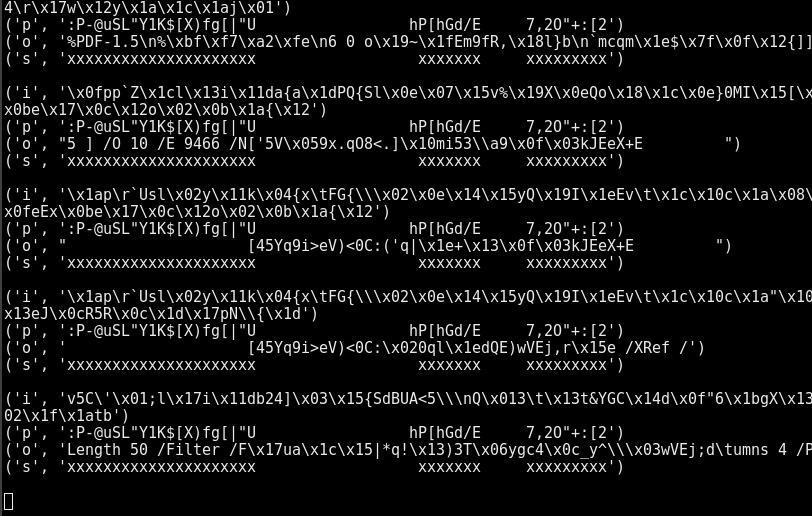

# D-CTF: DefCamp Qualifiers 2018

Team: Galaxians


## Overview
```
Title                          Category       Flag
------------------------------ -------------- -----------------------------
XORnigma                       Junior         DCTF{fcc34eaae8bd3614dd30324e932770c3ed139cc2c3250c5b277cb14ea33f77a0}
Multiple Flags                 Junior         DCTFSPECIALFLAG00AA00AA00991337DCTF
World of Internet              Junior         DCTF{06d54ba96e9661d71e8b716b52914cd675e5fca46cb5ca2f80c1c9e67a56701f}
Sniff                          Junior         DCTF{0751867b2cb4e601e2cd94aa5eb485f4552790e7a348cb20fd610c741c8fc978}
SimplePassword                 Junior
EagleEye                       Junior         DCTF{912c07726142de12943b76a89d40847028330f0a1a0be1ac24503c57242404ab}}
PasswordPolicy                 Junior
RobotsVSHumans                 Junior         DCTF{1091d2144edbffaf5dd265cb7c93e799c4659eb16ee79735b3bd6e09dd6e791f}
Security through obscurity     Junior
Passport                       Junior
chat                           Web
Get Admin                      Web
secops                         Web
Vulture                        Web
Ransomware                     Reversing      DCTF{d915b5e076215c3efb92e5844ac20d0620d19b15d427e207fae6a3b894f91333}
Memsome                        Reversing
KitKat                         Reversing
Validator                      Reversing
Lucky?                         Exploit
Even more lucky?               Exploit
Online linter                  Exploit
Broken TV                      Misc
Message                        Misc           DCTF{B66ECAAA90AD05DF5DAB33D71A8F70934408F3A5847A4C5C38DB75891B0F0E32}
Voices                         Misc
Exfil                          Misc
```

## Junior: XORnigma

**Challenge**

Obtain the flag from the given [file](writeupfiles/xornigma.py).

```python
import itertools
def xor_two_str(s, key):
	key = key * (len(s) / len(key) + 1)
	return ''.join(chr(ord(x) ^ ord(y)) for (x,y) in itertools.izip(s, key))

flag = ""
flag_key = "DCTF"
x = xor_two_str(flag, flag_key)
print x.encode("hex")
# 000000003f2537257777312725266c24207062777027307574706672217a67747374642577263077777a3725762067747173377326716371272165722122677522746327743e
```

**Solution**

We get the encoded flag as a comment in the python file, so we simply reverse the process

We see that bytes are XOR'ed, and since the flag starts with `DCTF` and the encoded string starts with `00000000`, we know that
the `flag_key` also starts with `DCTF` (and turns out to be the entire key)

```python
import itertools
import binascii

x = "000000003f2537257777312725266c24207062777027307574706672217a67747374642577263077777a3725762067747173377326716371272165722122677522746327743e"
flag_key="DCTF"

c = binascii.unhexlify(x)
pt = ''.join( [chr( ord(c[i]) ^ ord(flag_key[i%len(flag_key)]) ) for i in range(0,len(c))] )

print(pt)
```

**Flag**

```
DCTF{fcc34eaae8bd3614dd30324e932770c3ed139cc2c3250c5b277cb14ea33f77a0}
```

## Junior: Multiple Flags


**Challenge**

Look, flags everywhere!


**Solution**

This is [semaphore flag signalling system](https://www.anbg.gov.au/flags/semaphore.html)


```
JDCTFSP
ECIALFL
AG-KKJA
A-KKJAA
-KKIIAC
CGJDCTF
```

We see two `DCTF`s in ther and the word `SPECIALFLAG` but unsure how to format flag

The characters we transcribed as `-` signify numericals coming up, and `J` also signifies alpha characters coming up,
this gives us the following flag:

```
DCTFSPECIALFLAG-KKJAA-KKJAA-KKIIACCGJDCTF
DCTFSPECIALFLAG00AA00AA00991337DCTF
```

**Flag**
```
DCTFSPECIALFLAG00AA00AA00991337DCTF
```

## Junior: World of Internet

**Challenge**

Do you know WelCOrpe Severus?

**Solution**

After some googling turned up nothing we decided to search on twitter, and found
an [account by that name](https://twitter.com/welcorpe).

The first tweet from that account contains our flag:


**Flag**
```
DCTF{06d54ba96e9661d71e8b716b52914cd675e5fca46cb5ca2f80c1c9e67a56701f}
```

## Junior 1: Sniff

**Challenge**
Sniff!
[pcap file](./writeupfiles/Sniff.pcap)

**Solution**

We open it in Wireshark and do:

1. File
2. Object Export
3. HTTP
4. All

Putting them into the expected `asd/` directory and opening the `/` file in a browser shows lots of garbage except for the 001-020.jpg which when put together with imagemagick:

```
montage -mode concatenate -tile x1 asd/0* out.jpg
```

Shows the flag:


## Junior: SimplePassword

**Challenge**

Can you guess what is wrong with the password?

[SimplePass](writeupfiles/SimplePass)

**Solution**

**Flag**


## Junior: Eagle Eye

**Challenge**

Do you see it?


**Solution**

We crank up the contrast and brightness and can see the flag in top left corner


**Flag**
```
DCTF{912c07726142de12943b76a89d40847028330f0a1a0be1ac24503c57242404ab}}
```

## Junior: PasswordPolicy

**Challenge**

Can you guess this extreme password?

Target: https://password-policy.dctfq18.def.camp/

**Solution**

```html
<!DOCTYPE html>
<html>
<head>
  <meta charset="utf-8">
  <meta name="viewport" content="width=device-width, initial-scale=1">
  <link rel="stylesheet" href="css/font-awesome.min.css" type="text/css">
  <link rel="stylesheet" href="css/theme.css" type="text/css">
</head>
<body>
  <div class="py-5">
    <div class="container">
      <div class="row">
        <div class="col-md-3"> </div>
        <div class="col-md-6">
          <div class="card text-white p-5 bg-dark">
            <div class="card-body">
              <h1 class="mb-4">Login form</h1>
              <form action="" method="POST">
                <div class="form-group">
                  <label>Email address</label>
                  <input name="user" type="email" class="form-control" placeholder="Enter email" value="admin@leftover.dctf"></div>
                <div class="form-group">
                  <label>Password</label>
                  <input name="pass" type="password" class="form-control" placeholder="Password"> </div>
                <button name="btn-login" type="submit" class="btn btn-secondary">Login</button>
              </form>
            </div>
          </div>
        </div>
      </div>
    </div>
  </div>
  <script src="js/jquery-3.2.1.slim.min.js" crossorigin="anonymous"></script>
  <script type="text/javascript">
    $('form').submit(function(e) {
      if($('input[name="pass"]').val().length < 1337) {
          alert('Minimum length for password is 1337 characters.');
          e.preventDefault();
          return false;
      }
  });
  </script>
</body>
</html>
```

**Flag**


## Junior: RobotsVSHumans

**Challenge**

Find your flag on this website.
Target: https://robots-vs-humans.dctfq18.def.camp/

**Solution**

We check out robots.txt file:

```
Did you know that robots.txt is not the only .txt file in a website? BTW: I am against humans!
```


ok, so we try humans.txt:

```
/* TEAM */


Your title: RobotsVSHumans


Location: Bcharest, Romania


/* THANKS */


```

**Flag**
```
DCTF{1091d2144edbffaf5dd265cb7c93e799c4659eb16ee79735b3bd6e09dd6e791f}
```


## Junior: Security through obscurity

**Challenge**

I have a very secure internal login.

Target: https://security-through-obscurity.dctfq18.def.camp/

**Solution**

**Flag**


## Junior: Passport

**Challenge**

Provide valid passport file in order to pass.

Target: http://passport.dctfq18.def.camp

**Solution**

**Flag**


## Web: chat

**Challenge**

We received a new gig. Our goal is to review this application written in nodejs and see if we can get the flag from this system. Are you up for this?

The target: https://chat.dctfq18.def.camp

The code: [chat](writeupfiles/chat/)

**Solution**

**Flag**

## Web: Get Admin

**Challenge**

This is a very unexpected gig for me. However, I'm busy with other projects so can you please give me a hand to test this. For free, of course. :-)

Files: [get-admin](writeupfiles/get-admin/)

Target: https://admin.dctfq18.def.camp/

**Solution**

**Flag**

## Web: secops

**Challenge**
Firewalls proved to be very useful in our hosting environment as it protects against attacks on vulnerable sites of our clients.

Target: https://secops.dctfq18.def.camp/

**Solution**

**Flag**

## Web: Vulture

**Challenge**

We created an online service where you can upload pictures of vultures (or other birds). Each user has a feed so you can privately enjoy the photos you took of this majestic killing machines :)

Target: https://vulture.dctfq18.def.camp/

**Solution**

**Flag**


## Reverse: Ransomware

**Challenge**

Someone encrypted my homework with [this rude script](writeupfiles/ransomware.zip). HELP!

**Solution**

The zip file contains a compile python file and a `.exe` file. We decompile the `.pyc` file with [uncompyle](https://github.com/gstarnberger/uncompyle)

```python
import string
from random import *
import itertools

def caesar_cipher(OOO0O0O00OOO0O0OO, O0O0O0O0OOOO0OOOO):
    O0O0O0O0OOOO0OOOO = O0O0O0O0OOOO0OOOO * (len(OOO0O0O00OOO0O0OO) / len(O0O0O0O0OOOO0OOOO) + 1)
    return ('').join((chr(ord(O0O0O00O0000O00O0) ^ ord(OO0000000O0OO00OO)) for O0O0O00O0000O00O0, OO0000000O0OO00OO in itertools.izip(OOO0O0O00OOO0O0OO, O0O0O0O0OOOO0OOOO)))


f = open('./FlagDCTF.pdf', 'r')
buf = f.read()
f.close()
allchar = string.ascii_letters + string.punctuation + string.digits
password = ('').join((choice(allchar) for OOO0OO0OO00OO0000 in range(randint(60, 60))))
buf = caesar_cipher(buf, password)
f = open('./youfool!.exe', 'w')
buf = f.write(buf)
f.close()
```

we deobfuscate a bit:

```python
import string
from random import *
import itertools

def caesar_cipher(a, b):
    b = b * (len(a) / len(b) + 1)
    return ('').join((chr(ord(c) ^ ord(d)) for c,d in itertools.izip(a, b)))


f = open('./FlagDCTF.pdf', 'r')
buf = f.read()
f.close()
allchar = string.ascii_letters + string.punctuation + string.digits
password = ('').join((choice(allchar) for _ in range(randint(60, 60))))
buf = caesar_cipher(buf, password)
f = open('./youfool!.exe', 'w')
buf = f.write(buf)
f.close()
```


So this XORs an input PDF against a randomly chosen 60 character password, and
then saves it as 'youfool!.exe'

We know that the first bytes MUST be %PDF-1 (ok, not strictly. %PDF only needs
to appear in the first like 2048 bytes, xref PoC||GTFO)

So we can make some guesses about the key based on the input, using the
properties of XOR to guess and check. Checking various places throughout the
PDF we sometimes get lucky and see partial overlaps with known substrings that
appear in PDFs (like endstream/endobj/ImageI/etc)



Eventually we can reconstruct the [original PDF](./writeupfiles/FlagDCTF.pdf)

**Flag**

```
DCTF{d915b5e076215c3efb92e5844ac20d0620d19b15d427e207fae6a3b894f91333}
```

## Reverse: Memsome

**Challenge**

I can not find my license file. Can you help me?

Target: [memsome](writeupfiles/memsom)


**Solution**

**Flag**


## Reverse: Validator

**Challenge**

Like any good admin, we don't store the flag, we validate that it can be generated.

Target: [validator](writeupfiles/validator)

**Solution**

**Flag**


## Exploit: Lucky?

**Challenge**

How lucky are you?

Target: 167.99.143.206 65031

Bin: [lucky](writeupfiles/lucky)

**Solution**

**Flag**


## Exploit: Even more lucky?

**Challenge**

We have updated the lucky game just for you! Now the executable is lighter and more efficient.

Target: 167.99.143.206 65032

Bin: [lucky2](writeupfiles/lucky2)

**Solution**

**Flag**


## Exploit: Online linter

**Challenge**

An old service for online php code linting has been fixed and brought back to life. This time the admins are pretty sure it's unhackable!

Target: https://online-linter.dctfq18.def.camp/

**Solution**

**Flag**


## Exploit: Sweet

**Challenge**

I don't really trust those shady binaries but I have to use them. Can you at least make sure it has no evil parts?

Target: https://sweet.dctfq18.def.camp/

File: [sweet.so](writeupfiles/sweet.so)

**Solution**

**Flag**


## Misc: Message

**Challenge**

I just typed this secret [message](writeupfiles/message.txt) with my new encoding algorithm.


**Solution**

```
wsxcvasdfghrfvbnhytqwertymnbvcdrtghuzxcvbnwsxcdeasdfghzaqwdrtgbzxcvbn
qwertywsxqwertynbvcxswefrqwertyiuyhnbvqwertywsxcvfrasdfghzaqwdrtgbzxcvbn
qwertywsxasdfghiuyhnbvasdfgh zxcvbnytrfvcxqwertywsxasdfghzaqwdrtgbqwertymnbvccdertgzxcvbnedcvbasdfghefvtzxcvbn
asdfghwsxcfezxcvbnedcvbgtasdfghzaqwdrtgbqwertyxsweftynhzxcvbnjmyizxcvbn
zxcvbnrtyuihnzxcvbnwsxcdeasdfghrgnygcqwertyrtyuihnasdfgh qwertyqazxcdewzxcvbnredcfzxcvbn
zxcvbnwertyfvzxcvbnrfvgyhnasdfghwsxcdeqwerty qwertynbvcxswefrzxcvbnmnbvcdrtghuzxcvbnrfvqwertyxsweftgbqwertyrtyuihnqwertywsxasdfghxsweftgbzxcvbncvgredasdfgh
[..]
```

is this writing pattern on the keyboard? looking at sequences of letter that are adjacent on a keyboard we
see that `wsxcv` could represent an `L` shape? `rfvbnhyt` an `O`, etc? we do some of these replacements and
see legible text appear, looks like Lorem Ipsum text, we slowly piece together the text and all the replacements.

The following program will deciper the message:


```python
replacements = [('mnbvcdrtghu','R'),
                ('efvgywdcft','W'),
                ('nbvcxswefr','P'),('mnbvccdertg','P'),('nbvcxswerf','P'),
                ('zaqwdrtgb','M'),('xsweftynh','M'),('xsweftyhn','M'),
                ('xsweftgb','N'),('zaqwdvfr','N'),('xsweftbg','N'),
                ('rfvbnhyt','O'),('qazxcdew','O'),('wsxcvfre','O'),
                ('rfvgyhn','H'),('edcftgb','H'),('wsxdrfv','H'),
                ('iuyhnbv','S'),('ytrfvcx','S'),
                ('rtyuihn','T'),('wertyfv','T'),
                ('wsxcvfr','U'),('edcvbgt','U'),
                ('grdxcvb','A'),('zsefvcx','A'),('xcvbgrd','A'),
                ('rfvbhg','B'),('wsxcfd','B'),('qazxds','B'),
                ('wsxcde','E'),('edcvrf','E'),('tgbnhy','E'),
                ('wsxcfe','D'),('yhnmku','D'),('edcvgr','D'),
                ('cvgred','G'),('cvrged','G'),('redcvg','G'),
                ('edcfby','K'),('qazsce','K'),('wsxdvr','K'),
                ('rgnygc','X'),('wdvtdz','X'),
                ('ewsxc','C'),('redcv','C'),('trfvb','C'),
                ('redcf','F'),('trfvg','F'),('ewsxd','F'),
                ('wsxcv','L'), ('edcvb','L'), ('rfvbn','L'),
                ('wdcft','V'),('efvgy','V'),
                ('efvt', 'Y'),('jmyi','Y'),
                ('wsx','I'),('edc','I'),('rfv','I'),
                ('qwerty',''),('asdfgh',''),('zxcvbn','')]

with open('message.txt','r') as f:
    m = f.readline()

for i in replacements:
    m = m.replace(i[0],i[1])

print(m)
```

which outputs the text:

```
LOREM IPSUM IS SIMPLY DUMMY TEXT OF THE PRINTING AND TYPESETTING INDUSTRY.
LOREM IPSUM HAS BEEN THE INDUSTRY'S STANDARD DUMMY TEXT EVER SINCE THE 1500S,
WHEN AN UNKNOWN PRINTER TOOK A GALLEY OF TYPE AND SCRAMBLED IT TO MAKE A TYPE
SPECIMEN BOOK. IT HAS SURVIVED NOT ONLY FIVE CENTURIES, BUT ALSO THE LEAP INTO
ELECTRONIC TYPESETTING, REMAINING ESSENTIALLY UNCHANGED. IT WAS POPULARISED IN THE
1960S WITH THE RELEASE OF LETRASET SHEETS CONTAINING LOREM IPSUM PASSAGES, AND MORE
RECENTLY WITH DESKTOP PUBLISHING SOFTWARE LIKE ALDUS PAGEMAKER INCLUDING VERSIONS OF
LOREM IPSUM.
DCTF{B66ECAAA90AD05DF5DAB33D71A8F70934408F3A5847A4C5C38Dqazxds75891B0F0E32}LOREM
IPSUM IS SIMPLY DUMMY TEXT OF THE PRINTING AND TYPESETTING INDUSTRY. LOREM IPSUM HAS
qazxdsEEN THE INDUSTRY'S STANDARD DUMMY TEXT EVER SINCE THE 1500S, WHEN AN UNKNOWN
PRINTER TOOK A GALLEY OF TYPE AND SCRAMBLED IT TO MAKE A TYPE SPECIMEN BOOK. IT HAS
SURVIVED NOT ONLY FIVE CENTURIES, BUT ALSO THE LEAP INTO ELECTRONIC TYPESETTING,
REMAINING ESSENTIALLY UNCHANGED. IT WAS POPULARISED IN THE 1960S WITH THE RELEASE OF
LETRASET SHEETS CONTAINING LOREM IPSUM PASSAGES, AND MORE RECENTLY WITH DESKTOP
PUBLISHING SOFTWARE LIKE ALDUS PAGEMAKER INCLUDING VERSIONS OF LOREM IPSUM.
```

and contains our flag \o/

**Flag**
```
DCTF{B66ECAAA90AD05DF5DAB33D71A8F70934408F3A5847A4C5C38DB75891B0F0E32}
```

## Misc: Broken TV

**Challenge**

Guys, I've asked Google for this flag! But my only monitor is this Broken TV...


**Solution**

```html
<!DOCTYPE html>
<html>
<head>
  <meta charset="utf-8">
  <meta name="viewport" content="width=device-width, initial-scale=1">
  <link rel="stylesheet" href="css/font-awesome.min.css" type="text/css">
  <link rel="stylesheet" href="css/theme.css" type="text/css"> </head>
<body>
  <div class="py-5">
    <div class="container">
      <div class="row">
        <div class="col-8 offset-2">
          <div class="embed-responsive">
            
          </div>
        </div>
      </div>
    </div>
  </div>
  <script src="js/jquery-3.2.1.slim.min.js"></script>
  <script>
    const reload = () => {
      $('.tv').attr('src', 'blur.png?r=' + Date.now());
      setInterval(reload, 60 * 1000);
    };
    reload();
  </script>
</body>
</html>
```

looks like the image is scrambled based on a parameter given (the current date)

image of just the contents of the screen is [here](writeupfiles/blur.png)

**Flag**


## Misc: Voices

**Challenge**

Listen. Can you hear the voices? They are there. Somehow.

[voices.wav](writeupfiles/voices.wav)

**Solution**

**Flag**


## Misc: Exfil

**Challenge**

An experienced hacker gained unauthorised access into a facility with limited options to exfiltrate data but he managed to launch a backdoor to solve this issue. However, he got arrested before intercepting the confidential data. Can you recover the information and maybe do some profits on his behalf? Flag format: `DCTF\{[A-Za-z0-9\-]+\}`

For this challenge you are allowed to scan using nmap, but it won't help you too much :)

Target: 104.248.38.191

**Solution**

**Flag**


