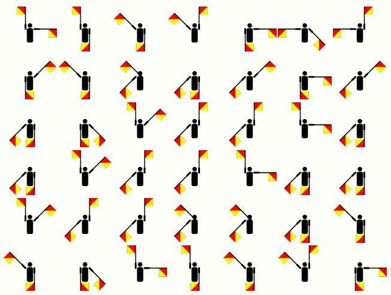
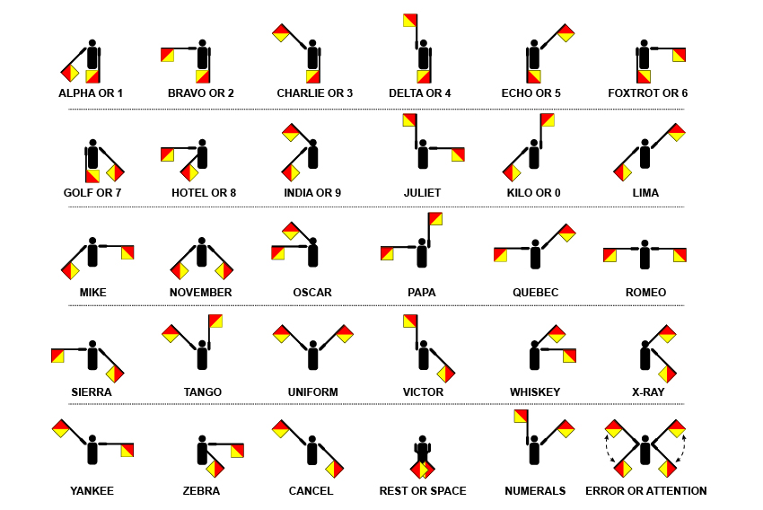
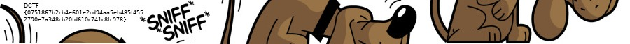
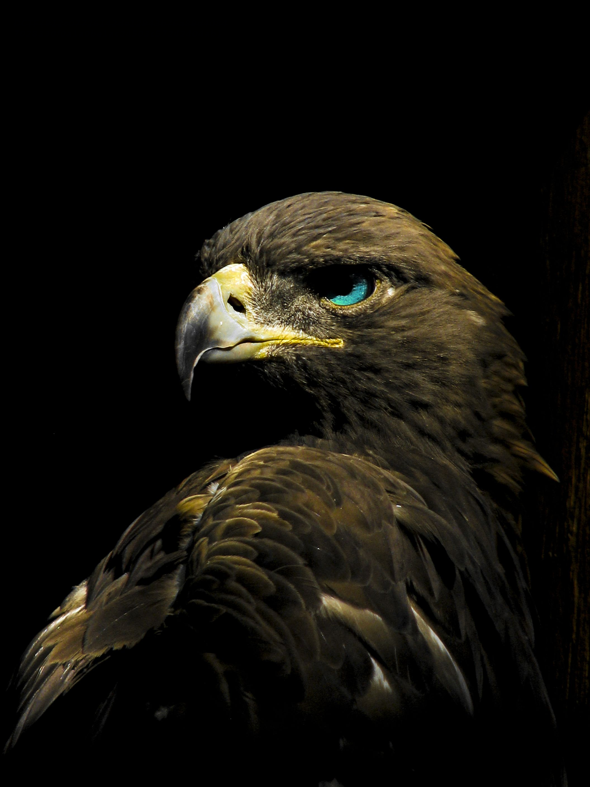
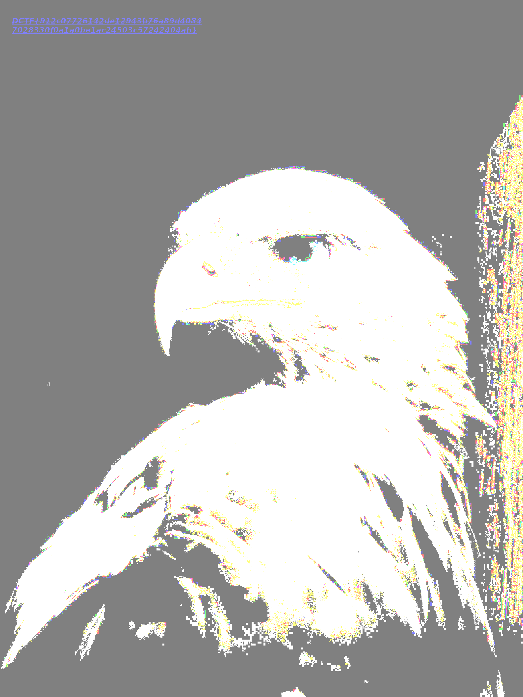

# D-CTF: DefCamp Qualifiers 2018

Team: Galaxians


## Overview
```
Title                          Category       Points Flag
------------------------------ -------------- ------ -----------------------------
XORnigma                       Junior         1
Multiple Flags                 Junior         1      DCTFSPECIALFLAG00AA00AA00991337DCTF
World of Internet              Junior         1
Sniff                          Junior         1      DCTF{0751867b2cb4e601e2cd94aa5eb485f4552790e7a348cb20fd610c741c8fc978}
SimplePassword                 Junior         1
EagleEye                       Junior         1      DCTF{912c07726142de12943b76a89d40847028330f0a1a0be1ac24503c57242404ab}}
PasswordPolicy                 Junior         1
RobotsVSHumans                 Junior         1      DCTF{1091d2144edbffaf5dd265cb7c93e799c4659eb16ee79735b3bd6e09dd6e791f}
Security through obscurity     Junior         1
Passport                       Junior         1
chat                           Web            330
Get Admin                      Web
secops                         Web
Vulture                        Web
Ransomware                     Reversing
Memsome                        Reversing
KitKat                         Reversing
Validator                      Reversing
Lucky?                         Exploit
Even more lucky?               Exploit
Online linter                  Exploit
Broken TV                      Misc
Message                        Misc
Voices                         Misc
Exfil                          Misc
```

## Junior: XORnigma

**Challenge**

Obtain the flag from the given [file](writeupfiles/xornigma.py).

**Solution**

**Flag**

## Junior: Multiple Flags

**Challenge**

Look, flags everywhere!



**Solution**

This is [semaphore flag signalling system](https://www.anbg.gov.au/flags/semaphore.html)



```
JDCTFSP
ECIALFL
AG-KKJA
A-KKJAA
-KKIIAC
CGJDCTF
```

We see two `DCTF`s in ther and the word `SPECIALFLAG` but unsure how to format flag

The characters we transcribed as `-` signify numericals coming up, and `J` also signifies alpha characters coming up,
this gives us the following flag:

```
DCTFSPECIALFLAG-KKJAA-KKJAA-KKIIACCGJDCTF
DCTFSPECIALFLAG00AA00AA00991337DCTF
```

**Flag**
```
DCTFSPECIALFLAG00AA00AA00991337DCTF
```


## Junior 1: Sniff

**Challenge**
Sniff!
[pcap file](./writeupfiles/Sniff.pcap)

**Solution**

We open it in Wireshark and do:

1. File
2. Object Export
3. HTTP
4. All

Putting them into the expected `asd/` directory and opening the `/` file in a browser shows lots of garbage except for the 001-020.jpg which when put together with imagemagick:

```
montage -mode concatenate -tile x1 asd/0* out.jpg
```

Shows the flag:




## Junior: Eagle Eye

**Challenge**

Do you see it?



**Solution**

We crank up the contrast and brightness and can see the flag in top left corner




**Flag**
```
DCTF{912c07726142de12943b76a89d40847028330f0a1a0be1ac24503c57242404ab}}
```

## Junior 1: RobotsVSHumans

**Challenge**

Find your flag on this website.
Target: https://robots-vs-humans.dctfq18.def.camp/

**Solution**

We check out robots.txt file:

```
Did you know that robots.txt is not the only .txt file in a website? BTW: I am against humans!
```


ok, so we try humans.txt:

```
/* TEAM */


Your title: RobotsVSHumans


Location: Bcharest, Romania


/* THANKS */


```

**Flag**
```
DCTF{1091d2144edbffaf5dd265cb7c93e799c4659eb16ee79735b3bd6e09dd6e791f}
```

## Reverse: Ransomware

**Challenge**

Someone encrypted my homework with [this rude script](writeupfiles/ransomware.zip). HELP!

**Solution**

The zip file contains a compile python file and a `.exe` file. We decompile the `.pyc` file with [uncompyle](https://github.com/gstarnberger/uncompyle)

```python
import string
from random import *
import itertools

def caesar_cipher(OOO0O0O00OOO0O0OO, O0O0O0O0OOOO0OOOO):
    O0O0O0O0OOOO0OOOO = O0O0O0O0OOOO0OOOO * (len(OOO0O0O00OOO0O0OO) / len(O0O0O0O0OOOO0OOOO) + 1)
    return ('').join((chr(ord(O0O0O00O0000O00O0) ^ ord(OO0000000O0OO00OO)) for O0O0O00O0000O00O0, OO0000000O0OO00OO in itertools.izip(OOO0O0O00OOO0O0OO, O0O0O0O0OOOO0OOOO)))


f = open('./FlagDCTF.pdf', 'r')
buf = f.read()
f.close()
allchar = string.ascii_letters + string.punctuation + string.digits
password = ('').join((choice(allchar) for OOO0OO0OO00OO0000 in range(randint(60, 60))))
buf = caesar_cipher(buf, password)
f = open('./youfool!.exe', 'w')
buf = f.write(buf)
f.close()
```


**Flag**
