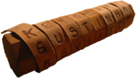
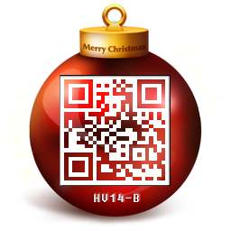

# December 3rd: **Candle 1**

**URL:** 

[http://hackvent.hacking-lab.com/challenge.php?day=3](http://hackvent.hacking-lab.com/challenge.php?day=3)

**Hint:**  

*really old school (500 b.c.)*  

There is also an image of an octogonal candle


**Challenge:**  

The challenge itself consists of a string of letters to decode:

```
WAIYTELZEREMSOK3TEBZWETUE2EB2HIRMRYGBUGKSRASIIXGQ5HYSESYWCZDYCACBS43JIOHNRAA3DAURDES2DGO
```

**Solution:**  
  
The hint in combination with the image of the candle makes us suspect a [scytale cipher](http://en.wikipedia.org/wiki/Scytale).
This is an ancient spartan encryption method where a strip of paper is wrapped around a cylindrical object before the message is written and read. 
When unwrapped, the letters appear out of order (transposition cipher).



The trick is to find the right wrapping length, but we just try some until we find a message: 

```
WAIYTELZER
EMSOK3TEBZ
WETUE2EB2H
IRMRYGBUGK
SRASIIXGQ5
HYSESYWCZD
YCACBS43JI
OHNRAA3DA
URDES2DGO
```

Reading this top to bottom left to right we get:  

```
WEWISHYOUAMERRYCHRISTMASANDYOURSECRETKEYISBASE32GIYSA2LTEBXW43DZEBUGC3DGEB2GQZJAORZHK5DI  
```

Adding in some spaces gives us: 

```
WE WISH YOU A MERRY CHRISTMAS AND YOUR SECRET KEY IS 
BASE32GIYSA2LTEBXW43DZEBUGC3DGEB2GQZJAORZHK5DI  
```

The secret key starts with `BASE32`, so we Base32-decode the remaining characters 
(for example [here](http://online-calculators.appspot.com/base32/)).   
  
The resulting message was:

```
21 is only half the truth
```

We put this into the ball-o-matic and get the bauble with QR code: 




  
We decode the QR code to get the key.


**Flag:**  

```
HV14-aHA3-Ciaz-wS3e-fDrj-965A  
```
