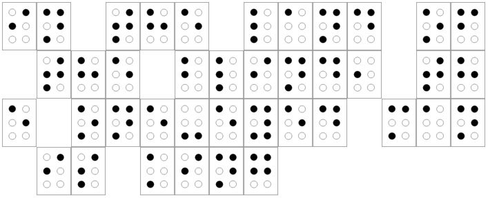

# December 4th: **Crypto 1**

**URL:** 

[http://hackvent.hacking-lab.com/challenge.php?day=4](http://hackvent.hacking-lab.com/challenge.php?day=4)
  
  
**Hint:**  

*or what else?*  
  
  
**Challenge:**    
  
  
  


**Solution:**  
  
  
Braille! Translate using a chart such as [this one](http://www.todayifoundout.com/wp-content/uploads/2013/11/braille-alphabet.jpg):
  
  
  
  
  
After translation we get the following message:

```
in the land of the blind, the one-eyed man is king
```

Input this into the ball-o-matic gives:


**Flag:**  

```
HV14-kSKV-4Bx3-dPXL-Iq1A-z1R7
```

