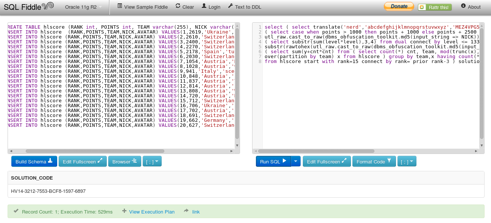

# December 10th: SQL hero

**URL**

[http://hackvent.hacking-lab.com/challenge.php?day=10](http://hackvent.hacking-lab.com/challenge.php?day=10)

**Hint**

*the oracle says: just another language*

**Challenge**

Based on this table (hlscore):

```
RANK POINTS TEAM        NICK        AVATAR  
==== ====== =========== =========== ======  
1    2619   Ukraine     solarwind   Crack  
2    2610   Switzerland HaRdLoCk    Crack  
3    2400   Switzerland M.          Chief  
4    2270   Switzerland PS          Chief  
5    2178   Spain       tunelko     Chief  
6    2030   Switzerland DanMcFly    Chief  
7    1054   Austria     Mister004   Chief  
8    1028   Austria     woody       Chief  
9    941    Italy       scegliau    Geek  
10   848    Austria     sebl314     Geek
11   837    Austria     TomCat435   Geek
12   814    Austria     nufan       Geek
13   808    Austria     WANeKO3     Geek
14   720    Austria     Manio       Geek
15   712    Switzerland Leskat      Geek
16   706    Ukraine     LeoStep     Geek
17   702    Austria     chris.pcguy Geek
18   691    Switzerland bias        Geek
19   662    Germany     nks         Geek
20   627    Switzerland d0h         Geek
```
Run this to get the daily code:

```
select ( select translate('&1','abcdefghijklmnopqrstuvwxyz','MEZ4VPG5NS6RYH7CT1QW2FO3AI') from dual)
|| '-' || ( select case when points > 1000 then points + 1000 else points + 2500 end from hlscore
where utl_raw.cast_to_raw(dbms_obfuscation_toolkit.md5(input_string => NICK)) = 
'C6DEE681E936AF6577387507603A7539') || '-' || ( select substr(sum(level*level),3,4) from dual connect 
by level <= 1337 ) || '-' || ( select substr(rawtohex(utl_raw.cast_to_raw(dbms_obfuscation_toolkit.md5
(input_string => '&1'))), -14, 4) from dual) || '-' || ( select sum(y+cnt*cnt) from ( select count(*)
cnt, team, mod(trunc(x),987) y from ( select team, avg(points) over(partition by team) x from hlscore)
group by team,x having count(*) > 2)) || '-' || ( select sum(points) from hlscore start with rank=15
connect by rank= prior rank-3 ) solution_code from dual 
```

**Solution**


We can solve this online using [SQLFiddle](sqlfiddle.com). Select oracle sql, and first create the database:


```
CREATE TABLE hlscore (RANK int, POINTS int, TEAM varchar(255), NICK varchar(255), AVATAR varchar(255));
INSERT INTO hlscore  (RANK,POINTS,TEAM,NICK,AVATAR) VALUES(1,2619,'Ukraine','solarwind','Crack');
INSERT INTO hlscore (RANK,POINTS,TEAM,NICK,AVATAR) VALUES(2,2610,'Switzerland','HaRdLoCk','Crack');
INSERT INTO hlscore (RANK,POINTS,TEAM,NICK,AVATAR) VALUES(3,2400,'Switzerland','M.','Chief');
INSERT INTO hlscore (RANK,POINTS,TEAM,NICK,AVATAR) VALUES(4,2270,'Switzerland','PS','Chief');
INSERT INTO hlscore (RANK,POINTS,TEAM,NICK,AVATAR) VALUES(5,2178,'Spain','tunelko','Chief');
INSERT INTO hlscore (RANK,POINTS,TEAM,NICK,AVATAR) VALUES(6,2030,'Switzerland','DanMcFly','Chief');
INSERT INTO hlscore (RANK,POINTS,TEAM,NICK,AVATAR) VALUES(7,1054,'Austria','Mister004','Chief');
INSERT INTO hlscore (RANK,POINTS,TEAM,NICK,AVATAR) VALUES(8,1028,'Austria','woody','Chief');
INSERT INTO hlscore (RANK,POINTS,TEAM,NICK,AVATAR) VALUES(9,941,'Italy','scegliau','Geek');
INSERT INTO hlscore (RANK,POINTS,TEAM,NICK,AVATAR) VALUES(10,848,'Austria','sebl314','Geek');
INSERT INTO hlscore (RANK,POINTS,TEAM,NICK,AVATAR) VALUES(11,837,'Austria','TomCat435','Geek');
INSERT INTO hlscore (RANK,POINTS,TEAM,NICK,AVATAR) VALUES(12,814,'Austria','nufan','Geek');
INSERT INTO hlscore (RANK,POINTS,TEAM,NICK,AVATAR) VALUES(13,808,'Austria','WANeKO3','Geek');
INSERT INTO hlscore (RANK,POINTS,TEAM,NICK,AVATAR) VALUES(14,720,'Austria','Manio','Geek');
INSERT INTO hlscore (RANK,POINTS,TEAM,NICK,AVATAR) VALUES(15,712,'Switzerland','Leskat','Geek');
INSERT INTO hlscore (RANK,POINTS,TEAM,NICK,AVATAR) VALUES(16,706,'Ukraine','LeoStep','Geek');
INSERT INTO hlscore (RANK,POINTS,TEAM,NICK,AVATAR) VALUES(17,702,'Austria','chris.pcguy','Geek');
INSERT INTO hlscore (RANK,POINTS,TEAM,NICK,AVATAR) VALUES(18,691,'Switzerland','bias','Geek');
INSERT INTO hlscore (RANK,POINTS,TEAM,NICK,AVATAR) VALUES(19,662,'Germany','nks','Geek');
INSERT INTO hlscore (RANK,POINTS,TEAM,NICK,AVATAR) VALUES(20,627,'Switzerland','d0h','Geek');
```

Then execute the command. We get the following output:

```
&1-3212-7553-ED2D-1597-6897
```

This looks almost right, except it starts with `&1`, this should probably be `HV14`. We see in this statement: 

```
select translate('&1','abcdefghijklmnopqrstuvwxyz','MEZ4VPG5NS6RYH7CT1QW2FO3AI')
```

that value `nerd` would be translated into `HV14`. So we replace &1 with nerd on both places it appears


```
select ( select translate('nerd','abcdefghijklmnopqrstuvwxyz','MEZ4VPG5NS6RYH7CT1QW2FO3AI') from dual ) || '-' || 
( select case when points > 1000 then points + 1000 else points + 2500 end from hlscore where 
utl_raw.cast_to_raw(dbms_obfuscation_toolkit.md5(input_string => NICK)) = 'C6DEE681E936AF6577387507603A7539') || '-' || 
( select substr(sum(level*level),3,4) from dual connect by level <= 1337 ) || '-' || ( select 
substr(rawtohex(utl_raw.cast_to_raw(dbms_obfuscation_toolkit.md5(input_string => 'nerd'))), -14, 4) from dual) || '-' || 
( select sum(y+cnt*cnt) from ( select count(*) cnt, team, mod(trunc(x),987) y from ( select team, avg(points) 
over(partition by team) x from hlscore ) group by team,x having count(*) > 2)) || '-' || ( select sum(points) 
from hlscore start with rank=15 connect by rank= prior rank-3 ) solution_code from dual 
```
executing this gives our daily flag:




**Flag**

```
HV14-3212-7553-BCF8-1597-6897
```

