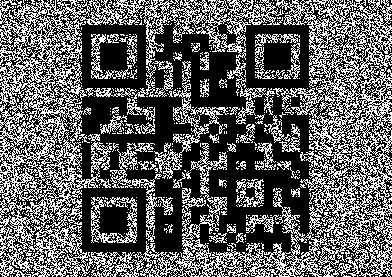

# December 19th: Basic Steganography

**URL**

[http://hackvent.hacking-lab.com/challenge.php?day=19](http://hackvent.hacking-lab.com/challenge.php?day=19)


**Hint**

*putting the bits together*

**Challenge**

We get a PNG image:


**Solution**

We have a hint of bit operation: !r & (g ^ b). We apply this to the least significant bits of each pixel, and output a black pixel if the result is 0, and a white pixel if the result is 1.

We write a small [python script](images/dec19.py) to solve this challenge:

```python
from PIL import Image

img = Image.open("stegbool.png") # open stego image
pixels_orig = img.load() # create the pixel map
(w,h)=img.size

# create new image to which we will write hidden image
outimg = Image.new( 'RGB', (w,h), "white") # create a new black iage
pixels_out = img.load() # create the pixel map

# for each pixel, calculate !r & (g^b) as hinted. 
# If 1, create white pixel, otherwise create black pixel
for i in range(0,h):
    for j in range(0,w):
      (r,g,b) = pixels_orig[j,i] 
      bit=  (~r & (g^b))&1
      if bit:
          (r,g,b)=(255,255,255)
      else:
          (r,g,b)=(0,0,0)
          
      pixels_out[j,i] = (r,g,b) 

# save resulting image to file 
outimg.save("dec19.png","png") 

```

This results in the following image:



We scan this QR code to get the key

**Flag**

```
HV14-KV5Q-f9O3-ysE8-v3EB-PBit
```

