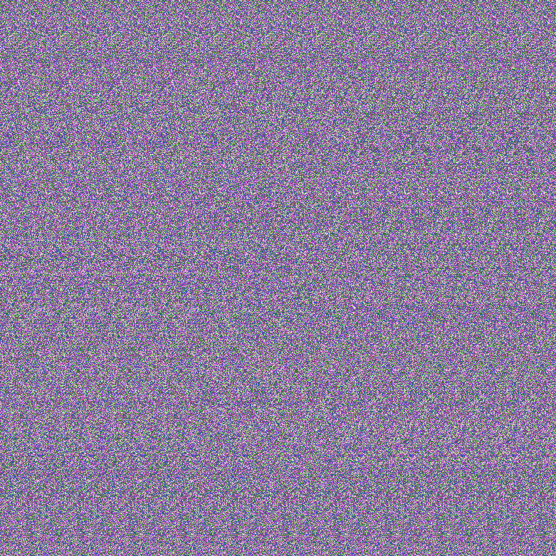
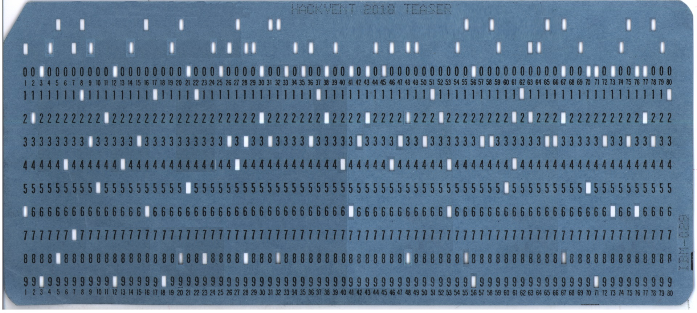
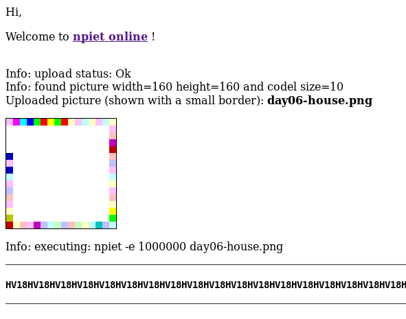

# HACKvent 2018

The annual advent calender from Hacking-lab


## Overview


Title                                             | Category    | Points | Flag
------------------------------------------------- | ----------- | ------ | ------------------------------
[Teaser     ](#teaser)                            |             |        | `Multiple, see below`
[December 1 ](#day-01-just-another-bar-code)      | Easy        | 2/1    | `HV18-L3ts-5t4r-7Th3-Phun-G33k`
[December 2 ](#day-02-me)                         | Easy        | 2/1    | `HL18-7QTH-JZ1K-JKSD-GPEB-GJPU`
[December 3 ](#day-03-catch-me)                   | Easy        | 2/1    | `HV18-pFAT-O1Dl-HjVp-jJNE-Zju8`
[December 4 ](#day-04-pirating-like-in-the-90ies) | Easy        | 2/1    | `HV18-5o9x-4geL-7hkJ-wc4A-xp8F`
[December 5 ](#day-05-osint-1)                    | Easy        | 2/1    | `HV18-0Sin-tI5S-R34l-lyC0-oo0L`
[December 6 ](#day-06-mondrian)                   | Easy        | 2/1    | `HV18-M4ke-S0m3-R3Al-N1c3-artZ`
[December 7 ](#day-07-flappy.pl)                  | Easy        | 2/1    | `HV18-bMnF-racH-XdMC-xSJJ-I2fL`
[December 8 ](#day-08-advent-snail)               | Medium      | 3/2    | `HV18-$$nn-@@11-LLr0-B1ne`
[December 9 ](#day-09-)                           | Medium      | 3/2    | `HV18-`
[December 10](#day-10-)                           | Medium      | 3/2    | `HV18-`
[December 11](#day-11-)                           | Medium      | 3/2    | `HV18-`
[December 12](#day-12-)                           | Medium      | 3/2    | `HV18-`
[December 13](#day-13-)                           | Medium      | 3/2    | `HV18-`
[December 14](#day-14-)                           | Medium      | 3/2    | `HV18-`
[December 15](#day-15-)                           | Hard        | 4/3    | `HV18-`
[December 16](#day-16-)                           | Hard        | 4/3    | `HV18-`
[December 17](#day-17-)                           | Hard        | 4/3    | `HV18-`
[December 18](#day-18-)                           | Hard        | 4/3    | `HV18-`
[December 19](#day-19-)                           | Hard        | 4/3    | `HV18-`
[December 20](#day-20-)                           | Hard        | 4/3    | `HV18-`
[December 21](#day-21-)                           | Hard        | 4/3    | `HV18-`
[December 22](#day-22-)                           | Expert      | 5/4    | `HV18-`
[December 23](#day-23-)                           | Expert      | 5/4    | `HV18-`
[December 24](#day-24-)                           | Expert      | 5/4    | `HV18-`
[December 25](#day-25-)                           | Expert      | 5/4    | `HV18-`

## Teaser

**Challenge**


**Solution**

*Stage 1*

The image contains braille code. We translate it to `http://bit.ly/2TJvxHt`, which leads us the following image:


this QR decodes to `Rushed by ..`

It turns out the bit.ly link actually translated to `https://hackvent.hacking-lab.com/T34s3r_MMXVIII/index.php?flag=UI18-GAUa-lXhq-htyV-w2Wr-0yiV` but redirected. The `flag` parameter when ROT13'd gives us the first flag: `HV18-TNHn-yKud-uglI-j2Je-0lvI`

When we fill in the correct flag in the url, we get to the next stage: `https://hackvent.hacking-lab.com/T34s3r_MMXVIII/index.php?flag=HV18-TNHn-yKud-uglI-j2Je-0lvI`, which redirects to `https://hackvent.hacking-lab.com/T34s3r_MMXVIII/ZOoxjUSe1OVB7OPoVrsX.pdf`

[pdf file](writeupfiles/teaser/stage2.pdf)

Ok, there is lots here, lets get all the elements of the pdf with http://extractpdf.com

*Stage 2*

We find some Morse code text in the pdf:

```
HACKvent 2018

.... ...- .---- ---.. -....- --. --- .-. .. -....- --.. .-. ... -... -....- ..- ..-. .- . -....- - ... -.... -.-. -....- -.-. ...- - -

```

this decodes to: `HV18-GORI-ZRSB-UFAE-TS6C-CVTT`, which is our second flag


*Stage 3*

We also find some images in the pdf:




The stereogram image can be decoded [here](http://magiceye.ecksdee.co.uk/) and gives:


we clean it up a bit with GIMP so that we can scan it:


and this is our 3rd flag: `HV18-p2LK-DNcI-YKw7-T9Ad-mH3v`


*Stage 4*

Next, we try binwalk on the pdf:

```bash
$ binwalk stage2.pdf
DECIMAL       HEXADECIMAL     DESCRIPTION
--------------------------------------------------------------------------------
0             0x0             PDF document, version: "1.7"
404           0x194           Unix path: /PDF/Text/ImageB/ImageC/ImageI] >>/MediaBox[ 0 0 595.32 841.92] /Contents 4 0 R/Group<</Type/Group/S/Transparency/CS/DeviceRGB>>
621           0x26D           Zlib compressed data, default compression
1751          0x6D7           Unix path: /Type/XObject/Subtype/Image/Width 1000/Height 340/ColorSpace/DeviceRGB/BitsPerComponent 8/Filter/DCTDecode/Interpolate true/Leng
1899          0x76B           JPEG image data, JFIF standard 1.01
1929          0x789           TIFF image data, big-endian, offset of first image directory: 8
51778         0xCA42          Unix path: /Type/ExtGState/BM/Normal/ca 1>>
51831         0xCA77          Unix path: /Type/Font/Subtype/TrueType/Name/F1/BaseFont/BCDEEE+Calibri/Encoding/WinAnsiEncoding/FontDescriptor 8 0 R/FirstChar 32/LastChar
51998         0xCB1E          Unix path: /Type/FontDescriptor/FontName/BCDEEE+Calibri/Flags 32/ItalicAngle 0/Ascent 750/Descent -250/CapHeight 750/AvgWidth 521/MaxWidth
52237         0xCC0D          Unix path: /Type/ExtGState/BM/Normal/CA 1>>
52291         0xCC43          Unix path: /Type/XObject/Subtype/Image/Width 781/Height 781/ColorSpace/DeviceRGB/BitsPerComponent 8/Interpolate false/Filter/FlateDecode/Le
52442         0xCCDA          Zlib compressed data, default compression
187860        0x2DDD4         Unix path: /Type/Font/Subtype/TrueType/Name/F2/BaseFont/BCDFEE+Arial-Black/Encoding/WinAnsiEncoding/FontDescriptor 12 0 R/FirstChar 32/Last
188034        0x2DE82         Unix path: /Type/FontDescriptor/FontName/BCDFEE+Arial-Black/Flags 32/ItalicAngle 0/Ascent 1101/Descent -212/CapHeight 716/AvgWidth 552/MaxW
188279        0x2DF77         Unix path: /Type/Font/Subtype/TrueType/Name/F3/BaseFont/TimesNewRomanPS-BoldMT/Encoding/WinAnsiEncoding/FontDescriptor 14 0 R/FirstChar 32/
188456        0x2E028         Unix path: /Type/FontDescriptor/FontName/TimesNewRomanPS-BoldMT/Flags 32/ItalicAngle 0/Ascent 891/Descent -216/CapHeight 677/AvgWidth 427/M
188698        0x2E11A         Unix path: /Type/XObject/Subtype/Image/Width 200/Height 200/ColorSpace/DeviceRGB/BitsPerComponent 8/Filter/DCTDecode/Interpolate true/Lengt
188844        0x2E1AC         JPEG image data, JFIF standard 1.01
188874        0x2E1CA         TIFF image data, big-endian, offset of first image directory: 8
195577        0x2FBF9         Zlib compressed data, default compression
196145        0x2FE31         Zlib compressed data, default compression
215877        0x34B45         Zlib compressed data, default compression
231310        0x3878E         Unix path: /Type/Metadata/Subtype/XML/Length 3075>>
231494        0x38846         Unix path: /www.w3.org/1999/02/22-rdf-syntax-ns#">
231734        0x38936         Unix path: /purl.org/dc/elements/1.1/">
232171        0x38AEB         Unix path: /ns.adobe.com/xap/1.0/mm/">
234681        0x394B9         Zlib compressed data, default compression
236069        0x39A25         RAR archive data, first volume type: MAIN_HEAD
236135        0x39A67         Zip archive data, encrypted at least v2.0 to extract, compressed size: 210390, uncompressed size: 210378, name: z.zip
446647        0x6D0B7         End of Zip archive

# we see there are files appended, we extract with:
$ binwalk -e stage2.pdf
```

Reveals an [encrypted zip file](writeupfiles/teaser/_stage2.pdf.extracted/Final_easy.zip)

TODO

*Stage 5*

The zip file also contained this QR code image:


Which looks suspiciously like a challenge from HACKvent 2015, my writeup [here](https://github.com/shiltemann/CTF-writeups-galaxians/tree/master/Hackvent_2015#dec-17-santas-quick-response)

TODO


*Stage 6*

The zip file also contained a [Santa.txt](writeupfiles/teaser/_stage2.pdf.extracted/Santa.txt) file:

```
Santa has caught up with the information age and does not trust
clear-text commands anymore.
He has decided that all communications
have to be encrypted to prevent an unfriendly take-over of his team.
Santa chooses a simple, secure, and toolless encryption scheme.
However, his team's memory capacity is limited and so he can only use
their names (Dasher, Dancer, Prancer, Vixen, Comet, Cupid, Donder and
Blitzen) as keys.


Where is the team headed to?

STTYN YATLOEP DNEA ONBL TGNTO MHEHH EISTIARIB FHSRA LD IIONA NL HERUV LN17-PTAA-RTON-RDOE-MCTN-AHCO
```

TODO


*Stage 7*

The zip file also contained the following image:



This appears to be an IBM-029 punch card by the faint lettering on the right.
Fortunately [wikipedia](https://en.wikipedia.org/wiki/Keypunch#IBM_029_Card_Punch)
has a full translation of that format:


I'm arbitrarily going to number the colums to be -2, -1, 0 (the row of 0s), 1 .. 9 because that makes sense to me?


Column | Values
---    | ---
1      | 6, -1
2      | 2
3      | 9 0
4      | -1
5      | -2 8
6      | 4
7      | 7 -1
8      | 1 -2
9      | 3 -1
10     | 5
11     | 2
12     | 90
13     | 4
14     | -1
15     | 3
16     | 6 -2
17     | 1
18     | 9
19     | -1
20     | -2 8
21     | 0 5
22     | 1
23     | 8
24     | -1
25     | 0
26     | 3 -1
27     | 4 -2
28     | -1 3 8
29     | -1
30     | 0 2
31     | -2 3
32     | -2 8
33     | 0
34     | -1
35     | 0
36     | -1 3
37     | 1
38     | 0 2
39     | -1
40     | 4
41     | 0 6
42     | 3
43     | 02
44     | -1
45     | 0
46     | -1 4
47     | 3
48     | 8 2 -1
49     | -1
50     | 3
51     | 1
52     | 2
53     | 4 6
54     | -1
55     | -2 8
56     | 9 0
57     | 3
58     | 3 -2
59     | -1
60     | 5
61     | 2 4
62     | 1
63     | -1 2
64     | -1
65     | -2 3
66     | 3
67     | -2 0 2 8
68     | _
69     | -1
70     | 0 5
71     | 0 9
72     | 3
73     | 0 6
74     | -1
75     | -2 3
76     | 0 6
77     | 0 2
78     | -2 3
79     | -1
80     | 1


We then use the translation matrix we found to write a [small python script](writeupfiles/ibm-029-decode.py)
Which will output the following when run:

```
O2Z-H4PAL52¿4-3F19-HV18-0LD$-SCH0-0L1S-4W3S-0M3!-312¿-HZ3C-5¿1K-C3¿¿-VZ3W-CWSC-1¿
```

(¿ used when couldn't identify a character correctly, maybe transcription mistakes by me.)
But the flag is clearly visible in the center: `HV18-0LD$-SCH0-0L1S-4W3S-0M3!`


*Stage 8*

The zip file also contained the file [teaser.pls](writeupfile/teaser/_stage2.pdf.extracted/teaser.pls)

TODO

**Flag**
```
1: HV18-TNHn-yKud-uglI-j2Je-0lvI
2: HV18-GORI-ZRSB-UFAE-TS6C-CVTT
3: HV18-p2LK-DNcI-YKw7-T9Ad-mH3v
4:
5:
6:
7: HV18-0LD$-SCH0-0L1S-4W3S-0M3!
8:
9:
10:
```

## Day 01: Just Another Bar Code

**Challenge**

After a decade of monochromity, Santa has finally updated his infrastructure with color displays.


**Solution**

After some Googling, we find JAB Code (Just Another Bar Code) which is a high-capacity 2D color bar code,
which can encode more data than traditional black/white (QR) codes.


- [GitHub repo](https://github.com/jabcode/jabcode)
- [Online Decoder](https://jabcode.org/scan)

Their online decoder gives us the flag

**Flag**
```
HV18-L3ts-5t4r-7Th3-Phun-G33k
```

## Day 02: Me

**Challenge**


Can you help Santa decoding these numbers?

```
115 112 122 127 113 132 124 110 107 106 124 124 105 111 104 105 115 126 124 103 101 131
124 104 116 111 121 107 103 131 124 104 115 122 123 127 115 132 132 122 115 64 132 103
101 132 132 122 115 64 132 103 101 131 114 113 116 121 121 107 103 131 124 104 115 122
123 127 115 63 112 101 115 106 125 127 131 111 104 103 115 116 123 127 115 132 132 122
115 64 132 103 101 132 132 122 115 64 132 103 101 131 114 103 115 116 123 107 113 111
104 102 115 122 126 107 127 111 104 103 115 116 126 103 101 132 114 107 115 64 131 127
125 63 112 101 115 64 131 127 117 115 122 101 115 106 122 107 107 132 104 106 105 102
123 127 115 132 132 122 116 112 127 123 101 131 114 104 115 122 124 124 105 62 102 101
115 106 122 107 107 132 104 112 116 121 121 107 117 115 114 110 107 111 121 107 103 131
63 105 115 126 124 107 117 115 122 101 115 106 122 107 113 132 124 110 107 106 124 124
105 111 104 102 115 122 123 127 115 132 132 122 115 64 132 103 101 131 114 103 115 116
123 107 117 115 124 112 116 121 121 107 117 115 114 110 107 111 121 107 103 131 63 105
115 126 124 107 117 115 122 101 115 106 122 107 107 132 104 106 105 102 121 127 105 132
114 107 115 64 131 127 117 115 122 101 115 112 122 127 111 132 114 107 105 101 75 75
75 75 75 75
```

**Solution**

A series of decodings
  - Octal
  - Base32
  - 14-segment display

Decoding script [day02.py](writeupfiles/day02.py):

```python
import base64

input= "115 112 122 127 113 132 124 110 107 106 124 124 105 111 104 105 115 126 124 103 101 131 124 104 116 111 121 107 103 131 124 104 115 122 123 127 115 132 132 122 115 64 132 103 101 132 132 122 115 64 132 103 101 131 114 113 116 121 121 107 103 131 124 104 115 122 123 127 115 63 112 101 115 106 125 127 131 111 104 103 115 116 123 127 115 132 132 122 115 64 132 103 101 132 132 122 115 64 132 103 101 131 114 103 115 116 123 107 113 111 104 102 115 122 126 107 127 111 104 103 115 116 126 103 101 132 114 107 115 64 131 127 125 63 112 101 115 64 131 127 117 115 122 101 115 106 122 107 107 132 104 106 105 102 123 127 115 132 132 122 116 112 127 123 101 131 114 104 115 122 124 124 105 62 102 101 115 106 122 107 107 132 104 112 116 121 121 107 117 115 114 110 107 111 121 107 103 131 63 105 115 126 124 107 117 115 122 101 115 106 122 107 113 132 124 110 107 106 124 124 105 111 104 102 115 122 123 127 115 132 132 122 115 64 132 103 101 131 114 103 115 116 123 107 117 115 124 112 116 121 121 107 117 115 114 110 107 111 121 107 103 131 63 105 115 126 124 107 117 115 122 101 115 106 122 107 107 132 104 106 105 102 121 127 105 132 114 107 115 64 131 127 117 115 122 101 115 112 122 127 111 132 114 107 105 101 75 75 75 75 75 75"

# looks like ascii encoded in octal

output1 = ""
for i in input.split(' '):
    output1 += chr(int(i, 8))

print('output1: ', output1)

# looks like base32

output2 = base64.b32decode(output1)
print('output2: ', output2.upper())

# now what..?
```

This outputs:

```
output1:  MJRWKZTHGFTTEIDEMVTCAYTDNIQGCYTDMRSWMZZRM4ZCAZZRM4ZCAYLKNQQGCYTDMRSWM3JAMFUWYIDCMNSWMZZRM4ZCAZZRM4ZCAYLCMNSGKIDBMRVGWIDCMNVCAZLGM4YWU3JAM4YWOMRAMFRGGZDFEBSWMZZRNJWSAYLDMRTTE2BAMFRGGZDJNQQGOMLHGIQGCY3EMVTGOMRAMFRGKZTHGFTTEIDBMRSWMZZRM4ZCAYLCMNSGOMTJNQQGOMLHGIQGCY3EMVTGOMRAMFRGGZDFEBQWEZLGM4YWOMRAMJRWIZLGEA======
output2:  b'BCEFG1G2 DEF BCJ ABCDEFG1G2 G1G2 AJL ABCDEFM AIL BCEFG1G2 G1G2 ABCDE ADJK BCJ EFG1JM G1G2 ABCDE EFG1JM ACDG2H ABCDIL G1G2 ACDEFG2 ABEFG1G2 ADEFG1G2 ABCDG2IL G1G2 ACDEFG2 ABCDE ABEFG1G2 BCDEF '
```

This last bit seems to be 14-segment display code, which can be solved with [this tool](https://www.geocachingtoolbox.com/index.php?lang=en&page=segmentDisplay) from the geocaching toolbox:


And [this site](http://kryptografie.de/kryptografie/chiffre/14-segment.htm) decodes to text directly, giving us the flag:

```
HL18-7QTH-JZ1K-JKSD-GPEB-GJPU
```

(The `HL18` at the start seems to just have been a mistake, and the flag is accepted like this)

**Flag**
```
HL18-7QTH-JZ1K-JKSD-GPEB-GJPU
```

## Day 03: Catch Me

*..if you can*

**Challenge**

To get the flag, just press the button

[Catch me](https://hackvent.hacking-lab.com/C4tchM3_dizzle/)

**Solution**

The link led to a website with a button to click to get the flag


But the button moves away as you approach it with the mouse, and if you try using just the keyboard or a touch screen, you get the following message:


There is some heavily obfuscated javascript on the page:

```javascript
var _0x766f = ["\x47\x6F\x6F\x64\x20\x74\x72\x69\x63\x6B\x21\x0A\x0A\x54\x68\x69\x73\x20\x77\x61\x73\x20\x61\x20\x6C\x69\x74\x74\x6C\x65\x20\x62\x69\x74\x20\x74\x6F\x6F\x20\x65\x61\x73\x79\x2C\x20\x77\x61\x73\x6E\x27\x74\x20\x69\x74\x3F\x20\x53\x6F\x20\x74\x72\x79\x20\x61\x6E\x6F\x74\x68\x65\x72\x20\x6D\x65\x74\x68\x6F\x64\x20\x74\x6F\x20\x67\x65\x74\x20\x74\x68\x65\x20\x66\x6C\x61\x67\x2E", "\x43\x6F\x6E\x67\x72\x61\x74\x75\x6C\x61\x74\x69\x6F\x6E\x73\x21\x0A\x0A\x59\x6F\x75\x20\x67\x6F\x74\x20\x74\x68\x65\x20\x66\x6C\x61\x67\x3A\x20\x48\x56\x31\x38\x2D\x70\x46\x41\x54\x2D\x4F\x31\x44\x6C\x2D\x48\x6A\x56\x70\x2D\x6A\x4A\x4E\x45\x2D\x5A\x6A\x75\x38", "\x63\x6C\x69\x63\x6B", "\x23\x62\x75\x74\x74\x6F\x6E", "\x77\x69\x64\x74\x68", "\x68\x65\x69\x67\x68\x74", "\x6F\x75\x74\x65\x72\x57\x69\x64\x74\x68", "\x6F\x75\x74\x65\x72\x48\x65\x69\x67\x68\x74", "\x72\x65\x73\x69\x7A\x65", "\x77\x68\x69\x63\x68", "\x70\x72\x65\x76\x65\x6E\x74\x44\x65\x66\x61\x75\x6C\x74", "\x6B\x65\x79\x64\x6F\x77\x6E", "\x6D\x6F\x75\x73\x65\x65\x6E\x74\x65\x72", "\x70\x61\x67\x65\x58", "\x70\x61\x67\x65\x59", "\x61\x64\x64\x45\x76\x65\x6E\x74\x4C\x69\x73\x74\x65\x6E\x65\x72", "\x6D\x6F\x75\x73\x65\x6D\x6F\x76\x65", "\x6D\x6F\x75\x73\x65\x6F\x76\x65\x72", "\x72\x61\x6E\x64\x6F\x6D", "\x73\x63\x61\x6C\x65", "\x6D\x69\x64\x64\x6C\x65", "\x64\x69\x73\x70\x6C\x61\x79", "\x6E\x6F\x6E\x65", "\x63\x73\x73", "\x68\x69\x64\x65", "\x6C\x65\x66\x74", "\x74\x6F\x70", "\x62\x6C\x6F\x63\x6B", "\x73\x68\x6F\x77", "\x72\x65\x61\x64\x79"];
$(document)[_0x766f[29]](function() {
    $(_0x766f[3])[_0x766f[2]](function() {
        if (_0xaa99x6 < _0xaa99x4 && _0xaa99x4 < (_0xaa99x6 + _0xaa99x8) && _0xaa99x7 < _0xaa99x5 && _0xaa99x5 < (_0xaa99x7 + _0xaa99x9)) {
            alert(_0x766f[0])
        } else {
            alert(_0x766f[1])
        }
    });
    $(window)[_0x766f[8]](function() {
        if ($(window)[_0x766f[4]]() < 500 || $(window)[_0x766f[5]]() < 400) {
            if (_0xaa99x2 == false) {
                _0xaa99x2 = true;
                alert(_0x766f[0]);
                hideButton()
            }
        } else {
            if (_0xaa99x2 = false) {}
        };
        _0xaa99xa = $(window)[_0x766f[4]]() - $(_0x766f[3])[_0x766f[6]]();
        _0xaa99xb = $(window)[_0x766f[5]]() - $(_0x766f[3])[_0x766f[7]]()
    });
    $(_0x766f[3])[_0x766f[11]](function(_0xaa99x1) {
        if (_0xaa99x1[_0x766f[9]] == 13 || _0xaa99x1[_0x766f[9]] == 32) {
            _0xaa99x1[_0x766f[10]]();
            alert(_0x766f[0])
        }
    });
    var _0xaa99x2 = false;
    var _0xaa99x3 = false;
    var _0xaa99x4 = 0;
    var _0xaa99x5 = 0;
    var _0xaa99x6 = 0;
    var _0xaa99x7 = 0;
    var _0xaa99x8 = $(_0x766f[3])[_0x766f[6]]();
    var _0xaa99x9 = $(_0x766f[3])[_0x766f[7]]();
    document[_0x766f[15]](_0x766f[12], function(_0xaa99x1) {
        _0xaa99x4 = _0xaa99x1[_0x766f[13]];
        _0xaa99x5 = _0xaa99x1[_0x766f[14]]
    }, false);
    $(window)[_0x766f[16]](function(_0xaa99x1) {
        _0xaa99x4 = _0xaa99x1[_0x766f[13]];
        _0xaa99x5 = _0xaa99x1[_0x766f[14]];
        if (_0xaa99xc() && _0xaa99x3 == false) {
            _0xaa99x3 = true;
            _0xaa99xe()
        }
    });
    $(_0x766f[3])[_0x766f[17]](function(_0xaa99x1) {
        _0xaa99x4 = _0xaa99x1[_0x766f[13]];
        _0xaa99x5 = _0xaa99x1[_0x766f[14]];
        if (_0xaa99x3 == false) {
            _0xaa99x3 == true;
            _0xaa99xe()
        }
    });
    var _0xaa99xa = $(window)[_0x766f[4]]() - $(_0x766f[3])[_0x766f[6]]();
    var _0xaa99xb = $(window)[_0x766f[5]]() - $(_0x766f[3])[_0x766f[7]]();
    _0xaa99x6 = _0xaa99xa / 2 + Math[_0x766f[18]]() * _0xaa99xa / 2;
    _0xaa99x7 = _0xaa99xb / 2 + Math[_0x766f[18]]() * _0xaa99xb / 2;
    _0xaa99xe();

    function _0xaa99xc() {
        lbx = _0xaa99x6 + _0xaa99x8 / 2;
        lby = _0xaa99x7 + _0xaa99x9 / 2;
        if ((_0xaa99x4 - _0xaa99x6) * (_0xaa99x4 - lbx) + (_0xaa99x5 - lby) * (_0xaa99x5 - lby) < (200 * 200)) {
            return true
        };
        return false
    }

    function _0xaa99xd() {
        _0xaa99x6 = (Math[_0x766f[18]]() * _0xaa99xa) % _0xaa99xa;
        _0xaa99x7 = (Math[_0x766f[18]]() * _0xaa99xb) % _0xaa99xb;
        while (_0xaa99xc()) {
            _0xaa99xd()
        }
    }

    function _0xaa99xe() {
        $(_0x766f[3])[_0x766f[24]](_0x766f[19], {
            origin: [_0x766f[20], _0x766f[20]]
        }, 100, function() {
            $(_0x766f[3])[_0x766f[23]](_0x766f[21], _0x766f[22]);
            _0xaa99xd();
            _0xaa99xf()
        })
    }

    function _0xaa99xf() {
        $(_0x766f[3])[_0x766f[23]](_0x766f[25], _0xaa99x6);
        $(_0x766f[3])[_0x766f[23]](_0x766f[26], _0xaa99x7);
        $(_0x766f[3])[_0x766f[28]](_0x766f[19], {
            origin: [_0x766f[20], _0x766f[20]]
        }, 100, function() {
            $(_0x766f[3])[_0x766f[23]](_0x766f[21], _0x766f[27]);
            _0xaa99x2 = false;
            _0xaa99x3 = false
        })
    }
});
```

..but we cheesed this one a little bit by just changing the size of the button in CSS to always fill the screen and make it easy to click

```css
#button {
	width: 100% !important;
	height: 100% !important;
}
```

Now we can easily click the button and collect our flag:


**Flag**
```
HV18-pFAT-O1Dl-HjVp-jJNE-Zju8
```

## Day 04: pirating like in the 90ies

*Ahoy, my name is Santa and I want to be a pirate!*

**Challenge**

[Go to the pirates](https://hackvent.hacking-lab.com/Pirates_123/)

**Solution**

It is a website with 12 pirates with a text box beneath them that need to be filled with specific values to decrypt the key


```html
[..]

<div class="divTableRow">
  <div class="divTableCell" align="center">
    
	<div class="year">Nebraska</div>
	<div class="number"><br><input type="text" id="pirate01" size="2"></div>
  </div>
  <div class="divTableCell">
	
	<div class="year">Tortuga</div>
	<div class="number"><br><input type="text" id="pirate02" size="2"></div>
  </div>
  <div class="divTableCell">
	
	<div class="year">Antigua</div>
  		<div class="number"><br><input type="text" id="pirate03" size="2"></div>
  </div>
    <div class="divTableCell">
	
	<div class="year">Jamaica</div>
	<div class="number"><br><input type="text" id="pirate04" size="2"></div>
	</div>
</div>

[..]

```

and a script to produce the flag:


```javascript
function JollyRoger() {

		var elements = document.getElementsByTagName("input")
		for (var i = 0; i < elements.length; i++) {
		    if(elements[i].value == "") {
		        alert('ahoy pirate! \n\nyou want jolly roger? i see empty boxes :-/');
		        return;
		    }
		}

		var a, b;
		p=document.getElementById('pirate01').value+document.getElementById('pirate02').value+document.getElementById('pirate03').value+
		document.getElementById('pirate04').value+document.getElementById('pirate05').value+document.getElementById('pirate06').value+
		document.getElementById('pirate07').value+document.getElementById('pirate08').value+document.getElementById('pirate09').value+
		document.getElementById('pirate10').value+document.getElementById('pirate11').value+document.getElementById('pirate12').value;
		s='::)"<.vd]!&a{":r>Qyh 7';
		f='HV18-';
		for (i=0; i < s.length;i++) {
	    	a = s.charCodeAt(i);
			b = p.substring(i*2, i*2+2);
			f+=(String.fromCharCode(a ^ b));
	    }
	    alert(f);
	}

```

We do know what certain positions in the flag need to decrypt to (e.g. the dashes), so we can use this to..

`s` is 22 characthers long, and since `p` expects a length up to `len(s)*2+2`, combined with the fact that the HTML for the names (Jamaica etc)
is called `year`, it looks like we need to enter 4 digits in each box.

After some DuckDuckGo'ing, we find out this is a reference to a 90s game called [The Secret of Monkey Island](https://en.wikipedia.org/wiki/The_Secret_of_Monkey_Island),
with which a cardboard wheel, named "Dial-a-Pirate", was provided, as a form of copy-protection. The player had to match the pirate shown on-screen with that of the wheel.


Instrunctions from game manual:

*Once you've started a program. a screen will appear displaying pirate's face (actually a combination of two faces). You will be prompted to enter a date that was significant in the pirate's life at a given geographical location. Use your Dial-A-Pirate wheel to match up the top and bottom halves of the pirate face you see on the screen. Then, locate the window on the wheel that matches the geographical location mentiones on the screen. Using the keyboard, type the date you see in the window.
Don't lose your Dial-A-Pirate wheel! Without it, you won't be able to play the game. If you lose the Wheel, you may purchase another from Lucasfilm Games.*

There is an working version online [here](http://www.oldgames.sk/codewheel/secret-of-monkey-island-dial-a-pirate)

So we simply spin the wheel to match the faces in the challenge, and note the year of the requested place name:


**Flag**
```
HV18-5o9x-4geL-7hkJ-wc4A-xp8F
```

## Day 05: OSINT 1

*It's all about transparency*

**Challenge**

Santa has hidden your daily present on his server, somewhere on port 443.

Start on https://www.hackvent.org and follow the OSINT traces.


**Solution**

We go to the site and see this:


Googling leads us to [certificate transparancy]()

And this site where we can find the other vhost referred to in the challenge:

https://transparencyreport.google.com/https/certificates


when we visit `osintiscoolisntit.hackvent.org` we are greeted with the flag:


**Flag**
```
HV18-0Sin-tI5S-R34l-lyC0-oo0L
```

## Day 06: Mondrian

**Challenge**

Piet'er just opened his gallery to present his pieces to you, they'd make for a great present :)

[Open Gallery](https://hackvent.hacking-lab.com/Mondrian-Gallery/)


**Solution**

The page contained 6 images of abstract art


[image1](writeupfiles/day06-house.png)
[image2](writeupfiles/day06-2-trees.png)
[image3](writeupfiles/day06-3-lake.png)
[image4](writeupfiles/day06-4-sky.png)
[image5](writeupfiles/day06-5-sheep.png)
[image6](writeupfiles/day06-6-snake.png)

We recognize this as esoteric programming language [Piet](http://www.dangermouse.net/esoteric/piet.html) and use the [this interpreter](https://www.bertnase.de/npiet/npiet-execute.php) to translate the images to a flag. Each image contanes 4 characters of the flag.





**Flag**
```
HV18-M4ke-S0m3-R3Al-N1c3-artZ
```

## Day 07: flappy.pl

**Challenge**
Time for a little game. It's hardy obfuscated, i promise ... ;-)

**Solution**
Saving the perl script and running, it turns out to be a copy of flappy bird,
in ascii. Pressing the space bar lets you move right, otherwise you fall left.
After getting through the first three stages we saw that the barriers spelt
HV1, so clearly going to be our key.

We reformat the script:


```perl
use Term::ReadKey;
sub k {
	ReadKey(-1)
};
ReadMode 3;
sub rk {
	$Q='';$Q.=$QQ while($QQ=k());$Q
};
$|=1;

print "\ec\e[0;0r\e[4242;1H\e[6n\e[1;1H";

($p .= $c) until (($c=k()) eq 'R');

$x=75;
$dx=3;
(($yy) = ($p =~ /(\d+);/)) && ($yy-=10);

print (("\r\n\e[40m\e[37m#".(' 'x78)."#")x100);

$r=(sub {$M=shift;
 sub {$M=(($M*0x41C64E6D)+12345)&0x7FFFFFFF;
$M%shift;
}})->(42);

$s=(sub {select($HV18, $faLL, $D33p, shift);});

$INT0?$H3ll:$PERL;

@HASH=unpack("C*",pack("H*",'73740c12387652487105575346620e6c55655e1b4b6b6f541a6b2d7275'));

for $i(0..666){
	$s->(0.1);
	print("\e[40;91m\e[${yy};${x}H.");

	$dx += int(rk() =~ / /g)*2-1;
	$dx = ($dx>3?3:($dx<-3?-3:$dx));

	$x += $dx;
	# BOUNDARY CHECK
	#($x>1&&$x<80)||last;

	(($i%23)&&print ("\e[4242;1H\n\e[40m\e[37m#".(' 'x78)."#"))||(($h=20+$r->(42))&&(print ("\e[4242;1H\n\e[40m\e[37m#".((chr($HASH[$i/23]^$h))x($h-5)).(" "x10).((chr($HASH[$i/23]^$h))x(73-$h))."#")));

	# BARRIER CHECK
	#(($i+13)%23)?42:((abs($x-$h)<6)||last);

	print ("\e[${yy};${x}H\e[41m\e[37m@");

};
ReadMode 1;
```

And we comment out the checks for if we hit a barrier or a boundary that will 'kill' us. And then we just watch the flag scroll by and write it down as it passes.


**Flag**
```
HV18-bMnF-racH-XdMC-xSJJ-I2fL
```

## Day 08: Advent Snail

**Challenge**

In cyberstan there is a big tradition to backe advents snails during advent.


**Solution**

This looks like it is a barcode, we tried adding the markers for a [data matrix](), but this leads nowhere. Given that it is a 25x25 image, it is likely it is a QR code but somehow encrypted or scrambled.

After a lot of searching (including finding out about [this amusing service]()), we realize this is a QR code, but in the shape of a spiral (like the shell of a snail)


```python

```

Which outputs the following QR code:


**Flag**
```
HV18-$$nn-@@11-LLr0-B1ne
```

## Day 09:

**Challenge**

**Solution**

**Flag**
```
HV18-
```

## Day 10:

**Challenge**

**Solution**

**Flag**
```
HV18-
```

## Day 11:

**Challenge**

**Solution**

**Flag**
```
HV18-
```

## Day 12:

**Challenge**

**Solution**

**Flag**
```
HV18-
```

## Day 13:

**Challenge**

**Solution**

**Flag**
```
HV18-
```

## Day 14:

**Challenge**

**Solution**

**Flag**
```
HV18-
```

## Day 15:

**Challenge**

**Solution**

**Flag**
```
HV18-
```

## Day 16:

**Challenge**

**Solution**

**Flag**
```
HV18-
```

## Day 17:

**Challenge**

**Solution**

**Flag**
```
HV18-
```

## Day 18:

**Challenge**

**Solution**

**Flag**
```
HV18-
```

## Day 19:

**Challenge**

**Solution**

**Flag**
```
HV18-
```

## Day 20:

**Challenge**

**Solution**

**Flag**
```
HV18-
```

## Day 21:

**Challenge**

**Solution**

**Flag**
```
HV18-
```

## Day 22:

**Challenge**

**Solution**

**Flag**
```
HV18-
```

## Day 23:

**Challenge**

**Solution**

**Flag**
```
HV18-
```

## Day 24:

**Challenge**

**Solution**

**Flag**
```
HV18-
```

## Day 25:

**Challenge**

**Solution**

**Flag**
```
HV18-
```
