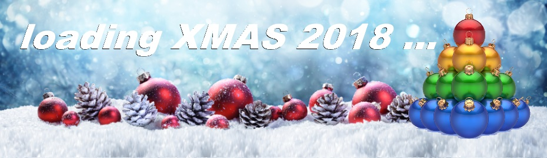

# HACKvent 2018

The annual advent calender from Hacking-lab



## Overview


Title                                         | Category    | Points | Flag
--------------------------------------------- | ----------- | ------ | ------------------------------
[Teaser     ](#teaser)                        |             |        | ``
[December 1 ](#day-01-just-another-bar-code)  | Easy        | 2/1    | `HV18-L3ts-5t4r-7Th3-Phun-G33k`
[December 2 ](#day-02-)                       | Easy        | 2/1    | `HV18-`
[December 3 ](#day-03-)                       | Easy        | 2/1    | `HV18-`
[December 4 ](#day-04-)                       | Easy        | 2/1    | `HV18-`
[December 5 ](#day-05-)                       | Easy        | 2/1    | `HV18-`
[December 6 ](#day-06-)                       | Easy        | 2/1    | `HV18-`
[December 7 ](#day-07-)                       | Easy        | 2/1    | `HV18-`
[December 8 ](#day-08-)                       | Medium      | 3/2    | `HV18-`
[December 9 ](#day-09-)                       | Medium      | 3/2    | `HV18-`
[December 10](#day-10-)                       | Medium      | 3/2    | `HV18-`
[December 11](#day-11-)                       | Medium      | 3/2    | `HV18-`
[December 12](#day-12-)                       | Medium      | 3/2    | `HV18-`
[December 13](#day-13-)                       | Medium      | 3/2    | `HV18-`
[December 14](#day-14-)                       | Medium      | 3/2    | `HV18-`
[December 15](#day-15-)                       | Hard        | 4/3    | `HV18-`
[December 16](#day-16-)                       | Hard        | 4/3    | `HV18-`
[December 17](#day-17-)                       | Hard        | 4/3    | `HV18-`
[December 18](#day-18-)                       | Hard        | 4/3    | `HV18-`
[December 19](#day-19-)                       | Hard        | 4/3    | `HV18-`
[December 20](#day-20-)                       | Hard        | 4/3    | `HV18-`
[December 21](#day-21-)                       | Hard        | 4/3    | `HV18-`
[December 22](#day-22-)                       | Expert      | 5/4    | `HV18-`
[December 23](#day-23-)                       | Expert      | 5/4    | `HV18-`
[December 24](#day-24-)                       | Expert      | 5/4    | `HV18-`
[December 25](#day-25-)                       | Expert      | 5/4    | `HV18-`

## Teaser

**Challenge**


**Solution**

The image contains braille code. We translate it to `http://bit.ly/2TJvxHt`

This gets us the following image:


**Flag**
```

```

## Day 01: Just Another Bar Code

**Challenge**

After a decade of monochromity, Santa has finally updated his infrastructure with color displays.


**Solution**

After some Googling, we find JAB Code (Just Another Bar Code) which is a high-capacity 2D color bar code,
which can encode more data than traditional black/white (QR) codes.


- [GitHub repo](https://github.com/jabcode/jabcode)
- [Online Decoder](https://jabcode.org/scan)

Their online decoder gives us the flag

**Flag**
```
HV18-L3ts-5t4r-7Th3-Phun-G33k
```

## Day 02: Me

**Challenge**


Can you help Santa decoding these numbers?

```
115 112 122 127 113 132 124 110 107 106 124 124 105 111 104 105 115 126 124 103 101 131
124 104 116 111 121 107 103 131 124 104 115 122 123 127 115 132 132 122 115 64 132 103
101 132 132 122 115 64 132 103 101 131 114 113 116 121 121 107 103 131 124 104 115 122
123 127 115 63 112 101 115 106 125 127 131 111 104 103 115 116 123 127 115 132 132 122
115 64 132 103 101 132 132 122 115 64 132 103 101 131 114 103 115 116 123 107 113 111
104 102 115 122 126 107 127 111 104 103 115 116 126 103 101 132 114 107 115 64 131 127
125 63 112 101 115 64 131 127 117 115 122 101 115 106 122 107 107 132 104 106 105 102
123 127 115 132 132 122 116 112 127 123 101 131 114 104 115 122 124 124 105 62 102 101
115 106 122 107 107 132 104 112 116 121 121 107 117 115 114 110 107 111 121 107 103 131
63 105 115 126 124 107 117 115 122 101 115 106 122 107 113 132 124 110 107 106 124 124
105 111 104 102 115 122 123 127 115 132 132 122 115 64 132 103 101 131 114 103 115 116
123 107 117 115 124 112 116 121 121 107 117 115 114 110 107 111 121 107 103 131 63 105
115 126 124 107 117 115 122 101 115 106 122 107 107 132 104 106 105 102 121 127 105 132
114 107 115 64 131 127 117 115 122 101 115 112 122 127 111 132 114 107 105 101 75 75
75 75 75 75
```

**Solution**

A series of decodings
  - Octal
  - Base32
  - ?

Decoding script [day02.py](writeupfiles/day02.py):

```python
import base64

input= "115 112 122 127 113 132 124 110 107 106 124 124 105 111 104 105 115 126 124 103 101 131 124 104 116 111 121 107 103 131 124 104 115 122 123 127 115 132 132 122 115 64 132 103 101 132 132 122 115 64 132 103 101 131 114 113 116 121 121 107 103 131 124 104 115 122 123 127 115 63 112 101 115 106 125 127 131 111 104 103 115 116 123 127 115 132 132 122 115 64 132 103 101 132 132 122 115 64 132 103 101 131 114 103 115 116 123 107 113 111 104 102 115 122 126 107 127 111 104 103 115 116 126 103 101 132 114 107 115 64 131 127 125 63 112 101 115 64 131 127 117 115 122 101 115 106 122 107 107 132 104 106 105 102 123 127 115 132 132 122 116 112 127 123 101 131 114 104 115 122 124 124 105 62 102 101 115 106 122 107 107 132 104 112 116 121 121 107 117 115 114 110 107 111 121 107 103 131 63 105 115 126 124 107 117 115 122 101 115 106 122 107 113 132 124 110 107 106 124 124 105 111 104 102 115 122 123 127 115 132 132 122 115 64 132 103 101 131 114 103 115 116 123 107 117 115 124 112 116 121 121 107 117 115 114 110 107 111 121 107 103 131 63 105 115 126 124 107 117 115 122 101 115 106 122 107 107 132 104 106 105 102 121 127 105 132 114 107 115 64 131 127 117 115 122 101 115 112 122 127 111 132 114 107 105 101 75 75 75 75 75 75"

# looks like ascii encoded in octal

output1 = ""
for i in input.split(' '):
    output1 += chr(int(i, 8))

print('output1: ', output1)

# looks like base32

output2 = base64.b32decode(output1)
print('output2: ', output2)

# now what..?
```

This outputs:

```
output1:  MJRWKZTHGFTTEIDEMVTCAYTDNIQGCYTDMRSWMZZRM4ZCAZZRM4ZCAYLKNQQGCYTDMRSWM3JAMFUWYIDCMNSWMZZRM4ZCAZZRM4ZCAYLCMNSGKIDBMRVGWIDCMNVCAZLGM4YWU3JAM4YWOMRAMFRGGZDFEBSWMZZRNJWSAYLDMRTTE2BAMFRGGZDJNQQGOMLHGIQGCY3EMVTGOMRAMFRGKZTHGFTTEIDBMRSWMZZRM4ZCAYLCMNSGOMTJNQQGOMLHGIQGCY3EMVTGOMRAMFRGGZDFEBQWEZLGM4YWOMRAMJRWIZLGEA======
output2:  b'bcefg1g2 def bcj abcdefg1g2 g1g2 ajl abcdefm ail bcefg1g2 g1g2 abcde adjk bcj efg1jm g1g2 abcde efg1jm acdg2h abcdil g1g2 acdefg2 abefg1g2 adefg1g2 abcdg2il g1g2 acdefg2 abcde abefg1g2 bcdef '
```

**Flag**
```
HV18-
```

## Day 03:

**Challenge**

**Solution**

**Flag**
```
HV18-
```

## Day 04:

**Challenge**

**Solution**

**Flag**
```
HV18-
```

## Day 05:

**Challenge**

**Solution**

**Flag**
```
HV18-
```

## Day 06:

**Challenge**

**Solution**

**Flag**
```
HV18-
```

## Day 07:

**Challenge**

**Solution**

**Flag**
```
HV18-
```

## Day 08:

**Challenge**

**Solution**

**Flag**
```
HV18-
```

## Day 09:

**Challenge**

**Solution**

**Flag**
```
HV18-
```

## Day 10:

**Challenge**

**Solution**

**Flag**
```
HV18-
```

## Day 11:

**Challenge**

**Solution**

**Flag**
```
HV18-
```

## Day 12:

**Challenge**

**Solution**

**Flag**
```
HV18-
```

## Day 13:

**Challenge**

**Solution**

**Flag**
```
HV18-
```

## Day 14:

**Challenge**

**Solution**

**Flag**
```
HV18-
```

## Day 15:

**Challenge**

**Solution**

**Flag**
```
HV18-
```

## Day 16:

**Challenge**

**Solution**

**Flag**
```
HV18-
```

## Day 17:

**Challenge**

**Solution**

**Flag**
```
HV18-
```

## Day 18:

**Challenge**

**Solution**

**Flag**
```
HV18-
```

## Day 19:

**Challenge**

**Solution**

**Flag**
```
HV18-
```

## Day 20:

**Challenge**

**Solution**

**Flag**
```
HV18-
```

## Day 21:

**Challenge**

**Solution**

**Flag**
```
HV18-
```

## Day 22:

**Challenge**

**Solution**

**Flag**
```
HV18-
```

## Day 23:

**Challenge**

**Solution**

**Flag**
```
HV18-
```

## Day 24:

**Challenge**

**Solution**

**Flag**
```
HV18-
```

## Day 25:

**Challenge**

**Solution**

**Flag**
```
HV18-
```
