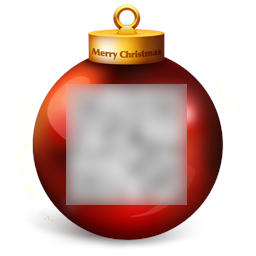
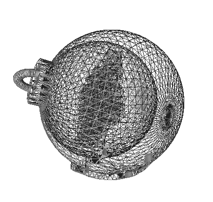

# HACKvent 2019

The annual advent calender from Hacking-lab


## Overview


Title                                             | Category    | Points | Flag
------------------------------------------------- | ----------- | ------ | ------------------------------
[December 1 ](#day-01)                            | Easy        | 2/1    | `HV19{just-4-PREview!}`
[December 2 ](#day-02)                            | Easy        | 2/1    | `HL18-`
[December 3 ](#day-03)                            | Easy        | 2/1    | `HV18-`
[December 4 ](#day-04)                            | Easy        | 2/1    | `HV18-`
[December 5 ](#day-05)                            | Easy        | 2/1    | `HV18-`
[December 6 ](#day-06)                            | Easy        | 2/1    | `HV18-`
[December 7 ](#day-07)                            | Easy        | 2/1    | `HV18-`
[December 8 ](#day-08)                            | Medium      | 3/2    | `HV18-`
[December 9 ](#day-09)                            | Medium      | 3/2    | `HV18-`
[December 10](#day-10)                            | Medium      | 3/2    | `HV18-`
[December 11](#day-11)                            | Medium      | 3/2    | `HV18-`
[December 12](#day-12)                            | Medium      | 3/2    | `HV18-`
[December 13](#day-13)                            | Medium      | 3/2    | `HV18-`
[December 14](#day-14-)                           | Medium      | 3/2    | `HV18-`
[December 15](#day-15-)                           | Hard        | 4/3    | `HV18-`
[December 16](#day-16-)                           | Hard        | 4/3    | `HV18-`
[December 17](#day-17-)                           | Hard        | 4/3    | `HV18-`
[December 18](#day-18-)                           | Hard        | 4/3    | `HV18-`
[December 19](#day-19-)                           | Hard        | 4/3    | `HV18-`
[December 20](#day-20-)                           | Hard        | 4/3    | `HV18-`
[December 21](#day-21-)                           | Hard        | 4/3    | `HV18-`
[December 22](#day-22-)                           | Expert      | 5/4    | `HV18-`
[December 23](#day-23-)                           | Expert      | 5/4    | `HV18-`
[December 24](#day-24-)                           | Expert      | 5/4    | `HV18-`
[December 25](#day-25-)                           | Expert      | 5/4    | `HV18-`

## Day 01: Censored

**Challenge**

I got this little image, but it looks like the best part got censored on the way. Even the tiny preview icon looks clearer than this! Maybe they missed something that would let you restore the original content?



**Solution**

The description sounds like it has something to do with the thumbnail image. Indeed if we download the image we see a QR code in the thumbnail image in our file explorer. We can use exiftool to extract the thumbnail image embedded in the JPEG format:

```
exiftool -b -ThumbnailImage f182d5f0-1d10-4f0f-a0c1-7cba0981b6da.jpg > thumbnail.jpg
```

Then we read this with QR scanner to get our flag


**Flag**
```
HV19{just-4-PREview!}
```

## Day 02: Triangulation

**Description**

Today we give away decorations for your Christmas tree. But be careful and do not break it.

[Triangulation.stl](writeupfiles/dec02/Triangulation.stl)

**Solution**

This is a [STL file](https://en.wikipedia.org/wiki/STL_(file_format)) containing a 3D model of a Christmas bauble:


Nothing obvious there, but if we look at the wireframe view we see that there is more inside:



Cutting through the ball in blender we see an aztec code inside. After cleaning up the image, converting to b/w, removing noise, rotating, we can [read the code](https://www.onlinebarcodereader.com/)


**Flag**
```
HV19{Cr4ck_Th3_B411!}
```

## Day X: Title

**Description**

**Solution**

**Flag**
```
HV19{}
```
