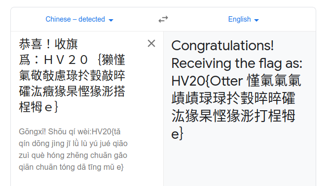

# HACKvent 2020

The annual advent calender from Hacking-lab


## Overview


Title                                             | Category    | Points | Flag
------------------------------------------------- | ----------- | ------ | ------------------------------
[Teaser ](#day--1-twelve-steps-of-christmas)      | Easy        | 2/1    | `HV20{34t-sl33p-haxx-rep34t}`
[December 1 ](#day-01-happy-hackvent-2020)        | Easy        | 2/1    | `HV20{7vxFXB-ItHnqf-PuGNqZ}`
[December 2 ](#day-02)                            | Easy        | 2/1    | `HV20-`
[December 3 ](#day-03)                            | Easy        | 2/1    | `HV20-`
[December 4 ](#day-04)                            | Easy        | 2/1    | `HV20-`
[December 5 ](#day-05)                            | Easy        | 2/1    | `HV20-`
[December 6 ](#day-06)                            | Easy        | 2/1    | `HV20-`
[December 7 ](#day-07)                            | Easy        | 2/1    | `HV20-`
[December 8 ](#day-08)                            | Medium      | 3/2    | `HV20-`
[December 9 ](#day-09)                            | Medium      | 3/2    | `HV20-`
[December 10](#day-10)                            | Medium      | 3/2    | `HV20-`
[December 11](#day-11)                            | Medium      | 3/2    | `HV20-`
[December 12](#day-12)                            | Medium      | 3/2    | `HV20-`
[December 13](#day-13)                            | Medium      | 3/2    | `HV20-`
[December 14](#day-14-)                           | Medium      | 3/2    | `HV20-`
[December 15](#day-15-)                           | Hard        | 4/3    | `HV20-`
[December 16](#day-16-)                           | Hard        | 4/3    | `HV20-`
[December 17](#day-17-)                           | Hard        | 4/3    | `HV20-`
[December 18](#day-18-)                           | Hard        | 4/3    | `HV20-`
[December 19](#day-19-)                           | Hard        | 4/3    | `HV20-`
[December 20](#day-20-)                           | Hard        | 4/3    | `HV20-`
[December 21](#day-21-)                           | Hard        | 4/3    | `HV20-`
[December 22](#day-22-)                           | Expert      | 5/4    | `HV20-`
[December 23](#day-23-)                           | Expert      | 5/4    | `HV20-`
[December 24](#day-24-)                           | Expert      | 5/4    | `HV20-`
[December 25](#day-25-)                           | Expert      | 5/4    | `HV20-`


## Day -1: Twelve steps of christmas

**Description**

On the third day of christmas my true love sent to me...

three caesar salads,
two to (the) six arguments,
one quick response.

[message](writeupfiles/teaser.txt)

**Solution**

```
Sbopb 3 alkb! Lcc tfqe vlr! Dbq yxzh ql tloh! Vlr'ob klq alkb ebob...

fSYLOt0HDdlXXXXKPReBRdXXXWlXXXDxZXXXXXXQyan/XXXGfUmRTEOPVUzdzEGsWjipWPY0bUYi
FDS4xTVXXEgxoSeyhrP4AcwkHUtBdf+Nu+Bwtgct8W0Gnnlc07sbfUCUiHPfHYYBGeGNr/2ccu/3
I/vCCouITTqmmUg8mWWx6Ifl/s41L4mMaouA/yjPo+MrcPMdEEDL94y2buybwu8MsKxN8UUz1baL
nF+e5tVJ21/hvoubk53BbIgghi4b7UqOTqUMol7E0EtjjfsMK73arfc+ai8DCCCxDNsCBExR6L1V
otcucgqDYJzNCcJhni0EWwabueZNI9q7ky3/EHXsNU5arb/Oc199Z354dOH/uyF8JzICgwzhcurM
72UZ54Ug26Mt7Ryt/WcqMK9wSg1k3931SYAO8gAHdf0sJ5d4BMGlguS8CK+Jx7SMt6afjNkFi59+
4ALiPRZNg5JhP7lz2UxbJrCfZgpXhuAZAKEDHgYnVRyfiMfOBwP2rDFCWgKpCvLDt9pUpUTyoQbi
VrRijYlBulNt/9UE/a3K3/j4zvWAGI6+VtT/XkhKK4dzg5dCNLN8rDRI8LswtL8/8NaRYVIWtivu
tb7EKQDvcEXoDp4O8wILK4UB6UlJFBOVL8JWmBXPUvOjHbF1YYSYEZpX6sX8uYNDBGZzt4HQFzSV
dqKNX9cDJvl2K+ONXlbeQNXfu4G8nhZlX6vRJsfgnVGAMzbzzp4ix64rq9uIIHkhRllTfiwUnBjw
CiTq2oQUTCMKqSPqqyyxT2dODmeyxamnx6334AlT6oASJy9gWFNOOum5iHDgggy6YE1jjkjTnyML
KspHHv7FuZmIS11q9P1rNvi22kjUoysrqspY10486bOQgm562ris1Y5Rc/k8YjovlYVJHz7QK2lV
axlsB0F5vzNJfFRhNCvGXXdafGjshiFdzpQJq4ZhvXCLWjIgieXuNGf2eEwhga0Ezs8FK5coM8Fq
/Z/hEHE7cvAkXK2srM2X2nIzQRMpWfCg6fLvA3K6nX5c73E40/LcDvlKZmcXl91AD/LJGQwXT8Pm
kIeMRe68QbdgvO7MA5pa2j4hTJmdwr7CNN639pzX1AHwZjaGx3JaMiekMckitCvp0ydM4AphyLCZ
29ErFl/lDb6wZ9Ej4z5FBisUi+hs53S2LIL09ymvbDxjASFlfAkXpBFol2y0F/gOGh6XHzXm3C5+
oKFPEDMydz21Kl+hpymo1T92FofWlROdDcvyiTYoegpuari5ITvFiTvCRwoPIHxfkGhTlm1RipJG
Fqa62kACu9i6emkBKnGmpcXgRnUOEPNzyeTILhfzeV7Ertqk20XZqC5vyEzcbhN3hd/ldUAMKcaZ
rA+a2wdwk7mfy8KWWIJCm60j8Y6jkqddbWLdNpHYxoCYo7dpUClVvgg4SFHUkyT/xygyOIxvGqE/
ddlHEuh9M2CrFwkPjgjLLLkwfltmL46CFP6B/fdyq5ZZJDKeeudqqCD2yrrI4tIaJLrZSOX+gXvj
W+JL6Ad8xe/7UIrqe27v+Ov18E6JekmWMams38v7+9pe8lqcueZobSXhCBPUU8Z1tQepjnK229rB
roiHQWpqxiNjAGdK5X+7EQx7lbJP/zaZXqTrTgoy1XgchT2SztIQvOrgfmG7AanWRZZuT0DrNVpy
nRELBF8ZK5hXlDs62X+c6dd6HyzD+yE1PPI3VuxO0O4ld90NYzNFykjAZzZXgsdZo4Z8qgBY212T
ua3GYBo+uBUXrSTgBWmg+CNd++OvxAOruAbFYyOR2Zfz5f7WPNvW3pICBzq6NRlxDyi1YdUy3/Z8
Dsvz4hhCloaVFKLGnZtWAAOVZpTktTtLj5rCLHzYfQi/kvxLcHefkmG9Auv2CN+NXt7RpmrliqhH
vlniYNmlOCVgZnB40JNfXG/VXcRkudX+FcUeCmmdRGu2BUBwlYrsZLUnlTtHFEZdO0IK9XtO8dIy
g2F74yMFhxpibiTJP45YAS2AhAZ8VrIqvlImuYQsiY2196illoyFTRg5A9TA/kuNYYlGguYTPrZ0
CwyZD8h74XLovd1axegnSkgBiYE+dEZqFQ8kOVYqAOHSEnD1HKDfoXtC7ZL0BvQn2RF9QZDtAaIB
fLNmMOkWIESQxlSGQzhJ9eO6Q6l5auYKaM0STkp/KWRX7r3H+oFHXJ6foqhH0Xoz4WxNo+rk+lJD
YD3DsqHLC0X0MHxfSkUN9AfBe8Rw3btNnBYljOLVgbDNISBNfHfZ8FxoBxO1eIs5sRphIbxTPp0d
gASvZ9NkqZgNpzYZ/xY+H9gO6tV3emN4jtnYVIe2xu3wpiGSDafVk/H3hB444V2DF5PlwXx+NQQG
MSpHIw3zscpeEJwTtVkD/WOqG9ugOf9GL4rbR+nQ7ULwfIiVfb0gpntMcFtWP33tSA+hYsJTS9eU
O72uBpBHRG5dRYWz93aiYdJmzQTE3XxEIIu4Uyc6kRtvtYSNVno9l+HBj1YiktGA8kgZQSf98gbN
TLeTL2+P8qNNqaw4KUcz1+QOzxTaFYcQyZR1YygZyjJYjar6e8uDVjZiqHtWtLp6LBWv+fsKq8zd
lEgGuOlluKuxdm+WvVVcS65bDzLDAAki7AExNp7zOlWXj2WpPqgzuxojJgxQneNvc5LMOOyrQYeu
vili2vlOuT6WEQXaKBU0/hGCqli6SCpTiQJjYt/OOWU90FQqBnf+K0Urny7TBcSUh2Q0eRuTjjKM
xVuEgDvDZaBWHCbsXj/mrwzovPMMsH7QHpRKk5DhDxnqr6zQJXjkn2HzOgJAJvXAjvBQCnd6kX+J
lfTM1NsQJPmaYl8JFbVh0d8GTfC94+bTWGdV3blAD2thhDyODe5pIN7M9+KZIaiUP9dJ+EzDn+hv
dNNrhPwiNBW/XOLWnCGLESRAzlJBrjBrkoQGCGkG6Le1E9xu+oHTWoY3HcWMnyr8TCsgLzPiK7lC
sDEZU4V77jxiwes7BMENwhKfy7B2ew5F4y7RjF8b9rJxK9VvAzT7G/Qiz7MHE09A7ttSwIZ2iOPb
q+0H3D29JyqWr61Su9OeujPdNgP897YTgLPVkQVWWOaSGag7Xxo/F4nyyxsnpKUittIRiZHoSZko
ZW1/Pot1uxya3q4fnLjlhAYuaWrerN9yFVCgFsU2DsX0a1arVs3RpYYSGms1Lr8ULI54txs3D94w
tSBlvNToZ2wi8yVPU8+kZYcxu3QM8BhwvyzLwGuEMJnSBVVRuW6RWdwpAcH2yGeJiNtShMOy90ZE
yjK37UQsFKzlrg/Rha89rw818KjN4n2+rc8ZIwLJgbyfnmBXXXBgxRKARBiANvYtzj9jxTuiXXY4
kG2NsRoBNYPCQ1WO8NzBuRFqRqdr2GgHWiRFdhHJHufqpmJpIjyDhGii8N18B32VINQYG/XGCHt9
K1mVLF0QIrcgzr85JtB6VxT0ka0CqECKkMxvv+tnkE/ABoxtHi+ryK1IheK4w+zoXqDUokg55/48
z0SmCUUHJnmrEYAph6LGn4SWTI/qm4chY3GVxCLNk8d7eP6BWQcS1Sg9bJmqihqwzP591gWfELJR
ZRFJJJVFCOv6SJMLBPIpRTJ0vEBMZ0TqRIF34VwAAzkPHzVYnR/fyQu5j21btmNYMRy0hlN7xEmH
ErQ/cn99kITytzx0wmr8yz2tLpJe8M4FoDQX2gLtbL3GTsg9Kp9J1J78841c0u1NTe5j1D4XXXXG
zBeWztXXZuJXXXpQXNZxkYdXXXXEaBiKONchZupNCeZptYO4XXXB8hiBNSO42r3aT3IgFYYXRQwJ
/kaJWQxNVooQIOh5537j4Qd+YSSdDy2+ep7pg5zXgaZdBOl0NfJ0xFNDgaXFAOneNPJ0NlKDxKXF
gaZdBOl0NfJ0xFNDgaZdBOneNPJ0xFOD/+qs9XaUv5+y28c77os7o0Tc82u59q2sdSCgNeJxKBFg
KDfBYl3L3d3Fo2xgn+fW/q39Hk+/hwZ2351sbd2JDeLx0HXODnCYFwOlaMWrNJ8ncuQT8cjS+dt+
+5U+M7mcX6MDeZV0xFODxKXFAOnasOqNHy/D/j6ElMG5d541r1CgNeJxlRBgKDfBOjgpYhQoLNRd
/wjZ6CRE3TzLDARjKHCYFwOZd0Wl0LdwadKjv+9ba639cj3cz73XKDmJxBFgKDfBYl3NZJ0s2X3l
LSh/bqbXL7420g+3gYlQjqXFAOneNPJ0NsMzUi8EMWkl1ck5ntiT888WKPV0lOBxKBHAOjfB5gcp
YqwuUkkMvVIO9U7+LlAH/Nvg/6SOV0FQDgOZFwOleXxKIn/mCJElnowkGJAlAhEM40S/oss8X6MD
eZV0xFNDgaXFAOnapupNUQC3c6W/YEzP8kpX0aS7cnbg8ivJDeLx0HXODgOZFwOlaJ5rNLU6+/wU
8gpL0O2Z/Jl/+kgInADeZV3NlYBxKBFgKY+2D9ZwLn68yw8HLtk5/VMW/DlVKPV0lRBgKBHAOjgN
6J394G4Z+OUrsLu3l6zX9CwMJKHMC/2rRTKZBul0NfJ0xFNDgT4pcD1X/ev+687p73iT0xG/atx/
x9PV0FNDgaXFAOneNxLk7XWRSqV9m/5SwsZIosFomui0k2el1GgNeXxK0HXODnCYl3K2X/Io8+dL
NcOLXnMtr9CoCvm3KWgYouh1GgPeNPJ0NlKDxKAl7K2X6Is1Mb/sg8pb+V67B1yrkjgRjKZBYl3N
ZX0xlRDgz3VAbiyE+2yeRxI3ZngpO0Q/ojpAQDeZFwOleXxK0XgK0c3dkdHSUVM8nU/OUVM8r/8g
/Suj4QStyVXGQTgNZF3NlYBxKAnjZ88KvH+LH1+ooMc3w3NTUlKi1GgNeBWl0XdKDnCYltcsYiQT
qcho569y70aU/skQXac2hWaOV0FQDgOZFwOleXxKEozypC//Sqy2H72v7ik5g/Owfy4rl7XEVKPV
0FNDgaXFAOneNxJQatKDbpTzsu/YxCj9O9/m7w4ezOl1GgPeBOl0NlKDxFQj5JHkZK5uOhA3rorv
Ri/KI7O7ZmgNeXxK0XdKDnCYl+cqYkPUc7z+cuU/yEi+3SzkrHbXZR1l0XfK0HXODgO6z7bzFoec
k3csXbQU7K07YGUcJDmJxBHAOjfBYl3NlKB5rtDgpH5aiw3v/oJHiOJB8p9sDQRjKHBODgOZd0Wl
eLWgatLf69+b8tY6MfiNrQyXMNTBYl3NlYBxlRBgKEVA7fe6U8E92g6/T1B5C9DlJxBGgaZdBOl0
NfJ0adKDzZ2+U22sKw3bZH7381zVLBUNeZV0xFODxKXFAOl9bQbd533u2ct38r/dO/zMWrBWDARj
KHCYFwOZd0Wl0LgGrtB9m+SS7e9NrWcc/gJFMTzQgMQ+dSCgNeJxKBFgKDfBYl1r7MUiKQYneXxK
0HXODnCYFwOleBWl0XdKDnBODgOZd0WleXxK0HXODnCYFwOleXxK0XdKDnCYFwOZ89Q+Xb9rY3Zy
veGRXXXXXBiCQhPrNjZZ
```

The first line looks like a ceasar cipher, and it reads

```
Verse 3 done! Off with you! Get back to work! You're not done here...
```

The rest of the message looks like base64, but it isn't quite right..

But what if we combine the two, do a caesar shift first, and then base64 decode?

```bash
$ cat 0.txt | caesar 3 | base64 -d > caesarbase64
$ file caesarbase64
caesarbase64: PNG image data, 410 x 410, 8-bit grayscale, non-interlaced

```

we get a png image!


The image looks completely white..


but there are different shades of white, and using GIMP we can uncover the hidden QR code!


**Flag**

```
HV20{34t-sl33p-haxx-rep34t}
```


## Day 01: Happy HACKvent 2020

**Description**

Welcome to this year's HACKvent.

Attached you can find the "Official" invitation to the HackVent.


One of my very young Cyber Elves cut some parts of the card with his alpha scissors.

Have a great HACKvent,

– Santa

**Solution**

opening it in GIMP doesn't lead anywhere, we see the code has been cut out with the "alpha scissors":


but running exiftool gives us a hint

```bash
$ exiftool dec1.png
ExifTool Version Number         : 1.88
File Name                       : 1.png
Directory                       : writeupfiles
File Size                       : 2.5 MB
File Modification Date/Time     : 2020:12:01 20:11:37+01:00
File Access Date/Time           : 2020:12:01 20:13:25+01:00
File Inode Change Date/Time     : 2020:12:01 20:11:37+01:00
File Permissions                : rw-rw-r--
File Type                       : PNG
File Type Extension             : png
MIME Type                       : image/png
Image Width                     : 1600
Image Height                    : 900
Bit Depth                       : 8
Color Type                      : RGB with Alpha
Compression                     : Deflate/Inflate
Filter                          : Adaptive
[..]
Background Color                : 255 255 255
Pixels Per Unit X               : 2835
Pixels Per Unit Y               : 2835
Pixel Units                     : meters
Modify Date                     : 2020:11:17 07:39:19
Image Size                      : 1600x900
Megapixels                      : 1.4
Thumbnail Image                 : (Binary data 8609 bytes, use -b option to extract)
```

There is a thumbnail image embedded, lets see if that has more info in it!

```bash
$ exiftool -b -ThumbnailImage dec1.png > dec1_thumbnail.png

```


Aha! we can still see the flag on here!

**Flag**
```
HV20{7vxFXB-ItHnqf-PuGNqZ}
```

## Day 02: Title

**Description**

I've received this note from a friend, who is a Chinese CTF player:

    恭喜！收旗爲：ＨＶ２０｛獭慬氭敬敧慮琭扵瑴敲晬礭汯癥猭杲慳猭浵搭桯牳ｅ｝

Unfortunately, Google Translate wasn't of much help:


I suspect the data has somehow been messed up while transmitting it.

Sadly, I can't ask my friend about more details. The Great Chinese Firewall is thwarting our attempts to reach each other, and there's no way I'm going to install WeChat on my phone.

**Solution**

Google Translate gives the following:




```
慬氭氭氭歵歵琭琭扵瑴晬晬礭汯猭杲悭猭浵打桯牳
```

Congratulations: 恭喜
Flag collection: 收旗爲

While attempting to convert it into utf16, it turned out that was the solution?

```
$ iconv -f UTF-8 -t UTF-16LE writeupfiles/dec2.txt
msla-llegena-tubttrelf-yolev-srgsa-sum-dohsrE
$ iconv -f UTF-8 -t UTF-16BE writeupfiles/dec2.txt
small-elegant-butterfly-loves-grass-mud-horsE
```

**Flag**
```
HV20{small-elegant-butterfly-loves-grass-mud-horsE}
```

## Day 03: Title

**Description**

**Solution**

**Flag**
```
HV20{}
```

## Day 04: Title

**Description**

**Solution**

**Flag**
```
HV20{}
```

## Day 05: Title

**Description**

**Solution**

**Flag**
```
HV20{}
```

## Day 06: Title

**Description**

**Solution**

**Flag**
```
HV20{}
```

## Day 07: Title

**Description**

**Solution**

**Flag**
```
HV20{}
```
## Day 08: Title

**Description**

**Solution**

**Flag**
```
HV20{}
```

## Day 09: Title

**Description**

**Solution**

**Flag**
```
HV20{}
```

## Day 10: Title

**Description**

**Solution**

**Flag**
```
HV20{}
```

## Day 11: Title

**Description**

**Solution**

**Flag**
```
HV20{}
```

## Day 12: Title

**Description**

**Solution**

**Flag**
```
HV20{}
```

## Day 13: Title

**Description**

**Solution**

**Flag**
```
HV20{}
```

## Day 14: Title

**Description**

**Solution**

**Flag**
```
HV20{}
```

## Day 15: Title

**Description**

**Solution**

**Flag**
```
HV20{}
```

## Day 16: Title

**Description**

**Solution**

**Flag**
```
HV20{}
```

## Day 17: Title

**Description**

**Solution**

**Flag**
```
HV20{}
```

## Day 18: Title

**Description**

**Solution**

**Flag**
```
HV20{}
```

## Day 19: Title

**Description**

**Solution**

**Flag**
```
HV20{}
```

## Day 20: Title

**Description**

**Solution**

**Flag**
```
HV20{}
```

## Day 21: Title

**Description**

**Solution**

**Flag**
```
HV20{}
```

## Day 22: Title

**Description**

**Solution**

**Flag**
```
HV20{}
```

## Day 23: Title

**Description**

**Solution**

**Flag**
```
HV20{}
```

## Day 24: Title

**Description**

**Solution**

**Flag**
```
HV20{}
```
