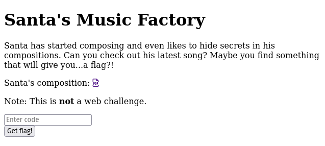
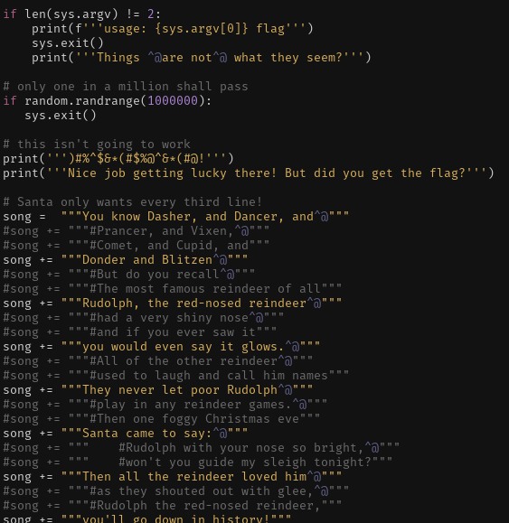
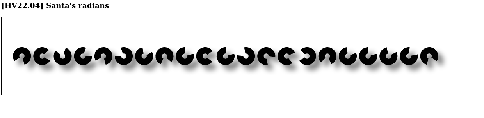

# HACKvent 2022


The annual advent calender from Hacking-lab

## Overview

Title               | Category    | Points | Flag
------------------- | ----------- | ------ | ------------------------------
[December 1](#day-1-qr-means-quick-reactions-right)      | Easy        | 2/1    | `HV22{HV22{I_CaN_HaZ_Al_T3h_QRs_Plz}`
[December 2](#day-2-santas-song)      | Easy        | 2/1    | `HV22{}`
[December 3](#day-3-gh0st)      | Easy        | 2/1    | `HV22{nUll_bytes_st0mp_cPy7h0n}`
[December 4](#day-4-santas-radians)      | Easy        | 2/1    | `HV22{C4lcul8_w1th_PI}`
[December 5]()      | Easy        | 2/1    | `HV22{}`
[December 6]()      | Easy        | 2/1    | `HV22{}`
[December 7]()      | Easy        | 2/1    | `HV22{}`
[December 8]()      | Easy        | 2/1    | `HV22{}`
[December 8]()      | Easy        | 2/1    | `HV22{}`
[December 10]()      | Easy        | 2/1    | `HV22{}`
[December 10]()      | Easy        | 2/1    | `HV22{}`
[December 12]()      | Easy        | 2/1    | `HV22{}`
[December 13]()      | Easy        | 2/1    | `HV22{}`
[December 14]()      | Easy        | 2/1    | `HV22{}`
[December 15]()      | Easy        | 2/1    | `HV22{}`
[December 16]()      | Easy        | 2/1    | `HV22{}`
[December 17]()      | Easy        | 2/1    | `HV22{}`
[December 18]()      | Easy        | 2/1    | `HV22{}`
[December 19]()      | Easy        | 2/1    | `HV22{}`
[December 20]()      | Easy        | 2/1    | `HV22{}`
[December 21]()      | Easy        | 2/1    | `HV22{}`
[December 22]()      | Easy        | 2/1    | `HV22{}`
[December 23]()      | Easy        | 2/1    | `HV22{}`
[December 24]()      | Easy        | 2/1    | `HV22{}`


## Day 1: QR means quick reactions, right?

**Description**

Santa's brother Father Musk just bought out a new decoration factory. He sacked all the developers and tried making his own QR code generator but something seems off with it. Can you try and see what he's done wrong?


**Solution**

The gif cycles through multiple QR codes quickly, let's read all of them:

First, we extract each frame using imagemagich:

```bash
$ mkdir img
$ convert hackvent2022_01.gif -coalesce img/xx_%05d.png
```

We get [30 images](writeupfile/dec1/img/), all with different QR codes. Let's read all of them using zbar-tools

```bash
$ cd img
$ zbarimg .
QR-Code:H
QR-Code:V
QR-Code:2
QR-Code:2
QR-Code:{
QR-Code:I
QR-Code:_
QR-Code:C
QR-Code:a
QR-Code:N
QR-Code:_
QR-Code:H
QR-Code:a
QR-Code:Z
QR-Code:_
QR-Code:A
QR-Code:l
QR-Code:_
QR-Code:T
QR-Code:3
QR-Code:h
QR-Code:_
QR-Code:Q
QR-Code:R
QR-Code:s
QR-Code:_
QR-Code:P
QR-Code:l
QR-Code:z
QR-Code:}
scanned 30 barcode symbols from 30 images in 3.1 seconds

```

So each frame gives us one letter of the flag, putting them all togeher we get

**Flag**

```
HV22{I_CaN_HaZ_Al_T3h_QRs_Plz}
```


## Day 2: Santa's Song

**Description**

Santa has always wanted to compose a song for his elves to cherish their hard work. Additionally, he set up a vault with a secret access code only he knows!

The elves say that Santa has always liked to hide secret messages in his work and they think that the vaults combination number may be hidden in the magnum opus of his.

What are you waiting for? Go on, help the elves!

Hint #1: Keep in mind that you are given a web service, not a play button for a song.

Hint #2: As stated in the description, Santa's vault accepts a number, not text.

**Solution**

We get a website with a submission form:




And the [pdf with the song](writeupfiles/dec2/song.pdf):


**Flag**


## Day 3: gh0st

**Description**

The elves found this Python script that Rudolph wrote for Santa, but it's behaving very strangely. It shouldn't even run at all, and yet it does! It's like there's some kind of ghost in the script! Can you figure out what's going on and recover the flag?

[gh0st.py](writeupfiles/dec3/gh0st.py)

**Solution**

The code is:

```python
#!/usr/bin/env python3.7

import random
import sys


if len(sys.argv) != 2:
    print(f'''usage: {sys.argv[0]} flag''')
    sys.exit()
    print('''Things are not what they seem?''')
# only one in a million shall pass
if random.randrange(1000000):
   sys.exit()
# this isn't going to work
print(''')#%^$&*(#$%@^&*(#@!''')
print('''Nice job getting lucky there! But did you get the flag?''')

# Santa only wants every third line!
song =  """You know Dasher, and Dancer, and"""
#song += """#Prancer, and Vixen,"""
#song += """#Comet, and Cupid, and"""
song += """Donder and Blitzen"""
#song += """#But do you recall"""
#song += """#The most famous reindeer of all"""
song += """Rudolph, the red-nosed reindeer"""
#song += """#had a very shiny nose"""
#song += """#and if you ever saw it"""
song += """you would even say it glows."""
#song += """#All of the other reindeer"""
#song += """#used to laugh and call him names"""
song += """They never let poor Rudolph"""
#song += """#play in any reindeer games."""
#song += """#Then one foggy Christmas eve"""
song += """Santa came to say:"""
#song += """    #Rudolph with your nose so bright,"""
#song += """    #won't you guide my sleigh tonight?"""
song += """Then all the reindeer loved him"""
#song += """#as they shouted out with glee,"""
#song += """#Rudolph the red-nosed reindeer,"""
song += """you'll go down in history!"""

print(song)
flag = list(map(ord, sys.argv[1]))
correct = [17, 55, 18, 92, 91, 10, 38, 8, 76, 127, 17, 12, 17, 2, 20, 49, 3, 4, 16, 8, 3, 58, 67, 60, 10, 66, 31, 95, 1, 93]

for i,c in enumerate(flag):
    flag[i] ^= ord(song[i*10 % len(song)])
    #print(flag[i],"-", flag[i]^correct[i])

for i,c in enumerate(correct):
    correct[i] ^= ord(song[i*10 % len(song)])
    print(correct[i],"-", chr(correct[i]))

print("".join([chr(a) for a in correct]))

if all([c == f for c,f in zip(correct, flag)]):
    print('''Congrats!''')
else:
    print('''Try again!''')
```


So the the list `correct` encodes the flag. Luckily it is XOR based, so easy to reverse. We can just add a bit of code to make it give us the flag.

We also see some sneaky null bytes inside all the strigs when we open with Vim:



But these won't really affect us since we're making the program compute the answer for us.

Here is the code we add near the bottom of the file:


```python
#copy the existing function, just use correct instead of flag, since it's XOR
for i,c in enumerate(correct):
    correct[i] ^= ord(song[i*10 % len(song)])
    print(correct[i],"-", chr(correct[i]))

# print out the flag all at once
print("".join([chr(a) for a in correct]))
```

And this gives us the flag!

```bash
$ python3 gh0st.py aaa
Nice job getting lucky there! But did you get the flag?
72 - H
86 - V
50 - 2
50 - 2
123 - {
110 - n
85 - U
108 - l
108 - l
95 - _
98 - b
121 - y
116 - t
101 - e
115 - s
95 - _
115 - s
116 - t
48 - 0
109 - m
112 - p
95 - _
99 - c
80 - P
121 - y
55 - 7
104 - h
48 - 0
110 - n
125 - }
HV22{nUll_bytes_st0mp_cPy7h0n}
Try again!
```


**Flag**

```
HV22{nUll_bytes_st0mp_cPy7h0n}
```


## Day 4: Santa's radians

**Description**

Santa, who is a passionate mathematician, has created a small website to train his animation coding skills. Although Santa lives in the north pole, where the degrees are very low, the website's animation luckily did not freeze. It just seems to move very slooowww. But how does this help...? The elves think there might be a flag in the application...

**Solution**

We are given a website with some moving discs:



We look at the html code for the page:

```html
<!DOCTYPE html>
<html lang="en">
<head>
    <meta charset="UTF-8">
    <title>The UPICode</title>
</head>
<body>

<h3>[HV22.04] Santa's radians</h3>

<canvas width="1200" height="200" id="canvasPiCode" style="border: 1px solid black"></canvas>
<script>
    const canvas = document.getElementById("canvasPiCode");
    const context = canvas.getContext("2d");
    let clientX = 0;

    canvas.addEventListener('mousemove', e => {
        clientX = e.clientX*7/1000;
    });

    let rot = [2.5132741228718345, 0.4886921905584123, -1.2566370614359172, 0, 2.548180707911721, -1.9547687622336491, -0.5235987755982988, 1.9547687622336491, -0.3141592653589793, 0.6283185307179586, -0.3141592653589793, -1.8151424220741028, 1.361356816555577, 0.8377580409572781, -2.443460952792061, 2.3387411976724013, -0.41887902047863906, -0.3141592653589793, -0.5235987755982988, -0.24434609527920614, 1.8151424220741028];
    let size = canvas.width / (rot.length+2);

    context.strokeStyle = "black";
    context.lineWidth = size*5/16;
    context.shadowOffsetX = size/4;
    context.shadowOffsetY = size/4;
    context.shadowColor = "gray";
    context.shadowBlur = size/4;

    let animCount = 0;

    function anim() {
        context.clearRect(0,0,canvas.width,canvas.height);
        for (let i = 0; i < rot.length; i++) {
            context.beginPath();
            context.arc((i + 1) * size, canvas.height / 2, size * 2 / 7, rot[i]+animCount+clientX, rot[i] + 5 +animCount+clientX);
            context.stroke();
        }
        animCount+=0.001;
        requestAnimationFrame(anim);
    }
    anim();

</script>

</body>
</html>
```

So the `rot` variable likely encodes the flag, if we can just find out how..

```javascript
let rot = [2.5132741228718345, 0.4886921905584123, -1.2566370614359172, 0, 2.548180707911721, -1.9547687622336491, -0.5235987755982988, 1.9547687622336491, -0.3141592653589793, 0.6283185307179586, -0.3141592653589793, -1.8151424220741028, 1.361356816555577, 0.8377580409572781, -2.443460952792061, 2.3387411976724013, -0.41887902047863906, -0.3141592653589793, -0.5235987755982988, -0.24434609527920614, 1.8151424220741028]
```

It most likely starts with `HV22` ..but we see that the third and fourth element aren't equal, and the fourthe element is 0, so maybe it doesn't encode directly, but as a function of the previous character..

Maybe converting radians to degrees? Let's try the first couple:

```bash
Python 3.9.7 (default, Jun 22 2022, 20:11:26)
[GCC 11.2.0] on linux
Type "help", "copyright", "credits" or "license" for more information.
>>> ord("H")
72
>>> ord("V")
86
>>> ord("2")
50
>>> import math
>>> math.degrees(2.5132741228718345)
144.0
>>> math.degrees(0.4886921905584123)
28.0
>>> math.degrees(-1.2566370614359172)
-72.0

```

We are looking for these numbers to map to HV22 (`72 86 50 50` in ASCII). It doesn't quite work out, but we notice some things

- 144 is twice the expected value of 72
- 28 is twice the difference between H (72) and V (86)
- -72 is twice the difference from V (86) to 2 (50)

Ok, looks like we got it! Let's get a quick python script to decode for us:

```python
import math

rot = [2.5132741228718345, 0.4886921905584123, -1.2566370614359172, 0, 2.548180707911721, -1.9547687622336491, -0.5235987755982988, 1.9547687622336491, -0.3141592653589793, 0.6283185307179586, -0.3141592653589793, -1.8151424220741028, 1.361356816555577, 0.8377580409572781, -2.443460952792061, 2.3387411976724013, -0.41887902047863906, -0.3141592653589793, -0.5235987755982988, -0.24434609527920614, 1.8151424220741028]

last = 0
flag = ""
for i in rot:
  f = last+math.degrees(i)/2
  last = f
  flag += chr(int(f))

print(flag)

```

This gives us the flag, almost:

```
HV22{C4lcul8_w1sg^OH|
```

It seems to be getting off by 1 at the end but we just increase the characters by 1 manually to get the right flag (not sure what's gonig on there, maybe a mistake in the challenge? but this was close enough to get us to the answer)


```
HV22{C4lcul8_w1th_PI}
```

**Flag**

```
HV22{C4lcul8_w1th_PI}
```

## Day X: Title

**Description**

**Solution**

**Flag**

## Day X: Title

**Description**

**Solution**

**Flag**

## Day X: Title

**Description**

**Solution**

**Flag**

## Day X: Title

**Description**

**Solution**

**Flag**

## Day X: Title

**Description**

**Solution**

**Flag**

## Day X: Title

**Description**

**Solution**

**Flag**

## Day X: Title

**Description**

**Solution**

**Flag**

## Day X: Title

**Description**

**Solution**

**Flag**

## Day X: Title

**Description**

**Solution**

**Flag**

## Day X: Title

**Description**

**Solution**

**Flag**

## Day X: Title

**Description**

**Solution**

**Flag**

## Day X: Title

**Description**

**Solution**

**Flag**

## Day X: Title

**Description**

**Solution**

**Flag**

## Day X: Title

**Description**

**Solution**

**Flag**

## Day X: Title

**Description**

**Solution**

**Flag**

## Day X: Title

**Description**

**Solution**

**Flag**

## Day X: Title

**Description**

**Solution**

**Flag**

## Day X: Title

**Description**

**Solution**

**Flag**

## Day X: Title

**Description**

**Solution**

**Flag**

## Day X: Title

**Description**

**Solution**

**Flag**

## Day X: Title

**Description**

**Solution**

**Flag**

## Day X: Title

**Description**

**Solution**

**Flag**

## Day X: Title

**Description**

**Solution**

**Flag**


