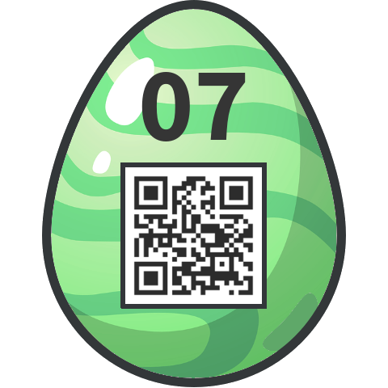

# HackyEaster 2019

The annual advent calender from Hacking-lab


## Overview

Title                                                        | Difficulty | Egg
-------------------------------------------------            | ---------- | ------------------------------
[Teaser     ](#teaser)                                       |            | `he19-th1s-isju-5tAt-Eazr`
[01 - Twisted](#01-twisted)                                  |            | `he19-Eihb-UUVw-nObm-lxaW`
[02 - Just Watch](#02-just-watch)                            |            | `he19-DwWd-aUU2-yVhE-SbaG`
[03 - Sloppy Encryption](#03-sloppy-encryption)              |            | `he19-`
[04 - Disco 2](#04-disco-2)                                  |            | `he19-`
[05 - Call for Papers](#05-call-for-papers)                  |            | `he19-`
[06 - Dots](#06-rots)                                        |            | `he19-`
[07 - Shell we Argument](#07-shell-we-argument)              |            | `he19-Bxvs-Vno1-9l9D-49gX`
[08 - Modern Art](#08-modern-art)                            |            | `he19-`
[09 - rorriM rorriM](#09-rorrim-rorrim)                      |            | `he19-`
[10 - Stackunderflow](#10-stackunderflow)                    |            | `he19-`
[11 - Memeory 2.0](#11-memeory-2-0)                          |            | `he19-`
[12 - Decrypt0r](#12-decrypt0r)                              |            | `he19-`
[13 - Symphony in HEX](#13-symphony-in-hex)                  |            | `he19-`
[14 - White Box](#14-white-box)                              |            | `he19-`
[15 - Seen in Steem](#15-seen-in-steem)                      |            | `he19-`
[16 - Every-Thing](#16-every-thing)                          |            | `he19-`
[17 - New Egg Design](#17-new-egg-design)                    |            | `he19-`
[18 - Egg Storage](#18-egg-storage)                          |            | `he19-`
[19 - CoUmpact DiAsc](#19-coumpact-diasc)                    |            | `he19-`
[20 - Scrambled Egg](#20-scrambled-egg)                      |            | `he19-`
[21 - The Hunt: Misty Jungle](#21-the-hunt-misty-jungle)     |            | `he19-`
[22 - The Hunt: Muddy Quagmire](#22-the-hunt-muddy-quagmire) |            | `he19-`
[23 - The Maze](#23-the-maze)                                |            | `he19-`
[24 - CAPTEG](#24-capteg)                                    |            | `he19-`
[25 - Hidden Egg 1](#25-hidden-egg-1)                        |            | `he19-`
[26 - Hidden Egg 2](#26-hidden-egg-2)                        |            | `he19-`
[27 - Hidden Egg 3](#27-hidden-egg-3)                        |            | `he19-`


## Teaser

**Challenge**

In order to sweeten the waiting time, we are providing a teaser challenge in advance.
Download the [video file](writeupfiles/he2019_teaser.mp4), and find the teaser Easter egg.

**Solution**

The video seems to flash different colours. We use ffmpeg to find the number of frames:

```bash
$ ffprobe -v warning -show_frames he2019_teaser.mp4 | grep -c '\[/FRAME\]'
230400
```

so we find that it has 230400 frames, which all appear to be a single colour (mostly black and white, some purple).
230400 is exactly 480x480, so maybe each frame is a pixel and we need to convert this to an image, hopefully a QR code
let's try it:

```python3

import moviepy.editor as mpe
from PIL import Image

# load video
video = mpe.VideoFileClip('he2019_teaser.mp4')


outimg = Image.new( 'RGB', (480,480), "white")
pixels_out = outimg.load()

framenum = 0
for frame in video.iter_frames():

    # set pixel to colour of video frame
    pixels_out[framenum%480,framenum/480] = (frame[0][0][0],frame[0][0][1],frame[0][0][2])
    framenum += 1

# save image
outimg.save("teaser_out.png","png")

```

which gives us the following image:


**Egg**

```
he19-th1s-isju-5tAt-Eazr
```

## 01 Twisted

**Challenge**

As usual, the first one is very easy - just a little twisted, maybe.


**Solution**

We tried and failed to untwist it with gimp (filters → distort → IWarp). So we
recreated it in [QRazy Box](https://merricx.github.io/qrazybox/), at least
enough of it that it would decode.


## 02 Twisted

**Challenge**
Just watch and read the password.


Then enter it in the egg-o-matic below. Lowercase only, and no spaces!

**Solution**

It's in ASL finger spelling! They seem to have even used the hands from the following alphabet chart:


I spells out `givemeasign`, which we enter into the egg-o-matic to get our egg.

**Egg**


`he19-DwWd-aUU2-yVhE-SbaG`

## 03 - Sloppy Encryption

**Challenge**

The easterbunny is not advanced at doing math and also really sloppy.

He lost the encryption script while hiding your challenge. Can you decrypt it?

```
K7sAYzGlYx0kZyXIIPrXxK22DkU4Q+rTGfUk9i9vA60C/ZcQOSWNfJLTu4RpIBy/27yK5CBW+UrBhm0=
```

[sloppy.rb](writeupfiles/sloppy.rb)

**Solution**

**Egg**

## 04 - Disco 2

**Challenge**

This year, we dance outside, yeaahh! See here.

https://hackyeaster.hacking-lab.com/hackyeaster/challenges/disco2/disco2.html

**Solution**

**Egg**

## 05 - Call for Papers

**Challenge**

Please read and review my CFP document, for the upcoming IAPLI Symposium.

I didn't write it myself, but used some artificial intelligence.

What do you think about it?

[IAPLI_Conference.docx](writeupfiles/IAPLI_Conference.docx)

**Solution**

**Egg**

## 06 - Dots

**Challenge**

Uncover the dots' secret!

Then enter the password in the egg-o-matic below. Uppercase only, and no spaces!


**Solution**

**Egg**

## 07 - Shell we argument

**Challenge**

Let's see if you have the right arguments to get the egg.

```sh
z="
";ACz='he';CCz='ec';iHz='Gr';vEz='na';LBz='ye';OFz='aw';kDz=' u';lEz='r"';GBz='Pz';sDz='at';kEz='et';HCz=' m';wEz='be';az='in';pCz=' w';UGz='w=';qFz='-9';WFz='Ah';yz='ag';ABz='Lz';pGz=' 4';wz='/e';YHz='$a';JBz='8c';jFz='{';KDz=' i';lFz='{1';Kz='8a';Wz='tp';EFz='pe';bDz='" ';FIz='py';sGz=' 3';IDz='tw';PHz='$J';HDz=' B';oz='f3';uGz=' 9';lz='Tz';bz='Wz';IFz='y!';RCz='di';NEz='y ';SFz='lt';qDz='t.';XCz=' y';cHz='$i';JDz=': ';xGz='00';IHz='t=';GDz='s.';ICz='e ';iBz='oz';sz='ht';hGz=' +';gFz='sN';ODz=' /';PDz='-[';MDz='fo';uFz='$ ';mz='es';vFz=']]';cGz='[ ';WBz='nz';ZDz='d"';WHz='$W';FHz='$m';uz='ck';lDz='nd';HEz='ot';rHz='2';KHz='$B';rBz=' [';dDz='-R';Rz='hz';jGz='))';wBz='1 ';fBz='12';NHz='$F';PEz='yp';JCz='so';LGz='ce';jCz='on';CFz='gh';fFz='ti';nCz='cu';vz='Uz';jEz='do';dBz='ac';vHz='ro';JFz='$9';wHz='ws';TFz='qu';VCz='wi';jz='Iz';OEz='bo';yDz='t,';yGz='7';LHz='z$';fEz=' k';pHz='sl';ADz='er';mHz='om';nFz='=~';WGz='tc';oHz='o!';sHz=' x';NCz='um';cBz='cz';Iz='.p';EDz='gu';lBz='42';SCz='sc';BDz=' o';SGz='e?';qHz='p ';qGz='65';VHz='$U';oBz='dz';IEz='ai';ECz=' "';eCz='-n';Vz='Bz';tCz='wh';fDz='y,';uDz=' e';rz='Az';VFz='ub';YFz='h,';HBz='m/';LFz='No';vCz='iv';fz='Yz';bCz=' -';LIz='w,';OGz='0 ';GFz='ea';dGz='2 ';iz='r.';kFz='[[';tFz='3}';ZFz=' f';HHz=' 5';LDz='n ';MFz='n'\''';BIz='Fi';QHz='$L';kBz='mz';mDz='st';Pz='Xz';hFz='r(';JGz='se';oFz=' ^';CEz='$3';iDz=' I';CHz='de';MCz='rg';MBz='Dz';dHz='$k';NGz='ee';hz='Jz';pBz='b7';KGz='Ni';mEz='$7';JEz='n.';QEz='of';uCz=' g';AIz='$t';WDz='re';XGz='h=';tDz='r ';NBz='//';KFz='-t';xEz=', ';DHz='v/';gBz='bz';BGz='Nr';XBz='c7';cFz='t'\''';IGz='el';FBz='gg';NDz='rm';LEz='al';tEz='. ';Dz='Cz';ZBz='r/';XFz='hh';YBz='Qz';uBz='-l';REz='t"';oDz='d ';HIz='l ';sBz=' $';PGz='99';gGz='ow';HGz='."';yHz='w-';Yz='62';AGz='& ';hDz='ut';yCz='mb';pz='kz';FDz='nt';iEz='ca';DDz='ar';hBz='75';vBz='t ';Jz='fz';IBz='pz';rGz='$4';CDz='f ';bGz=' {';hEz='w ';Tz='Rz';rDz=' r';ZGz='=0';SEz='$5';QDz='a-';MEz=' v';eEz='?.';vGz='11';tHz='-w';ZHz='$c';gDz=' b';VEz='m ';TEz='-b';OIz='h:';Cz='";';NFz='ge';EEz='Oh';UHz='$S';KIz='w:';qBz='if';wCz='rr';Az='z=';qCz='h ';pDz='ur';nBz='6e';DGz='&&';Ax2='ev';RDz='zA';cDz='!=';QBz='Hz';xTT='al';DBz='ha';QFz='e!';aEz=' s';DIz=' h';RHz='$N';MHz='$D';aGz='()';jHz='rf';MIz='ed';GGz='${';oGz='ch';BCz='n';YDz='ep';vDz='ri';Fz='s:';AEz='sn';qEz='ma';xFz='$2';nEz='-I';CBz='Ez';GEz='o,';mGz='((';GCz='ve';Mz='e9';JHz='"$';nGz='(m';OBz='iz';IIz='nv';QGz='9,';dEz='ra';GHz='eq';rFz=']{';aBz='ez';kz='te';rCz='yo';xz='Sz';yFz=' &';CIz='eg';UFz='ir';hHz='z"';DFz='ty';xDz='em';DCz='ho';xHz='x-';nz='Zz';FGz='8 ';lGz='=$';CGz='4 ';Sz='7e';kGz='gt';uEz='If';AHz=' (';TGz='lo';WEz='cl';OCz='en';pFz='[0';iCz='I ';TDz='] ';ZEz='hy';FFz='s,';KBz='Gz';qz='15';nDz='an';OHz='$H';Gz=''\'';';BFz='g ';bEz='uc';QCz='o ';aFz='! ';Oz='co';UDz='..';YCz='ou';eHz='$o';RBz='as';BBz='g-';PBz='cd';tBz='# ';pEz='ay';EGz='$6';EBz='Vz';Uz='im';AFz='br';XEz='ue';SDz='-Z';gCz=' ]';kCz='ly';nHz='gl';dCz='fi';VDz='./';gz='1e';BHz='&>';Ez='='\''';gHz='$r';ZCz='ex';yEz='ul';lHz='ok';DEz='-a';Zz='Kz';WCz='th';HFz='ll';RFz=''\''s';UCz='s ';FCz='Gi';KEz='3 ';dz='rz';SBz='Mz';aDz='$1';bBz='d8';wFz='}';bFz='Le';cz='s/';fHz='$p';fCz='10';aCz='it';KCz='me';eBz='gz';GIz='il';sCz='u ';eDz='So';RGz=' p';yBz=' t';fGz='(l';Xz='lz';TBz='la';mFz='} ';VBz='b.';YGz='hi';EIz='ap';XDz='cc';LCz=' a';oCz='ss';oEz='lw';mBz='jz';wDz='c ';jBz='4a';eFz='nc';rEz='ke';Qz='a6';Nz='Oz';PCz='ts';xCz='nu';Bz='"';dFz='fu';xBz='];';jDz=''\''t';wGz='$8';uHz='ww';bHz='$g';eGz='$(';iFz=') ';YEz='le';Hz='qz';gEz='no';ez='ng';kHz='to';JIz='bl';FEz=' n';tz='Fz';BEz='t?';VGz='0';UBz='Nz';NIz='ig';TCz='us';lCz=' d';PFz='9 ';EHz=' ;';cCz='1';SHz='$P';THz='$Q';hCz='; ';sFz='1,';Lz='az';tGz='33';aHz='$e';cEz='a ';MGz='bu';sEz='ad';iGz=' 1';UEz='I'\''';XHz='$Y';mCz='is';
$Ax2$xTT "$Az$Bz$z$Cz$Dz$Ez$Fz$Gz$Hz$Ez$Iz$Gz$Jz$Ez$Kz$Gz$Lz$Ez$Mz$Gz$Nz$Ez$Oz$Gz$Pz$Ez$Qz$Gz$Rz$Ez$Sz$Gz$Tz$Ez$Uz$Gz$Vz$Ez$Wz$Gz$Xz$Ez$Yz$Gz$Zz$Ez$az$Gz$bz$Ez$cz$Gz$dz$Ez$ez$Gz$fz$Ez$gz$Gz$hz$Ez$iz$Gz$jz$Ez$kz$Gz$lz$Ez$mz$Gz$nz$Ez$oz$Gz$pz$Ez$qz$Gz$rz$Ez$sz$Gz$tz$Ez$uz$Gz$vz$Ez$wz$Gz$xz$Ez$yz$Gz$ABz$Ez$BBz$Gz$CBz$Ez$DBz$Gz$EBz$Ez$FBz$Gz$GBz$Ez$HBz$Gz$IBz$Ez$JBz$Gz$KBz$Ez$LBz$Gz$MBz$Ez$NBz$Gz$OBz$Ez$PBz$Gz$QBz$Ez$RBz$Gz$SBz$Ez$TBz$Gz$UBz$Ez$VBz$Gz$WBz$Ez$XBz$Gz$YBz$Ez$ZBz$Gz$aBz$Ez$bBz$Gz$cBz$Ez$dBz$Gz$eBz$Ez$fBz$Gz$gBz$Ez$hBz$Gz$iBz$Ez$jBz$Gz$kBz$Ez$lBz$Gz$mBz$Ez$nBz$Gz$oBz$Ez$pBz$Gz$z$qBz$rBz$sBz$tBz$uBz$vBz$wBz$xBz$yBz$ACz$BCz$z$CCz$DCz$ECz$FCz$GCz$HCz$ICz$JCz$KCz$LCz$MCz$NCz$OCz$PCz$yBz$QCz$RCz$SCz$TCz$UCz$VCz$WCz$XCz$YCz$Bz$z$ZCz$aCz$bCz$cCz$z$dCz$z$qBz$rBz$sBz$tBz$eCz$ICz$fCz$gCz$hCz$WCz$OCz$z$CCz$DCz$ECz$iCz$jCz$kCz$lCz$mCz$nCz$oCz$pCz$aCz$qCz$rCz$sCz$tCz$OCz$XCz$YCz$uCz$vCz$ICz$WCz$ICz$Oz$wCz$CCz$vBz$xCz$yCz$ADz$BDz$CDz$DDz$EDz$KCz$FDz$GDz$HDz$IDz$JDz$jCz$kCz$LCz$MCz$NCz$OCz$PCz$KDz$LDz$WCz$ICz$MDz$NDz$ODz$PDz$QDz$RDz$SDz$TDz$UDz$VDz$LCz$WDz$LCz$XDz$YDz$kz$ZDz$z$ZCz$aCz$bCz$cCz$z$dCz$z$qBz$rBz$ECz$aDz$bDz$cDz$ECz$dDz$bDz$xBz$yBz$ACz$BCz$z$CCz$DCz$ECz$eDz$wCz$fDz$gDz$hDz$iDz$lCz$jCz$jDz$kDz$lDz$ADz$mDz$nDz$oDz$rCz$pDz$LCz$MCz$NCz$OCz$qDz$sBz$wBz$mCz$rDz$sDz$ACz$tDz$nDz$uDz$JCz$kz$vDz$wDz$mDz$sDz$xDz$OCz$yDz$KDz$AEz$jDz$KDz$BEz$Bz$z$ZCz$aCz$bCz$cCz$z$dCz$z$qBz$rBz$ECz$CEz$bDz$cDz$ECz$DEz$bDz$xBz$yBz$ACz$BCz$z$CCz$DCz$ECz$EEz$FEz$GEz$FEz$HEz$yBz$DBz$vBz$yz$IEz$JEz$sBz$KEz$WDz$LEz$kCz$LCz$MEz$ADz$NEz$OEz$vDz$ez$yBz$PEz$ICz$QEz$LCz$MCz$NCz$OCz$REz$z$ZCz$aCz$bCz$cCz$z$dCz$z$qBz$rBz$ECz$SEz$bDz$cDz$ECz$TEz$bDz$xBz$yBz$ACz$BCz$z$CCz$DCz$ECz$UEz$VEz$WEz$XEz$YEz$oCz$pCz$ZEz$XCz$YCz$gDz$vDz$ez$aEz$bEz$qCz$cEz$mDz$dEz$ez$ICz$DDz$EDz$KCz$FDz$LCz$UCz$SEz$eEz$iDz$fEz$gEz$hEz$rCz$sCz$iEz$LDz$jEz$gDz$kEz$kz$lEz$z$ZCz$aCz$bCz$cCz$z$dCz$z$qBz$rBz$ECz$mEz$bDz$cDz$ECz$nEz$bDz$xBz$yBz$ACz$BCz$z$CCz$DCz$ECz$mEz$LCz$oEz$pEz$UCz$qEz$rEz$UCz$KCz$HCz$sEz$tEz$uEz$XCz$YCz$pCz$nDz$vEz$lCz$mCz$nCz$oCz$pCz$aCz$qCz$wEz$xEz$WCz$OCz$XCz$YCz$aEz$DCz$yEz$oDz$AFz$az$BFz$WCz$ICz$vDz$CFz$vBz$DFz$EFz$BDz$CDz$DDz$EDz$KCz$FDz$FFz$rDz$GFz$HFz$IFz$Bz$z$ZCz$aCz$bCz$cCz$z$dCz$z$qBz$rBz$ECz$JFz$bDz$cDz$ECz$KFz$bDz$xBz$yBz$ACz$BCz$z$CCz$DCz$ECz$LFz$xEz$gEz$xEz$rCz$sCz$jEz$MFz$vBz$NFz$vBz$OFz$pEz$pCz$aCz$qCz$WCz$mCz$sBz$PFz$jCz$QFz$iDz$fEz$gEz$hEz$aCz$RFz$lCz$qBz$dCz$nCz$SFz$yBz$QCz$KCz$kEz$HCz$NEz$WDz$TFz$UFz$xDz$OCz$PCz$tEz$iCz$jEz$VFz$vBz$rCz$sCz$VCz$HFz$Bz$z$ZCz$aCz$bCz$cCz$z$dCz$z$CCz$DCz$ECz$WFz$XFz$YFz$ZFz$az$LEz$kCz$aFz$bFz$cFz$UCz$RCz$SCz$TCz$UCz$rCz$pDz$LCz$MCz$NCz$OCz$PCz$Bz$z$dFz$eFz$fFz$jCz$KDz$gFz$hFz$iFz$jFz$z$kFz$sBz$lFz$mFz$nFz$oFz$pFz$qFz$rFz$sFz$tFz$uFz$vFz$z$wFz$z$qBz$KDz$gFz$tDz$xFz$yFz$AGz$mCz$BGz$sBz$CGz$DGz$KDz$gFz$tDz$EGz$yFz$AGz$mCz$BGz$sBz$FGz$DGz$KDz$gFz$tDz$GGz$fCz$mFz$hCz$WCz$OCz$z$CCz$DCz$ECz$UDz$HGz$z$IGz$JGz$z$CCz$DCz$ECz$KGz$LGz$LCz$MCz$NCz$OCz$PCz$xEz$MGz$vBz$Oz$yEz$oDz$rCz$sCz$MDz$NDz$yEz$sDz$ICz$WCz$xDz$LCz$UCz$xCz$yCz$ADz$UCz$wEz$IDz$NGz$LDz$OGz$nDz$oDz$PGz$QGz$RGz$YEz$RBz$SGz$Bz$z$ZCz$aCz$bCz$cCz$z$dCz$z$TGz$UGz$VGz$z$qEz$WGz$XGz$VGz$z$YGz$CFz$ZGz$z$dFz$eFz$fFz$jCz$uDz$aGz$bGz$z$qBz$rBz$cGz$aDz$bCz$SFz$sBz$dGz$vFz$hCz$WCz$OCz$z$TGz$UGz$eGz$fGz$gGz$hGz$iGz$jGz$z$IGz$qBz$rBz$cGz$aDz$bCz$kGz$sBz$dGz$vFz$hCz$WCz$OCz$z$YGz$CFz$lGz$mGz$YGz$CFz$hGz$iGz$jGz$z$IGz$JGz$z$qEz$WGz$XGz$eGz$nGz$sDz$oGz$hGz$iGz$jGz$z$dCz$z$wFz$z$ICz$xFz$pGz$qGz$z$ICz$rGz$sGz$tGz$z$ICz$EGz$uGz$vGz$z$ICz$wGz$iGz$fBz$z$ICz$GGz$fCz$mFz$xGz$yGz$z$dFz$eFz$fFz$jCz$gDz$AHz$iFz$jFz$z$DFz$EFz$ECz$aDz$bDz$BHz$ODz$CHz$DHz$xCz$HFz$EHz$z$wFz$z$qBz$rBz$cGz$FHz$sDz$oGz$bCz$GHz$HHz$gCz$xBz$yBz$ACz$BCz$z$IHz$JHz$rz$KHz$LHz$Dz$MHz$LHz$CBz$NHz$LHz$KBz$OHz$LHz$jz$PHz$LHz$CBz$NHz$LHz$Zz$QHz$LHz$SBz$RHz$LHz$Nz$SHz$LHz$CBz$NHz$LHz$KBz$OHz$LHz$jz$THz$LHz$Tz$UHz$LHz$lz$VHz$LHz$EBz$WHz$LHz$Pz$XHz$LHz$nz$YHz$LHz$gBz$ZHz$LHz$oBz$aHz$LHz$Jz$bHz$LHz$Rz$cHz$LHz$mBz$dHz$LHz$Xz$FHz$LHz$WBz$eHz$LHz$nz$fHz$LHz$Hz$gHz$hHz$z$CCz$DCz$ECz$iHz$GFz$yDz$yBz$DBz$vBz$DDz$ICz$WCz$ICz$EFz$jHz$CCz$vBz$DDz$EDz$KCz$FDz$GDz$iDz$vBz$kHz$lHz$aEz$mHz$ICz$fFz$KCz$xEz$MGz$vBz$UEz$VEz$nHz$sEz$xEz$rCz$sCz$JGz$ICz$aCz$FEz$gGz$xEz$kHz$oHz$Bz$z$pHz$NGz$qHz$rHz$z$qBz$gDz$sHz$tHz$uHz$TEz$vHz$wHz$ADz$EHz$yBz$ACz$BCz$z$xHz$uHz$yHz$AFz$gGz$JGz$tDz$AIz$z$IGz$JGz$z$CCz$DCz$ECz$BIz$lDz$XCz$YCz$tDz$CIz$BFz$sDz$sBz$REz$z$dCz$z$IGz$JGz$z$CCz$DCz$ECz$UEz$VEz$gEz$vBz$WDz$LEz$kCz$DIz$EIz$FIz$pCz$aCz$qCz$rCz$pDz$LCz$MCz$NCz$OCz$PCz$tEz$UEz$VEz$mDz$GIz$HIz$gEz$vBz$Oz$IIz$az$LGz$oDz$WCz$sDz$yBz$DCz$JGz$LCz$WDz$rDz$GFz$JCz$vEz$JIz$ICz$mDz$sDz$xDz$OCz$PCz$UDz$HGz$z$CCz$DCz$ECz$TGz$KIz$sBz$TGz$LIz$HCz$sDz$oGz$MIz$sBz$qEz$WGz$YFz$DIz$NIz$OIz$sBz$YGz$CFz$Bz$z$dCz"
```

**Solution**

It's a [bash script in two parts](./writeupfiles/eggi.sh). First half is a series of variables, followed by a series of variable expansions. Extracting the first half into a file and sedding it into a file full of sed's:

```console
sed -i 's/$ACz/he/g' eggi.sh
sed -i 's/$CCz/ec/g' eggi.sh
sed -i 's/$iHz/Gr/g' eggi.sh
sed -i 's/$vEz/na/g' eggi.sh
sed -i 's/$LBz/ye/g' eggi.sh
sed -i 's/$OFz/aw/g' eggi.sh
sed -i 's/$kDz/ u/g' eggi.sh
sed -i 's/$lEz/r"/g' eggi.sh
sed -i 's/$GBz/Pz/g' eggi.sh
sed -i 's/$sDz/at/g' eggi.sh
```

and then running that on the eggi.sh script, we can find a [mostly readable shell script](./writeupfiles/eggi2.sh). Some of the replacements didn't work perfectly and it wasn't worth figuring out exactly.

Based on some of the lines:

```
if [ "$1" != "-R" ]; then
echo "Sorry, but I don$jDz understand your argument. $1 is rather an esoteric statement, isn$jDz it?"

Czit -1
fi
if [ "$3" != "-a" ]; then
echo "Oh no, not that again. $3 really a very boring type of argument"

Czit -1
fi
if [ "$5" != "-b" ]; then
echo "$UEzm clueless w
Ez you bring such a strange argument as $5?. I know you can do better"

Czit -1
fi
if [ "$7" != "-I" ]; then
echo "$7 always makes me mad. If you wanna discuss with be, then you should bring the right type of arguments, really!"
```

We know the odd numbered arguments should be the flags above, and based on

```bash
function e() {
	if [[ $1 -lt $2 ]]; then
		low=$((low + 1))
	elif [[ $1 -gt $2 ]]; then
		high=$((high + 1))
	else
		match=$((match + 1))
	fi
}
e $2 465
e $4 333
e $6 911
e $8 112
e ${10} 007
```

We can construct the final CLI:

```
$ bash eggi.sh -R 465 -a 333 -b 911 -I 112 -t 007
Ahhhh, finally! Let's discuss your arguments
...
Great, that are the perfect arguments. It took some time, but I'm glad, you see it now, too!
```

This opens a URL in our browser session with the egg.

**Egg**



## 08 - Modern Art

**Challenge**
Do you like modern art?


**Solution**

The corners all read "remove me". Replacing them the correctly results in a QR code that reads "isn't that a bit too easy?"


**Egg**


## 09 - rorriM rorriM

**Challenge**

Mirror, mirror, on the wall, who's the fairest of them all?

[evihcra.piz](writeupfiles/evihcra.piz)

**Solution**

**Egg**


## 10 - Stackunderflow

**Challenge**

Check out this new Q&A site. They must be hiding something but we don't know where to search.

http://whale.hacking-lab.com:3371/


**Solution**

**Egg**


## 11 -  Memeory 2.0

**Challenge**

We improved Memeory 1.0 and added an insane serverside component. So, no more CSS-tricks. Muahahaha.

Flagbounty for everyone who can solve 10 successive rounds. Time per round is 30 seconds and only 3 missclicks are allowed.

Good game.


http://whale.hacking-lab.com:1111/


**Solution**

**Egg**


## 12 - Decrypt0r

**Challenge**

Crack the might Decryt0r and make it write a text with a flag.

No Easter egg here. Enter the flag directly on the flag page.

[decryptor.zip](writeupfiles/decryptor.zip)


**Solution**

**Egg**


## 13 - Symphony in HEX

A lost symphony of the genius has reappeared.


Hint: count quavers, read semibreves

Once you found the solution, enter it in the egg-o-matic below. Uppercase only, and no spaces!


**Solution**

**Egg**


## 14 - White Box

**Challenge**

Do you know the mighty WhiteBox encryption tool? Decrypt the following cipher text!

```
9771a6a9aea773a93edc1b9e82b745030b770f8f992d0e45d7404f1d6533f9df348dbccd71034aff88afd188007df4a5c844969584b5ffd6ed2eb92aa419914e
```

[WhiteBox](writeupfiles/WhiteBox)


**Solution**

**Egg**


## 15 - Seen in Steem

**Challenge**

An unknown person placed a secret note about Hacky Easter 2019 in the Steem blockchain. It happend during Easter 2018.

Go find the note, and enter it in the egg-o-matic below. Lowercase only, and no spaces!


**Solution**

**Egg**


## 16 - Every-Thing

**Challenge**

After the brilliant idea from [here](http://geek-and-poke.com/geekandpoke/2013/7/22/future-proof-your-data-model).

The data model is stable and you can really store Every-Thing.

[EveryThing.zip](writeupfiles/EveryThing.zip)


**Solution**

**Egg**


## 17  - New Egg Design

Thumper is looking for a new design for his eggs. He tried several filters with his graphics program, but unfortunately the QR codes got unreadable. Can you help him?!


**Challenge**

**Solution**

**Egg**

## 18 Twisted

**Challenge**

**Solution**

**Egg**

## 19 Twisted

**Challenge**

**Solution**

**Egg**

## 20 Twisted

**Challenge**

**Solution**

**Egg**

## 21 Twisted

**Challenge**

**Solution**

**Egg**

## 22 Twisted

**Challenge**

**Solution**

**Egg**

## 23 Twisted

**Challenge**

**Solution**

**Egg**

## 24 Twisted

**Challenge**

**Solution**

**Egg**

## 25 Twisted

**Challenge**

**Solution**

**Egg**

## 26 Twisted

**Challenge**

**Solution**

**Egg**

## 27 Twisted

**Challenge**

**Solution**

**Egg**


