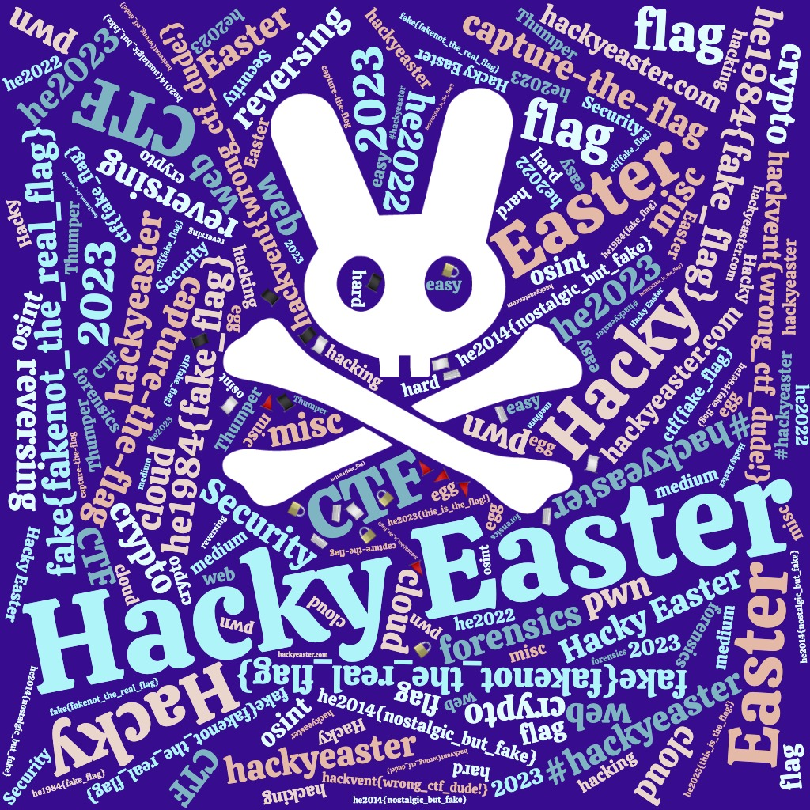
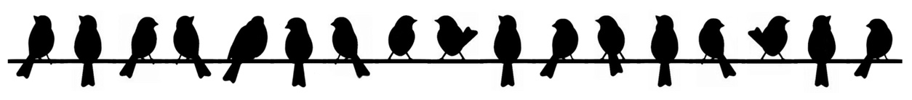

# HackyEaster 2022

The annual Easter CTF from Hacking-lab


## Overview

Title                                            | Points     | Egg
-------------------------------------------------| ---------- | ------------------------------
Level 1: Welcome                                 |            |
[Sanity Check](#sanity-check)                    | Level 1    | `he2023{just_A_sanity_chEck}`
Level 2: Noob Zone                               |            |
[Word Cloud](#word-cloud)                        | Level 2    | `he2023{this_is_the_flag!}`
[Rotation](#roation)                             | Level 2    | `he2023{0n3_c4n_r34d_r0t0r_b4ckw4rds}`
[Birds on a Wire](#birds-on-a-wire)              | Level 2    | `he2023{birdwatchingisfun}`
[Bins](#bins)                                    | Level 2    | `he2023{}`
Level 3: It's so Easy                            |            |
[Chemical Code](#chemical-code)                  | Level 3    | `he2023{flagenergyatomcosmos}
`
[Serving Things](#serving-things)                | Level 3    | `he2023{}`
[Cut Off](#cut-off)                              | Level 3    | `he2023{}`
[Global Egg Delivery](#global-egg-delivery)      | Level 3    | `he2023{}`
Level 4                                          |            |

## Level 1: Welcome

### Sanity Check

**Challenge**

This is your first flag!

Right here --> `he2023{             }`

🚩 Flags are in format `he2023{...}`, unless noted otherwise. Always check additional information given (uppercase, lowercase, spaces, etc.).

**Solution**

inspecting the empty looking space in the challenge text, we see

```html
<span style="color: black; background-color: black; opacity: 0;">just_A_sanity_chEck</span>
```

**Egg**

```
he2023{just_A_sanity_chEck}
```

## Level 2: Noob Zone


### Word Cloud

**Challenge**

I like Word Clouds, what about you?

Download the image below (he2023-wordcloud.jpg), sharpen your eyes, and find the right flag.




**Solution**

The wordcloud contains a lot of false flags, but also the correct one, so just read all the words until you find it!


**Egg**

```
he2023{this_is_the_flag!}
```

### Rotation

**Challenge**

My new rotor messed up the flag!

```
96a_abL_?b04c?0Cbc50C_E_C03c4<HcC5DN
```

I tried to decode it, but it didn't work. The rotor must have been too fast!

**Solution**

We suspect a rotation cipher because of the cipher, and assuming the given string starts with `he2023`, this indeed checks out (`h` and `e` are 3 apart in the ASCII table, so are `9` and `6`). It would appear to be a rotation of 47, though sometimes it is +47, sometimes -47, so we write a short script to find the direction of rotation

```python
import string

ct="96a_abL_?b04c?0Cbc50C_E_C03c4<HcC5DN"
flag = ""

for i in range(0,len(ct)):
  pt = chr ( ord(ct[i])+47 )
  if pt not in string.printable:
     pt = chr ( ord(ct[i])-47 )

  flag += pt

print(flag)
```

which gives us the flag!

**Egg**

```
he2023{0n3_c4n_r34d_r0t0r_b4ckw4rds}
```

### Birds on a Wire

**Challenge**

Just some birds sitting on a wire.

Download the image and find the flag!



**Solution**

Some Googling reveals that this is the ["Birds on a Wire" cipher](https://www.dcode.fr/birds-on-a-wire-cipher)

It's a simple substitution cipher so we just map the birds to their corresponding letters to find the flag!

**Egg**

```
he2023{birdwatchingisfun}
```

### Bins

**Challenge**

The rabbits left a mess in their cage.

```
  //    //                    //
 ('>   ('>    LX2gkn81        ('>
 /rr   /rr       carrots      /rr
*\))_ *\))_                  *\))_
```

If only I knew which bin to put the rubbish in.


**Solution**

**Egg**

```
he2023{}
```


## Level 3: It's so Easy

### Title

**Challenge**

Our crazy chemistry professor wrote a secret code on the blackboard:

```
9 57 32 10 111 39 85 8 115 8 16 42 16
```

He also mumbled something like "essential and elementary knowledge".


**Solution**

This sounds like we have to convert atomic numbers to their corresponding sybols to get the flag

We find a python package to help us and use it to decode the flag

```python3
from PyAstronomy import pyasl

an = pyasl.AtomicNo()
ct =[9,57,32,10,111,39,85,8,115,8,16,42,16]

flag = "".join(an.getElSymbol(ct[i]) for i in range(0,len(ct)))

print(flag)  # outputs FLaGeNeRgYAtOMcOSMoS

```

**Egg**

```
he2023{flagenergyatomcosmos}
```

### Title

**Challenge**

**Solution**

**Egg**

```
he2023{}
```


### Title

**Challenge**

**Solution**

**Egg**

```
he2023{}
```


### Title

**Challenge**

**Solution**

**Egg**

```
he2023{}
```


## Level 4

### Title

**Challenge**

**Solution**

**Egg**

```
he2023{}
```
