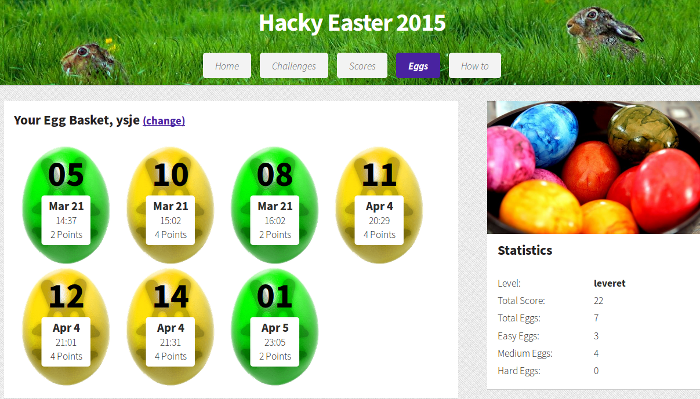
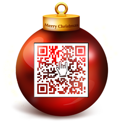

# CTF writeups 


I like to participate in "Capture The Flag" events; computer security/hacking competitions which generally consist of participants breaking, investigating, reverse engineering and doing anything they can to reach the end goal, a "flag" which is usually found as a string of text. 

For upcoming events see [CTFtime](https://ctftime.org/).

I am always looking for team mates, so if you are interesting in teaming up please let me know :D
  
Some permanent CTF challenges I'd recommend are:  
- [OverTheWire](http://overthewire.org/wargames/)  
- [SmashTheStack](http://smashthestack.org/)  
- [DareYourMind](http://www.dareyourmind.net/) (the one that got me hooked on CTFs way back when :) )  
- [WeChall](http://www.wechall.net/) (aggregates scores from various permanent CTF challenge sites)   
- Comprehensive [list](http://www.wechall.net/active_sites/all/by/site_id/ASC/page-1) of CTF sites from WeChall website  

and another list of permanent CTFs is here: [http://captf.com/practice-ctf/](http://captf.com/practice-ctf/)


### Contents of this repository:

#### HackVent 2015

Advent-calendar CTF by [Hacking-Lab](https://www.hacking-lab.com)

**Teaser Challenge**

All you need for this challenge is this image [(link)](resources/santas_leak_new.png):


This is a multi-stage challenge, final flag is of format:

```
HV15-XXXX-XXXX-XXXX-XXXX-XXXX
```

To check your answer and claim your points, signup and submit [here](https://www.hacking-lab.com/cases/8891-santas-leak/8891-santas-leak-wargame.html?event=979&case=1283) 


(will post writeups after Christmas)


#### EasyCTF 2015

A week-long entry level CTF in November 2015.

Website: [https://www.easyctf.com/](https://www.easyctf.com/)

Had an huge number of challenges, quite easy, but still fun, had a nice programming interface as well as online shell for the server exploit challenges.


#### CSAW HSF 2015

a two-week-long CTF during NYU Poly's Cyber Security Awareness Week

(writeups to follow)

#### HackyEaster 2015

A great easter egg hunt run by [Hacking-Lab](https://www.hacking-lab.com/). 

website: [http://hackyeaster.hacking-lab.com/hackyeaster/](http://hackyeaster.hacking-lab.com/hackyeaster/)





#### HackVent 2014

A great advent-calender style CTF run by [Hacking-Lab](https://www.hacking-lab.com/). 
Every day in December (until Christmas) a new challenge would open, each a little more difficult than the previous, 
and the goal each day was to find the flag, usually in the form a Christmas bauble with a QR code inside it.



Solving a challenge on the day of release got you max points, solving it later got you reduced points. 

This was a really fun event, had something for all skill levels and a variety of topics. Hope to see another event 
from them at easter!

Merry Christmas and a Happy 2015!


#### Advent Calendar CTF 2014

A challenge for each day of advent

[http://adctf2014.katsudon.org/](http://adctf2014.katsudon.org/)


## more to come..

