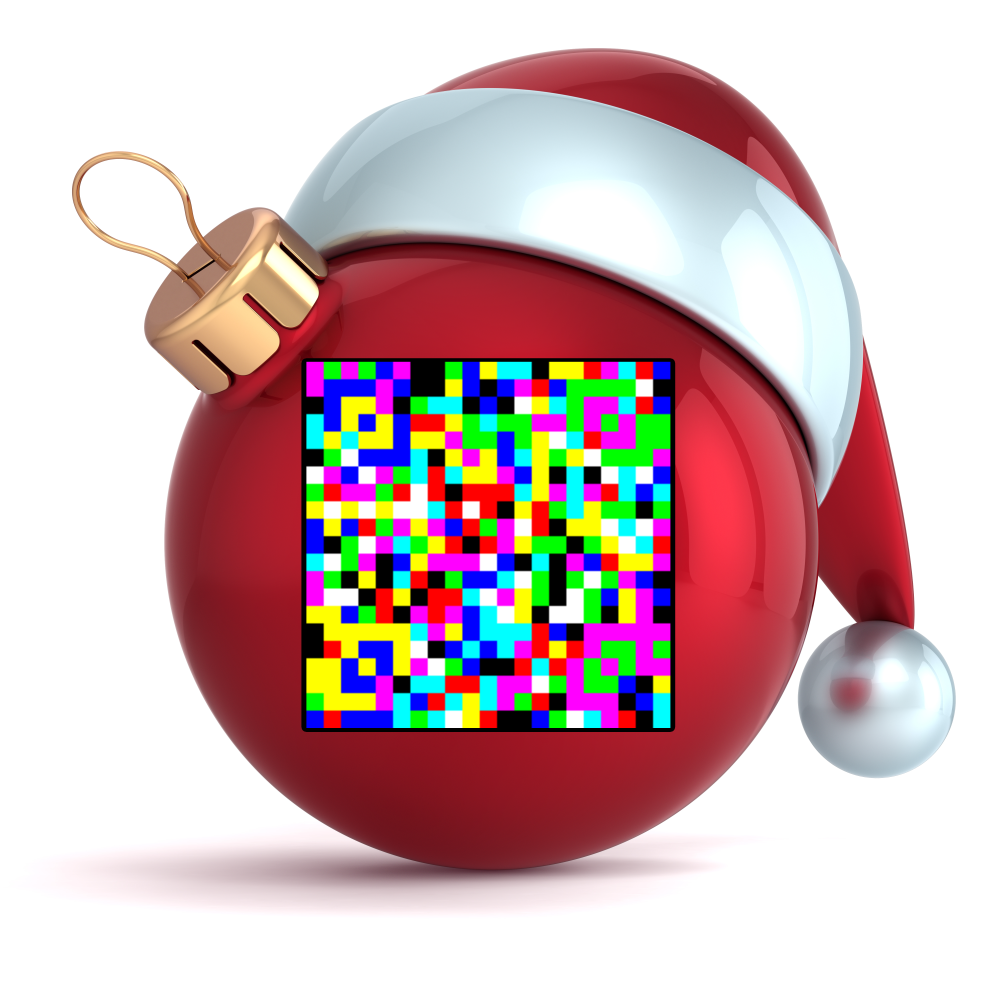

## Challenge

After a decade of monochromity, Santa has finally updated his
infrastructure with color displays.

## Solution

After some Googling, we find JAB Code (Just Another Bar Code) which is a
high-capacity 2D color bar code,
which can encode more data than traditional black/white (QR) codes.

* [GitHub repo][1]
* [Online Decoder][2]

Their online decoder gives us the flag

[1]: https://github.com/jabcode/jabcode
[2]: https://jabcode.org/scan
