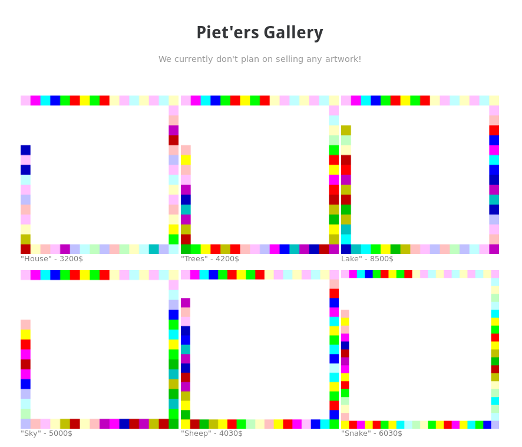
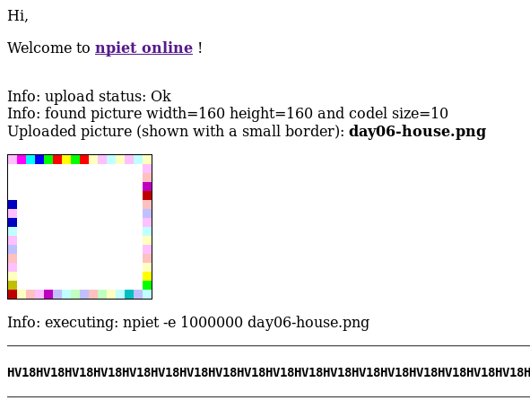

## Challenge

Piet'er just opened his gallery to present his pieces to you, they'd
make for a great present :)

[Open Gallery][1]

## Solution

The page contained 6 images of abstract art

[image1](writeupfiles/day06-house.png)
[image2](writeupfiles/day06-2-trees.png)
[image3](writeupfiles/day06-3-lake.png)
[image4](writeupfiles/day06-4-sky.png)
[image5](writeupfiles/day06-5-sheep.png)
[image6](writeupfiles/day06-6-snake.png)

We recognize this as esoteric programming language [Piet][2] and use the
[this interpreter][3] to translate the images to a flag. Each image
contanes 4 characters of the flag.

[1]: https://hackvent.hacking-lab.com/Mondrian-Gallery/
[2]: http://www.dangermouse.net/esoteric/piet.html
[3]: https://www.bertnase.de/npiet/npiet-execute.php
