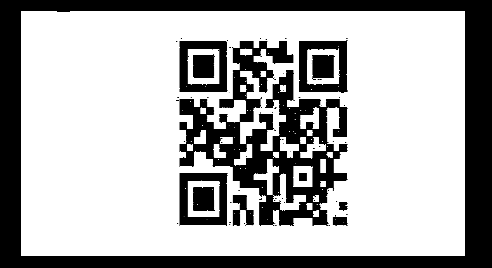
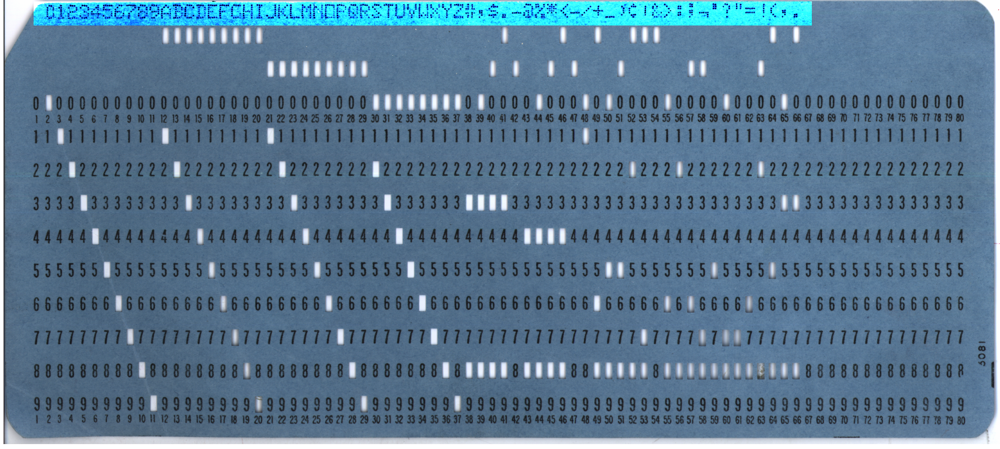

## Challenge

## Solution

*Stage 1*

The image contains braille code. We translate it to
`http://bit.ly/2TJvxHt`, which leads us the following image:

this QR decodes to `Rushed by ..`

It turns out the bit.ly link actually translated to
`https://hackvent.hacking-lab.com/T34s3r_MMXVIII/index.php?flag=UI18-GAUa-lXhq-htyV-w2Wr-0yiV`
but redirected. The `flag` parameter when ROT13'd gives us the first
flag: `HV18-TNHn-yKud-uglI-j2Je-0lvI`

When we fill in the correct flag in the url, we get to the next stage:
`https://hackvent.hacking-lab.com/T34s3r_MMXVIII/index.php?flag=HV18-TNHn-yKud-uglI-j2Je-0lvI`,
which redirects to
`https://hackvent.hacking-lab.com/T34s3r_MMXVIII/ZOoxjUSe1OVB7OPoVrsX.pdf`

[pdf file](writeupfiles/teaser/stage2.pdf)

Ok, there is lots here, lets get all the elements of the pdf with
http://extractpdf.com

*Stage 2*

We find some Morse code text in the pdf:

    HACKvent 2018
    
    .... ...- .---- ---.. -....- --. --- .-. .. -....- --.. .-. ... -... -....- ..- ..-. .- . -....- - ... -.... -.-. -....- -.-. ...- - -

this decodes to: `HV18-GORI-ZRSB-UFAE-TS6C-CVTT`, which is our second
flag

*Stage 3*

We also find some images in the pdf:

  
  

The stereogram image can be decoded [here][1] and gives:

we clean it up a bit with GIMP so that we can scan it:

and this is our 3rd flag: `HV18-p2LK-DNcI-YKw7-T9Ad-mH3v`

*Stage 4*

Next, we try binwalk on the pdf:

    $ binwalk stage2.pdf
    DECIMAL       HEXADECIMAL     DESCRIPTION
    --------------------------------------------------------------------------------
    0             0x0             PDF document, version: "1.7"
    404           0x194           Unix path: /PDF/Text/ImageB/ImageC/ImageI] >>/MediaBox[ 0 0 595.32 841.92] /Contents 4 0 R/Group<</Type/Group/S/Transparency/CS/DeviceRGB>>
    621           0x26D           Zlib compressed data, default compression
    1751          0x6D7           Unix path: /Type/XObject/Subtype/Image/Width 1000/Height 340/ColorSpace/DeviceRGB/BitsPerComponent 8/Filter/DCTDecode/Interpolate true/Leng
    1899          0x76B           JPEG image data, JFIF standard 1.01
    1929          0x789           TIFF image data, big-endian, offset of first image directory: 8
    51778         0xCA42          Unix path: /Type/ExtGState/BM/Normal/ca 1>>
    51831         0xCA77          Unix path: /Type/Font/Subtype/TrueType/Name/F1/BaseFont/BCDEEE+Calibri/Encoding/WinAnsiEncoding/FontDescriptor 8 0 R/FirstChar 32/LastChar
    51998         0xCB1E          Unix path: /Type/FontDescriptor/FontName/BCDEEE+Calibri/Flags 32/ItalicAngle 0/Ascent 750/Descent -250/CapHeight 750/AvgWidth 521/MaxWidth
    52237         0xCC0D          Unix path: /Type/ExtGState/BM/Normal/CA 1>>
    52291         0xCC43          Unix path: /Type/XObject/Subtype/Image/Width 781/Height 781/ColorSpace/DeviceRGB/BitsPerComponent 8/Interpolate false/Filter/FlateDecode/Le
    52442         0xCCDA          Zlib compressed data, default compression
    187860        0x2DDD4         Unix path: /Type/Font/Subtype/TrueType/Name/F2/BaseFont/BCDFEE+Arial-Black/Encoding/WinAnsiEncoding/FontDescriptor 12 0 R/FirstChar 32/Last
    188034        0x2DE82         Unix path: /Type/FontDescriptor/FontName/BCDFEE+Arial-Black/Flags 32/ItalicAngle 0/Ascent 1101/Descent -212/CapHeight 716/AvgWidth 552/MaxW
    188279        0x2DF77         Unix path: /Type/Font/Subtype/TrueType/Name/F3/BaseFont/TimesNewRomanPS-BoldMT/Encoding/WinAnsiEncoding/FontDescriptor 14 0 R/FirstChar 32/
    188456        0x2E028         Unix path: /Type/FontDescriptor/FontName/TimesNewRomanPS-BoldMT/Flags 32/ItalicAngle 0/Ascent 891/Descent -216/CapHeight 677/AvgWidth 427/M
    188698        0x2E11A         Unix path: /Type/XObject/Subtype/Image/Width 200/Height 200/ColorSpace/DeviceRGB/BitsPerComponent 8/Filter/DCTDecode/Interpolate true/Lengt
    188844        0x2E1AC         JPEG image data, JFIF standard 1.01
    188874        0x2E1CA         TIFF image data, big-endian, offset of first image directory: 8
    195577        0x2FBF9         Zlib compressed data, default compression
    196145        0x2FE31         Zlib compressed data, default compression
    215877        0x34B45         Zlib compressed data, default compression
    231310        0x3878E         Unix path: /Type/Metadata/Subtype/XML/Length 3075>>
    231494        0x38846         Unix path: /www.w3.org/1999/02/22-rdf-syntax-ns#">
    231734        0x38936         Unix path: /purl.org/dc/elements/1.1/">
    232171        0x38AEB         Unix path: /ns.adobe.com/xap/1.0/mm/">
    234681        0x394B9         Zlib compressed data, default compression
    236069        0x39A25         RAR archive data, first volume type: MAIN_HEAD
    236135        0x39A67         Zip archive data, encrypted at least v2.0 to extract, compressed size: 210390, uncompressed size: 210378, name: z.zip
    446647        0x6D0B7         End of Zip archive
    
    # we see there are files appended, we extract with:
    $ binwalk -e stage2.pdf
{: .language-bash}

Reveals an [encrypted zip
file](writeupfiles/teaser/_stage2.pdf.extracted/Final_easy.zip)

TODO

*Stage 5*

The zip file also contained this QR code image:

Which looks suspiciously like a challenge from HACKvent 2015, my writeup
[here][2]

Extracting these to their component channels:

  
  

These won't scan on their own, because they are missing timing and
masking areas, but a lot of the information is there. We use
[QRazyBox][3] to restore these missing pieces and are able to find our
flag:

    red:   HV18-3I5a-
    green: Rnrl-s28r-
    blue:  SRHj-Lhzx

So our complete flag is:

    HV18-3I5a-Rnrl-s28r-SRHj-Lhzx

*Stage 6*

The zip file also contained a
[Santa.txt](writeupfiles/teaser/_stage2.pdf.extracted/Santa.txt) file:

    Santa has caught up with the information age and does not trust
    clear-text commands anymore.
    He has decided that all communications
    have to be encrypted to prevent an unfriendly take-over of his team.
    Santa chooses a simple, secure, and toolless encryption scheme.
    However, his team's memory capacity is limited and so he can only use
    their names (Dasher, Dancer, Prancer, Vixen, Comet, Cupid, Donder and
    Blitzen) as keys.
    
    
    
    Where is the team headed to?
    
    STTYN YATLOEP DNEA ONBL TGNTO MHEHH EISTIARIB FHSRA LD IIONA NL HERUV LN17-PTAA-RTON-RDOE-MCTN-AHCO

TODO

*Stage 7*

The zip file also contained the following image:

This appears to be an IBM-029 punch card by the faint lettering on the
right.  
Fortunately [wikipedia][4]  
has a full translation of that format:

I'm arbitrarily going to number the colums to be -2, -1, 0 (the row of
0s), 1 .. 9 because that makes sense to me?

| Column | Values |
|----------
| 1 | 6, -1 |
| 2 | 2 |
| 3 | 9 0 |
| 4 | -1 |
| 5 | -2 8 |
| 6 | 4 |
| 7 | 7 -1 |
| 8 | 1 -2 |
| 9 | 3 -1 |
| 10 | 5 |
| 11 | 2 |
| 12 | 90 |
| 13 | 4 |
| 14 | -1 |
| 15 | 3 |
| 16 | 6 -2 |
| 17 | 1 |
| 18 | 9 |
| 19 | -1 |
| 20 | -2 8 |
| 21 | 0 5 |
| 22 | 1 |
| 23 | 8 |
| 24 | -1 |
| 25 | 0 |
| 26 | 3 -1 |
| 27 | 4 -2 |
| 28 | -1 3 8 |
| 29 | -1 |
| 30 | 0 2 |
| 31 | -2 3 |
| 32 | -2 8 |
| 33 | 0 |
| 34 | -1 |
| 35 | 0 |
| 36 | -1 3 |
| 37 | 1 |
| 38 | 0 2 |
| 39 | -1 |
| 40 | 4 |
| 41 | 0 6 |
| 42 | 3 |
| 43 | 02 |
| 44 | -1 |
| 45 | 0 |
| 46 | -1 4 |
| 47 | 3 |
| 48 | 8 2 -1 |
| 49 | -1 |
| 50 | 3 |
| 51 | 1 |
| 52 | 2 |
| 53 | 4 6 |
| 54 | -1 |
| 55 | -2 8 |
| 56 | 9 0 |
| 57 | 3 |
| 58 | 3 -2 |
| 59 | -1 |
| 60 | 5 |
| 61 | 2 4 |
| 62 | 1 |
| 63 | -1 2 |
| 64 | -1 |
| 65 | -2 3 |
| 66 | 3 |
| 67 | -2 0 2 8 |
| 68 | \_ |
| 69 | -1 |
| 70 | 0 5 |
| 71 | 0 9 |
| 72 | 3 |
| 73 | 0 6 |
| 74 | -1 |
| 75 | -2 3 |
| 76 | 0 6 |
| 77 | 0 2 |
| 78 | -2 3 |
| 79 | -1 |
| 80 | 1 |

We then use the translation matrix we found to write a [small python
script](writeupfiles/ibm-029-decode.py)  
Which will output the following when run:

    O2Z-H4PAL52¿4-3F19-HV18-0LD$-SCH0-0L1S-4W3S-0M3!-312¿-HZ3C-5¿1K-C3¿¿-VZ3W-CWSC-1¿

(¿ used when couldn't identify a character correctly, maybe
transcription mistakes by me.)  
But the flag is clearly visible in the center:
`HV18-0LD$-SCH0-0L1S-4W3S-0M3!`

*Stage 8*

The zip file also contained the file
[teaser.pls](writeupfile/teaser/_stage2.pdf.extracted/teaser.pls)

    CREATE OR REPLACE FUNCTION checkHV18teaser wrapped
    a000000
    b2
    abcd
    abcd
    abcd
    abcd
    abcd
    abcd
    abcd
    abcd
    abcd
    abcd
    abcd
    abcd
    abcd
    abcd
    abcd
    8
    37f 22f
    9bGsDUl+WXOiRvCg6f+CmODMp3UwgwIJ+txqfC9Dgz+VaPwOTWaoKj5jW2QUCQapzabE52vy
    50h+W7xBf1NE2/Fa93pBwUJtOxLvz1WIU75VaGjqH5M6oL4/aHovVUteU3Arw0eLvVRDEvbd
    0mLqbyd4kEtMnI76J3vuLaHC1mkYuwEN6bdmd3GQPBtHV4fWHr5OM5B81yX+kw0560LKdDx8
    mVHJvc7y7vShjsCpFgEUd6sfN3ZbOkjjbg+AJSGuIjZzvT7vkQwM5wcQL73C6+BCiaaEG2ja
    r+3zqCSk6QzcKvIwuBwXf9UHGL4YS47JO3EOmIPOy8VQYfY1M9g6UeieqOftVm/Pr8smR11r
    UWM8kk1WTmMvY13s1Klpr7tFnzwjmnSnTP9Exz/dV5+cU3mlgyjqkAIsWnGqDGKMfVahOHSc
    Bzalmd+HDxxBF39ymrsGHfBUv0gAPtnYVCVWiG0Q9ij5DbBffRrsx4uOYuAqJ4KwT5vNpKon
    MSMAM3ZsIFVQgfnY/sfkB+jfGEuldGYiui7zvIMSHVDfPEE=
    
    /

These are wrapped oracle functions and we can unwrap it using
https://www.codecrete.net/UnwrapIt/

    FUNCTION checkHV18teaser(FLAG VARCHAR2) RETURN NUMBER IS
    A VARCHAR2(4);
    B NUMBER(10);
    C NUMBER(10);
    H VARCHAR(40);
    BEGIN
    A := SUBSTR(FLAG,1,4);
    IF NOT (A = 'HV18') THEN
      RETURN 0;
    END IF;
    
    B := TO_NUMBER(SUBSTR(FLAG,6,2));
    C := TO_NUMBER(SUBSTR(FLAG,8,2));
    IF NOT (((B * C) = 6497) AND (B < C)) THEN
      RETURN 0;
    END IF;
    
    A := SUBSTR(FLAG,11,4);
    SELECT STANDARD_HASH(A, 'MD5') INTO H FROM DUAL;
    IF NOT (H = 'CF945B5A36D1D3E68FFF78829CC8DBF6') THEN
      RETURN 0;
    END IF;
    
    IF NOT ((UTL_RAW.CAST_TO_VARCHAR2(UTL_RAW.BIT_XOR (UTL_RAW.CAST_TO_RAW(SUBSTR(FLAG,16,4)), UTL_RAW.CAST_TO_RAW(SUBSTR(FLAG,21,4)))) = 'zvru') AND (TO_NUMBER(SUBSTR(FLAG,21,4)) = SQRT(8814961))) THEN
      RETURN 0;
    END IF;
    
    IF NOT ( UTL_RAW.CAST_TO_VARCHAR2(UTL_ENCODE.BASE64_ENCODE(UTL_RAW.CAST_TO_RAW(SUBSTR(FLAG,26,4)))) = 'RjBtMA==') THEN
      RETURN 0;
    END IF;
    
    DBMS_OUTPUT.PUT_LINE(A);
    RETURN 1;
    END;
{: .language-sql}

so this is the function that validates the flag, we reverse engineer it
to find the flag. Next is the code again, with some comments:

    FUNCTION checkHV18teaser(FLAG VARCHAR2) RETURN NUMBER IS
    A VARCHAR2(4);
    B NUMBER(10);
    C NUMBER(10);
    H VARCHAR(40);
    BEGIN
    
    /* flag starts with "HV18", no surprises there */
    A := SUBSTR(FLAG,1,4);
    IF NOT (A = 'HV18') THEN
      RETURN 0;
    END IF;
    
    /* "7389"  (73 * 89 = 6497) */
    B := TO_NUMBER(SUBSTR(FLAG,6,2));
    C := TO_NUMBER(SUBSTR(FLAG,8,2));
    IF NOT (((B * C) = 6497) AND (B < C)) THEN
      RETURN 0;
    END IF;
    
    
    /* "H0b0" has the required md5 hash (found via hashkiller.co.uk) */
    A := SUBSTR(FLAG,11,4);
    SELECT STANDARD_HASH(A, 'MD5') INTO H FROM DUAL;
    IF NOT (H = 'CF945B5A36D1D3E68FFF78829CC8DBF6') THEN
      RETURN 0;
    END IF;
    
    /* next two segements when XOR'ed must make 'zvru', and
       second of the two segments is 2969 (square root of 8814961)
       "HODL-2969" */
    IF NOT ((UTL_RAW.CAST_TO_VARCHAR2(UTL_RAW.BIT_XOR (UTL_RAW.CAST_TO_RAW(SUBSTR(FLAG,16,4)), UTL_RAW.CAST_TO_RAW(SUBSTR(FLAG,21,4)))) = 'zvru') AND (TO_NUMBER(SUBSTR(FLAG,21,4)) = SQRT(8814961))) THEN
      RETURN 0;
    END IF;
    
    /* "F0m0" (last segment must match the given base64 string) */
    IF NOT ( UTL_RAW.CAST_TO_VARCHAR2(UTL_ENCODE.BASE64_ENCODE(UTL_RAW.CAST_TO_RAW(SUBSTR(FLAG,26,4)))) = 'RjBtMA==') THEN
      RETURN 0;
    END IF;
    
    DBMS_OUTPUT.PUT_LINE(A);
    RETURN 1;
    END;
{: .language-sql}

    HV18-7389-H0b0-HODL-2969-F0m0

[1]: http://magiceye.ecksdee.co.uk/
[2]: https://github.com/shiltemann/CTF-writeups-galaxians/tree/master/Hackvent_2015#dec-17-santas-quick-response
[3]: https://merricx.github.io/qrazybox/
[4]: https://en.wikipedia.org/wiki/Keypunch#IBM_029_Card_Punch
