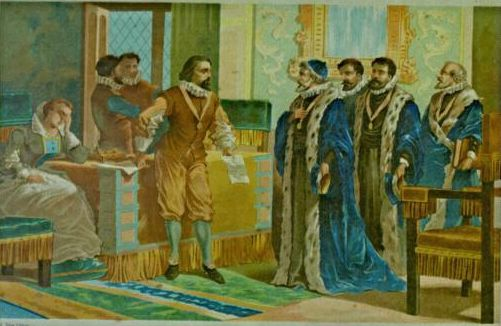

## Description

<em>F</em>ra<em>n</em>cis Baco<em>n</em> <em>w</em>a<em>s</em> <em>a</em>n E<em>ng</em>lish ph<em>i</em>l<em>os</em>o<em>p</em>her a<em>n</em>d <em>s</em>tat<em>e</em>sm<em>a</em>n w<em>h</em>o se<em>rve</em>d <em>a</em>s At<em>t</em>or<em>n</em>ey Gen<em>e</em>ral and as <em>L</em>or<em>d</em> <em>Ch</em>an<em>ce</em>l<em>l</em>or of <em>En</em>g<em>l</em>an<em>d</em>. Hi<em>s</em> <em>w</em>orks ar<em>e</em> c<em>red</em>it<em>e</em>d w<em>ith</em> d<em>e</em>ve<em>lo</em>pi<em>ng</em> <em>t</em>h<em>e</em> sci<em>e</em>nt<em>i</em>fic me<em>t</em>hod and re<em>m</em>ai<em>ned</em> in<em>fl</em>u<em>en</em>ti<em>al</em> th<em>rou</em>gh <em>t</em>he s<em>cien</em>tific <em>r</em>ev<em>o</em>l<em>u</em>ti<em>o</em>n.
<em>B</em>a<em>co</em>n h<em>as</em> <em>b</em>e<em>e</em>n ca<em>l</em>led <em>th</em>e <em>f</em>ath<em>e</em>r o<em>f</em> emp<em>iric</em>i<em>s</em>m. <em>Hi</em>s <em>wor</em>ks ar<em>g</em>ued for th<em>e</em> po<em>ssi</em>bi<em>li</em>t<em>y</em> of s<em>c</em>ie<em>n</em>tifi<em>c</em> <em>kno</em>wl<em>edg</em>e b<em>a</em>se<em>d</em> onl<em>y</em> u<em>p</em>on i<em>n</em>du<em>c</em>t<em>i</em>ve <em>r</em>ea<em>s</em>onin<em>g</em> <em>a</em>nd c<em>aref</em>u<em>l</em> o<em>bs</em>er<em>v</em>ation o<em>f</em> <em>e</em>v<em>e</em>nt<em>s</em> in <em>na</em>tur<em>e</em>. Mo<em>st</em> <em>i</em>mp<em>ort</em>an<em>t</em>l<em>y</em>, <em>he</em> a<em>rgue</em>d sc<em>i</em>en<em>c</em>e co<em>uld</em> <em>b</em>e <em>a</em>c<em>hi</em>eved by us<em>e</em> of a <em>s</em>ce<em>p</em>t<em>ical</em> a<em>nd</em> me<em>t</em>hod<em>i</em>ca<em>l</em> <em>a</em>pp<em>roa</em>ch wh<em>er</em>eby <em>s</em>cientist<em>s</em> ai<em>m</em> t<em>o</em> avo<em>i</em>d m<em>i</em>sl<em>ead</em>in<em>g</em> themsel<em>ve</em>s. <em>A</em>lth<em>oug</em>h <em>h</em>is <em>p</em>ra<em>c</em>tic<em>a</em>l i<em>d</em>e<em>a</em>s ab<em>out</em> <em>s</em>u<em>ch</em> <em>a</em> <em>m</em>et<em>h</em>od, <em>t</em>he B<em>a</em>con<em>i</em>an meth<em>o</em>d, d<em>i</em>d no<em>t</em> have <em>a</em> l<em>o</em>n<em>g</em>-<em>la</em>s<em>t</em>ing <em>i</em>nfluen<em>c</em>e, <em>th</em>e <em>g</em>e<em>ne</em>ral <em>i</em>dea <em>of</em> <em>t</em>he imp<em>o</em>rta<em>n</em>ce and pos<em>s</em>i<em>b</em>il<em>it</em>y o<em>f</em> a s<em>c</em>ept<em>i</em>cal methodology makes Bacon the father of the scientific method. This method was a new rhetorical and theoretical framework for science, the practical details of which are still central in debates about science and methodology.

Bacon was the first recipient of the Queen's counsel designation, which
was conferred in 1597 when Elizabeth I of England reserved Bacon as her
legal advisor. After the accession of James VI and I in 1603, Bacon was
knighted. He was later created Baron Verulam in 1618 and Viscount St.
Alban in 1621. Because he had no heirs, both titles became extinct upon
his death in 1626, at 65 years. Bacon died of pneumonia, with one
account by John Aubrey stating that he had contracted the condition
while studying the effects of freezing on the preservation of meat. He
is buried at St Michael's Church, St Albans, Hertfordshire.

    Born: January 22
    Died: April 9
    Mother: Lady Anne
    Father: Sir Nicholas
    Secrets: unknown

## Solution

The first paragraph uses alternating italic and non-italic font, which
in combination with the title leads us to suspect [Bacon's cipher][1].

    abaaa aaaab bab ba abbaaaa aababbabaaa aba baaabaaba aba aabbba ba aabaabaa aaabaaa aaa aa baab bbaabbabaa aa bbabaab. aab baaaa aab abbbaaba abbb abaabbaabb bab aaabaabaaa aabaaa aaa aabaabbb aabbabbaabb aabbbaa baa abbbbaaaaa baababaaba.
    babba abb baba aabaaa bba baaaba ab aaabbbbaba. bba bbbaa aabaaa aaa aab aabbbaabbab aa abaabaaaab bbbaabbba abaab aaab abaa abaababaa baabaaaab baa abbbbab abbaabaaaaa ab babaab aa bbaaab. aabb baabbbaabab, bb abbbba aabaaba aabbb ba babbaaaa aa aab aa a baababbbb abb aabaaabaab baabbbaa aabbaaa baaaaaaaab aab ab aaaba abaabbbaab aaaaaaabba. baaabbba baa baabaaaba ababa aabbb babb b baabaa, baa abaaabaa aaaaba, aba aab aaaa b abab-bbabaaa baaaaaaba, bba babbaaa baaa bb baa aaabaaabaa aaa aaababaabba ab a abaaabaaa aaaaaaaaaaa aaaaa aaaaa aaa aaaaaa aa aaa aaaaaaaaaa aaaaaa. aaaa aaaaaa aaa a aaa aaaaaaaaaa aaa aaaaaaaaaaa aaaaaaaaa aaa aaaaaaa, aaa aaaaaaaaa aaaaaaa aa aaaaa aaa aaaaa aaaaaaa aa aaaaaaa aaaaa aaaaaaa aaa aaaaaaaaaaa.``

which we can decode using [this online tool][2] to:

    SANTA LIKES HIS BACON BUT ALSO THIS BACON THE PASSWORD IS H VXBACONCIPHERISSIMPLEBUTCOOLX REPLACE X WITH BRACKETS AND USE UPPERCASE FOR ALL CHARACTER AA A A A A A AA A A A A A AA AAA A A A A AA A A A A AA A A AA AAA

[1]: https://en.wikipedia.org/wiki/Bacon%27s_cipher
[2]: https://mothereff.in/bacon
