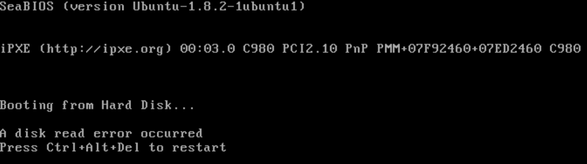
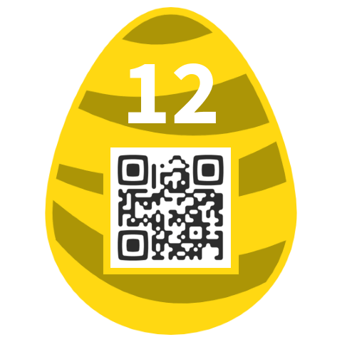

**Challenge**
Once upon a file there was a hidden egg. It's still waiting to be saved
by a noble prince or princess.

## Solution

Hmm. Zipped file containing a single file, nothing interesting in
zipdetails.

    [hxr@leda:~/Downloads]$ file file
    file: DOS/MBR boot sector, code offset 0x52+2, OEM-ID "NTFS    ", sectors/cluster 8, Media descriptor 0xf8, sectors/track 63, hidden sectors 1, dos < 4.0 BootSector (0x80), FAT (1Y bit by descriptor); NTFS, sectors/track 63, sectors 10239, $MFT start cluster 426, $MFTMirror start cluster 2, bytes/RecordSegment 2^(-1*246), clusters/index block 1, serial number 09850f88350f86a00
{: .language-console}

Ok, that's interesting.

    qemu-system-x86_64 -drive format=raw,file=disk.img
{: .language-console}

Not sure where to go from here. tcpdump where it's pixieing to? EDIT:
apparently this is standard qemu/seabios behaviour. Whoops. No idea.
Tried `photorec` on the disk image with no luck.

next we tried binwalk

    $ binwalk -e file

    DECIMAL       HEXADECIMAL     DESCRIPTION
    --------------------------------------------------------------------------------
    36447         0x8E5F          Unix path: /0/1/2/3/4/5/6/7/8/9/:/;/</=/>/?/@/A/B/C/D/E/F/G/H/I/J/K/L/M/N/O/P/Q/R/S/T/U/V/W/X/Y/Z/[/\/]/^/_/`/a/b/c/d/e/f/g/h/i/j/k/l/m/n/o
    184320        0x2D000         Zip archive data, at least v2.0 to extract, compressed size: 439156, uncompressed size: 5242880, name: file
    623596        0x983EC         End of Zip archive

    $ ls _file.extracted
    2D000.zip  file

    $ cd _file.extracted

    $ binwalk -e file

    DECIMAL       HEXADECIMAL     DESCRIPTION
    --------------------------------------------------------------------------------
    36447         0x8E5F          Unix path: /0/1/2/3/4/5/6/7/8/9/:/;/</=/>/?/@/A/B/C/D/E/F/G/H/I/J/K/L/M/N/O/P/Q/R/S/T/U/V/W/X/Y/Z/[/\/]/^/_/`/a/b/c/d/e/f/g/h/i/j/k/l/m/n/o
    1093632       0x10B000        Microsoft Cabinet archive data, 17834 bytes, 1 file
    2832320       0x2B37C0        Microsoft Cabinet archive data, 17834 bytes, 1 file
    3116030       0x2F8BFE        Microsoft executable, MS-DOS
    3788479       0x39CEBF        mcrypt 2.2 encrypted data, algorithm: blowfish-448, mode: CBC, keymode: 8bit
    3793983       0x39E43F        mcrypt 2.2 encrypted data, algorithm: blowfish-448, mode: CBC, keymode: 8bit
    4477995       0x44542B        mcrypt 2.2 encrypted data, algorithm: blowfish-448, mode: CBC, keymode: SHA-1 hash
    5073287       0x4D6987        mcrypt 2.2 encrypted data, algorithm: blowfish-448, mode: CBC, keymode: 8bit
    5075359       0x4D719F        mcrypt 2.2 encrypted data, algorithm: blowfish-448, mode: CBC, keymode: 8bit
    5173248       0x4EF000        PNG image, 480 x 480, 8-bit colormap, non-interlaced
    5173767       0x4EF207        Zlib compressed data, best compression

    $ ls _file.extracted
    10B000.cab  2B37C0.cab  4EF207  4EF207.zlib  egg12.png  eg?Z2.png
{: .language-bash}

and there we see we get our egg

## Nugget

    duRpDmUeN0d71XzeF8ae

