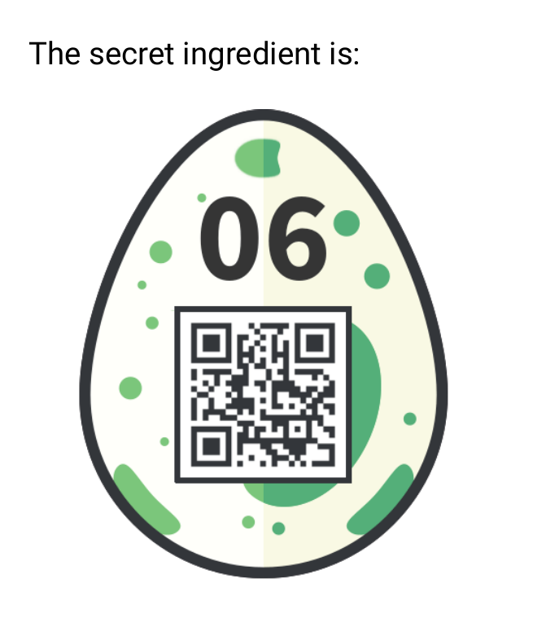

## Challenge

```
You've found this recipe online:

    1 pinch: c2FsdA==

    2 tablesspoons: b2ls

    1 teaspoon: dDd3Mmc=

    50g: bnRkby4=

    2 medium, chopped: b25pb24=

But you need one more secret ingredient! Find it!
```

## Solution

These b64 decode to

```
1 pinch: salt
2 tablesspoons: oil
1 teaspoon: t7w2g
50g: ntdo.
2 medium, chopped: onion

But you need one more secret ingredient! Find it!
```

The period at the end of the fourth part is the hint, this is a url!

```
saltoilt7w2gntdo.onion
```

open it with a tor browser to get the egg





