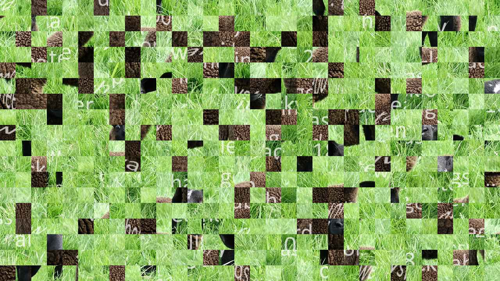
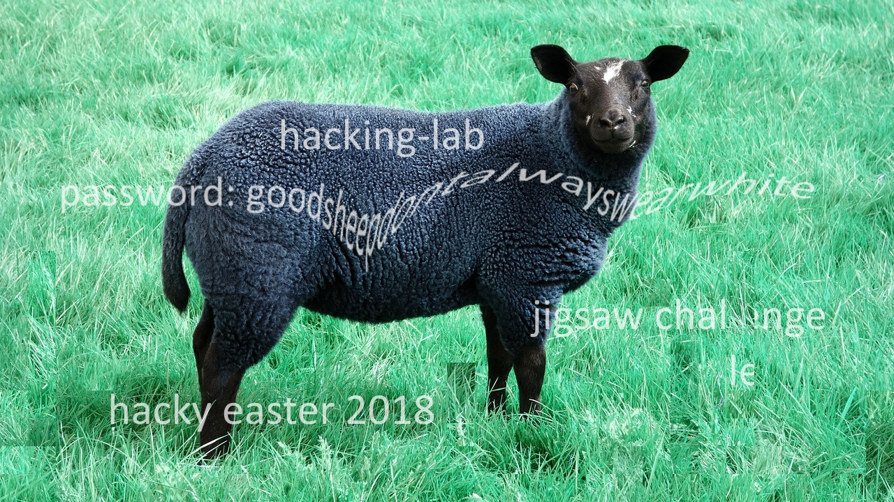

## Challenge

Thumper was probably under time pressure and jumped around a bit too wild. As a result, his picture has broken.

Can you write a program to put it back together



## Solution

This tool is pure magic and solved this challenge for us using a genetic algorithm: https://github.com/nemanja-m/gaps

```bash
$ gaps --image=../jigsaw.png --generations=30 --population=600 --save
```



```
goodsheepdontalwayswearwhite
```

We put this phrase into the egg-o-matic to get our egg


