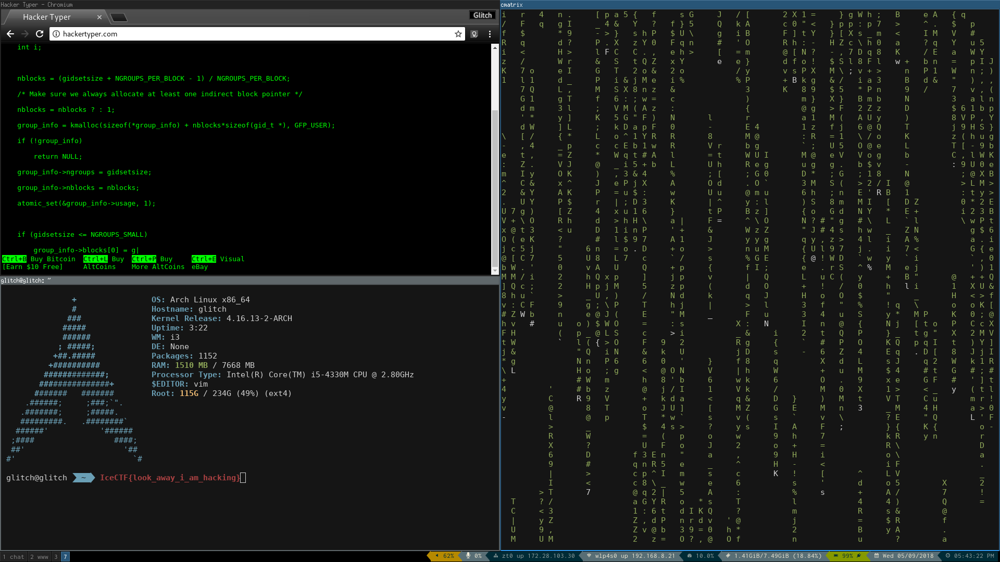

## Challenge

After a recent hack, a laptop was seized and subsequently analyzed. The
victim of the hack? An innocent mexican restaurant. During the
investigation they found this suspicous file. Can you find any evidence
that the owner of this laptop is the culprit?

[file](writeupfiles/hardshells)

## Solution

the file is an encrypted zip file.

we use fcrackzip with the crackstation wordlist to find the password

    $ fcrackzip -v --use-unzip  -D -p wordlist hardshells.zip
    'hardshells/' is not encrypted, skipping
    found file 'hardshells/d', (size cp/uc 309500/5242880, flags 9, chk 91d0)
    checking pw TILIGUL'S
    
    PASSWORD FOUND!!!!: pw == tacos
{: .language-bash}

the [file we get](writeupfiles/d) now is a Minix filesystem

    $ file d
    d: Minix filesystem, V1, 30 char names, 20 zones
{: .language-bash}

Running `strings`, we found `IHDR` indicating it might be a PNG file.
Comparing  
the file (in vim) to a normal PNG file we discovered they'd changed PNG
to PUG  
and the file became valid.

This gives us a nice screenshot of someone's desktop, with the flag.

## Flag

    IceCTF{look_away_i_am_hacking}

