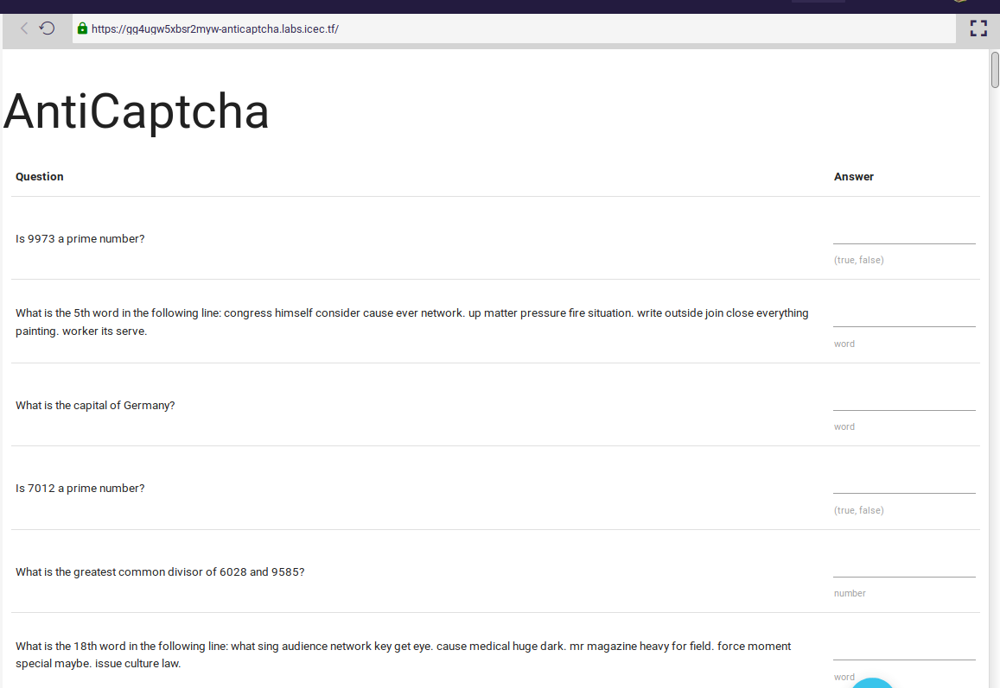

## Challenge

Wow, this is a big captcha. Who has enough time to solve this? Seems
like a lot of effort to me!

https://gg4ugw5xbsr2myw-anticaptcha.labs.icec.tf/

## Solution

looks like we will have to answer these questions to get the flag. We
automate this:

    
    from bs4 import BeautifulSoup
    import requests
    from fractions import gcd as _gcd
    import math
    import re
    import sys
    from itertools import count, islice
    from math import sqrt
    
    URL = "https://gg4ugw5xbsr2myw-anticaptcha.labs.icec.tf/"
    
    def isprime(n):
        n = int(n)
        return n > 1 and all(n%i for i in islice(count(2), int(sqrt(n)-1)))
    
    def gcd(a, b):
        return _gcd(int(a), int(b))
    
    def nthword(a, b):
        return b.replace('.',' ').replace('  ',' ').split(' ')[int(a)]
    
    
    asdf = {
        'What is the greatest common divisor of (?P<a>[0-9]+) and (?P<b>[0-9]+)?': gcd,
        'Is (?P<a>[0-9]+) a prime number?': isprime,
        'What is the (?P<a>[0-9]+).. word in the following line:(?P<b>.*)': nthword,
        'What is the tallest mountain on Earth?': lambda: "Mount Everest",
        'What is the capital of Hawaii?': lambda: "Honolulu",
        'What color is the sky?': lambda: "blue",
        'What year is it?': lambda: "2018",
        'Who directed the movie Jaws?': lambda: "Steven Spielberg",
        'What is the capital of Germany?': lambda: "Berlin",
        'Which planet is closest to the sun?': lambda: "Mercury",
        'How many strings does a violin have?': lambda: "4",
        'How many planets are between Earth and the Sun?': lambda: "2",
    }
    
    
    data = requests.get(URL)
    
    answers = []
    
    html_doc = data.text
    soup = BeautifulSoup(html_doc, 'html.parser')
    for idx, td in enumerate(soup.find_all('td')):
        if idx % 2 == 1:
            continue
    
        text = td.text.replace('\n', '')
    
        matched = False
        for (m, func) in asdf.items():
            match = re.match(m, text)
            if match:
                matched = True
                answers.append(str(func(*match.groups())))
    
        if not matched:
            print("> %s <" % text)
    
    
    
    r = requests.post(URL, headers={'Content-type': 'application/x-www-form-urlencoded'}, data={'answer': answers})
    print(r.text[:1000])
{: .language-python}

when we get it right, the page responds with our flag

## Flag

    IceCTF{ahh_we_have_been_captchured}

