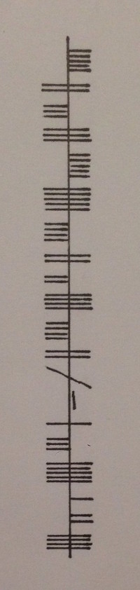

# PoliCTF 2017

## Overview


```
Title                                    Category     Flag
---------------------------------------- ------------ -----------------------------
Rock Solid                               Crypto       NOTUNICODECOMPATIBLE
Splyt                                    Crypto
Synesthesia                              Forensics
Status Box                               Pwnables
echo fail                                Pwnables
Polishop                                 Grab bag
Kompreplicants                           Reversing
```

## Crypto: Rock Solid  

**Challenge**  
```
7º 2' 34.46" W 54º 41' 54.28" N
```

**Pay attention:** the flag is not in the standard format



**Solution**  

The coordinates point to Ireland. Some quick googling reveals this is an ancient
cipher called the [Ogham cipher](https://en.wikipedia.org/wiki/Ogham)


**Flag**

```
NOTUNICODECOMPATIBLE
```


## Category: Title  

**Challenge**  
**Solution**  
**Flag**

```
flag{}
```
