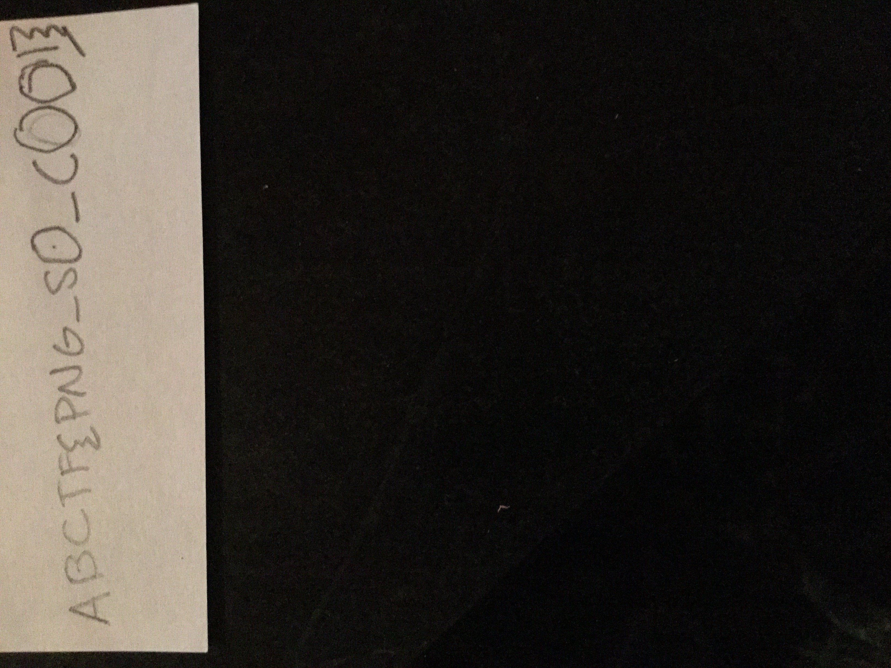

**Challenge**   
There is something a little off about
[this](writeupfiles/PurpleThing.png) picture. If you could help us we
could give you some points! Just find us a flag!

## Solution

There was more data appended to the end of the image, we can extract
this using `binwalk`

    $ binwalk PurpleThing.png                     [16-07-16 17:56:05]
    
    DECIMAL       HEXADECIMAL     DESCRIPTION
    --------------------------------------------------------------------------------
    0             0x0             PNG image, 3200 x 2953, 8-bit/color RGBA, non-interlaced
    85            0x55            Zlib compressed data, best compression
    2757          0xAC5           Zlib compressed data, best compression
    765455        0xBAE0F         JPEG image data, JFIF standard 1.01
    765485        0xBAE2D         TIFF image data, big-endian, offset of first image directory: 8
    1809691       0x1B9D1B        StuffIt Deluxe Segment (data): f

we extract the jpeg image

    $ binwalk --dd=jpeg PurpleThing.png

