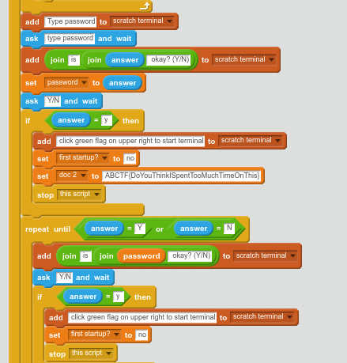

**Challenge**   
Dialga1234 - Johnny Boy

## Solution

This is recon, so we google for Dialga1234, and get a hit on
[Scratch][1], this would seem to fit with the `Itchy` in the title so we
explore further

There is an application shared there, it asks for a username and
password, which we don't know, but we can inspect the application and
see what it does. Here we can also find the flag

[1]: https://scratch.mit.edu