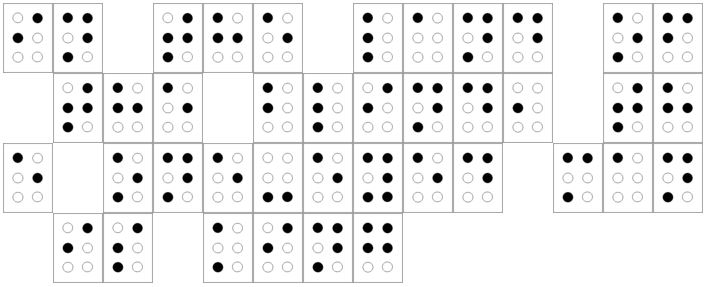
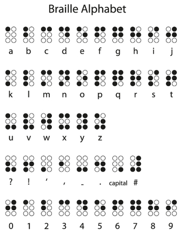
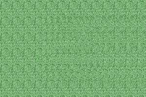
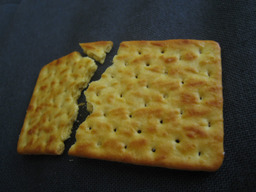

# December 1st: **Move Forward**

**URL:** 

[http://hackvent.hacking-lab.com/challenge.php?day=1](http://hackvent.hacking-lab.com/challenge.php?day=1)

**Hint:**  

*reconnaissance*  
  
*Here is your entry point @hackvent*  
  
*Follow the white rabbit..*  

**Solution:**  

The hint is a twitter account with the name Santa Claus.  
There is a tweet referring to the challenge:

```
Here we go for the first day: https://tr.im/a1188
```

Following the link gets us to an false christmas ball image 


so we need to go one step back, hmm.

After much time wasted on twitter, we perform a wget and see the shortened url 
redirects to another shortened url, *bit.ly/1y04yV4*:


```
 wget tr.im/a1188
--2014-12-05 16:16:54--  http://tr.im/a1188
Resolving tr.im (tr.im)... 54.165.60.202
Connecting to tr.im (tr.im)|54.165.60.202|:80... connected.
HTTP request sent, awaiting response... 301 Moved Permanently
Location: https://tr.im/a1188 [following]
--2014-12-05 16:16:55--  https://tr.im/a1188
Connecting to tr.im (tr.im)|54.165.60.202|:443... connected.
HTTP request sent, awaiting response... 301 Moved Permanently
Location: http://hackvent.hacking-lab.com/ch01.php [following]
--2014-12-05 16:16:55--  http://hackvent.hacking-lab.com/ch01.php
Resolving hackvent.hacking-lab.com (hackvent.hacking-lab.com)... 212.254.178.162
Connecting to hackvent.hacking-lab.com (hackvent.hacking-lab.com)|212.254.178.162|:80... connected.
HTTP request sent, awaiting response... 302 Found
Location: http://bit.ly/1y04yV4 [following]
--2014-12-05 16:16:56--  http://bit.ly/1y04yV4
Resolving bit.ly (bit.ly)... 69.58.188.40, 69.58.188.39
Connecting to bit.ly (bit.ly)|69.58.188.40|:80... connected.
HTTP request sent, awaiting response... 301 Moved Permanently
Location: http://hackvent.hacking-lab.com/images/tricked.png [following]
--2014-12-05 16:16:56--  http://hackvent.hacking-lab.com/images/tricked.png
Connecting to hackvent.hacking-lab.com (hackvent.hacking-lab.com)|212.254.178.162|:80... connected.
HTTP request sent, awaiting response... 200 OK
Length: 55247 (54K) [image/png]

```  
  
This would seem to fit with the hint *one step back*.. Let's explore further  
  
Bitly tracks stats on bit.ly links. To see these we register for an account and do a search of the link.  
We get to HACKvent's Bitly account, and see the link used to redirect to a different location:  


so our bauble is:

  


**Flag:**  

```
HV24-BAAJ-6ZtK-IJHy-bABB-YoMw  
```

# December 2nd: **Back in time**

**URL:** 

[http://hackvent.hacking-lab.com/challenge.php?day=2](http://hackvent.hacking-lab.com/challenge.php?day=2)

**Hint:**  
  
knowledge

**Challenge:**  
  
*Get this to catch the next XMas-Ball*

```
aHR0cDovL2hhY2t2ZW50Lm9yZy8=
```

*but you have to be fast, perhaps somone will changed it*  
  

**Solution**  
  
The string looks like base64 encoding, so we decode it to get:  

```
http://hackvent.org/  
```

If we go to the URL, we get a ball with a message saying we weren't fast enough and should try building a time machine and watch the past.  
  
  
  
  
  
So we do a google search instead and look at a cached version of the website. This gives us the real image.


Decoding this QR code gives us the key.

**Flag:**  

```
HV14-fkPc-ljq6-Ldwq-foD7-rnpH  
```

# December 3rd: **Candle 1**

**URL:** 

[http://hackvent.hacking-lab.com/challenge.php?day=3](http://hackvent.hacking-lab.com/challenge.php?day=3)

**Hint:**  

*really old school (500 b.c.)*  

There is also an image of an octogonal candle


**Challenge:**  

The challenge itself consists of a string of letters to decode:

```
WAIYTELZEREMSOK3TEBZWETUE2EB2HIRMRYGBUGKSRASIIXGQ5HYSESYWCZDYCACBS43JIOHNRAA3DAURDES2DGO
```

**Solution:**  
  
The hint in combination with the image of the candle makes us suspect a [scytale cipher](http://en.wikipedia.org/wiki/Scytale).
This is an ancient spartan encryption method where a strip of paper is wrapped around a cylindrical object before the message is written and read. 
When unwrapped, the letters appear out of order (transposition cipher).


The trick is to find the right wrapping length, but we just try some until we find a message: 

```
WAIYTELZER
EMSOK3TEBZ
WETUE2EB2H
IRMRYGBUGK
SRASIIXGQ5
HYSESYWCZD
YCACBS43JI
OHNRAA3DA
URDES2DGO
```

Reading this top to bottom left to right we get:  

```
WEWISHYOUAMERRYCHRISTMASANDYOURSECRETKEYISBASE32GIYSA2LTEBXW43DZEBUGC3DGEB2GQZJAORZHK5DI  
```

Adding in some spaces gives us: 

```
WE WISH YOU A MERRY CHRISTMAS AND YOUR SECRET KEY IS 
BASE32GIYSA2LTEBXW43DZEBUGC3DGEB2GQZJAORZHK5DI  
```

The secret key starts with `BASE32`, so we Base32-decode the remaining characters 
(for example [here](http://online-calculators.appspot.com/base32/)).   
  
The resulting message was:

```
21 is only half the truth
```

We put this into the ball-o-matic and get the bauble with QR code: 


  
We decode the QR code to get the key.


**Flag:**  

```
HV14-aHA3-Ciaz-wS3e-fDrj-965A  
```
# December 4th: **Crypto 1**

**URL:** 

[http://hackvent.hacking-lab.com/challenge.php?day=4](http://hackvent.hacking-lab.com/challenge.php?day=4)
  
  
**Hint:**  

*or what else?*  
  
  
**Challenge:**    
  
  
  


**Solution:**  
  
  
Braille! Translate using a chart such as [this one](http://www.todayifoundout.com/wp-content/uploads/2013/11/braille-alphabet.jpg):
  
  
  
  
  
After translation we get the following message:

```
in the land of the blind, the one-eyed man is king
```

Input this into the ball-o-matic gives:


**Flag:**  

```
HV14-kSKV-4Bx3-dPXL-Iq1A-z1R7
```

# December 5th: **Math Basics**

**URL:** 

[http://hackvent.hacking-lab.com/challenge.php?day=5](http://hackvent.hacking-lab.com/challenge.php?day=5)

**Hint:**  

*for everyone, even for your granny*  


**Challenge:**  


**Solution:**  
  
Just ask Google!! :D

Google query:

```
(half of a megasecond) squared squared ( (bakers dozen donkeypower (number of horns on a unicorn 
once in a blue moon)/ answer to life the universe and everything ) / a beard second squared earth mass)
```

Google says:

```
378 063 953
```

Put this in ball-o-matic (without spaces)  

 


**Flag:**  

```
HV14-EzUE-bIF6-1JUD-zMXa-uWEl
```
# December 6th: **Do you speak 1337??**

**URL:** 

[http://hackvent.hacking-lab.com/challenge.php?day=6](http://hackvent.hacking-lab.com/challenge.php?day=6)

**Hint:**  

*well, my native language is this*  

*But be careful, this can lead to headache!*

**Challenge:**  

```
-[--->+<]>-.[---->+++++<]>-.---.+++++++++++++.-------------.--[--->+<]>-.[->+++<]>+.--[--->+<]>
---.-------------.--[--->+<]>-.+++++[->+++<]>.-.--.-[--->+<]>.-[---->+<]>++.[-->+++<]>+.-.[--->
++<]>.---[->++++<]>.+++++.---------.-----------.[--->+<]>----.+[---->+<]>+++.+++++[->+++<]>.---
------.[--->+<]>--.[-->+++++++<]>.-----------.++++++++++.+.----.-------.--[--->+<]>-.-[--->++<]
>-.+++++.-[->+++++<]>-.---[->++++<]>.------------.---.--[--->+<]>-.--[->++++<]>-.--------.+++.-
-----.--------.[----->+++<]>--.[-->+<]>+++.>-[--->+<]>-.[---->+++++<]>-.+++++++.++++.++++[->+++
<]>.--[--->+<]>-.--[->++++<]>-.+[->+++<]>.+++++++.[--->+<]>-----.---[->++++<]>+.-------.-------
---.+.+++++++++++++.+.+.+[->+++<]>++.+++++++++++++.----------.-[--->+<]>-.[->+++<]>++.+++++++.+
++++.-------------.--[--->+<]>---.+++++++.-[-->+++++<]>.------------.[->+++<]>+.+++++++++++++.-
---------.-[--->+<]>-.---[->++++<]>.------------.+++++++.++++.++++[->+++<]>.--[--->+<]>-.--[->+
+++<]>-.+[->+++<]>.+++++++.[--->+<]>-----.+[->+++<]>+.+++++++++++.-.[++>---<]>++.[->+++<]>-. 
```

**Solution:**  
  
This is [brainfuck](http://esolangs.org/wiki/brainfuck) code! :D 

We can use an [online brainfuck interpreter](http://esoteric.sange.fi/brainfuck/impl/interp/i.html) to execute it. 
The output of the program is:

```
There are only 10 types of people in the world: Those who understand binary, and those who don't
```

Put this in ball-o-matic: 


 


**Flag:**  

```
HV14-tGhO-XJYc-90ve-8lT8-Cyzq
```
# December 7th: **Can u c?**

**URL:** 

[http://hackvent.hacking-lab.com/challenge.php?day=7](http://hackvent.hacking-lab.com/challenge.php?day=7)

**Hint:**  

*but to see is not to scan*


**Challenge:**  

The challenge is a stereogram [image](images/3DQR.png). 




**Solution:**  
  
The image name leads us to suspect there is a QR code hidden in the stereographic image.   

There is an online viewing utility for stereograms: [http://magiceye.ecksdee.co.uk/](http://magiceye.ecksdee.co.uk/)

Playing around with the slider we get the following image:


We clean this up a bit in Gimp and get:


**Flag:**  

```
HV14-1qqQ-9bKq-4Ku3-8fCG-F6e5
```

# December 8th: Pearl White Candle


**URL**

[http://hackvent.hacking-lab.com/challenge.php?day=8](http://hackvent.hacking-lab.com/challenge.php?day=8)

**Hint**

None

**Challenge**

We are given an ascii art candle:

```

                                 (
                     (       (
                           (         (
                (    (         (            (
                                       (
             (      (       (    (          (    (
                             ''
                )      )      )))   )    )     )   )
           )                  )))))
                  )          =~('(?{'           .
                       (    '`'|'%').   (    (
                (           '['))^'-'
                             ).('`'  |   '!')
                      .    (    (     '`')|','
                                )  .('"\\$').(
                             '`'|'!').'=<>;'.
                        ('`'|'#').('`'|"\(").(
                    '`'|'/').('`'|'-').(('[')^
                    '+').('{'^'[').'\\$'.('`'|
                    '!').';\\$'.('`'|'!').'='
                    .'~'.('['^'/').('['^')').
                    '/'.('`'^'!').'-'.('{'^'!'
                   ).('{'^'[').('`'|'!').'-'.(
                  '['^'!').'/\\"-;'.('`'^'.').
                  '-'.('{'^'!').('`'^('!')).
                  '-'.('`'^"\-").'/;((\\$'.(
                     '`'|'!').('{'^'[').('`'
                     |'%').('['^'*').(('{')^
                     '[')."'".('^'^('`'|'.')
                     ).('`'^'"').('{'^'!').(
                     '`'^'-').('`'^'.').('`'
                     ^'$').('{'^'(').(('`')^
                     '&').('{'^'!').('`'^'.'
                     ).('{'^'*').('`'^'/').(
                     '`'^'"').('`'^'.').('`'
   ^                 '$').('`'^'/').('`'^'&'
).(('`')^            "'").('{'^'(').('`'^'.'        )     .
  ('^'^('`'|'/'      )).('{'^'(').('`'^'&').  (    '{'^"\!").
   '!'."\'".')&&('.( '['^'+').('['^')').('`'   |')').('`'|'.').(
   ((   '['))^'/').('{'^'[').'\\"'.('['^')')  .('`'|')').('`'|"'")
         .(  '`'|'(').('['^'/').'\\\\'.('`'|'.').'\\"));'.('!'^
               '+')   .'"})');$:='.'^'~';$~ =(   (     (     (
                (         '@')))))|'('
                      ;$^=')'^'[';$/
                  ='`'|'.';$,=('(')^
                '}';$\='`'|'!';#;#
                  ;#;  #;#   ;#;

```


**Solution**

This looks like code so it would follow that we need to evaluate it. We find out that it is compiled perl code (title of challenge is also a hint to this), 
and use [Deparse](http://perldoc.perl.org/B/Deparse.html) to obtain the source code.

Deparse is a backend module for the Perl compiler that generates perl source code, based on the internal compiled structure that perl itself creates after parsing a program


```
perl -Mre=eval -MO=Deparse candle.txt 
```

This gives us the following perl code: 


```perl
'' =~
m[(?{eval"\$a=<>;chomp \$a;\$a=~tr/A-Z a-z/\"-;N-ZA-M/;((\$a eq '0BZMNDSFZNQOBNDOFGSN1SFZ!')
   &&(print \"right\\n\"));\n"})];
$: = 'P';
$~ = 'h';
$^ = 'r';
$/ = 'n';
$, = 'U';
$\ = 'a';

```

This takes a file as argument, transforms the contents of the file, and the output should equal `0BZMNDSFZNQOBNDOFGSN1SFZ!` 
after transformation to get the output `right` from the program. We input a bunch of characters to view the mapping
 


```
input:   ABCDEFGHIJKLMNOPQRSTUVWXYZabcdefghijklmnopqrstuvwxyz0123456789!@#$%^&*()_+=-~`[]{};':",.<>/?
output: N"#$%&'()*+,-./0123456789:;OPQRSTUVWXYZABCDEFGHIJKLMM0123456789!@#$%^&*()_+=-~`[]{};':",.<>/?
```

We find that the following would produce the correct ouput:

```
0nly perl can parse 1erl!
```

We indeed get the output `right` from the program, but the ball-o-matic does not accept the answer. 

But we notice that the mapping is not unique, and the follwoing text also gives the right answer, and makes more sense:


```
Only perl can parse Perl!
```

We put this phrase in the ball-o-matic to get the bauble:


**Flag**

```
HV14-uKoC-U8wM-HpDl-6qdw-GyQX
```

# December 9th: iPhone Forensic

**URL**

[http://hackvent.hacking-lab.com/challenge.php?day=9](http://hackvent.hacking-lab.com/challenge.php?day=9)

**Hint**

reveal the message

**Challenge**

Get your daily work: [file](images/iPh0n3)

**Solution**


The file contains an mysql database. We open the database in sqliteman. We see a chat message. 


```
==Nn0EUp68lYbS2LeMKMhEaYbS2Leyzoa1PouWzYw9JoiRQJFS3qT10IIuxY3Szq

```

This looks like base64 string but reveresed. We also see some references to ROT13 in the database, so we try to combine ROT13, reverse, and base64 decode to find the message

```
==Nn0EUp68lYbS2LeMKMhEaYbS2Leyzoa1PouWzYw9JoiRQJFS3qT10IIuxY3Szq
reverse: qzS3YxuII01Tq3SFJQRioJ9wYzWuoP1aozyeL2SbYaEhMKMeL2SbYl86pUE0nN==
ROT13: dmF3LkhVV01Gd3FSWDEvbW9jLmJhbC1nbmlrY2FoLnRuZXZrY2FoLy86cHR0aA==
Base64 decode: vaw.HUWMFwqRX1/moc.bal-gnikcah.tnevkcah//:ptth
reverse: http://hackvent.hacking-lab.com/1XRqwFMWUH.wav
```

This is a link to [a wav file](images/XRqwFMWUH.wav).

The audio file contains what sounds like DTMF tones. We can decode them online [here](http://dialabc.com/sound/detect/index.html).
This gives us the following list of keys pressed:


```
33#97#122#33#110#103#97
```

These are ascii character encodings, with # as a separator. It reads:


```
Baz!nga
```

We put this into ball-o-matic to get the bauble:


**Flag**

```
HV14-EX1a-UVIZ-3f7z-JwSw-I7lo
```

# December 10th: SQL hero

**URL**

[http://hackvent.hacking-lab.com/challenge.php?day=10](http://hackvent.hacking-lab.com/challenge.php?day=10)

**Hint**

*the oracle says: just another language*

**Challenge**

Based on this table (hlscore):

```
RANK POINTS TEAM        NICK        AVATAR  
==== ====== =========== =========== ======  
1    2619   Ukraine     solarwind   Crack  
2    2610   Switzerland HaRdLoCk    Crack  
3    2400   Switzerland M.          Chief  
4    2270   Switzerland PS          Chief  
5    2178   Spain       tunelko     Chief  
6    2030   Switzerland DanMcFly    Chief  
7    1054   Austria     Mister004   Chief  
8    1028   Austria     woody       Chief  
9    941    Italy       scegliau    Geek  
10   848    Austria     sebl314     Geek
11   837    Austria     TomCat435   Geek
12   814    Austria     nufan       Geek
13   808    Austria     WANeKO3     Geek
14   720    Austria     Manio       Geek
15   712    Switzerland Leskat      Geek
16   706    Ukraine     LeoStep     Geek
17   702    Austria     chris.pcguy Geek
18   691    Switzerland bias        Geek
19   662    Germany     nks         Geek
20   627    Switzerland d0h         Geek
```
Run this to get the daily code:

```
select ( select translate('&1','abcdefghijklmnopqrstuvwxyz','MEZ4VPG5NS6RYH7CT1QW2FO3AI') from dual)
|| '-' || ( select case when points > 1000 then points + 1000 else points + 2500 end from hlscore
where utl_raw.cast_to_raw(dbms_obfuscation_toolkit.md5(input_string => NICK)) = 
'C6DEE681E936AF6577387507603A7539') || '-' || ( select substr(sum(level*level),3,4) from dual connect 
by level <= 1337 ) || '-' || ( select substr(rawtohex(utl_raw.cast_to_raw(dbms_obfuscation_toolkit.md5
(input_string => '&1'))), -14, 4) from dual) || '-' || ( select sum(y+cnt*cnt) from ( select count(*)
cnt, team, mod(trunc(x),987) y from ( select team, avg(points) over(partition by team) x from hlscore)
group by team,x having count(*) > 2)) || '-' || ( select sum(points) from hlscore start with rank=15
connect by rank= prior rank-3 ) solution_code from dual 
```

**Solution**


We can solve this online using [SQLFiddle](sqlfiddle.com). Select oracle sql, and first create the database:


```
CREATE TABLE hlscore (RANK int, POINTS int, TEAM varchar(255), NICK varchar(255), AVATAR varchar(255));
INSERT INTO hlscore  (RANK,POINTS,TEAM,NICK,AVATAR) VALUES(1,2619,'Ukraine','solarwind','Crack');
INSERT INTO hlscore (RANK,POINTS,TEAM,NICK,AVATAR) VALUES(2,2610,'Switzerland','HaRdLoCk','Crack');
INSERT INTO hlscore (RANK,POINTS,TEAM,NICK,AVATAR) VALUES(3,2400,'Switzerland','M.','Chief');
INSERT INTO hlscore (RANK,POINTS,TEAM,NICK,AVATAR) VALUES(4,2270,'Switzerland','PS','Chief');
INSERT INTO hlscore (RANK,POINTS,TEAM,NICK,AVATAR) VALUES(5,2178,'Spain','tunelko','Chief');
INSERT INTO hlscore (RANK,POINTS,TEAM,NICK,AVATAR) VALUES(6,2030,'Switzerland','DanMcFly','Chief');
INSERT INTO hlscore (RANK,POINTS,TEAM,NICK,AVATAR) VALUES(7,1054,'Austria','Mister004','Chief');
INSERT INTO hlscore (RANK,POINTS,TEAM,NICK,AVATAR) VALUES(8,1028,'Austria','woody','Chief');
INSERT INTO hlscore (RANK,POINTS,TEAM,NICK,AVATAR) VALUES(9,941,'Italy','scegliau','Geek');
INSERT INTO hlscore (RANK,POINTS,TEAM,NICK,AVATAR) VALUES(10,848,'Austria','sebl314','Geek');
INSERT INTO hlscore (RANK,POINTS,TEAM,NICK,AVATAR) VALUES(11,837,'Austria','TomCat435','Geek');
INSERT INTO hlscore (RANK,POINTS,TEAM,NICK,AVATAR) VALUES(12,814,'Austria','nufan','Geek');
INSERT INTO hlscore (RANK,POINTS,TEAM,NICK,AVATAR) VALUES(13,808,'Austria','WANeKO3','Geek');
INSERT INTO hlscore (RANK,POINTS,TEAM,NICK,AVATAR) VALUES(14,720,'Austria','Manio','Geek');
INSERT INTO hlscore (RANK,POINTS,TEAM,NICK,AVATAR) VALUES(15,712,'Switzerland','Leskat','Geek');
INSERT INTO hlscore (RANK,POINTS,TEAM,NICK,AVATAR) VALUES(16,706,'Ukraine','LeoStep','Geek');
INSERT INTO hlscore (RANK,POINTS,TEAM,NICK,AVATAR) VALUES(17,702,'Austria','chris.pcguy','Geek');
INSERT INTO hlscore (RANK,POINTS,TEAM,NICK,AVATAR) VALUES(18,691,'Switzerland','bias','Geek');
INSERT INTO hlscore (RANK,POINTS,TEAM,NICK,AVATAR) VALUES(19,662,'Germany','nks','Geek');
INSERT INTO hlscore (RANK,POINTS,TEAM,NICK,AVATAR) VALUES(20,627,'Switzerland','d0h','Geek');
```

Then execute the command. We get the following output:

```
&1-3212-7553-ED2D-1597-6897
```

This looks almost right, except it starts with `&1`, this should probably be `HV14`. We see in this statement: 

```
select translate('&1','abcdefghijklmnopqrstuvwxyz','MEZ4VPG5NS6RYH7CT1QW2FO3AI')
```

that value `nerd` would be translated into `HV14`. So we replace &1 with nerd on both places it appears


```
select ( select translate('nerd','abcdefghijklmnopqrstuvwxyz','MEZ4VPG5NS6RYH7CT1QW2FO3AI') from dual ) || '-' || 
( select case when points > 1000 then points + 1000 else points + 2500 end from hlscore where 
utl_raw.cast_to_raw(dbms_obfuscation_toolkit.md5(input_string => NICK)) = 'C6DEE681E936AF6577387507603A7539') || '-' || 
( select substr(sum(level*level),3,4) from dual connect by level <= 1337 ) || '-' || ( select 
substr(rawtohex(utl_raw.cast_to_raw(dbms_obfuscation_toolkit.md5(input_string => 'nerd'))), -14, 4) from dual) || '-' || 
( select sum(y+cnt*cnt) from ( select count(*) cnt, team, mod(trunc(x),987) y from ( select team, avg(points) 
over(partition by team) x from hlscore ) group by team,x having count(*) > 2)) || '-' || ( select sum(points) 
from hlscore start with rank=15 connect by rank= prior rank-3 ) solution_code from dual 
```
executing this gives our daily flag:


**Flag**

```
HV14-3212-7553-BCF8-1597-6897
```

# December 11th: Good Old Times

**URL**

[http://hackvent.hacking-lab.com/challenge.php?day=11](http://hackvent.hacking-lab.com/challenge.php?day=11)

**Hint**

*back in time, once again*

**Challenge**

We get a windows binary: [GoodOldTimes.exe](images/GoodOldTimes.exe)

**Solution**

When we run the executable, we get a message saying:

```
Sorry, all present are gone. Maybe you should go a bit back in time?
```

Faking the system time does not seem to help, and running the code in a debugger also leads nowhere, then we think old-school, and try Dos:

We run the program in DosBox and get:

```
I'm GLaD you found me. Now go back to your time and feed the Ball-O-Mat: I'm Still Alive
```

So we input *I'm Still Alive* into the ball-o-matic to get our bauble:


**Flag**

```
HV14-JpE4-CTg9-RuDG-9GFF-195M
```

# December 12th: Another oracle says 

**URL**

[http://hackvent.hacking-lab.com/challenge.php?day=12](http://hackvent.hacking-lab.com/challenge.php?day=12)

**Hint**

*wrap it up!*

**Challenge**

John Scriptkiddy has created an awesome crypttool to store his passwords very securely  
on the database. Unfortunately, a few days later, he recognized that his script is really  
awesome: He isn't capable to decrypt his own password!  

Can you help him to reveal his original password from this stored cipher:  
  
  
```
617B7E0A0870637F710E42B44A3B0647433442441B4E4F1D4B471F29475C5D62
```

He remembers only that it is an easy-to-remember phrase, well apparently not that easy ...

His awesome script is also available here: [AwesomeCryptTool.pls](images/AwesomeCryptTool.pls)
  


**Solution**  

The contents of the file are:

```
CREATE OR REPLACE PACKAGE HACKvent wrapped 
a000000
b2
abcd
abcd
abcd
abcd
abcd
abcd
abcd
abcd
abcd
abcd
abcd
abcd
abcd
abcd
abcd
9
9e aa
WvN7G0Z97FJZxrcs6FN4mZS8BegwgwL/f54VaS9GOPauf2NhYSanELc0bMJC2BOPRH472079
5mfaCjcsInUbe5dndzKa0MGZwNrhc4rs3619e5RBRwVcR7f+NkctWhGNU27zR628a2pk0WgN
owpf8LWz0sIQk30xpCJbEj5a

/
CREATE OR REPLACE PACKAGE BODY HACKvent wrapped 
a000000
b2
abcd
abcd
abcd
abcd
abcd
abcd
abcd
abcd
abcd
abcd
abcd
abcd
abcd
abcd
abcd
b
372 270
BwGVYsJ7/qYMVlBQVrtLCEIPNvowg41eLiAFfHRVPfmUNJX8eu+9Swzwy8hsbG/gDDciws6O
jlQ30tMfTDw4Z6rkWtoux1Rt/990+PfPBoxBPHHYzgk1AQFbKvl6VaRKDhDsG20RolA8qWUV
8o3eA0hT3zV5HREd/bmi11VuN16oReqp5ftkjfyHS37fkGVTvDf6Gnbg3Dr+4AN41rp8LTuJ
2Yt+NkUMyiZ3Cf2KAAjlzGapA7OFWSs7mq1IGnltsiBR5oPPIgF0MjZtbpkXusj3eEOqp5+c
Y1QM7C0FBKtWkofnuWrRVJIcWH4N44e4q9UGYZMpaaCb1dffQJAo3BNsaM/WzVzGaSjM0dgd
Lh1PlOmMR2V3nNqvDi2f8N76fN9xunfRhocRkDpUqIYBn+JOiAtPKtbBwTj/GuqIrch04REL
yBQuEWGWZcWkn7oewvMu+WNKhVT53OHcQMwTSVxJcnCIYgxiX9HV+7+B5G5iFj36rOZk9kMi
iq+rMk+vr1ld7AMMQHy+Crn+MMG4aJq1RgcFxu/kKaqv+TMpy0oA5H1rJC+b53O7HYkPtBrP
PWcUjB8I6fLUycyh7Boa1nx7o/0C9E/54UwY6yM=

/
```


We unwrap the pl/sql online:  [http://www.codecrete.net/UnwrapIt/](http://www.codecrete.net/UnwrapIt/)

  
 
```
PACKAGE HACKvent AS
   FUNCTION ENCODE(INPLAINTEXT  IN VARCHAR2) RETURN VARCHAR2; 
   FUNCTION DECODE(INCIPHERTEXT IN VARCHAR2) RETURN VARCHAR2; 
END HACKVENT;
```

```
PACKAGE BODY HACKvent IS
 
  FUNCTION ENCODE(INPLAINTEXT IN VARCHAR2) RETURN VARCHAR2 IS
     KEY VARCHAR(100) := '';
     RES VARCHAR(100) := '';
     RES1 VARCHAR(100) := '';
     X NUMBER(2);
     Y NUMBER(2);
     BEGIN
 
        SELECT ROUND(DBMS_RANDOM.VALUE(10,20)) INTO X FROM DUAL;
        SELECT ROUND(DBMS_RANDOM.VALUE(10,20)) INTO Y FROM DUAL;
 
        KEY := UTL_RAW.CAST_TO_RAW(DBMS_OBFUSCATION_TOOLKIT.MD5(INPUT_STRING => X*Y));
 
 
        FOR I IN 1..LENGTH(INPLAINTEXT) LOOP
           RES1 := CHR(ASCII(SUBSTR(INPLAINTEXT,I,1))+I) || RES1;
        END LOOP;
 
        RES := 
           UTL_RAW.BIT_XOR(
           UTL_RAW.CAST_TO_RAW(RES1),
           UTL_RAW.CAST_TO_RAW(KEY)
        );
 
        RETURN RES;
     END ENCODE; 
   
   
   FUNCTION DECODE(INCIPHERTEXT IN VARCHAR2) RETURN VARCHAR2 IS
     HINT VARCHAR2(100);
   BEGIN
        HINT := 'Hohoho, this part you have to do on your own ;-)';
        RETURN HINT;
   END DECODE; 

 END HACKVENT;

```


So we have to write our own decode function.

Luckily, there are less than 100 possible keys. We simply use all possible keys  
to decrypt the message and see which one gives us a possible valid solution  
(we know solution should be a simple phrase)  


[dec12.py](images/dec12.py)

```python

import binascii,md5
from Crypto.Cipher import XOR

target = "617B7E0A0870637F710E42B44A3B0647433442441B4E4F1D4B471F29475C5D62"
targetdec = target.decode("hex")

# generate set of possible keys
keys = []
for i in range(10,20):
	for j in range(10,20):
		m = md5.new(str(i*j))
		digest = m.hexdigest()
		keys.append(digest.upper())


# try decrypting with each of the keys
for k in keys:
        crypt = XOR.new(k)
        kxor = crypt.encrypt(targetdec)
        
        result = ''
        l=len(kxor)
        for i in range(1, l):                
                value = kxor[l-i:l-i+1]
                value = ord(value)-i
                try :
                        result += chr(value)
                except:
                        break
        
		print result
		
```


This gives us all possible decryptions, most are meaningless, but one looks good:

```
There is no place like 127.0.0.1
```

We input this in the ball-o-matic to get the bauble:


**Flag**

```
HV14-5Gai-jrjC-Mzuq-0hbv-fSho
```

# December 13th: Contact

**URL**

[http://hackvent.hacking-lab.com/challenge.php?day=13](http://hackvent.hacking-lab.com/challenge.php?day=13)

**Hint**

*from outer space*

**Challenge**

We have received a disturbing message from space. Can you understand what they are telling us?


**Solution**

We notice the black dots in the bottom row of the image and interpret this as binary with a small  
python script:


```python
from PIL import Image
import sys

im = Image.open("outerspace.bmp") 
pix = im.load()


(w,h)=im.size
for i in range(0,w):
  (r,g,b) = pix[i,h-1] 
  if r == 0:
    sys.stdout.write("1")
  else:
    sys.stdout.write("0")

```

This outputs:


```
0110100001110100011101000111000000111010001011110010111101101000011000010110
0011011010110111011001100101011011100111010000101110011010000110000101100011
0110101101101001011011100110011100101101011011000110000101100010001011100110
0011011011110110110100101111001101010111011001010000010010110100011101011001
0011000001110100011001000101100000101110011011010111000000110011

```

Decoded to ascii this is:

```
http://hackvent.hacking-lab.com/5vPKGY0tdX.mp3
```

Which gives us an mp3 file with a lot of beeping in it. 

In Audacity, switching to pitch view for the track yielded this binary-looking pattern:


Transcribing this to binary gives:


```
011000010110110001101001011001010110111001101000011000010110
001101101011011000010111010001110100011000010110001101101011
```

Which in turn translates to:

```
alienhackattack
```

We input this into the ball-o-matic to get our bauble:


**Flag**

```
HV14-lHoJ-4A6t-whCg-L6hs-VRaS
```

# December 14th: Lunch time

**URL**

[http://hackvent.hacking-lab.com/challenge.php?day=14](http://hackvent.hacking-lab.com/challenge.php?day=14)

**Hint**

*today: crackers*

**Challenge**




Get your lunch here: [CrackBall.zip](images/CrackBall.zip)


**Solution**

The file is a password-protected zip file. 

The image contains a hint about the password:

```
$ exiftool

...
White Balance                   : Manual
Digital Zoom Ratio              : 1
Scene Capture Type              : Standard
XP Comment                      : 5 x lowerleet
Padding                         : (Binary data 2060 bytes, use -b option to extract)
Compression                     : JPEG (old-style)
Thumbnail Offset                : 5012
...

```

So the password would appear to be 5 characteres long, and consisting of lowercase letters and numbers.

fcrackzip does not work correctly with this type of zip file, so we need to find a different zip cracking
tool. We use Accent zip recovery tool to get the first two character quickly, then use Ultimate Zip Cracker 
to get the full password:


```
u2z1p
```

This lets us decompress the zip file and view the bauble inside:


**Flag**

```
HV14-ctc2-jiPs-Y321-Pp9J-9Rxr
```

# December 15th: Execute the inevitable

**URL**

[http://hackvent.hacking-lab.com/challenge.php?day=15](http://hackvent.hacking-lab.com/challenge.php?day=15)


**Challenge**


```
QzgwODAwMDBDNjQ1Rjg3N0IwMTMzNDdFODg0NUY5NkE2MTU5OEQ0NUY4ODNDMDAyODgwOEVCMDEzRjJCQzA2QTM5OEIwN
DI0ODNDNDA0MDNDMDQwODNFMTAxODNDOTAxOEQ3REZCRjNBQTgzRTAwMTgzQzg1NTgzRjAzMzhENERGQzUxNUE4ODAyRU
IwMTc1RTgwMDAwMDAwMDVCOEE1QkZBOEFDMzg2Qzg4ODRERkQ5MENDMzNDMDA1RDEwMDAwMDA4M0U4NjM1MDgzQzQwNDh
BNUMyNEZDODg1REZFRkU0NUY4QzlDMw==
```


**Solution**

We base64 decode the string

```
C8080000C645F877B013347E8845F96A61598D45F883C0028808EB013F2BC06A398B042483C40403C04083
E10183C9018D7DFBF3AA83E00183C85583F0338D4DFC515A8802EB0175E8000000005B8A5BFA8AC386C888
4DFD90CC33C005D100000083E8635083C4048A5C24FC885DFEFE45F8C9C3
```


Given the title we suspect that this is machine code. We can disassemble this:

```
.data:0x00000000	c8080000        enter 0x8,0x0
.data:0x00000004	c645f877        mov BYTE PTR [ebp-0x8],0x77     ; w  --> later changed to x
.data:0x00000008	b013            mov al,0x13
.data:0x0000000a	347e            xor al,0x7e			
.data:0x0000000c	8845f9          mov BYTE PTR [ebp-0x7],al       ; m  
.data:0x0000000f	6a61            push 0x61			
.data:0x00000011	59              pop ecx
.data:0x00000012	8d45f8          lea eax,[ebp-0x8]
.data:0x00000015	83c002          add eax,0x2
.data:0x00000018	8808            mov BYTE PTR [eax],cl           ; a  
.data:0x0000001a	eb01            jmp loc_0000001d
.data:0x0000001c	3f              aas
.data:0x0000001d		
.data:0x0000001d                        loc_0000001d:
.data:0x0000001d	2bc0            sub eax,eax
.data:0x0000001f	6a39            push 0x39
.data:0x00000021	8b0424          mov eax,DWORD PTR [esp]
.data:0x00000024	83c404          add esp,0x4
.data:0x00000027	03c0            add eax,eax
.data:0x00000029	40              inc eax
.data:0x0000002a	83e101          and ecx,0x1
.data:0x0000002d	83c901          or ecx,0x1                      ; s  
.data:0x00000030	8d7dfb          lea edi,[ebp-0x5]
.data:0x00000033	f3aa            rep stos BYTE PTR es:[edi],al
.data:0x00000035	83e001          and eax,0x1
.data:0x00000038	83c855          or eax,0x55
.data:0x0000003b	83f033          xor eax,0x33
.data:0x0000003e	8d4dfc          lea ecx,[ebp-0x4]               ; f  
.data:0x00000041	51              push ecx
.data:0x00000042	5a              pop edx
.data:0x00000043	8802            mov BYTE PTR [edx],al
.data:0x00000045	eb01            jmp 0x00000048
.data:0x00000047	75e8            jne 0x00000031
.data:0x00000049	0000            add BYTE PTR [eax],al
.data:0x0000004b	0000            add BYTE PTR [eax],al
.data:0x0000004d	5b              pop ebx
.data:0x0000004e	8a5bfa          mov bl,BYTE PTR [ebx-0x6]
.data:0x00000051	8ac3            mov al,bl
.data:0x00000053	86c8            xchg al,cl
.data:0x00000055	884dfd          mov BYTE PTR [ebp-0x3],cl       ; u  
.data:0x00000058	90              nop
.data:0x00000059	cc              int3
.data:0x0000005a	33c0            xor eax,eax
.data:0x0000005c	05d1000000      add eax,0xd1
.data:0x00000061	83e863          sub eax,0x63                    ; n 
.data:0x00000064	50              push eax
.data:0x00000065	83c404          add esp,0x4
.data:0x00000068	8a5c24fc        mov bl,BYTE PTR [esp-0x4]
.data:0x0000006c	885dfe          mov BYTE PTR [ebp-0x2],bl		
.data:0x0000006f	fe45f8          inc BYTE PTR [ebp-0x8]          ; increment first value (w becomes x)
.data:0x00000072	c9              leave
.data:0x00000073	c3              ret
```
  
Since it is quite a short program, we evaluate it by hand (see comments above), we see that a string is written to memory:

```
xmasfun
```

We put this in the ball-o-matic to get today's bauble:


**Flag**

```
HV14-SmnR-LyBL-BQRn-8Yjg-LPLy
```

# December 16th: Christmas Present Safe

**URL**

[http://hackvent.hacking-lab.com/challenge.php?day=16](http://hackvent.hacking-lab.com/challenge.php?day=16)


**Hint**

*don't unwrap presents early!*

**Challenge**


we get a compiled python file: [ChristmasPresentSafe.pyc](images/ChristmasPresentSafe.pyc)


**Solution**

we decompile the .pyc file (for example [here](images/christmaspresentsafe.py))

```python

import hashlib
from Crypto.Cipher import AES
from base64 import b64decode, b64encode

def fail():
    print 'Hey, wait for christmas.'
    exit(1)


print 'This present has a high-security lock to prevent any unauthorized unwrapping before christmas!'
try:
    pins = [ int(pin) for pin in raw_input('Enter your PIN codes: ').split(' ') ]
except:
    fail()

if len(pins) != 4:
    fail()
for pin in pins:
    if pin < 100000 or pin > 999999:
        fail()

if (pins[0] ^ pins[1]) + pins[2] != pins[3]:
    fail()
if pins[0] & 57005 | pins[1] >> 10 != 54399:
    fail()
if pins[3] + pins[2] - pins[0] ^ pins[1] != 702564:
    fail()
if (pins[1] * 23 - 1234567 ^ pins[3]) - 1199399 != 42:
    fail()
if pins[2] & pins[1] & pins[3] != 8448:
    fail()
if [ pin >> 16 for pin in pins ] != [3, 1, 6, 8]:
    fail()
if pins[1] & 543210 != 18752:
    fail()
if (pins[0] - 23 ^ pins[3]) % pins[2] >> 8 != 1275:
    fail()
if pins[2] / 10000 != 42 or pins[2] % 100 != 42:
    fail()
if pins[3] | pins[0] != 783695:
    fail()
if [ pin & 3 for pin in pins ] != [2, 1, 2, 1]:
    fail()
if pins[3] % pins[1] & pins[2] != 10544:
    fail()
if pins[0] ^ 12648430 | pins[1] != 12845045:
    fail()
if 507707 != (pins[1] | pins[2]) ^ pins[0] - 234242:
    fail()
if pins[1] & pins[2] != 30992:
    fail()
wrappedPresent = 'ru40F6WwRYUwa/uuwXmSoWV2jJottzDQUtlGcxmhY+TW4yKCRYiw/4hsMCdgFi4jFkuFoq6MsN424F6wlBbvbN1AHxTdFeM08+xWxgp/cw+pz+Pc1ZYmvuOyXNVtcHeuy9n+3lRMASCn2oozuMCqjqVqX4yoIUOCF5LjAlo1ugsvhLcnU7iFlbXgcsj9gZOydiPBfBWR9eB/tDmoh0hup9VBtCentvYBTnF1FE6VsXV1W/bh5Rx/lGUezAK4UI/v5UYtWH5Fq3a6bYDcP1m/KfcrFzwWrIlV/q+Kj12dwCDWSg9VYHfM9dqGIQCFx6CPoLXphwNYFGy+mtlVRUITcIeaDl6a8VsaBflN6/2onqsRJz7rJTbiTaG7jiJ4VBjSIX+FZrS50iO2DCqnwjCj4itovhMeO/s8xS/9Ka5BxXXZBYITLieIG0xrdQpPmIeSj+BGW7moUNXEQQXVbqqcj9SarYzyExUG/nTdPwa5HQLByoUwA3gmCALkE+JZnH8nBwtn8UkbUyJt0G+UOu7kqX1viPBbw7q8AD3dQBb0xUEW3nwon5RpYPfc5hUmBcsA3tMR9AFfwVL/O9Xkn+zhK6jkm4yFUeqjl75YB+m3J7RQjXCcHg0hOsQvozAZaXI7aPLSlL5aoxEP82ZYqUV5l+R8YUQd19XHzfSPyJggPSXQOt6psYwwbxQ1/XHgbq3iLAm+BRi0gVuPM7kZYdezZzw8sPWIRvZRoMG1qBeqkiJ5nIzjHI0k/OtHi+XHqvTXa7QVnEZ9A9SAt9dfzeCSHyD+eSvUa6I7FaKnIG8pNIjeC3eLkvSuyMEa3acpCncxUUSMXHSCgZDQ9cY6IHC7fBI0+Hfl0XXP3M0BsDtbRW4smmNEjXM/dmYVdbraRHOryn3GmeoGbm/h6E514dl/qoFqll01PiBgKJGVX77qSUIjkZBrR0712syRGSZjtIMqacBUloUuCDzRa9/CzTAS/WUM+7dk5EHe0sxZpkM7PKnjbdfZZ2v3++T3YNKsOuCF83XmTjs+ftG5rRj5tSuf3AUDdYE9mUHNSDKqenR0P5rbtZ9UrIB5vKi4yA1vAi/6UUF31urp6uAIBa5kVsT5OJl0UhCp6dZwj5nhLFm8sR8uVn2W+XiklRPtDlHlhJLMMPy+P5nqDx8EN3BD5XM5xNEQo4xBpUtbd5iboAuY0ZkJD1R4E3aOnZzKyg42x3cGBNC44/q2pHaVigkFUPyKSuGFOiCHY3K6B1ku96/BmSohqxbBWe0mS46TMrl8OSKLzTM57GKZJaWxv7HqAGIyYGBqwP0sf2qinwnrfBP6+axa7nL0ZGIvS4R+ofSho/BqnA6psc/xshUyL19sHTDGs7v6RF+MgZAlgyIYehLLDRPyfF9ct0Xi9Z1f36h+uPm2hVrVCZg5s6nUlwKtBkEI/e72dklFZRqGrGR8ZM5jCHtWje6M45sjzeYSNWp3xmQD+ztUN81qInz6YsBPVn7AAe0DsfQUiitSOveRjfS1QbXCR0vrf7uPgxiCAjXAvIcNgNWlJnNcAq7Zu+RRLMEpkj2gcAnCe2VyWrZQPw6hAFbVSuH7R4PA77iTYGL35pbA0jc7iP50qei4F14RAipmgJ+6fptYsQhno+HKV/MmYHrywlWS7LxHHH0o6Fppx5RT8NCbNxUvgJjFbuUJE8oIqZa8gTsO0uv+F5fZrSOE92k8YrZPuEpR8LKK1leRBV7jz0TSJ/1/H42ZPC9X8EFMsFwVAJ2a1rNIwl4VJfDBDbOt/FUB15xWZa8Mz3dyPqUgWzMoynb1+gUfgdEeGtcR+U4tsmo2ya1PsaFPoS8CDapyC0KIxyaLTw/207YL3CWczfYrGQ7eS1gQEMkVRqfknT1uqXuZxY8tYE67Niw3KxOZ7kjXAtOVXnZ4rFwpjzJNvRUlhWuFu8U3Je2TjwqBljZey2Nhs2yynQKb9eaY8j91qVfzQ86nMpHq231/wCwcErx+iVJIZVtyhvVBBBpOhigLACxN4UpJ3gtpEUyL+c6lOSgtvKCNQaQjQ51ov+yri6l6F83cfUvZv7V7X9IwS7qRhE7HqynVQI8j6id1lZxTaQKJ0aZ0xmwu9q+MEsuAXbm8pORc/mwOCnB1IAnvP8qbSwBSfycoW3dKojoS3gqbQbMEKf87BIANWXi5/tqUaqJM1nikRGAMB/rOHgTT1GvGaTKCfwKpIhLfH1Jz5XfcS302+z78bxBhJQqV5diFRJ7yBZQUgbULl59QZ0JBCtJo50XNwJwRTLzGD/oHS0zEioPLdaM4OMjdpcb9WMhdSqymSRFR6yuTWz3beTnAB0E2lmOyu1sw0WXPAarfJ5MqbCP7eh4m3igyKD4F2znuEInseH49EhDt1ONyuKyhaG2fb/Vu3+SyVDTCp9Pzy+SwDmBRBQ/iZaml68FZ+2WwPzLm20GnihO/LluTZOMUjtHJEs6ZVy2IW6RvNCvYXYtU16NG7AUkMxE57eKGBM+3ZEd4cUndO5/5l6f4+q8YS4MzoOQ4U/IyNN58XdqFq9kn+uOxBsyahy7gwJLoKCyFZkwDV7cBWveCbkJ4Hqnynjx1IRpECT5eq/HGIZkRZ3A6MWa7reHMlB510KbutqKm054GwiJHBII0ldrAw+FMm/VsKGrr1byGQYDqq9eMfQtPKPpXgVc5iOBXjN70QM3V5k5VOy1wLb/Yj7lyie1fnpdSeVkB1OU='
cipher = AES.new(hashlib.sha256('M'.join([ str(pin) for pin in pins ])).digest(), AES.MODE_CFB, 'AnIVofHighDegree')
open('present.gif', 'w').write(cipher.decrypt(b64decode(wrappedPresent)))
print "Your present was unwrapped to 'present.gif'. Go get it!"


```

We can bruteforce this, but need to be a bit smart about it to make sure it doesn't take too long. 

We loop over all possible pins, but we want to stop a loop as soon as it is clear it cannot lead to the 
right answer. For example, there is one expression involving only one of the pins; 
`if pins[1] & 543210 != 18752: fail()`. So we want to make sure our outermost loop iterates over `pin1`, 
and only tries values for the other pins if this first test passes. 

Next we see there are two more expressions involving pin1 and only one other (pin0), so this is our next
level loop, etc.

There are a lot more optimizations to be made, but these few simple restrictions already bring the search 
time down to just a few minutes, and this approach allows us find the answer with just a few modifications 
to the original script.

Our [smart brutefore script](images/christmaspresentsafe_findpins.py) is:

```python

import hashlib,sys
from Crypto.Cipher import AES
from base64 import b64decode, b64encode

print 'This present has a high-security lock to prevent any unauthorized unwrapping before christmas!'
print 'But we are going to pick that lock!'

pins=[-1,-1,-1,-1]
for i in range(100000,999999+1):
  pins[1]=i
  if pins[1] & 543210 != 18752:
    pass
  else:
    for j in range(100000,999999+1):
      pins[0]=j
      if pins[0] ^ 12648430 | pins[1] != 12845045:
        pass
      else:
        if pins[0] & 57005 | pins[1] >> 10 != 54399:
          pass
        else:
          for k in range(100000,999999+1):
            pins[2]=k  
            if pins[2] / 10000 != 42 or pins[2] % 100 != 42:
              pass
            else:
              if pins[1] & pins[2] != 30992:
                pass
              else:
                if 507707 != (pins[1] | pins[2]) ^ pins[0] - 234242:
                  pass
                else:
                  for l in range(100000,999999+1):
                    pins[3]=l
                    if (pins[0] ^ pins[1]) + pins[2] != pins[3]:
                      pass
                    else:
                      if pins[3] + pins[2] - pins[0] ^ pins[1] != 702564:
                        pass
                      else:
                        if (pins[1] * 23 - 1234567 ^ pins[3]) - 1199399 != 42:
                          pass
                        else:
                          if pins[2] & pins[1] & pins[3] != 8448:
                            pass
                          else:
                            if [ pin >> 16 for pin in pins ] != [3, 1, 6, 8]:
                              pass
                            else:
                              if (pins[0] - 23 ^ pins[3]) % pins[2] >> 8 != 1275:
                                pass
                              else: 
                                if pins[3] | pins[0] != 783695:
                                  pass
                                else:
                                  if [ pin & 3 for pin in pins ] != [2, 1, 2, 1]:
                                    pass
                                  else:
                                    if pins[3] % pins[1] & pins[2] != 10544:
                                      pass
                                    else:
                                      print "whoohoo \\0/"
                                      print j
                                      print i
                                      print k
                                      print l
                                      wrappedPresent = 'ru40F6WwRYUwa/uuwXmSoWV2jJottzDQUtlGcxmhY+TW4yKCRYiw/4hsMCdgFi4jFkuFoq6MsN424F6wlBbvbN1AHxTdFeM08+xWxgp/cw+pz+Pc1ZYmvuOyXNVtcHeuy9n+3lRMASCn2oozuMCqjqVqX4yoIUOCF5LjAlo1ugsvhLcnU7iFlbXgcsj9gZOydiPBfBWR9eB/tDmoh0hup9VBtCentvYBTnF1FE6VsXV1W/bh5Rx/lGUezAK4UI/v5UYtWH5Fq3a6bYDcP1m/KfcrFzwWrIlV/q+Kj12dwCDWSg9VYHfM9dqGIQCFx6CPoLXphwNYFGy+mtlVRUITcIeaDl6a8VsaBflN6/2onqsRJz7rJTbiTaG7jiJ4VBjSIX+FZrS50iO2DCqnwjCj4itovhMeO/s8xS/9Ka5BxXXZBYITLieIG0xrdQpPmIeSj+BGW7moUNXEQQXVbqqcj9SarYzyExUG/nTdPwa5HQLByoUwA3gmCALkE+JZnH8nBwtn8UkbUyJt0G+UOu7kqX1viPBbw7q8AD3dQBb0xUEW3nwon5RpYPfc5hUmBcsA3tMR9AFfwVL/O9Xkn+zhK6jkm4yFUeqjl75YB+m3J7RQjXCcHg0hOsQvozAZaXI7aPLSlL5aoxEP82ZYqUV5l+R8YUQd19XHzfSPyJggPSXQOt6psYwwbxQ1/XHgbq3iLAm+BRi0gVuPM7kZYdezZzw8sPWIRvZRoMG1qBeqkiJ5nIzjHI0k/OtHi+XHqvTXa7QVnEZ9A9SAt9dfzeCSHyD+eSvUa6I7FaKnIG8pNIjeC3eLkvSuyMEa3acpCncxUUSMXHSCgZDQ9cY6IHC7fBI0+Hfl0XXP3M0BsDtbRW4smmNEjXM/dmYVdbraRHOryn3GmeoGbm/h6E514dl/qoFqll01PiBgKJGVX77qSUIjkZBrR0712syRGSZjtIMqacBUloUuCDzRa9/CzTAS/WUM+7dk5EHe0sxZpkM7PKnjbdfZZ2v3++T3YNKsOuCF83XmTjs+ftG5rRj5tSuf3AUDdYE9mUHNSDKqenR0P5rbtZ9UrIB5vKi4yA1vAi/6UUF31urp6uAIBa5kVsT5OJl0UhCp6dZwj5nhLFm8sR8uVn2W+XiklRPtDlHlhJLMMPy+P5nqDx8EN3BD5XM5xNEQo4xBpUtbd5iboAuY0ZkJD1R4E3aOnZzKyg42x3cGBNC44/q2pHaVigkFUPyKSuGFOiCHY3K6B1ku96/BmSohqxbBWe0mS46TMrl8OSKLzTM57GKZJaWxv7HqAGIyYGBqwP0sf2qinwnrfBP6+axa7nL0ZGIvS4R+ofSho/BqnA6psc/xshUyL19sHTDGs7v6RF+MgZAlgyIYehLLDRPyfF9ct0Xi9Z1f36h+uPm2hVrVCZg5s6nUlwKtBkEI/e72dklFZRqGrGR8ZM5jCHtWje6M45sjzeYSNWp3xmQD+ztUN81qInz6YsBPVn7AAe0DsfQUiitSOveRjfS1QbXCR0vrf7uPgxiCAjXAvIcNgNWlJnNcAq7Zu+RRLMEpkj2gcAnCe2VyWrZQPw6hAFbVSuH7R4PA77iTYGL35pbA0jc7iP50qei4F14RAipmgJ+6fptYsQhno+HKV/MmYHrywlWS7LxHHH0o6Fppx5RT8NCbNxUvgJjFbuUJE8oIqZa8gTsO0uv+F5fZrSOE92k8YrZPuEpR8LKK1leRBV7jz0TSJ/1/H42ZPC9X8EFMsFwVAJ2a1rNIwl4VJfDBDbOt/FUB15xWZa8Mz3dyPqUgWzMoynb1+gUfgdEeGtcR+U4tsmo2ya1PsaFPoS8CDapyC0KIxyaLTw/207YL3CWczfYrGQ7eS1gQEMkVRqfknT1uqXuZxY8tYE67Niw3KxOZ7kjXAtOVXnZ4rFwpjzJNvRUlhWuFu8U3Je2TjwqBljZey2Nhs2yynQKb9eaY8j91qVfzQ86nMpHq231/wCwcErx+iVJIZVtyhvVBBBpOhigLACxN4UpJ3gtpEUyL+c6lOSgtvKCNQaQjQ51ov+yri6l6F83cfUvZv7V7X9IwS7qRhE7HqynVQI8j6id1lZxTaQKJ0aZ0xmwu9q+MEsuAXbm8pORc/mwOCnB1IAnvP8qbSwBSfycoW3dKojoS3gqbQbMEKf87BIANWXi5/tqUaqJM1nikRGAMB/rOHgTT1GvGaTKCfwKpIhLfH1Jz5XfcS302+z78bxBhJQqV5diFRJ7yBZQUgbULl59QZ0JBCtJo50XNwJwRTLzGD/oHS0zEioPLdaM4OMjdpcb9WMhdSqymSRFR6yuTWz3beTnAB0E2lmOyu1sw0WXPAarfJ5MqbCP7eh4m3igyKD4F2znuEInseH49EhDt1ONyuKyhaG2fb/Vu3+SyVDTCp9Pzy+SwDmBRBQ/iZaml68FZ+2WwPzLm20GnihO/LluTZOMUjtHJEs6ZVy2IW6RvNCvYXYtU16NG7AUkMxE57eKGBM+3ZEd4cUndO5/5l6f4+q8YS4MzoOQ4U/IyNN58XdqFq9kn+uOxBsyahy7gwJLoKCyFZkwDV7cBWveCbkJ4Hqnynjx1IRpECT5eq/HGIZkRZ3A6MWa7reHMlB510KbutqKm054GwiJHBII0ldrAw+FMm/VsKGrr1byGQYDqq9eMfQtPKPpXgVc5iOBXjN70QM3V5k5VOy1wLb/Yj7lyie1fnpdSeVkB1OU='
                                      cipher = AES.new(hashlib.sha256('M'.join([ str(pin) for pin in pins ])).digest(), AES.MODE_CFB, 'AnIVofHighDegree')
                                      open('present.gif', 'w').write(cipher.decrypt(b64decode(wrappedPresent)))
                                      print "Your present was unwrapped to 'present.gif'. Go get it!"
                                      sys.exit()    

```

Our smart bruteforce script finishes in ~3 minutes with the answer:

```

whoohoo \o/
251214
130389
424242
565581
Your present was unwrapped to 'present.gif'. Go get it!

```

The result is an image with a QR code containing the flag:


**Flag**

```
HV14-kwSD-Fo0f-nzOV-9fZY-flYt
```

# December 17th: Public Key Encryption

**URL**

[http://hackvent.hacking-lab.com/challenge.php?day=17](http://hackvent.hacking-lab.com/challenge.php?day=17)


**Hint**

*better dont try this manually*

**Challenge**

We get a list of RSA variable sets:

```


PublicKey(n=4157341, e=5)
Encrypted: 4100698

PublicKey(n=1435807, e=5)
Encrypted: 1386406

PublicKey(n=7550821, e=5)
Encrypted: 2712996

PublicKey(n=2030989, e=3)
Encrypted: 32768

PublicKey(n=153707, e=11)
Encrypted: 38178

PublicKey(n=16068707, e=5)
Encrypted: 10576615

PublicKey(n=243379, e=3)
Encrypted: 141339

...

```

full list in this [file](images/day17.input)


**Solution**

We work through the first set of variables manually, then automate the process to get the answer. 
The RSA cryptosystem is explained [here](http://en.wikipedia.org/wiki/RSA_(cryptosystem)). And 
this [RSA caluculator](https://www.cs.drexel.edu/~introcs/Fa11/notes/10.1_Cryptography/RSA_Express_EncryptDecrypt.html) and 
[RSA worksheet](https://www.cs.drexel.edu/~introcs/Fa11/notes/10.1_Cryptography/RSAWorksheetv4d.html) are great resources 
to get a feel for what to do.

The recipe for solving this challenge (performed with first set of variables) is:

```

Given the modulus N (4157341), ciphertext ct (4100698) and encryption key e (5):

-> Find prime factorization (p,q) of N:
   p,q= 1069,3889
   
   
-> compute r = (p-1)*(q-1)
   r = (p-1)*(q-1) = 4152384

   
-> Find two numbers e and d whose product is a number equal to 1 mod r

  candidates K which are 1 mod r:
  4152385 8304769 12457153 16609537 20761921 24914305 
  29066689 33219073 37371457 41523841 45676225 49828609 
  53980993 58133377 62285761 66438145 70590529 74742913 
  78895297 83047681 87200065 91352449 95504833 99657217 
  103809601 107961985 112114369 116266753 120419137 124571521 

  (these candidates are r+1, 2r+1, 3r+1, .. etc)

  
-> find the candidate K which can be factored such that:
   e*d mod r = 1
   e and N relatively prime
   d and N relatively prime
   e and r relatively prime
   d and r relatively prime

   (for us: e is given, so d= K/e, then check constraints)

   d=830477  (K=4152385)
   
-> decrypt message using N and d

   ct^d mod N  (71, == 'G')

```

We automate this process in a python [script](images/dec17.py):

```python
def prime_factors(n):
    factors = []
    d = 2
    while n > 1:
        while n % d == 0:
            factors.append(d)
            n /= d
        d = d + 1
    return factors

def are_relatively_prime(a,b):
  while True:
    temp=a%b
    if(temp==0):
      return b
    a=b
    b=temp

Nlist=[ <list of N values> ]
elist=[ <list of e values> ]
ctlist=[ <list of ciphertexts> ]

plaintext=''
for count in range(0,len(Nlist)):
  N=Nlist[count]
  e=elist[count]
  ct=ctlist[count]
  
  # find prime factors p and q of N
  (p,q)=prime_factors(N)
    
  # compute r=(p-1)(q-1)
  r=(p-1)*(q-1)

  # for each candidate 1 mod r, K ( try r+1,2r+1,3r+1,..)
  i=0
  while True:
    i+=1
    K=r*i+1

    # divide by e to get d, check if e and N, d and N, e and r, d and r are all relatively prime
    d=K/e
    t1=are_relatively_prime(e,N)
    t2=are_relatively_prime(d,N)
    t3=are_relatively_prime(e,r)
    t4=are_relatively_prime(d,r)

    if t1==1 and t2==1 and t3==1 and t4==1 and (e*d)%r==1: # found good canidate
      pt=pow(ct, d, N)  # RSA decrypt message using decryption key d
      plaintext+= chr(pt)
      break
    
print plaintext


```

When we run this script, we get the following output:

```
God could create the world in six days because he didn't have to make it compatible with the 
previous version. If we're supposed to work in Hex, why have we only got 0xA fingers?
```

We put this into the ball-o-matic to get our ball:


**Flag**

```
HV14-XOnE-Wb18-I1Zl-VXJv-9wAA
```


# December 18th: not x86/x64 this time

**URL**

[http://hackvent.hacking-lab.com/challenge.php?day=18](http://hackvent.hacking-lab.com/challenge.php?day=18)


**Hint**

None

**Challenge**

get your daily binary here: [file](images/notX86)


**Solution**

We get a binary, but not x86, so let's see what it is:

```
$ file notX86
notX86: Mach-O arm executable
```

So it's ARM assembly for OS X/iOS. It may not be easy to run this on a linux machine, but we can disassemble using programs such as 
[IDA demo](https://www.hex-rays.com/products/ida/support/download_demo.shtml) or [Hopper](http://www.hopperapp.com/download.html) 

See this [link](http://infocenter.arm.com/help/index.jsp) for more information about the ARM assembly instruction set.

We convert the assembly into a [c script](images/dec18.c):

```c
#include <stdio.h>

int main(){
  
	int r0,r1,r2,r3,r4,r5,r6,r7=0;
	int var_4,var_8;
	
	r3=0;					//MOV             R3, #0
	r0=0xde;				//MOV             R0, #0xDE
	r1=0xba;				//MOV             R1, #0xBA
	if(r0==0){				//CMP             R0, #0
		r1=0xffffffe0;		//MOVEQ           R1, #0xFFFFFFE0
	}
	r0=r0<<8;				//MOV             R0, R0,LSL#8
	r1=r1<<8;				//MOV             R1, R1,LSL#8
	r0=r0|0xad;				//ORR             R0, R0, #0xAD
							//BICEQ           R4, R5, #7   // r4=r5 & !7
	r1=r1|0xbe;				//ORR             R1, R1, #0xBE
	r0=r0<<8;				//MOV             R0, R0,LSL#8
	r5=r0*r1+r2;			//MLA             R5, R0, R1, R2
	r1=r1<<8;				//MOV             R1, R1,LSL#8
							//RSB             R5, R4, R4
	r0=r0|0xc0;				//ORR             R0, R0, #0xC0
	r5=r1+r1<<2;			//ADDS            R5, R1, R1,LSL#2
	r1=r1|0xf0;				//ORR             R1, R1, #0xF0
	r0=r0<<8;				//MOV             R0, R0,LSL#8
	r0=r0|0xde;				//ORR             R0, R0, #0xDE
	r1=r1<<8;				//MOV             R1, R1,LSL#8
	r1=r1|0xd;				//ORR             R1, R1, #0xD
							//TEQ             R5, R4,LSL#3
	r1=r1|0xd;				//ORR             R1, R1, #0xD
	if(r1==0xff){			//CMP             R1, #0xFF
		r0=r1-r0>>31;		//SUBEQ           R0, R1, R0,ASR#31
	}
	r3=r1^r0;				//EOR             R3, R1, R0
	r3=r3>>1;				//MOV             R3, R3,ASR#1
	var_4=r3;				//STR             R3, [SP,#8+var_4]
	r2=r3;					//LDR             R2, [SP,#8+var_8]
	var_8=r3;
	r3=var_4;				//LDR             R3, [SP,#8+var_4]
	if(r2==r3){				//CMP             R2, R3
							//BNE             loc_231C
							
		r3=var_4;			//LDR             R3, [SP,#8+var_4]
		r3=r3>>2;			//MOV             R3, R3,ASR#2
		r3=r3<<16;			//MOV             R3, R3,LSL#16
		r3=r3>>16;			//MOV             R3, R3,LSR#16
		var_4=r3;			//STR             R3, [SP,#8+var_4]
		r3=var_8;			//LDR             R3, [SP,#8+var_8]
		r3=r3>>3;			//MOV             R3, R3,ASR#3
		r3=r3<<16;			//MOV             R3, R3,LSL#16
		r3=r3>>16;			//MOV             R3, R3,LSR#16
		var_8=r3;			//STR             R3, [SP,#8+var_8]
		r2=var_8;			//LDR             R2, [SP,#8+var_8]
							//LDR             R3, =(aCongratsYourKe - 0x2310)
							//ADD             R3, PC, R3 ; "congrats, your key is XMAS-%x-%x-FUN\n"
							//MOV             R0, R3  ; char *
		r1=var_4;			//LDR             R1, [SP,#8+var_4]
							//BL              _printf
	}

	printf("congrats, your key is XMAS-%x-%x-FUN\n",r1,r2);
	//printf("%x %x %x %x %x",r0,r1,r2,r3,r4);	
	
  return 0;
}
```

When we execute this, we get the following output:

```
congrats, your key is XMAS-661a-330d-FUN
```

We put this in the ball-o-matic to get our daily key:


**Flag**

```
HV14-if2z-foQJ-mBN1-clKI-eiAF
```

# December 19th: Basic Steganography

**URL**

[http://hackvent.hacking-lab.com/challenge.php?day=19](http://hackvent.hacking-lab.com/challenge.php?day=19)


**Hint**

*putting the bits together*

**Challenge**

We get a PNG image:


**Solution**

We have a hint of bit operation: !r & (g ^ b). We apply this to the least significant bits of each pixel, and output a black pixel if the result is 0, and a white pixel if the result is 1.

We write a small [python script](images/dec19.py) to solve this challenge:

```python
from PIL import Image

img = Image.open("stegbool.png") # open stego image
pixels_orig = img.load() # create the pixel map
(w,h)=img.size

# create new image to which we will write hidden image
outimg = Image.new( 'RGB', (w,h), "white") # create a new black iage
pixels_out = img.load() # create the pixel map

# for each pixel, calculate !r & (g^b) as hinted. 
# If 1, create white pixel, otherwise create black pixel
for i in range(0,h):
    for j in range(0,w):
      (r,g,b) = pixels_orig[j,i] 
      bit=  (~r & (g^b))&1
      if bit:
          (r,g,b)=(255,255,255)
      else:
          (r,g,b)=(0,0,0)
          
      pixels_out[j,i] = (r,g,b) 

# save resulting image to file 
outimg.save("dec19.png","png") 

```

This results in the following image:


We scan this QR code to get the key

**Flag**

```
HV14-KV5Q-f9O3-ysE8-v3EB-PBit
```

# December 20th: http://riddler.php

**URL**

[http://hackvent.hacking-lab.com/challenge.php?day=20](http://hackvent.hacking-lab.com/challenge.php?day=20)


**Hint**

*Completely automated riddling to tell Computers and Humans apart*

**Challenge**

Follow this link and do some math: [link](http://hackvent.hacking-lab.com/1JnjqflWseX_29Ow-YXH/)


**Solution**

The link gives us a .gif image containing a math problem to solve. When we refresh te page we get the statement:

```
Wrong answer, hobo!
```

Refreshing again gives us a new images, etc. Examples of images are:


  
  
  


So it would seem we need to read the images, compute the answer, and post the results back somehow.

When we do a get request in python, we can read the response headers, and they contain instructions on how to solve the challenge:

```
CaseInsensitiveDict({
  'content-length': '473', 
  'x-powered-by': 'PHP/5.4.16', 
  'expires': 'Thu, 19 Nov 1981 08:52:00 GMT', 

  'x-riddler-howto': "I will reward you with a nice christmas ball if you solve 30 of 
  my riddles in just a minute.   Just send me back my cookies and POST your answer
  as 'result'.   However, if one of your answers is wrong, you'll have to start over.", 

  'server': 'Apache/2.4.6 (CentOS) PHP/5.4.16', 
  'x-riddler': 'INFO', 
  'pragma': 'no-cache', 
  'cache-control': 'no-store, 
  no-cache, must-revalidate, 
  post-check=0, 
  pre-check=0', 
  'date': 'Sat, 20 Dec 2014 16:07:50 GMT', 
  'content-type': 'image/gif'
})

```

So we need to solve 30 equations in a minute, and POST our answer as a parameter named `result`. 
We use [PyTesser](https://code.google.com/p/pytesser/) OCR to read the images ([script](images/dec20.py)).

NOTE: in order for this script to work, the pytesser folder needs to be in the same directory as the script (zip file [here](images/pytesser_v0.0.1.tar.gz))

```python
from PIL import Image
import requests
from StringIO import StringIO
import sys

# import pytesser code
sys.path.append('pytesser_v0.0.1')
from pytesser import *

# the url 
url="http://hackvent.hacking-lab.com/1JnjqflWseX_29Ow-YXH/"

# pass our cookie
cookies=dict(PHPSESSID="myyummiecookie")

# get first image, response header also contains hint on how to post answer
r=requests.get(url,cookies=cookies)
print str(r.headers)+"\n"


# the OCR is not perfect, so sometimes we make a mistake, keep trying
# until we get 30 in a row!
finished=False
while not finished:
    for i in range(0,30):             
        image = Image.open(StringIO(r.content))
        #image.show()
        
        # convert the image into a string with the OCR
        mathstr = image_to_string(image)
        
        # fix some of the math symbols and the occasional 5
        mathstr = mathstr.replace(" 7 "," - ")
        mathstr = mathstr.replace(" 4 "," * ")
        mathstr = mathstr.replace(" 3 "," * ")
        mathstr = mathstr.replace(" 1 "," * ")
        mathstr = mathstr.replace(" x "," * ")
        mathstr = mathstr.replace(" 6 "," * ")
        mathstr = mathstr.replace(" 9 "," * ")
        mathstr = mathstr.replace(" 5 "," * ")
        mathstr = mathstr.replace(" 8 "," * ")
        mathstr = mathstr.replace(" 2 "," * ")
        mathstr = mathstr.replace("s","5")
        
        # calculate answer    
        answer= eval(mathstr)        
        print "round "+str(i).ljust(2)+": "+str(answer).ljust(20),
            
        # post answer
        params={'result':str(answer)}
        r=requests.post(url,cookies=cookies,data=params)
        
        # get response, if incorrect we need to start over
        if "Wrong answer, hobo!" in r.text:
            print r.text
            print "\nShoot! :( starting over..\n"
            r=requests.get(url,cookies=cookies)
            break
        else:
            print "correct! \o/"
            
        # if we got the 30th correct answer, response will contain image with our bauble    
        if i==29:
            finalimage = Image.open(StringIO(r.content))
            finalimage.save("dec20bauble.png","PNG")
            print "\nYAY, we got it!, check out the bauble in: dec20bauble.png\n"
            finished=True
```

We run this script and get the following output:

```
CaseInsensitiveDict({'content-length': '473', 'x-powered-by': 'PHP/5.4.16', 'expires': 
'Thu, 19 Nov 1981 08:52:00 GMT', 'x-riddler-howto': "I will reward you with a nice christmas 
ball if you solve 30 of my riddles in just a minute. Just send me back my cookies and POST
your answer as 'result'. However, if one of your answers is wrong, you'll have to start over.", 
'server': 'Apache/2.4.6 (CentOS) PHP/5.4.16', 'x-riddler': 'INFO', 'pragma': 'no-cache', 
'cache-control': 'no-store, no-cache, must-revalidate, post-check=0, pre-check=0', 'date': 
'Sat, 20 Dec 2014 16:07:50 GMT', 'content-type': 'image/gif'})

round 0 : 1112008435           correct! \o/
round 1 : 344452020            correct! \o/
round 2 : -2133168179          correct! \o/
round 3 : -2917487703          correct! \o/
round 4 : 1463465504           correct! \o/
round 5 : 115205409            Wrong answer, hobo!

Shoot! :( starting over..

round 0 : 1681567448           correct! \o/
round 1 : 49327                correct! \o/
round 2 : 133829519            correct! \o/
round 3 : 414743133063405312   correct! \o/
round 4 : 140137               correct! \o/
round 5 : 10273960177493       correct! \o/
round 6 : 70622                correct! \o/
round 7 : 19887119631353       correct! \o/
round 8 : -74940               correct! \o/
round 9 : 596705193            correct! \o/
round 10: 7895827807392        correct! \o/
round 11: 963071847            correct! \o/
round 12: 67256                correct! \o/
round 13: 81442822             correct! \o/
round 14: -112211              correct! \o/
round 15: -935632634           correct! \o/
round 16: -65282               correct! \o/
round 17: -78930               correct! \o/
round 18: 40008688490471       correct! \o/
round 19: 9257598122713        correct! \o/
round 20: -741145798           correct! \o/
round 21: 175598643959200      correct! \o/
round 22: -25853033464312      correct! \o/
round 23: 49988                correct! \o/
round 24: -39804               correct! \o/
round 25: 1417577074           correct! \o/
round 26: 818225117110         correct! \o/
round 27: 196092               correct! \o/
round 28: -520164229           correct! \o/
round 29: 1775442550           correct! \o/

YAY, we got it!, check out the bauble in: dec20bauble.png

```

Since our OCR is not perfect, the script may need to start the whole process over a couple times, 
but sooner or later it will work 30 times in a row.

Our bauble was written to a file:


**Flag**

```
HV14-hyUZ-Km4a-jE6u-G1K0-RPT1
```

# December 21th: Fair Gambling

**URL**

[http://hackvent.hacking-lab.com/challenge.php?day=21](http://hackvent.hacking-lab.com/challenge.php?day=21)


**Hint**

*Break the bank*

**Challenge**

Follow the link and play that game: [http://hackvent.hacking-lab.com/iKlrDE49dCjFi17oDYzs/](http://hackvent.hacking-lab.com/iKlrDE49dCjFi17oDYzs/)


**Solution**

The link leads us to a gambling game


So the game generates a set of pseudorandom numbers based on a linear congruential generator.
We are given some parameters of the generator and we start with $100, and each bet triples our 
money if we guess the correct number. The numbers range from 0 to 99. If we manage to get $10,000
we win the game and get our flag.

Reading the wikipedia link, we learn that the Linear congruential generator works as follows:


```
A linear congruential generator (LCG) is an algorithm that yields a sequence of pseudo-randomized 
numbers calculated with a discontinuous piecewise linear equation. The method represents one of 
the oldest and best-known pseudorandom number generator algorithms.[1] The theory behind them is 
relatively easy to understand, and they are easily implemented and fast, especially on computer 
hardware which can provide modulo arithmetic by storage-bit truncation.

The generator is defined by the recurrence relation:

    X(n+1) = (a X(n) + c) mod m

where X is the sequence of pseudorandom values, and

    m – the modulus
    a – the multiplier
    c – the increment
    X(0) – the seed (start value)
```

We have been given all parameters except the seed. When we play the game and choose a wrong number, 
we are told what the number was, so we simply play it a handful of times for $1 so we know what the initial
sequence of numbers needs to be, then just try different seeds until we find one with the same first 
numbers, and then generate the next several numbers after that to use to continue betting.

We do this with a small python [script](images/dec21.py):


```python
import math

# X(n+1) = (a X(n) + C ) mod m
# a = multiplier
# C = increment
# m = modulus
# X(0) = seed


a = 1664525
c = 1013904223
m = int(math.pow(2,31))

target=[67,6,61,68,79,54,53,32]

seed=0
while True:
    seed +=1
    candidate=True
    x = seed
    
    for i in range (0,len(target)):
        x = ((a* x+c) % m) 
        if x%100 != target[i]:
            candidate=False
            break
        
    if candidate == True:
         print "possible seed: "+str(seed)
         for i in range (0,25):
             x = ((a* x+c) % m) 
             print x%100

```

The numbers in the list named *target* are the numbers we obtained by manually betting on some numbers
and noting what they should have been. We then run the program to find the seed and generate the next 
set of numbers, after a minute orso we get this output from the program:


```
possible seed: 60440196
19
74
73
12
71
14
17
52
35
30
25
36
99
30
61
88
87
42
53
32
23
10
97
68
63

```

So we go back to the website, and keep betting with these numbers. When we reach 10,000 we 
stop playing and get the following screen:


```
Goodbye! Your final balance was $449599086.

We generated your random number sequence using 60440196 as the initial seed. You can easily 
verify that we didn't cheat you. Maybe you're up for another round?

Awesome! You did it, you really won this $10k! Are you going to buy <image of the bauble> now?
```


**Flag**

```
HV14-Zbyb-Hv14-8Q77-8ltr-iPpr
```

# December 22nd: xmas labyrinth
 
**URL**

[http://hackvent.hacking-lab.com/challenge.php?day=22](http://hackvent.hacking-lab.com/challenge.php?day=22)

**Hint**
 
*find the hidden message*
 
**Challenge**
 
Get your daily job here: [file](images/YkZg9Fn5I29coGRi2e8q)
 
**Solution**
 
We have a binary file with no extension. We run the file command to see what we are dealing with: 

```
$ file YkZg9Fn5I29coGRi2e8q 
YkZg9Fn5I29coGRi2e8q: x86 boot sector
```
 
hmm, x86 boot sector, let's try to mount it: 
 
 
```
sudo mount -t vfat -o loop YkZg9Fn5I29coGRi2e8q /mnt/hackvent/
```

We can now see a number of files:

```
-rwxr-xr-x  1 root root    4107 Feb  2  1988 autoexec.bat*
-rwxr-xr-x  1 root root   25308 Feb  2  1988 COMMAND.COM*
-rwxr-xr-x  1 root root     284 Dec 14 10:05 config.sys*
-rwxr-xr-x  1 root root  151758 Feb  2  1988 dos.exe*
-rwxr-xr-x  1 root root 1179426 Feb  2  1988 explorer.exe*
-rwxr-xr-x  1 root root   55029 Aug  8  1988 FDISK.COM*
-rwxr-xr-x  1 root root   11968 Jul 13  1988 FORMAT.COM*
-r-xr-xr-x  1 root root   25613 Jul 18  1988 IO.SYS*
-r-xr-xr-x  1 root root   30128 Jul 24  1987 MSDOS.SYS*
-rwxr-xr-x  1 root root    4921 Jul 13  1988 SYS.COM*
```

Looks like a DOS partition, let's examine the files further:
 
```
$ file *
autoexec.bat: data
COMMAND.COM:  DOS executable (COM)
config.sys:   Zip archive data, at least v2.0 to extract
dos.exe:      PC bitmap, Windows 3.x format, 171 x 294 x 24
explorer.exe: JPEG image data, JFIF standard 1.01, comment: "CREATOR: gd-jpeg v1.0 (using IJG JPEG v62), quality = 80"
FDISK.COM:    DOS executable (COM)
FORMAT.COM:   DOS executable (COM)
IO.SYS:       data
MSDOS.SYS:    DOS executable (COM)
SYS.COM:      DOS executable (COM)
```
 
[config.sys](images/dec22DOS/config.zip) turns out to be a zip archive. There is one text file inside but the
archive is password protected. So seems we need to find the password somehow.

We also see that explorer.exe and dos.exe are actually images:
 

 

 
 

We also take a closer look at the file [autoexec.bat](images/dec22DOS/autoexec.bat), the header seems 
like a GIF header, but not quite. We fix the file magic in a hex editor:
 
```
 FROM: 47 49 46 36 36 61	GIF66a
 TO:   47 49 46 38 37 61	GIF87a	
```

 
This gives us a valid GIF image with a barcode in it
 

 
scanning this leads to:
 
```
 UNIXisuserfriendly
```

This is not the password to the zip archive, so we keep searching.


We view all files in a hex editor to see if we notice anything odd.

explorer.jpeg has the following after the end of its file:

```
X1oxcA==
base64 decoded: _Z1p
```

This is not the password for the zip archive, but may be part of it, the underscore makes it seem like
there should be more before it.

COMMAND.COM, SYS.COM, MSDOS.COM, IO.SYS and FDISK.COM all seem to be original, unaltered DOS files based on their
MD5 hashes. 


```
0387300bfa3d5c9630f27ba1ae9c33ea  autoexec.bat
97e5fe6d5a366d8476a3f6318f70bf09  COMMAND.COM
6dab80abc1e010343ea799c730216e7b  config.zip
ed2bec67901bd7bf78484c178abe62fc  dos.bmp
962b714f6936589da84793da308130f3  explorer.jpg
78fdc488f12082e47b06c3190d50cae7  FDISK.COM
6353686108764c5ad6ec57f0b229c565  FORMAT.COM
04505bd774ccf4be31b860b091620322  IO.SYS
71b8ccdf9c1bdfcb1cd5f5f3aff1f6ff  MSDOS.COM
4bec5fc4855c7dad0a81256abc8cfd96  SYS.COM
```

The `_Z1p` string we found seems like it may be a step toward opening the archive password, but we need more. 
We do a bit more exploring in [SleuthKit/Autopsy](http://www.sleuthkit.org/), and find the following information

```
FILE SYSTEM INFORMATION

File System Type: FAT12

OEM Name: ckRfZm9y
Volume ID: 0xdeadface
Volume Label (Boot Sector): 
Volume Label (Root Directory): UDRzc3cw
File System Type Label: �3��м|

Sectors before file system: 0

File System Layout (in sectors)
Total Range: 0 - 5759
* Reserved: 0 - 0
** Boot Sector: 0
* FAT 0: 1 - 9
* FAT 1: 10 - 18
* Data Area: 19 - 5759
** Root Directory: 19 - 33
** Cluster Area: 34 - 5759
```

Both the OEM name and the volume label seem like they could be part of a base64 string, so we see if we can combine them
with the string we already had, and indeed, this gives us the password for the zip file!


```
UDRzc3cwckRfZm9yX1oxcA==
P4ssw0rD_for_Z1p
```


We can now unzip the archive, and we get the following file:

```
ElGamal

Public Key:

p=CFF3829FE2BC008D
g=2367CA6FE33CF1A9
y=42F357F7636AA02F

Message:

a=7D3BDC843CE75CD3
b=275E625204563FAC
```

Seems like the next step is crypto. [ElGamal](http://en.wikipedia.org/wiki/ElGamal_encryption) encryption to be precise.

to decode the message we need to find secret key x. This involves solving the [discrete logarithm problem](http://en.wikipedia.org/wiki/Discrete_logarithm). 
This is hard to do in general, but when p is a smooth number (a number which factors completely into small prime numbers)
it becomes easy to compute.

p is smooth number with factors: 

```
2*2*3*7*83*5531*56629*6861851
```

This means we can use the [Pohlig-Hellman](http://en.wikipedia.org/wiki/Pohlig%E2%80%93Hellman_algorithm) and 
[Pollard's rho](http://en.wikipedia.org/wiki/Pollard%27s_rho_algorithm_for_logarithms) algorithms to find secret key x. 
There is even an [online tool](http://www.alpertron.com.ar/DILOG.HTM) which will do this for us. We enter the p as the modulo, 
g as the generator, and y as the power, and is will return the exponent x, which is our secret key.

```
3888521305394705767
```

Now all we need to do is use the secret key to decrypt the message by calculting `b / a^x mod p`.

We do this in a small python [script](images/dec22.py). We convert the resulting number to hex and then to an ascii string.


```python

def egcd(a, b):
    if a == 0:
        return (b, 0, 1)
    else:
        g, y, x = egcd(b % a, a)
        return (g, x - (b // a) * y, y)

def modinv(a, m):
    g, x, y = egcd(a, m)
    if g != 1:
        raise Exception('modular inverse does not exist')
    else:
        return x % m
        
# mdular pow
def modexp_rl(a, b, n):
    r = 1
    while 1:
        if b % 2 == 1:
            r = r * a % n
        b /= 2
        if b == 0:
            break
        a = a * a % n
    return r
    

# ElGamal parameters   
p=0xCFF3829FE2BC008D  
g=0x2367CA6FE33CF1A9  
y=0x42F357F7636AA02F  
a=0x7D3BDC843CE75CD3  
b=0x275E625204563FAC  

# secret key
x=3888521305394705767    
    
# decrypt message,p using x
pt=(b* modinv( modexp_rl(a,x,p),p))%p

# print message
print "decrypted message: "+str(pt)
pt=hex(pt).rstrip("L").lstrip("0x")
print "hex value:         "+ pt
print "ascii :            "+''.join(chr(int(pt[i:i+2], 16)) for i in range(0, len(pt), 2))
 
```

This gives us the following output:

```
decrypted message: 6013542897370025543
hex value:         537465676f504e47
ascii :            StegoPNG
```

This is still not the password accepted by the ball-o-matic, it would seem there is another step.

[StegoPNG](http://stego-png.soft112.com/) is a Windows tool to hide data in images, sounds like this could be the next step.

We install StegoPNG and supply it with the [BMP file](images/dos.bmp) of the fingerprint, and enter `UNIXisuserfriendly` as the key, and find 
the following hidden message:

```
Don't code today what you can't debug tomorrow
```

We input this into the ball-o-matic to get the bauble:


**Flag**

```
HV14-wcnv-2OhE-xKqe-lTGp-WGmn
```

