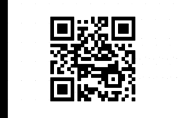

# December 7th: **Can u c?**

**URL:** 

[http://hackvent.hacking-lab.com/challenge.php?day=7](http://hackvent.hacking-lab.com/challenge.php?day=7)

**Hint:**  

*but to see is not to scan*


**Challenge:**  

The challenge is a stereogram [image](images/3DQR.png). 


**Solution:**  
  
The image name leads us to suspect there is a QR code hidden in the stereographic image.   

There is an online viewing utility for stereograms: [http://magiceye.ecksdee.co.uk/](http://magiceye.ecksdee.co.uk/)

Playing around with the slider we get the following image:


We clean this up a bit in Gimp and get:



**Flag:**  

```
HV14-1qqQ-9bKq-4Ku3-8fCG-F6e5
```

