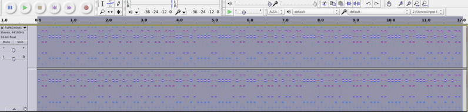

# December 13th: Contact

**URL**

[http://hackvent.hacking-lab.com/challenge.php?day=13](http://hackvent.hacking-lab.com/challenge.php?day=13)

**Hint**

*from outer space*

**Challenge**

We have received a disturbing message from space. Can you understand what they are telling us?


**Solution**

We notice the black dots in the bottom row of the image and interpret this as binary with a small  
python script:


```python
from PIL import Image
import sys

im = Image.open("outerspace.bmp") 
pix = im.load()


(w,h)=im.size
for i in range(0,w):
  (r,g,b) = pix[i,h-1] 
  if r == 0:
    sys.stdout.write("1")
  else:
    sys.stdout.write("0")

```

This outputs:


```
0110100001110100011101000111000000111010001011110010111101101000011000010110
0011011010110111011001100101011011100111010000101110011010000110000101100011
0110101101101001011011100110011100101101011011000110000101100010001011100110
0011011011110110110100101111001101010111011001010000010010110100011101011001
0011000001110100011001000101100000101110011011010111000000110011

```

Decoded to ascii this is:

```
http://hackvent.hacking-lab.com/5vPKGY0tdX.mp3
```

Which gives us an mp3 file with a lot of beeping in it. 

In Audacity, switching to pitch view for the track yielded this binary-looking pattern:




Transcribing this to binary gives:


```
011000010110110001101001011001010110111001101000011000010110
001101101011011000010111010001110100011000010110001101101011
```

Which in turn translates to:

```
alienhackattack
```

We input this into the ball-o-matic to get our bauble:


**Flag**

```
HV14-lHoJ-4A6t-whCg-L6hs-VRaS
```

