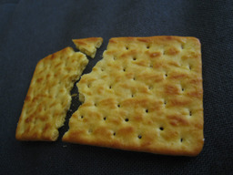

# December 14th: Lunch time

**URL**

[http://hackvent.hacking-lab.com/challenge.php?day=14](http://hackvent.hacking-lab.com/challenge.php?day=14)

**Hint**

*today: crackers*

**Challenge**




Get your lunch here: [CrackBall.zip](images/CrackBall.zip)


**Solution**

The file is a password-protected zip file. 

The image contains a hint about the password:

```
$ exiftool

...
White Balance                   : Manual
Digital Zoom Ratio              : 1
Scene Capture Type              : Standard
XP Comment                      : 5 x lowerleet
Padding                         : (Binary data 2060 bytes, use -b option to extract)
Compression                     : JPEG (old-style)
Thumbnail Offset                : 5012
...

```

So the password would appear to be 5 characteres long, and consisting of lowercase letters and numbers.

fcrackzip does not work correctly with this type of zip file, so we need to find a different zip cracking
tool. We use Accent zip recovery tool to get the first two character quickly, then use Ultimate Zip Cracker 
to get the full password:


```
u2z1p
```

This lets us decompress the zip file and view the bauble inside:


**Flag**

```
HV14-ctc2-jiPs-Y321-Pp9J-9Rxr
```

