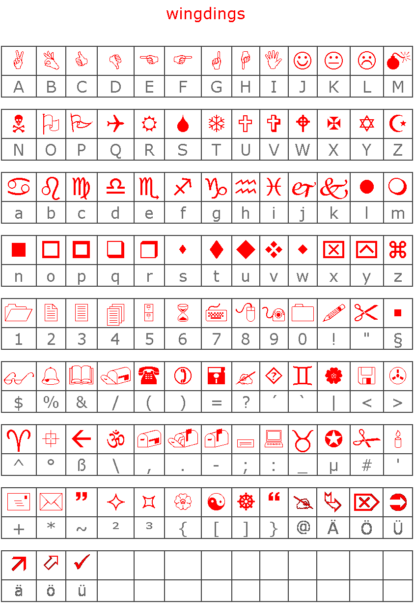

A few weeks before the start of the event, a teaser challenge was
released.

## Challenge

Santa's work has been leaked by a the infamous group "Chuchichästli 1337
".
They were only able to grab the logo, but not to reveal the secret.

Can you help them and find the HACKvent - Nugget
(HV15-aaaa-bbbb-cccc-dddd-eeee)?

In order to get full points, submit the HV-Nugget and a (short)
description how you get it.

*Hint: This is a multistage challenge, with different steps you have to
solve. At the end you will get the final nugget which begins with
"HV15-".*

## Solution

Scanning the QR code of the first bauble gives us:

    nyy lbh arrq vf  urer

which when ROT-13'ed gives:

    all you need is here

We use binwalk to check for secret files hidden within the image file:

    $ binwalk santas_leak_new.png

    DECIMAL   	HEX       	DESCRIPTION
    ---------------------------------------------------------------------------------------
    0         	0x0       	PNG image, 256 x 256, 8-bit/color RGBA, non-interlaced
    76450     	0x12AA2   	RAR archive data
{: .language-bash}

So we see there is a RAR archive appended to the end of the image file.
We can use binwalk to extract it for us:

    $ binwalk -D 'rar archive:rar' santas_leak_new.png
{: .language-bash}

The [rar file](writeupfiles/12AA2.rar) contains a [WAV
file](writeupfiles/2.wav).

The audio file sounds like a series of DTMF sounds. We can decode this
online here: [http://dialabc.com/sound/detect/index.html][1]. This is
the output we get from the site:

    Tone	Start Offset [ms]	End Offset [ms]	Length [ms]
    1	0 ± 15     		301 ± 15   	301 ± 30
    0	331 ± 15   		662 ± 15   	331 ± 30
    6	692 ± 15   		994 ± 15   	301 ± 30
    1	1,054 ± 15 		1,355 ± 15 	301 ± 30
    1	1,385 ± 15 		1,717 ± 15 	331 ± 30
    7	1,747 ± 15 		2,048 ± 15 	301 ± 30
    1 	2,078 ± 15 		2,410 ± 15 	331 ± 30
    1	2,440 ± 15 		2,771 ± 15 	331 ± 30
    5	2,801 ± 15 		3,102 ± 15 	301 ± 30
    1	3,133 ± 15 		3,464 ± 15 	331 ± 30
    1	3,494 ± 15 		3,795 ± 15 	301 ± 30
    6	3,856 ± 15 		4,157 ± 15 	301 ± 30
    3	4,187 ± 15 		4,518 ± 15 	331 ± 30
    2	4,548 ± 15 		4,850 ± 15 	301 ± 30
    1	4,880 ± 15 		5,211 ± 15 	331 ± 30
    1	5,241 ± 15 		5,543 ± 15 	301 ± 30
    2	5,603 ± 15 		5,904 ± 15 	301 ± 30
    1	5,934 ± 15 		6,266 ± 15 	331 ± 30
    1	6,296 ± 15 		6,597 ± 15 	301 ± 30
    1	6,627 ± 15 		6,958 ± 15 	331 ± 30
    1	6,989 ± 15 		7,320 ± 15 	331 ± 30
    1	7,350 ± 15 		7,651 ± 15 	301 ± 30
    5	7,681 ± 15 		8,013 ± 15 	331 ± 30
    1	8,043 ± 15 		8,344 ± 15 	301 ± 30
    1	8,404 ± 15 		8,706 ± 15 	301 ± 30
    5	8,736 ± 15 		9,067 ± 15 	331 ± 30
    1	9,097 ± 15 		9,399 ± 15 	301 ± 30
    0	9,429 ± 15 		9,760 ± 15 	331 ± 30
    5	9,790 ± 15 		10,122 ± 15	331 ± 30
    9	10,152 ± 15		10,453 ± 15	301 ± 30
    8	10,483 ± 15		10,814 ± 15	331 ± 30
    1	10,845 ± 15		11,146 ± 15	301 ± 30
    0	11,176 ± 15		11,507 ± 15	331 ± 30
    8	11,537 ± 15		11,869 ± 15	331 ± 30
    1	11,899 ± 15		12,200 ± 15	301 ± 30
    0	12,230 ± 15		12,562 ± 15	331 ± 30
    1	12,592 ± 15		12,893 ± 15	301 ± 30
    3	12,953 ± 15		13,255 ± 15	301 ± 30
    2	13,285 ± 15		13,616 ± 15	331 ± 30
    1	13,646 ± 15		13,947 ± 15	301 ± 30
    1	13,978 ± 15		14,309 ± 15	331 ± 30
    9	14,339 ± 15		14,670 ± 15	331 ± 30
    1	14,701 ± 15		15,002 ± 15	301 ± 30
    0	15,032 ± 15		15,363 ± 15	331 ± 30
    5	15,393 ± 15		15,695 ± 15	301 ± 30
    1	15,755 ± 15		16,056 ± 15	301 ± 30
    1	16,086 ± 15		16,418 ± 15	331 ± 30
    6	16,448 ± 15		16,749 ± 15	301 ± 30
    1	16,779 ± 15		17,111 ± 15	331 ± 30
    0	17,141 ± 15		17,472 ± 15	331 ± 30
    4	17,502 ± 15		17,803 ± 15	301 ± 30
    1	17,834 ± 15		18,165 ± 15	331 ± 30
    0	18,195 ± 15		18,496 ± 15	301 ± 30
    5	18,557 ± 15		18,858 ± 15	301 ± 30
    1	18,888 ± 15		19,219 ± 15	331 ± 30
    1	19,249 ± 15		19,551 ± 15	301 ± 30
    0	19,581 ± 15		19,912 ± 15	331 ± 30
    3	19,942 ± 15		20,244 ± 15	301 ± 30
    2	20,304 ± 15		20,605 ± 15	301 ± 30
    1	20,635 ± 15		20,967 ± 15	331 ± 30
    1	20,997 ± 15		21,298 ± 15	301 ± 30

looks like decimal-encoded ascii characters

    106 117 115 116 32 112 111 115 115 105 98 108 101 32 119
    105 116 104 105 110 32 115 117 99 104 32 97 32 114 97 114

which translates to

    just possible within such a rar

hmm, what now..? seems to be pointing us back to the direction of the
rar file, could there be anything else hidden?

    $ unrar ltab 12AA2.rar

    UNRAR 5.00 beta 8 freeware      Copyright (c) 1993-2013 Alexander Roshal

    Archive: 12AA2.rar
    Details: RAR 4

            Name: 2.wav
            Type: File
            Size: 470444
     Packed size: 419609
           Ratio: 89%
           mtime: 2015-11-14 11:12,000
      Attributes: ..A....
           CRC32: 7F094717
         Host OS: Windows
     Compression: RAR 3.0(v29) -m3 -md=512K

            Name: STM
            Type: NTFS alternate data stream
          Target: :3.txt
            Size: 490901
     Packed size: 376134
           Ratio: 76%
           mtime: 2015-11-14 11:12,000
      Attributes: .B
           CRC32: 979A0B91
         Host OS: Windows
     Compression: RAR 3.0(v29) -m3 -md=64K

         Service: EOF

Looks like there is an NTFS alternate data stream present. We switch to
Windows and use a tool to extract the ADS

[http://www.nirsoft.net/utils/alternate\_data\_streams.html][2]

We get the following file: [2.wav:3.txt](writeupfiles/2.wav_3.txt.dat),
which looks like base64 encoded data:

    JVBERi0xLjUNCiWhs8XXDQoxIDAgb2JqDQo8PC9UeXBlL0NhdGFsb2cvUGFnZXMg
    MiAwIFIgL0xhbmcoZGUtQ0gpL1N0cnVjdFRyZWVSb290IDE1IDAgUiAvTWFya0lu
    Zm88PC9NYXJrZWQgdHJ1ZT4+L0Fjcm9Gb3JtPDwvRmllbGRzW10+Pi9OYW1lcyA4
    NCAwIFIgPj4NCmVuZG9iag0KMyAwIG9iag0KPDwvVHlwZS9QYWdlL1BhcmVudCAy
    IDAgUiAvUmVzb3VyY2VzPDwvRm9udDw8L0YxIDUgMCBSIC9GMiAxMiAwIFIgPj4v
    RXh0R1N0YXRlPDwvR1M3IDcgMCBSIC9HUzggOCAwIFIgPj4vWE9iamVjdDw8L0lt
    YWdlOSA5IDAgUiAvSW1hZ2UxMCAxMCAwIFIgPj4vUHJvY1NldFsvUERGL1RleHQv
    SW1hZ2VCL0ltYWdlQy9JbWFnZUldPj4vTWVkaWFCb3hbIDAgMCA1OTUuMzIgODQx
    LjkyXS9Db250ZW50cyA0IDAgUiAvR3JvdXA8PC9UeXBlL0dyb3VwL1MvVHJhbnNw
    YXJlbmN5L0NTL0RldmljZVJHQj4+L1RhYnMvUy9TdHJ1Y3RQYXJlbnRzIDA+Pg0K
    ZW5kb2JqDQo0IDAgb2JqDQo8PC9GaWx0ZXIvRmxhdGVEZWNvZGUvTGVuZ3RoIDUw
    [..]

we decode and get the following file:
[base64decoded.bin](writeupfiles/base64decoded.bin)

    $ file base64decoded.bin

    base64decoded.bin: PDF document, version 1.5

Aha! it's a [PDF file](writeupfiles/base64decoded.pdf)

And it contains brainfuck!

    +++++ +++[- >++++ ++++< ]>+++ +++++ .<+++ ++[-> +++++ <]>++ ++.<+ +++[-
    >++++ <]>++ ++.<+ +++++ +++[- >---- ----- <]>-- ----- -.<++ +++++ +[->+
    +++++ ++<]> +++++ +++++ ++.-- ----- ..<++ +[->+ ++<]> +++++ +.-.< +++++
    +++[- >---- ----< ]>--- ----. <+++[ ->--- <]>-- -.<++ ++[-> ----< ]>---
    .---. <++++ +++[- >++++ +++<] >++++ +++++ +++++ .<+++ +++[- >++++ ++<]>
    .<+++ +++++ [->-- ----- -<]>- ----- ----- --.<+ +++++ ++[-> +++++ +++<]
    >++++ +++.+ ++++. <+++[ ->--- <]>-- .+++. <++++ ++++[ ->--- ----- <]>--
    --.<+ +++++ +++[- >++++ +++++ <]>++ +++++ +.<++ +[->- --<]> -.+++ +++.<
    +++++ ++++[ ->--- ----- -<]>- ---.< +++++ +++[- >++++ ++++< ]>+++ +++.+
    +++++ +++.+ +++++ .---- ---.< +++[- >---< ]>-.< +++++ +++[- >---- ----<
    ]>--- -.<++ +++++ ++[-> +++++ ++++< ]>+++ .<+++ [->-- -<]>- --.-- -.<++
    +++++ +[->- ----- --<]> ----- .<+++ +++++ +[->+ +++++ +++<] >++++ ++.<+
    +++[- >---- <]>-- ----. <++++ [->++ ++<]> +++++ +++.< +++++ ++++[ ->---
    ----- -<]>- ----- --.<+ +++++ +++[- >++++ +++++ <]>++ +.--- --.<+ +++++
    ++[-> ----- ---<] >---- ----- ----- -.<++ +++++ ++[-> +++++ ++++< ]>+++
    .<+++ [->-- -<]>- --.+. <+++[ ->+++ <]>+. <++++ +++++ [->-- ----- --<]>
    --.<+ +++++ +++[- >++++ +++++ <]>++ .+.<+ ++[-> ---<] >---- --.<+ ++[->
    +++<] >++.< +++++ +++[- >---- ----< ]>--. <++++ +[->- ----< ]>--- -----
    .---. +++.- --.<+ +++++ ++[-> +++++ +++<] >++++ +++++ .<+++ +[->+ +++<]
    >++.- ---.< ++++[ ->+++ +<]>+ .<+++ [->-- -<]>- ----- .++++ +.<++ +++++
    +[->- ----- --<]> ----- ---.< +++++ ++++[ ->+++ +++++ +<]>+ ++.<+ ++[->
    ---<] >---. ---.< +++++ +++[- >---- ----< ]>--- --.<+ +++++ ++[-> +++++
    +++<] >++++ +++++ +++++ +.+++ ++.<+ ++[-> ---<] >---. ---.< +++[- >+++<
    ]>+++ +.<++ +++++ ++[-> ----- ----< ]>-.< ++++[ ->+++ +<]>+ +.<++ ++[->
    ----< ]>--. <++++ ++++[ ->+++ +++++ <]>++ ++++. +++.+ ++.-- ----- .<+++
    [->++ +<]>+ ++++. <++++ +++++ [->-- ----- --<]> --.<+ +++++ ++[-> +++++
    +++<] >+.<+ ++[-> +++<] >++++ .<+++ [->-- -<]>- .<+++ +++++ [->-- -----
    -<]>- ---.< +++++ ++++[ ->+++ +++++ +<]>+ ++.<+ +++[- >---- <]>-- -.<++
    +[->+ ++<]> +.--- ---.< +++[- >+++< ]>+.- ----- ---.. <++++ ++++[ ->---
    ----- <]>-- ----. <++++ +++++ [->++ +++++ ++<]> +++.- ----. <++++ ++++[
    ->--- ----- <]>-- ----- ----- ---.< +++++ ++++[ ->+++ +++++ +<]>+ ++.<+
    ++[-> ---<] >---. ---.< +++++ +++[- >---- ----< ]>--- --.<+ +++++ ++[->
    +++++ +++<] >++++ +++++ +++++ .---- ----- .<+++ +[->+ +++<] >+++. ----.
    <++++ +++++ [->-- ----- --<]> ---.< +++++ ++++[ ->+++ +++++ +<]>+ +.+.<
    +++[- >---< ]>--- ---.< +++[- >+++< ]>++. <++++ ++++[ ->--- ----- <]>--
    ----- ----- ---.< ++++[ ->--- -<]>- ---.- --.++ +.--- .<+++ +++++ [->++
    +++++ +<]>+ +++++ +++++ ++++. <++++ [->++ ++<]> +++++ +.+++ +++.- --.+.
    <++++ ++++[ ->--- ----- <]>-- ----- .<+++ [->-- -<]>- --.<+ +++++ +++[-
    >++++ +++++ <]>++ .<+++ +[->- ---<] >--.< +++[- >+++< ]>+++ +.+++ +++.<
    ++++[ ->--- -<]>- --.<

We run the brainfuck program (for instance here:
[http://esoteric.sange.fi/brainfuck/impl/interp/i.html][3] )

and get the following output:

    Hey leets,

    Im glad you found the way to this step.

    Search the other 2 files and takeoff to the next step!

    Yours, santa

Hmm.. So there must be more hidden files somewhere..

We use [pdfextract.com](pdfextract.com) to find all files embedded in
the pdf. This gives us the following three images:

The first image is a stereogram. We can find the hidden image using this
website: [http://magiceye.ecksdee.co.uk/][4]

It's windings!

It spells

    ball=sha1([01]{25})

Hmmm... No clue what that means, something involving sha1 hashes..

We keep looking in all files and find another image hidden in the pdf
file using binwalk:

    $ binwalk base64decoded.pdf

    DECIMAL   	HEX       	DESCRIPTION
    -------------------------------------------------------------------------------------------------------
    345872    	0x54710   	PNG image, 120 x 120, 8-bit/color RGB, non-interlaced

We again extract it with binwalk

    $ binwalk -D 'PNG image:png'  base64decoded.pdf

    DECIMAL   	HEX       	DESCRIPTION
    -------------------------------------------------------------------------------------------------------
    345872    	0x54710   	PNG image, 120 x 120, 8-bit/color RGB, non-interlaced

[link](writeupfiles/54710.png)

There is something interesting in the exif data of this image:

    $ exiftool 54710.png ExifTool Version Number         : 9.46
    File Name                       : 54710.png
    Directory                       : .
    File Size                       : 16 kB
    File Modification Date/Time     : 2015:11:15 22:48:34+01:00
    File Access Date/Time           : 2015:11:15 22:48:35+01:00
    File Inode Change Date/Time     : 2015:11:15 22:48:34+01:00
    File Permissions                : rwxrwxrwx
    File Type                       : PNG
    MIME Type                       : image/png
    Image Width                     : 120
    Image Height                    : 120
    Bit Depth                       : 8
    Color Type                      : RGB
    Compression                     : Deflate/Inflate
    Filter                          : Adaptive
    Interlace                       : Noninterlaced
    Gamma                           : 2.2
    White Point X                   : 0.31269
    White Point Y                   : 0.32899
    Red X                           : 0.63999
    Red Y                           : 0.33001
    Green X                         : 0.3
    Green Y                         : 0.6
    Blue X                          : 0.15
    Blue Y                          : 0.05999
    Pixels Per Unit X               : 2834
    Pixels Per Unit Y               : 2834
    Pixel Units                     : Meters
    Software                        : paint.net 4.0.6
    Comment                         : 754c6738acc834944b90b2a9a77bdbacb093f6e4.a1ff6b23bb8ed85b6f0adf9f65f007e9b3e348e0.848fdbfa2d28a1aee0d82c8a707c4d1261f51079.312189262e204aa9027ca64db1d43d1153a860e5.21f4c0b5e077f82739c0748df71610fc6285e768.3ded376898e8843999f1d0df89137308542acac2.a9f2066e530187b9371ada082e11a56127028749.d028c883a63e2232783ea6f54ce6d0091a9d2d84.610bf7f4144cf300ef086254459c427d16767d6a.e56a109aab8b4e9b18e099a8ae1477d8de270149.5de13aa399cf9e3042af96eab88d28def1f58549.a5229747c1437b737ac2cc1567f173d4a4ba12ba.2bb48bc2105ca33f56906d8c6c4b6aec4c16cb58.e7a804128bc3ae8150adeb80ac695fdea0f2b643.12aae009a8d38f6585debaddef79aed5cd858df4.8b7c437b1d8cdbb8a72a9783b3882c87d397c76a.4b1dfd5c05068a37df7ebfef64bb5bc4a8c7daab.7a781addb8ef467884ecb62bbe1bb7d024b0eb83.6d23cafac980692dc7401fd53cf287aec49d4ae2.16f607d441caf3cbda5335bccd2f104da131f2a9.7982fcaa2b59698d3eb5aa05369454b105de6dc3.5e836fbdb63db38d2f9a8604dd90856a9791efce.b5adb5a6cccc137d6851e2fcb5fa276307edf8f4.06004577f5d35b54b80a53a20aedf5895509bffa.1e238015f260d4d485e3e9d64fa17db80eb81708
    Image Size                      : 120x120
^

    754c6738acc834944b90b2a9a77bdbacb093f6e4.a1ff6b23bb8ed85b6f0adf9f65f007e9b3e348e0.848fdbfa2d28a1aee0d82c8a707c4d1261f51079.312189262e204aa9027ca64db1d43d1153a860e5.21f4c0b5e077f82739c0748df71610fc6285e768.3ded376898e8843999f1d0df89137308542acac2.a9f2066e530187b9371ada082e11a56127028749.d028c883a63e2232783ea6f54ce6d0091a9d2d84.610bf7f4144cf300ef086254459c427d16767d6a.e56a109aab8b4e9b18e099a8ae1477d8de270149.5de13aa399cf9e3042af96eab88d28def1f58549.a5229747c1437b737ac2cc1567f173d4a4ba12ba.2bb48bc2105ca33f56906d8c6c4b6aec4c16cb58.e7a804128bc3ae8150adeb80ac695fdea0f2b643.12aae009a8d38f6585debaddef79aed5cd858df4.8b7c437b1d8cdbb8a72a9783b3882c87d397c76a.4b1dfd5c05068a37df7ebfef64bb5bc4a8c7daab.7a781addb8ef467884ecb62bbe1bb7d024b0eb83.6d23cafac980692dc7401fd53cf287aec49d4ae2.16f607d441caf3cbda5335bccd2f104da131f2a9.7982fcaa2b59698d3eb5aa05369454b105de6dc3.5e836fbdb63db38d2f9a8604dd90856a9791efce.b5adb5a6cccc137d6851e2fcb5fa276307edf8f4.06004577f5d35b54b80a53a20aedf5895509bffa.1e238015f260d4d485e3e9d64fa17db80eb81708
^

    754c6738acc834944b90b2a9a77bdbacb093f6e4
    a1ff6b23bb8ed85b6f0adf9f65f007e9b3e348e0
    848fdbfa2d28a1aee0d82c8a707c4d1261f51079
    312189262e204aa9027ca64db1d43d1153a860e5
    21f4c0b5e077f82739c0748df71610fc6285e768
    3ded376898e8843999f1d0df89137308542acac2
    a9f2066e530187b9371ada082e11a56127028749
    d028c883a63e2232783ea6f54ce6d0091a9d2d84
    610bf7f4144cf300ef086254459c427d16767d6a
    e56a109aab8b4e9b18e099a8ae1477d8de270149
    5de13aa399cf9e3042af96eab88d28def1f58549
    a5229747c1437b737ac2cc1567f173d4a4ba12ba
    2bb48bc2105ca33f56906d8c6c4b6aec4c16cb58
    e7a804128bc3ae8150adeb80ac695fdea0f2b643
    12aae009a8d38f6585debaddef79aed5cd858df4
    8b7c437b1d8cdbb8a72a9783b3882c87d397c76a
    4b1dfd5c05068a37df7ebfef64bb5bc4a8c7daab
    7a781addb8ef467884ecb62bbe1bb7d024b0eb83
    6d23cafac980692dc7401fd53cf287aec49d4ae2
    16f607d441caf3cbda5335bccd2f104da131f2a9
    7982fcaa2b59698d3eb5aa05369454b105de6dc3
    5e836fbdb63db38d2f9a8604dd90856a9791efce
    b5adb5a6cccc137d6851e2fcb5fa276307edf8f4
    06004577f5d35b54b80a53a20aedf5895509bffa
    1e238015f260d4d485e3e9d64fa17db80eb81708

These could be the SHA1 hashes alluded to by the wingdings.

It cannot be the SHA1 encryption of the final key, as that would take
too long too bruteforce with 20 unknown characters:

    HV15-aaaa-bbbb-cccc-dddd-eeee

We need to know more about the possible strings the SHA1 hashes encode..

Ah, but that is exactly what the windings were trying to tell us!

    ball=sha1([01]{25})

The sha1 hashes encode 25-character long binary strings, and that is
something we can easily bruteforce:

    import hashlib
    import itertools

    target=["754c6738acc834944b90b2a9a77bdbacb093f6e4",
    "a1ff6b23bb8ed85b6f0adf9f65f007e9b3e348e0",
    "848fdbfa2d28a1aee0d82c8a707c4d1261f51079",
    "312189262e204aa9027ca64db1d43d1153a860e5",
    "21f4c0b5e077f82739c0748df71610fc6285e768",
    "3ded376898e8843999f1d0df89137308542acac2",
    "a9f2066e530187b9371ada082e11a56127028749",
    "d028c883a63e2232783ea6f54ce6d0091a9d2d84",
    "610bf7f4144cf300ef086254459c427d16767d6a",
    "e56a109aab8b4e9b18e099a8ae1477d8de270149",
    "5de13aa399cf9e3042af96eab88d28def1f58549",
    "a5229747c1437b737ac2cc1567f173d4a4ba12ba",
    "2bb48bc2105ca33f56906d8c6c4b6aec4c16cb58",
    "e7a804128bc3ae8150adeb80ac695fdea0f2b643",
    "12aae009a8d38f6585debaddef79aed5cd858df4",
    "8b7c437b1d8cdbb8a72a9783b3882c87d397c76a",
    "4b1dfd5c05068a37df7ebfef64bb5bc4a8c7daab",
    "7a781addb8ef467884ecb62bbe1bb7d024b0eb83",
    "6d23cafac980692dc7401fd53cf287aec49d4ae2",
    "16f607d441caf3cbda5335bccd2f104da131f2a9",
    "7982fcaa2b59698d3eb5aa05369454b105de6dc3",
    "5e836fbdb63db38d2f9a8604dd90856a9791efce",
    "b5adb5a6cccc137d6851e2fcb5fa276307edf8f4",
    "06004577f5d35b54b80a53a20aedf5895509bffa",
    "1e238015f260d4d485e3e9d64fa17db80eb81708"]

    alphabet = "01"

    perms=itertools.product(alphabet,repeat=25)

    solutions=[0]*25
    for p in perms:
        t = ''.join(p)
        s= hashlib.sha1(t).hexdigest()

        if s in target:
            solutions[target.index(s)]=t

    for s in solutions:
        print s

{: .language-python}

after less than a minute we get the following output:

    0000000111110111110000000
    0111110101010101010111110
    0100010111110010010100010
    0100010100010111110100010
    0100010110111100110100010
    0111110100100111110111110
    0000000101010101010000000
    1111111001101101001111111
    0000010111011101111010101
    1001001110101011111101111
    1011110000110010110111100
    0001101010001111110111010
    0111100101101111110001110
    0101011101000000000101110
    0110100101011000001011101
    0110101111001011100111100
    0110000000101100110001110
    1111111010011011101100101
    0000000100011101010100110
    0111110111111010011101101
    0100010101011101000001110
    0100010100100101101001010
    0100010101100111010100110
    0111110100011000110010011
    0000000100100100000010110

That looks suspiciously like a QR code!!

let's turn it into an image with python:

    from PIL import Image

    bitstring="0000000111110111110000000011111010101010101011111001000101111100100101000100100010100010111110100010010001011011110011010001001111101001001111101111100000000101010101010000000111111100110110100111111100000101110111011110101011001001110101011111101111101111000011001011011110000011010100011111101110100111100101101111110001110010101110100000000010111001101001010110000010111010110101111001011100111100011000000010110011000111011111110100110111011001010000000100011101010100110011111011111101001110110101000101010111010000011100100010100100101101001010010001010110011101010011001111101000110001100100110000000100100100000010110"

    outimg= Image.new("RGB",(25,25),"black")
    pixels_out = outimg.load()

    count=-1
    for i in range(0,25):
        for j in range (0,25):
            count+=1
            if bitstring[count]=="1":
                pixels_out[(j,i)]=(255,255,255)

    outimg=outimg.resize((100,100))
    outimg.save("qrout.png","png")
{: .language-python}

Hmm, seems not quite readable..

Below is an explanation of the QRcode format:

* * *

* The three large squares highlighted in red are the position markers.
  These tell the scanner where the edges of the code are.
* The smaller red square is an alignment marker. This acts as a
  reference point for the scanner, making sure everything lines up
  properly. In bigger codes, there are several of these squares.
* The red strips of alternating black and white modules are called
  timing patterns. They define the positioning of the rows and columns.
* The green sections determine the format. This tells the scanner
  whether it’s a website, text message, Chinese symbols, numbers, or any
  combination of these.
* The modules highlighted in blue represent the version number.
  Basically, the more modules in the code, the higher the version (up to
  v40, which is 177×177 modules). If the code is version 6 or smaller,
  the version does not need to be defined here because the scanner can
  literally count the modules and determine the version on its own.

* * *

The red areas should always be the same for any QR code, but we see that
four ours it is not. We also notice that the areas in the inner square
of the QR code overlapping the red zones are exactly inverse of what
they should be. So we invert the pixels in that area to fix this QR code
image.

Whoohoo!! This QR code is readable and gives us the final flag:

    HV15-W!ll-R0ck-t#i$-xM4s-H0b0

[1]: http://dialabc.com/sound/detect/index.html
[2]: http://www.nirsoft.net/utils/alternate_data_streams.html
[3]: http://esoteric.sange.fi/brainfuck/impl/interp/i.html
[4]: http://magiceye.ecksdee.co.uk/
