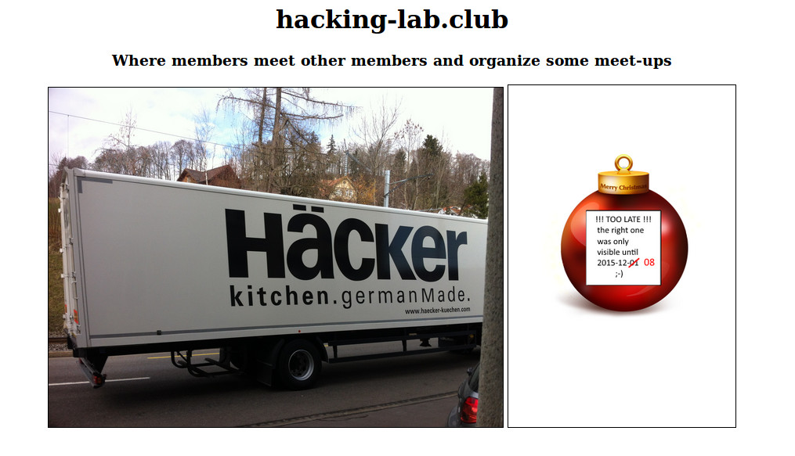

## Challenge

*world*

    Ns ly ns! Hy esy dnmru Yerdg mw xux e parri ser kz epv? Lsv iuy roxhw s nezo g wtoimev xmhnri: Jsth xrk
    tmmzyvo o'zi lkir rohmxm hsehpc puv cya. Jmbyx cya amvr jmxj mx rohhot sr dni lkiozotx woxzib grh dnir
    ... knq, ry, lmrn zli sjirdogev oqeqk csexwivl mr dni ayxph gohi gkf. Lk ne lk, tmgo psoo cled? Hyx sz'w
    xrk xvezl, cya lefk xs nu xlkz! Lezvc enbird, esyby Wexze

## Solution

Looks like a letter. Could start with "ho ho ho" and end with "Santa".
If so this is not a simple substitution cipher, perhaps vigenere? We try
the online solver here: http://www.guballa.de/vigenere-solver and find
the decryption:

    (key= "geek" )

    Ho ho ho! Do you think Santa is not a funny man at all? For you nerds i have a special riddle: Find the
    picture i've been hiding doubly for you. First you will find it hidden on the hackvent server and then
    ... ahm, no, find the identical image yourself in the world wide web. Ha ha ha, nice joke what? But it's
    the truth, you have to do that! Happy advent, yours Santa

Hmm..

Let's check out the `robots.txt` file to see if anything is hidden from
crawlers:

    Disallow: /MeMyselfAndI-surfingInTheSky/hacker.jpg

aha, we have our hidden image:

Santa's message seems to suggest we need to find that same image on the
web. Let's try Google image search. We get a hit on
`http:\\hacking-lab.club`, which shows the following:

hmm, it would appear we need to look at what the website looked like
before the start of the CTF. Let's ask the [wayback machine][1]. We see
that there is an archived version from December 8, as the bauble image
suggests. Unfortunately the images themselves weren't cached, but we can
see that the image next to the truck used to be `work.png`, so we look
at `http:\\hacking-lab.club\work.png` and sure enough we find the real
bauble image:

Scanning the code gives the nugget.

[1]: http://archive.org/web/
