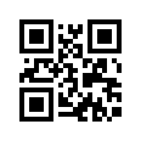

## Challenge

... if you can

## Solution

We get an animated GIF images of a QR code. We see there are 29 frames,
each with a small QR code. Manually reading the QR code of the first
frame results in the letter 'H', so it would appear each frame contains
one letter of the nugget.

We extract an read each frame of the gif and read the resulting QR code
in python:

    import os, re
    from PIL import Image
    from qrtools import QR

    def extractFrames(giffile, outputdir):
        with Image.open(giffile) as frame:
            nframes = 0
            while frame:
                frame.save( '%s/%s-%s.gif' % (outputdir, os.path.basename(giffile), nframes ) , 'GIF')
                nframes += 1
                try:
                    frame.seek( nframes )
                except EOFError:
                    break;
            return True

    # extract every fram
    extractFrames('fast_response_code.gif', 'dec3_frames')

    # read qr code in each extracted image
    path="./dec3_frames/"

    nugget=''
    for filename in sorted(os.listdir(path), key=lambda x: int(re.findall(r'\d+', x)[0])):
        myCode = QR(filename=path+filename)
        if myCode.decode():
          nugget+=myCode.data_to_string()

    print nugget
{: .language-python}

