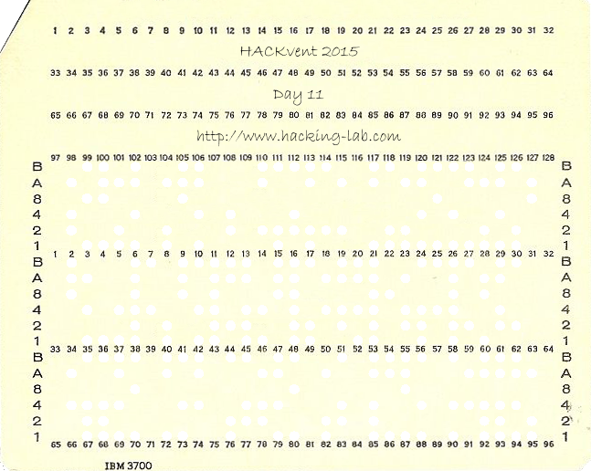
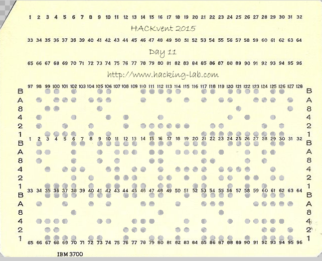
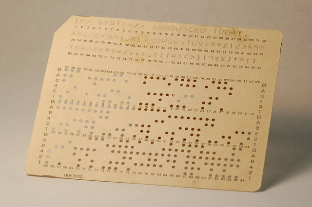

## Challenge

*good old times*

Most of you have not experienced this.
Maybe your grandfather can help you out today!

## Solution

I always like it when a challenge teaches me something completely new.

After some Googling we find out this is an IBM 96 column punch card. It
has three rows of 32 characters each, so can encode a message of 96
characters. Each character is represented by a set of holes in the rows

labelled B,A,8,4,2,1

The holes in our challenge are indicated by transparent holes

Conveniently, we also find an image online containing all possible
characters:

so `BA---1` signifies letter A, `BA--2-` signifies B, etc. We use this
to translate the message.

    # let binary string represent the punches (1=punched, 0=not punched)
    # 110001 = A, 110010=B etc
    #

    holes2ascii = {'110001':'A', '110010':'B', '110011':'C', '110100':'D',
                   '110101':'E', '110110':'F', '110111':'G', '111000':'H',
                   '111001':'I', '100001':'J', '100010':'K', '100011':'L',
                   '100100':'M', '100101':'N', '100110':'O', '100111':'P',
                   '101000':'Q', '101001':'R', '010010':'S', '010011':'T',
                   '010100':'U', '010101':'V', '010110':'W', '010111':'X',
                   '011000':'Y', '011001':'Z', '000001':'1', '000010':'2',
                   '000011':'3', '000100':'4', '000101':'5', '000110':'6',
                   '000111':'7', '001000':'8', '001001':'9', '010000':'0',
                   '001100':'@', '001011':'#', '101100':'*', '101011':'$',
                   '100000':'-', '010001':'/', '011011':',', '111011':'.',
                   '111110':'+', '011101':'_', '101010':':', '001010':'-??-',
                   '101110':';', '001110':'=', '011010':'&', '111100':'<',
                   '011110':'>', '110000':'}', '111111':'|', '101111':'-??-',
                   '111010':'-??-', '011100':'%', '011111':'?', '001101':"'",
                   '001111':'"', '111101':'(', '101101':')', '000000':' '
                   }

    # get the holes per word
    message ='010110 101001 111001 010011 110101 000000 010011 111000 110101 000000 000110 000000 110010 100011 100110 110011 100010 010010 000000 110001 100011 010011 110101 101001 100101 110001 010011 110101 100011 011000 000000'
    message+='111000 010101 000001 000101 111111 100100 000011 111000 100101 111111 110010 110111 000101 111000 111111 100011 010100 110110 110101 111111 001000 010110 100111 100100 111111 100010 011001 110110 100010 000000'
    message+='010100 100111100111110101101001000000 110001100101110100000000 100011100110010110110101101001000000 010011100110000000 110111110001111001100101000000 100101010100110111110111110101010011000000'

    message = message.replace(' ','')
    letters=map(''.join, zip(*[iter(message)]*6))

    print ''.join(holes2ascii[l] for l in letters)
{: .language-python}

Output:

    WRITE THE 6 BLOCKS ALTERNATELY HV15|M3HN|BG5H|LUFE|8WPM|KZFK UPPER AND LOWER TO GAIN NUGGET

we do what it says, starting with uppercase block to conform to the
nugget format.

