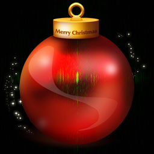

## Challenge

... here it is, but will you be able to reveal it's secret?

*BALL-O-MATIC*

There are days, in which you don't get immediately the HV15-Nugget. This
is such a day!
Put the resulting flag or sentence of the day here and get the only
counting HV15-Nugget

## Solution

So we are looking for a hidden message, but it will not be the `HV15-`
string.

Playing around with various settings in GIMP we can see that there are
some letters hidden in the images, but we can't quite make out what it
says:

We check out the pixel values in python and notice that most values are
odd..

Hmm, lets see what we get when we only output the pixels with even pixel
value in the red channel:

    from PIL import Image

    img = Image.open('ball_3h6SOemwRR_PmQhXh2AM.png')
    pixels_orig = img.load()
    (w,h)=img.size

    outimg = Image.new( 'RGB', (w,h), "white")
    pixels_out = outimg.load()

    for i in range(0,h):
        for j in range(0,w):
          (r,g,b) = pixels_orig[j,i]
          if(r%2==0):
              pixels_out[j,i]=(0,0,0)

    outimg.save("dec13_evenredval.png","png")
{: .language-python}

We get the following image:

Aha! seems like we're on the right track :) ..Let's check out the other
channels. The green channel gives nothing, but blue yields:

XKCD comic 26 is:

Ok, let's try taking the fourier transform with imagemagick:

    $ convert ball_3h6SOemwRR_PmQhXh2AM.png -fft  +depth +adjoin fourier-%d.png
{: .language-bash}

this gives two images, the magnitude and the phase:

The magnitude image may appear black, but contains more information than
meets the eye. We enhance the image with a log transform to produce a
*frequence spectrum* image:

    $ convert fourier-0.png -auto-level -evaluate log 12000 spectrum.png
{: .language-bash}

We see text in the spectrum! ..this must be what we put in the
ball-o-matic to get our nugget.

    f0uRier-ru1ez

Indeed it was, our ball-o-matic turns into our bauble with QR code:

