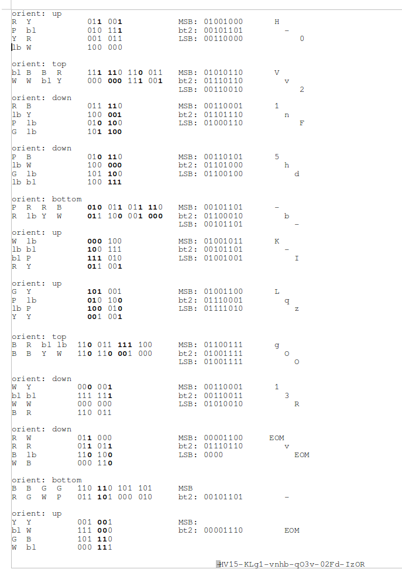

## Challenge

*Enhancement made worse*

Santa was disappointed about the small QR's: they couldn't store enough
data to flag each gift uniquely for his 8 billion customers.
Promptly he removed some unnecessary features and added a few
trailblazing new ones.
Now he's capable to store a mupltiple of the previous amount, 3 times
more, or even more.

Here is your gift:

... extract your nugget with your self made scanner!

## Solution

This one nearly broke my brain. We had to delve into the nitty gritty
details of the QR format and extend it to RGB.

There is a great video about how to decode a QR code by hand here:
https://www.youtube.com/watch?v=KA8hDldvfv0
And the wikipedia entry was extremely useful as well:
https://en.wikipedia.org/wiki/QR\_code

The video does a much clearer job of explaining the process, but I will
run through it here too:

If we assume each cell in the QR code now contains 3 bits, there are
basically 3 QR codes interwoven.
Since in normal QR codes black=1, white=0, we extend this to the colours
using CMY instead of RGB:

    RGB
    111 black  (bl)
    110 blue   (B)
    101 green  (G)
    100 l.blue (lb)
    011 red    (R)
    010 purple (P)
    001 yellow (Y)
    000 white  (W)

These images explain the QR format:

We see from the right bottom segment that this QR code uses byte
encoding, so can produce any ASCII character.

We also see that the mask pattern bits are `Blue-Black-Blue`. Since we
have 3 bits per cell we can have a different masking pattern per
channel:

    masking:
    B-bl-B
    110 111 110

    MSB channel : 111
    bit2 channel: 111
    LSB channel : 010

So in the most significant bit channel (MSB) and the middle bit channel,
the masking pattern is that of 111 (all black), and in the least
significant bit channel it is the pattern for 010 (white-black-white).

From the image above we can see that its the following mask patterns,
where 1 means invert that bit, and 0 means don't invert. These mask
patterns align to the bottom right corner and repeat in all directions.

    111= 100100      010: 101010
         100100           000111
         100100           100011
         100100           010101
         100100           111000
         100100           011100

Now the next block of eight above the encoding block specify the length,
which we just skip, and after that the message starts. The orientation
of the blocks determines which cells represent the most through least
significant bits
The image shown above numbers the cells in a block from most significant
(1) to least significant (8), let's rewrite that to use powers of two:

    orient: up      orient: top      orient: down     orient: bottom
    1  2            4  8  16  32     64 128           1  2  64 128
    4  8            1  2  64  128    16 32            4  8  16 32
    16 32                            4  8
    64 128                           1  2

Now we get to the actual decoding. For each block in the path, we note
the color of all cells, transcribe this to three bits per cell,
apply the mask pattern, get the eight bits per channel, and convert this
to the corresponding ascii char. If we encounter `0000`, that signifies
end of message.

Below is the manual process I performed to solve this:

*NOTE: bold means bit is covered by masking pattern and should be
inverted*

Reading the letters from most significant bit channel first then
repeating the process in the second and third channels and concatenating
the text gives us the nugget.

