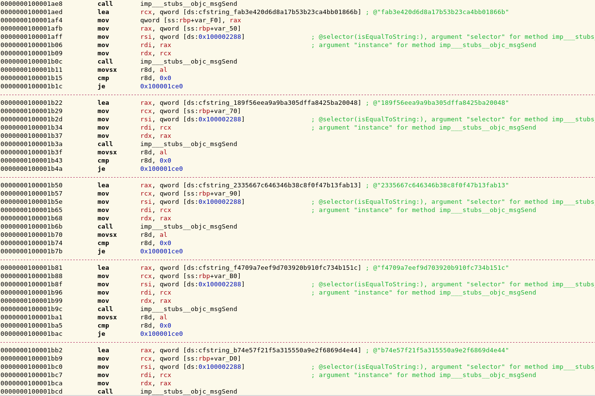

## Challenge

*bite the sour apple*

This time the key is not encrypted, but verified. Can you still recover
the daily code?

[file](writeupfiles/dec18_hv15_syiYLIcPSF-50bmTAyGb)

## Solution

We get a Mach-o executable. We disassemble the file and see a series of
base64 encodings followed by MD5 hashings followed by string
comparisons:

The target strings are the following:

    fab3e420d6d8a17b53b23ca4bb01866b
    189f56eea9a9ba305dffa8425ba20048
    2335667c646346b38c8f0f47b13fab13
    f4709a7eef9d703920b910fc734b151c
    b74e57f21f5a315550a9e2f6869d4e44
    40abc257b6f0e0420dc9ae9ba19c8c8c

There are six target strings, which is exactly the number of fragments
in a nugget, so it looks like the program checks whether the md5 sum of
each base64 encoded nugget fragment is equal these hexstrings. We verify
this by testing it for the first fragment, which we know to be `HV15`:

    $ python
    >>> import base64,md5
    >>> m=md5.new()
    >>> m.update(base64.b64encode('HV15'))
    >>> m.hexdigest()
    'fab3e420d6d8a17b53b23ca4bb01866b'

So we see that we were correct. Now it is just a matter of finding the
rest of the 4-letter fragments, which we can easily bruteforce:

    import base64
    import md5
    import itertools

    targets=['fab3e420d6d8a17b53b23ca4bb01866b',
             '189f56eea9a9ba305dffa8425ba20048',
             '2335667c646346b38c8f0f47b13fab13',
             'f4709a7eef9d703920b910fc734b151c',
             'b74e57f21f5a315550a9e2f6869d4e44',
             '40abc257b6f0e0420dc9ae9ba19c8c8c']

    alphabet='abcdefghijklmnopqrstuvwxyzABCDEFGHIJKLMNOPQRSTUVWXYZ0123456789'

    # try all 4 letter fragments of the nugget, md5(base64(fragment)) must equal one of the targets
    for fragment in itertools.product(alphabet,repeat=4):
        fragment = ''.join(fragment)
        m=md5.new()
        m.update( base64.b64encode(fragment) )
        if m.hexdigest() in targets:
            print 'Found fragment: '+fragment+' ('+m.hexdigest()+')'
{: .language-python}

This outputs:

    Found fragment: AHzP (b74e57f21f5a315550a9e2f6869d4e44)
    Found fragment: BcJH (2335667c646346b38c8f0f47b13fab13)
    Found fragment: HV15 (fab3e420d6d8a17b53b23ca4bb01866b)
    Found fragment: N8tK (f4709a7eef9d703920b910fc734b151c)
    Found fragment: QmHY (40abc257b6f0e0420dc9ae9ba19c8c8c)
    Found fragment: 9aSY (189f56eea9a9ba305dffa8425ba20048)

We put together the nugget by placing the fragments in the same order as
the strings are checked in the executable.

