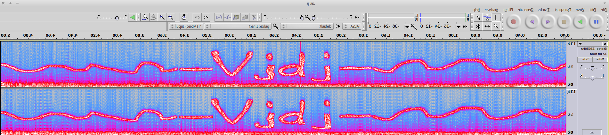
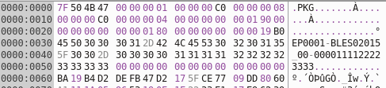

## Challenge

*with your hacking fu*

our team was able to download the daily code from santas computer. sadly
its somehow obfuscated and hidden - we are not able to extract the code.

can you help us to save xmas and find the code?

[solve\_me.zip](writeupfiles/solve_me.zip)

## Solution

We get a virtual hard disk image. We mount this and find a cd rom image.

We mount this too

    mkdir /mnt/HV15
    mount -t iso9660 somefile /mnt/HV15

and find 5 files labelled part 1 throught part5.

    $ tree
    .
    ├── readme.txt
    ├── $RECYCLE.BIN
    │   └── S-1-5-21-2161969326-774472170-822451778-1002
    │       └── desktop.ini
    ├── somefile
    ├── Somefile
    │   ├── HV15.txt
    │   ├── part1
    │   │   ├── code
    │   │   └── pass
    │   ├── part1.zip
    │   ├── part2
    │   │   └── murtceps
    │   ├── part3
    │   ├── part4.pkg
    │   └── part5_uu
    └── System Volume Information
        └── tracking.log

HV15.txt:

    HV15-part1-part2-part3-part4-part5

readme.txt:

    no hints here. ho ho ho.

               _

              {_}

              / \

             /   \

            /_____\

          {`_______`}

           // . . \\

          (/(__7__)\)

          |'-' = `-'|

          |         |

          /\       /\

         /  '.   .'  \

        /_/   `"`   \_\

       {__}###[_]###{__}

       (_/\_________/\_)

           |___|___|

            |--|--|

           (__)`(__)

So it appears we need to solve 5 smaller challenges to get the nugget:

*Part1*

We get a zip file containing two files, `code`, a password-protected
archive, and `pass`, a data file.

A closer look at `pass` file shows:

    000eccd0  70 61 77 73 70 61 77 73  70 61 77 73 70 61 77 73  |pawspawspawspaws|
    000ecce0  78 56 34 12 78 56 34 12  78 56 34 12 78 56 34 12  |xV4.xV4.xV4.xV4.|
    000eccf0  34 33 32 31 38 37 36 35  34 33 32 31 38 37 36 35  |4321876543218765|

do we need to swap the bytes order?

    from array import array

    filename = 'dec22/Hackvent-cd/part1/pass'
    outfile = 'dec22_part1_output'

    a = array("I", open(filename, "rb").read())
    a.byteswap()
    open(outfile, "wb").write(a.tostring())
{: .language-python}

and we see we get an [mp3 file](writeupfiles/dec22_part1_output):

    $ file dec22_part1_output
    dec22_part1_output: Audio file with ID3 version 2.3.0, contains: MPEG ADTS, layer III, v1, 128 kbps, 44.1 kHz, Stereo

    $ exiftool dec22_part1_output
    ExifTool Version Number         : 10.00
    File Name                       : dec22_part1_output
    Directory                       : ../../..
    File Size                       : 947 kB
    File Modification Date/Time     : 2016:01:14 16:43:16+01:00
    File Access Date/Time           : 2016:01:14 16:43:14+01:00
    File Inode Change Date/Time     : 2016:01:14 16:43:16+01:00
    File Permissions                : rw-rw-r--
    File Type                       : MP3
    File Type Extension             : mp3
    MIME Type                       : audio/mpeg
    MPEG Audio Version              : 1
    Audio Layer                     : 3
    Audio Bitrate                   : 128 kbps
    Sample Rate                     : 44100
    Channel Mode                    : Stereo
    MS Stereo                       : Off
    Intensity Stereo                : Off
    Copyright Flag                  : False
    Original Media                  : False
    Emphasis                        : None
    ID3 Size                        : 1024
    Comment                         : pw=songtitle - walking on "x_x_x"
    Genre                           : HACKvent
    Duration                        : 0:01:00 (approx)
{: .language-bash}

So we see a hint to the archive password in the exifdata of this file:

    pw=songtitle - walking on "x_x_x"

Hmm, it's just the intro to the song and I don't recognize it..

    fragment 1:

*Part2*

murtceps (spectrum spelled backwards) is a wav file. We open the audio
file in Audacity and find the nugget fragment in the spectogram view:

the letters still look a bit weird, but when we invert it (like the word
murtceps was) it looks better:

    fragment 2: Vjdj

*Part3*

    N=8ED6168915ED61C560B04D212FC032C107B8BA9BF1179B97DEABFA71F111E749
    C=39C9FB8503B3F73BB24069AFE0F2C0416177A40EE60E57134C00ABE8BEDE45BD

This looks like RSA. The RSA cryptosystem is explained [here][1].

So we first need to factor N into prime factors. `N` is quite large so
hard it would be hard to calculate, but luckily there is a database
online, factordb.com which knows the prime factors `p` and `q` for our
`N`:

    N=64606685304927935569594948677404361910558586233909578594144327870534942582601
    p=237024794671302122535260220812153587643
    q=272573531366295567443756143024197333707

We now let `r=(p-1)(q-1)`, and find two integers, `e` and `d` such that:

    e*d mod r = 1
    e and N relatively prime
    d and N relatively prime
    e and r relatively prime
    d and r relatively prime

according to the wiki page, `65537` is a commonly used value for e.
Using that knowledge we try to find `d` and decrypt the ciphertext using
python:

    from Crypto.PublicKey import RSA
    import gmpy2

    N = 64606685304927935569594948677404361910558586233909578594144327870534942582601L
    C = "39C9FB8503B3F73BB24069AFE0F2C0416177A40EE60E57134C00ABE8BEDE45BD".decode("hex")

    # prime factors we found via factordb.com
    p = 237024794671302122535260220812153587643L
    q = 272573531366295567443756143024197333707L

    r=(p-1)*(q-1)

    # find e and d
    # divm(a, b, m) returns x such that b * x == a modulo m. Raises a ZeroDivisionError exception if no such value x exists.
    e = 65537L # our guess for e
    d = long(gmpy2.divm(1, e, r))

    rsa = RSA.construct((N,e,d,p,q))
    pt = rsa.decrypt(C)

    print "fragment 3:", pt
{: .language-python}

which outputs:

    fragment 3: PN0Z

*Part4*

we have a [`.pkg` file](writeupfiles/dec22/Hackvent-cd/part4.pkg).
Opening in a hexeditor we see:

Google tells us `EP0001` signifies a Playstation package. We find a tool
that can extract this ([rar
file](writeupfiles/dec22/Hackvent-cd/PSN.PKG.Decryptor.&.Extractor.v1.30-LMAN-ConsoleCrunch.rar))

after extraction we get a file named `play` with the following content:

    print BCES01175[8]+BLES01403[0]+BLES00158[0]+BLES00314[6]

Googling again tells us those are identifiers for other Playstation
packages:

    BCES01175 - Uncharted 3: Drake's Deception
    BLES01403 - Hitman Absolution
    BLES00158 - Assassins Creed
    BLES00314 - FIFA 09

we now get the appropriate character from each string to form our
fragment:

    fragment 4: dHA9

*Part5*

the suffix `_uu` hints that this is uu encoded data, we decode in
python:

    import binascii

    with open('dec22/Hackvent-cd/part5_uu') as f:
        data=f.read()

    print data

    print binascii.a2b_uu(data)
{: .language-python}

this outputs

    TmZjTg==

which is base64 encoding of the following nugget fragment

    fragment 5: NfcN

[1]: http://en.wikipedia.org/wiki/RSA_(cryptosystem)
