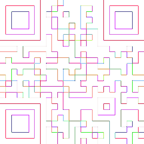
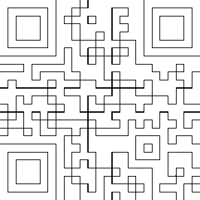

## Challenge

*Go find the codes!*

Will you manage to recover today's code from this strange picture?

It looks like a maze of some kind, and somewhere deep inside there might
be more than what you'd expect at the first glance...

## Solution

This is clearly a QR code we have to fix, the title hints at a maze. We
see some lines are very light
and not clear to the naked eys, so we make anything that is not white
black:

Now we simply start coloring the corners, and any areas adjacent to
black we make white and vice versa
to get the nugget:

