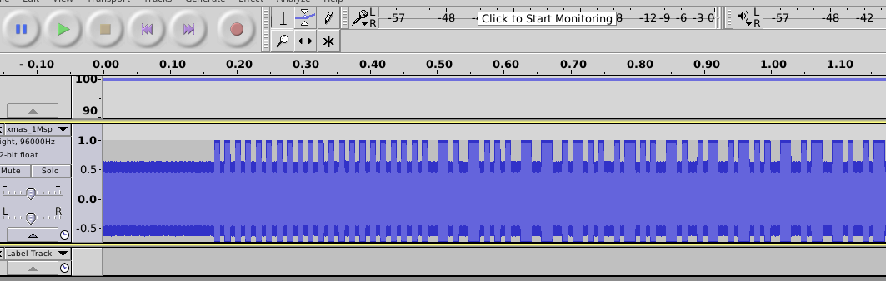

## Challenge

*The quieter you become, the more you are able to hear*

A UK football fan transmits chants and hopes the gods of football pick
it up and consider his favorite, Manchester, to win the cup.

Santa, while using his ham radio station to receive wish-lists from
earth, picked it up and saved a copy for his data lake. Can you help
Santa to make sense of the signals?

## Solution

We open the file in audacity:

and manually decode using Manchester encoding (as indicated by challenge
description)

    01001000 01010110 00110001 00110110 00101101 00110001 00110011 00110011 00110111 00101101 01010010 01100001 01100100 01101001 00101101 01101111 01010111 01100001 01110010 00101101 01100111 01100001 01101101 01100101 00101101 00110001 00110011 00110011 00110111

This gives us the nugget when converted to ascii

