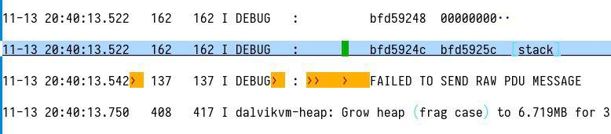
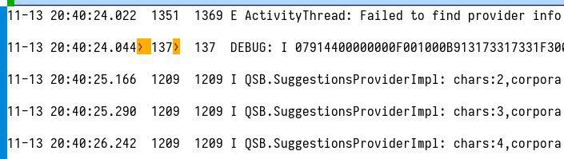

## Challenge

*Lost in messages*

I found those strange entries in my Android logcat, but I don't know
what it's all about... I just want to read my messages!

[Get the logcat](writeupfiles/logcat.txt)

## Solution

This is a long logcat file, but we notice that only two lines have raw
tabs,
suggesting they were manually added for the challenge:

which are the following lines:

    11-13 20:40:13.542	 137   137 I DEBUG	 : 			FAILED TO SEND RAW PDU MESSAGE

    [..]

    11-13 20:40:24.044	137	  137  DEBUG: I 07914400000000F001000B913173317331F300003AC7F79B0C52BEC52190F37D07D1C3EB32888E2E838CECF05907425A63B7161D1D9BB7D2F337BB459E8FD12D188CDD6E85CFE931

This seems to be a raw SMS format, which we can decoded here:

https://www.diafaan.com/sms-tutorials/gsm-modem-tutorial/online-sms-pdu-decoder/

or using a python script:

    $ pip install python-gsmmodem
{: .language-bash}

    import gsmmodem
    import json

    PDU='07914400000000F001000B913173317331F300003AC7F79B0C52BEC52190F37D07D1C3EB32888E2E838CECF05907425A63B7161D1D9BB7D2F337BB459E8FD12D188CDD6E85CFE931'

    decoded = gsmmodem.pdu.decodeSmsPdu(PDU)
    print json.dumps(decoded, indent=4)
{: .language-python}

    {
        "reference": 0,
        "protocol_id": 0,
        "text": "Good Job! Now take the Flag: HV17-th1s-isol-dsch-00lm-agic",
        "smsc": "+44000000000",
        "number": "+13371337133",
        "type": "SMS-SUBMIT",
        "tpdu_length": 64
    }

So the flag is in the SMS!

